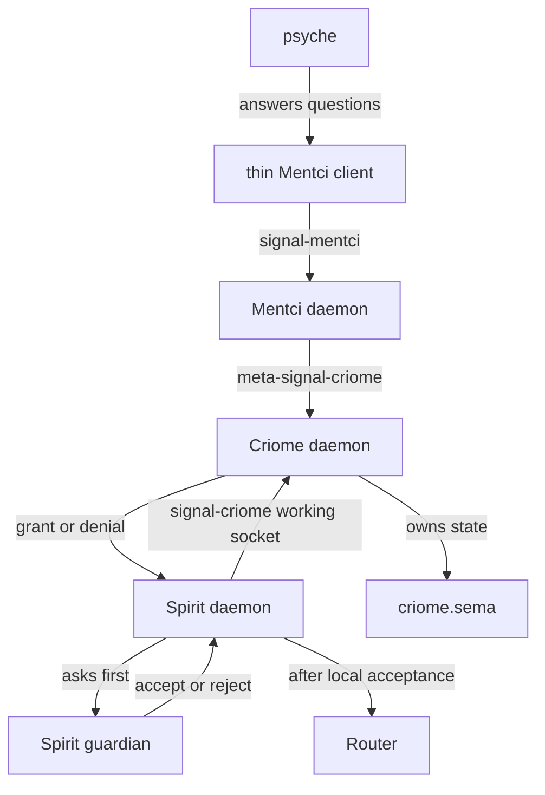
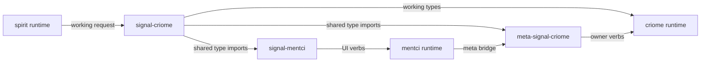
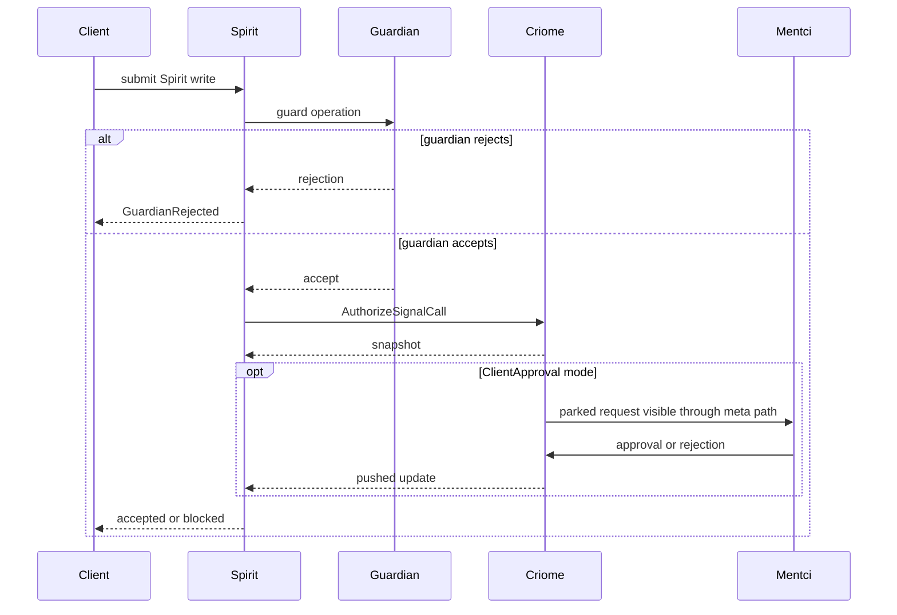
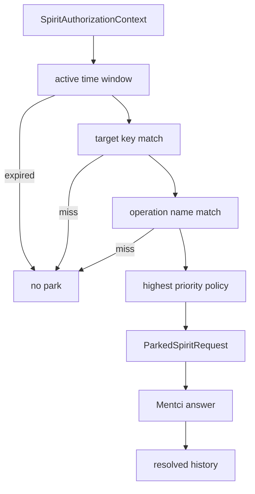
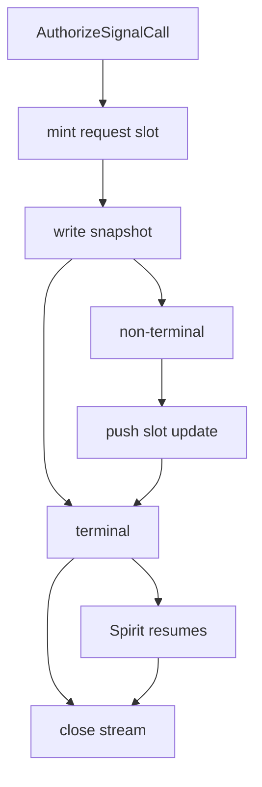
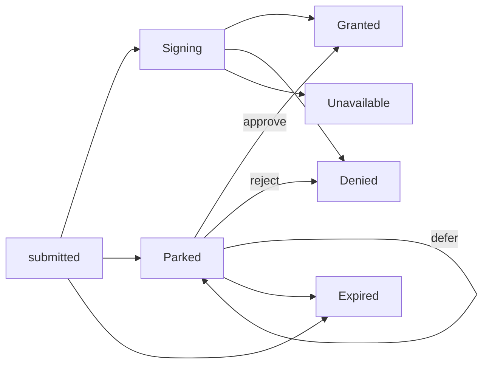
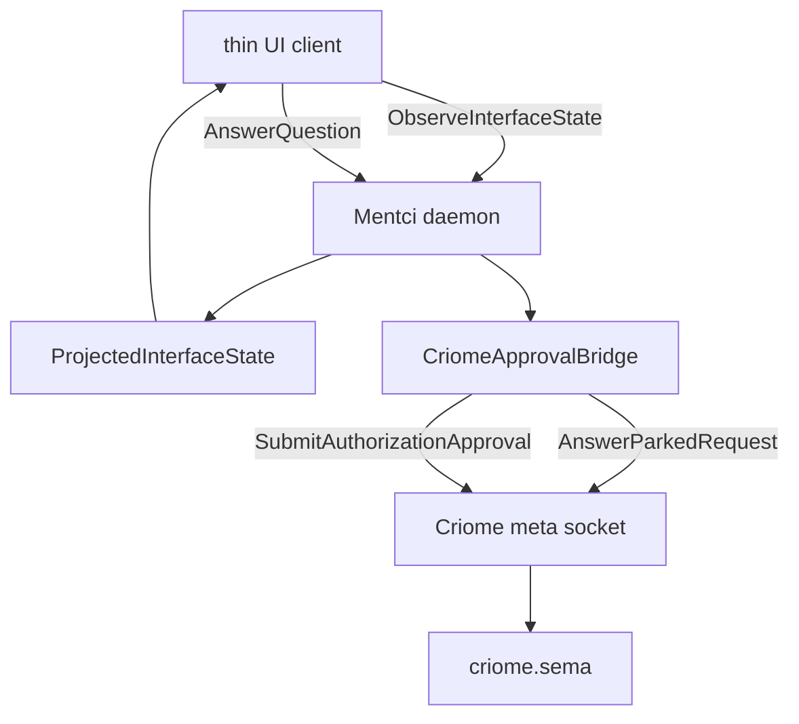
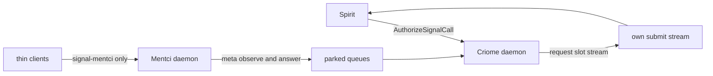

# Criome, Mentci, and Spirit Authorization Path

This is the short map a skilled engineer needs before editing the current
authorization work. The important idea is that Spirit is an early client of the
authorization path, not the owner of the authorization system. Criome owns the
authorization state, signing, policy matching, parked queues, and lifecycle
streams. Mentci owns the component-general human control surface that can render
and answer those parked questions. Spirit owns its own guardian and intent-store
write path, and asks Criome before it lets approved writes proceed through the
configured authorization posture.

The current work is spread across active feature heads rather than one landed
mainline everywhere. I inspected the `criome-authorization-push` heads where
present and the current main contracts where that is the active surface:

| Repository | Relevant head inspected | Why it matters |
|---|---:|---|
| `/git/github.com/LiGoldragon/criome` | `criome-authorization-push` at `4b027f7a` | Criome authorization state, parked requests, submit-scoped stream. |
| `/git/github.com/LiGoldragon/signal-criome` | `criome-authorization-push` at `2986f8f8` | Wire nouns for authorization, intercept policies, and streams. |
| `/git/github.com/LiGoldragon/meta-signal-criome` | `criome-authorization-push` at `acd203e7` | Meta authority verbs for policy, parked queues, and approvals. |
| `/git/github.com/LiGoldragon/spirit` | `criome-authorization-push` at `08771c82` | Spirit guardian-first ordering and submit-stream consumption. |
| `/git/github.com/LiGoldragon/mentci` | `criome-authorization-push` at `f1dcbdb9` for bridge/tests | Mentci daemon bridge to Criome meta socket and parked request UI flow. |
| `/git/github.com/LiGoldragon/signal-mentci` | `main` at `8376ee42` | Current Mentci wire contract for thin clients and Criome-derived questions. |

## Component Map

Spirit uses authorization because its writes need an external, auditable gate.
That does not make Spirit the user interface for Criome, and it does not make
Mentci Spirit-specific. Mentci is a programmable UI/control daemon: TUI, CLI,
editor panes, status bars, and agentic clients all render daemon-owned state and
send typed answers back through Mentci. The Criome approval queue is one use of
that surface.

Criome has two sockets and two authority levels. The ordinary working socket
accepts component traffic such as `AuthorizeSignalCall`, `EvaluateAuthorization`,
and `VerifyAuthorization`. The meta socket is owner authority: configuration,
intercept policy creation/replacement/cancellation, parked request fetch, parked
request answer, and approval by authorization slot. In the current daemon, the
working socket is group-accessible while the meta socket is owner-private
([criome/src/daemon.rs](/git/github.com/LiGoldragon/criome/src/daemon.rs:121)).

Router only matters here as downstream transport. Spirit should not fan out or
ship external effects until its configured authorization posture allows it.
Router does not own the authorization decision; it carries messages after other
components have decided what may move.

## Contracts And Generated Layers

The contracts name the component boundary:

| Surface | Owner | Important nouns |
|---|---|---|
| `signal-criome` | Criome working wire | `AuthorizeSignalCall`, `AuthorizationObservationStream`, `AuthorizationStateRecord`, `SignalCallAuthorization`, `AuthorizationGrant`, `InterceptPolicy`, `ParkedSpiritRequest`. |
| `meta-signal-criome` | Criome owner/meta wire | `Configure`, `CreateInterceptPolicy`, `ReplaceInterceptPolicy`, `FetchParkedRequests`, `AnswerParkedRequest`, `SubmitAuthorizationApproval`. |
| `signal-mentci` | Mentci working UI wire | `PresentQuestion`, `ObserveInterfaceState`, `AnswerQuestion`, `ApprovalSource`, `ApprovalDecision`, `CriomeAccess`, parked request controls forwarded through the Mentci daemon. |
| `signal-spirit` and `meta-signal-spirit` | Spirit working/meta wire | Spirit write operations, owner configuration, and the daemon's `AuthorizationMode`. |

`signal-criome` declares the main stream shape directly: `AuthorizeSignalCall
SignalCallAuthorization opens AuthorizationObservationStream`, and
`ObserveAuthorization AuthorizationObservation opens AuthorizationObservationStream`
([signal-criome/schema/lib.schema](/git/github.com/LiGoldragon/signal-criome/schema/lib.schema:15)).
The stream opens with an `AuthorizationObservationSnapshot` and then emits
`AuthorizationUpdate` events whose payload is an `AuthorizationStateRecord`
([signal-criome/schema/lib.schema](/git/github.com/LiGoldragon/signal-criome/schema/lib.schema:604)).

`meta-signal-criome` imports the shared `signal-criome` types rather than
redeclaring them. That is why Mentci can answer by the same
`AuthorizationRequestSlot` that Criome minted, without string translation or a
daemon-private side table ([meta-signal-criome/schema/lib.schema](/git/github.com/LiGoldragon/meta-signal-criome/schema/lib.schema:14)).

`signal-mentci` likewise cross-imports Criome's slot and parked request records.
Its `ApprovalSource` has `CriomeEscalation AuthorizationRequestSlot` and
`CriomeInterception ParkedRequestIdentifier`, so a thin UI can render a question
without gaining direct Criome authority ([signal-mentci/schema/lib.schema](/git/github.com/LiGoldragon/signal-mentci/schema/lib.schema:146)).

## Vocabulary

`Guardian` is Spirit's admission judge. It decides whether a proposed Spirit
write is acceptable for the intent store.

`Policy` is Criome state that says when a request should be intercepted or how an
authorization should be evaluated. In the Spirit intercept path, the policy
matches operation names and a target key.

`Weak target key` is the current `SpiritProcessKey` selector. The contract says
it is a simple Spirit stream/process selector, not a cryptographic identity
binding; meta-socket possession is the MVP authority boundary for mutating these
policies ([signal-criome/schema/lib.schema](/git/github.com/LiGoldragon/signal-criome/schema/lib.schema:212)).

`Parked` means Criome has accepted and stored the submitted request but has not
resolved it. `Resolved` means the parked request was answered, so it no longer
appears in the active parked snapshot. `Resume` is the caller-side behavior when
the same submitted request receives a grant update and continues the original
write.

`Snapshot` is the first state sent when an observation stream opens. `Delta` is a
later pushed update on the same stream.

`Submit-scoped stream` means the requester submits once and receives the stream
for that submitted request from the same call. It does not submit, receive a slot,
then poll or separately observe by ID.

## Spirit Ordering

Spirit's load-bearing order is guardian first, Criome second, store write third.
For record writes, `guard_record` builds a `GuardianOperation`, calls
`guard_model`, returns immediately on guardian rejection, then calls
`authorize_guardian_operation`, and only then writes to the store
([spirit/src/nexus.rs](/git/github.com/LiGoldragon/spirit/src/nexus.rs:661)).
The same pattern appears on clarify, resolve, supersede, retire, and change
operations in the adjacent methods.

This ordering matters because Criome is not supposed to receive rejected Spirit
matter. The tests witness the boundary: a guardian rejection produces no Criome
request, while guardian acceptance sends a `signal-spirit` `Record`
authorization containing the Spirit operation context
([spirit/tests/runtime_triad.rs](/git/github.com/LiGoldragon/spirit/tests/runtime_triad.rs:1427),
[spirit/tests/runtime_triad.rs](/git/github.com/LiGoldragon/spirit/tests/runtime_triad.rs:1459)).

Spirit's `SpiritOperationAuthorizer` builds the `SignalCallAuthorization` with
contract `signal-spirit`, operation from the guarded operation name, scope
`spirit-operation`, requester `Host spirit`, a nonce, and the
`SpiritAuthorizationContext` ([spirit/src/criome_gate.rs](/git/github.com/LiGoldragon/spirit/src/criome_gate.rs:518)).
In `Gating` mode it blocks until the submit stream returns a terminal grant,
denial, expiry, unavailable state, or timeout. In `Observing` mode it validates
the returned state and proceeds without applying it as a blocking gate
([spirit/src/criome_gate.rs](/git/github.com/LiGoldragon/spirit/src/criome_gate.rs:543)).

Spirit's docs describe the two startup authorization postures: `Gating` keeps
fan-out behind Criome's verdict; `Observing` emits the same authorization request
as trace scaffold without blocking fan-out ([spirit/ARCHITECTURE.md](/git/github.com/LiGoldragon/spirit/ARCHITECTURE.md:178),
[spirit/INTENT.md](/git/github.com/LiGoldragon/spirit/INTENT.md:239)).

## Criome Policy And Parking

There are two related but distinct parked surfaces.

The general `AuthorizeSignalCall` path stores an `AuthorizationStateRecord`
keyed by a daemon-minted `AuthorizationRequestSlot`. In `ClientApproval` mode,
Criome parks the whole `SignalCallAuthorization`; Mentci or another meta client
later approves, rejects, or defers by slot. On approval, Criome signs and stores
the `AuthorizationGrant` itself ([criome/src/actors/root.rs](/git/github.com/LiGoldragon/criome/src/actors/root.rs:786),
[criome/src/actors/root.rs](/git/github.com/LiGoldragon/criome/src/actors/root.rs:920)).

The Spirit intercept policy path parks a `SpiritAuthorizationContext`, not just a
generic signal authorization. The context contains operation name, raw payload,
and weak target key. It exists so Mentci can configure policies such as "park
Record operations for spirit-process-main during this session" and display the
raw operation payload in a human control surface.

Policy match is concrete:

- A policy is active only inside its time window.
- Target match compares the policy's `InterceptTargetSelector.process_key`
  against the context's `target_key`.
- Operation match checks the context operation against the policy's
  `SpiritOperationNames`.
- If several policies match, higher `PolicyPriority` wins; same-priority overlap
  is rejected or replaced according to `PolicyOverlapMode`.
- Expiry action is stored on the parked request as `AutoApprove`, `AutoReject`,
  or `LeaveParked`.

These mechanics are in `StoredInterceptPolicy::matches_context`,
`same_priority_overlap`, `put_intercept_policy`, and
`matching_intercept_policy` ([criome/src/tables.rs](/git/github.com/LiGoldragon/criome/src/tables.rs:364),
[criome/src/tables.rs](/git/github.com/LiGoldragon/criome/src/tables.rs:790),
[criome/src/tables.rs](/git/github.com/LiGoldragon/criome/src/tables.rs:850)).
The tests cover highest-priority match, same-priority overlap rejection,
replacement, operation mismatch, target mismatch, and independent policies for
different operation names on one Spirit process ([criome/tests/intercept_policy.rs](/git/github.com/LiGoldragon/criome/tests/intercept_policy.rs:72),
[criome/tests/intercept_policy.rs](/git/github.com/LiGoldragon/criome/tests/intercept_policy.rs:196)).

The permissive MVP default appears in two places. If Spirit has no configured
operation-authorizer socket, `SpiritOperationAuthorizer::authorize` returns
`Allowed` ([spirit/src/criome_gate.rs](/git/github.com/LiGoldragon/spirit/src/criome_gate.rs:491)).
If Criome itself is configured as `AutoApprove`, its evaluation path records an
authorized decision instead of requiring quorum or client approval
([criome/src/actors/root.rs](/git/github.com/LiGoldragon/criome/src/actors/root.rs:739)).
Those defaults are useful bootstrap posture, not the final security story.

## Submit-Scoped Stream

The recent stream work rejects the two-step pattern "submit, get an ID, then
observe-by-ID or poll". The preferred path is request-scoped:

1. Spirit submits `AuthorizeSignalCall`.
2. Criome creates durable authorization state and returns the first
   `AuthorizationObservationSnapshot` on the same connection.
3. If the snapshot is terminal, the stream ends.
4. If the snapshot is non-terminal, Criome keeps the connection open and pushes
   `AuthorizationUpdate` events for that request slot until granted, denied,
   expired, or unavailable.
5. Spirit resumes the original write from that pushed update.

The server side is `CriomeConnection::stream_authorization_submission`: it
submits the request, extracts the slot, opens the matching observation, writes
the snapshot first, then filters broadcast updates by the same slot until a
terminal state ([criome/src/daemon.rs](/git/github.com/LiGoldragon/criome/src/daemon.rs:362),
[criome/src/daemon.rs](/git/github.com/LiGoldragon/criome/src/daemon.rs:421)).
The client side is `CriomeClient::authorize_signal_call`, which returns a
`CriomeAuthorizationObservationSession` holding token, snapshot, and stream; the
session's `next_update` reads only updates whose slot matches the token
([criome/src/transport.rs](/git/github.com/LiGoldragon/criome/src/transport.rs:332),
[criome/src/transport.rs](/git/github.com/LiGoldragon/criome/src/transport.rs:381)).

The witness test `authorization_submit_stream_pushes_approval_update` sets
Criome to `ClientApproval`, submits a signal call through
`authorize_signal_call`, asserts the initial snapshot is `Parked`, submits a
meta approval, then reads a pushed `Granted` update carrying the signed grant
([criome/tests/daemon_skeleton.rs](/git/github.com/LiGoldragon/criome/tests/daemon_skeleton.rs:1617)).
Spirit has companion tests that prove a pending Criome authorization resumes from
a pushed update and an immediate grant resumes from the submit snapshot
([spirit/tests/runtime_triad.rs](/git/github.com/LiGoldragon/spirit/tests/runtime_triad.rs:1504),
[spirit/tests/runtime_triad.rs](/git/github.com/LiGoldragon/spirit/tests/runtime_triad.rs:1538)).

`ObserveAuthorization` still exists, but it is now compatibility and recovery
surface: use it when a caller already holds an `AuthorizationRequestSlot`.
It should not be the primary submit path for Spirit. The primary path is submit
once and stay on the request-scoped stream.

## Authorization State Lifecycle

Criome stores authorization state in `criome.sema`, with tables for
authorization states, replay nonces, contracts, signature solicitations,
submitted signatures, intercept policies, parked Spirit requests, and separate
slot counters ([criome/src/tables.rs](/git/github.com/LiGoldragon/criome/src/tables.rs:29),
[criome/src/tables.rs](/git/github.com/LiGoldragon/criome/src/tables.rs:560)).
New authorization state is minted by store slot, not derived from a digest, and
same requester plus same nonce is rejected as replay before a second slot is
minted ([criome/src/tables.rs](/git/github.com/LiGoldragon/criome/src/tables.rs:687)).

Expiry is partly implemented in two places. `AuthorizeSignalCall` with an
already-expired `signal_call_expires_at` records an expired state
([criome/src/actors/authorization.rs](/git/github.com/LiGoldragon/criome/src/actors/authorization.rs:104)).
Parked Spirit request snapshots call `apply_parked_spirit_expiry` before
returning active parked requests ([criome/src/tables.rs](/git/github.com/LiGoldragon/criome/src/tables.rs:927)).
The policy's expiry action is carried on each parked request so future or
existing expiry handling can distinguish auto-approve, auto-reject, and leave
parked.

## Mentci Authority And UI Boundary

Mentci clients should not talk to Criome directly. Thin clients speak
`signal-mentci`: observe interface state, answer a question, create or replace
intercept policies, fetch parked requests, and answer parked requests. The
Mentci daemon decides whether it has read-only or read-write Criome access and
projects that as `CriomeAccess` so clients render the correct controls
([signal-mentci/schema/lib.schema](/git/github.com/LiGoldragon/signal-mentci/schema/lib.schema:208)).

The `CriomeApprovalBridge` in the Mentci branch is the daemon-side bridge to the
Criome meta socket. It can configure Criome, submit an approval by
`AuthorizationRequestSlot`, list parked authorization snapshots, create/replace
cancel/list intercept policies, fetch parked Spirit requests, and answer parked
requests ([mentci/src/criome_bridge.rs](/git/github.com/LiGoldragon/mentci/src/criome_bridge.rs:26)).
The tests drive this end to end: Mentci creates/replaces/cancels policies over
Criome meta, fetches parked Spirit requests, projects one as a pending UI
question, and routes the user's `AnswerQuestion` verdict back to Criome as a
parked request answer ([mentci/tests/criome_bridge.rs](/git/github.com/LiGoldragon/mentci/tests/criome_bridge.rs:265),
[mentci/tests/criome_bridge.rs](/git/github.com/LiGoldragon/mentci/tests/criome_bridge.rs:362)).

This is the authority split: Mentci may have broad UI/control authority, but
only the Mentci daemon should hold and use the Criome meta bridge. A status bar,
editor popup, CLI renderer, or agentic client is a renderer and event source,
not a Criome approver.

## Surface And Authority Rules

Spirit should receive only the lifecycle stream for its own submitted request.
The submit-scoped stream is naturally scoped this way because the stream token is
the request slot returned from the submission, and the daemon filters updates by
that slot. Broader queue visibility belongs to meta authority, usually mediated
by Mentci.

Mentci can list and answer broader parked surfaces because it is the configured
human-control daemon. Thin UI clients still route through Mentci so that access
mode, pending question identity, and Criome meta writes stay daemon-owned.

`ObserveAuthorization` is different from both. It is slot-scoped observation for
a caller that already knows the slot. It is useful for compatibility, recovery,
or tests, but it is weaker as a primary path because it requires the caller to
submit and then separately open an observation. The recent work makes
`AuthorizeSignalCall` itself stream-capable so a caller does not need that
second step.

## Why Polling And Separate Observe-By-ID Were Rejected

Polling would make Spirit repeat "are we done yet" calls and encode timing into
the caller. That is the wrong direction for this system: producers push state
changes, and subscribers consume them. Criome owns the state transition, so
Criome should push the transition that resolves the request.

Separate observe-by-ID also loses the clean request lifetime. If Spirit submits
and gets a slot, then opens `ObserveAuthorization(slot)`, the caller now owns a
two-step dance and has to decide what to do between steps. The submit-scoped
stream lets Criome atomically accept the request, mint the slot, return the
current state, and keep the exact request stream open.

The design is especially important for parked requests. The first reply can be
`Parked`; later Mentci approval can arrive through the meta socket; Criome then
pushes `Granted` to the original Spirit stream. Spirit resumes the original
write from the update, not from a fresh query.

## Current Implementation State

Hooked and witnessed:

- `signal-criome` declares `AuthorizeSignalCall` and `ObserveAuthorization` as
  stream-opening operations.
- Criome's daemon has concrete streaming server and client code for
  submit-scoped authorization streams.
- Criome stores authorization state durably, mints slots, records replay nonces,
  parks in `ClientApproval`, signs grants on approval, and pushes the resulting
  state update.
- Spirit consumes the submit-scoped stream in `SpiritOperationAuthorizer`, and
  its tests witness guardian-first ordering, context preservation, pushed update
  resume, and immediate snapshot resume.
- Criome intercept policies match operation name plus weak target key under
  priority, overlap, and time-window rules.
- Mentci's branch has a daemon bridge and tests for policy controls, parked
  request projection, and answer routing.

Partly implemented or residual:

- The broad Mentci parked-queue stream is not the same as the submit-scoped
  stream. `meta-signal-criome` has an intercept-policy stream, but parked Spirit
  requests are currently fetched and answered through snapshot/request operations.
  A future Mentci parked-queue stream would push queue changes to Mentci rather
  than requiring UI refreshes to fetch snapshots.
- The weak target key is intentionally weak. It is adequate for an MVP process
  selector and meta-socket-controlled policy mutation, but it is not a durable
  identity binding.
- Bootstrap permissiveness remains: unconfigured Spirit operation authorization
  allows, and Criome `AutoApprove` can authorize without quorum evidence. Those
  defaults should be treated as demo/bootstrap posture.
- Full Nix checks were not run for this report. I inspected code, contracts,
  architecture docs, and tests. Prior closeout material for the broader
  criome-auth witness reports a green full-body VM witness at landed mains and a
  known Spirit `--locked` clippy/doc fragility, but this explainer did not rerun
  those checks.

## Source Pointers

Primary code and contract anchors:

- `signal-criome/schema/lib.schema`: stream-opening authorization operations,
  authorization state records, intercept policy records, parked Spirit requests.
- `meta-signal-criome/schema/lib.schema`: owner/meta verbs for configuration,
  intercept policy control, parked request fetch/answer, and approval by slot.
- `criome/src/daemon.rs`: socket permissions, streaming connection dispatch, and
  snapshot-then-update stream loop.
- `criome/src/transport.rs`: `authorize_signal_call` and
  `CriomeAuthorizationObservationSession`.
- `criome/src/actors/root.rs`: `ClientApproval`, parked state, approval handling,
  grant signing, parked authorization snapshots.
- `criome/src/tables.rs`: durable tables, slot minting, replay nonces, intercept
  policy match, parked Spirit request storage.
- `spirit/src/nexus.rs`: guardian-first operation path and call to Criome
  operation authorization.
- `spirit/src/criome_gate.rs`: Spirit operation authorizer and submit-stream
  consumption.
- `signal-mentci/schema/lib.schema`: thin UI contract, closed verdict set,
  `CriomeAccess`, and Criome-derived approval sources.
- `mentci/src/criome_bridge.rs`: daemon-side Criome meta bridge.

Witness tests worth reading first:

- `criome/tests/daemon_skeleton.rs::authorization_submit_stream_pushes_approval_update`
- `criome/tests/intercept_policy.rs`
- `spirit/tests/runtime_triad.rs::guardian_rejection_does_not_contact_criome_operation_authorizer`
- `spirit/tests/runtime_triad.rs::guardian_acceptance_sends_spirit_context_to_criome_before_write`
- `spirit/tests/runtime_triad.rs::pending_criome_authorization_resumes_from_pushed_stream_update`
- `spirit/tests/runtime_triad.rs::immediate_criome_authorization_resumes_from_submit_snapshot`
- `mentci/tests/criome_bridge.rs::mentci_daemon_manages_intercept_policies_over_criome_meta_socket`
- `mentci/tests/criome_bridge.rs::mentci_fetches_projects_and_answers_policy_parked_spirit_requests`

## Commands Used

- `sed -n ... AGENTS.md`, `sed -n ... skills/.../SKILL.md`: loaded workspace and
  reporting/prose/mermaid/engine-analysis guidance.
- `jj status --no-pager` and `jj log --no-pager ...`: recorded relevant heads
  without using raw git.
- `jj file list -r ...` and `jj file show -r ...`: inspected feature-branch
  files not checked out in the working tree, especially Mentci and contract
  schema surfaces.
- `rg -n ...`: found source anchors for authorization, streams, parking,
  policies, and guardian ordering.
- `nl -ba ... | sed -n ...`: captured line references used above.

No build or test command was run as part of this report.
