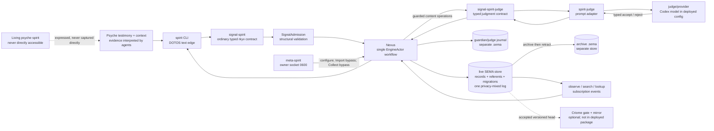
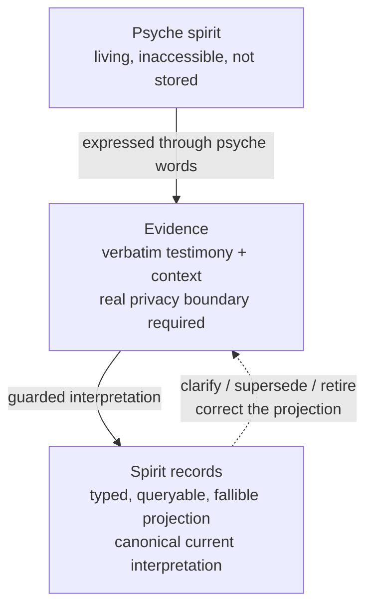

# Current Spirit architecture audit

Audit date: 2026-08-01. This is a read-only audit. It separates first-party
psyche vision, source implementation, deployed composition, and observed runtime.
No Spirit state database or queued private capture text was opened.

## Executive finding

Spirit currently exists as a carefully typed, semantically guarded, versioned
record system, but not as an available or routinely consulted representation of
the psyche's spirit. Its judge is failed, the daemon is consequently down, one
approved capture is queued, agent doctrine contains no executable consultation
or capture bridge, and the active contracts and manuals still call the stored
substance `intent` after the psyche ruled that it is `spirit`.

The dominant architectural work is therefore not merely daemon recovery. It is
to make the recorded projection usable and authoritative without confusing it
with the living psyche spirit that agents can never directly access.

## Psyche vision reacquired

First-party evidence recovered from Codex session
`019fad58-1e10-7051-94bc-6cd6c35e87f7` establishes:

- Spirit holds a computer representation of the psyche's spirit; the living
  spirit itself is inaccessible and can only be inferred, like psyche vision.
- Spirit-content is named **spirit**. Ordinary **intent** is reserved for what
  the psyche wants now.
- Correctness that makes later growth simpler is an identified piece of spirit;
  the psyche characterized spirit-grade substance as eternal and unchanging.
- Read-only consultation is desired but its triggers and effect on action were
  not settled. Capture and mutation remain a distinct approval-gated activity.

Evidence: [vision recovery](/home/li/primary/reports/spirit-vision-recovery-019fad58.md:5),
[direct evidence and provenance](/home/li/primary/reports/spirit-vision-recovery-019fad58.md:29),
[unresolved consultation policy](/home/li/primary/reports/spirit-vision-recovery-019fad58.md:136),
and [seated rename ruling](/home/li/primary/design/ProtosEngine/traitStandardAndSpiritRename-2026-08-01.md:8).

## Architecture as it exists

### Component ownership

| Owner | Implemented responsibility | Evidence |
|:--|:--|:--|
| `signal-spirit` | Ordinary `Record`, maintenance, observation, public/private shortcuts, subscription, and the `Entry`/query vocabulary. | [`schema/signal.schema`](/git/github.com/LiGoldragon/signal-spirit/schema/signal.schema:44) and [`Entry`](/git/github.com/LiGoldragon/signal-spirit/schema/signal.schema:230) |
| `meta-signal-spirit` | Owner `Configure`, guardian-bypassing `Import`, archive/removal collection, and versioned-head observation. | [`schema/meta-signal.schema`](/git/github.com/LiGoldragon/meta-signal-spirit/schema/meta-signal.schema:9) |
| `spirit` | Signal admission, Nexus decisions/effects, SEMA persistence, judge bridge/journal, subscriptions, migration, optional cluster gate/mirroring. | [`Engine` composition](/git/github.com/LiGoldragon/spirit/src/engine.rs:287), [`Nexus` routing](/git/github.com/LiGoldragon/spirit/src/nexus.rs:1227), [`Store`](/git/github.com/LiGoldragon/spirit/src/store/mod.rs:98) |
| `signal-spirit-judge` | Binary request/reply vocabulary, public/private judgment scope, closed verdicts, privacy-safe diagnostics. | [`ARCHITECTURE.md`](/git/github.com/LiGoldragon/signal-spirit-judge/ARCHITECTURE.md:11), [`JudgmentScope`](/git/github.com/LiGoldragon/signal-spirit-judge/src/lib.rs:121) |
| `spirit-judge`, `spirit-judge-config`, `judge` | Lower typed packets into public prompt prose, call the selected model/provider, parse typed verdicts, redact private diagnostics. | [`spirit-judge` adapter](/git/github.com/LiGoldragon/spirit-judge/src/lib.rs:285), [`private diagnostic projection`](/git/github.com/LiGoldragon/spirit-judge/src/lib.rs:532), [`prompt owner`](/git/github.com/LiGoldragon/spirit-judge-config/ARCHITECTURE.md:3) |
| `CriomOS-home` | Declarative user services, paths, binary daemon configuration, judge provider/model, and service dependency. | [`spirit.nix`](/git/github.com/LiGoldragon/CriomOS-home/modules/home/profiles/min/spirit.nix:54), [`service composition`](/git/github.com/LiGoldragon/CriomOS-home/modules/home/profiles/min/spirit.nix:202) |

## Capture, validation, and publication

### Ordinary capture

1. The CLI projects DOTOS at the human/agent edge into the binary
   `signal-spirit` request.
2. `SignalAdmission` validates the closed input and assigns correlation state.
3. Nexus registers implied referents, gathers related live records, and submits
   record/propose/clarify/supersede/retire/change-record operations to the
   external judge.
4. The judge sees the operation, related records, and database marker, then
   returns a closed typed verdict. Missing/unusable judgment fails closed.
5. Accepted operations reach the versioned SEMA store; the judge decision is
   also written to a separate journal.

Evidence: [`Input::validate`](/git/github.com/LiGoldragon/signal-spirit/src/lib.rs:206),
[`Nexus` arrival dispatch](/git/github.com/LiGoldragon/spirit/src/nexus.rs:1236),
[`guard_record`](/git/github.com/LiGoldragon/spirit/src/nexus.rs:702),
[`fail-closed missing judge`](/git/github.com/LiGoldragon/spirit/src/nexus.rs:865),
and [`GuardianDecision` journal shape](/git/github.com/LiGoldragon/spirit/src/guardian_journal.rs:34).

The owner tier is deliberately stronger: `Import` can upsert pre-vetted records
and auto-register referents without the judge; `CollectRemovalCandidates` writes
each candidate to a separate archive and then retracts it from the live log.
Filesystem protection of the meta socket is the authority boundary. Evidence:
[`import_record`](/git/github.com/LiGoldragon/spirit/src/store/mod.rs:716),
[`collect_removal_candidates`](/git/github.com/LiGoldragon/spirit/src/store/mod.rs:643),
and [deployed ordinary/meta socket paths](/git/github.com/LiGoldragon/CriomOS-home/modules/home/profiles/min/spirit.nix:54).

### Read and publication semantics

The current implementation has no independent publication system. `PublicIntent`
and `PublicTextSearch` expose active privacy-`Zero` records through the ordinary
local socket; ordinary `Observe` can request any privacy selection, `PrivateRecords`
is also an ordinary-socket operation, and `Lookup` reads a known identifier without
the observation filters. Subscriptions publish matching committed events only to
connected ordinary-socket clients.

Thus **public/private is presently a classification and query filter, not a
confidentiality boundary**:

- all records share one `RecordsFamily` in one live database;
- privacy is an eight-rung field on `Entry`;
- `PrivateRecords` lowers to `AtLeast Minimum` on the same working path;
- private judgment changes diagnostic handling, but raw operation/record context
  still crosses the explicitly selected model-provider boundary;
- the production daemon package enables `agent-guardian`, not `mirror-shipper`,
  so remote publication/mirroring is absent from the deployed binary.

Evidence: [`StoredRecord` and families](/git/github.com/LiGoldragon/spirit/schema/sema.schema:56),
[`RecordSelection` lowering](/git/github.com/LiGoldragon/signal-spirit/src/lib.rs:424),
[`ordinary read routing`](/git/github.com/LiGoldragon/spirit/src/nexus.rs:1264),
[`public-only search filter`](/git/github.com/LiGoldragon/spirit/src/store/mod.rs:902),
[`private judgment scope projection`](/git/github.com/LiGoldragon/spirit/src/guardian.rs:364),
and [daemon package features](/git/github.com/LiGoldragon/spirit/flake.nix:743).

## Runtime reality

Direct read-only observation on 2026-08-01 found:

| Unit | State | Consequence |
|:--|:--|:--|
| `spirit-judge.service` | `failed` / `start-limit-hit`, exit status 203 | An unmanaged `spirit-judge.service.d/override.conf` replaces the declarative `ExecStart` with an obsolete collected Nix path. No judge socket exists. |
| `spirit-daemon.service` | `inactive` / `dead` | The daemon declares `Requires=` and `After=` the judge, so neither reads nor writes are available. Existing ordinary/meta socket pathnames are stale, not listeners. |

The checked-in declarative source already names the corrected single-argument
judge wrapper, but activation has not removed the higher-precedence unmanaged
override. Evidence: [judge wrapper](/git/github.com/LiGoldragon/CriomOS-home/modules/home/profiles/min/spirit.nix:145)
and [daemon dependency](/git/github.com/LiGoldragon/CriomOS-home/modules/home/profiles/min/spirit.nix:239).
The durable tracker independently records the outage, the stale override, and
one approved queued capture awaiting the current `Record` envelope
(`primary-whb`, `primary-7z3.1`).

## Corroborated inconsistencies

1. **The ontology is superseded everywhere below the vision.** The manual opens
   with “Spirit is the intent layer,” explicitly argues that the word intent
   stays, and the public contract still exposes `PublicIntent`,
   `SubscribeIntent`, `IntentEvent`, and `NonIntent`. This conflicts with the
   psyche-approved spirit/ordinary-intent distinction. Evidence:
   [`manual.md`](/git/github.com/LiGoldragon/spirit/manual.md:1),
   [`Why the word intent stays`](/git/github.com/LiGoldragon/spirit/manual.md:148),
   and [`signal.schema`](/git/github.com/LiGoldragon/signal-spirit/schema/signal.schema:44).

2. **Agent doctrine has lost the runtime bridge.** The manual says agents
   routinely Observe Spirit before and during substantive work, and promises a
   generated read-side skill containing the deployed CLI. The actual source and
   generated `intent-log` skill contain only three classification directives:
   no query syntax, no transport, no capture envelope, no approval boundary, and
   no behavior when Spirit is unavailable. Evidence:
   [`manual.md`](/git/github.com/LiGoldragon/spirit/manual.md:163),
   [`manual skill claim`](/git/github.com/LiGoldragon/spirit/manual.md:551), and
   [`skills/intent-log.md`](/git/github.com/LiGoldragon/skills/skills/intent-log.md:1).

3. **The manual mixes implemented and imagined surfaces.** It promises
   `RecordDefault`, `RecordPrivate`, `ChangePrivacy`, output-target selection,
   and originating-prompt capture locking, none of which exist in the current
   ordinary schema. It also specifies a 96-bit identifier while the implemented
   mint stores only a four-to-seven-character base36 code. Evidence:
   [`manual short forms`](/git/github.com/LiGoldragon/spirit/manual.md:490),
   [`manual capture locking`](/git/github.com/LiGoldragon/spirit/manual.md:203),
   [`manual identity`](/git/github.com/LiGoldragon/spirit/manual.md:527),
   [`actual ordinary surface`](/git/github.com/LiGoldragon/signal-spirit/schema/signal.schema:44),
   and [`RecordIdentifierMint`](/git/github.com/LiGoldragon/spirit/src/store/record_identifier.rs:16).

4. **“Every corpus-changing working write is judged” is false.** The architecture
   states that every such write uses the judge, but `ChangeCertainty` and
   `BumpImportance` route directly to SEMA. Certainty can control ordinary
   visibility and removal candidacy, so this is not merely cosmetic metadata.
   Evidence: [claim](/git/github.com/LiGoldragon/spirit/ARCHITECTURE.md:577),
   [direct routes](/git/github.com/LiGoldragon/spirit/src/nexus.rs:1285), and
   [certainty/removal semantics](/git/github.com/LiGoldragon/spirit/manual.md:357).

5. **Lifecycle changes the projection, not the spirit.** The manual says records
   are changed, superseded, retired, and removed as the psyche's direction moves.
   The reacquired vision instead describes living spirit as inaccessible and
   spirit-grade substance as eternal. The coherent interpretation is that the
   typed record is a revisable inference; current prose frequently grants the
   record itself ontological authority. Evidence:
   [`manual lifecycle`](/git/github.com/LiGoldragon/spirit/manual.md:357) and
   [vision distinction](/home/li/primary/reports/spirit-vision-recovery-019fad58.md:31).

6. **Write-safety availability is coupled to read availability.** In code, reads
   do not require semantic judgment, but deployment makes the whole daemon require
   the judge. A judge packaging failure therefore disables consultation as well
   as mutation. This is the immediate mechanism behind the current total outage.

7. **Archive/removal is not one atomic transition.** The current store writes a
   separate archive database and then retracts the live record per item. Failures
   are reported and leave the live row, but there is no single-store lifecycle
   commit. Evidence: [`collect_removal_candidates`](/git/github.com/LiGoldragon/spirit/src/store/mod.rs:643)
   and [`retire`](/git/github.com/LiGoldragon/spirit/src/store/mod.rs:1103).

## Central dilemma — inference, not psyche ruling

Spirit's recorded representation must be authoritative enough to orient future
agents, but must never be mistaken for direct access to the living psyche spirit.
Today the architecture compounds that conceptual tension with an operational one:
it has optimized the write side as a strict semantic court, yet has no current
agent consultation contract, and the judge's failure removes the entire read side.
The system therefore protects what may enter the representation while failing to
make the representation available to do its job.

The smallest faithful model is three layers:

Under this model, record lifecycle means the representation became more faithful,
not that spirit itself changed. Read-only consultation can depend only on the
store; capture can additionally require the judge. Private evidence requires an
actual confidentiality boundary rather than a magnitude label.

## Sequence supported by evidence

Recover the exact pinned composition first and prove read-only access, fail-closed
writes, store reopen, and the unchanged queued-capture contract. Then perform the
semantic vocabulary/schema migration against an isolated copied store. Combining
service recovery, ontology rename, wire changes, storage changes, and private-store
redesign would make failure attribution impossible; waiting for all redesign work
would keep the only consultation surface offline.

This sequencing is an audit recommendation, not authorization to change services,
contracts, skills, or records.

## Unknowns kept unknown

- The production store's current public/private contents and whether the queued
  capture duplicates an existing record were not inspected.
- Routine consultation frequency, triggers, returned evidence, and how records
  constrain action remain unruled.
- It is unsettled whether all Spirit records must themselves be eternal, or
  whether eternity characterizes the unreachable spirit while projections may
  carry calibrated uncertainty.
- Compatibility posture for the `Intent*` wire/storage rename is not decided.
- No claim is made that current dirty source working copies are deployable; the
  deployed closure is older and independently pinned.
