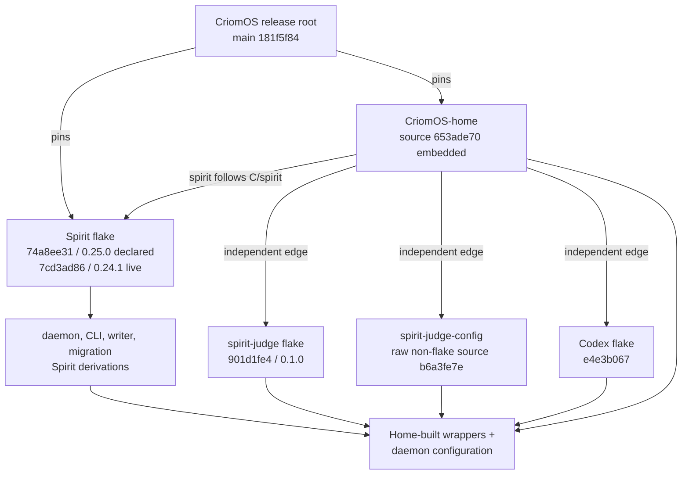
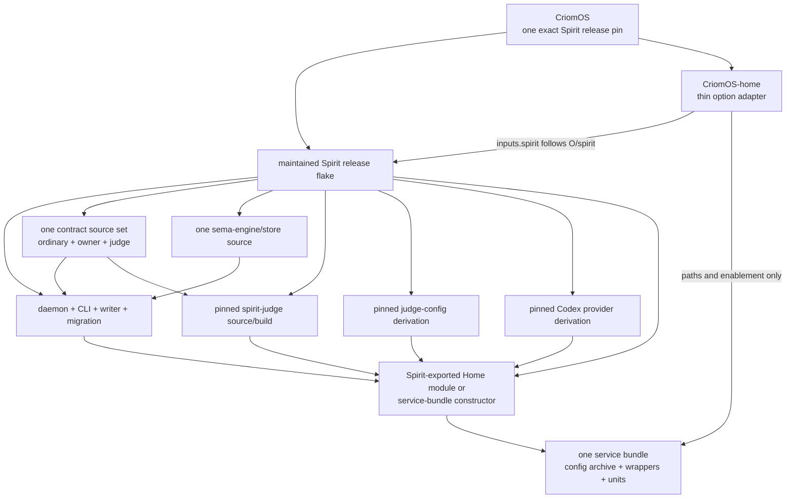

# Spirit flake derivation and pin-authority audit

Audit time: 2026-08-03 16:31 CEST. This was read-only. No service, runtime
file, repository, Nix store, profile, or deployment state was changed.

## Result

The current Spirit services do **not** come from one maintained Spirit flake
closure. They are reproducible as a larger CriomOS/Home closure, but release
authority is split across three application inputs plus deployment-written
derivations:

`criomos-home.inputs.spirit.follows = "spirit"` gives the daemon side one
shared pin, but no equivalent edge exists for judge, prompt configuration, or
the Spirit service wrappers. The present comment in CriomOS that this creates
“one spirit revision for the whole closure” is therefore narrower than the
actual service boundary.

The declarative recovery must first create a Spirit release flake that owns the
whole service bundle. Repointing the current override to another artifact,
deploying Home with its three independent inputs, or relying on equal versions
observed today does not establish that invariant.

## Evidence: declared graph

| Required surface | Current source and pin authority | One Spirit closure? |
|:--|:--|:--|
| daemon | `inputs.spirit.packages.<system>.default`; Spirit 0.25.0 at `74a8ee31` in current CriomOS | yes, for the daemon side |
| CLI | Spirit `packages.cli`, re-exported through the default package; Home adds socket wrappers | binary yes; wrapper no |
| configuration writer | Spirit `packages.configuration-writer` | binary yes |
| daemon configuration archive | `pkgs.runCommand` in CriomOS-home executes the writer from the selected Spirit package | schema-aligned, but recipe is Home-owned |
| store migration | Spirit `packages.store-migration`; Home writes the startup script that calls it | binary yes; wrapper no |
| store engine | statically linked from Spirit's `sema-engine-source` lock, `b3b5fb71…` | yes |
| ordinary contract | Spirit pins `signal-spirit-source` `1cf7c010…`; judge independently pins the same Cargo revision | equal today, not one enforced edge |
| owner contract | Spirit pins `meta-signal-spirit-source` `0a7a2438…` | daemon side only |
| judge contract | Spirit pins `signal-spirit-judge-source` `49bec17c…`; judge independently pins Cargo revision `7c25b71a…` | **no** |
| judge executable | independent Home input `spirit-judge` at `901d1fe4` | **no** |
| judge prompt/config | Home consumes `spirit-judge-config` at `b6a3fe7e` as a raw `flake = false` source | **no; not a package derivation** |
| judge provider | independent Home `codex-cli` edge at `e4e3b067`; provider policy is embedded by the Home wrapper | **no** |
| service/startup/CLI wrappers | `writeShellScript`/`writeShellScriptBin` in CriomOS-home | declarative, but **not Spirit-owned** |

The relevant declarations are:

- Spirit inputs and exports in
  [flake.nix](/git/github.com/LiGoldragon/spirit/flake.nix:75) and
  [flake.nix](/git/github.com/LiGoldragon/spirit/flake.nix:827). The exported
  packages are default, CLI, daemon, configuration writer, render, migration,
  and trace variants. There is no judge, judge-config, service bundle, or Home
  module export.
- the three independent Home edges in
  [flake.nix](/git/github.com/LiGoldragon/CriomOS-home/flake.nix:147), and their
  direct selection in
  [spirit.nix](/git/github.com/LiGoldragon/CriomOS-home/modules/home/profiles/min/spirit.nix:18);
- the only top-level unification edge in
  [flake.nix](/git/github.com/LiGoldragon/CriomOS/flake.nix:46);
- the independent Cargo contract pins in
  [Cargo.toml](/git/github.com/LiGoldragon/spirit-judge/Cargo.toml:24).

The judge-contract revisions differ, but a source comparison from `7c25b71a`
to `49bec17c` changes documentation and Cargo metadata only, not the typed
contract source. That is evidence against claiming a present wire-shape
failure. It does not rescue the release invariant: future compatibility is
accidental because no flake edge or check forces the two binaries onto one
contract input.

The prompt repository already exports a checked derivation as
`packages.<system>.default` in
[flake.nix](/git/github.com/LiGoldragon/spirit-judge-config/flake.nix:13).
Home deliberately bypasses it by importing the repository as `flake = false`.

## Evidence: live derivations

The July 30 Home generation resolves as follows. Artifact hashes are
intentionally omitted; names and direct derivation inputs are sufficient to
show ownership.

| Live artifact | Deriver/direct inputs observed |
|:--|:--|
| managed judge service wrapper | `spirit-judge-daemon-service.drv` → `spirit-judge-0.1.0`, `codex-0.146.0`, util-linux, bash, and a raw source named `source` |
| judge executable | `spirit-judge-0.1.0.drv` → its own vendored Cargo dependency derivation and Rust toolchain |
| combined Spirit package | `spirit.drv` → Spirit 0.24.1 component derivations |
| daemon executable | `spirit-0.24.1.drv` → Spirit source/vendor derivation, patched Cargo lock, and Spirit dependency derivation |
| daemon configuration | `spirit-daemon-configuration.drv` → `spirit.drv` and stdenv |
| startup and CLI wrappers | separate Home-produced shell derivations |

This proves two distinct facts:

1. the daemon archive is generated with the writer from the same Spirit
   package as the daemon, so its serialized startup schema is not an ambient
   mutable file;
2. the judge/config/provider/wrapper chain is assembled outside the Spirit
   flake and cannot be audited by inspecting the Spirit lock alone.

The live generation still uses Spirit 0.24.1, corresponding to Spirit
`7cd3ad86`. Current CriomOS main declares Spirit `74a8ee31` / 0.25.0 through
the Home `follows` edge, but that closure is not active. Both revisions pin the
same current store engine and the same three Spirit-side contract revisions.
The 0.25 release changes transient runtime behavior, so it is contract-safe but
not an exact behavioral recovery.

At audit time an unmanaged user-systemd drop-in still replaced the managed
judge `ExecStart` with a different output of the same human-readable wrapper
name. Exact comparison showed the paths were unequal and the override target
was absent. The managed target existed. Thus the effective service path is not
currently selected by any live flake closure, even though the managed unit is.

## Exact corrected pin topology

The maintained `spirit` flake should be the **functional release root**. The OS
may continue to supply a shared platform `nixpkgs`/toolchain policy, but it must
not independently choose any Spirit executable, contract, prompt set, provider
binary, or wrapper recipe.

The required implementation edges are exact:

1. In `spirit`, add pinned inputs for `spirit-judge`,
   `spirit-judge-config`, and the provider executable used by the judge.
2. Change the judge flake so its ordinary and judge contracts are non-flake
   source inputs that its Nix build actually vendors. In the Spirit flake make
   those inputs follow `signal-spirit-source` and
   `signal-spirit-judge-source`. A Cargo revision that merely happens to match
   is insufficient.
3. Consume `spirit-judge-config` as its existing flake package, with its
   `nixpkgs` following the Spirit release's platform input. Re-export it as
   `packages.<system>.judge-config`.
4. Export, at minimum, `packages.<system>.daemon`, `cli`, `configuration-writer`,
   `store-migration`, `judge`, `judge-config`, and the chosen provider. Add a
   release manifest/check that records the exact functional source revisions
   and store schema.
5. Move the Spirit-specific configuration archive, judge service wrapper,
   migration/startup scripts, and CLI socket wrappers into either
   `inputs.spirit.homeManagerModules.spirit` or a Spirit-exported
   `serviceBundles.<system>.mk` constructor. It must close over the package set
   above. CriomOS-home may pass deployment values such as home/state paths and
   enablement; it must not select component inputs.
6. Remove `spirit-judge` and `spirit-judge-config` inputs from CriomOS-home.
   Remove the Spirit service's direct `codex-cli` selection as well. If Home
   needs Codex for unrelated interactive use, make that edge follow the
   Spirit release's provider pin or document it as a separate application that
   the Spirit unit does not consume.
7. Keep exactly one deployment edge:
   `criomos-home.inputs.spirit.follows = "spirit"`. Pin the Spirit release in
   CriomOS by exact revision for recovery; do not recover from a moving branch.
8. Make the Home activation own the known obsolete drop-in migration. After
   activation, `DropInPaths` for the judge must be empty. No artifact-specific
   override may survive as a fourth authority.

## Recovery release choice

The topology is not the remaining dilemma; the daemon behavior level is.

- **Minimum behavioral delta:** create the aggregate Spirit recovery release
  from the 0.24.1 source state at `7cd3ad86`, adding only release-closure and
  declarative override-migration machinery. Pin judge `901d1fe4`, rebuild it
  from the release-owned contract sources (`1cf7c010…` and `49bec17c…`), use
  prompt package `b6a3fe7e`, provider pin `e4e3b067`, and store engine
  `b3b5fb71…`.
- **Current release:** use 0.25.0 source `74a8ee31` only after explicitly
  accepting its transient retention/recovery behavior changes. Its durable
  store and wire pins match 0.24.1, but that does not make it an exact runtime
  rollback.

The first choice is the safer outage recovery because it changes pin topology
without silently changing daemon behavior. The later Protos/Ethos port is a
separate release and must not enter this transaction.

## Acceptance evidence required before activation

The corrected recovery is ready only when all of these are true:

- the CriomOS lock has one Spirit release node, and the embedded Home node's
  only Spirit application edge follows it;
- the Spirit lock contains judge, judge-config, provider, contracts, and store
  engine; Home has no independently selectable judge/config edges;
- evaluation shows both daemon and judge contract builds consuming the exact
  same source nodes, not merely equal version strings;
- the exported service-bundle derivation closes over daemon, judge, prompt
  package, provider, migration, writer, configuration archive, and wrappers;
- a Nix-built process-boundary check starts the actual judge and daemon
  derivations and proves a typed judgment exchange over their Unix sockets;
- a store compatibility check opens a copy of the current schema-13 store and
  reports the same logical database marker;
- the declarative migration check removes only the recognized stale override
  and refuses unfamiliar content;
- after activation, the effective `ExecStart` paths are the bundle outputs,
  the judge has no drop-ins, and both units are active.

Until those witnesses exist, the current independently pinned Home closure is
reproducible but is not the psyche-corrected Spirit release architecture.
