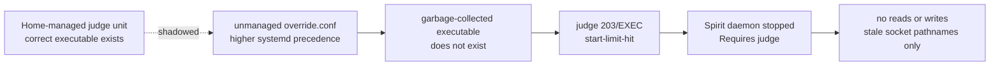
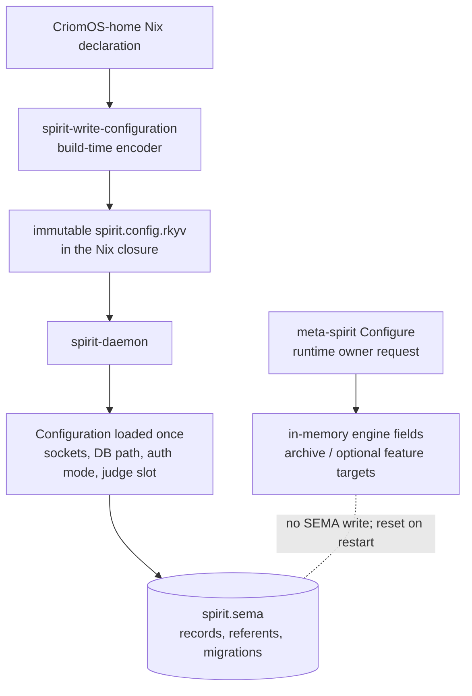

# Spirit judge/daemon outage and declarative recovery

Diagnosis date: 2026-08-03. This was a read-only investigation. No service,
runtime file, corpus, repository, Nix store, profile, or deployment state was
changed.

## Decision-grade result

The live outage is not a Spirit database failure and not the old typed-Serve
argument bug. The managed judge unit names a present executable with the
correct one-argument wrapper. A higher-precedence, unmanaged systemd user
drop-in replaces that command with a garbage-collected executable. Systemd
therefore fails the judge at `203/EXEC`, reaches its start limit, and stops the
required Spirit daemon.

A declarative Home activation can safely restore the current wire/store
contract without changing logical corpus contents, provided it first lands a
narrow migration that removes only the recognized obsolete drop-in. A plain
activation of the currently checked-in Home source is insufficient: that
source creates state directories and installs the corrected unit, but does not
own or remove the drop-in.

“Without touching the corpus” needs one qualification. Activation itself does
not edit `spirit.sema`, and the current migration reports the store as current.
Starting Spirit necessarily opens the database; sema-engine may rewrite file
pages or metadata. The supported invariant is an unchanged logical
`DatabaseMarker`, not byte-for-byte identity after restart. Preserve a verified
private byte copy before activation and compare the marker before and after.

## Live state observed

| Surface | Observation on 2026-08-03 | Meaning |
|:--|:--|:--|
| `spirit-judge.service` | `failed/failed`, `Result=start-limit-hit`, `ExecMainStatus=203`; `DropInPaths` names `spirit-judge.service.d/override.conf` | systemd cannot execute the effective command |
| Managed judge command | target exists and is executable | the declarative wrapper is viable |
| Drop-in judge command | target does not exist and is not executable | the drop-in is the direct fault |
| `spirit-daemon.service` | `inactive/dead`; `Requires=` and `After=` the judge | dependency failure removes both write and read service |
| Working/meta sockets | old pathnames exist under `~/.local/state/spirit`, but `ss` shows no listeners | stale filesystem objects, not availability |
| Judge socket | absent | adapter never became ready |
| Journal | last failure is `No such file or directory`, followed by repeated `203/EXEC` and `start-limit-hit` | corroborates path precedence, not an application crash |
| Store startup | every July 29/30 daemon start printed `Current (24 0)` before dependency teardown | 24 records, no referents; migration was not the outage cause |

The failure chain is therefore:



The operative declarations are in
[`spirit.nix`](/git/github.com/LiGoldragon/CriomOS-home/modules/home/profiles/min/spirit.nix:138):
the typed Serve wrapper is lines 145–159, the judge unit is lines 203–218, and
the daemon dependency and command are lines 239–271. The current activation at
lines 198–200 only runs `spirit-activation-state`, whose source at lines 103–111
contains `mkdir` and no drop-in migration.

## Declarative owners and pin closure

| Layer | Current owner | Relevant current pin/state |
|:--|:--|:--|
| user services, binary startup configuration, service dependency, legacy-drop-in migration | `CriomOS-home` | main `1c33b487`; `home-giq` is open and the migration is not implemented |
| deployment selection and immutable activation | `CriomOS` through Lojix | main `181f5f84`; `CriomOS-dag` is open |
| daemon/runtime/store implementation | `spirit` | current CriomOS follows `74a8ee31` / Spirit 0.25.0 |
| ordinary wire contract | `signal-spirit` | `1cf7c010` |
| owner wire contract | `meta-signal-spirit` | `0a7a2438` |
| judge executable and prompt data | `spirit-judge`, `spirit-judge-config` | `901d1fe4`, `b6a3fe7e` |

The live July 30 generation is Spirit 0.24.1 and corresponds to the pin set in
CriomOS revision `3938a923`: Home `653ade70`, Spirit `7cd3ad86`, judge
`901d1fe4`, and judge config `b6a3fe7e`. The Jul 31 CriomOS pin advance moved
Spirit to `74a8ee31` / 0.25.0.

That advance is not a store/wire migration: both Spirit revisions pin the same
ordinary contract (`1cf7c010`), owner contract (`0a7a2438`), judge contract
(`49bec17c`), sema-engine revision, and Spirit store schema 13. The 0.25 change
does alter transient daemon behavior, notably one-consumer recovery stashes and
bounded observer/mail retention. Therefore:

- restoring through current CriomOS main preserves the wire and durable-store
  contract and should preserve the logical corpus;
- it is not an exact binary/runtime rollback because 0.24.1 becomes 0.25.0;
- if exact 0.24.1 behavior is a recovery requirement, the recovery CriomOS
  revision must deliberately retain Spirit `7cd3ad86` while advancing only the
  Home migration. Do not let `criomos-home.inputs.spirit.follows = "spirit"`
  silently select 0.25.0.

The later Protos-based Spirit train is a separate architectural transition. It
must not be smuggled into this outage transaction.

## Configuration persistence and why `Configure` does not reach the database

There are two unrelated things currently named configuration.



The persistent startup path is source-owned:

1. Home defines working/meta/judge sockets and `spirit.sema` at
   [`spirit.nix:54`](/git/github.com/LiGoldragon/CriomOS-home/modules/home/profiles/min/spirit.nix:54).
2. Home runs `spirit-write-configuration` during the Nix build to create an
   immutable rkyv archive at lines 77–96.
3. The systemd unit passes exactly that archive path to `spirit-daemon` at lines
   264–267.
4. Spirit reads the bytes once and projects socket, meta socket, database,
   authorization, and judge configuration. At deployed revision `7cd3ad86`,
   this is `src/config.rs:17-27,61-73,107-125` and
   `src/daemon.rs:97-142`.

The old mutable `~/.local/state/spirit/spirit.config.rkyv` is present but is not
the file named in the live unit; the operative config is the Nix-store archive.

Meta `Configure` has no persistence path. At deployed revision `7cd3ad86`:

- `src/engine.rs:614-628` explicitly says it does not enter the
  Signal→Nexus→SEMA pipeline and performs no log write;
- `src/engine.rs:629-702` assigns targets and returns the existing live
  `DatabaseMarker`;
- `src/store/mod.rs:109-120` stores `archive_target` as an ordinary process
  field;
- `src/store/mod.rs:340-358` and `500-526` initialize that field to `Default`
  on every open/import;
- `src/store/mod.rs:379-400` is a plain in-memory assignment;
- the archive is opened only later, on collection, at
  `src/store/mod.rs:577-598` and `702-706`.

The process-boundary proof
[`meta_configure.rs:118`](/git/github.com/LiGoldragon/spirit/tests/meta_configure.rs:118)
confirms the receipt echoes the target while the live marker/database remains
unchanged and the archive file is not created. The guardian-prompt field is
even weaker: it is a compatibility echo only, proven at lines 306–362.

The deployed daemon package enables `agent-guardian` but not `criome-gate` or
`mirror-shipper` (`spirit` revision `7cd3ad86`, `flake.nix:737-800`). Thus in
the live binary `Configure` can effectively change only the in-memory archive
target; mirror/criome targets are echoed without compiled implementations and
prompt text is echoed without application. Restart loses the archive target.

This is exactly why `Configure` appears not to reach the database: reaching the
database would contradict its implemented contract. Returning a database marker
reports the unchanged store state; it is not proof that configuration was
committed.

Architectural recommendation: remove compatibility-only `Configure` fields and
put durable operational policy in the typed declarative startup configuration.
If live reconfiguration is genuinely required, give it a separate typed
owner-policy persistence family and explicit startup replay. Do not hide
operational policy inside the psyche corpus.

## Exact proposed recovery operation

### 1. Land a narrow Home-owned migration

In `CriomOS-home`, add one activation node ordered after `linkGeneration` and
before `reloadSystemd`:

```nix
home.activation.removeObsoleteSpiritJudgeOverride =
  lib.hm.dag.entryBetween [ "reloadSystemd" ] [ "linkGeneration" ] ''
    $DRY_RUN_CMD ${migrateObsoleteSpiritJudgeOverride} \
      ${lib.escapeShellArg "${config.xdg.configHome}/systemd/user/spirit-judge.service.d/override.conf"}
  '';
```

The generated script should take exactly one path and implement this closed
predicate:

1. absent file: success/no-op;
2. exactly three lines: `[Service]`, `ExecStart=`, and one
   `ExecStart=/nix/store/<hash>-spirit-judge-daemon-service/bin/spirit-judge-daemon-service`;
3. referenced executable is absent;
4. only then remove that exact file;
5. any other content, extra line, different command, symlink, or live executable:
   fail activation without deleting it.

Use an argument-taking script so the Nix check can run it against disposable
fixtures. The check must prove absent/no-op, recognized-stale/removal, and
unexpected-content/refusal, in addition to the existing typed one-argument
Serve wrapper and daemon `Requires`/`After` assertions. This is the required
implementation of `home-giq`; a broad `rm -f` is not equivalent.

### 2. Close and pin the immutable source chain

Commit and push the Home change. In CriomOS, pin exactly that pushed Home
revision, run the independent deployment check, and build from the pushed
CriomOS revision with the required materialized `system`, `horizon`,
`deployment`, and `secrets` inputs.

Choose the Spirit pin explicitly:

- current contract-compatible recovery: retain CriomOS's `74a8ee31` pin after
  candidate-copy validation;
- exact live-runtime recovery: retain `7cd3ad86` for this transaction.

Record the choice. “Whatever `follows` selects” is not an acceptable recovery
witness.

### 3. Preserve and establish the pre-activation witness

Immediately before activation:

- confirm live status and drop-in still match the diagnosed state;
- verify the approved non-secret Codex session/status surface for the intended
  account, as required by the cutover runbook;
- make a private mode-0600 byte copy of `spirit.sema`, verify it with `cmp`, and
  retain it through acceptance;
- start the selected Spirit candidate only against a second disposable copy,
  separate socket paths, and a generated candidate config, then query `Marker`;
  this yields the before marker without opening the live file;
- do not read or print record bodies.

### 4. Activate only through Lojix

For the pushed recovery revision, the minimal supported activation is the
user-environment transaction:

```sh
meta-lojix "(Deploy (UserEnvironment (goldragon ouranos li /home/li/primary/repos/goldragon/datom.dotos github:LiGoldragon/CriomOS?rev=<RECOVERY_REV> ActivateNow RequireImmutable None [])))"
```

Admission is not success. Wait for:

```sh
lojix "(Query (ByNode (goldragon ouranos None)))"
```

to report the new `Current` user-environment generation.

The activation order then is: link the generated Home unit, recognize and
remove the obsolete drop-in, run Home Manager's `sd-switch`, reset failed user
units, start the declared judge, and start its dependent daemon. A read-only
`sd-switch --dry-run` against the present generation already schedules both
Spirit services to start, so no ad-hoc `systemctl start` or manual
`reset-failed` is required.

## Expected interruption and collateral effects

Spirit already has total downtime; the recovery adds no additional Spirit
outage before the activation transaction. Expected Spirit changes are:

- the obsolete drop-in disappears;
- stale working/meta socket pathnames are removed by `ExecStartPre` and rebound;
- judge, then daemon, start;
- startup opens the current store and reports its counts;
- any prior runtime meta `Configure` selection is absent/default after restart.

Home activation is broader than Spirit. The current `sd-switch` dry run also
schedules several unrelated enabled-but-inactive user units to start and resets
the failed state of unrelated user units. It may restart any user unit whose
declaration changed between the old and new Home generations. This is the main
non-Spirit collateral effect. A complete-host `ActivateNow` would be broader
still; use the `UserEnvironment` action for this repair unless a system change
is intentionally part of the deployment.

If current CriomOS main is selected, Spirit changes from 0.24.1 to 0.25.0.
Durable wire/store contracts remain the same, but transient stash, observer,
and mail-retention behavior changes. Pin 0.24.1 if that breakage is unacceptable
inside an outage recovery.

## Acceptance witnesses

Keep evaluation, deployment, and runtime evidence separate.

### Evaluation/build

- Home migration fixture check passes all three cases.
- Existing deployment check proves one typed Serve argument, no legacy flags,
  and judge dependency ordering.
- CriomOS lock names the exact pushed Home and Spirit revisions.
- Origin/materialized whole-system build passes, even if the activation action
  is user-environment-only.

### Runtime unit/process

- `systemctl --user show spirit-judge.service` reports `active/running`, result
  success, status 0, and no `DropInPaths`.
- effective `ExecStart` is the managed existing wrapper; no obsolete override
  appears in `systemctl --user cat`.
- `spirit-daemon.service` reports `active/running` with its declared
  `Requires`/`After` relationship.
- `ss -xlpn` shows listeners on judge, working, and meta sockets under
  `~/.local/state/spirit`.
- the live judge argv names the pinned executable, provider/model/effort,
  timeout, and non-secret external-session reference; retain no prompts,
  provider output, diagnostics, or credentials.

### Logical store/read safety

- live `Marker` equals the marker obtained from the private pre-activation
  candidate copy;
- `Version` names the deliberately selected Spirit version;
- a marker/read request succeeds without returning corpus bodies;
- byte differences alone do not trigger restore.

### Failure behavior

- on a disposable store/candidate daemon, unavailable, malformed, and timeout
  judge cases produce typed rejections and leave the marker unchanged;
- restarting the live judge through systemd stops/restarts the dependent daemon
  as declared and both return active;
- do not perform accepted-write tests against the production corpus.

## Rollback

If authentication, activation, service, socket, marker, or fail-closed witnesses
fail:

1. stop `spirit-judge.service`; the required daemon must not remain a production
   write path;
2. reactivate the prior known immutable CriomOS revision through the same Lojix
   `UserEnvironment ... ActivateNow RequireImmutable` transaction;
3. confirm Lojix records that generation as `Current`, then verify the prior
   argv/version and logical marker;
4. do not recreate the defective drop-in—the rollback target already declares
   the corrected wrapper, and the drop-in was never valid declarative state;
5. do not restore the database merely because bytes changed after open;
6. if the logical marker changed unexpectedly, keep both services stopped and
   seek explicit recovery authority before replacing the live file from the
   preserved private backup.

The best-known pre-change source pin set is CriomOS `3938a923`, Home
`653ade70`, Spirit `7cd3ad86`, judge `901d1fe4`, and judge config `b6a3fe7e`.
The rollback request should use the full immutable CriomOS revision in the
`?rev=` parameter.

## Remaining unknowns

- No current database marker could be obtained without opening the down live
  store; the report deliberately did not do that. The last current-store count
  witness is `Current (24 0)` from 2026-07-30.
- The Lojix store currently returns an empty generation listing for
  `goldragon/ouranos`, so source/closure evidence rather than Lojix history was
  used to identify the July 30 pin set.
- Whether the psyche wants the legacy service revived temporarily while the
  planned Protos Spirit train is built is a sequencing decision, not a technical
  outage fact.
- A read-available/write-fail-closed deployment is implementable in Spirit code,
  but current systemd policy intentionally couples daemon liveness to judge
  liveness. Changing that policy is separate from this exact-contract recovery.
