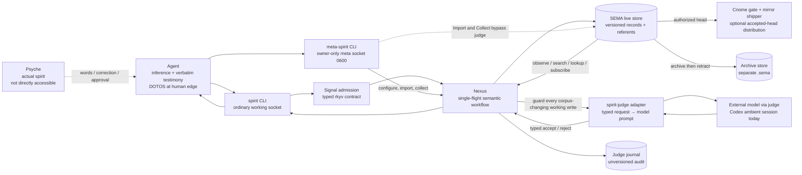
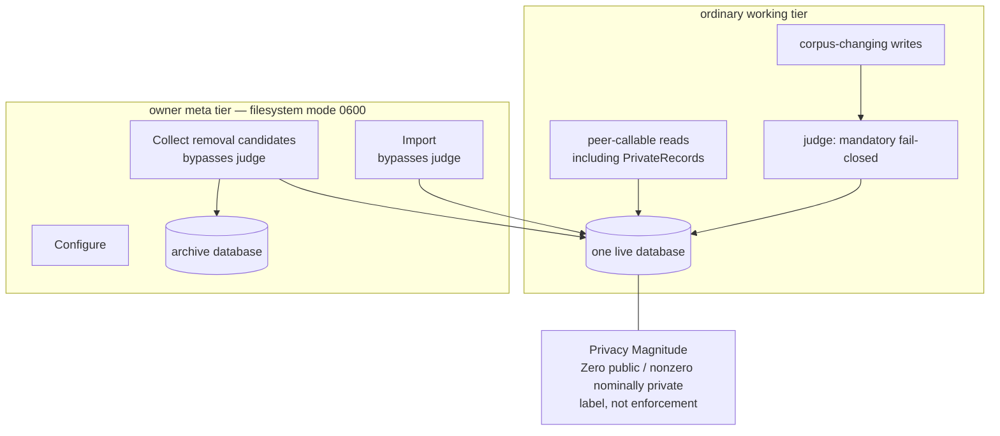
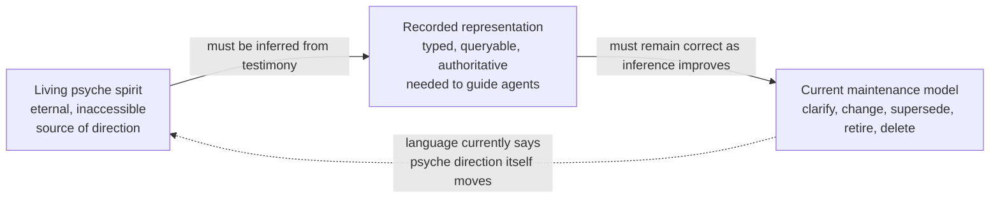

# Spirit: current architecture and the dilemma

Scope: read-only architecture audit on 2026-08-01. “Current” separates checked-in
design, deployed composition, and observed runtime state. It does not treat any
agent-authored document as psyche testimony.

## Psyche vision being represented

The newest psyche ruling says Spirit contains **spirit**, not intent: a computer
representation of the psyche’s living spirit, which agents cannot access directly
and can only infer. “Intent” is freed for its ordinary meaning, what the psyche
wants. The same session describes spirit-grade content as eternal and unchanging.

Evidence:

- `/home/li/primary/design/ProtosEngine/threeLayerNamingAndNomosBootstrap-2026-08-01.md:50-61`
- `/home/li/primary/design/ProtosEngine/traitStandardAndSpiritRename-2026-08-01.md:8-28`
- `/home/li/primary/handoffs/spirit-revival-prompt.md:22-47`

## The smallest faithful topology



Concrete ownership:

| Surface | Owner | Authority / data |
|---|---|---|
| Ordinary request/reply and subscription contract | `/git/github.com/LiGoldragon/signal-spirit` | Record, propose, clarify, supersede, retire, observe/search, public/private shortcuts, events. Schema evidence: `schema/signal.schema:44-45,55-77,146-166,230-263`. |
| Privileged lifecycle contract | `/git/github.com/LiGoldragon/meta-signal-spirit` | Configure, guardian-bypassing import, archive-and-remove collection, head observation. Schema evidence: `schema/meta-signal.schema:9-60`. |
| Runtime composition | `/git/github.com/LiGoldragon/spirit` | Signal admission, Nexus workflow, SEMA store, judge bridge, migration, subscriptions, optional Criome/mirror paths. Architecture evidence: `ARCHITECTURE.md:21-30,173-202,424-475,577-739`. |
| Semantic admission boundary | `/git/github.com/LiGoldragon/{signal-spirit-judge,spirit-judge,spirit-judge-config,judge}` | Typed Spirit judgment contract; adapter owns prompt lowering/parsing; config owns public policy prose; shared judge owns provider mechanics. Evidence: `signal-spirit-judge/ARCHITECTURE.md:3-34`, `spirit-judge/ARCHITECTURE.md:3-42`, `judge/ARCHITECTURE.md:3-25`. |
| Deployment composition | `/git/github.com/LiGoldragon/CriomOS-home` | Declares judge and daemon user services, judge provider/model/session, sockets, binary config and service dependency. Evidence: `modules/home/profiles/min/spirit.nix:18-23,54-95,138-169,202-272`. |

## Authority and privacy cross-section



Observed facts:

- Public/private are filters over one store. The ordinary `PrivateRecords`
  shortcut expands to privacy `AtLeast Minimum`; it is not owner-only
  (`spirit/ARCHITECTURE.md:530-542`).
- The privacy magnitude is explicitly nominal: there is no encryption, storage
  segregation, or enforced access gate; all Spirit data must be treated as
  potentially exposed (`spirit/ARCHITECTURE.md:1009-1019`).
- The judge contract redacts private diagnostics, but the configured adapter may
  send request text to its provider at that explicit boundary
  (`spirit-judge/ARCHITECTURE.md:33-42`).
- Owner `Import` and `CollectRemovalCandidates` bypass semantic judgment by
  design; the filesystem-protected meta socket is the authority boundary
  (`spirit/ARCHITECTURE.md:343-379,599-607`).

## Runtime reality now

On 2026-08-01, direct `systemctl --user` observation reported:

| Unit | State | Immediate cause / consequence |
|---|---|---|
| `spirit-judge.service` | `failed`, `start-limit-hit`, exit 203 | An unmanaged drop-in at `~/.config/systemd/user/spirit-judge.service.d/override.conf` overrides the declared executable with an obsolete collected Nix path. |
| `spirit-daemon.service` | `inactive`, `dead` | It `Requires=` and starts `After=` the judge, so the corpus is not queryable and writes are unavailable. |

The declared source already points at the newer wrapper and intentionally makes
the daemon depend on the fail-closed judge
(`CriomOS-home/modules/home/profiles/min/spirit.nix:145-159,203-218,239-272`).
The offline handoff reports the outage since 2026-07-24 and one queued approved
capture whose envelope still needs validation against the live schema
(`/home/li/primary/handoffs/spirit-revival-prompt.md:6-20`).

This is operational drift, not evidence that the checked-in topology is wrong.
The repair boundary is declarative removal/migration of the stale override plus
activation proof; a manual deletion or restart would hide the source of drift.

## The central architectural dilemma



Spirit’s representation must be authoritative enough to orient future agents,
yet not pretend to *be* the living spirit that the new ruling says agents cannot
access. The existing stack collapses those layers:

1. **The vocabulary and ontology are stale.** The current manual calls Spirit
   “the intent layer,” argues explicitly that “Intent stays,” and the wire still
   exposes `PublicIntent`, `SubscribeIntent`, `IntentEvent`, and related nouns
   (`spirit/manual.md:1-36,148-182`; `signal-spirit/schema/signal.schema:44-45,63,77,146-166`).
   This directly predates and conflicts with the 2026-08-01 psyche ruling.
2. **The current lifecycle describes changes to the psyche’s direction.** Records
   are clarified, superseded, retired, and removed “as the psyche’s direction
   moves” (`spirit/manual.md:357-403`), while the new ruling frames spirit-grade
   content as eternal. Those mutations make sense as corrections to a fallible
   representation; they are hazardous if described as mutations of spirit itself.
3. **The store is called the sole substrate while it is necessarily an
   inference.** Primary architecture calls the deployed store the per-statement
   source of truth (`/home/li/primary/ARCHITECTURE.md:22-43,77-90`). The new ruling
   requires the narrower claim: it can be authoritative for *recorded
   representations and testimony*, never for the psyche’s actual spirit.
4. **A single database promises private records without a private boundary.** A
   private rung and redacted judge diagnostics create useful handling policy, but
   not confidentiality. This is incompatible with treating the store as a safe
   home for genuinely private psyche substance.

The smallest conceptual correction is a three-layer contract:

```text
psyche spirit (unreachable origin)
    ↓ expressed as
verbatim testimony + context (evidence, with real confidentiality boundary)
    ↓ interpreted as
current Spirit records (typed, queryable, revisable projection)
```

Then clarification/supersession means “our recorded inference became more
faithful,” not “the psyche’s spirit changed.” Ordinary intention, architectural
decisions, task state, and Spirit-operation rules remain matter outside the
corpus. The deployed log can be the canonical current projection without being
misnamed as the ontological source.

## The sequencing dilemma

There are two independently necessary changes:

| Need now | Need next | Coupling risk |
|---|---|---|
| Restore the already-pinned daemon/judge composition and prove the unchanged store. | Port `intent` to `spirit`, define the representation/testimony distinction, and eventually move private content to key-gated stores. | Waiting for the semantic/Ethos redesign leaves the only consultation surface offline; mixing redesign into recovery obscures whether service repair or data migration failed. |

Evidence supports **recover first at the existing pinned contract, then migrate on
an isolated copied store**. Spirit’s own architecture says the current generator
is a legacy implementation pending an Ethos port (`spirit/ARCHITECTURE.md:8-19`),
and the revival handoff already separates revival from the vocabulary port
(`/home/li/primary/handoffs/spirit-revival-prompt.md:6-47`). This is an
architecture boundary, not authorization to mutate either system.

## Questions requiring the psyche

1. Is “eternal and unchanging” the admission criterion for every Spirit record,
   or the character of the underlying spirit while recorded projections may be
   provisional?
2. Should Spirit remain public-only until key-gated storage exists, with private
   testimony held elsewhere, or is a separate secure-private Spirit store now
   part of the required architecture?
3. During the vocabulary port, should wire names be broken immediately (the
   system is being born), or should old `Intent*` nouns survive only as narrow
   migration aliases until the production store has been folded?

## Evidence discipline

Observations above come from checked-in source and direct unit state. The
three-layer correction and recovery-before-migration sequencing are analysis,
not psyche rulings. Unknown: the current production store’s contents and whether
the queued record is already represented elsewhere; this audit did not read the
store or mutate services.
