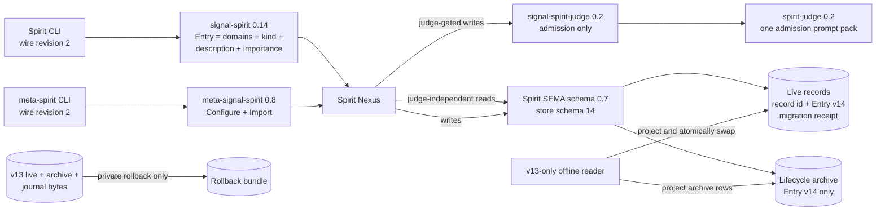

# Spirit certainty, privacy, and referent removal

Status: implementation design only. No runtime, repository, deployment, or
production-state change is authorized by this document.

Date: 2026-08-03

## Ruling and consequence

The psyche's rulings are exact:

- “I want certainty, privacy and referents gone”.
- “just throw the corresponding data out of the migrated database.”

The accepted migration interpretation is:

- preserve every live record's stable identifier, domains, kind, description,
  and importance;
- discard its certainty value, privacy value, and referent list;
- discard the complete referent catalogue, aliases, indexes, and referent
  history from the new live store;
- carry no compatibility columns, shadow tables, invented defaults, or
  embedded legacy archive in the new live store;
- keep exact legacy bytes only in a private pre-migration rollback bundle;
- preserve the independent lifecycle-archive invariant by projecting archived
  records to the same new entry shape. Candidate-specific archive behavior is
  removed; capture-before-retract for explicit lifecycle operations remains.

This is a clean break, not a deprecation.

## The architecture after the cut



Nothing in the target architecture stores, transmits, queries, judges,
renders, or documents a Spirit certainty, Spirit privacy, or Spirit referent.
The words may still occur in the frozen v13 migration reader, in generic
security prose, or as unrelated subject-domain names; those are not active
Spirit concepts.

## Exact replacement semantics

### Entry and record substance

The current entry is:

```text
Entry { Domains Kind Description Certainty Importance Privacy Referents }
```

The replacement is exactly:

```text
Entry { Domains Kind Description Importance }
```

`Magnitude` stays because `Importance` still uses it. `BumpImportance` and
`ImportanceSelection` stay. There is no generic metadata map and no status,
confidence, visibility, tag, label, topic, alias, or replacement referent
field.

The live store does not persist justification today, so migration cannot add
it to “substance”. The retained substance is precisely the fields already
stored in `Entry`, minus the three removed surfaces.

### Uniform visibility

There is one visibility class: every surviving live record is returned by the
ordinary read surface. Previously nonzero-privacy records become ordinarily
readable after migration. Previously zero-certainty records also become
ordinary live records. The migration must not silently delete, hide, or
quarantine either group, because the ruling preserves live record identity and
substance and provides no replacement visibility or candidacy state.

The working contract changes are:

- remove `PublicRecords` and `PrivateRecords`; `Observe(Query)` already covers
  record observation without a visibility split;
- remove `PrivacySelection` and `CertaintySelection` from `Query`;
- rename the current privacy-filtering `PublicTextSearch` operation to
  `TextSearch`; it searches descriptions of all live records, retains the
  existing result limit, and drops referent and certainty ranking inputs;
- rename the current privacy-filtering `PublicIntent` operation to
  `Intent`; it preserves the domain-scope matching behavior over all live
  records and drops certainty ranking;
- keep `Observe`, `Lookup`, `Count`, `Marker`, `Version`, `LookupStash`, and
  subscriptions as judge-independent reads.

The corresponding SEMA read roots become `Observe`, `Intent`, `TextSearch`,
`Lookup`, and `Count`. Search scoring uses description text only. Where an
existing ordering used certainty as a secondary key, remove only that key and
retain the existing importance and stable store-order behavior.

The read implementation remains judge-independent. The current Home unit's
`Requires=spirit-judge.service` makes the whole daemon operationally
unavailable when the judge service is absent, but that service-policy issue is
not technically forced by this schema cut. Do not combine a service dependency
redesign with this train.

### Removal and lifecycle

There is no removal-candidate state after the cut:

- remove `ChangeCertainty`, `CertaintyChanged`, and their receipts;
- remove `RemovalCandidateCollection`, `RemovalCandidatesCollection`, all
  archive/skip/identifier helper types used only by candidate collection, and
  `CollectRemovalCandidates` from the meta contract and CLI;
- do not infer retirement from an old certainty value during migration;
- do not add a boolean, status enum, tombstone, review queue, or replacement
  candidate selector.

Explicit lifecycle operations remain the only removal authority:

- `Retire` removes one named live record after the existing justification and
  admission checks;
- `Supersede` and clarification-resolution flows may retract their named source
  records as they do today;
- `ChangeRecord` and clarification flows may replace a named record as they do
  today.

Their capture-before-mutate/retract invariant remains. The separate lifecycle
archive is not the certainty candidate system: it stores the prior record in
the v14 entry shape before a destructive live-store mutation. If the archive
write fails, the live mutation must still fail closed.

### Referent-supported behavior

Remove all of the following without substitutes:

- `Referent`, `Referents`, `Aliases`, registration requests and receipts,
  registered-referent observations, and validation errors;
- `RegisterReferent`, `ReferentGuardianRejected`, and the referent-judge
  request/reply family;
- the referent SEMA family, registration/canonicalization/alias merge logic,
  automatic registration during Record or Import, and referent query filters;
- implied-referent Nexus continuations and `GuardReferentRegistration`;
- referent text scoring and referent-derived guardian context;
- referent prompt packs, fixtures, CLI help, rendering, traces, examples, and
  manuals.

Admission duplicate detection already has an exact kind/domain/description
path and remains. Guardian context gathering uses domain neighborhoods and the
explicit target records of mutate/retire operations. A named particular may
appear naturally in `Description`; no parallel tag or alias namespace is
introduced.

The `State` classifier emits the same fallback domain, kind, description, and
minimum importance, with no fallback certainty, privacy, or `state` referent.

## Contract and judge changes

### `signal-spirit`

The source schema is authoritative. Remove the types and routes above, update
the observer `OperationKind`, validation catalogues, constructors, canonical
examples, checked-in generated Rust, schema metadata, README, architecture,
and tests together. Dense route discriminants may be regenerated because this
is wire revision 2; no revision-1 frame is accepted.

`ApplyAuthorizedRecord` may remain, but its `VersionedEntryHex` is valid only
for the v14 SEMA log and revision-2 contract. A v13 body or revision-1 frame is
rejected rather than upgraded online.

### `meta-signal-spirit`

Remove `CollectRemovalCandidates` and its response. Keep:

- `Configure`, including the existing lifecycle archive target, optional
  mirror target, Criome gate target, and guardian prompt target;
- `Import` with stable `RecordIdentifier` and the v14 `Entry` shape;
- head observation operations if they remain in the converged contract.

`Import` is not a compatibility decoder. It accepts v14 records only. The
offline migration executable is the sole reader of v13 entries.

The archive target remains because the lifecycle archive remains. Whether a
runtime `Configure` choice becomes durable across restarts is a separate
configuration design and is not changed here.

### `signal-spirit-judge`, `spirit-judge`, and prompt config

The judge wire contract carries only `JudgeAdmission` and its response:

```text
AdmissionJudgePacket { AdmissionJudgeOperation RecordSet DatabaseMarker }
```

Remove `JudgmentScope`, `Public`, `Private`, `PrivateDiagnosticPolicy`, the
referent-registration packet/response/verdict/reasons, `UnclearPrivacy`, and
the certainty-specific `Overstated` reason. Keep the importance-specific
`ImportanceUnsupported` reason.

The adapter removes scope projection and every referent path. It applies the
existing conservative redacted/hash diagnostic discipline uniformly, as an
operational security rule rather than a Spirit privacy level. Provider/model,
credential, retry, timeout, socket, and durable daemon-configuration behavior
do not change.

The prompt pack must:

- describe the four-field Entry;
- remove the certainty burden ladder, privacy boundary, referent registration
  pack, referent classification rules, candidate/downgrade examples, and
  privacy fixture;
- judge the testimony's warrant for the proposition directly, without a
  confidence rung;
- retain the rare-intent boundary, domains, kind, importance burden,
  destructive-operation authorization, testimony integrity, and fail-closed
  diagnostics;
- replace “private” diagnostic wording with “sensitive” where it refers to
  operational non-disclosure rather than a Spirit field.

`spirit-judge-config` has no semantic package version. Publish a new commit and
pin it in the Spirit release root.

## Storage and migration

### Store schema 14

The active families are:

```text
RecordsFamily    StoredRecord { RecordIdentifier EntryV14 }
MigrationsFamily Migration { SourceSchemaVersion MigratedRecordCount }
```

Remove `ReferentsFamily`. Change the records and migrations family hashes.
Do not carry earlier migration rows because the old marker type contains
`MigratedReferentCount`; write one new v13-to-v14 receipt after the retained
records have been folded. Do not store discarded-field counts or discarded
referent counts in the new database. Such counts may appear in ephemeral,
non-content activation output, but not as a compatibility shadow.

The state digest hashes the new stored-record bytes and commit sequence only.
Its value and the commit sequence will change across migration. Acceptance
therefore compares stable identifiers and retained fields, not v13 and v14
markers.

The migration creates a fresh versioned log by asserting only projected v14
records and the v14 migration receipt. It does not replay the v13 log,
checkpoint, migration rows, referent operations, or mirror acknowledgement
state. This prevents removed data from surviving in historical log bodies.

### Frozen v13 projection

Keep all legacy types under the offline-only `production-migration::v13`
module. Normal daemon/CLI builds must not compile or export them.

For every v13 live row:

```text
(id, domains, kind, description, certainty, importance, privacy, referents)
  -> (id, domains, kind, description, importance)
```

For the v13 referent catalogue: read only enough to validate the source store,
then emit no target row. For old migration rows: emit no target row.

For every separate lifecycle-archive row, preserve its archive key and project
its Entry through the same transform. Build and validate the complete v14 live
and v14 archive temporary files before exposing either target. Do not migrate a
candidate-specific collection as a separate concept; archived rows are just
lifecycle records after projection.

The guardian journal moves from schema 6 to schema 7. Schema 7 contains only
admission decisions over v14 operations/record sets and starts fresh; it does
not migrate referent decisions or old Entry bodies. The v6 journal is rollback
material only.

### Mirroring and peer application

The v14 log is a new history root and cannot append to the remote v13 `spirit`
head. Use a generation-qualified mirror store identity such as
`spirit:sema:v14`; old checkpoints and suffixes are rejected by v14 restore.
Publish a v14 checkpoint only after local migration and verification.

The deployed Home composition currently leaves mirroring unconfigured, so this
does not force a mirror migration there. Any installation with an active mirror
must block activation until it can select the v14 store generation. After the
rollback window, removal of the old remote generation is a separate explicit
destructive operation; the current mirror has no ordinary history-delete API,
so it must not be silently approximated.

Cluster peers that exchange `ApplyAuthorizedRecord` bodies must cut over as one
wire/storage generation. Mixed v13/v14 peer application is unsupported.

### Lifecycle archive and rollback bundle

These are distinct:

| Surface | Active after cut | Contains legacy bytes |
|---|---:|---:|
| v14 live store | yes | no |
| v14 lifecycle archive | yes | no |
| v7 guardian journal | yes | no |
| private rollback bundle | no, rollback only | yes |
| old remote mirror generation, when present | no | yes until explicit purge |

The rollback bundle contains the exact quiesced v13 live store, lifecycle
archive, v6 guardian journal, and the deployment generation needed to reopen
them. Its directory is private, its files retain restrictive ownership/modes,
and its contents are never printed, copied to a public report, or ingested by
v14. Cleanup after acceptance is separately authorized destruction.

## Wire, storage, and package versions

| Surface | Current | Target |
|---|---:|---:|
| `signal-spirit` contract ID 1 | wire revision 1 | wire revision 2 |
| `meta-signal-spirit` contract ID 2 | wire revision 1 | wire revision 2 |
| `signal-spirit-judge` contract ID 3 | wire revision 1 | wire revision 2 |
| `protos` crate | 0.5.0 | 0.6.0 |
| `signal-spirit` crate/schema metadata | 0.13.0 | 0.14.0 |
| `meta-signal-spirit` crate/schema metadata | 0.7.1 | 0.8.0 |
| `signal-spirit-judge` crate | 0.1.0 | 0.2.0 |
| `spirit-judge` crate | 0.1.0 | 0.2.0 |
| Spirit Cargo package | 0.25.0 | 0.26.0 |
| maintained Spirit release | 0.25.1 | 0.26.0 |
| Spirit generated application schema | 0.6.0 | 0.7.0 |
| Spirit SEMA store | 13 | 14 |
| Spirit guardian journal | 6 | 7 |
| `language-engine-witness` | 0.22.0 | 0.23.0 |

All packages are pre-1.0, so their semver-breaking bump is the minor component.

The `protos` registry must append revision 2 for contract IDs 1, 2, and 3.
Its current API calls the whole binding history “supported bindings” and says
an old decoder remains. That is false for this clean break. Change the registry
contract so allocation history and the currently accepted decoder set are
distinct, or rename the public history API to make it historical only. Runtime
consumers accept revision 2 only. The numeric revision-1 allocation remains
append-only registry history, not a decoder or payload compatibility layer.

No version bump is required for generic `sema`, `sema-engine`, `signal-sema`,
or `protos-engine` unless implementation discovers a missing generic capability.
They require only the documentation/fixture/pin changes listed below.

The standalone daemon configuration archive keeps its current format because
none of its fields are certainty, privacy, or referents. Add a golden decode
test and do not couple its storage version to the broken working/meta wire
contracts. Durable configuration is a separate surface.

## Repository change map

| Repository/surface | Coordinated change |
|---|---|
| `protos` | Append wire revisions 2 for the three Spirit families; make allocation history distinct from accepted decoders; update registry tests/docs; bump 0.6.0. |
| `signal-spirit` | Four-field Entry; remove fields, selectors, routes, types, validation, rendering examples; rename uniform read shorthands; regenerate; bump 0.14.0. |
| `meta-signal-spirit` | Remove candidate collection; retain Configure/archive target and v14 Import; regenerate; bump 0.8.0. |
| `signal-spirit-judge` | Admission-only, scopeless contract; remove certainty/privacy/referent reasons and types; bump 0.2.0. |
| `spirit-judge-config` | Delete referent pack and privacy fixture; rewrite Entry/checklist/examples/manifest/checks; preserve conservative diagnostics; new commit pin. |
| `spirit-judge` | Remove referent and scope lowering/parsing; consume new prompt pack and contracts; bump 0.2.0. |
| `spirit` | Regenerate Interface/Nexus/SEMA; simplify runtime/CLI/trace/render; store 14, journal 7, v13 projection, archive projection, v14 mirror generation; docs/manual/tests; package/release 0.26.0. |
| `language-engine-witness` | Replace Interface/Nexus/SEMA Ethos fixtures and name allocation config, remove `guardReferent` and referent table witnesses, update compile assertions/provenance; bump 0.23.0. |
| `protos-engine` | Repin the converged Spirit producers/runtime and keep the process-level read witness on revision-2 syntax; no engine behavior change forced. |
| `sema` | Delete Spirit-specific certainty/privacy/candidate claims from the generic kernel architecture; retain generic capture-before-remove facts. No code/version change. |
| `signal-sema` | Retain generic `Magnitude`; remove Spirit certainty/candidate examples from docs. No code/version change. |
| `skills` source | Current canonical skill source contains no Spirit certainty/privacy/referent metadata instructions. Do not invent a skill edit. Regenerate role outputs if their source revision still carries old clauses. |
| Primary generated roles | Manager/intent-recorder proposals ask for exact intent wording and authorization, not privacy/certainty/referent metadata. Never invent missing removed fields. |
| `CriomOS-home` | Consume the single Spirit 0.26 release root; refresh `primary-generated-src` and harness assertions that currently require “proposed privacy”; keep service topology and config archive stable. |
| `CriomOS` | Pin the pushed Spirit 0.26 release root and update its lock; Home continues to follow that root. Update cutover prose/checks, not service policy. |

The canonical Spirit Ethos examples currently live both in
`reports/spiritEthosFixtures` and in `language-engine-witness/tests/fixtures`.
Update them from one reviewed target shape, then regenerate. Never hand-edit
checked-in generated Rust or let the wired-legacy schemas and the Protos target
describe different semantics.

Several relevant shared checkouts currently contain uncommitted Ethos-port
work. Implementation must use edit coordination and start from the converged
owner revision; this design is not permission to overwrite those working
copies.

## Compatibility policy

- No dual routes, route aliases, old arity parsers, synthetic defaults, legacy
  response projections, or online v13 import.
- Old CLI, daemon, judge, and peer binaries fail at wire revision negotiation
  or decode. An old client never receives invented certainty/privacy/referents.
- The v13 reader exists only in the offline migration feature and executable.
- A v14 daemon refuses a v13 store and names the migration tool.
- A v13 daemon cannot open v14; rollback restores the byte-exact v13 bundle
  and the 0.25.1 release together.
- Old Dotos/NOTA examples with seven Entry fields fail parsing; documentation
  and role packets move atomically with the client release.
- Existing standalone daemon configuration archives continue to decode if the
  golden compatibility test passes.

## Smallest sufficient proof

1. Contract tests: v14 Entry has four fields; revision-2 frame/Dotos round
   trips pass; removed roots and selectors have no constructors; revision-1
   frames are refused.
2. Meta tests: v14 stable-ID Import works; `CollectRemovalCandidates` is
   absent; Configure still carries archive/mirror/Criome/prompt policy.
3. Judge tests: one admission request round trip, no scope or referent variants,
   uniform redacted diagnostics, and prompt manifest contains no removed
   semantic guidance.
4. Store tests: Record/Observe/Lookup/Count/TextSearch/Intent, importance
   filtering/bump, and explicit archive-before-Retire all work on schema 14.
5. Migration fixture: seed a frozen v13 live store with records spanning old
   certainty/privacy values and referent lists, a referent catalogue, old
   migration rows, one lifecycle archive row, and a v6 journal. After migration,
   assert identical live IDs and retained fields, identical projected archive
   keys/fields, no referent family, no old markers, fresh v7 journal, and no
   legacy bytes in the v14 files.
6. Migration behavior: old private and zero-certainty live records are both
   observable; no old row is automatically retired; second migration is a
   no-op; wrong-version/corrupt source and crash-boundary cases fail safely.
7. Rollback proof: hash and reopen the private v13 backup with Spirit 0.25.1;
   do not print record contents.
8. Mirror/peer proof when enabled: revision-2 v14 bodies round trip under the
   v14 store generation; v13 body/checkpoint and mixed peer frames are refused.
9. Process proof: new CLI syntax crosses real sockets; the removed commands and
   seven-field Entry fail; normal reads remain independent in the engine path.
10. Release proof: generated artifacts are fresh; all crate tests/checks pass;
    the Spirit release manifest pins exactly the new contracts, judge, prompt
    config, and SEMA engine; Home and CriomOS evaluate against that one root.

A semantic residue audit should use an allowlist, not a naive global word ban:
the frozen v13 reader, generic security/privacy guidance, and a subject-domain
named `Privacy` are legitimate. Active v14 schemas, runtime variants, prompts,
CLI help, manuals, and generated outputs must have no removed Spirit surface.

## Release and activation order

1. Land `protos` revision-history semantics and wire allocations.
2. Land `signal-spirit` 0.14.
3. In parallel after that pin, land `meta-signal-spirit` 0.8 and
   `signal-spirit-judge` 0.2.
4. Land the rewritten prompt config, then `spirit-judge` 0.2 against the exact
   new contract commits.
5. Update the reviewed Interface/Nexus/SEMA Ethos fixtures and generation
   witnesses. Regenerate application code; do not patch generated output.
6. Land Spirit 0.26 with store 14, journal 7, frozen migration, archive
   projection, CLI/manual changes, and an exact release manifest.
7. Repin `protos-engine`, then update Home's Spirit root and generated-role
   witness; push Home. Pin the pushed Spirit root in CriomOS and push it before
   any origin/materialized build.
8. On an isolated copy of the production state, run migration, reopen, read,
   write, archive, restart, and rollback proofs. Do not touch the production
   original.
9. Ask for a contemporaneous disruption window. Quiesce all writers and peers,
   stop judge and Spirit, create and verify the private rollback bundle, run the
   offline migration, start the new judge then daemon, and run content-free
   smoke checks plus retained-ID/count comparison.
10. If healthy, publish the new mirror checkpoint when applicable and resume
    writers. Keep the rollback bundle through an explicit acceptance window.
11. Only after acceptance, separately authorize deletion of legacy local
    backups/journals and any old remote mirror generation.

Regular Home activation must not be used as an accidental disruption window.
The current idempotent `ExecStartPre` migration hook may remain the mechanism,
but deployment must occur only after the isolated proof and explicit window;
it must create/verify the rollback bundle before exposing v14.

## Rollback

Rollback is generation replacement, not reverse migration:

1. stop the v14 daemon and judge and quiesce peers;
2. restore the exact v13 live store, lifecycle archive, and v6 guardian journal
   from the private bundle;
3. reactivate the previous Home/CriomOS generation pinned to Spirit 0.25.1 and
   its matching judge/config/contracts;
4. restore/select the old mirror generation if mirroring was active;
5. start the old judge and daemon and verify marker/count without printing
   content.

Do not feed v14 records back through a v13 Import and do not attempt to recreate
discarded certainty, privacy, or referents.

## Destructive ledger

Genuinely destructive or irreversible after backup cleanup:

- projecting the live and lifecycle archive stores discards certainty/privacy
  fields, per-record referent lists, the referent catalogue, old migration
  rows, and the old versioned-log history from active state;
- starting a fresh v7 guardian journal drops old decision history from active
  state;
- exposing formerly private records changes confidentiality even though it
  does not delete content;
- deleting the private rollback bundle destroys the only supported recovery of
  the discarded metadata and old journal;
- purging an old remote mirror generation destroys its legacy log/checkpoints.

Breaking but not data-destructive:

- wire revision and package bumps;
- removal/renaming of commands, prompts, docs, tests, and generated symbols;
- pin updates and service restarts.

Ordinary explicit lifecycle operations remain capture-before-retract. Their
live-row removal is destructive to the hot store but recoverable from the v14
lifecycle archive under the existing archive invariant.

## Deliberately separate work

This train does not:

- make runtime meta configuration durable;
- remove the lifecycle archive or invent a new deletion status;
- change the service-level `Requires=spirit-judge` policy;
- change generic security/privacy doctrine or the `Privacy` subject domain;
- redesign domains, kinds, importance, justification, record identifiers,
  admission, Criome authorization, or mirror retention;
- add a new archive-retrieval CLI where none is currently deployed.

If any of those changes becomes desirable, it needs its own ruling and design.
