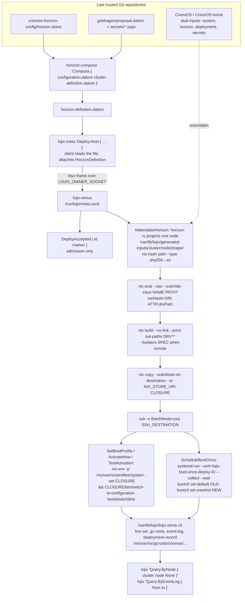
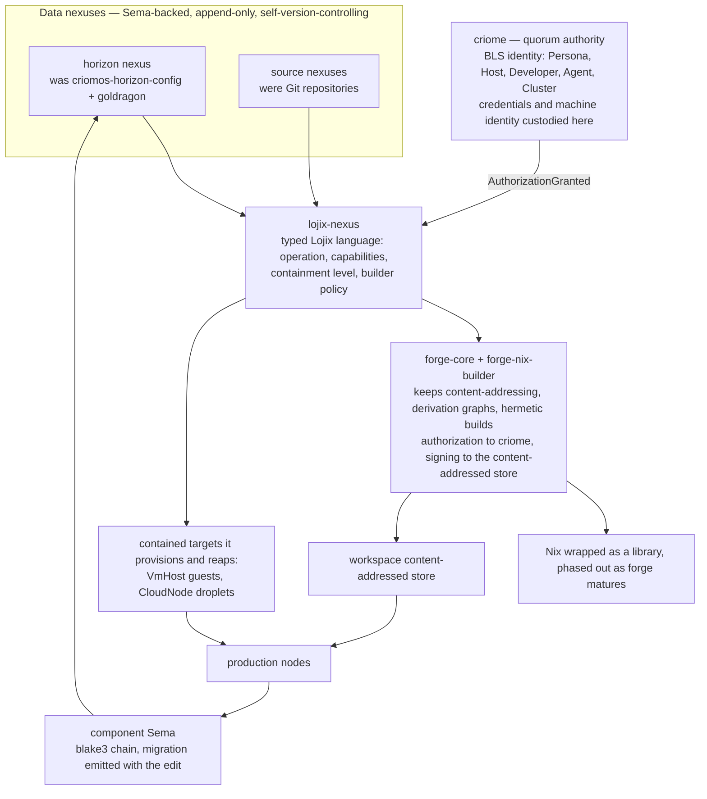

# Lojix and Horizon — architecture and anatomy, first view — 2026-09-16

Read-only subflow of efa157, answering `vision/lojix.md`. **W** = witnessed (file read this session), **I** = inferred.
Repository root `/git`, all repos under `/git/github.com/LiGoldragon/`. Where a checkout is detached and stale, `origin/main` was read instead and is marked.

## 1. The components

- **lojix** (W) — the deploy stack: one long-lived Nexus plus thin CLIs, holding durable deploy state, the live generation set, GC roots, the deployment event log, test runs, and the activation pipeline. Repo `lojix`; local checkout detached at **4.0.1** (2026-09-11) while `origin/main` is **6.0.0**, so every quotation below is from `origin/main`. Binaries `lojix-nexus`, `lojix`, `lojix-meta`, `lojix-bootstrap`, `lojix-inspect-store`, `lojix-reset-store`, `lojix-write-configuration`, `lojix-migrate-configuration`.
- **signal-lojix / meta-signal-lojix** (W) — the two wire contracts, authored as `ethos/signal.ethos` and generated to Rust. Ordinary holds `Query`/`Watch*`/`Unwatch`; meta holds `Deploy`/`Pin`/`Unpin`/`Retire`/`Test`/`Configure`.
- **horizon-rs** (W) — the Horizon schema and its projector, holding `lib/ethos/horizon.ethos` (the authored cluster model) and the projection turning a cluster proposal into one node's JSON view. Repo `horizon-rs`, 0.12.0, HEAD 2026-09-12.
- **criomos-horizon-config** (W) — the pan-horizon facts no cluster owns: operator identity, DNS suffixes, the transitional IPv4 LAN. One file, `horizon.dotos`, 12 lines, no flake.
- **goldragon** (W) — the production cluster data: every node, user, domain and trust relation, plus `secrets/*.sops`. Data only — `proposal.datom` (one line), `synchronizer.datomic`, no code, no flake.
- **CriomOS** (W) — the NixOS platform Lojix builds. Modules only; exactly one `nixosConfigurations.target` and no host name anywhere in the tree. Its four inputs `system`, `horizon`, `deployment`, `secrets` are `path:./stubs/no-*` placeholders Lojix overrides.
- **CriomOS-home** (W) — the home-manager profile, its own flake; `homeConfigurations = builtins.mapAttrs mkHomeConfiguration horizon.users`, keyed by projected users. Same `horizon` stub input.
- **CriomOS-test-cluster** (W) — the fixture cluster `fieldlab`, deliberately not `goldragon`. Holds cluster `.dotos`, committed per-node projections pinned equal to CLI output, and per-node generated VM checks.
- **sema / sema-engine** (W) — the storage kernel and the database engine above it. `sema` is redb + rkyv with a hard version guard; `sema-engine` (10,875 LOC) is the append-only, blake3 hash-chained versioned log that `lojix.sema` actually is. Also `signal-sema`, `sema-storage` (legacy), `sema-translator`.
- **criome** (W) — today a real BLS signature, identity and quorum daemon (12,853 LOC, v0.9.1): identity registry, quorum rounds, attested time, founding conveyance. With `signal-criome`. Note the spelling — the authority organ is **criome**; **CriomOS** is the OS family, a separate line.
- **forge** (W) — a stub. 25 files, ~183 LOC, every body `todo!()`; its README says "Status: future work… Skeleton-as-design until criome scaffolds." With `signal-forge`.
- **signal-harness** (W) — unrelated to deployment: the router↔harness contract for driving coding-agent CLIs (`HarnessKind.[ Codex Claude Pi Fixture ]`).

## 2. A deployment today, step by step

Live state (W, this host): `systemctl is-active lojix` → **active**; unit `Lojix Nexus`, `ExecStart=/nix/store/…-lojix-nexus-service-user-gpg-agent`, `User=li`, `WorkingDirectory=/var/lib/lojix`. Sockets `/run/lojix/ordinary.sock` (srw-rw----) and `/run/lojix/meta.sock` (srw-------).

1. **Author.** A change lands in `goldragon/proposal.datom` or `criomos-horizon-config/horizon.dotos` (cluster and horizon facts), or in `CriomOS` / `CriomOS-home` (the platform). These are the "last trusted Git repositories". (W)
2. **Compose.** `horizon-compose 'Compose.{ <configuration.datom> <cluster-definition.datom> }'` joins the two into one `HorizonDefinition`, written as a file named exactly `horizon-definition.datom`. Fixture at `/git/github.com/LiGoldragon/CriomOS/fixtures/horizon-definition.datom`. (W)
3. **Submit.** The operator runs `lojix-meta 'Deploy.Host.{ <cluster> <node> CompleteHost <proposal-source> <secrets> <flake-ref> { <NixStoreUri> <SshDestination> } Horizon { <attr> } NixosSystemdBootV1 <action> RequireImmutable None [] }'`. The **meta client itself** reads the proposal file off disk — absolute, traversal-free, symlink-free, named `horizon-definition.datom` — and attaches it, making `ActualizedDeploySubmission.{ DeploySubmission Option<HorizonDefinition> }`. (W)
4. **Transport.** One length-prefixed rkyv frame over `$LOJIX_OWNER_SOCKET` (a Unix socket, not SSH) to `lojix-nexus`. Reply `DeployAccepted.{ <deployment-id> <marker> }` — admission only. (W)
5. **Materialize.** The Nexus projects the proposal for that one node with `horizon-rs` in-process and writes tiny flake inputs under `<state-directory>/generated-inputs/<cluster>/<node>/<shape>/`. On this host: `/var/lib/lojix/generated-inputs/goldragon/{ouranos,prometheus,zeus}/{complete-host,full-os,base-host,os-only,home,user-environment}/{horizon,system,deployment,secrets}/`. Contents witnessed: `horizon/flake.nix` = `{ outputs = _: { horizon = builtins.fromJSON (builtins.readFile ./horizon.json); }; }` beside a 28 KB `horizon.json`; `system/flake.nix` = `{ outputs = _: { system = "x86_64-linux"; }; }`; `deployment/flake.nix` = `{ outputs = _: { deployment = { includeHome = true; includeAllFirmware = true; }; }; }`; `secrets/flake.nix` mapping each `*.sops`. Each is content-addressed by `nix hash path --type sha256 --sri`. Failure stage here is `MaterializeHorizon`. (W)
6. **Evaluate.** `nix eval [--refresh] --raw --override-input <name> <path>?narHash=<sri> … <attribute>.drvPath`. The overrides land on CriomOS's four stub inputs, whose `no-horizon` stub otherwise throws "CriomOS: no horizon input was provided." (W)
7. **Build.** `nix build --no-link --print-out-paths <closure>^*`, plus `--option extra-substituters <urls> --option extra-trusted-public-keys <keys>` when substituters are supplied, or `--option max-jobs 0 --builders <spec>` for a remote builder. `/etc/nix/machines` is never used. (W)
8. **Copy.** `nix copy --substitute-on-destination --to <NixStoreUri> <store-path>` — the URI verbatim from the request, never derived from names. (W)
9. **Activate.** One `ssh -o BatchMode=yes <SshDestination> <remote-command>`. For `SetBootProfile`/`ActivateNow` the remote command is `nix-env -p /nix/var/nix/profiles/system --set <store> && <store>/bin/switch-to-configuration boot|switch`; for `TestActivation` it is `<store>/bin/switch-to-configuration test` with no profile change. (W)
10. **ScheduleBootOnce.** Instead, a script wrapped in `systemd-run --unit=lojix-boot-once-deploy-<deployment-id> --collect --wait --service-type=oneshot`, which reads `OLD` from `bootctl status` ("Current Entry"), sets the profile, runs `switch-to-configuration boot`, reads `NEW` from `/boot/loader/loader.conf`, then `bootctl set-default "$OLD"` and `bootctl set-oneshot "$NEW"` — the next boot tries the new generation once and falls back. The unit name is also the durable resume cursor. (W)
11. **Record.** Every phase writes to `/var/lib/lojix/lojix.sema` (schema v5) — tables `live-set`, `gc-roots`, `event-log`, `container-lifecycle`, `deploy-job`, `test-run`, `deployment-record`, `identifier-allocation`, `deployment-outbox`, `pending-transition-intent`, `nexus-configuration`. GC roots at `/nix/var/nix/gcroots/criomos/<cluster>/<node>/<kind>/<generation>`. (W)
12. **Observe.** `lojix 'Query.ByNode.{ <cluster> <node> None }'` or `'Query.ByEventLog.{ <from> <to> }'` on the ordinary socket until a `DeployTerminal` record exists. (W)

`nixos-rebuild` appears nowhere in the source. (W)

## 3. The interfaces

Authored in ethos, generated to Rust, the build rejecting stale generated code. Every CLI takes exactly one inline datom value; flags, files and subcommands are refused. (W)

Host deploy actions — `signal-lojix/ethos/signal.ethos`:
`HostDeployAction.[ TestActivation ScheduleBootOnce Realize SetBootProfile Evaluate ActivateNow ]`
`UserEnvironmentAction.[ ActivateNow Realize SetProfile ]`
`ActivationEffect.[ ProfileOnly BootOnceProfile TestActivation LiveActivation BootProfile ]`
`ActivationBackend.[ HomeManagerNixProfileV1 NixosSystemdBootV1 ]`
`HostComposition.[ CompleteHost BaseHost ]` · `GenerationArtifact.[ BaseHost CompleteHost UserEnvironment ]`
`DeploymentInputMode.[ Horizon Direct ]` · `SourceRevisionPolicy.[ ResolveAndRecord RequireImmutable ]`
`DeploymentTransport.{ NixStoreUri SshDestination }` · `DeploymentOutputSelector.{ FlakeAttribute }`
`DeploymentPhase.[ Built Completed Failed Copying Rejected Activated Submitted Building Activating ]`
`DeploymentFailureStage.[ Build Eval MaterializeHorizon Daemon Activate CopyClosure Admission FlakeAuth ]`
`GenerationSlot.[ Pinned Recent Rollback BootPending Current ]` · `TestMode.[ Hermetic Live ]`

Owner verbs — `meta-signal-lojix/ethos/signal.ethos`:
`[ Configure.LojixNexusConfiguration ReverseConfiguration Retire.RetireRequest Pin.PinRequest Deploy.ActualizedDeploySubmission Test.TestRequest Unpin.UnpinRequest ]`
`HostDeployment.{ ClusterName NodeName HostComposition ProposalSource SecretsInput FlakeReference DeploymentTransport DeploymentInputMode DeploymentOutputSelector ActivationBackend HostDeployAction SourceRevisionPolicy Option<NixBuilderSpec> Vector<ExtraSubstituter> }`
`TestRun.{ ClusterName NodeSelection HostSelection TestExecutionProfile }` · `NodeSelection.[ All Nodes.Vector<NodeName> ]` · `HostSelection.[ DefaultHost OnHost.NodeName ]`

Horizon input — `horizon-rs/lib/ethos/horizon.ethos`:
`HorizonDefinition.{ HorizonConfiguration ClusterDefinition }`
`ClusterDefinition.{ ClusterName ClusterNodes GenericNodeNames Users Domains ClusterTrust }`
`NodeDefinition.{ NodeName NodeVariant Magnitude Magnitude MachineDefinition NodeEnvironment NodeNetwork NodeKeys Option<Boolean> Capabilities Option<FixedLocation> }`
`MachineDefinition.[ Metal.{ Architecture Hardware } VirtualMachine.{ VirtualMachineHost Hardware Option<Integer> } ]`
`NodeVariant.[ Live.LiveDefinition Installation.Installation ]` · `Magnitude.[ Zero Min Medium Large Max ]`

Daemon-free ingress — `lojix/ethos/ingress.ethos`: `BootstrapRun.{ BootstrapRequestId BootstrapMode }`, `BootstrapMode.[ BuildOnly BootOnce ]`, `BootstrapInput.[ Direct Horizon ]`, `InspectionRequest.[ InspectStore ]`, `ResetStoreRequest.[ ResetStore ]`, `ConfigurationWriteRequest.{ … }`.

## 4. A test node and a cloud spin-up node, in Horizon's terms

Both are **capabilities on an ordinary node**, not separate node types. `NodeCapability.[ Graphical Center LargeAi Router Edge NextGeneration LowPower TestVm VmTesting.{ Boolean String Option<String> } CloudNode Printing HardwareVideo Nordvpn WifiCertificate TailnetClient TailnetController NixBuilder.Option<Integer> NixCache PersonaDevelopment VmHost.{ TapSubnet KvmAvailability Option<Integer> } WebHost ]` (W, `horizon.ethos:71`).

**Test node.** `TestVm` projects `behavesAs.testVm = true`, which `CriomOS/modules/nixos/test-vm-guest.nix` reads to strip the home and documentation layer. Its machine is a `VirtualMachine` whose host node declares `VmHost.{ <tap subnet> <kvm> <max guests> }`; `test-vm-host.nix` emits a KVM microVM and tap networking for each guest pointing at it, and over-subscription against `maximum_guests` fails at evaluation. `VmTesting.{ gpu_passthrough display gpu }` is the richer, per-node "different features for testing" slot the living named. Declaring the node is what creates the test: `CriomOS-test-cluster/flake.nix` generates one check per hosted guest rather than hand-listing them. Today in `goldragon`: `mirror-alpha`, `mirror-beta`, `vm-testing`, all guests of `prometheus`. Lojix side: `Test.Run`, `TestMode.[ Hermetic Live ]`, and rejections `HostDeclaresNoVmHost`, `VmHostNotDeclaredForNode`, `LiveNotYetEnabled`. (W)

**Cloud spin-up node.** `CloudNode.NoSettings` already exists in the ethos and projects `behaves_as.cloud_node` — and **no consumer reads it**: no module in `CriomOS` or `CriomOS-home` mentions it, and no provider, token, or droplet code exists anywhere. It is a declared shape waiting for its implementation. The nearest written intent is `CriomOS-test-cluster/INTENT.md` (DigitalOcean droplets for cross-machine validation, no code) and `lojix/ARCHITECTURE.md` §7: contained targets include "ephemeral cloud droplets it provisions and reaps". So the living's "easy spin-up configuration for CriomOS, a special type of node" has its schema seat cut and nothing behind it. (W)

## 5. The future the living names — vision, not code

**Forge eats Nix.** `forge/ARCHITECTURE.md`: "forge is the emerging build-system family rather than a single binary: `forge-core` is the shared standardization contract… `forge-nix-builder` is the first sub-forge — it wraps Nix and extracts as a library under this forge daemon… rather than replacing Nix outright. The plan keeps what is eternal in Nix (content-addressing, derivation graphs, hermetic builds) while moving authorization to Criome and binary signing to the workspace content-addressed store… Nix phases out as forge matures." **Exists toward it:** nothing executable — every body is `todo!()`, the flake emits only a devShell, and the whole forge line last moved 2026-08-13. What does exist is the *shape* Lojix would hand it: `lojix/ARCHITECTURE.md` §7, "Safe typed interface is the default for nix work… describe the intended operation, required capabilities, containment level, and builder policy in Lojix language rather than hand-writing raw nix commands." (W)

**Criom as the key system.** `lojix/ARCHITECTURE.md` §7: "the deploy daemon's operational credentials and unattended machine identity are custodied and authenticated through criome rather than borrowing the operator's logged-in session (GPG/SSH agent)." **Exists toward it:** a great deal — `criome` is a working BLS daemon with an identity registry (`Identity.[ Persona Host Developer Agent Cluster ]`), quorum rounds, attested time and founding conveyance, and `signal-criome` is a 254-line ethos contract. What does not exist is the join: Lojix today authenticates nothing through criome; the live unit runs as `User=li` with a gpg-agent wrapper. (W)

**Data repositories become Sema-backed nexuses.** The living: "Instead of Git repos that hold data, they will become nexuses that hold databases… self-version-controlling… append-only." **Exists toward it:** most of the mechanism, already in production. `sema-engine` keeps `__sema_engine_versioned_commit_log` with a blake3 `EntryDigest` chain, a persisted `__sema_engine_chain_head`, `fold::CanonicalView::fold` recomputing every link rather than trusting the head, plus checkpointing, compaction and a durable outbox. `/var/lib/lojix/lojix.sema` is that database. What is **missing** is exactly what the living asked to document: there is no migration between versions. `sema`'s kernel hard-fails on `SchemaVersionMismatch` and refuses to retro-stamp a file lacking a version; `lojix` v5 "deliberately refuses older Lojix schemas… no row migration or legacy resume path". The archaeology is on disk: `lojix.sema.schema-v1.backup.discarded-…`, `lojix.sema.pre-instrumented-…`, `lojix.sema.discarded-…`. The upgrade mechanic today is stop, side-copy, start fresh. (W)

**Sema documented in Ethos.** `Vision/sema.md` already sketches the root: `Sema` declaring record types, "operational editing should yield the migration with the edit". Today `sema-engine` declares its shapes in `schema/witness.sema` and `signal-sema` still uses `schema/*.concept.schema` — neither has an `ethos/` directory, while `signal-criome` and `signal-harness` do. That gap is the concrete first step. (W)

## 6. Mermaid

Present day:

Envisioned:

## 7. Five things a reader would misread

1. **"Lojix runs over SSH" — inbound, no.** Lojix is reached on two local Unix sockets; SSH is only the outbound leg to the target. `LOJIX_ORDINARY_SOCKET=/run/lojix/ordinary.sock`, `LOJIX_OWNER_SOCKET=/run/lojix/owner.sock` (W, this host's environment). Note the second: the socket that actually exists is `/run/lojix/meta.sock`, and the readiness line is `(LojixNexusReady /run/lojix/ordinary.sock /run/lojix/meta.sock)`. The exported `owner.sock` path has no file behind it — worth a separate check. (W)
2. **"Lojix fetches the Horizon from Git."** It does not fetch it. The *client* reads a local `horizon-definition.datom` and carries it in the request: `ActualizedDeploySubmission.{ DeploySubmission Option<HorizonDefinition> }`. What is pinned to Git is the separate `FlakeReference` axis, `github:<owner>/<repo>/<40-lowercase-hex-revision>` under `SourceRevisionPolicy.RequireImmutable`. (W)
3. **"It calls nixos-rebuild."** It never does. `"nix-env -p /nix/var/nix/profiles/system --set {store} && {store}/bin/switch-to-configuration {action_word}"` with `SetBootProfile => "boot"`, `ActivateNow => "switch"`, `TestActivation => "test"`. (W)
4. **"DeployAccepted means it deployed."** `README.md`: "A `DeployAccepted` reply is an admission handle, not proof that build/copy/activation finished." Terminal truth is a `DeployTerminal` record, e.g. `Some.Failed.{ Activate ActivationFailed }`. (W)
5. **"Sema is still to be built."** It runs today — `/var/lib/lojix/lojix.sema`, 1.3 MB, schema v5, append-only and hash-chained. What is *not* built is the part the living asked about: migration between versions. `sema/src/lib.rs`: "The kernel hard-fails on mismatch — schema upgrades are coordinated, not silent," and refuses a file lacking a version rather than stamping it. (W)

Sixth, for the node reading: the projections on disk are **stale against the schema**. `/var/lib/lojix/generated-inputs/goldragon/prometheus/complete-host/horizon/horizon.json` (2026-07-21) carries `node.species = "LargeAiRouter"`, `machine.species = "Metal"` and a `services` array; current `horizon-rs` `model.rs` has no `species` at all and names the field `capabilities`. `goldragon/proposal.datom` still leads each node with a species word the ethos no longer declares. Any reading of "what node types exist" must say which of the two it is reading. (W)
