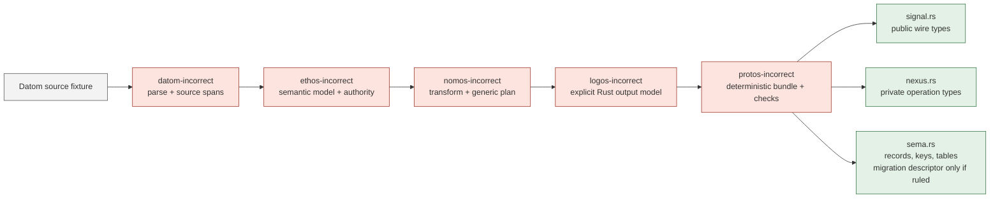
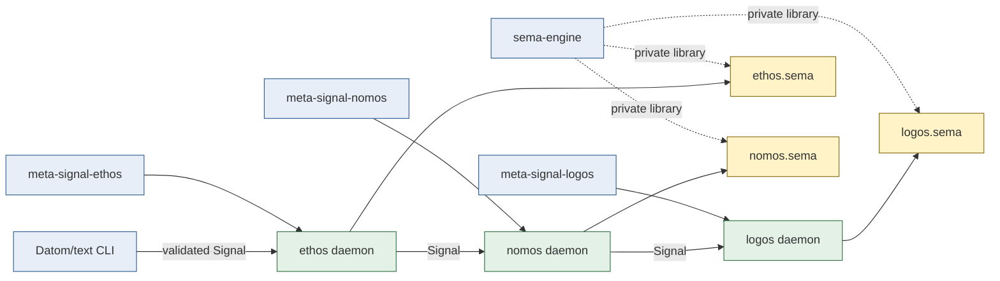

# Protos Three-Stack Repository Index and Gameplan

**Status:** Design proposal for Designer and psyche ruling. This is not implementation authority.

**Current-state evidence:** [Three Stacks: Current Filesystem State](/home/li/primary/reports/ThreeStacksCurrentState-2026-08-10.md)

**Ruled requested output:** "generate the rust code for types and generics/traits" defining Signal wire types, Nexus major internal engine-operation types, and Sema database types ([three-stacks ruling](/home/li/primary/psyche/Vision/threeStacks.md:98)).

**Recommended interpretation for this plan:** use that generated output as the completion test for the temporary stack and the replacement test for the old stack. The psyche has not yet ruled the exact artifact layout or acceptance gates.

## Reading this document

- **Ruled** means the psyche stated it.
- **Observed** means the current filesystem, manifests, or source wiring demonstrates it.
- **Recommended** means Realizer proposes it for ruling.
- **Open** means neither psyche nor code settles it.

No recommendation below preserves code merely because it exists. Reuse is justified only when the code expresses a domain law that remains correct in the daemon architecture.

## Repository truth discrepancy

The workspace repository manifest declares itself authoritative, but it does not currently describe the full physical Protos estate. This must be resolved before repository creation or rename work.

Filesystem-observed but absent from `protocols/repos-manifest.dotos`:

- `protos`, `core-ethos`, `core-nomos`, `core-logos`, `rust-logos`
- `schema-rust`, `nomos-engine`, `nomos-types`
- `signal-ethos`, `signal-nomos`, `signal-logos`
- `ethos-engine`, `logos-engine`, `sema-storage`
- `sema-translator`, `signal-sema-translator`
- relevant shared dependencies including `content-identity`, `structural-codec`, and `name-table`

Manifest-active but absent from the filesystem:

| Manifest repository/path | Recorded role | Recommended Phase 0 disposition |
|---|---|---|
| `schema-next` at `/git/github.com/LiGoldragon/schema-next` (missing; package unknown) | canonical replacement schema engine | Hold creation; if the five-repository temporary roster is approved, remove/supersede this manifest entry rather than create an overlapping engine |
| `schema-rust-next` at `/git/github.com/LiGoldragon/schema-rust-next` (missing; package unknown) | canonical replacement Rust generation engine | Hold creation; decide whether its intended responsibility becomes `protos-incorrect` before either repo exists |
| `tree-sitter-schema` at `/git/github.com/LiGoldragon/tree-sitter-schema` (missing; package unknown) | active build-time schema tooling | Hold creation; choose it or `tree-sitter-datom-incorrect`, not two editor grammars for the same temporary syntax |
| `nexus` at `/git/github.com/LiGoldragon/nexus` (missing; package unknown) | typed semantic-text vocabulary | Hold creation; recommend universal Nexus traits only, with component operation types remaining private |
| `nexus-cli` at `/git/github.com/LiGoldragon/nexus-cli` (missing; package unknown) | CLI for the recorded Nexus textual vocabulary | Hold creation until the psyche rules whether Nexus has an independent textual surface at all |
| `protos-translator` at `/git/github.com/LiGoldragon/protos-translator` (missing; package unknown) | Psyche-ruled name for the code-to-text translator; absent from manifest and role index | Add to the approved index only after scope and implementation form are ruled; do not infer daemon/database/Signal ownership |

**Recommended Phase 0 requirement:** reconcile this manifest with the approved three-stack index. A repository is not actionable until its physical identity and manifest identity agree.

### Datom lineage map

| Stage | Repository identity | Authority |
|---|---|---|
| Current | `dotos`, physically present and manifest-active | Observed; name rejected by later psyche ruling |
| Temporary proposal | `datom-incorrect`, new repository | Recommended, not ruled |
| Correct future | `datom`, repository absent | Name Datom is ruled; repository/process boundary is open |

Parser mechanics may be ported or extracted after syntax parity testing. **Recommended dependency rule:** `datom` does not depend on `datom-incorrect`.

### Protos identity map

| Identity | Current/proposed role | Status |
|---|---|---|
| `/git/github.com/LiGoldragon/protos`, package `protos` 0.5.1 | Generic implementation-free carriers/contracts | Physical, manifest-missing; neutral/correct ownership open |
| `/git/github.com/LiGoldragon/protos-engine`, no Cargo package | Nix integration/conformance sink | Physical and source-free under its current contract |
| `/git/github.com/LiGoldragon/protos-incorrect`, proposed package `protos-incorrect` | Proposed Rust generator coordinator | Missing; requires ruling and creation |
| future correct `protos` responsibility | Ruled name, exact engine/system responsibility | Open; do not infer it from either current repository |

## The short answer on reuse

The hypothesis is partly right: traits, basic types, and pure implementations are the strongest reuse candidates. The important correction is that a trait is not automatically reusable. A trait that encodes the wrong process, storage owner, text boundary, identity law, or compatibility promise is less reusable than a small pure implementation.

Recommended reuse test:

1. **Same meaning:** does the type or algorithm mean the same thing in the correct stack?
2. **No topology leak:** does it avoid central storage, process-free assumptions, legacy sockets, filesystem build paths, and text on daemon wires?
3. **Correct owner:** can it live in a neutral foundation or the daemon/core repository that owns the concept?
4. **Typed boundary:** can it consume or implement the generated Signal, Nexus, or Sema types without weakening them?
5. **Independent witness:** can its behavior be proven without starting the incorrect stack?

If any answer is no, port the idea or rewrite it. Do not make the correct stack depend on an `-incorrect` repository.

## Stack relationship

```mermaid
flowchart LR
  subgraph OLD["Old stack: recommended freeze after replacement"]
    NOTA["nota"]
    SCHEMA["schema"]
  end

  subgraph FOUNDATION["Candidate neutral substrate (proposal, not a fourth stack)"]
    ID["content-identity"]
    CODEC["structural-codec"]
    FRAME["signal-frame"]
    SEMA["sema + sema-engine"]
    CORE["candidate pure core-* modules"]
  end

  subgraph INCORRECT["Incorrect new stack: temporary Rust generator"]
    DI["datom-incorrect"]
    EI["ethos-incorrect"]
    NI["nomos-incorrect"]
    LI["logos-incorrect"]
    PI["protos-incorrect"]
    DI -->|"proposed stage flow"| EI -->|"proposed stage flow"| NI -->|"proposed stage flow"| LI -->|"proposed stage flow"| PI
  end

  OUT["Generated Rust bundle\nSignal + Nexus + Sema"]

  subgraph CORRECT["Correct new stack: daemon components"]
    E["ethos + signal/meta-signal"]
    N["nomos + signal/meta-signal"]
    L["logos + signal/meta-signal"]
    E -->|"possible Signal peer flow"| N -->|"possible Signal peer flow"| L
  end

  FOUNDATION -->|"only after semantic/ownership approval"| INCORRECT
  FOUNDATION -->|"only after semantic/ownership approval"| CORRECT
  PI --> OUT
  OUT -->|"generated files/artifacts; no generator dependency"| CORRECT
  RULE["Proposed rule:\ncorrect repos never import -incorrect repos"] -.-> CORRECT

  classDef old fill:#ece7df,stroke:#655f57
  classDef neutral fill:#fff3c7,stroke:#8a6c13
  classDef wrong fill:#fde4df,stroke:#9c3426
  classDef right fill:#e3f1e6,stroke:#337344
  class NOTA,SCHEMA old
  class ID,CODEC,FRAME,SEMA,CORE,RULE neutral
  class DI,EI,NI,LI,PI wrong
  class E,N,L,OUT right
```



The dashed arrow is a proposed prohibition, not a dependency: correct-stack repositories should not import temporary repositories. Generated Rust may be consumed as a published/checked-in artifact because it is the product; consuming it must not create a Cargo or Nix dependency on the generator repository.

The Ethos-to-Nomos-to-Logos arrows are provisional. The psyche ruled daemon components and Signal communication, but explicitly left some direct peer paths open.

## Stack 1: old repository index

The old stack keeps its old names. **Recommended:** freeze it except for changes needed to prove and complete replacement.

| Canonical repository | Current physical witness | Purpose | Recommended disposition |
|---|---|---|---|
| `nota` | `/home/li/git-archive/nota`, package `nota` 0.5.1 | Old structural notation reader/codec | Preserve as historical reference; no new consumers |
| `nota-codec` | `/home/li/git-archive/nota-codec`, package `nota-codec` 0.1.0 | Old schema codec dependency (`camino`, `nota-derive`, `thiserror`) | Preserve with old stack only |
| `schema` | `/home/li/git-archive/schema`, package `schema` 0.1.0 | Old typed NOTA schema parser/assembler | Preserve as historical reference; retire after generated-output equivalence |

Transition surfaces are not canonical old-stack repositories:

| Current checkout | Actual identity | Treatment |
|---|---|---|
| `/git/github.com/LiGoldragon/nota` | package `dotos` 0.10.0, duplicate of the successor lineage | Do not index as old NOTA; recommended archive after its unique revision delta is compared and any approved parser work is ported |
| `/git/github.com/LiGoldragon/schema-language`, package `schema-language` 0.3.0 | frozen `.schema` lowering donor | Treat as migration input, not a future repository |
| `/git/github.com/LiGoldragon/schema`, package `schema` 0.3.0 | extraction/build-time staging | Treat as migration input, not canonical old `schema` |
| `/git/github.com/LiGoldragon/schema-structural-pipe-retirement`, package `schema` 0.3.0 | duplicate/staging `schema` checkout | Archive candidate after repository ruling |

Additional physical duplicates requiring explicit disposition:

| Physical path | Package identity | Duplicates | Recommended disposition |
|---|---|---|---|
| `/git/github.com/LiGoldragon/core-schema` | package `core-ethos` 0.31.0 | `/git/github.com/LiGoldragon/core-ethos` 0.31.0 | Retain the canonical `core-ethos` identity; archive candidate only after revision comparison because Git revisions differ |
| `/git/github.com/LiGoldragon/textual-rust` | package `rust-logos` 0.2.0 | `/git/github.com/LiGoldragon/rust-logos` 0.32.0 | Retain the canonical `rust-logos` identity; compare the seven-commit delta before archive |

Recommended old-stack exit gate:

- The selected component fixture is expressible in Datom.
- The incorrect stack generates its Signal, Nexus, and Sema Rust.
- Generated code compiles and passes semantic/round-trip/storage witnesses.
- Every current consumer needed for component creation has moved off old `nota` and old `schema`.
- Old dependency paths are deleted, not wrapped in a compatibility layer.

## Stack 2: incorrect new repository index

### Recommended canonical temporary roster

This proposal uses five named language/engine repositories plus one editor-tooling repository while making temporariness explicit.

| Proposed repository/path | Current source identity | Proposed action and sole responsibility | Must not become |
|---|---|---|---|
| `datom-incorrect` at `/git/github.com/LiGoldragon/datom-incorrect`, proposed package `datom-incorrect` (missing) | `/git/github.com/LiGoldragon/dotos` 0.10.0; `/git/github.com/LiGoldragon/dotos-config` 0.2.0; selected `/git/github.com/LiGoldragon/dotos-text-query` 0.2.0 | Create and port only verified parser/source-model mechanics for the temporary generator | A daemon wire protocol or runtime state owner |
| `tree-sitter-datom-incorrect` at `/git/github.com/LiGoldragon/tree-sitter-datom-incorrect`, proposed npm package of same name (missing) | `/git/github.com/LiGoldragon/tree-sitter-dotos`, npm package `tree-sitter-dotos` 0.2.0 | Create after grammar parity/negative fixtures prove the Datom syntax; editor support only | A second parser authority |
| `ethos-incorrect` at `/git/github.com/LiGoldragon/ethos-incorrect`, proposed package `ethos-incorrect` (missing) | `/git/github.com/LiGoldragon/core-ethos` 0.31.0 and `/git/github.com/LiGoldragon/sema-translator` 0.11.0 remain separate candidates | Create thin temporary orchestration that converts typed Datom source into the semantic input model | A daemon, socket owner, or database owner |
| `nomos-incorrect` at `/git/github.com/LiGoldragon/nomos-incorrect`, proposed package `nomos-incorrect` (missing) | `/git/github.com/LiGoldragon/nomos-engine` 0.17.0; temporary `/git/github.com/LiGoldragon/core-nomos` 0.41.1 campaign; `/git/github.com/LiGoldragon/nomos-types` 0.1.0 | Create around the fixed temporary transformations and full typed generation plan | The future Nomos process boundary |
| `logos-incorrect` at `/git/github.com/LiGoldragon/logos-incorrect`, proposed package `logos-incorrect` (missing) | `/git/github.com/LiGoldragon/core-logos` 0.27.0 and `/git/github.com/LiGoldragon/rust-logos` 0.32.0 remain separate candidates | Create thin temporary output-model/projection orchestration | The future Logos daemon or public Signal contract |
| `protos-incorrect` at `/git/github.com/LiGoldragon/protos-incorrect`, proposed package `protos-incorrect` (missing) | `/git/github.com/LiGoldragon/schema-rust` 0.17.0 is a small algorithm donor; `/git/github.com/LiGoldragon/protos-engine` stays a separate Nix-only sink | Create a new generator owner for the Signal + Nexus + Sema artifact bundle; rewrite rather than move `schema-rust` filesystem assumptions | A runtime engine, central database, or permanent correct-stack dependency |

**Open for ruling:** whether the editor grammar remains a separate repository, and whether all five language/engine repositories take the `-incorrect` suffix. The suffix is recommended because it makes removal mechanically searchable.

If approved as new Rust repositories, the recommended initial package identity is the repository name at version `0.1.0`; the repository ruling may choose a different initial version.

Observed repository contract: `protos-engine` is an implementation-free Nix integration/conformance sink. **Recommended:** leave that contract intact and create the generator elsewhere.

The flow below is conceptual and does not yet define Cargo/Nix edges. Recommended starting dependency ledger for ruling:

| Proposed consumer | Proposed direct inputs | Unresolved point |
|---|---|---|
| `datom-incorrect` | approved text/identity substrate | Whether parser/derive code is extracted or ported |
| `ethos-incorrect` | generated Datom source model, `core-ethos`, translator boundary | Whether Datom is a Cargo contract or serialized artifact |
| `nomos-incorrect` | `core-ethos`, `core-nomos`, `core-logos`, `nomos-types`, translator output | Whether it imports `ethos-incorrect` or only its typed artifact |
| `logos-incorrect` | `core-logos`, `rust-logos`, typed Nomos plan | Whether output model crosses as crate types or archived artifact |
| `protos-incorrect` | typed outputs from the preceding stages | Exact crate split and generator API |
| `protos-engine` | pinned generated artifacts and producer revisions through Nix only | Artifact publication path and version promotion |

This ledger is intentionally not an implementation manifest: the repositories do not exist and the artifact-vs-crate boundaries are unruled. Phase 0 must produce exact Cargo/Nix revisions and allowed edges before Phase 2 can create them.

### Recommended temporary data flow



### Recommended generated output ownership

Output classes should not automatically become repositories.

| Output class | Generated content | Correct owner |
|---|---|---|
| Signal | Request, Reply, Refusal, subscription/event types, frame binding, contract revision | `signal-<component>` |
| Nexus | Major daemon-internal commands, events, transitions, typed operation inputs/outputs | `<component>` or optional `core-<component>`; generic cross-component traits may live in `nexus` only if truly universal |
| Sema | Record/key types, table specifications, schema hashes, typed projections; migration descriptors only if separately ruled | `<component>` or optional `core-<component>`, implemented through `sema-engine` |

This placement prevents a central Nexus or Sema repository from owning every component's private language. The existing manifest-declared `nexus` and `nexus-cli` repositories are absent; their exact role remains open.

The bundle must be a versioned generated artifact or checked-in generated source with provenance. A consuming repository depends on the resulting Rust contract/module, never on the `protos-incorrect` generator package or its Nix flake.

Recommended concrete Phase 1 handoff:

```text
generated/<component>/<contract-revision>/
  signal.rs
  nexus.rs
  sema.rs
  provenance.datom
```

- `signal.rs` is reviewed and promoted into `signal-<component>/src/generated.rs` with a wire-semver change.
- `nexus.rs` and `sema.rs` are promoted into `<component>` or `core-<component>/src/generated/` with the owning crate revision.
- `provenance.datom` records the input EncodedName, generator revision, authority snapshot/seed identity, output digests, and target contract revisions.
- Correct-repository Cargo metadata and Nix closures contain the promoted output only, never a generator invocation or `-incorrect` input.
- Any archived-layout change requires a new wire revision or an explicit daemon-owned Sema migration; it is never smuggled in as a patch-level regeneration.

### Mechanical temporariness

Recommended constraints for every incorrect repository:

- Name contains `-incorrect`.
- `NON_IDEAL_AGENTS.md` states the exact replacement and deletion condition.
- No correct-stack manifest may depend on it.
- It may depend only on neutral foundations or other `-incorrect` repositories.
- It receives no daemon, socket, actor lifecycle, or durable store.
- Every public entry point is generation-oriented.
- Its integration check proves generated output, not its own longevity.

## Candidate neutral reusable substrate

This is a recommendation, not a ruled fourth category. These physical repositories may be shared only where their semantics are independent of old/incorrect/correct topology.

| Physical repository/package | Manifest status | Recommended reuse boundary |
|---|---|---|
| `/git/github.com/LiGoldragon/content-identity`, package `content-identity` | Physically present, manifest-missing | Selective: keep portable archive/integrity laws only after identity ruling; reject stale `ContentHash<Domain>`, frozen magic, and byte-compatibility promises |
| `/git/github.com/LiGoldragon/structural-codec`, package `structural-codec` | Physically present, manifest-missing | Private text/compiler support if Datom semantics match; never expose structural text on daemon wire |
| `/git/github.com/LiGoldragon/name-table`, package `name-table` 0.3.0 | Physically present, manifest-missing | Transition-only naming substrate; recommend retirement after EncodedName/Fingerprint authority replaces textual-name coupling |
| `/git/github.com/LiGoldragon/signal-frame`, package `signal-frame` | Physical canonical shared repo | Reuse framing, validation, handshake/correlation mechanics; component vocabulary stays in `signal-*` |
| `/git/github.com/LiGoldragon/sema`, package `sema` | Physical canonical shared repo | Reuse typed rkyv/redb storage kernel |
| `/git/github.com/LiGoldragon/sema-engine`, package `sema-engine` | Physical canonical shared repo | Reuse as component-private engine; never a public or central-storage contract |
| `/git/github.com/LiGoldragon/triad-runtime`, package `triad-runtime` | Physical canonical shared repo | Prefer its `Async*Daemon`/`Runner` and ordinary/meta listener mechanics after focused audit; it must not own component state/vocabulary |
| `/git/github.com/LiGoldragon/protos`, package `protos` | Physically present, manifest-missing | Extract generic laws only after identity/frame review; it is not an engine and its final ownership is open |
| `/git/github.com/LiGoldragon/core-ethos`, package `core-ethos` | Physically present, manifest-missing | Candidate daemon-private semantic model/reader; text and staged authority boundaries require review |
| `/git/github.com/LiGoldragon/core-nomos`, package `core-nomos` | Physically present, manifest-missing | Split stable traits/types/lowering laws from the fixed temporary Rust campaign |
| `/git/github.com/LiGoldragon/core-logos`, package `core-logos` | Physically present, manifest-missing | Candidate explicit `WholeLogos`/reference model; generated Sema mapping is absent |
| `/git/github.com/LiGoldragon/rust-logos`, package `rust-logos` | Physically present, manifest-missing | Projection-only reuse; returned Rust `String` never crosses daemon wire |

Recommended extraction law:

1. Port the existing semantic test into the destination first.
2. Move the smallest coherent type/trait/algorithm.
3. Remove incorrect-stack I/O and ownership assumptions.
4. Make both stacks depend on the neutral result only if both meanings are identical.
5. Otherwise leave the temporary copy and implement the correct meaning in the owning daemon/core.

## Stack 3: correct new repository index

### Ruled daemon family and proposed repository index

The psyche ruled that Ethos, Nomos, and Logos are daemon repositories, communicate through Signal, hold their domain/language in their databases, have CLI/meta surfaces, and require meta-signal. The exact binary names, `.sema` filename convention, generated-contract mechanics, peer graph, and criterion for creating optional core repositories are architecture recommendations, not direct psyche quotes ([daemon ruling](/home/li/primary/psyche/Vision/everythingIsInTheDaemon.md:17), [meta-signal ruling](/home/li/primary/psyche/Vision/metaSignalNotOptional.md:4)). Recommended core criterion: create `core-<component>` only when logic genuinely needs library consumers.

| Proposed/physical repository | Current identity | Proposed correct role/action | Reuse source |
|---|---|---|---|
| `datom` at `/git/github.com/LiGoldragon/datom`, proposed package `datom` | Missing; name ruled, repository boundary open | Successor textual notation/compiler support if approved | Adapt verified Dotos parser/grammar semantics only after syntax audit |
| `ethos` at `/git/github.com/LiGoldragon/ethos`, proposed package `ethos` | Missing | Create Ethos daemon and component-owned database | Prefer `triad-runtime`; port generic lifecycle ideas and approved `core-ethos` semantics |
| `/git/github.com/LiGoldragon/signal-ethos`, package `signal-ethos` 0.3.0 | Physical, manifest-missing; legacy central-storage contract | Proposed rewrite or replacement with generated Ethos operation algebra | Test patterns only unless a value is independently redefined under the new contract identity/revision |
| `meta-signal-ethos` at `/git/github.com/LiGoldragon/meta-signal-ethos`, proposed package `meta-signal-ethos` | Missing | Create owner/configuration vocabulary | New design |
| `/git/github.com/LiGoldragon/core-ethos`, package `core-ethos` 0.31.0 | Physical, manifest-missing; mixed | Optional daemon-private semantic library after split | Pure model/reader/authority laws only |
| `nomos` at `/git/github.com/LiGoldragon/nomos`, proposed package `nomos` | Missing | Create Nomos daemon and component-owned database; exact peer scheduling open | Prefer `triad-runtime`; port pure lowering, never the process-free engine boundary |
| `/git/github.com/LiGoldragon/signal-nomos`, package `signal-nomos` 0.7.0 | Physical, manifest-missing; no Request/Reply | Proposed replacement with generated Nomos operation algebra | Test patterns and semantic reference only; redefine approved selectors under the new contract and exclude display/text helpers |
| `meta-signal-nomos` at `/git/github.com/LiGoldragon/meta-signal-nomos`, proposed package `meta-signal-nomos` | Missing | Create owner/configuration vocabulary | New design |
| `/git/github.com/LiGoldragon/core-nomos`, package `core-nomos` 0.41.1 | Physical, manifest-missing; partly temporary | Optional daemon-private transformation library after split | Stable laws separated from fixed temporary campaign |
| `logos` at `/git/github.com/LiGoldragon/logos`, proposed package `logos` | Missing | Create Logos daemon and component-owned database; exact peers open | Prefer `triad-runtime`; port generic lifecycle ideas and approved projection code |
| `/git/github.com/LiGoldragon/signal-logos`, package `signal-logos` 0.2.0 | Physical, manifest-missing; legacy central-storage/Rust-text contract | Proposed rewrite or replacement with generated Logos operation algebra | Test patterns only unless a value is independently redefined under the new contract identity/revision |
| `meta-signal-logos` at `/git/github.com/LiGoldragon/meta-signal-logos`, proposed package `meta-signal-logos` | Missing | Create owner/configuration vocabulary | New design |
| `/git/github.com/LiGoldragon/core-logos`, package `core-logos` 0.27.0 | Physical, manifest-missing | Optional daemon-private explicit output model | `WholeLogos` only after generated Sema mapping exists |
| `/git/github.com/LiGoldragon/protos`, package `protos` 0.5.1 | Physical, manifest-missing; generic contracts | Ownership and correct-stack responsibility remain open | Extract laws only after identity/frame review |
| `protos-translator` at `/git/github.com/LiGoldragon/protos-translator`, package absent | Name and code-to-text direction ruled; repository/process/storage boundary open | Record as a missing named component, not automatically as a daemon | Current `sema-translator`/`signal-sema-translator` are evidence to audit, not established implementations of this name |

Translator-adjacent physical evidence:

The psyche directly rules only the name `protos-translator` and describes it as translating code into text; the exact scope and implementation form remain open ([translator ruling](/home/li/primary/psyche/Vision/itsATranslator.md:10)).

| Repository/package | Observed implementation | Recommended treatment |
|---|---|---|
| `/git/github.com/LiGoldragon/sema-translator`, package `sema-translator` 0.11.0 | In-memory authority/translation library; no direct `signal-sema-translator` Cargo dependency | Candidate semantic donor only after `protos-translator` scope and identity authority are ruled |
| `/git/github.com/LiGoldragon/signal-sema-translator`, package `signal-sema-translator` 0.5.0 | Pure typed contract; current Protos allocation records contract ID 4/revision 1, but no demonstrated Cargo route to `sema-translator` | Adapt, replace, or retire only after translator Signal ownership and contract allocation are ruled |

### Physical legacy bridges excluded from the correct index

| Repository/package | Observed topology | Recommended disposition |
|---|---|---|
| `/git/github.com/LiGoldragon/ethos-engine`, package `ethos-engine` 0.2.0 | Real daemon/CLI wired to central Sema and legacy ingest | Keep only while its current consumers require the bridge; do not rename it to `ethos`; port generic lifecycle ideas through `triad-runtime`, then retire |
| `/git/github.com/LiGoldragon/logos-engine`, package `logos-engine` 0.2.0 | Real daemon/CLI reading central Sema and returning Rust projection text | Keep only while its current consumers require the bridge; do not rename it to `logos`; port pure projection calls, then retire |
| `/git/github.com/LiGoldragon/sema-storage`, package `sema-storage` 0.1.0 | Central durable state owner for the legacy daemon path | Retire after every affected component owns and proves its database; exact dissolution timing remains open |

### Provisional correct runtime topology

Daemon existence, typed Signal, meta configuration, and daemon-owned domain/database state are ruled. The linear peer sequence shown here is a planning hypothesis; direct peer paths and operation scheduling remain open.



## Recommended reuse matrix

Every disposition in this section is an evidence-backed proposal, not a psyche ruling.

### High-confidence reuse candidates, still gated by port tests

| Current code | Concrete reusable material | Destination |
|---|---|---|
| `sema-engine` | `Engine`, `EngineOpen`, `StorageReader`, `EngineRecord`, `EngineStoredValue`, `TableSpecification`; `EvolutionStep` only as a private engine-owned primitive | Private dependency of each correct daemon/core; generated migration closures require a separately ruled model |
| `signal-frame` | Typed rkyv framing, validation, handshake/correlation mechanics | Every `signal-*` contract and daemon transport |
| `nomos-types` | `StreamInitiation`, `StreamTermination` schema carriers | Generated/daemon-private Nomos operation model |

### Reuse only as daemon-private core logic

| Current code | Keep | Remove or adapt |
|---|---|---|
| `core-ethos` | semantic reader/model, authority-bearing data types | text ingress placement, `name-table` coupling, staged authority/state assumptions |
| `sema-translator` | `SemaBootstrapAuthority`, `AuthorizedBootstrap`, `SourcePlacement` ideas and pure logic | any implication that it owns runtime, persistence, wire, or daemon identity |
| `core-nomos` | lowering traits/laws, provenance types | fixed Rust-only bootstrap campaign and process-free completion assumptions |
| `nomos-engine` | `AuthoritySealedBootstrapTransformation`, `VerifiedBootstrapAssembly` as temporary generator concepts | the repository/trait claim that this is an engine boundary |
| `core-logos` | `WholeLogos`, typed references/applications, table/fingerprint concepts | assumptions that a monolithic archive is already the correct stored representation |
| `rust-logos` | `RustLogos`, `RustTypePathResolver`, deterministic emitter logic | `String` as a daemon reply or wire payload |

### Extract stable traits and carriers selectively

| Current code | Candidate | Required correction |
|---|---|---|
| `content-identity` | `PortableArchive`, content-addressing and preimage/integrity laws | Rule identity ownership and deterministic authority seeding first; conform to EncodedName/Fingerprint rulings and discard rejected legacy ID APIs |
| `structural-codec` | `StructuralEvaluator`, `EncodedForm`, `EncodedConversion`, `Textual`, `StructuralValue` | Keep at text/compiler boundary; verify exact Datom grammar and meaning |
| `dotos` | parser structure, spans, diagnostics, derive machinery | Rename/rewrite syntax-specific pieces for Datom; do not expose text in Signal |
| `dotos-text-query` | typed structural query primitives | Keep optional and engine-neutral; no runtime ownership |
| `protos` | `Input`, `Output`, `Refusal`, stream laws; selected capsule/population ideas | Review identity/frame semantics first: current `Capsule` pins caller-supplied naming data and textual association is deliberately broad |

### Rewrite around the new generated types

| Current code | Why rewrite | What may be ported |
|---|---|---|
| `signal-ethos` | `legacy_text`, central-storage roots, and `signal-sema-storage` dependency are wrong public operations | round-trip test patterns only; redefine any surviving value under a fresh contract identity/revision |
| `signal-nomos` | explicitly has no Request/Reply algebra or process boundary | test patterns and semantic reference only; regenerate approved selector/slot values |
| `signal-logos` | central-store summaries, `signal-sema-storage`, and Rust `String` projection replies leak wrong ownership/output | test patterns only; redefine any surviving value under a fresh contract identity/revision |
| `ethos-engine` | daemon lifecycle exists, but `SemaPlane`, central Sema, legacy ingest, and hand-rolled framing are coupled to the wrong topology | generic lifecycle ideas only; prefer `triad-runtime` rather than porting actors/frames |
| `logos-engine` | daemon lifecycle exists, but `NexusPlane`/storage actors read central Sema and return Rust text | generic lifecycle ideas and pure projection call sites only; prefer `triad-runtime` for process/socket mechanics |
| `schema-rust` | filesystem paths, source/Rust artifact transaction, atomic build commit are build-system assumptions; it explicitly refuses Nexus and excludes Sema engine generation | diagnostic aggregation and small ordering/emitter patterns only; it is not the new generator skeleton |

`SemaBootstrapAuthority` uses mutable/random staging today. Until naming authority and deterministic seeding are ruled, Ethos/Nomos/Logos must not instantiate it as their private naming authority; keep `AuthorizedBootstrap` text/name views at the translator/generator boundary.

### Proposed retirement from the correct stack

| Current code | Reason |
|---|---|
| `signal-sema-storage` public contract | It makes central storage and storage classification a public component boundary |
| `sema-storage` daemon | Retire after component-owned storage migration is proven; its own dissolution timing remains open |
| old NOTA/Schema compatibility adapters | Replacement updates consumers; compatibility is not a design variable |
| current `nomos-engine` process boundary | It is intentionally process-free and therefore cannot witness the Nomos daemon |
| exact old byte-compatibility/frozen-magic harnesses | Preserve obsolete representation rather than current meaning |

## Phased gameplan

### Phase 0: rule the repository map

Designer brings these forks to the psyche:

1. Approve or change the recommended `-incorrect` roster.
2. Confirm generated output ownership: Signal in `signal-*`, Nexus and Sema private to component/core.
3. Confirm that pure `core-*` repositories may be neutral dependencies of both new stacks.
4. Rule the exact role of `protos`, `nexus`, and `nexus-cli`.
5. Decide whether existing `ethos-engine`/`logos-engine` remain historical embryos or become temporary-stack repositories; do not equate them with correct `ethos`/`logos` by name alone.
6. Reconcile the authoritative repository manifest with the physical Protos estate and approve create/rename/archive actions.
7. Rule identity ownership and the deterministic authority seed/snapshot used during generation.
8. Rule `protos-translator` scope (identity-to-text versus whole-program-to-text), implementation form, repository family, and relationship to current translator code. Do not assume it is a daemon or Nexus owner.

**Exit:** one approved repository index with no repository assigned to two incompatible owners.

### Phase 1: define the generated artifact contract

Choose one real component fixture. In Datom it must describe at least:

- one Signal request, reply, typed refusal, and subscription event;
- one major Nexus internal operation with typed input/output;
- one Sema record, key projection, and table specification;
- an optional daemon-owned evolution witness, unless a generated migration model is separately ruled;
- the traits and generic parameters connecting those types without string dispatch or raw textual payloads. Static typed metadata such as table/family names is allowed.

Define a deterministic output bundle and provenance manifest before generator work.

**Hard ruling required:** name the first consumer repository/component, allocate its Signal contract ID and initial revision, and approve the publication/promotion destination. The repository evidence cannot choose these without inventing authority.

**Exit:** reviewed example input plus exact expected Rust module/crate shape.

### Phase 2: establish the temporary repositories

- Create or rename only the approved incorrect-stack repositories after the Phase 0 forks are ruled.
- Add their `NON_IDEAL_AGENTS.md` deletion contracts.
- Pin neutral dependencies.
- Move no code until its destination and test witness are named.
- Quarantine duplicate checkouts (`nota` containing Dotos, `core-schema`, `textual-rust`, structural-pipe staging) from the index.

**Exit:** every current module has one classified source repository and proposed destination.

### Phase 3: extract the semantic kernel

Order:

1. Identity/archive primitives, only after identity ownership and deterministic seeding are ruled.
2. Datom parsing and typed source spans.
3. Ethos semantic model and authority.
4. Nomos transformation traits and provenance.
5. Logos explicit output model and Rust projection.
6. Sema record/table traits and daemon-owned evolution interfaces.

For each extraction, port the smallest meaningful tests first. Do not port CLI, sockets, central storage, or build-path orchestration with the semantic kernel.

**Exit:** neutral/core crates compile and test without old Schema/NOTA or incorrect runtime assumptions.

### Phase 4: build one vertical generator slice

Implement only:

```text
Datom fixture
  -> typed Ethos model
  -> Nomos transformation plan
  -> Logos output model
  -> generated signal.rs + nexus.rs + sema.rs
  -> cargo/rkyv/sema witnesses
```

No daemon work belongs in this phase.

**Exit:** two fresh authority instances and a restart/replay, given the same Datom input, tool revisions, and pinned authority snapshot/seed, produce byte-identical Rust and provenance; generated Rust passes all contract gates.

### Phase 5: replace the old stack

- Cut one real component from old Schema/NOTA to the generated bundle.
- Delete its old dependencies in the same change.
- Repeat for every component needed to restore component design/construction/maintenance.
- Remove the old parser/build path after the last consumer moves.

**Exit:** Cargo manifests/locks, Nix inputs, source imports, runtime configuration, and socket paths show no active required use of old `nota`, `nota-next`, old `schema`, or `schema-language` for the replaced function.

### Phase 6: construct the correct daemon stack

For Ethos, then Nomos, then Logos:

1. Generate and ratify `signal-*` and `meta-signal-*` vocabulary.
2. Create the plain component repository and daemon/CLI/meta-CLI.
3. Embed `sema-engine` and generated Sema declarations.
4. Port only approved daemon-private core logic.
5. Add snapshot-plus-delta observation and typed configuration/refusal paths.
6. Prove isolated daemon processes, ordinary and meta sockets, restart persistence, per-daemon ownership, and the absence of central-storage sockets/dependencies.
7. Add at least one real cross-daemon Signal witness for each ruled peer edge; do not assume the linear peer graph where it remains open.

**Exit:** each daemon holds its domain in its own database (recommended filename convention: `<component>.sema`) and communicates only through typed Signal.

### Phase 7: delete the temporary stack

- Regenerate all required artifacts with the correct daemon architecture/tooling.
- Prove no correct repository depends on an `-incorrect` repository.
- Prove no active Cargo, Nix, source, runtime, or socket reference remains to `central-storage*`, `sema-storage`, or `signal-sema-storage` for migrated components.
- Archive or delete the temporary repositories as ruled.
- Remove temporary exceptions and their `NON_IDEAL_AGENTS.md` entries.

**Exit:** the incorrect stack is removable without changing any correct-stack public contract or stored meaning.

## Recommended proof gates

Every accepted phase should expose its durable witness through Nix:

| Gate | Required proof |
|---|---|
| Determinism | Two fresh authority instances plus restart/replay receive the same Datom bytes, tool revisions, and pinned authority snapshot/seed and produce identical Rust bytes and provenance hash |
| Signal | Generated types archive, validate, frame, and round-trip; every public domain verb has paired reply/refusal, a unique contract ID/revision binding, wrong/unknown revision refusal, and snapshot-plus-delta stream ordering/token witnesses |
| Signal registry | Contract allocations are globally unique and append-only/monotonic; obsolete families are absent from the active registry and cannot be reallocated |
| Meta-signal | Owner vocabulary independently archives/frames/versions/refuses; ordinary and meta routes reject each other's contract family |
| Nexus | Generated operations are closed, typed, and executable without string dispatch |
| Sema | Generated records/keys/table specs prove source-key to `RecordKey` projection, family/schema-hash mismatch refusal, open/write/read/restart, and use `sema-engine` rather than direct `sema`/`redb`; evolution is daemon-owned unless a generated migration model is ruled |
| Boundary | AST/dependency checks reject raw source/rendered protocol text, string dispatch, daemon-private operations, `signal-sema-storage`, and `signal_sema::{Assert, Mutate, Retract, Match, Subscribe, Validate}` on public wire; explicit typed domain strings and static table metadata are allowed |
| Ownership | Each correct daemon opens only its own temporary database through `sema-engine`; AST/state tests reject a parallel in-memory authoritative ledger beside typed Engine records |
| Daemon process | Isolated Ethos/Nomos/Logos processes exercise ordinary/meta sockets, restart persistence, and ruled peer Signal flows; Cargo/Nix/source/runtime scans find no `central-storage*`, `sema-storage`, or `signal-sema-storage` socket/dependency |
| Replacement | Cargo, Nix, source, runtime, and socket scans plus consumer tests show old Schema/NOTA paths absent |
| Artifact independence | Promoted generated files have provenance, while correct-repository Cargo metadata and Nix closures contain no generator invocation or `-incorrect` input |
| Temporariness | Cargo/Nix/source dependency scans find zero correct-to-incorrect edges |

## Recommended first vertical fixture

Do not begin with the whole language. Select one component record kind that forces all three output classes:

- a public operation on Signal;
- a corresponding internal Nexus transition;
- durable Sema state and key projection;
- one generic/trait relationship;
- one typed refusal;
- one daemon-owned schema evolution, or an explicit declaration that migration generation is outside this slice.

The fixture is complete only when the generated Rust is used by a real consumer. A generator that only snapshots expected strings has not replaced the old stack.

## Decisions requiring psyche ruling

| Fork | Recommendation | Alternative |
|---|---|---|
| Incorrect repo naming | Use `datom-incorrect`, `ethos-incorrect`, `nomos-incorrect`, `logos-incorrect`, `protos-incorrect` | Preserve current names and mark temporariness only in documents |
| Generated Nexus placement | Component/core-private modules; `nexus` holds only universal traits | One central repository owns all generated internal operations |
| Generated Sema placement | Component/core-private modules using `sema-engine` | Central generated storage-schema repository |
| `core-*` reuse | Keep only pure shared semantics; split temporary campaigns out | Duplicate all code into each stack |
| Existing daemon embryos | Port selected scaffolding into new plain repos | Rename the current central-Sema daemons in place |
| Datom reuse | Adapt verified parser/grammar mechanics after syntax comparison | Rewrite parser and grammar from zero |
| Generated source | Check in deterministic generated Rust plus provenance | Generate only during builds |
| `protos-translator` | Preserve the ruled name and defer repository/process/storage shape until scope is answered | Treat current `sema-translator` plus `signal-sema-translator` as the implementation by default |

The first three forks determine repository ownership and should be ruled before any repository creation or rename.
