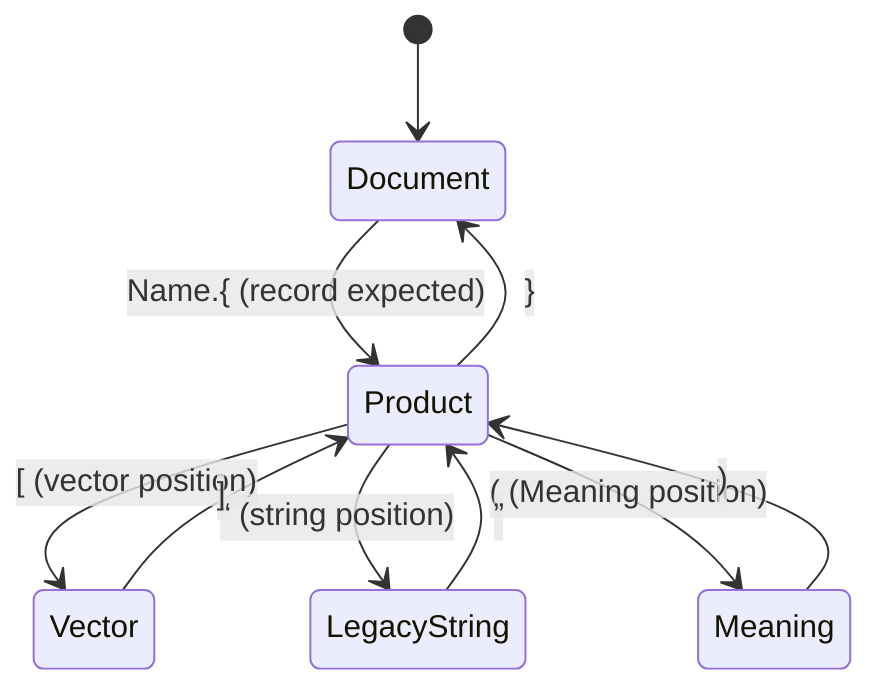

# Two-Way Structural Transcoding — flesh-out draft, 2026-08-11

Directed by the psyche ("Lets flesh it out in detail with examples
then we can make it intent … I feel like we need to really flesh
out this two-way structural transcoding, through clear explanation
and with a trait-library first approach, in protos repo",
2026-08-11T22:04+02:00, protosIsTheSharedStyle.md). This document is
the working substrate for that flesh-out; when it is very clear
vision unlikely to change, the psyche graduates it to Intent. It
follows the ruled design pattern: visuals, examples, traits with
main types. Everything marked *candidate* awaits the psyche's
ruling.

## The mechanism (ruled ground)

There is always a parsing context; it never suspends, it *changes*,
and the underlying mechanism is always the same: parsing in context
X, the parser can expect shapes A, B, or C; Z ends the context;
meeting A switches to the context which A entails. NOTA's ruling
principle from day one, now extended: it should always use trait
(psyche, 2026-08-11T19:53+02:00).

The parse is two-way. Reading walks the expected types and lands
directly in typed Rust structs — text never names fields, position
carries meaning. Writing is the exact reverse projection: the same
walk over the typed value, emitting the canonical text. One
structure, two directions: structural transcoding.

## Example: one Datom record, both ways

Schema (Rust, the expectation the walk follows):

```rust
struct Observer {
    count: i64,
    tags: Vec<String>,
    title: String,
    brief: Meaning,   // structured string; shape pending
}
```

Canonical text (curly quotes are U+201C/U+201D; the parenthesis
pair is the Meaning delimiter):

```
Observer.{3 [alpha beta] “The First Watcher” (…)}
```

### Decode walk

| Step | Context | Expects | Meets | Effect |
|---|---|---|---|---|
| 1 | Document | a typed record | `Observer` + glued `.{` | switch → Product(Observer) |
| 2 | Product(Observer), position 1 | i64 | `3` | count = 3 |
| 3 | position 2 | Vec\<String\> | `[` | switch → Vector(String) |
| 4 | Vector(String) | String elements; `]` ends | `alpha beta` then `]` | tags = [alpha, beta]; context returns |
| 5 | position 3 | String | `“` | switch → LegacyString |
| 6 | LegacyString | text; `”` ends | `The First Watcher` then `”` | title set; context returns |
| 7 | position 4 | Meaning | `(` | switch → Meaning |
| 8 | Meaning | annotation enums (shape pending); `)` ends | … then `)` | brief set; context returns |
| 9 | Product(Observer) | terminator | `}` | record complete; context returns to Document |

No intermediate tree exists; step effects land in the `Observer`
value directly. Encoding runs the identical table bottom-up: walk
the typed value, emit each position in its canonical projection
(bare atom where legal, curly quotes otherwise), producing exactly
the text above — the round-trip witness.

### Context transitions (visual)



Each edge is "meeting A entails the context of A", each closing
edge is "Z ends the context". The same diagram read in reverse is
the encoder.

## Trait sketches (candidates — psyche rules naming and split)

Main types: the context types (`Document`, `Product`, `Vector`,
`LegacyString`, `Meaning`), the `Shape` a context can expect, and
the walk driver. Candidate trait for the mechanism:

```rust
// candidate names throughout; ProtosShape is the psyche's
// working name (2026-08-12), open to proposals
trait StructuralContext {
    /// the shapes this context can expect next
    fn expects(&self) -> Vec<ProtosShape>;
    /// the shape that ends this context
    fn terminator(&self) -> ProtosShape;
    /// the context a met shape entails
    fn entails(&self, met: ProtosShape) -> ContextChange;
}
```

### Structure dictates the outer type (ruled 2026-08-12)

The expects vector is the mechanism for positions where the
structure met in the text dictates the outer type, rather than the
schema dictating a single expected form. The psyche's Ethos
example: at a definition position, `X.{` means a struct, `Y.[`
means an enum, and `Z:Transform.[` / `Z:Transform.{` mean different
kinds of transformers — the context expects the vector of those
shapes, and whichever appears selects what is being read.

~~Designer observation: a String position also expects a small
vector.~~ Rejected by the psyche 2026-08-12: "A string expects a
string." Where a field can hold either of two things, that is a
distinct shape-discriminated *type* (e.g. MeaningOrString, or
Meaning itself accepting plain text) — not a String position with
alternative carriers. See round 2 below.

Candidate two-way pair (the repo's provisional DatomEncode /
DatomDecode traits are placeholders for whatever is ruled):

```rust
trait Reads: Sized {
    fn read(walk: &mut Walk) -> Result<Self, ReadFault>;
}
trait Writes {
    fn write(&self, emit: &mut Emit);
}
```

Traits constrain implementers to think within these concepts
(psyche, 2026-08-11T22:04): a dialect is then *defined* by its set
of context types implementing the shared trait — Datom and Ethos as
two context-type sets over one mechanism. The shared substrate —
these traits, the shared implementation, the types — belongs in the
protos repo (ruled; the repo's current duty may be reconsidered).

## The codec fork (open; framed for ruling)

"What is reflection?", plainly: reflection is a program inspecting
its own types at runtime to decide behavior. Neither fork uses it;
serde-style frameworks generate per-type code at compile time.

- **Fork A — generated direct code per schema.** ethos-rust emits a
  read and write function per type, positional and transparent; no
  shared framework crate; more generated lines, every decode step
  visible in the committed Rust.
- **Fork B — shared trait framework.** The protos repo carries the
  walk driver and the `Reads`/`Writes` traits; ethos-rust emits only
  compact trait impls per type. Less generated surface; one
  framework everything flows through.

The trait-library-first direction and the shared-substrate ruling
cohere with B; A maximizes committed-code transparency. The psyche
rules.

## Open forks for the flesh-out

1. ~~What a `Shape` is exactly~~ — answered 2026-08-12: the
   expectation is a vector of ProtosShapes; the met shape selects
   the outer type where structure dictates it (see above).
2. Naming of the trait and main types (criteria: maximally
   specific, code-true, sticks). ProtosShape is the psyche's
   working name, proposals welcome.
3. ~~Where entailment lives~~ — answered 2026-08-12: on the type.
   The type met implements its own context (round 2 below).
4. The Meaning context's expected-shape set: the annotation enum
   vocabulary (structuredStringType.md; "too early to tell").
5. Whether the encoder's canonicality tiers (bare over curly) are
   part of the mechanism trait or of each dialect's context types.

---

# Round 2 — 2026-08-12, after the psyche's reading

Ruled corrections carried in (protosIsTheSharedStyle.md,
structuredStringType.md, 2026-08-12T01:26+02:00): ProtosShape is
the *standard shape vocabulary* — always the same, a fixed enum;
the *trait* is what shape-discriminated types implement, as a match
from standard shapes to the type's own variants; each variant's
type has its own parsing context implementation. A string expects a
string — alternatives are typed, never carrier-level. Sketch v1's
`StructuralContext` table dissolves into the types themselves.

## The standard shape vocabulary

```rust
// fixed, universal, shared by every dialect — "always the same"
enum ProtosShape {
    BareAtom,
    CurlyQuoteDelimited,     // “ ”
    ParenthesisDelimited,    // ( )  — the Meaning delimiter
    SquareBracketDelimited,  // [ ]
    BraceDelimited,          // { }
    DotApplied,              // glued .
    ColonJoined,             // Name:Transformer
}
```

Flat variants preferred where nested data (`SimpleDelimiter(CurlyQuotes)`)
would complicate the match beyond warrant (psyche 2026-08-12).

## The trait (name fork open: ShapeDefined / ProtosShaped / …)

A shape-discriminated type implements the trait as a match on
standard shapes, each arm yielding the variant whose own type then
parses itself:

```rust
// throwaway example per the psyche — NOT canonical
enum NewString {
    String(CurlyText),
    Meaning(Meaning),
}

impl ShapeDefined for NewString {
    fn shapes() -> &'static [ProtosShape] {
        &[ProtosShape::CurlyQuoteDelimited, ProtosShape::ParenthesisDelimited]
    }
    fn read(met: ProtosShape, walk: &mut Walk) -> Result<Self, ReadFault> {
        match met {
            ProtosShape::CurlyQuoteDelimited => Ok(Self::String(CurlyText::read(walk)?)),
            ProtosShape::ParenthesisDelimited => Ok(Self::Meaning(Meaning::read(walk)?)),
            other => Err(ReadFault::unexpected(other)),
        }
    }
}
```

`CurlyText::read` and `Meaning::read` are the variants' own context
implementations — the type met implements its own context. Writing
is the mirror match, each variant projecting through its own
context to its shape:

```rust
impl ShapeDefined for NewString {
    fn write(&self, emit: &mut Emit) {
        match self {
            Self::String(text) => text.write(emit),      // emits “…”
            Self::Meaning(meaning) => meaning.write(emit), // emits (…)
        }
    }
}
```

## Example 2 — the ruled string type is the real NewString

The 2026-08-11T19:17 ruling — one string type, two variants,
legacy (curly quotes) and structured (Meaning parens) — is exactly
this pattern made real. Modeling fork for the psyche
(structuredStringType.md):

- **A. A wrapper type** (`MeaningOrString` or the ruled string
  type itself): variants `String` and `Meaning`, discriminated
  CurlyQuoteDelimited / ParenthesisDelimited as sketched above.
- **B. Meaning is the type.** Meaning's own shape-match includes
  CurlyQuoteDelimited, yielding `Meaning::PlainText` — a plain
  string read as the simplest structured meaning:

```rust
enum Meaning {
    PlainText(String),      // derived from “…”
    Annotated(/* shape pending */),
}
```

Under B every Meaning-typed field accepts plain curly text for
free, and "legacy variant" becomes the degenerate Meaning. A and B
may be the same design wearing two names; which name owns the type
is the psyche's call.

## Example 3 — structure dictates the outer type (Ethos, unruled sketch)

The 2026-08-12 vector case in trait form: an Ethos definition
position holds a shape-discriminated type whose match spans more
shapes:

```rust
enum Definition {
    Struct(StructBody),      // met X.{
    Enum(EnumBody),          // met Y.[
    Transformer(TransformerBody), // met Z:Transform.[ or .{
}
```

The match arms are DotApplied+BraceDelimited, DotApplied+
SquareBracketDelimited, ColonJoined — the same trait, a wider
vector. One mechanism covers a Datom struct field and an Ethos
definition position.

## What this settles and what remains

Settled by the psyche: the standard shape enum; the trait-as-match
design; types carry their own contexts (fork 3); shape-discriminated
types sit in any struct field. Open: the trait's name (fork 2); the
A/B Meaning modeling; the Meaning annotation vocabulary (fork 4);
canonicality tiers' home (fork 5); whether read and write halves
are one trait or a pair.

---

# Round 3 — 2026-08-12, recursion, planes, and the corrected sketch

Ruled corrections (protosIsTheSharedStyle.md, 2026-08-12T21:23):
the walk is a stack — every frame keeps the parent context's
position, and popping resumes at the following position; while a
child context is active only its shapes carry meaning — the
parent's end shape has none until the child completes; ShapeDefined
discriminates only, and the type met implements its own parsing
context. Big implementations are a sign of a missing logic plane:
everything simple individually, the complexity in the totality.

## The walk as a stack (the recursion example)

Text: `Observer.{3 [alpha beta] “The First Watcher” (…)}`

| Step | Stack (bottom → top) | Meets | Effect |
|---|---|---|---|
| 1 | Document | `Observer.{` | push Product(Observer, position 1) |
| 2 | Document · Product(Observer, pos 1) | `3` | count = 3; frame advances to pos 2 |
| 3 | Document · Product(Observer, pos 2) | `[` | push Vector(String) |
| 4 | … Product(pos 2) · Vector(String) | `alpha` `beta` | elements collect |
| 5 | … Product(pos 2) · Vector(String) | `]` | pop — tags set; parent frame resumes and advances to pos 3 |
| 6 | Document · Product(Observer, pos 3) | `“` | push LegacyString |
| 7 | … Product(pos 3) · LegacyString | `…}…` | a `}` here is plain text — only `”` has meaning in this context |
| 8 | … Product(pos 3) · LegacyString | `”` | pop — title set; parent resumes, advances to pos 4 |
| 9 | Document · Product(Observer, pos 4) | `(` | push Meaning |
| 10 | … Product(pos 4) · Meaning | `…` `)` | pop — brief set; parent resumes past its last position |
| 11 | Document · Product(Observer) | `}` | pop — record complete |

Steps 5 and 8 show the kept parent position doing its work; step 7
shows the parent's end shape carrying no meaning inside a child.

## The three logic planes (corrected sketch)

| Plane | Job | Size of each piece |
|---|---|---|
| Discrimination (`ShapeDefined`) | met shape → which type comes | one line per arm |
| Context (each type's own) | its own interior only | small, local |
| Walk driver (shared, one ever) | push, pop, resume-at-next-position | one implementation |

```rust
// plane 1 — discrimination only; no parsing logic here
impl ShapeDefined for NewString {
    fn expects() -> &'static [ProtosShape] {
        &[ProtosShape::CurlyQuoteDelimited, ProtosShape::DotParenthesized]
    }
    // generated arms are one line each: the met shape names the
    // variant; the variant's own type parses itself
    // CurlyQuoteDelimited → Self::String(…)   — CurlyText's context reads
    // ParenthesisDelimited → Self::Meaning(…) — Meaning's context reads
}
```

The value construction (wrapping what the child context produced
into the right variant) is the one-line generated arm; the parsing
lives in the child type's context; the stack lives in the driver.
No piece is big.

## Naming round (open with the psyche)

- `BareSymbol` over `BareAtom` — "atom" is the old parser's word
  (Lisp lineage, carried by the port); "symbol" is the psyche's.
- Dotted applications as distinct variants — proposal: `DotBraced`
  (`X.{`), `DotBracketed` (`X.[`), `DotParenthesized` (`X.(`).
- Colon forms: `ColonJoined` discriminates at the definition
  position; the transformer *kind* (`.[` vs `.{` payload) is
  discriminated one level deeper, inside the Transformer type's own
  context — the same principle recursing.

## Intent v3 — APPROVED 2026-08-13 ("the intent is good"), landed at psyche/Intent/protosParsing.md

> Protos parsing always happens inside a context, and only the
> current context gives shapes their meaning: it defines which
> shapes can appear next and which shape completes it. A met shape
> announces a type, and that type's context takes over completely
> until its completing shape; then the parent context resumes
> exactly where it left off. Reading and writing are one walk in
> two directions — text lands in typed values, and typed values
> project back into the same text.

---

# Round 4 — 2026-08-13, discrimination at every level

Psyche (2026-08-13T00:25, protosIsTheSharedStyle.md): the round-3
walk "wasnt complex enough. we need to consider multiple levels,
each with one or more shape-determined type." Containers nesting is
not the hard case; discrimination recurring at every depth is.

## The deep fixture (illustrative, not canonical)

Every level holds one or more shape-determined types, and Entry is
reachable from inside itself:

```rust
struct Report {
    heading: NewString,      // shape-determined at level 1
    entries: Vec<Entry>,     // every element is a discrimination point
}

enum Entry {                            // shape-determined at every use
    Note(NewString),                    // nameless: met “ or ( directly
    Group(Group),                       // named: met Group.{  (DotBraced)
    Tags(Vec<Label>),                   // named: met Tags.[  (DotBracketed)
}

struct Group {
    title: NewString,        // shape-determined
    body: Meaning,           // shape-determined (“ → PlainText, ( → Annotated)
    children: Vec<Entry>,    // recursion: Entry again, arbitrary depth
}
```

Text:

```
Report.{“Q3” [“quick note”
              Group.{“Ops” (…) [“sub note”
                                Group.{“Deep” “plain body” []}]}
              Tags.[alpha beta]]}
```

## The walk, discriminations marked

| Step | Stack (→ top) | Meets | Discrimination resolved |
|---|---|---|---|
| 1 | Document | `Report.{` | push Product(Report, pos 1) |
| 2 | · Product(pos 1) | `“` | NewString → String; push LegacyString; pop; resume pos 2 |
| 3 | · Product(pos 2) | `[` | push Vector(Entry) |
| 4 | ·· Vector(Entry) | `“` | **chained**: Entry → Note, then NewString → String — one met shape, two discriminations |
| 5 | ·· Vector(Entry) | `Group.{` | Entry → Group; push Product(Group, pos 1) |
| 6 | ··· Product(Group, pos 1) | `“` | NewString → String |
| 7 | ··· Product(Group, pos 2) | `(` | Meaning → Annotated; push Meaning context |
| 8 | ··· Product(Group, pos 3) | `[` | push Vector(Entry) — **Entry discriminating again at depth 4** |
| 9 | ···· Vector(Entry) | `“` | chained Entry → Note → String |
| 10 | ···· Vector(Entry) | `Group.{` | Entry → Group; push Product(Group) — depth 5 |
| 11 | ····· Product(Group, pos 2) | `“` | **Meaning → PlainText** — modeling B live: plain text at a Meaning position |
| 12 | ····· | `[]` `}` `]` `}` | closes cascade: each pop resumes its parent's kept position |
| 13 | ·· Vector(Entry) | `Tags.[` | Entry → Tags; push Vector(Label); bare symbols; closes |

## Two design observations surfaced (Designer analysis, unruled)

1. **The expects-vector composes.** Entry's shapes are the union of
   its variants' announcements: `Group.{` and `Tags.[` (its named
   variants' own shapes) plus everything nameless `NewString`
   announces (`“`, `(`). A shape-determined type containing
   nameless shape-determined variants inherits their shape sets —
   discrimination recurses in the *type* plane exactly as parsing
   recurses in the *walk* plane.
2. **Disjointness is a checkable law.** Two nameless variants of
   one discrimination point must not announce the same shape, or
   the met shape resolves ambiguously. The union in observation 1
   must be disjoint at every discrimination point — a condition
   ethos-rust can verify at generation time and the fixture suite
   must test as a rejection case.

## The traits of the deep fixture (added 2026-08-13: "no traits is no good")

All names remain candidates. The read halves are shown; writes
mirror them (one-trait-or-pair fork open). Every impl is small —
the planes stay separate.

```rust
// plane 1 — discrimination. A shape-determined type answers:
// which shapes announce me, and which variant each one yields.
trait ShapeDefined: Sized {
    fn expects() -> &'static [ProtosShape];
    fn read(met: ProtosShape, walk: &mut Walk) -> Read<Self>;
}

// plane 2 — each type's own context: its interior, nothing else.
trait TypeContext: Sized {
    fn completing() -> ProtosShape;
    fn read_interior(walk: &mut Walk) -> Read<Self>;
}

// plane 3 — the one driver: frames, positions, resumption.
fn read<T: ShapeDefined>(walk: &mut Walk) -> Read<T> {
    let met = walk.meet(T::expects())?;  // pushes a frame; the frame
    T::read(met, walk)                   // keeps the parent position
}
```

The fixture's impls, one discrimination point at a time:

```rust
impl ShapeDefined for Entry {
    fn expects() -> &'static [ProtosShape] {
        // named variants' own shapes + the union of what nameless
        // Note(NewString) announces — observation 1 made code
        &[DotBraced, DotBracketed, CurlyQuoteDelimited, DotParenthesized]
    }
    fn read(met: ProtosShape, walk: &mut Walk) -> Read<Entry> {
        match met {
            DotBraced           => Ok(Entry::Group(walk.read()?)),
            DotBracketed        => Ok(Entry::Tags(walk.read()?)),
            CurlyQuoteDelimited
            | DotParenthesized  => Ok(Entry::Note(walk.read()?)), // NewString discriminates next
        }
    }
}

impl ShapeDefined for NewString {
    fn expects() -> &'static [ProtosShape] {
        &[CurlyQuoteDelimited, DotParenthesized]
    }
    fn read(met: ProtosShape, walk: &mut Walk) -> Read<NewString> {
        match met {
            CurlyQuoteDelimited => Ok(NewString::String(walk.enter()?)),  // CurlyText's context
            DotParenthesized    => Ok(NewString::Meaning(walk.enter()?)), // Meaning's context
        }
    }
}

impl ShapeDefined for Meaning {   // modeling B: Meaning accepts plain text
    fn expects() -> &'static [ProtosShape] {
        &[CurlyQuoteDelimited, DotParenthesized]
    }
    fn read(met: ProtosShape, walk: &mut Walk) -> Read<Meaning> {
        match met {
            CurlyQuoteDelimited => Ok(Meaning::PlainText(walk.enter()?)),
            DotParenthesized    => Ok(Meaning::Annotated(walk.enter()?)),
        }
    }
}
```

```rust
impl TypeContext for Group {         // generated positional interior
    fn completing() -> ProtosShape { BraceClose }
    fn read_interior(walk: &mut Walk) -> Read<Group> {
        Ok(Group {
            title:    walk.read()?,  // NewString discriminates “ | (
            body:     walk.read()?,  // Meaning discriminates “ | (
            children: walk.read()?,  // Vec<Entry>: every element discriminates
        })
    }
}

impl TypeContext for CurlyText {     // hand-written once, in protos
    fn completing() -> ProtosShape { CurlyQuoteClose }
    fn read_interior(walk: &mut Walk) -> Read<CurlyText> {
        walk.text_until_completing()  // “ } ] have no meaning here
    }
}

impl<T: ShapeDefined> TypeContext for Vec<T> {  // one blanket impl serves
    fn completing() -> ProtosShape { SquareBracketClose }  // every element type
    fn read_interior(walk: &mut Walk) -> Read<Vec<T>> {
        let mut out = Vec::new();
        while walk.continuing()? { out.push(walk.read()?); }
        Ok(out)
    }
}
```

Traits with main types, the whole fixture at a glance:

| Main type | ShapeDefined announces | TypeContext interior |
|---|---|---|
| Report | `Report.{` | three positional reads |
| Entry | `Group.{` `Tags.[` `“` `(` | — (a pure discrimination point) |
| NewString | `“` `(` | — (variants' types carry the contexts) |
| Meaning | `“` `(` | annotation enums (shape pending) |
| Group | `Group.{` | title, body, children |
| CurlyText | `“` | text until `”` |
| Vec\<T\> | `[` | elements until `]` (blanket impl) |
| Label | bare symbol, `X.[` | — |

## Fixture requirements restated (supersedes round-3 testing frame)

Fixtures must exercise: nameless pure-shape discrimination
(NewString); head-plus-delimiter discrimination (`X.{` vs `X.[`);
chained discrimination (one met shape resolving through two or
more types); a recursive type reachable from itself through
discrimination points, four or more levels deep; the
parent-position resume across a multi-frame closes cascade;
disjointness violations rejected; and strings containing `}` `]`
`“` inside child contexts.

---

# The design in plain words — 2026-08-13

Requested by the psyche ("explain it all to me, as if talking to
someone who barely knows rust"). Part of the ruled flesh-out:
clear explanation, visuals, examples, traits with main types.

## The Rust you need, in three ideas

1. A **struct** is a record: named fields, each of a type. An
   **enum** is a choice: the value is exactly one of several
   listed variants. Datom text is nothing but these two, written
   down.
2. A **trait** is a job description: a short list of duties —
   function names with inputs and outputs — under a name that says
   what the job is. A type takes the job by writing an **impl**:
   here is how I, personally, do each duty. The compiler checks
   the duties are filled exactly. A type can hold many jobs; a job
   can be held by many types.
3. A **generic function** is written once for anyone with the
   job: `fn read<T: ShapeDefined>` reads as "read, for any type T
   holding the ShapeDefined job" — and it can use only the duties
   in the description, nothing else. A **blanket impl** is the
   same idea for taking jobs: one paragraph of code by which every
   vector of readable things is itself readable, forever.

## The story of reading

The reader always knows what type it is trying to fill; it starts
knowing "this text should be a Report." Three parties, each with
one small responsibility.

**The two jobs.** Every type holds one or both:

- **ShapeDefined — answering the door.** Duties: list the openings
  that can announce you; given the opening that appeared, say
  which of your variants it means. Entry's list is `Group.{`
  `Tags.[` `“` `(`; its answer-sheet is a match with one line per
  opening, and each line does nothing but name the variant and
  pass the work on.
- **TypeContext — reading your own interior.** Duties: read what
  is inside you, using the reader for each of your positions; name
  the sign that means you are finished. Group's interior is three
  positions read in order; its finishing sign is `}`. CurlyText's
  interior is text until `”`. Neither knows anything about the
  other's interior. Nobody does.

**The driver.** One small routine, the only thing that moves. It
looks at the next opening, asks the current type's door-job "which
of yours is this?", and hands reading to the chosen type's
interior. And it keeps bookmarks: stepping inside something, it
remembers where it was in the thing outside — Group, position 2.
Interiors stack, so bookmarks stack. At a finishing sign it closes
the current interior, returns to the bookmark underneath, and
continues at the following position. The whole state machine is a
stack of bookmarks.

**Meaning is local.** Only the interior currently being read
decides what characters mean. Inside curly-quote text a `}` is
ink; the only meaningful sign is `”`. The parent's finishing sign
has power again only when the parent is back on top. This is the
Intent sentence in action: the type's context takes over
completely; the parent resumes exactly where it left off.

**Chained decisions.** At a position holding an Entry, meeting `“`
decides twice before reading any content: Entry's door says
"Note"; Note's content is a NewString whose door says "the plain
kind". Two doors, one knock — the doors recurse just as the
interiors do, which is why fixtures need shape-determined types at
every level.

## Writing is the same story backwards

Each type also promises the reverse: project yourself back to
text — each variant through its own shape, each interior position
in order, canonical form. Read then write yields the identical
text; that equality is the round-trip law, and every fixture
witnesses it.

## Why the traits are the point

To understand the system, nobody reads function bodies. You read
the job table: which types hold which jobs, and what each door
list says. Every individual impl is a few lines. Nothing anywhere
is big. The complexity lives only in the totality — many tiny
promise-keepings composing. Everything simple individually.

## Where the code comes from

The protos crate hand-writes the driver, the bookmarks, and the
primitive interiors — once, ever. Every other impl — every door
answer-sheet, every product interior — is generated by ethos-rust
from the schema, the way Rust's own derive writes impls from a
type's structure: generated, committed, readable. And all of it is
constrained to fit the two job descriptions — there is nowhere to
put logic except the plane it belongs to.
