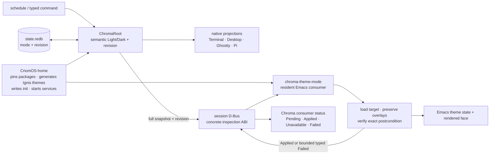
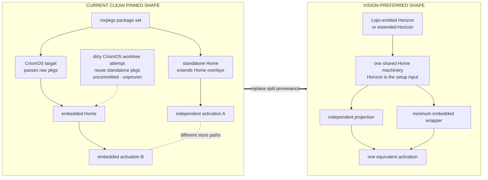

# Chroma–Emacs: current code and vision-preferred shape

## Outcome

The runtime Chroma–Emacs anatomy is substantially the anatomy approved in the
remembered design: Chroma owns semantic theme state and durable revision;
`chroma-emacs` is a resident projection which applies and verifies Home-owned
themes; CriomOS-home owns assets, packages, init, and process wiring.

The principal architectural discrepancy is above that loop. At the clean,
pinned CriomOS revision, independent Home extends the package set with Home
overlays while embedded Home receives the OS's raw package set. Their activation
store paths differ. The vision requires one Horizon-fed Home machine with a
minimal embedded wrapper and no semantic or activation difference between its
independent and embedded projections.

The current concrete D-Bus ABI is implemented and behaviorally exercised, but
its authority is still inspection-level: the living approved it superficially
to see the implementation, not as permanent final wording.

## Runtime map: current code, already close to vision

The important ownership split is already clean: Chroma does not run an
`emacsclient` concern and the plugin does not schedule themes or generate
palettes. Chroma persists a real change before signal publication. The plugin
subscribes before registration, ignores stale revisions, reapplies a duplicate
current revision to repair drift, preserves unrelated overlay ordering, and
reports only after checking the Emacs postcondition.

## Home map: current split versus the vision

## Current versus vision

| Boundary | Current code | Vision disposition |
|---|---|---|
| Chroma authority | Durable `(ThemeMode, revision)`, revisioned D-Bus snapshot, native fanout | Aligned |
| Emacs projection | Resident plugin applies and verifies exactly the Home-supplied pair; overlays survive | Aligned |
| Home runtime ownership | Home pins both projects, generates Ignis themes, supplies init, starts services | Aligned |
| Exact public wire | Fixed service/path/interface, five-argument report, bounded failure vocabulary | Implemented and tested; still only superficially approved |
| Embedded vs independent Home | Different package-set construction and differing activation paths at the clean pin | Conflicts with the explicit equivalence ruling |
| Home input provenance | Some Home values still arrive through OS/package context; full provenance audit absent | Must originate in Horizon or extended-Horizon; extent currently unknown |
| Documentation | `CriomOS-emacs` ownership/planning references and an old matching-Chroma revision remain | Stale against the current focused plugin/pins |

## Behavioral witnesses

- Chroma state/projection tests passed 12/12.
- Chroma's real private-session-bus witness passed 1/1.
- `chroma-emacs` ERT passed 9/9.
- Home contains the full Chroma-plus-Emacs resident witness, but its direct
  standalone evaluation did not reach runtime because `stubs/no-system`
  requires OS-provided system/Horizon inputs. That attempt is not a failed
  product test.

## Unknowns returned to design

- Whether the concrete bus name, object/interface, signatures, failure
  vocabulary, and 240-byte bound are now permanent needs an explicit living-
  psyche ruling beyond superficial inspection approval.
- The ruling identifies Horizon/extended-Horizon as the source of Home values,
  but no accepted design yet locates the exact shared Nix machinery or maps
  every value currently inherited from OS context.
- The dirty CriomOS package-set unification attempt may address the observed
  activation mismatch, but it is neither committed nor behaviorally proven and
  therefore is not represented as the design.

## Sources

- `flows/01a02b4b/log.md`
- `flows/01a02b4b/vision/emacsPlugin.md`
- `flows/01a02b4b/vision/homeEquivalence.md`
- `flows/01a02b4b/reports/chromaCorrectiveProof.md`
- `flows/01a0238b/reports/emacsAdapterDesign.md`
- `flows/387c707c/reports/visionMap.md`
- `flows/387c707c/witnesses/visionMap.md`
- `flows/ad443ccd/reports/currentArchitecture.md`
- `flows/ad443ccd/witnesses/currentArchitecture.md`
- `flows/01a02b4f/reports/criomosPinAudit.md`

