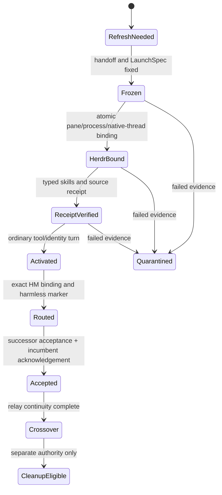

# Design proposal: programmatic refresh and messaging

This is a design proposal, not a runtime implementation, launch, transfer, or
cleanup authority. Mind owns the Flow/Messenger state machine; Field owns the
native-launcher and Herdr adapter; every flow retains responsibility for its
own contacts. Ultra-low Field is the coordinator that responds and keeps track
of refresh events and contacts; its native identity is resolved separately.

## Immutable launch material

Build a versioned `LaunchSpec` once for each relevant source revision. It
contains the seat, role, declared model and effort, exact predecessor or
fresh-seat declaration, typed skills with source hashes, source bundle paths
and hashes, frozen handoff locator and hash, and expected Herdr session and
agent name. The curated prompt body is built once from that spec, content
addressed by the spec/source hashes, then reused for the receipt-only native
turn. The first model context receives the curated source material and typed
skills, not a JSON metadata envelope.

`Frozen` is distinct from refresh detection: changing a handoff may revise the
same pending request, but must not manufacture another refresh request.

## Refresh event and contacts

The living's approximately 40% direction becomes a persisted `RefreshNeeded`
event from a declared `usedContext` and `usableContext` measurement. It is an
event, not model polling. Deduplicate by `(seat, incumbentNativeUuid,
refreshGeneration/requestId)`; record later source/handoff revisions on that
same request.

Each flow keeps exact contact bindings: Flow ID, last-confirmed native UUID and
generation, Herdr session/pane/terminal tuple, HM endpoint, subscriptions, and
delivery grade (`Submitted`, `Read`, `Acknowledged`, or `Refused`). A contact
change emits an invalidation event to subscribers. An HM display name is never
an identity proof.

## Required transitions

`HerdrBound` is atomic and precedes native receipt creation: the named Herdr
process, pane ID, terminal ID, session, and native UUID must match one
observed binding. App-server-only creation cannot enter `ReceiptVerified`.
Activation requires both `HerdrBound` and `ReceiptVerified`. Routing requires
the receipt's exact native UUID and Herdr tuple. Transfer requires separate
successor acceptance, incumbent acknowledgement, and acknowledged complete
child-reply relays. Crossover preserves the incumbent route. Cleanup is never
implied by transfer, pane state, PID state, or an HM display row.

`Quarantined` stores immutable evidence locators, the failed transition, and a
typed reason. It retains the transcript and blocks automatic expensive resume,
replay, retirement, route withdrawal, or deletion.

## Existing pieces and backlog

[`tools/native-seat-launch.mjs`](../../../tools/native-seat-launch.mjs)
already records typed skills, source manifests, first-turn receipts, rollout
evidence, activation separation, and a Herdr-thread adoption path. Its
[`tools/native-batch-refresh.mjs`](../../../tools/native-batch-refresh.mjs)
consumer already approaches Herdr-first assembly. Handoffs already distinguish
receipt, route, acceptance, crossover, and retirement boundaries.

The missing implementation is a Mind-owned durable request/contact state
machine and Field adapter with these small acceptance checks:

1. Reject app-server-only native creation before `HerdrBound`.
2. Reject activation without matching typed-skill and source receipt evidence.
3. Reject HM registration unless UUID, generation, and Herdr tuple match.
4. Emit exactly one refresh request for duplicate 40% observations.
5. Amend a pending request when handoff sources change without duplicating it.
6. Reject transfer before successor acceptance, incumbent acknowledgement, and
   every tracked relay acknowledgement.
7. Retain failed evidence and reject automatic resume or cleanup.

Reusable skill/template material should specify the LaunchSpec, handoff
format, evidence vocabulary, and gate checklist. Code should own persisted
state, transition validation, subscription invalidation, and atomic bindings.
