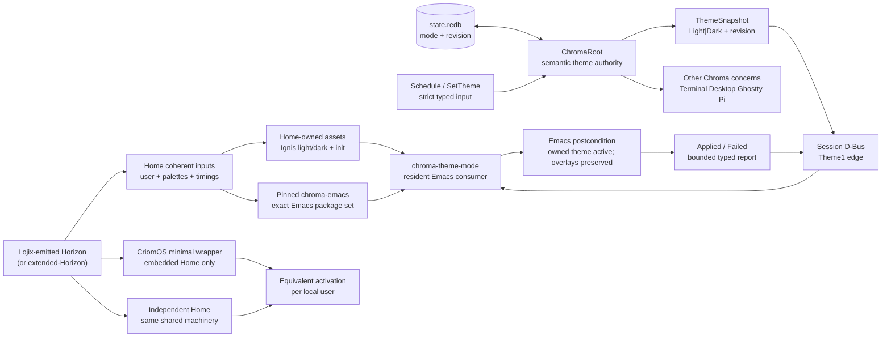

# Vision map

Subject: the vision-preferred shape of flow `01a02b4b` and the current
Chroma–Emacs/Home anatomy against it.

Flow: `387c707c`. This is a read-only exploration. It created only its own
flow records: `log.md`, `witnesses/visionMap.md`, and this report.

## Outcome

The current three-repository runtime shape is substantially aligned with the
accepted semantic design: Chroma owns desired Light/Dark state, the focused
`chroma-emacs` repository is a resident session-bus consumer, and Home owns
Ignis generation and declarative wiring. The principal vision-level discrepancy
is one layer above the runtime: at clean CriomOS parent `93049a6e`, the
independently evaluated Home output and the embedded target use different
package-set construction, and their activation paths diverge. The living has
since ruled that there should be no difference and that Home values originating
in the OS must originate in Horizon or an extended-Horizon. The current dirty
CriomOS working copy contains an uncommitted attempt to use Home's package set;
that attempt is not treated as an accepted result.

The exact D-Bus names and signatures currently implemented are an inspection
surface, not permanent psyche-approved protocol: flow `01a02b4b` records
“fine then, I approve superficially, so I can see the implementation. you can
create the new public repo” (`flows/01a02b4b/vision/emacsPlugin.md:3-11`), and
the plugin itself calls its wire surface an inspection slice
(`chroma-emacs/README.md:20-32`).

## Proposed visual map

The map is demand-driven: begin with the visible postcondition, then identify
the coherent values and the inputs that make them possible. The arrows below
are the preferred ownership and conversion boundaries; they are not a claim
that every edge is already fully proven.



The corresponding machine decomposition is:

1. Inputs: Horizon/extended-Horizon, Home palette and timing data, persisted
   Chroma state, and typed theme commands.
2. Coherent values: Home-generated theme files and init; Chroma's
   `StoredThemeState`/`ThemeSnapshot`; the plugin's target/opposite theme pair
   and exact enabled-theme ordering.
3. Outputs: Chroma native concern effects, a full revisioned D-Bus snapshot,
   and Emacs's verified `custom-enabled-themes` plus rendered faces.
4. Feedback: the plugin reports only a bounded typed summary at the protocol
   edge; complete Lisp diagnostics remain local to Emacs.

For Home specifically, the preferred shape is one shared Home machine fed by
Horizon, with two thin projections:

```mermaid
flowchart TD
  H["Horizon / extended-Horizon"] --> SH["Shared Home machinery\nHorizon is its only setup input"]
  SH --> I["Independent Home output"]
  SH --> W["Minimal embedded wrapper"]
  I --> IA["Independent activation"]
  W --> EA["Embedded activation"]
  IA == same output == EA
```

## Rulings and their authority

These are direct psyche words or the accepted flow record, not inferred code
preferences.

- The plugin boundary is explicit: “The emacs plugin would get its own repo,
  and become an input to criomos-home” (`flows/01a0238b/vision/emacsPlugin.md:3-9`).
- The transport and asset ownership answers were “1. yes a new public repo.”,
  “2. the dbus is good”, and “3. yes” (`flows/01a0238b/vision/emacsPlugin.md:17-29`).
- The accepted semantic shape includes Chroma authority, persisted monotonic
  revisions, change signals, typed acknowledgements, queryable consumer
  status, bounded failure, overlay preservation, Home-owned Ignis generation,
  and a Home end-to-end witness (`flows/01a0238b/vision/emacsPlugin.md:37-50`).
- “there should be no difference between the embedded and independent home.”
  The shared part should come “directly from lojix-emitted horizon output, or
  from a shared nix machinery which uses the said horizon as input only”, with
  embedded Home as “only the absolute minimum nix code necessary”
  (`flows/01a02b4b/vision/homeEquivalence.md:3-11`).
- “whatever in home is currently originating in the OS must originate from the
  horizon or the extended-horizon” (`flows/01a02b4b/vision/homeEquivalence.md:13-20`).
- Chroma, not Noctalia, decides the light/theme axis: “noctalia shouldnt be in
  charge of deciding the light/theme anywhere, it should be yielding to
  chroma's effects” (`psyche-raw/Vision/noctalia.md:1-5`).
- The general design method asks for an ontology/anatomy map before code
  (`psyche-raw/Vision/worldModelBeforeCode.md:3-24`), machine inputs to a
  coherent type to output (`psyche-raw/Vision/machineAnatomy.md:80-110`), and
  Mermaid in artifacts (`psyche-raw/Vision/visuals.md:3-20`).

## Current anatomy witnessed

### Chroma

At `main` `6a8e4c6a`, `ChromaRoot` restores a persisted theme snapshot, owns
the revision and projection reducer, persists a changed theme before signal
publication, and starts the D-Bus service in the resident daemon
(`src/daemon.rs:60-68,123-193,231-246`). The state record contains mode and
revision (`src/state.rs:36-64`); the theme table has a migration path from a
theme-only archive at revision zero (the state tests cover this).

The D-Bus edge is centralized in `src/theme_dbus.rs`: service/path/interface,
consumer label, failure vocabulary, and 240-byte bound are constants
(`theme_dbus.rs:20-31`); sender-bound registration returns the current
snapshot (`:163-205,293-305`); reports reject unsupported values and future
revisions while valid stale reports are no-ops (`:95-142,208-226`); unique
owner disappearance becomes `Unavailable` (`:229-246`); and the public method
and signal signatures are fixed (`:293-345`). The native theme fanout has only
Terminal, Desktop, Ghostty, and Pi concerns (`theme.rs:487-602`), so the old
Chroma-native Emacs concern is absent.

### chroma-emacs

At `main` `119a2313`, the package is a focused resident consumer. Home supplies
two distinct theme symbols and the global `chroma-theme-mode`
(`README.md:1-18`). The client subscribes to desired-state and owner signals
before registration (`lisp/chroma-theme.el:49-95,260-300`), ignores stale
revisions before normalization or mutation, reapplies duplicate current
revisions, applies only the Chroma-owned theme pair, restores order around
unrelated overlays, verifies the postcondition, and sends a bounded typed
failure (`:120-228,230-258`). This matches the accepted projection semantics.

### CriomOS-home

At `main` `a61b02d0`, Home pins both Chroma and `chroma-emacs`
(`flake.nix:143-152`), passes the plugin into one Emacs package set used by
both `programs.emacs` and `services.emacs`
(`modules/home/profiles/med/emacs.nix:14-20,109-117,794-803`), and keeps the
Ignis generator/materializer in Home (`modules/home/base.nix:97-106,143-156`).
Home init adds `.config/emacs-ignis-themes`, maps `ignis-light` and
`ignis-dark`, loads `chroma-theme`, and enables the global mode
(`modules/home/emacs/chroma-theme-init.el:1-11`,
`modules/home/profiles/med/emacs.nix:313-317`). Generated Chroma DOTOS has
Terminal, Desktop, Ghostty, and Pi but no Emacs concern or `Emacsclient`
adapter (`modules/home/profiles/min/chroma.nix:107-126`).

The resident check runs real Chroma and a real Emacs daemon under a private
session bus; it checks generated theme files, native-init/package identity,
late startup, Light/Dark transitions, Chroma restart, Emacs restart, overlay
survival, and rendered faces (`checks/chroma-emacs-resident/run.sh:1-28,72-160`).

## Current-versus-vision discrepancy map

| Layer | Vision-preferred shape | Current witness | Disposition |
|---|---|---|---|
| Repository boundary | Focused plugin repo is a Home input; domain knowledge lives with its domain | `chroma-emacs` exists and is pinned by Home (`CriomOS-home/flake.nix:143-152`) | Aligned |
| Semantic authority | Chroma alone decides Light/Dark; Noctalia yields | Chroma owns `ThemeSnapshot` and D-Bus publication; no Emacs concern remains; Noctalia ruling is external to this implementation | Aligned in inspected code; live Noctalia effect not witnessed here |
| Protocol authority | D-Bus behavior approved semantically; exact wire must remain consciously bounded | Current service uses concrete `io.github.LiGoldragon.Chroma.Theme1` names and fixed signatures; implementation is explicitly superficial/inspection-only | Current shape visible; permanent wire authority unresolved |
| Chroma state | Desired state, durable monotonic revision, push snapshot, sender-bound status | `StoredThemeState`, `ThemeProjection`, persistence-before-publish, owner watcher, and status reducer are present | Semantically aligned; full process restart proof is narrower than the design (the durable test restarts the service/root boundary rather than every possible deployment path) |
| Emacs projection | Resident mode applies/verifies exactly two Home-supplied themes, preserves unrelated overlays, reports bounded failure | `chroma-theme-mode` does this; ERT and the Home check cover stale/duplicate, overlay, failure, late startup, owner loss, and restarts | Aligned |
| Home ownership | Home generates and materializes Ignis; plugin never generates palettes or owns machine paths | Home's `ignis-themes.nix`, `base.nix`, init, and package pin own the assets and wiring | Aligned |
| Embedded/independent Home | One Horizon-fed shared Home machine; embedded projection is a minimal wrapper; activation identity is identical | Home standalone `pkgs` is `inputs.pkgs.pkgs.extend(overlays)` (`CriomOS-home/flake.nix:447-455`), while clean CriomOS parent `93049a6e` embedded target uses raw `inputs.pkgs.pkgs` (`CriomOS/flake.nix:154-162`); equivalence assertion compares distinct paths (`home-activation-equivalence.nix:11-43`) | Discrepancy witnessed by `flows/01a02b4f`; likely package-set boundary, cause not proven; current working copy has an uncommitted attempt but no accepted result |
| Home values | Values inherited from OS must come from Horizon/extended-Horizon | Home receives Horizon, but a complete provenance audit of every Home value is not present; package overlays and module inputs are visible | Unknown beyond the reported package-set discrepancy; authority question remains for any OS-derived value |
| End-to-end proof | Home owns a real daemon witness through the chosen Home shape | Check uses generated theme materializer and real built Chroma/Emacs, but launches `emacs --quick --load test-init.el` (`run.sh:82-92`) rather than proving the ordinary activated early-init path | Proof boundary, not necessarily a runtime design mismatch |
| Documentary topology | Current docs should name `chroma-emacs` as projection boundary and distinguish the unfinished whole-distribution scaffold | Home `AGENTS.md`, `ARCHITECTURE.md`, `docs/ROADMAP.md`, and commented flake lines still say `CriomOS-emacs` owns/plans Emacs (`AGENTS.md:7-15`; `ARCHITECTURE.md:6-15,34-39,139-158`; `docs/ROADMAP.md:30-34`; `flake.nix:442-444`) | Stale documentation discrepancy; generic Home `emacsclient` editor/test use is unrelated and should not be conflated with the removed Chroma adapter |

## Hypotheses

- The activation mismatch most plausibly comes from standalone Home extending
  `inputs.pkgs.pkgs` with Home overlays while clean CriomOS embeds the raw
  package set. This is an inference from the two source constructions and the
  differing activation paths recorded in `flows/01a02b4f`; it is not a proven
  root cause.
- The current D-Bus wire names are probably implementation choices made under
  the superficial approval so the design could be inspected. The evidence does
  not establish that the living has reviewed each string, signature, or failure
  taxonomy as final.

## Unknowns returned to the caller

- Whether the concrete D-Bus names, method signatures, failure vocabulary, and
  byte bound are now to be treated as permanent requires an explicit psyche
  ruling beyond “approved superficially”.
- Which single shared Nix machinery/Horizon or extended-Horizon layer should
  own every Home value currently sourced through OS/module context is not yet
  mapped. The ruling settles the desired provenance, not the implementation
  home of that layer.
- Whether the Home witness must additionally exercise the normal activated
  `early-init` path, rather than its current artifact-level native-compilation
  and `--quick --load` proof, is not settled by the accepted wording.
- The remaining `CriomOS-emacs` references may describe the separate unfinished
  whole-distribution scaffold or may be stale ownership doctrine. The caller
  should decide whether to retain an explicit distinction or remove the stale
  planning text; no compatibility path should be inferred.

## Sources

- `flows/387c707c/witnesses/visionMap.md`
- `flows/01a02b4b/log.md`
- `flows/01a02b4b/reports/chromaCorrectiveProof.md`
- `flows/01a02b4b/vision/emacsPlugin.md`
- `flows/01a02b4b/vision/homeEquivalence.md`
- `flows/01a02b4c/reports/chromaEmacsReacquisition.md`
- `flows/01a0238b/vision/emacsPlugin.md`
- `flows/01a02b4f/reports/criomosPinAudit.md`
- `psyche-raw/Vision/noctalia.md`
- `psyche-raw/Vision/setupIndependentInterfaces.md`
- `psyche-raw/Vision/everyConceptShouldHaveItsRepo.md`
- `psyche-raw/Vision/domainKnowledgePlacement.md`
- `psyche-raw/Vision/machineAnatomy.md`
- `psyche-raw/Vision/worldModelBeforeCode.md`
- `psyche-raw/Vision/visuals.md`
- `/git/github.com/LiGoldragon/chroma/src/daemon.rs`
- `/git/github.com/LiGoldragon/chroma/src/state.rs`
- `/git/github.com/LiGoldragon/chroma/src/theme.rs`
- `/git/github.com/LiGoldragon/chroma/src/theme_dbus.rs`
- `/git/github.com/LiGoldragon/chroma-emacs/README.md`
- `/git/github.com/LiGoldragon/chroma-emacs/lisp/chroma-theme.el`
- `/git/github.com/LiGoldragon/CriomOS-home/flake.nix`
- `/git/github.com/LiGoldragon/CriomOS-home/modules/home/base.nix`
- `/git/github.com/LiGoldragon/CriomOS-home/modules/home/emacs/chroma-theme-init.el`
- `/git/github.com/LiGoldragon/CriomOS-home/modules/home/profiles/med/emacs.nix`
- `/git/github.com/LiGoldragon/CriomOS-home/modules/home/profiles/min/chroma.nix`
- `/git/github.com/LiGoldragon/CriomOS-home/checks/chroma-emacs-resident/run.sh`
- `/git/github.com/LiGoldragon/CriomOS/flake.nix` at clean parent `93049a6e`
- `/git/github.com/LiGoldragon/CriomOS/modules/nixos/userHomes.nix`
- `/git/github.com/LiGoldragon/CriomOS/home-activation-equivalence.nix`
