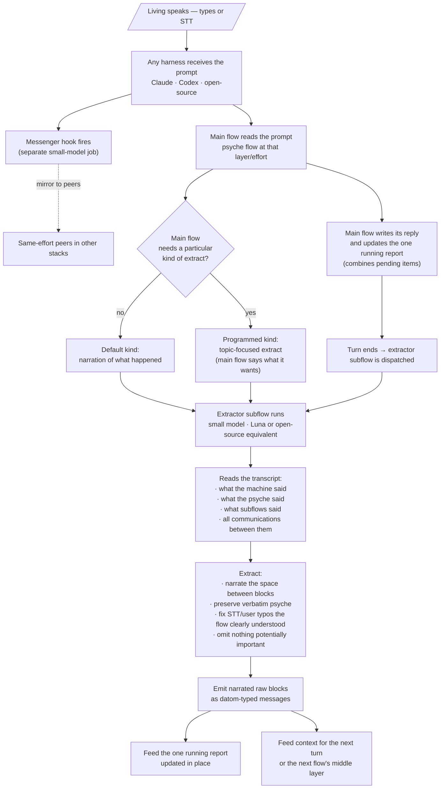

# narratedExtractor — notion

*Draft toward a skill · Flow 48cff7 · pending living review · 2026-09-16*
*Supersedes flows/48cff7/notion/presentationHandoff.md (which framed the mechanism as a text-marker scan; that was wrong).*

The concept the living explained to Psyche Fable across 6cc91b and its successors: after a main-flow reply, a small-model subflow reads the transcript and emits *narrated raw blocks*. No markers, no regex — an intelligent extraction that keeps verbatim what matters and narrates the space between.

## Source records (verbatim psyche entries)

- `flows/6cc91b/vision/transcriptExtraction.md` — 2026-09-13 · the Luna extractor produces "essentially a narrated bunch of extracted blocks" from raw machine / psyche / subflow speech; different kinds of extract depending on what the main flow asks; verbatim psyche preserved except clear STT/user errors; nothing important omitted.
- `flows/6cc91b/vision/messenger.md` — 2026-09-13 · a small model on the open-source harness runs the messenger; a hook fires when a prompt arrives and mirrors it to the other harnesses (Claude · Codex · open).
- `flows/6cc91b/vision/mainFlow.md` — 2026-09-14 · the main flow does not waste its context; subflows do implementation with the right guidance; a context subflow assembles the implementation brief.
- `flows/6cc91b/vision/reporting.md` — 2026-09-14 · one report, updated in place, combining everything pending; nothing unaddressed left out while still relevant.
- `flows/6cc91b/vision/interflowMessaging.md` — 2026-09-14 · up-and-down communication on fences; lower-layer messages arrive as tool-call returns or asynchronous signals, never as a user prompt (except relays, which are visible to the living as user turns).
- `flows/692df8/vision/messages.md` — 2026-09-15 · messages carry an ethos-typed datom variant; the JSON provenance header from `tools/prompt-relay` was rejected as ugly; datom syntax replaces it everywhere.
- `flows/692df8/vision/relay.md` — 2026-09-15 · relayed words from the secondary must appear at primary as user prompts, visible to the living.

## Proposed name

`narrated-extractor` — the small-model subflow that emits a narrated extraction of a transcript for the main flow.

## Scope

**In:** the extractor's job, its inputs, what it produces, when it runs, and how its output feeds the one running report.

**Out:** the messenger (relaying incoming prompts) and the report-in-place discipline are named here but each earns its own skill. The extractor is the piece the living asked for a flowchart of.

## Flowchart (mermaid — specification, not a rendered image)

## Companion mechanisms (each its own skill, drawn here to place the extractor)

- **Messenger** — a separate small-model job, likely on the open-source harness. Fires when a prompt arrives at any harness and mirrors it to the same-effort peers. Not the extractor. Named `messenger` in the psyche records.
- **Report-in-place** — one report per main flow, updated each turn, combining everything pending. The extractor feeds it; the main flow curates it.
- **Interflow messaging** — datom-typed messages arrive via tool-call returns or async signals, never as user prompts. Exception: a peer's relay of the psyche's words *does* land as a user prompt, so the living can watch it in the primary's transcript.

## What changes if the living accepts this

- Drop the marker-token proposal in `flows/48cff7/notion/presentationHandoff.md`. The extractor is a small model reading the transcript; markers are not needed. (Kept for now as a superseded record.)
- The presentation flow's inline-report + hand-off simplifies to: main flow writes its reply and updates the running report; a `narrated-extractor` subflow runs at turn-end and files the narration; visualization subflows are dispatched separately for figures.
- The CLI I was reaching for is the extractor itself — invoked by the harness at end-of-turn, or by the main flow as an explicit subflow call.

## Open questions worth the living's word

1. Where the extractor runs — always at end-of-turn as a harness hook, or only when the main flow asks?
2. Whether the extractor's model belongs to Codex (Luna) or the open-source stack.
3. How "kinds of extract" are named and requested — a fixed enum, or the main flow describing what it wants in words each time.
4. Whether the running report lives in the flow's `reports/` directory, in a datom stream, or both.
5. Whether the extractor also updates verbatim-psyche entries under `vision/<topic>.md` automatically, or only the main flow does that.
