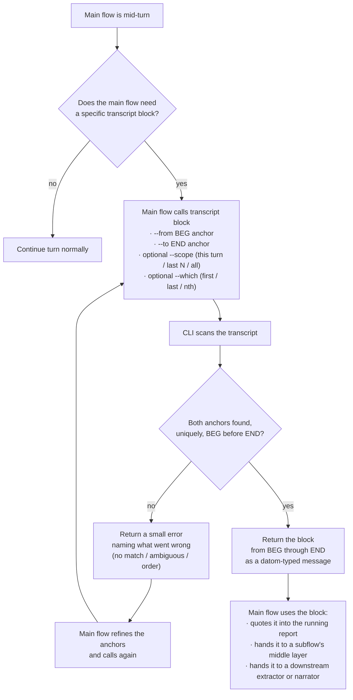

# anchorExtractor — notion

*Draft toward a skill · Flow 48cff7 · pending living review · 2026-09-16*
*Supersedes flows/48cff7/notion/presentationHandoff.md (marker-scan framing — wrong) and my first pass of this file (turn-end auto-run — also wrong; corrected below).*

The concept the living explained to Psyche Fable in 6cc91b and successors, refined in this session (2026-09-16): a CLI the main flow calls when it wants a block extracted. The main flow gives it very little — a beginning phrase and an ending phrase — and the CLI returns the block between them from the transcript. Small token cost on the call side; the block itself is not re-spoken to invoke it.

The pattern is address-by-anchors — established by `sed '/BEG/,/END/p'`, `awk '/BEG/,/END/'`, perl's `/BEG/../END/` flip-flop, git blame's `-L /regex/,+n`, and the harness's own `Edit` tool matching a unique `old_string` in a file. Nothing here has to be invented from scratch.

## Source records (verbatim psyche entries)

- `flows/6cc91b/vision/transcriptExtraction.md` — 2026-09-13 · the Luna extractor produces "essentially a narrated bunch of extracted blocks" from raw machine / psyche / subflow speech; different kinds of extract depending on what the main flow asks; verbatim psyche preserved except clear STT/user errors; nothing important omitted.
- `flows/6cc91b/vision/messenger.md` — 2026-09-13 · a small model on the open-source harness runs the messenger; a hook fires when a prompt arrives and mirrors it to the other harnesses (Claude · Codex · open).
- `flows/6cc91b/vision/mainFlow.md` — 2026-09-14 · the main flow does not waste its context; subflows do implementation with the right guidance; a context subflow assembles the implementation brief.
- `flows/6cc91b/vision/reporting.md` — 2026-09-14 · one report, updated in place, combining everything pending; nothing unaddressed left out while still relevant.
- `flows/6cc91b/vision/interflowMessaging.md` — 2026-09-14 · up-and-down communication on fences; lower-layer messages arrive as tool-call returns or asynchronous signals, never as a user prompt (except relays, which are visible to the living as user turns).
- `flows/692df8/vision/messages.md` — 2026-09-15 · messages carry an ethos-typed datom variant; the JSON provenance header from `tools/prompt-relay` was rejected as ugly; datom syntax replaces it everywhere.
- `flows/692df8/vision/relay.md` — 2026-09-15 · relayed words from the secondary must appear at primary as user prompts, visible to the living.

## The tool already exists

The living pointed out: this belongs in the `transcript` CLI (repo `/git/github.com/LiGoldragon/transcript`, invoked `nix run github:LiGoldragon/transcript -- <cmd>`, covered by the `transcript-search` skill). Its current subcommands already do most of the work:

- **`show <session>`** — prints every typed message with its line number and the assistant text preceding it. The typed message is the anchor; the block is what comes back. `-n` controls context depth, `--cap` controls block size.
- **`search <pattern> [--recent N] [--assistant]`** — regex search over typed messages, or over assistant text with `--assistant`. Returns file and line.
- **`raw <session> <lines...>`** — prints raw JSONL records at exact line numbers.

`search phrase → raw line` is already a two-call addressed extraction. What is *not* yet there is a single BEG..END anchor subcommand — one call that says "the block from anchor X to anchor Y" — and that is what this notion is proposing to add.

## Proposed addition (not a new tool)

Add a fourth `transcript` subcommand that fits the same shape:

`transcript block <session> --from "<BEG anchor>" --to "<END anchor>" [--scope this-turn|last N|all] [--which first|last|nth]`

Behavior — locate BEG anchor in the transcript, locate END anchor after it, return the block from BEG through END as a JSONL slice or a rendered text block, small error on ambiguity or wrong order.

## Scope

**In:** the `transcript block` addition and how the main flow calls it, when it calls it, and how the returned block is used.

**Out:** the messenger (mirroring incoming prompts to peers) and the running-report-in-place discipline are named here to place the extractor; each earns its own skill. The 2026-09-13 Fable record's "Luna narrator" — an intelligent narration of raw blocks — is a distinct, larger idea; the anchor extractor is the low-token addressing primitive it (or anything else) can be built on top of.

## Flowchart (mermaid — specification, not a rendered image)

## Companion mechanisms (each its own skill, drawn here to place the extractor)

- **Messenger** — a separate small-model job, likely on the open-source harness. Fires when a prompt arrives at any harness and mirrors it to the same-effort peers. Not the extractor. Named `messenger` in the psyche records.
- **Report-in-place** — one report per main flow, updated each turn, combining everything pending. The extractor feeds it; the main flow curates it.
- **Interflow messaging** — datom-typed messages arrive via tool-call returns or async signals, never as user prompts. Exception: a peer's relay of the psyche's words *does* land as a user prompt, so the living can watch it in the primary's transcript.

## What changes if the living accepts this

- Drop the marker-in-report proposal from `presentationHandoff.md`. Anchors travel with the *call*, not embedded in the flow's reply.
- Drop the turn-end auto-hook from the earlier draft of this file. The CLI is main-flow-invoked, when the flow decides it needs a block. No cost when it doesn't.
- The presentation flow's inline hand-off simplifies to: main flow writes its report, then when it wants to give a subflow (or another turn) a specific transcript block, it calls the anchor extractor with a beginning phrase and an ending phrase.
- The extractor stays cheap: a plain text CLI. No model needed for this piece. A separate narrator (the "Luna narrator" from the Fable records) can consume the extractor's output when a narrated read is wanted, but that is a different skill.

## Open questions worth the living's word

1. Whether `transcript block` is the right subcommand name, or whether one of the existing subcommands is already meant to do this and I have misread it.
2. Anchor semantics: literal substring match, small regex, or something like "first/last N words of a paragraph"?
3. Ambiguity behavior: error, earliest match with a note, or `--which` required.
4. Return shape: verbatim text, or already wrapped as a datom-typed message (per `flows/692df8/vision/messages.md`).
5. Default scope: this turn, last N turns, or whole transcript.
6. Whether Codex rollouts and Pi sessions (currently out of scope per the tool's README) come along for the ride once this subcommand lands.
