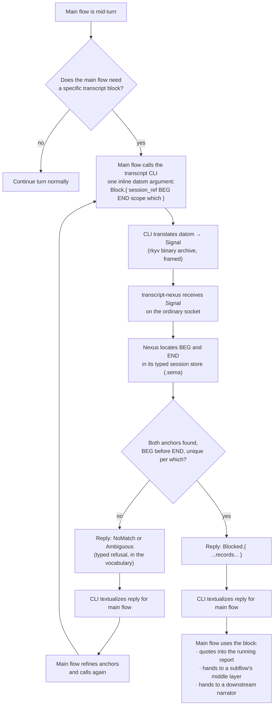

# anchorExtractor — notion

*Draft toward a skill · Flow 48cff7 · pending living review · 2026-09-16*
*Supersedes flows/48cff7/notion/presentationHandoff.md (marker-scan framing — wrong) and my first pass of this file (turn-end auto-run — also wrong; corrected below).*

The concept the living explained to Psyche Fable in 6cc91b and successors, refined in this session (2026-09-16): a CLI the main flow calls when it wants a block extracted. The main flow gives it very little — a beginning phrase and an ending phrase — and the CLI returns the block between them from the transcript. Small token cost on the call side; the block itself is not re-spoken to invoke it.

The pattern is address-by-anchors — established by `sed '/BEG/,/END/p'`, `awk '/BEG/,/END/'`, perl's `/BEG/../END/` flip-flop, git blame's `-L /regex/,+n`, and the harness's own `Edit` tool matching a unique `old_string` in a file. Nothing here has to be invented from scratch.

## Source records (verbatim psyche entries)

- `flows/6cc91b/vision/transcriptExtraction.md` — 2026-09-13 · the Luna extractor produces "essentially a narrated bunch of extracted blocks" from raw machine / psyche / subflow speech; different kinds of extract depending on what the main flow asks; verbatim psyche preserved except clear STT/user errors; nothing important omitted.
- `flows/6cc91b/vision/messenger.md` — 2026-09-13 · a small model on the open-source harness runs the messenger; a hook fires when a prompt arrives and mirrors it to the other harnesses (Claude · Codex · open).
- `flows/6cc91b/vision/mainFlow.md` — 2026-09-14 · the main flow does not waste its context; subflows do implementation with the right guidance; a context subflow assembles the implementation brief.
- `flows/6cc91b/vision/reporting.md` — 2026-09-14 · one report, updated in place, combining everything pending; nothing unaddressed left out while still relevant.
- `flows/6cc91b/vision/interflowMessaging.md` — 2026-09-14 · up-and-down communication on fences; lower-layer messages arrive as tool-call returns or asynchronous signals, never as a user prompt (except relays, which are visible to the living as user turns).
- `flows/692df8/vision/messages.md` — 2026-09-15 · messages carry an ethos-typed datom variant; the JSON provenance header from `tools/prompt-relay` was rejected as ugly; datom syntax replaces it everywhere.
- `flows/692df8/vision/relay.md` — 2026-09-15 · relayed words from the secondary must appear at primary as user prompts, visible to the living.

## The current tool is misimplemented

The current `transcript` CLI (repo `/git/github.com/LiGoldragon/transcript`) is a plain argparse shim with `show / search / raw` subcommands and rendered text output. Its own README already flags it as "temporary, pending a Nexus." The living has now (2026-09-16, `flows/48cff7/vision/transcriptAsNexus.md`) called it in: turn it into a Nexus, speak Signal on the wire, datom at the CLI boundary. The anchor-extract operation is not a fourth subcommand of the shim — it is a variant in the Nexus's signal vocabulary.

## Correct shape — `transcript-nexus` and its two CLIs

- `transcript-nexus` — the long-running binary. Ordinary socket + meta socket. Its own sema store. Speaks only Signal (rkyv binary archives, framed, length-prefixed). No text, no JSON on the wire.
- `signal-transcript` — the wire type repo (Ethos). Closed enum of request kinds, each paired with its typed reply. No `--flags` semantics anywhere; typed positions carry everything.
- `meta-signal-transcript` — owner's wire type repo, for configuration and privileged operations. Not optional.
- `transcript` — CLI on the ordinary socket. One inline datom argument.
- `transcript-meta` — CLI on the meta socket. One inline datom argument.

## The signal vocabulary (sketch — Ethos and its exact shape are the living's call)

Requests, as datom variants at the CLI boundary:

- `Show.{ session_ref: SessionRef  context: Integer  cap: Integer }` → `Shown.{ ... }`
- `Search.{ pattern: String  recent: Integer  over: SearchScope }` → `Searched.{ ... }`
- `Raw.{ session_ref: SessionRef  lines: Vector<Integer> }` → `RawLines.{ ... }`
- `Block.{ session_ref: SessionRef  from: String  to: String  scope: BlockScope  which: Which }` → `Blocked.{ ... }`, `NoMatch.{ ... }`, or `Ambiguous.{ ... }`

`SessionRef`, `SearchScope`, `BlockScope`, `Which` are their own closed enums in the vocabulary (e.g. `BlockScope := ThisTurn | LastN Integer | Whole`, `Which := First | Last | Nth Integer`). The typed refusal is vocabulary, not a string.

The anchor extract the main flow needed becomes:

```
transcript 'Block.{ 48cff7d7 «Well, I think what makes sense» «low-level chores, like that.» ThisTurn First }'
```

One positional datom value. No flags. The nexus receives Signal; the CLI's job ended at that translation.

## Scope

**In:** the shape of the transcript-nexus and the signal vocabulary that carries the anchor-extract (and the other operations already in the shim).

**Out:** the messenger (mirroring incoming prompts to peers) and the running-report-in-place discipline are named here to place the extractor; each earns its own skill and — likely — its own Nexus. The 2026-09-13 Fable record's "Luna narrator" is a distinct concept that would consume `Block` results.

## Flowchart (mermaid — specification, not a rendered image)



## Companion mechanisms (each its own skill, drawn here to place the extractor)

- **Messenger** — a separate small-model job, likely on the open-source harness. Fires when a prompt arrives at any harness and mirrors it to the same-effort peers. Not the extractor. Named `messenger` in the psyche records.
- **Report-in-place** — one report per main flow, updated each turn, combining everything pending. The extractor feeds it; the main flow curates it.
- **Interflow messaging** — datom-typed messages arrive via tool-call returns or async signals, never as user prompts. Exception: a peer's relay of the psyche's words *does* land as a user prompt, so the living can watch it in the primary's transcript.

## What this replaces

- The marker-in-reply proposal from `presentationHandoff.md`: dropped — anchors travel with the call.
- The turn-end auto-hook from the earlier draft of this file: dropped — main-flow-invoked only.
- The "fourth argparse subcommand of the shim" from the earlier revision: dropped — the shim is misimplemented; the operation is a variant in the signal vocabulary.
- The `--from / --to / --scope / --which` flag shape: dropped — datom-typed positions carry everything; flag arguments are rejected by design.

## Open questions worth the living's word

1. Anchor semantics: literal substring match, small regex, or a "first/last N words of a paragraph" wrapper? (Either way it lives in the vocabulary, not on a flag.)
2. `SessionRef` shape — short hex id, path, "current," or an enum of those.
3. `BlockScope` variants — enough to have `ThisTurn`, `LastN Integer`, `Whole`, or are there others.
4. Whether `Block` returns raw JSONL records typed as `RawRecord`, or a distilled `Block` message with pre-parsed roles, or both as separate operations.
5. Whether Codex rollouts and Pi sessions (currently out of scope in the shim's README) are first-class in the Nexus from day one, or come in a later signal-crate version.
6. Whether `transcript-nexus` also owns the "narrator" (the Luna-style narrated read) or the narrator is its own Nexus that peers with `transcript-nexus` and depends on `signal-transcript`.
