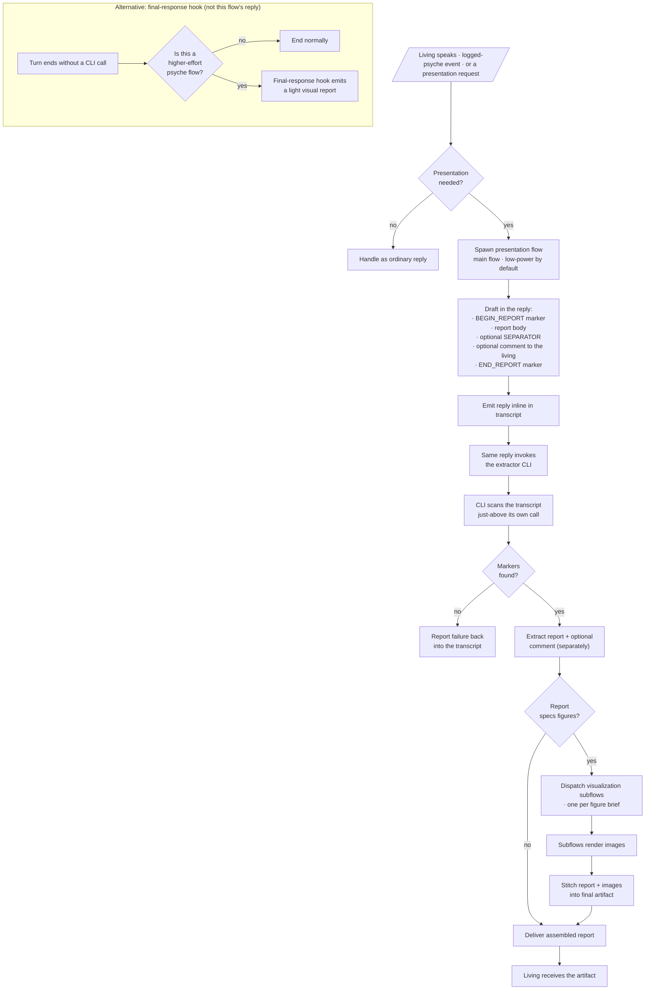

# presentationHandoff — notion

*Draft toward a skill · Flow 48cff7 · pending living review · 2026-09-16*

The mechanism the living has been teaching across the last several messages, drawn as one flow so it can be pointed at and corrected. Not yet distilled to a skill; keep in `notion/` until it is.

## Proposed name

`presentation-handoff` — the intended way a presentation (or expression) flow emits its report and hands the rendering off, without paying for a heavyweight artifact-authoring path in the main flow itself.

## Scope

**In:** how a main flow prints a report inline in its reply, marks its bounds, invokes a CLI in the same reply to extract it, dispatches visualization subflows for figures, stitches the pieces back, and — separately — how a final-response hook emits a light visual for higher-effort psyche flows.

**Out:** what a psyche flow itself may or may not draft (that belongs in a separate role-separation skill); the marker syntax details (drafted here, but the living settles the exact tokens); rendering internals of the visualization subflow.

## Flowchart (mermaid — specification, not a rendered image)

## Two mechanisms, one skill

The chart carries two ways a report reaches the living:

1. **In-turn extract via CLI markers.** The main flow deliberately calls the CLI in the same reply, and the CLI extracts a marker-bounded report from the transcript just above itself. This is the *primary* mechanism — cheap, explicit, main-flow-driven.
2. **Final-response hook.** For higher-effort psyche flows (HIGH thinking, or the psyche flows generally), a hook fires at true end-of-turn and emits a *light* visual — no explicit CLI call in the reply. This is the *fallback / ambient* mechanism, for the case where the flow's response actually is final and no CLI hand-off happens.

## Marker convention (proposed — the living settles the tokens)

- `<<<BEGIN_REPORT id=…>>>` — start of the extractable region.
- `<<<SEPARATOR>>>` — optional; splits the extractable region into `report` (before) and `comment_to_living` (after). Absent = the whole region is report.
- `<<<END_REPORT id=…>>>` — end of the extractable region.

`id` lets the CLI pick the right report if a transcript ever holds more than one.

## Open questions worth the living's word

1. Marker tokens — the ones proposed are placeholders; the living may prefer something less noisy.
2. What the CLI is called (name, invocation), and who owns it (a Curriculum tool, or per-stack).
3. Whether the final-response hook applies to every psyche flow or only to HIGH.
4. Whether visualization subflows come from a common pool or per-stack, and how they receive figure briefs.
5. Whether the extractor CLI should also route the report somewhere durable (a lane file, a beads record) as a side effect.
