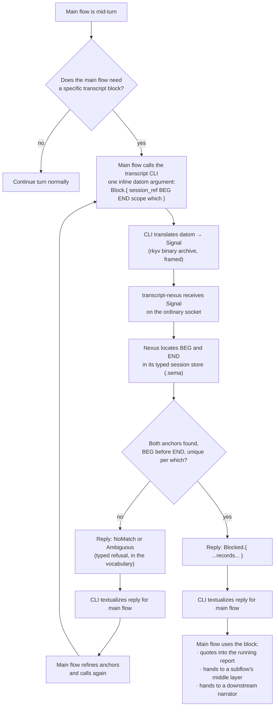

# transcriptNexus

## 2026-09-16 — the transcript component is misimplemented; make it a nexus, with datom-syntax CLIs

Context: while refining the anchor-extract flowchart, the living named the transcript component as misimplemented and set the remedy in one line.

> The transcript component is misimplemented. We need to make a nexus out of it and use datom syntax with the CLIs.

-- psyche, typed.

Prior anchors this refines, not replaces:

- The transcript tool's own README already flags itself as "CLI shim … temporary, pending a Nexus" (`/git/github.com/LiGoldragon/transcript/README.md`). The living is cashing in that IOU.
- `flows/692df8/vision/messages.md` (2026-09-15) — the JSON provenance header from `tools/prompt-relay` was rejected as ugly; datom syntax replaces it "everywhere: all the CLIs, everything." The transcript CLI is the concrete next site.

## 2026-09-16 — it needs to be a nexus with Signal and datom syntax only

Context: after the earlier draft was still framing the anchor extract as a fourth argparse subcommand of the shim, and after the living asked whether the skills were bad, the flow loaded the `nexus` and `datom` skills and the shape of the transcript-nexus became explicit.

> It needs to be a nexus with Signal and Datom syntax only.

-- psyche, typed.

Flow reading, not the living's words: the transcript-nexus takes on the shape every Nexus has. Two sockets — ordinary and meta. Its own sema store. Speaks only Signal (rkyv, framed) on the wire. Two wire type repos, in Ethos: `signal-transcript` for the public vocabulary and `meta-signal-transcript` for configuration. Two thin CLIs — `transcript` and `transcript-meta` — each taking exactly one inline datom argument. No flags anywhere. Flag arguments are rejected by design.

## The extractor operation is a variant in the signal vocabulary

The anchor-extract the main flow needs stops being a CLI subcommand and becomes a variant in `signal-transcript`. Requests (with their paired typed replies) are, in sketch:

- `Show.{ session_ref  context  cap }` → `Shown`
- `Search.{ pattern  recent  over }` → `Searched`
- `Raw.{ session_ref  lines }` → `RawLines`
- `Block.{ session_ref  from  to  scope  which }` → `Blocked` · `NoMatch` · `Ambiguous`

`SessionRef`, `SearchScope`, `BlockScope`, `Which` are their own closed enums in the vocabulary (e.g. `BlockScope := ThisTurn | LastN Integer | Whole`; `Which := First | Last | Nth Integer`). The refusal is vocabulary, not a string.

The main-flow call, at the CLI boundary, becomes one positional datom value — for example:

```
transcript 'Block.{ 48cff7d7 «Well, I think what makes sense» «low-level chores, like that.» ThisTurn First }'
```

The pattern is address-by-anchors — established by `sed '/BEG/,/END/p'`, `awk '/BEG/,/END/'`, perl's `/BEG/../END/` flip-flop, git blame's `-L /regex/,+n`, and the harness's own `Edit` tool matching a unique `old_string`. Nothing in the addressing shape needs inventing; only the Ethos-typed vocabulary needs settling.

## Flowchart of a main-flow-invoked anchor extract



## Source records this rests on

- `flows/6cc91b/vision/transcriptExtraction.md` — 2026-09-13 · the Luna extractor produces "essentially a narrated bunch of extracted blocks"; different kinds of extract per what the main flow asks; verbatim psyche preserved except clear STT/user errors; nothing important omitted.
- `flows/6cc91b/vision/messenger.md` — 2026-09-13 · a small-model job on the open-source harness fires when a prompt arrives and mirrors to the peers.
- `flows/6cc91b/vision/mainFlow.md` — 2026-09-14 · main flow does not waste context; subflows implement with the right guidance.
- `flows/6cc91b/vision/reporting.md` — 2026-09-14 · one report per main flow, updated in place, combining pending items.
- `flows/6cc91b/vision/interflowMessaging.md` — 2026-09-14 · datom-typed messages arrive via tool-call returns or async signals, never as a user prompt (except relays visible in the primary's transcript).
- `flows/692df8/vision/messages.md` — 2026-09-15 · datom syntax everywhere; JSON provenance header rejected.
- `flows/692df8/vision/relay.md` — 2026-09-15 · relayed words from the secondary land at primary as user prompts.

## Companion nexuses this places (each its own signal repo)

- **Messenger nexus** — mirrors incoming prompts to same-effort peers. Not this Nexus.
- **Report nexus** or the running report as a signal on `signal-transcript` — undecided; likely its own Nexus with its own store.
- **Narrator nexus** — consumes `Block` and `Raw` results and emits narrated blocks (the "Luna narrator" from the Fable records). Distinct from the transcript nexus; depends on `signal-transcript`.

## What this replaces

- The marker-in-reply proposal (`flows/48cff7/notion/presentationHandoff.md`, deleted): dropped — anchors travel with the call, not embedded in the reply.
- The turn-end auto-hook of the first extractor draft: dropped — the CLI is main-flow-invoked only, when the flow decides.
- The "fourth argparse subcommand of the shim" of the second draft: dropped — the shim is misimplemented; the operation is a variant in the signal vocabulary.
- The `--from / --to / --scope / --which` flag shape: dropped — datom-typed positions carry everything; Nexus CLIs reject flag arguments.

## 2026-09-16 — make the transcript tool so the main flow can use it to make the report

Context: after the transcript-nexus shape was settled, the living set the next step.

> Okay, let's make this tool, this transcript tool, so that you can use it to make the report. We're then going to start looking at the anatomy of stuff, and I'm going to correct it. Based on your visual, it is going to be made by a subflow that will be able to know exactly where to get it using the transcript. You're just going to give it the information it needs to know which block in the transcript should be turned into a visual.
>
> It needs the flowchart. It needs the anatomy, right? The anatomy and ethos. We could almost say we're going to create charts out of ethos eventually. The one who renders it makes nice SVGs so we can see the whole graph, because so many Mermaid graphs don't render. I don't even know if it's the best way to represent charts, but it seems to be the standard. All harnesses work with Markdown, right?

-- psyche, typed.

Flow reading, not the living's words: the report is authored by the main flow in Markdown, which every harness handles. The visual for a chart is produced by a **visualization subflow**, dispatched with just the pointer it needs — session_ref, BEG anchor, END anchor — and the anatomy and ethos of what should be drawn. It uses the transcript nexus to fetch the block (the flowchart in the main flow's reply, or wherever the chart's specification lives) and produces the SVG.

Mermaid is the interim notation the main flow can inline into its reply because Markdown viewers of some kinds render it; but the terminal shape is charts specified in ethos and rendered by the visualization subflow to SVG we own, so the graph is guaranteed to render everywhere. "Charts out of ethos" is the direction: the ethos-typed chart is the falsifiable spec; the SVG is a projection.

## 2026-09-16 — the visualization subflow's input is a pointer plus the anatomy and ethos of what to draw

A visualization subflow does not receive the full chart body inline. It receives:

- a **pointer** — session_ref + BEG anchor + END anchor + scope + which — through which it reads the main flow's reply from the transcript nexus (`Block.{ ... }` on `signal-transcript`)
- the **anatomy** — the structural type of the chart (flowchart, class-relationship, state-machine, mechanism, and so on); the anatomy tells the renderer what shapes and edges the picture is made of
- the **ethos** — the typed content specification: nodes, edges, labels, groups, legends, expressed in ethos so the renderer walks the tree the way any other datom is walked
- the **intent** — one short sentence saying what claim the picture must make; the renderer uses it to pick emphasis (accent, ordering, cropping)

It emits an SVG. Markdown files that reference this chart embed the SVG (or link to it); the mermaid fence in the main flow's reply is spec, not deliverable.

## What the main flow must produce for a chart to be visualized

- The chart's ethos spec inline in the main flow's reply, delimited so anchors are unambiguous (a short opening phrase and a short closing phrase suffice — the transcript-nexus finds them without markers).
- The pointer (session_ref, BEG, END) handed to the visualization subflow as one inline datom argument.
- The intent line as one sentence in that same datom.

## Open questions worth the living's word

1. Anchor semantics inside the vocabulary — literal substring, small regex, or a "first/last N words of a paragraph" wrapper.
2. `SessionRef` shape — short hex id, path, `Current`, or an enum of those.
3. `BlockScope` variants — is `ThisTurn | LastN Integer | Whole` enough, or more.
4. Return shape — raw JSONL records typed as `RawRecord`, a distilled `Block` with parsed roles, or both as separate operations.
5. Codex rollouts and Pi sessions — first-class from day one, or a later `signal-transcript` version.
6. Whether the narrator lives in the transcript nexus or in its own nexus peering with it.
