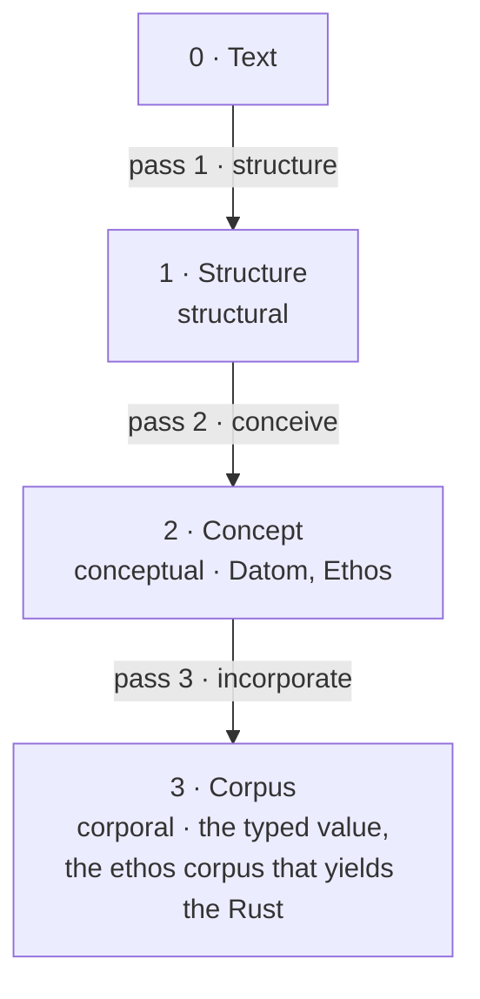
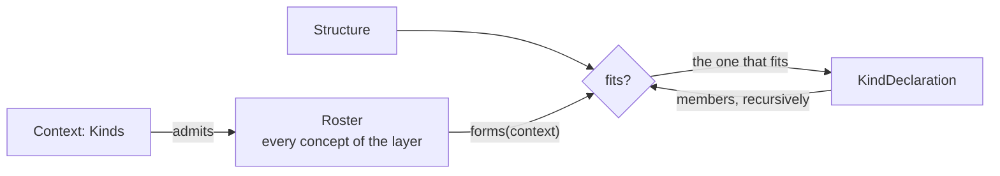

# Protos Layers

Recap of the design as it stands on 2026-08-30, flow 62022e8f. Statements are the psyche's rulings unless marked *unruled*; code is the flow's rendering of them.

## The layers

A text passes through four layers on its way to a Rust value. Every layer is a Rust value somewhere; the layer word says what the value *is*.

| layer | value | kind of the layer above, toward it | spoken capability | Rust home |
|---|---|---|---|---|
| 0 | Text — characters, normalized | — | — | protos · `Text` |
| 1 structural | Structure — Headed, Enclosed, Bare, Opaque, with extents | Structural = `Potential<Structure>` on Text | structure | protos · `Structure` |
| 2 conceptual | Concept — a variant named X with a payload; a kind declaration with its forms | Conceptual = `Potential<Concept>` on Structure | conceive | datom · `Datom`; ethos · `Ethos` |
| 3 corporal, final | Corpus — the typed value; for ethos, the resolved model from which the Rust is yielded | Corporal = `Potential<Corpus>` on Concept | incorporate | the program's types; ethos-zero |



The concept layer is the Datom and Ethos types of the settled chain. Ethos has its own corporal layer; the generated Rust is what that corpus yields. The conceptual layer is where the thinking happens: a datom struct or an ethos kind declaration is a concept.

## The passes and the one kind

One universal kind carries every pass, a rewording of Rust's `TryInto`:

```
Kinds
Potential<Embodied>.[ actualize.[ Result<Embodied Error> ] ]     ; Embodied is the bound: any value, Rust's Sized
```

```
Associations
Text.[ Potential<Protos> ]
Protos.[ Potential<Datom> Potential<Ethos> ]
Datom.[ Potential<Embodied> ]                                    ; into any type the position expects
Ethos.[ Potential<Corpus> ]                                      ; into the ethos corpus
```

```rust
pub trait Potential<T: Embodied> { fn actualize(&self) -> Result<T, Error>; }
pub trait Embodied: Sized {}
impl<T: Sized> Embodied for T {}
```

Structural, Conceptual and Corporal are the layer names of `Potential<Structure>`, `Potential<Concept>`, `Potential<Corpus>`; structure, conceive, incorporate are their spoken capabilities, each sitting on the layer above. *Embody* is the general word for reaching the layer below. The word for the other direction, corpus toward text, is *unruled*: express · textualize · project · render.

## Symbols

A capitalized bare symbol is a **Name**: it names a concept and resolves at the conceptual layer, against the inventory of declared and imported concepts. A lowercase bare symbol is a **Reference** — a path, a link, or a bare string — and is settled only when a type expects something of it, at the corporal layer.

```
Datom
Lock.{ 19 witnessOrchestrateOutput 01a0433a [ /home/li/primary/flows/01a0433a ] witness }
;    ^Name  ^Reference (integer by type)  ^Reference (string by type)
```

## Style

A space follows an opening bracket or brace and precedes the closing one, canonical and not load-bearing; never inside curly quotes; an empty one is `[]` or `{}`. `;` opens a comment to the end of the line. "Struct" is never written; the struct aspect of a concept is said by its structure — a braced body.

## Forms

### Headed and contained

An embodiment whose first member is its name has two textual forms. **Headed**: the name precedes the body as a head — implicit, outward-facing, the sweet form, a syntax sugar. **Contained**: the name is the first position inside — explicit, and the form of the embodiment itself: in Rust the name is a field of the struct.

```
Datom
GenerationFailure.MissingImport.[ Registry Target ]              ; headed, the text
```
```
Datom
Variant.{ GenerationFailure Variant.{ MissingImport Sequence.[ Symbol.Registry Symbol.Target ] } }   ; contained, the concept
```
```
Kinds
Potential<Embodied>.[ actualize.[ Result<Embodied Error> ] ]     ; headed
```
```
Datom
KindDeclaration.{ Potential [ Embodied ] [] [] [] [ actualize.[ Result<Embodied Error> ] ] }   ; contained, the concept
```
```
Library.{ 0 1 0 }                                                ; a file root: headed, the enclosing braces elided
[] [ … ] [ … ] [ … ]
```

The reader accepts either form wherever the concept is admitted; the concept layer holds the contained form; the printer writes the headed form unless the position forbids a head, as a map position does. Where a head carries more than the name — `Potential<Embodied>` carries the positions — the contained form lays those out as the first portions in order. The kind that grants the forms is Protos-level, shared by every dialect; its name is *unruled*: Nominal · Named · Fronted.

```
Kinds
Nominal.[ name.[ Name ] ]                                        ; unruled name
```

### Multi-form

A concept may be written at several arities; which members are present is decided by the arity, so a simple and a complex form exist without empty members written out. The omittable members are declared as a group inside the body — present whole or absent whole. Only *emptiable* members may sit in a group: a Vector, a Map, an Option; a bare struct member is obligatory or wrapped in Option. Groups nest for three or more forms, outer group dropped first.

```
Types
KindDeclaration.{ Name Positions.Vector<KindReference>
                  { Superkinds.Vector<KindReference> AssociatedKinds.Vector<AssociatedKind> AssociatedValues.Vector<AssociatedValue> }
                  Capabilities.Vector<Capability> }
```
```
Kinds
Potential<Embodied>.[ actualize.[ Result<Embodied Error> ] ]                          ; arity 1, bracket form
Potential<Embodied>.{ [] [] [] [ actualize.[ Result<Embodied Error> ] ] }            ; arity 4, brace form — the same concept
Nexus.{ [] [ Request.Protoformed Response.Protoformed ] [] [ handle.{ [ Request ] [ Response ] } ] }
```

A form is identified by its whole structure — delimiter, separator, arity — not by count alone; a declaration whose two forms share a structure in one context is faulted when the roster is built. Going down, the arity picks the form. Going up, the printer writes the smallest form whose omitted groups are all empty, so the same value always prints the same way. Arity lives in the concept layer only; the corpus has one shape.

## Ethos declarations

```
Types
Extent.{ Start.Integer End.Integer }               ; a braced body: members in order; Name.Type, or Name alone when they coincide
Separator.[ Period Exclamation Colon ]             ; a bracketed body: variants
Headed.{ Head Separator Body.Structure }
Structure.[ Bare Enclosed Headed Opaque ]          ; Headed is declared: the variant carries it — never Headed.Headed; Bare is not: a unit variant
Failure.[ SyntaxError.Vector<FilePath> Report.{ Ops Note } Cause.[ Io Parse ] ]   ; a variant declares its type inline
Sources.« ImportName FilePath »                    ; a map: key type, value type
```

```
Kinds
Structural.[ structure.[ Structure ] ]                            ; simple form: capabilities; a head position holds a kind
Protoformed.[ forms:{ [ Context ] [ Vector<Form> ] } contexts:{ [ Form ] [ Vector<Context> ] } express.[ Structure ] ]
;   the separator after a capability's name is its receiver: . shared self  ! mutable self  : no self
Nexus.{ [ ] [ Request.Protoformed Response.Protoformed ] [ ] [ handle.{ [ Request ] [ Response ] } ] }
;   complex form: [ superkinds ] [ associated kinds ] [ associated values ] [ capabilities ]
```

```
Associations
Text.[ Potential<Protos> ]
Protos.[ Potential<Datom> Potential<Ethos> ]
```

A variant named as a type resolves after reading, from the inventory of declared and imported types. Any repetition is an implementation failure. Rust minutiae — visibility, receivers as words, tuples, derives — never appear in a map.

### Ethos code is always contextualized

Every ethos block presented begins with a root variant naming the species of what follows — `Types`, `Kinds`, `Associations`, `Datom`, or a file root such as `Library.{ 0 1 0 }`; the version is written when it matters and may be omitted in discussion. A section holds one species. Layers are never mixed in one block: a kind's declaration and the textual forms it grants are two blocks. Species roots to come: request and response declarations of a Signal, storage declarations of a Sema file, a Nexus definition.

### The files

```
Library.{ 0 1 0 }                 ; the sweet form; the outer braces are implied
[]                                ; imports: source:[ A B ]
[ … ]                             ; types
[ … ]                             ; kinds
[ … ]                             ; associations
```
```
Signal.{ 0 2 0 }
[ ethos:[ Registry Target RustFile FilePath ImportName ] ]
[ Generate.{ Registry Target } ]                                 ; requests: a request by standing in this section
[ Generated.{ Files.Vector<RustFile> }                            ; responses
  GenerationFailure.[ SyntaxError.Vector<FilePath> MissingImport.Vector<ImportName> ] ]
```
```
Datom
Library.{ { 0 1 0 } [] [ … ] [ … ] [ … ] }                       ; the same file in full, contained form: a datom of type Ethos
[ Library.{ … } Signal.{ … } ]                                    ; mixed ethos: a vector of Ethos
```
```
Types
Ethos.[ Library.{ Version Imports Types Kinds Associations } Signal.{ Version Imports Requests Responses } ]
```

## Matching structure to concept

Reading a structure into a concept: the context says which concepts may appear here; each candidate says what forms it takes here; the structure is matched against them; the winner's members are read the same way, each under the context the winner opens. No table is kept apart from the concepts — the roster is generated from the Library and holds only each concept's capabilities.



The pieces, in protos:

```rust
pub enum Structure { Bare(Bare), Headed(Headed), Enclosed(Enclosed), Opaque(Opaque) }
pub struct Headed { pub head: Symbol, pub separator: Separator, pub body: Box<Structure>, pub extent: Extent }
pub struct Enclosed { pub enclosure: Enclosure, pub members: Vec<Structure>, pub extent: Extent }

pub enum Form {                                            // a Structure with holes
    Bare(SymbolForm),
    Headed { head: SymbolForm, separator: Separator, body: &'static Form },
    Enclosed { enclosure: Enclosure, arity: Arity },       // members are read under their own contexts
    Opaque,
}
pub enum SymbolForm { Name, Reference, Fixed(&'static str), Any }
pub enum Arity { Exact(usize), Any }

impl Form {
    pub const fn fits(&self, structure: &Structure) -> bool { /* shape, separator, arity, symbol case */ }
    pub const fn overlaps(&self, other: &Form) -> bool { /* some structure fits both */ }
}
```

The kind every concept bears — Datomizable renamed, since it is not datom's alone; name *unruled*: Protoformed · ProtoShaped · ProtoExpressible · ProtoTextualizable:

```rust
pub trait Protoformed: Sized {
    fn forms(context: Context) -> &'static [Form];                                 // what I look like here; several when multi-form
    fn conceive(structure: &Structure, context: Context) -> Result<Self, Error>;   // build me; members read under the contexts I open
    fn contexts(form: &Form) -> &'static [Context];                                // the context each member of a form is read in
    fn express(&self) -> Structure;                                                // going up: the smallest form whose omitted groups are empty
}
```

The context, one enum per dialect, a variant per place a structure can sit:

```rust
pub enum Context {   // ethos
    Root, Imports, Types, Kinds, Associations,
    TypeBody, Member, VariantPayload, KindHead, KindBody, Superkinds, AssociatedKinds, AssociatedValues,
    Capabilities, CapabilityInputs, CapabilityYields, TypeExpression,
}
```

The roster — one enum per layer, a variant per concept, generated from the Library that declares the dialect:

```rust
pub enum Ethos {
    Library(Library), Signal(Signal),                                              // the roots
    Import(Import), TypeDeclaration(TypeDeclaration), KindDeclaration(KindDeclaration), Association(Association),
    Member(Member), Variant(Variant), TypeExpression(TypeExpression),              // the inner things
    KindReference(KindReference), AssociatedKind(AssociatedKind), AssociatedValue(AssociatedValue), Capability(Capability),
}
pub struct Entry { pub forms: fn(Context) -> &'static [Form], pub conceive: fn(&Structure, Context) -> Result<Ethos, Error> }
pub const ROSTER: &[Entry] = &[
    Entry { forms: KindDeclaration::forms, conceive: |s, c| KindDeclaration::conceive(s, c).map(Ethos::KindDeclaration) },
    // … one entry per variant, generated
];
```

The match, generic, in protos — the context is a variant, the walk is the whole roster, the match is on context and structure together:

```rust
pub fn conceive(structure: &Structure, context: Context) -> Result<Ethos, Error> {
    for entry in ROSTER {
        if (entry.forms)(context).iter().any(|form| form.fits(structure)) {
            return (entry.conceive)(structure, context);
        }
    }
    Err(Error::NothingFits { context, extent: structure.extent() })
}
```

The no-conflict guarantee — in every context, no two concepts claim one form — can be checked in three places; the earliest is the right one, and the others are belt and braces:

1. **At generation.** ethos-zero knows every concept's forms while it generates the roster; a conflict is a fault against the two ethos declarations, reported in ethos terms, before any Rust exists.
2. **At Rust compile time.** The generator also emits the forms as a `const` table and a `const fn` walk over it; a conflict panics in const evaluation and the crate does not build. `Form` is const-constructible for this reason (`&'static Form`, not `Box`).
3. **As a generated test.** The same walk as a test, for the case where a form is overridden by hand.

```rust
pub const FORMS: &[(Context, ConceptName, &Form)] = &[ /* generated */ ];
const _: () = {
    let mut i = 0;
    while i < FORMS.len() {
        let mut j = i + 1;
        while j < FORMS.len() {
            let same_context = matches!((FORMS[i].0, FORMS[j].0), (a, b) if a as u8 == b as u8);
            if same_context && FORMS[i].2.overlaps(FORMS[j].2) { panic!("two concepts claim one form in one context"); }
            j += 1;
        }
        i += 1;
    }
};
```

### Going down and going up

Down, pass 2: `Text` → `Structure` by protos; `Structure` → `Ethos` by `conceive` at `Context::Root`, recursing member by member under `contexts(form)`. The multi-form machinery kicks in inside `forms`: a multi-form concept returns several forms for a context, and `fits` picks the one the arity and delimiters name.

Down, pass 3: the Ethos concept → the ethos corpus: every Name bound through the inventory, every variant-named-as-type made a carrying variant, every association checked; the Rust source is what the corpus yields. For datom: the Datom concept → the typed value, `datom.actualize::<Lock>()`, the expected type walking its members and asking each concept to become the member's type — where a Reference becomes an integer, a string, or a unit variant.

Up: `express` on the corpus gives the concept; `express` on the concept gives the structure — the smallest form whose omitted groups are empty, filled with the members' own structures; protos prints the structure as text. One capability per layer, two directions, no table.

## One datom carried down

```
Types
GenerationFailure.[ SyntaxError.Vector<FilePath> MissingImport.Vector<ImportName> ]
```
```
Datom
GenerationFailure.MissingImport.[ Registry Target ]              ; the text
```
```
Datom
Headed.{ GenerationFailure Period Headed.{ MissingImport Period Bracketed.[ Bare.Registry Bare.Target ] } }   ; layer 1, as a datom of Structure
```
```
Datom
Variant.{ GenerationFailure Variant.{ MissingImport Sequence.[ Symbol.Registry Symbol.Target ] } }             ; layer 2, as a datom of Datom
```
```rust
Response::GenerationFailure(GenerationFailure::MissingImport(vec![ImportName::from("Registry"), ImportName::from("Target")]))   // layer 3
```

```
Types
Datom.[ Symbol Variant.{ Name Payload.Datom } Braced.Vector<Datom> Sequence.Vector<Datom> Mapping.« Datom Datom » String ]
```

## What the map says, generated

```rust
pub struct Extent { pub start: Integer, pub end: Integer }
pub enum Separator { Period, Exclamation, Colon }
pub struct Headed { pub head: Head, pub separator: Separator, pub body: Box<Structure> }
pub enum Structure { Bare, Enclosed, Headed(Headed), Opaque }
pub enum Failure { SyntaxError(Vec<FilePath>), Report(FailureReport), Cause(FailureCause) }
pub struct FailureReport { pub ops: Ops, pub note: Note }
pub enum FailureCause { Io, Parse }
pub type Sources = BTreeMap<ImportName, FilePath>;

pub trait Structural { fn structure(&self) -> Structure; }
pub trait Nexus { type Request: Protoformed; type Response: Protoformed; fn handle(&self, r: Self::Request) -> Self::Response; }

pub enum Request { Generate(Generate) }                                        // a Signal's requests section
pub enum Response { Generated(Generated), GenerationFailure(GenerationFailure) }
```

## What no map says, generated by rule

```rust
const _: () = { fn bears<T: Potential<Protos>>() {} let _ = bears::<Text>; };   // one check per association

impl Protoformed for Extent {                                                     // the default, from the declaration
    fn forms(_: Context) -> &'static [Form] { &[Form::Enclosed { enclosure: Enclosure::Braced, arity: Arity::Exact(2) }] }
    fn contexts(_: &Form) -> &'static [Context] { &[Context::of::<Integer>(), Context::of::<Integer>()] }
    fn conceive(s: &Structure, c: Context) -> Result<Self, Error> { /* members in order */ }
    fn express(&self) -> Structure { /* the one form, filled */ }
}

impl Potential<Extent> for Datom { fn actualize(&self) -> Result<Extent, Error> { Extent::conceive(&self.express(), Context::of::<Extent>()) } }

#[derive(Clone, Debug, PartialEq)]   // derives, Box on recursion, #[non_exhaustive]: emitter rules, stated once in ethos-zero
```

The roster enum, its `ROSTER` table, the `FORMS` table and its const walk are likewise emitted for every dialect Library. The invariant Rust of a Nexus executable — main, sockets, handshake, the request loop over `Nexus::handle` — is not yet recorded in Vision.

## The ethos roster

Every concept of the ethos layer, one variant each: the roots — Library, Signal, and to come Sema and Nexus definitions; the declarations — type, kind, association (a type bearing a kind), import; the inner things — member, group, variant, type expression, kind reference, superkind, associated kind, associated value, capability, and whatever else the complex kind can carry.

## Unruled names

- the kind Datomizable becomes: Protoformed · ProtoShaped · ProtoExpressible · ProtoTextualizable
- the headed/contained kind: Nominal · Named · Fronted
- the upward direction: express · textualize · project · render
- a value of the corporal layer: Corpus · Body
- what a context holds: Admission · Expectation · Context
- the ethos corpus: its name and members

## Sources

- flows/62022e8f/vision/*.md and notion/layerMatching.md — the psyche's words of 2026-08-30 (terminal and artifact comments)
- flows/e8c4cc61/vision/*.md — the settled chain, ethos file anatomy, kinds, Datomizable
- Vision/protos.md, Vision/datom.md, Vision/ethos.md — distilled vision
- psyche-raw/Intent/protosParsing.md — context-driven parsing (Intent, 2026-08-13)
- flows/b675f3d9/vision/structuralParsing.md — structure-discriminated variants, "A Concept being a type or a Kind"
- flows/62022e8f/witnesses/datomSituational.md — what datom reading depends on the expected type
- flow 62022e8f (this flow), flow e8c4cc61, flow b675f3d9, flow 04db2fd2
