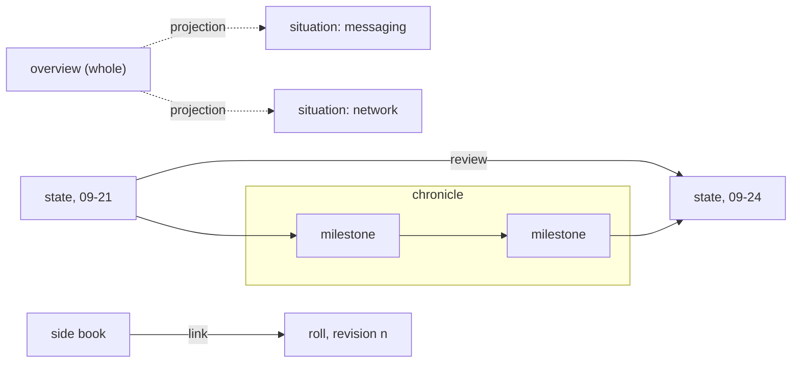

# Flashbook vocabulary: an anatomy from roots

A draft for Psyche High 752e0f, answering the living's request in `flows/752e0f/vision/flashbookVocabulary.md`, 2026-09-24. It is a proposal: none of these terms stands until the living reviews it. Where a derivation was checked this run, the source is cited in §4; where it was not, the line says **unchecked**. Structural readings from Pāṇini and category theory are **this subflow's inference**.

What was read: the testing-flashbook, vocabulary, ethos, datom, operational-final-response and operational-status-presentation skills; `flows/{836818,d8df70,e51411,1b8ac0}/vision/flashbooks.md`; `Vision/meaning.md`; every `source.md` under `flows/e51411/flashbooks/` and `flows/d8df70/flashbooks/`; `flows/752e0f/reports/flashbooks-review-2026-09-24.md`.

## 1. The anatomy

### What the books actually are

Counting the eleven existing sources by what each holds:

| Book | Holds | Kind below |
|---|---|---|
| Where We Are — 24 September (e51411) | every topic, as it stands today | overview (overall state) |
| Is Everybody Logging?, Messaging and the Nexus, Prometheus and the Network, Starting a Fresh Flow, How Flows Hand Over (e51411) | one topic as it stands, the living's words on it, what is open, proposals | situation |
| Making Flashbooks (e51411), How to Make a Flashbook (1b8ac0) | how a thing is made or works, less tied to a date | concept |
| The Dawn of the Meta Harness (d8df70) | milestones in order, 09-21 to 09-24 | chronicle |
| What Waits for the Living (d8df70) | six questions, one per page | questions book |
| State of the World, Revision 2 (d8df70) | the whole, rebuilt as a second revision | overview, and a version of a roll |
| (owed) one per main Flow, rolling over | a Flow's own context, revised over time | roll |

Page headings across the sources: Illustration 20, Flowchart 20, Proposals 7, What you said 6, Still open 3; everything else is a one-off text page (census, catalog, one-line state).

### Definitions, in our terms

**Flashbook.** A short illustrated book the living reads, one subject per book, derived from Markdown a psyche Flow wrote in its transcript under an exact title.

**Source.** The Markdown in a Flow's transcript from the title heading to the next rule; the book is derived from it and never edits it.

**Page.** One screen of a book covering one thing.

**Cover.** The first page, always an illustration.

**Illustration.** A picture that conveys information, made by an image model; it may be one with a flowchart.

**Chart.** A flowchart page: things and the arrows between them.

**Text page.** A small paragraph or a few points; an illustration always follows it.

**Voice** (the quote page). The living's verbatim words with their provenance line.

**Question** (ask). One thing the living is asked to rule on; a comment is an answer.

**Proposals.** The last page: numbered, checkable, landed ones badged.

**Level.** How far a book is illustrated, in the living's three words: Report (flowcharts, no generated image), Illustrated (AI-generated illustrations), Alive (the charts themselves redrawn as illustration).

**Situation.** Where one subject stands at a moment: what is done, blocked, open.

**Overall state** (overview). The situation of everything at once.

**Status.** A Flow's own situation, as operational-status-presentation shapes it.

**Review.** A second seeing across a stretch of time: what changed between then and now, and whether what was said still holds.

**Chronicle** (chronology). The ordered milestones of a stretch of time, each a step from one state to the next.

**Concept.** How a thing is: a design or a mechanism, held apart from any one date.

**Questions book.** A book of the questions waiting for the living.

**Roll** (rolling book). The one ongoing book of a main Flow; each revision carries forward what still holds and drops what has landed in files.

**Side book.** A book made beside a roll and linked into it, or named in one of its revisions.

## 2. Terms and roots

Format: proposed word — PIE root — Sanskrit / Latin / Greek — why it fits.

### The containers

**Book** (keep; *flashbook* stays the name). PIE \*bʰeh₂ǵ- "beech": English *book*, German *Buch*/*Buche*, the beechwood tablet. Latin kept the bark instead, *liber*; Sanskrit's word for a composed book is *grantha*, from √granth "to knot, string together" (**unchecked**), and *sūtra* "thread" (PIE \*syewH- "sew", Latin *suere*; **unchecked**). Why: every one of these names the material that holds the text together, and none names its content, which is right for the container.

**Page** (keep). PIE \*peh₂ǵ- "fasten": Latin *pangere*, *pāgina*, first a strip of papyrus fastened to others; Greek *pḗgnūmi* "fix" (**unchecked**). Why: a page is the unit that is fastened to the next; the alternation rule is a rule about fastening.

**Source → derivation.** The structural term is Pāṇini's. His grammar takes lexical lists, above all the *Dhātupāṭha* of verbal roots, as input and applies rules to generate well-formed words. The source Markdown is the *dhātu* (the root, "what is placed"; PIE \*dʰeh₁- "put", Latin *-dere*, Greek *títhēmi*; **unchecked**), the renderer's work is the *prakriyā* (derivation), the published book is the finished word. Say: *the book is derived from its source.*

### The pages

**Illustration** (keep). PIE \*leuk- "light, brightness": Latin *lux*, *lūstrāre*, *illūstrāre* "light up, make clear"; Greek *leukós* "white"; Sanskrit *rocate* "shines" (**unchecked**). The picture sense is late (1816); the older sense is "making clear". Why: this is exactly the living's ruling that illustrations convey information, not prettiness. Sanskrit's word for a picture, *citra* "bright, variegated, picture", belongs to √cit "perceive" (**unchecked**).

**Chart** (keep). Greek *khártēs* "papyrus leaf" (no secure PIE root). Structural term: a chart is a *diagram* in category theory's sense, objects with arrows, which is why a chart and an illustration can be one (the living, 1b8ac0, 2026-09-21).

**Voice** (proposed for the quote page). PIE \*wekʷ- "speak": Sanskrit *vakti* "speaks", *vācas-* "word" (*vāc* "speech"); Latin *vōx*, *vocāre*; Greek *épos* "word, tale". Why: the page is the living's own speech, carried verbatim; *quote* comes from Latin *quot* "how many" (numbering chapters) and names nothing about speech. Nyāya calls testimony as a means of knowing *śabda-pramāṇa* (**unchecked**), which is the page's standing: the living's word, not a witness.

**Ask** (the question page; *question* in prose). PIE \*preḱ- "ask, entreat": Sanskrit *praśna* "question", *pṛcchati* "asks"; Latin *precārī* "pray, beg"; German *fragen*. Why: shorter than *question* (Latin *quaerere*, no secure PIE root), and in Sanskrit *praśna* also meant "lesson" and "short section": one question per page, a page being a section.

**Proposals** (keep). Latin *prōpōnere* "set forth". Each item carries a mark, *open* or *landed*.

### The kinds of book

**Situation.** Latin *situs* "place, position", *situāre*; PIE \*tḱey- "settle, dwell, be at home": Sanskrit *kṣéti* "abides, dwells" (*kṣiti* "dwelling, earth", **unchecked**); Greek *kṓmē* "village"; English *home*. The "state of affairs" sense came only in 1710. Why: a situation is *where a thing sits among its surroundings*.

**State.** PIE \*steh₂- "stand, make or be firm": Sanskrit *tiṣṭhati* "stands", *sthita*, *sthiti* "standing, condition"; Latin *stāre*, *status* "manner, position, condition"; Greek *hístēmi*, *stásis* "a standing". Why: a state is *how a thing stands*. **Status** is the same Latin word.

**Overview.** *over* (PIE \*uper: Sanskrit *upári*, Latin *super*, Greek *hupér*; **unchecked**) + *view* (PIE \*weyd- "see", below). Greek *sýnopsis* "seeing together" is the exact calque. Structural term: the overview is the **product** of the topic situations: one object from which a projection runs to each topic book (this subflow's inference).

**Review.** Latin *re-* + *vidēre*, via Old French *reveue* (first a formal military inspection); PIE \*weyd- "see": Sanskrit *veda* "I know"; Greek *idein* "see", *oîda* "I know", *idéa*, *historía* (from *hístōr* "one who knows, witness"). "Retrospective survey" is attested from the 1670s. Sanskrit's working word for a review is *samīkṣā*, "looking over together" (**unchecked**). Structural term: a review is a **morphism** from one state to a later one: the arrow, not the endpoint.

**Chronicle** (for chronology; shorter and a noun of the thing). Greek *khrónos* "time", uncertain origin, no PIE root; *-logy* is PIE \*leǵ- "gather" (Latin *legere*, Greek *lógos*), with no Sanskrit cognate listed. The Sanskrit genre is *itihāsa*, "so indeed it was" (**unchecked**). Structural term: a chronicle is a **composite path** of morphisms, s₀ → s₁ → … → sₙ; each milestone is an arrow, and the whole is their composition.

**Concept.** Latin *con-* + *capere* "take, grasp"; PIE \*kap- "grasp": Latin *capere*, Greek *káptein*, English *have*. Sanskrit *saṃgraha*, *sam* "together" + √grah "grasp" (**unchecked**), is a part-for-part calque: *con-cept* and *saṃ-graha* both mean "grasped together". The living named this pole: flashbooks are "basically just a concept or an illustration".

**Questions** (the questions book). The same \*preḱ-. The fit is exact: the *Praśna Upaniṣad* is six questions from six students, one chapter each, and its sections are themselves called *praśna*; *What Waits for the Living* is six questions, one page each.

**Topic** (keep as the scope word, not a kind). Greek *tópos* "place", uncertain origin, no PIE root; Aristotle's *Topika*. The sharper structural term is Mīmāṃsā's *adhikaraṇa*, a topic section with five members: *viṣaya* (the subject), *saṃśaya* (the doubt), *pūrvapakṣa* (the first view), *uttarapakṣa* or *siddhānta* (the answer), *saṅgati* (how it fits the whole). A situation book already has this shape: subject, what is open, what you said, proposals, how it fits the overview.

**Roll** (the rolling per-Flow book). Latin *volūmen* "that which is rolled", from *volvere* "turn, roll", PIE \*wel- "turn, revolve". Each revision is a *version*: Latin *vertere*, PIE \*wer- "turn, bend", Sanskrit *vartate* "turns round, rolls". Pāṇini's term is the exact structure: *anuvṛtti* (same √vṛt) is how a word stated once in one rule recurs, unstated, in the rules that follow, until it stops applying. A roll works that way: what still holds carries forward into the next revision, and what has been merged into files stops being carried (the refresh-payload trim in operational-final-response). The first statement is the *adhikāra*, the heading.

**Side book.** Keep the living's words. The Sanskrit analogue is *pariśiṣṭa*, "what remains around", the supplement appended to a Vedic text (**unchecked**). Structural term: an **arrow into the roll**, a link from the side book to the revision that names it.

**Genre** (the type's word for what kind of book). Latin *genus*, PIE \*ǵenh₁- "beget"; Sanskrit *jāti* "birth, class" (**unchecked**); Greek *génos*. Chosen because ethos reserves *Kind* for the bearer of capabilities, so a book's kind cannot be named Kind in ethos.

### Verdict on the living's three words

- **Situation** and **overall state** are **the same thing** at different scope. Both are a *standing at one moment*, an object and not an arrow. By root they differ only in their picture: *situation* (\*tḱey-) is where a thing sits, *state* (\*steh₂-) is how it stands. The difference that matters is scope: a topic, or the whole. Status is the same thing again, with a Flow as its scope. In the type: one genre, State, with a Scope of Whole, a Topic, or a Flow.
- **Review** **differs**. By root it is *seeing again* (\*weyd-): it needs two moments. It is the arrow between two states. It is kin to the chronicle, which is a chain of such arrows, and it shares \*weyd- with Greek *historía*.

## 3. The ethos

### The Type ethos

In the style of operational-final-response: the object first, then the vector of type definitions it needs.

    Type
    Flashbook.{ Source Genre Tenure Level Picture Vector<Page> }
    [ Source.{ FlowId Title }  FlowId.String  Title.String
      Genre.[ State.Scope  Review.Span  Chronicle.Span  Concept.Subject  Questions ]
      Scope.[ Whole  Topic.Subject  Flow.FlowId ]
      Span.{ Date Date }  Date.String  Subject.String
      Tenure.[ Roll  Side.FlowId  Single ]
      Level.[ Report Illustrated Alive ]
      Picture.{ Heading Markdown }  Heading.String  Markdown.String
      Page.[ Illustration.Picture  Chart.Picture  Text.Markdown  Voice.Quote  Ask.Question  Proposals.{ Vector<Proposal> } ]
      Quote.{ Markdown Provenance }  Provenance.{ Mode Date FlowId }  Mode.[ Typed Stt Relayed Unestablished ]
      Question.Markdown
      Proposal.{ Number Markdown Mark }  Number.Integer  Mark.[ Open Landed ] ]

How to read it:

- The Picture field of Flashbook is the cover, so the rule "the first page is always an illustration" is held by the type, not by review.
- The book's title is the Source's Title: the renderer finds the source by that title, so the title is stated once.
- Span is declared once and carried by both Review and Chronicle (its fields are `first_date`, `second_date`). A chronicle's milestones are its pages.
- Side carries the FlowId of the roll it links into. A roll's own Flow is its Source's FlowId.
- A quote's Provenance holds how the words came in, when, and which Flow heard them. The Mode values are the ones the records already use: typed, STT, relayed, input mode not established.
- Proposals declares its payload in place as a struct, so the generated type is `Proposals_Data { proposal_vector }`.

### Datom: an overview book

An overview in this type, filled from `flows/e51411/flashbooks/overview/source.md`:

    { { e51411 «Where We Are — 24 September» }
      State.Whole
      Single
      Illustrated
      { «The whole picture»
        «Five topics as five blocks, each coloured by its state: green done or moving, red blocked, with its blocker written on the block. Arrows show what blocks what.» }
      [ Text.«**Psyche High:** Fable 752e0f. **Psyche Medium:** e51411. **Mind:** Sol 00f95a. **Field:** Astra 5f38bc, the deploy executor. No Field Sol or Luna is running.»
        Illustration.{ «Who is alive» «Four lit windows in one house, one per aspect; the Field window lit by Astra alone, two dark panes beside it.» }
        Chart.{ «What stands between us and working Flow» «Flow 0.5 written → built → activated on ouranos (blocked: Lojix has not accepted the job) → live flows bound → one raw send into a real pane.» }
        Illustration.{ «What removes each block» «Each block as a locked gate, its key hanging beside it and labelled with who holds it.» }
        Ask.«How are archives searched?»
        Illustration.{ «The archive» «A closed archive room with no index on the door.» }
        Proposals.{ [ { 1 «Add the bypass default to Claude's settings, and later manage it in CriomOS-home.» Open }
                      { 2 «Astra activates Flow 0.5 directly, binds the live flows, and sends one raw message through Flow.» Open } ] } ] }

### Datom: a situation book

A situation on one topic. It is written as a side book of 752e0f's roll and filled from `flows/752e0f/reports/flashbooks-review-2026-09-24.md`. It is an example of the syntax, not a commissioned book.

    { { 752e0f «Flashbooks, 24 September» }
      State.Topic.Flashbooks
      Side.752e0f
      Illustrated
      { «Nine books on one shelf»
        «Nine spines on a shelf built for six to nine. Four carry a red thread where a claim has gone stale; a gap at the end is marked for the roll each main Flow is owed.» }
      [ Text.«Nine books exist: seven from e51411 and two from d8df70. That is at the six-to-nine ceiling before d8df70's two older books are counted. No main Flow has its own roll yet.»
        Illustration.{ «What went stale» «The overview's page on Field shows Astra blocked, while in the window behind it Astra is working.» }
        Voice.{ «If you want it, depending on how nice a book you want to make, there are three levels:
    1. SVG and no actual image, generated, so just a simple report with flowcharts
    2. The more illustrated part with AI-generated illustrations
    3. The third one where the SVGs are actually redrawn in a nice way, so it's more alive with the illustration» { Unestablished 2026-09-24 e51411 } }
        Illustration.{ «Three doors» «Three doors side by side: a plain one with a chart pinned on it, a painted one, and a third where the painted chart grows out through the frame.» }
        Proposals.{ [ { 1 «Rebuild the overview, fixing its two stale claims.» Open }
                      { 2 «Keep six: logging, flashbooks, network, dawn, what-waits, overview.» Open } ] } ] }

### Syntax points checked against the skills

- A struct is `{ }` with no head, a vector is `[ ]`, a variant is `Head.form`, and a variant carrying nothing is its bare name (`Single`, `Open`, `Illustrated`, `Questions`). A variant can carry a variant (`State.Whole`, `State.Topic.Flashbooks`) as `Observed.Locks.[]` does in the datom skill.
- `2026-09-24`, `e51411`, `752e0f` and `Flashbooks` are bare strings, since each is a run with no space and no delimiter glyph. Every string with a space is in guillemets, and line breaks inside guillemets are content.
- Every position is filled; nothing is omitted.
- No Boolean: the datom skill gives no Boolean literal, so a proposal's state is an enum, Mark.

## 4. Sources

Etymology was checked this run against the Online Etymology Dictionary (Douglas Harper):

- https://www.etymonline.com/word/situation — *situs*, PIE \*tkei-, Sanskrit *kṣeti*
- https://www.etymonline.com/word/page — *pāgina*, *pangere*, PIE \*pag-
- https://www.etymonline.com/word/review — *re* + *vidēre*, PIE \*weid-
- https://www.etymonline.com/word/*weid- — Sanskrit *veda*, Greek *idein*, *historia*
- https://www.etymonline.com/word/book — Proto-Germanic \*bōk-, beech
- https://www.etymonline.com/word/illustration — *illūstrāre*, PIE \*leuk-
- https://www.etymonline.com/word/volume — *volūmen*, *volvere*, PIE \*wel- (3)
- https://www.etymonline.com/word/*wer- — (2) "turn", Sanskrit *vartate*, Latin *vertere*
- https://www.etymonline.com/word/*sta- — Sanskrit *tiṣṭhati*, Latin *status*, Greek *stasis*
- https://www.etymonline.com/word/*prek- — Sanskrit *praśna*, *pṛcchati*, Latin *precārī*
- https://www.etymonline.com/word/*kap- — Latin *capere*
- https://www.etymonline.com/word/concept — *concipere*
- https://www.etymonline.com/word/*wekw- — Sanskrit *vakti*, *vacas-*, Latin *vōx*, Greek *epos*
- https://www.etymonline.com/word/*leg- — no Sanskrit cognate listed
- https://www.etymonline.com/word/chronicle — *khronos*, origin uncertain
- https://www.etymonline.com/word/topic — *topos*, origin uncertain

Sanskrit and Pāṇini, also checked this run:

- https://en.wikipedia.org/wiki/Prashna_Upanishad — six questions, six students; *praśna* as question, lesson, section
- https://en.wikipedia.org/wiki/Aṣṭādhyāyī — Dhātupāṭha as input, *anuvṛtti*, *adhikāra*
- https://www.wisdomlib.org/definition/anuvritti — *anuvṛtti* as recurrence of a word into following rules
- https://en.wikipedia.org/wiki/Purva_Mimamsa_Sutras and https://www.wisdomlib.org/definition/purvapaksha — the five members of an *adhikaraṇa*

Marked **unchecked** above, and given from memory: *grantha*, *sūtra*/\*syewH-, *pḗgnūmi*, *rocate*, *citra*/√cit, *śabda-pramāṇa*, \*uper/*upári*, *samīkṣā*, *itihāsa*, *saṃgraha*, *kṣiti*, *pariśiṣṭa*, *jāti*, *dhātu*/\*dʰeh₁-. Check these in Monier-Williams, *A Sanskrit-English Dictionary* (1899), and Mallory and Adams, *The Oxford Introduction to Proto-Indo-European* (2006), before any of them is relied on.
