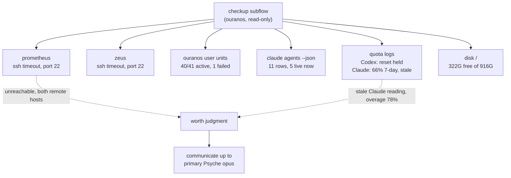

# Cluster checkup — 2026-09-17, primary Psyche sonnet (Low layer)

One bounded, read-only subflow gathered this from ouranos (this host); nothing
was restarted, edited, or written to remotely. Claims below are the subflow's
witness, quoted or paraphrased close to its own words.

## Findings

- **prometheus** — unreachable: `ssh -o BatchMode=yes -o ConnectTimeout=5 prometheus.goldragon.criome` → exit 255, `Connection timed out` on port 22.
- **zeus** — unreachable: same ssh pattern → exit 255, `Connection timed out` on port 22.
- **User units (ouranos)** — 41 loaded, 40 active/running, 1 failed (`agent-intercom-fleet-cleanup.service`, "Stop expired Agent Intercom worker cgroups"). `message-daemon`, `codex-remote-control`, `orchestrate-nexus` all active/running. No unit named `lojix` or `core-checkup`(`.timer`) is loaded; no unit name matches "claude" or "psyche".
- **`claude agents --json`** — 11 rows. Live/working now: `primary-claude-successor-efa157` (f55ec8ce, busy), `primary Psyche opus` (9993b5f1, busy), `primary Psyche sonnet` (79715bc6, busy — this flow), `primary-claude-pending` (840e42bb, idle/working), `primary-claude-successor-840e42` (efa15708, idle/working). Idle: `primary-fe`, `spirit skill principles` (done). Blocked: `secondary claude initialization` (57a7aa02), `primary-claude-05c604`, `flow-daemon-probe`, `primary-claude-successor-f55ec8` (b492510d, idle but state blocked).
- **Quota** — two separate logs, different schemas, neither freshly written this hour:
  - `~/.local/state/codex-quota-reset/log.ndjson` (newest by mtime, 09:21 today): `{"at":"2026-09-17T15:21:29.200Z","kind":"ResetHeld","reason":"modeHold"}` — the reset tool held, not consumed.
  - `~/.local/state/claude-quota-observe/log.ndjson` (one entry, 2026-09-16T19:43:07Z, stale ~14h): `fiveHourPercentUsed 10, sevenDayPercentUsed 66, overagePercentUsed 78, sevenDayResetsAtIso 2026-09-19T13:00:00Z, status allowed_warning`.
- **Disk (ouranos)** — `/dev/nvme0n1p2 916G 548G used 322G free 64%` on `/`.

## Flow

## What this Low layer flags for judgment, not decides

1. **Both remote hosts unreachable by ssh** (prometheus and zeus, port 22 timeout, not refused) — this matches the living's report that they could not reach the other Claude flows remotely; whether this is the same network problem, a firewall/router issue, or those two hosts specifically being down is not something this checkup can distinguish from ouranos alone.
2. **The only Claude-side quota reading is 14+ hours stale** and its last value (`sevenDayPercentUsed 66`, `overagePercentUsed 78`, `status allowed_warning`) is high enough to be worth a fresher read before any heavy work is planned.
3. One failed user unit (`agent-intercom-fleet-cleanup.service`) — looks like routine cleanup, not flagged as urgent, noted for completeness.

No repair, restart, or edit was attempted on any of the above.
