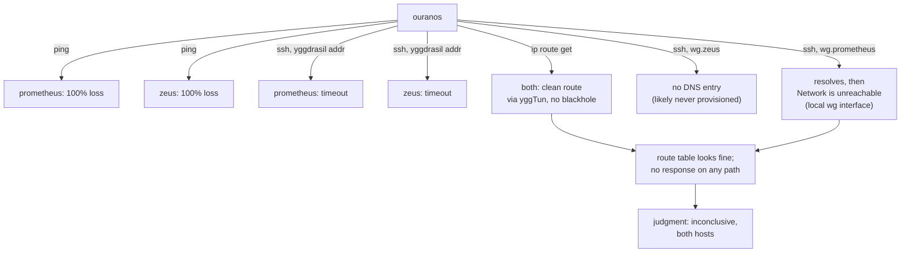

# Reachability characterization: prometheus & zeus — 2026-09-17

Ordered by primary Psyche opus, following up on flag 1 of the earlier checkup
(`reports/checkup-2026-09-17.md`). One bounded read-only subflow, from
ouranos; no repair, restart, config edit, or sudo.

## What each path found

| path | prometheus | zeus |
|---|---|---|
| ICMP ping (`-c 2 -W 3`) | 100% loss, exit 1 | 100% loss, exit 1 |
| ssh direct to Yggdrasil address | `Connection timed out`, exit 255 | `Connection timed out`, exit 255 |
| ssh to `wg.<host>.goldragon.criome` | resolves, then **`Network is unreachable`**, exit 255 | **`Could not resolve hostname`** (no DNS entry), exit 255 |
| tailscale | not authenticated (`NoState`, cert-trust error against the local control-plane proxy) — no data for either host | same |
| `ip route get <yggdrasil-addr>` | clean route via `yggTun`, kernel proto, no blackhold flag | clean route via `yggTun`, kernel proto, no blackhole flag |

Zeus's Yggdrasil address (`200:17f7:4fad:e50b:a50c:2048:2169:41f7`) was looked
up from `/git/github.com/LiGoldragon/goldragon/proposal.datom` — the live
`cluster-definition.datom` name from earlier reports does not exist there
under that name now; the same `NodeNetwork` field carries it.

## Reading the shapes apart

- **Timeout ≠ refused ≠ unreachable ≠ unresolved** — four different failure
  shapes turned up, and they don't all say the same thing:
  - ICMP and direct-Yggdrasil-ssh time out on both hosts: packets appear to
    leave (the local route is clean) but nothing comes back, on any path,
    for either host.
  - `wg.prometheus.goldragon.criome` resolves but hits `Network is
    unreachable` — a **local** kernel-level condition (no usable route on
    the wg interface itself from ouranos), not a remote non-response. This
    is a different, more specific finding than the timeout: it points at
    ouranos's own WireGuard interface state, not at prometheus.
  - `wg.zeus.goldragon.criome` has no DNS entry at all, unlike
    `wg.prometheus` — looks like it was never provisioned, not evidence
    about zeus's liveness.

## Flow

## Judgment

- **prometheus: inconclusive.** Every remote-response path timed out, but
  the local route is clean and the `wg.prometheus` local-network-unreachable
  finding is a distinct, separate local-interface issue worth its own look —
  not itself proof the host is down.
- **zeus: inconclusive**, same pattern, plus the missing `wg.zeus` DNS entry
  (looks like a provisioning gap, not evidence either way on liveness).

Neither "hosts probably dead" nor "hosts alive, port 22/route blocked" is
established from ouranos alone; the clean `yggTun` route on this end doesn't
rule out a break further along the Yggdrasil overlay mesh or on the hosts'
own end. Tailscale gave no usable data (not authenticated on this host).

No repair, restart, or config edit attempted.
