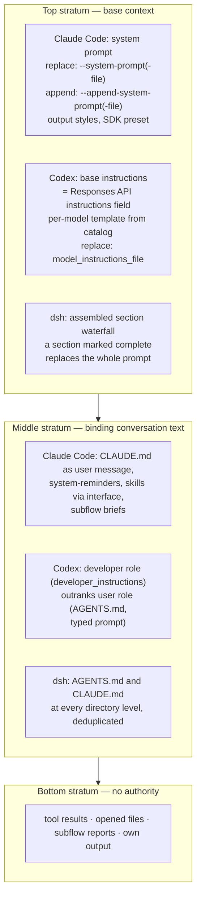
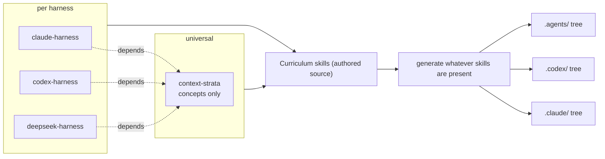
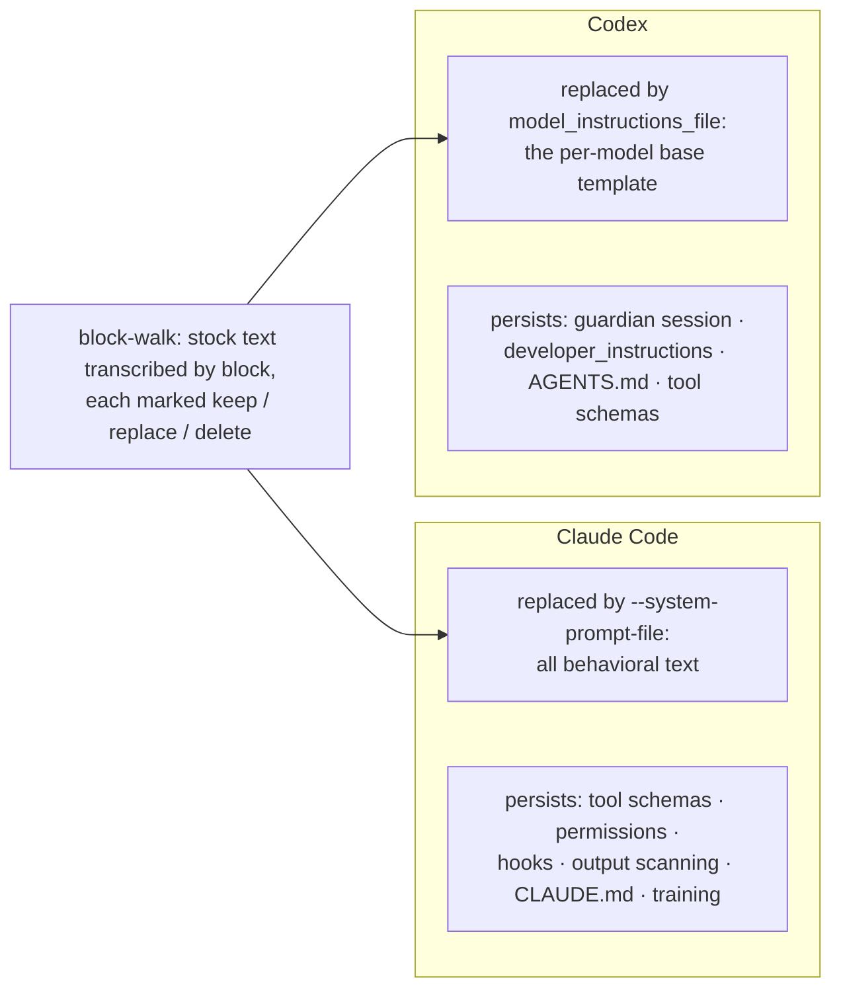
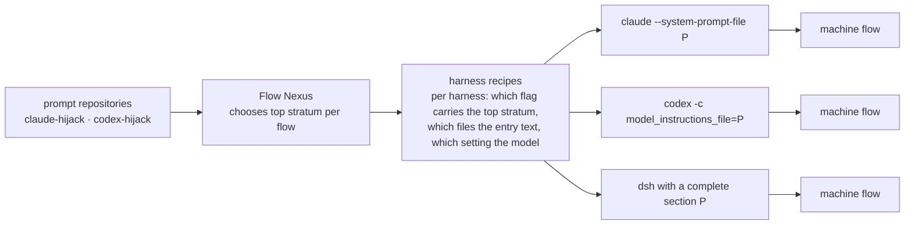
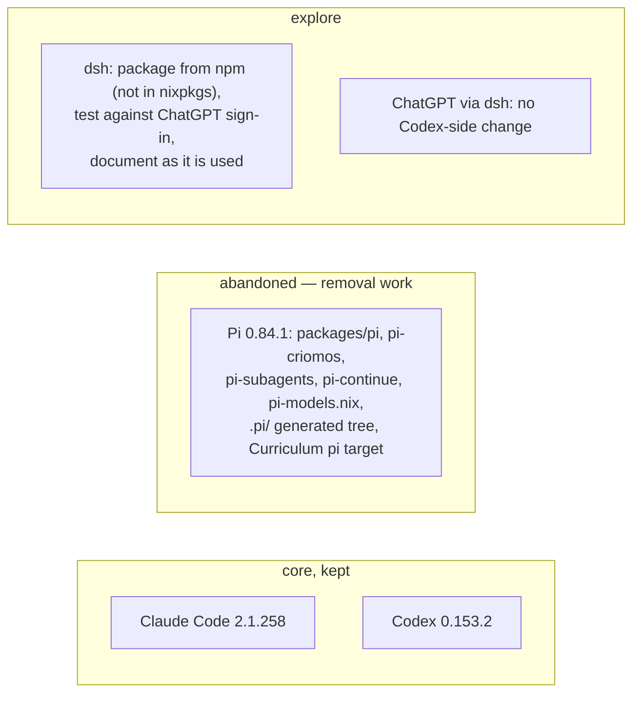
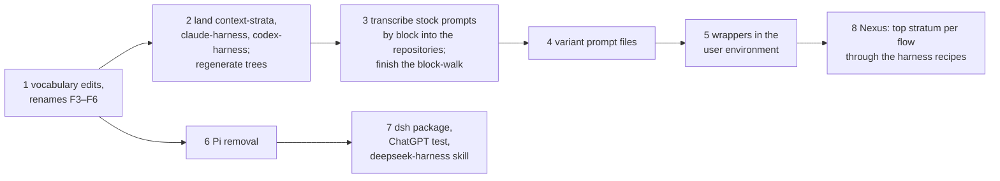

# Harness Anatomy Proposal

Flow 7b4d4c, 2026-09-04. Resumes flow 38dec9, whose last response left four skill drafts and two questions unanswered. Every fact below is tagged: **witnessed** (a subflow of this flow ran or read it), **documented** (official documentation or source, dated in the research reports), or **psyche** (the living's words, quoted). Everything else is this flow's proposal.

## 0. How to read and annotate

Each section ends with its forks, numbered **F1 … F22**. A fork is a decision the psyche has not ruled on. Comment on any line; when done, tell the session you commented and it will read the comments. Markers: ▲ a fact that contradicts what 38dec9 drafted from memory; ✓ already landed, nothing to decide.

## 1. Where 38dec9 stopped, and what the research changed

38dec9 drafted a universal context-strata skill plus three harness skills from memory. Eight things the research found stand against that draft:

1. ▲ **CLAUDE.md is not in Claude Code's system prompt.** It is delivered as a user message after the system prompt (documented). It is middle stratum, not top.
2. ▲ **The living cannot see Claude Code's system prompt through any channel** (documented, witnessed: debug logs, session transcripts, JSON output, verbose mode all omit it). The machine sees it. This is the asymmetry the living asked to make explicit: "no, *you* can see it. I cant."
3. ▲ **Replacing Claude Code's system prompt loses behavioral guidance only.** Tool schemas travel in the API's tools parameter; the permission system, hooks, subagent-output scanning, entry-file injection, and model training persist (documented).
4. ▲ **Codex's base instructions go in the Responses API `instructions` field**, above the whole input array, and the stock text is a per-model template served from OpenAI's model catalog and cached locally (witnessed in source). "We dont care about anything but 5.6" now reads as: the block-walk is per model template.
5. ▲ **Codex does not have four strata.** It has three, with a developer-over-user ranking inside the middle. `developer_instructions` is a developer-role message; AGENTS.md files are user-role messages and cannot override base instructions (witnessed in source).
6. ▲ **Codex's guardian safety layer is a separate model session with its own prompt.** No base-instruction override touches it (witnessed in source).
7. ▲ **The DeepSeek Harness (dsh) is real and specific**: `deepseek-ai/deepseek-harness`, MIT, TypeScript, released 2026-08-13, everything-is-a-plugin on Cordis, config split across settings.yaml, cordis.patch.yml and .credentials.yaml, reads both AGENTS.md and CLAUDE.md, and has a "complete section" escape that replaces the whole prompt (documented). Not in nixpkgs.
8. ▲ **Pi is upstream-active** (v0.84.1, Earendil Works) and **still fully packaged here** (witnessed: packages/pi, pi-criomos, pi-subagents, pi-continue, pi-models.nix in the user environment; the generated .pi tree in primary). Abandoning it is removal work.

Two policy facts: OpenAI shipped "Sign in with ChatGPT" for third-party harnesses and tolerates them without a written policy (documented). Anthropic's terms since 2026-02-20 prohibit subscription tokens in third-party tools, enforced from 2026-04-04 (documented). So dsh can be tested against ChatGPT on the subscription, and against Claude only with an API key.

Local state (witnessed): `claude-hijack`, `codex-hijack`, `harness`, `signal-harness`, `meta-signal-harness`, `persona`, `signal-persona`, `meta-signal-persona`, `persona-spirit` all exist under the repository root as initialized, empty, remote-less git directories. Claude Code 2.1.258 (upstream binary, wrapped) and Codex 0.153.2 (built from source) are packaged in the user environment's `owned-agents/`.

## 2. The three strata, harness by harness

Universal model (psyche, flow 7c3f0c1d onward; context-strata skill): top = base context, middle = the conversation's binding text, bottom = what the flow fetches or says. Where each harness lands its mechanisms:



| | Claude Code | Codex | dsh |
|---|---|---|---|
| Top stratum name | system prompt | base instructions (`instructions` field) | assembled system prompt |
| Whole replacement | `--system-prompt-file` (documented) | `model_instructions_file` (witnessed) | complete section (documented) |
| App-layer text | CLAUDE.md as user message (documented) | `developer_instructions` developer role; AGENTS.md user role (witnessed) | AGENTS.md + CLAUDE.md (documented) |
| Can the living read the top stratum? | No, through no channel (documented, witnessed) | Yes: catalog cache and open source (witnessed) | Yes: open source (documented) |
| Persists outside the prompt | tool schemas, permissions, hooks, output scanning, training | guardian session, tool schemas | not researched |
| Strata | 3 | 3, developer > user inside the middle | 3 (inferred from documentation) |

**F1.** The universal skill keeps the concept of strata only; the placement table above lives in the per-harness skills. Or the universal skill carries the comparison table. Proposal: per-harness only, since "what a given harness puts in each stratum is verified information."

## 3. Vocabulary

Psyche: "The word 'agent' becomes 'machine' if the context allows it. Otherwise, 'thinking machine'." "We don't use the word 'agent,' so let's try and also see where we can edit that." The vocabulary skill already rules "use flow, not agent, except when reproducing an external name or quotation."

Witnessed occurrences of "agent" still standing in primary: 58 editable lines (entry files 19, authored skills 29, distilled Vision 6), three file names, three directory names, one skill name. Outside primary: the user environment's `owned-agents/` directory.

Proposal:

| Place | Proposed |
|---|---|
| 29 lines in authored Curriculum skills | edit to machine / thinking machine / flow by context, regenerate trees |
| 19 lines in entry files | same edit |
| 6 lines in distilled Vision | leave; approved wording changes only on re-approval (**F2**) |
| `NON_MANAGEMENT_AGENTS.md` | rename to `NON_MANAGEMENT_FLOWS.md` (**F3**) |
| `AGENTS.md`, `.agents/`, `.claude/agents/`, `.pi/agents/` | keep: external harness names |
| skill `agent-harness-packaging` | rename to `harness-packaging` (**F4**) |
| user environment `owned-agents/` | rename to `harnesses/` (**F5**) |
| spirit line "An agent is a machine; it does not misbehave." | reword to "A flow is a machine; it does not misbehave." (**F6**, exact wording needs your explicit approval) |

The universal skill's description keeps "LLM" once beside "thinking machine", because the living ruled in flow 7c3f0c1d that LLM should appear so the skill is found (**F7**: keep LLM, or thinking machine alone now).

## 4. The skills



Names follow the living's phrasing, "a Claude harness skill and a Codex harness skill": `claude-harness`, `codex-harness`, `deepseek-harness` (**F8**: or 38dec9's `harness-claude-code`, `harness-codex`, `harness-deepseek`). Every harness skill is generated into every tree, since a flow on one harness composes invocations of another (**F9**: or each only into its own tree).

Drafts obey the skill rules the living has spoken: no "A flow does…" openings, no bullet lines, no paths, positive guidance, nothing added where a line can be replaced. Each draft below replaces its predecessor whole.

### 4.1 `context-strata` (universal remainder, replaces the current skill)

```
---
description: Designing or implementing something that depends on where text enters a thinking machine's (an LLM's) context. Almost never arises in ordinary task work.
dependencies: []
---

A thinking machine's context has three strata; a higher stratum
outranks a lower one. Text meant to bind enters at the middle
stratum or above.

The top stratum is the base context: the standing instructions the
harness sends before any conversation, and any text authored into
that seat. Universal invariants belong here.

The middle stratum is the conversation's binding text: the typed
prompt, the entry files and other injections the harness places
into the conversation, a skill loaded through the skill interface,
a subflow's brief from its main flow.

The bottom stratum is what the flow fetches or says itself: tool
results, files it opens, subflow reports, its own output. It
carries no authority.

Promotion moves text up a stratum; a skill loaded through the
skill interface is promoted from bottom to middle. Harness seizure
is authoring the top stratum ourselves.

The machine reads every stratum, the top included. Which text a
given harness places in which stratum, what its seizure replaces,
what persists outside the strata, and whether the living can read
its top stratum are that harness's skill's to carry, as witnessed
fact.
```

### 4.2 `claude-harness` (new)

```
---
description: Invoking, seizing, or reasoning about the Claude Code harness: its system prompt flags, what they replace, what persists, and where its entry files land.
dependencies: [context-strata]
---

Claude Code's top stratum is the system prompt. The
--system-prompt and --system-prompt-file flags replace the whole
of it; --append-system-prompt and --append-system-prompt-file add
to the end of the stock one; an output style rewrites it, layering
over the coding instructions when it says so; the SDK's system
prompt setting chooses between the minimal default, the Claude
Code preset with an optional append, and a custom text.
--exclude-dynamic-system-prompt-sections moves the per-machine
sections (working directory, environment, git status) out of the
system prompt into the first user message. --bare skips CLAUDE.md
discovery; --safe-mode disables every customization.

Claude Code has three strata. CLAUDE.md and the other entry files
are delivered as a user message after the system prompt, never
inside it: they are middle stratum, as are system-reminder
injections, skills loaded through the skill interface, and subflow
briefs. Tool results and the machine's own output are bottom
stratum.

The machine reads its system prompt; the living cannot, through
any channel the harness offers: debug logs, session transcripts,
JSON output, and verbose mode all omit it. The living witnesses
the stock system prompt only through the machine's transcription
of it.

Replacing the system prompt removes its behavioral guidance and
nothing else. Tool schemas travel in the API's tools parameter and
remain; the permission system, hooks, the scanning of subflow
output, entry-file injection, and the model's training persist
outside the prompt.
```

### 4.3 `codex-harness` (new)

```
---
description: Invoking, seizing, or reasoning about the OpenAI Codex CLI harness: its base instructions, developer instructions, AGENTS.md, and what persists outside them.
dependencies: [context-strata]
---

Codex's top stratum is the base instructions, sent as the
instructions field of the Responses API request, above the whole
input array. The stock text is a per-model template served from
the backend model catalog and cached locally, with a compiled-in
default as fallback. The model_instructions_file config key
replaces the base instructions with a file's text and outranks the
instructions config key, which replaces them with a string; the
source discourages both, and we use the file.

Codex has three strata with a ranking inside the middle: the
developer role outranks the user role within the input array.
developer_instructions is a developer-role message sent beside the
base instructions and never part of them. AGENTS.md files, from
the Codex home and from the repository root down to the working
directory, enter as user-role messages under an AGENTS.md
instructions marker and cannot override base instructions. Tool
results and the machine's own output are bottom stratum.

The living and the machine both read Codex's base instructions:
the model catalog cache and the open source carry the stock text,
and a replacement file is the living's own.

Replacing the base instructions changes only what the main session
is told. The guardian safety layer is a separate model session
with its own prompt, untouched by any base-instruction override.
```

### 4.4 `deepseek-harness` (new, held until dsh is packaged; **F10**)

```
---
description: Invoking, packaging, or reasoning about the DeepSeek Harness, dsh: its plugin composition, its settings files, and how its system prompt is assembled.
dependencies: [context-strata]
---

dsh is an open TypeScript harness in which everything is a plugin
on the Cordis dependency-injection framework. Its configuration is
split: providers and model in settings.yaml, profile overrides in
cordis.patch.yml, keys in .credentials.yaml. Its catalog names
Anthropic, OpenAI, Bedrock, Vertex, and Azure providers, and any
OpenAI-compatible endpoint is addable in settings.

dsh loads both AGENTS.md and CLAUDE.md at every directory level,
with duplicate content kept once.

dsh assembles its system prompt as a waterfall of sections. A
section that declares itself complete replaces the whole prompt
while the waterfall's tools and variables survive: this is the
harness's seizure point.

dsh signs in with a ChatGPT account, which OpenAI tolerates, and
reaches Claude only through an API key, since Anthropic's terms
forbid subscription tokens in third-party tools.
```

**F11.** File names (settings.yaml, CLAUDE.md) and flag names stand in the drafts; the "no paths in skills" rule is read as covering locations, not names.

## 5. Harness seizure: what replacing the top stratum changes

Psyche: "I want to replace claude and codex's system prompts with a version that doesnt incentivize the sort of behavior im constantly steering against." Method already ruled: "just show me the block that you think is most harmful, and well proceed through them like that one by one, marking them for replacement or deletion." Blocks were marked in flows 4ddc321d and ceb3b9fd; the rest of each corpus is unwalked.



Proposal: the stock text of each harness is transcribed by block into its repository (Claude's by the machine, since only the machine reads it; Codex's from the catalog cache, per model), and the block-walk continues there until every block carries a verdict. What persists outside the prompt is documented in the harness skill, not in the repository (**F12**: or in both).

## 6. Wrapper executables

Psyche: "rename the executable of the wrapper something else so that we can still use the stock version … like Claude Light or Claude Unopinionated, or maybe Codec Unsafe if we take all the safety out and stuff, or Codec Bare where we have almost nothing." Precedent: the agent-intercom wrappers under different names (flow 01a048a6), so no gate is needed.

Proposal: each variant is a package in the user environment that wraps the stock binary with the harness's replacement flag pointing at a prompt file from the prompt repository. The stock `claude` and `codex` stay untouched.

| Executable | Wraps | Top stratum |
|---|---|---|
| `claude-light` | `claude --system-prompt-file` | stock minus the blocks marked delete |
| `claude-unopinionated` | same | blocks marked replace applied as well |
| `codex-bare` | `codex -c model_instructions_file=` | only what the machine needs to use the harness's tools |
| `codex-unsafe` | same | bare, with the safety wording also gone |

**F13.** The names are the living's dictated ones; final, or placeholders. **F14.** One ladder (light, unopinionated, bare, unsafe) offered for both harnesses, or the split above as dictated. **F15.** CLI only; the desktop applications stay stock, following the 2026-09-02 retraction of interest in modifying them.

## 7. The prompt repository

Psyche, 2026-08-25: "Perhaps one for each harness; codex-hijack and claude-hijack. … Make the repos public and start with a thorough documentation of their stock context, what each block is tied to, how it can be overriden." Psyche, 2026-09-04: "a separate repository that anyone could use to give modified versions with different names of Claude and Codex, with different takes on system prompts." Both shells exist, empty (witnessed).

Proposal: the two public repositories stand, one per harness. Each holds the transcribed stock text by block with the block-walk verdicts, the mechanism facts mirrored from the harness skill, and the variant prompt files the wrappers consume. The user environment takes them as flake inputs. Nothing Nix lives in them, so anyone can use the prompt files with any wrapper.

**F16.** Two repositories as ruled, or one repository (a name is owed: `top-stratum` is the candidate offered). **F17.** A third repository for dsh variants when dsh is packaged, or dsh variants live in its own settings.

## 8. The invocation system

Psyche: "One of the repositories, either harness or Flow, or maybe both of them are involved somehow, is going to actually create the system call with the right flag to invoke the harness with the right system prompt or the right top stratum." Distilled Vision already stands: "The Flow Nexus sets up and starts a model flow: its working directory, system prompt, training files and instruction prompt." Also: "The top stratum will be programmable per flow."



Proposal: the Nexus composes the call; the per-harness recipe is a library the Nexus depends on, and the empty `harness` repository is its home. The prompt repositories supply the top stratum text; the Nexus picks which one per flow.

**F18.** The recipe library lives in `harness`, or inside the Nexus. **F19.** `persona` (the meta-harness, "slated to orchestrate the entire meta harness") is subsumed by the Nexus, or revived as the layer above it. **F20.** The unit of a top stratum is the flow, or the job a flow is given ("phase" was withdrawn; the concept was not).

## 9. The harness roster



Psyche: "yes, only codex and claude." (2026-08-27). "We should abandon the Pi harness." "Why don't you look into the DeepSeek harness … package it in our environment and start testing out with ChatGPT."

Proposal: the core stays Claude Code and Codex. Pi is removed from the user environment and from the Curriculum's generation targets. dsh is packaged as a node package in the user environment, run against ChatGPT sign-in, and its skill lands when the first flow has used it.

**F21.** dsh enters the core roster on first successful use, or stays an experiment outside "only codex and claude."

## 10. Packaging

Psyche: "declared once, used everywhere." "we dont allow installing software statefully." The harness-packaging skill: "Put durable packages and configuration in the declarative source that owns that environment."

Proposal: variants, dsh, and the Pi removal all land in the user environment's declarative source; the prompt repositories are flake inputs; no installer runs. The directory holding harness packages becomes `harnesses/` (F5).

## 11. Practices already landed ✓

The transcript-landing practice 38dec9 asked about is in the main-flow skill as it stands: "A proposal lives in the conversation, revised there, until the psyche approves a landing. A subflow lands it by reading the approval from the transcript; the main flow does not reprint approved content." The earlier "subflows dont write skills" (flow a60a9e85) concerns authoring; landing approved text is mechanical. No further line proposed.

The presentation pattern this report follows is spoken across four flows: Markdown in the response, a subflow renders scaled SVG figures, comments from the phone, then the session reads them. **F22.** It becomes a line in the design skill, proposed wording: "A proposal the living annotates is printed as Markdown in the response; a subflow renders it as a web report with scaled SVG figures and returns the link." Or it stays practice without a line.

## 12. Distillation candidates

Raw vision accumulating with no distilled `Vision/` topic:

| Subject | Raw entries | Distilled |
|---|---|---|
| Context strata | 74 | none |
| Vocabulary: flow, machine, agent | 52 | none (vocabulary skill governs) |
| Harness seizure and the hijack repositories | 42 | none |
| Skill wording rules | 38 | none |
| Main-flow context economy | 22 | none |
| Flow Nexus | 8 | `Vision/flowNexus.md` |

Context strata is the next distillation proposal, offered after your annotations here.

## 13. Order of realization



Each step is its own flow with your approval of the exact text before any skill or spirit edit.

## 14. All forks

F1 placement table per-harness only · F2 distilled Vision wording left · F3 NON_MANAGEMENT_FLOWS.md · F4 harness-packaging · F5 harnesses/ · F6 spirit line reword · F7 LLM kept in description · F8 skill names · F9 harness skills in every tree · F10 deepseek-harness held until packaged · F11 file and flag names allowed in skills · F12 persistence facts in skill not repository · F13 wrapper names final · F14 one ladder or dictated split · F15 CLI only · F16 two repositories or one · F17 dsh variants home · F18 recipes in `harness` · F19 persona subsumed · F20 top stratum per flow · F21 dsh in core · F22 presentation line in design skill.

## Sources

Flow 7b4d4c reports: psyche-harnesses, psyche-context-strata, psyche-vocabulary, psyche-skill-process, psyche-design-brief, research-claude-code, research-codex, research-other-harnesses, witness-local-harness-state. Flow 38dec9 vision records: agentToMachine, deepsekHarness, harnessVocabulary, invocationSystem, perHarnessSkills, piHarness, skillLandingBySubflow, systemPromptRepository. Distilled Vision: flowNexus, distillation. The spirit, vocabulary, main-flow, context-strata, and agent-harness-packaging skills as loaded or witnessed.
