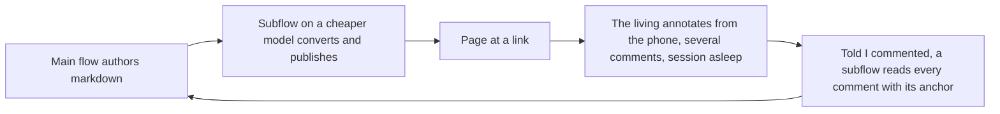

# Codex Report Loop

The living, 2026-09-05, STT: "developing a similar workflow to use with Codex, so that Codex could also use the same protocol. It creates a Markdown file, and a sub-agent creates a web report that I could actually annotate. The Codex agent could then read the annotations that I made to the report and do all of the research you need to do to find out what the best solution is for that."

The contract, typed in flow 01a052b6: "I want to be able to put comments from my phone. Essentially, I'm remote accessing Codex, which is running on my machine here, and then Codex would create a visual report. There would be a link I could open on my phone where I could actually put in all the comments one by one. I would be able to put in comments without triggering the session every time I put a comment. I could potentially put multiple comments and then go back to the session and tell it that I commented on the report. It would be able to see all the comments and what they refer to. Now I'm describing the flow that I have developed with Claude, and that's the kind of flow I'm looking to get with Codex."

## The loop

Four moves, the same on both harnesses.

1. The main flow authors the report as markdown.
2. A subflow on a cheaper model converts it to a page and publishes it at a link.
3. The living opens the link on the phone and leaves several comments, each anchored to a part of the page, without waking the session.
4. Told "I commented", the flow reads every comment with what it anchors to, and the comments enter the psyche records as the living's typed word.

On Claude Code, moves 2 and 4 are the Artifact tool: publish, and the `comments` action, which returns each thread with what it refers to. On Codex, move 1 and the spawning half of move 2 exist today; the page and the comments do not.

## What Codex has today

Witnessed on this machine on 2026-09-05 unless marked relayed.

- Codex CLI 0.153.2. Main model gpt-5.6-sol; default subagent model gpt-5.6-luna; a `worker` agent on gpt-5.6-terra at reasoning high. Three agent definitions (default, explorer, worker) in ~/.codex/agents, symlinked from the Home Manager store.
- Subagents: `multi_agent = true`; the tools spawn_agent, send_input, resume_agent, wait_agent, close_agent; an agent definition is a TOML file with name, description, developer_instructions, and optional model and reasoning effort; a spawn-time model overrides the default subagent model (relayed: learn.chatgpt.com, subagents and config-reference pages). "Terra" in the 01a0428b record is gpt-5.6-terra; the living ruled it for the report writing only.
- Skills: SKILL.md directories in .codex/skills, ~/.codex/skills, and .agents/skills (relayed: developers.openai.com/codex/skills.md). Here the Curriculum generates the trees; ~/.codex/AGENTS.md is empty; no user skill sits under ~/.codex/skills beyond .system.
- The Sites plugin (`sites@openai-bundled`) is enabled, beside documents, presentations, visualize, browser, and chrome. On 2026-08-27 flow 01a04236 deployed one report through it to https://codex-reports-hub.ligoldragon.chatgpt.site: version 1, owner-only, one hardcoded page. Flow 01a030df recommended disabling the sites-building and sites-hosting skills as "authority, installation, and platform-shaping skills" that "bypass authored Curriculum/manifests"; not enacted.
- A web claim, contradicted: pages fetched 2026-09-05 say Codex Sites is desktop-app-only, workspace-scoped, with no CLI path and no external link. The 01a04236 transcript shows a CLI flow deploying. The local witness stands. Whether the hub opens on the phone without the workspace login is unverified.
- Codex Annotations (relayed): an in-place editing primitive, select a region and ask Codex to revise it. No comment store, no read-back.
- Remote: codex-remote-control.service runs `codex app-server --remote-control` on a unix socket, and the TUI attaches only to it. That is the living's remote path to Codex. claude-remote-control.service runs beside it.
- agent-intercom 0.10.0 is packaged for both harnesses: codex-intercom-mcp, claude-intercom-mcp, cci, coi, codex-intercom-bridge. coi runs. cci fails to start ("Claude intercom MCP server is missing"). The bridge needs the app-server.
- No static web server, reverse proxy, or page host is declared in CriomOS or CriomOS-home. Tailscale is installed and logged out on this machine.
- Headless Claude Code 2.1.258 (`claude -p`) has no Artifact tool: probed on 2026-09-05, 39 tools listed, Artifact absent; `--bare` refuses OAuth. A Codex flow cannot publish or read a Claude artifact through a print-mode Claude call.

## What the Codex flows tried

- 01a04236, 2026-08-27, STT: "Problem: I can't see this remotely. Is there a plugin or something to allow you to publish those on a server the way Claude puts reports on claude.ai?" Then: "Yes use the hub". The hub deployed. Left open: navigation across reports, updates and versions, slug collisions, rollback, whether owner-only is the default.
- 01a0428b, 2026-08-27, STT: "Why didn't you make the web report as I asked?" And: "Check a recent codex session for the web reporting procedure which we'll put in a codex only skill". A Luna subflow recovered the procedure into reports/codexWebReportingProcedureRecovery.md with a proposed Codex-only skill anatomy: report schema, navigation, version flow, post-deployment QA, URL reuse, rollback, ACL. Never authored.
- 01a052b6, 2026-08-30 to 09-01, STT: "the vocabulary proposal is approved. claude artifacts can be commented, and then the flow that produced it can see the comments. what is openai's response to that?" The flow found no OpenAI surface meeting the contract and named Pastel (a Codex MCP), MarkUp.io, and a thin annotation layer on the Sites hub as candidates; none proved against the owner-only login. The living, typed: "is there a stack that incorporates the concept of annotations in code instead of using haywire on web using visuals and html tags to pretend to be doing structured markup? A proper idea-editing framework, in other words."
- 5c8be3ca, 2026-08-21, Claude, typed: "lets create a file for external edits. annotations.md?"

## The page: where Codex could publish

| Surface | Exists here | Phone | Link outside the workspace | Standing it up |
|---|---|---|---|---|
| The Sites hub (chatgpt.site) | yes, one report | unverified | unverified; the web claim says no | reuse; navigation and versions to design |
| GitHub: the markdown in a pull request, or Pages | gh available | GitHub app | yes, behind the repository's access | none |
| A static page over the tailnet | no | browser | tailnet only | a Nix service, a tailscale login |
| A Claude artifact | on Claude only | yes | private, claude.ai login | a live interactive Claude session; no headless path |

## The comments: where the living could annotate, and how the flow reads back

Relayed from the products' pages fetched 2026-09-05 unless marked witnessed.

| Option | Anchor | Phone | Read-back | Needs |
|---|---|---|---|---|
| Pull request review on the report file | line | GitHub app | `gh api` on the pull request's comments: path, line, diff hunk, body | a branch and a pull request per report |
| Hypothesis | text selection (XPath, position, quote) | via.hypothes.is, no native app | REST search by URI, selectors returned | a reachable page, an API key |
| Google Docs | text selection | Docs app | Drive API comments with the quoted text | Google OAuth for Drive |
| Inline comments in the markdown over git | exact, inline | a git editor app | git diff | a convention; no rendered page |
| giscus (GitHub Discussions) on a static page | page | browser, GitHub login | gh api | a static host |
| Remark42 on a tailnet page | page | browser | REST | a Nix package, a host, the tailnet |
| Claude artifact comments | element or selection | yes | Artifact `comments` (witnessed on Claude) | a live Claude session to publish and to read |
| Pastel, MarkUp.io (from 01a052b6) | unverified | unverified | unverified | proof against the Sites login |

## The loop as it would run on Codex

1. The main Codex flow authors the report as markdown in the brief to a `worker` subagent (gpt-5.6-terra), per the 01a0428b ruling.
2. The worker saves reports/<subject>.md under the flow directory, converts, publishes to the chosen surface, commits, and returns the link.
3. The living annotates from the phone on the chosen surface.
4. Told "I commented", the main flow spawns a subagent that reads the comments with their anchors and returns them verbatim; the flow logs them as psyche, typed, with the anchor as context.
5. The skill: one shared reporting skill carries the four moves; a `` section carries the Codex surface once chosen; the worker's TOML definition carries the converter's model. Today the Codex section can only say that the surface is not chosen and the markdown is the deliverable.

## Forks

1. The page surface: the existing Sites hub; GitHub; a static page over the tailnet; or a live Claude session publishing on Codex's behalf.
2. The comment surface: the same product as the page (GitHub, Google Docs, a Claude artifact) or an overlay on any page (Hypothesis, giscus, Remark42).
3. The anchor: a line, an element, or a text selection. A Claude artifact anchors to an element or a selection; a pull request review to a line; Hypothesis to a selection.
4. Whether Pastel or MarkUp.io, named in 01a052b6, are proved against the owner-only Sites login before anything is built.
5. Whether the "idea-editing framework" asked for in 01a052b6 supersedes page annotation on Codex, in which case the page is a projection and a comment is an edit to a structure.
6. Whether the 01a030df recommendation to disable the sites skills stands, which removes the hub.

## Unknown

- Whether the Sites hub opens on the phone outside the workspace login.
- Whether a `claude --bg` session carries the Artifact tool, and whether intercom can carry a publish request from Codex to a live Claude session once cci builds.
- The documents plugin's reach: whether it publishes a document to a URL with comments.
- Where the Sites annotation layer's design from 01a052b6 is written, if anywhere.

## Sources

- flows/7fba5f/vision/reporting.md; flows/7fba5f/log.md (the subflow returns of 2026-09-05).
- flows/01a052b6/vision/reportFeedback.md, vision/ideaEditing.md, log.md; Codex transcript 01a052b6-b91c-72b2-a8e6-09f21cab3078, lines 9, 510, 679, 867.
- flows/01a04236/log.md; Codex transcript 01a04236-2355-7d20-94aa-e3b814a52b32, lines 368, 462, 495.
- flows/01a0428b/reports/codexWebReportingProcedureRecovery.md, vision/codexOnlySkill.md, vision/useASubflowToPutTheReportTogether.md; Codex transcript 01a0428b-fc0e-7200-904e-2e2991e5425f, lines 9, 311, 334, 389.
- flows/01a030df/reports/openaiSkillsReview.md; flows/01a04e75/log.md; flows/5c8be3ca/vision/flowArtifacts.md; flows/38dec9/vision/perHarnessSkills.md; flows/7b4d4c/reports/research-codex.md.
- ~/.codex/config.toml; ~/.codex/agents/default.toml, explorer.toml, worker.toml; CriomOS-home packages/agent-intercom and owned-agents/codex/tui.nix; the systemd units codex-remote-control and claude-remote-control. Witnessed by the research subflow.
- The probe: claude 2.1.258 `--help` and three `claude -p` runs; outputs in this flow's scratchpad. Witnessed by the probe subflow.
- Web, fetched 2026-09-05, relayed: learn.chatgpt.com/docs/agent-configuration/subagents; learn.chatgpt.com/docs/config-file/config-reference; developers.openai.com/codex/skills.md; display.dev/blog/share-codex-artifacts-externally; codex.danielvaughan.com, 2026-06-03 and 2026-03-27; giscus.app; remark42.com; hypothes.is; code.claude.com/docs/en/headless; github.com/agynio/gh-pr-review.
