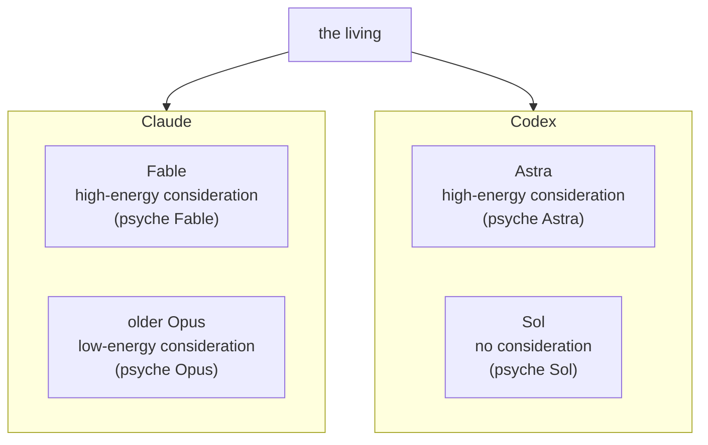
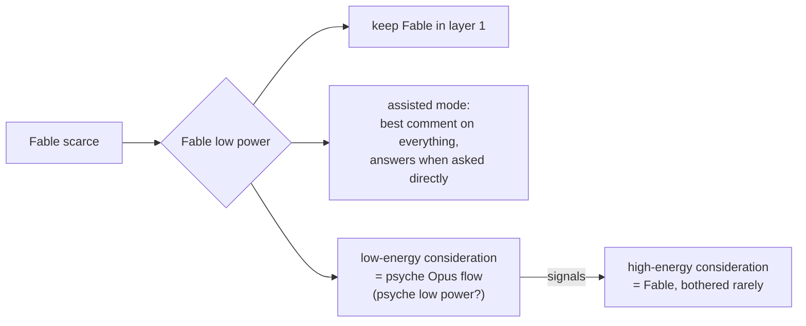
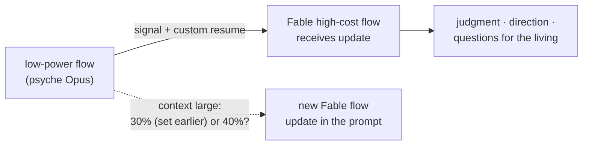
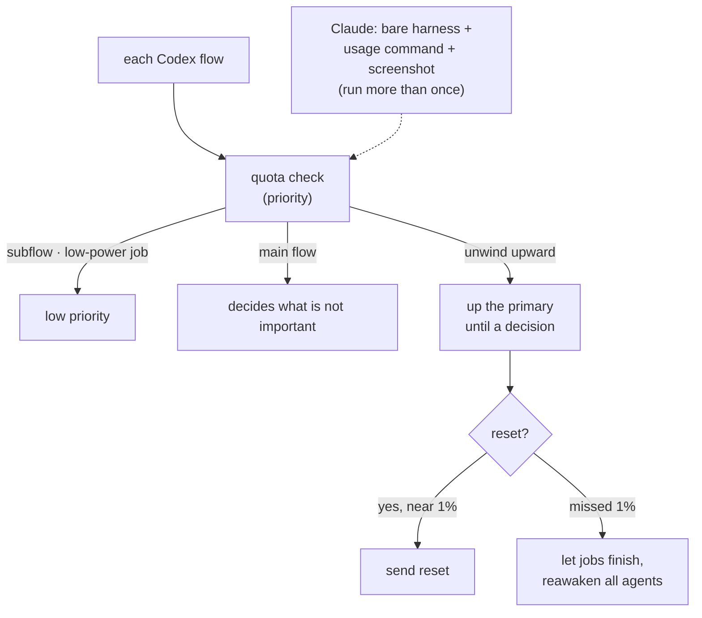
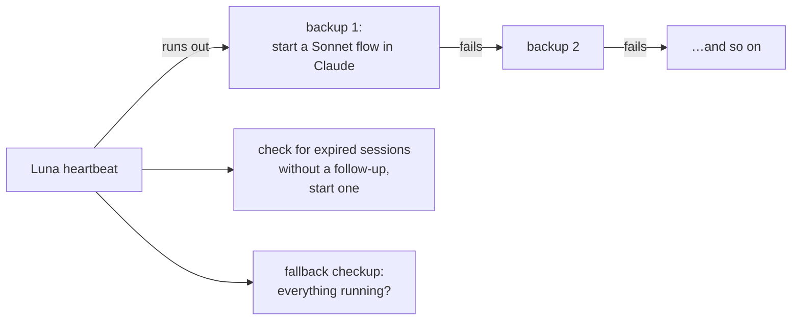
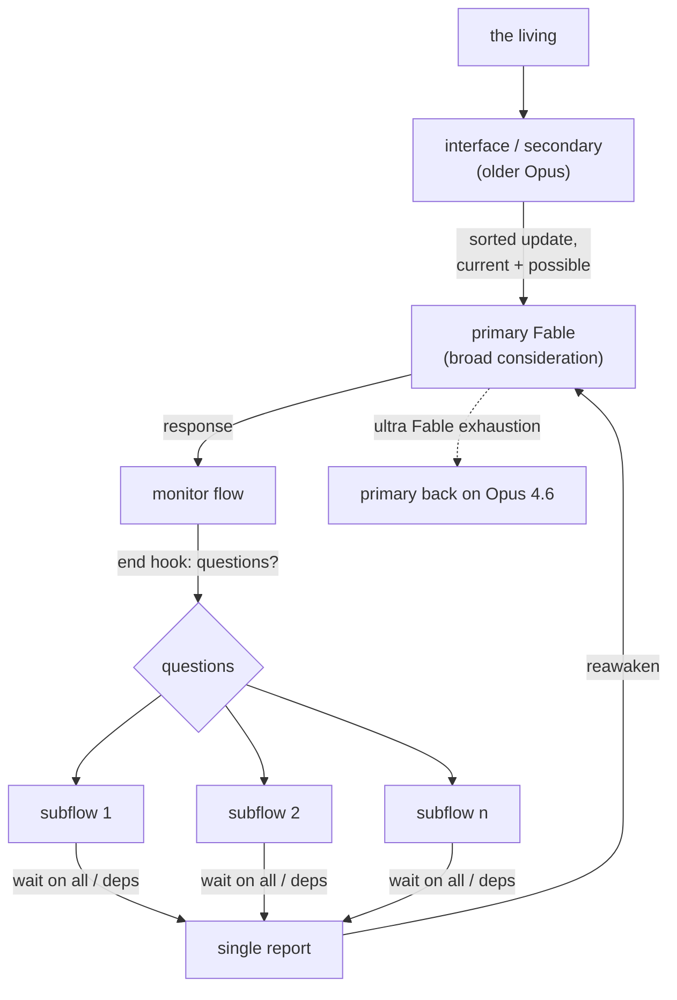
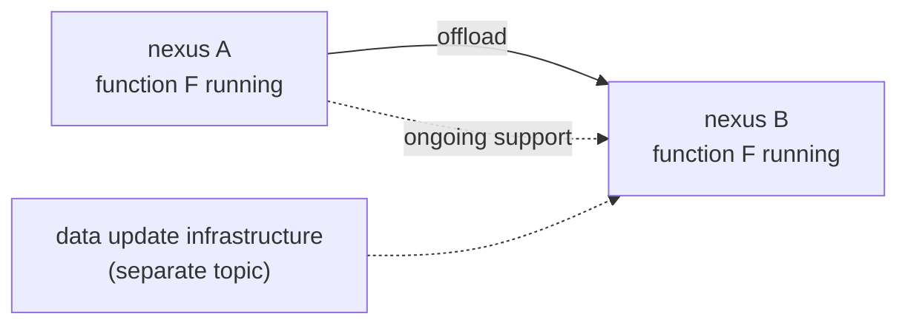

# Cluster Power Modes

*An idea book. One idea per section. The charts are the flow of the idea. Nothing here stands until the living rules on it.*

---

## 1 · One cluster, several power modes

The cluster is one mind that can be tuned by power consumption. The models are per harness. A configuration picks, per harness, which model is primary and which backs it as the low-power consideration flow. The psyche primaries are three: psyche Astra on Codex, psyche Fable on Claude, psyche Opus (the older Opus) on Claude. On the Claude side Fable is the high-energy consideration and the older Opus the low-energy one; on the Codex side Astra is the high-energy consideration and Sol the no-consideration end, giving psyche Astra and psyche Sol. A model put into lower usage mode is used less across the whole cluster.

---

## 2 · Fable low power: keep him in layer 1, or put him in assisted mode

When Fable becomes scarce, the cluster enters Fable low power mode. Fable stays in layer 1, or is put into assisted mode where he gives his best comment on everything and answers only when asked directly. The low-energy consideration flow — a psyche Opus flow, tentatively named *psyche low power* — carries the day's thinking; Fable stays the high-energy consideration and is bothered as little as possible. (The name "psyche low power" is the living's word, offered rather than fixed; it is put back to the living.)

---

## 3 · Refresh: the low-power flow feeds the high-cost flow

The low-power thinking flow watches the work. When a refresh is due, it does not wake Fable to write it. It composes a custom, contextualized resume — an update on everything — and hands it to the Fable high-cost flow, which receives that as its message and does not need to be run many times to catch up. Where the context is already large — the living said thirty or forty percent, and set thirty percent earlier the same day as the Fable refresh point — the whole thing starts on a new flow with the update carried in the prompt. (The 30/40 ambiguity is left visible for the living.)

---

## 4 · Quota: reset near one percent, priorities decide

Every Codex flow enters a quota check, each with a priority: a subflow low, a low-power job that might take too long declares it, the main flow decides on what is not important. Otherwise the state unwinds upward, a final response sent, as far up the primary as needed until a decision is made and a reset sent or something else done. If Fable gets scarce by itself, the usage is read out of Claude by starting a bare harness, entering the usage command and capturing the screen — more than once, since the first run is glitchy. The same is to be made to work with Codex. Missing the Codex reset at one percent is acceptable: jobs are let finish and all agents are reawakened after.

---

## 5 · Heartbeat: a stack of backups

There is not one heartbeat but a few. The heartbeat watches for sessions that expired without a follow-up and tries to start one; it is the fallback checkup that everything is running; it runs in the core layer, reawakens under simple hard limits, and because it is the core, what it asks for is just done. If Luna runs out the heartbeat cannot run, so it needs a backup that starts a Sonnet flow in Claude instead, and another backup behind that, and so on.

---

## 6 · Layers refined: the interface flow and Fable's autopilot

The living's evening words refine the four layers without replacing them. A model in front of Fable interfaces with the psyche and makes Fable efficient; the secondary, on the older Opus, gathers a few messages from the living into an update, sorts what is current and possible, and passes work off, so Fable receives the bulk of the psyche presented well and only renders judgment, direction, or questions. Fable's responses launch subflows without Fable concerning itself how: a flow monitors what he says, a hook when he ends checks for questions, the questions launch subflows wired to have their output reconsidered — waiting on all or on dependencies — and one report from all of them reawakens the master consideration model, primary Fable. On ultra Fable exhaustion, the primary can go back on Opus 4.6 too.

---

## 7 · Nexus anatomy is fluid; a function can be offloaded while it still runs

Functionality may be put into a nexus and later moved into another once the best anatomy and where the data is kept are figured out. A function is offloaded to a new nexus while it still runs on the first — ongoing support. The data update infrastructure needed for that is a separate topic. This bears on power modes because moving heartbeat, quota accounting or the interface flow between nexuses is expected, not exceptional.

---

# Appendix · Candidate statements

*Every statement is a candidate. Each waits on the living's explicit approval. A statement carries what was said and nothing beyond it; a small ruling makes a small statement. Where ideas overlap or refine each other, the more recent entry supersedes on the same subject. The living's evening words of 2026-09-16 on Fable low power and on the older-Opus interface flow refine the layers rather than supersede any earlier ruling.*

Counts: 6 topics, 15 proposed statements, 3 impurities dissected out, 7 items left out as question or working instruction, 3 supersessions or refinements named.

## Topic: psycheFlows

Destination: `Vision/psycheFlows.md` (new).

### An adaptable configuration by power consumption

The cluster is configured, per period, by power consumption, and the models are per harness. The psyche primaries are psyche Astra (Codex), psyche Fable (Claude) and psyche Opus (Claude, the older Opus). On the Claude side Fable is the high-energy consideration and the older Opus the low-energy one; on the Codex side Astra is the high-energy consideration and Sol the no-consideration end, giving psyche Astra and psyche Sol.

Provenance: flow b49251, `vision/psycheFlows.md`, first and third entries, 2026-09-16.

### Fable low power keeps him in layer 1 or in assisted mode

In Fable low power mode, Fable stays in layer 1 or is put in assisted mode, where he gives his best comment on everything and answers only when asked directly. The low-energy consideration flow is a psyche Opus flow; the living offered *psyche low power* as its name. Fable remains the high-energy consideration.

Provenance: flow b49251, `vision/psycheFlows.md`, first entry, 2026-09-16.

Ambiguity for the living: is *psyche low power* the intended name of the low-energy consideration flow, or a passing description? A ruling on the name is asked.

### A model in lower usage mode is used less

When one of the models is put into lower usage mode, the cluster tries to use it less.

Provenance: flow b49251, `vision/psycheFlows.md`, first entry, 2026-09-16.

### A variable number of flows on a cluster

A cluster runs a variable number of flows, and the mix changes by power consumption.

Provenance: flow b49251, `vision/psycheFlows.md`, second entry, 2026-09-16.

Ambiguity for the living: *Sol 5.6* appears in `flows/f55ec8/vision/layers.md` the same day and may name the Luna model (gpt-5.6-luna) already used for wake-checks. No model id is fixed here for Sol or Astra; the living rules.

## Topic: layers

Destination: `Vision/layers.md` (already the subject of the f55ec8 idea book; these entries refine it).

### An interface flow in front of Fable

A model in front of Fable interfaces with the psyche and makes Fable efficient. The secondary, on the older Opus, gathers a few messages from the living into an update, sorts what is current and possible, and passes work off, so Fable is presented the bulk of the psyche well and renders judgment, direction, or questions for the psyche.

Provenance: flow f55ec8, `vision/layers.md`, fourth entry (evening), 2026-09-16.

Refinement (not supersession): refines the four-layer statements in flow efa157, `vision/layers.md` and flow f55ec8, `vision/layers.md` (afternoon), same day.

### Fable's responses launch subflows without Fable's concern

Fable's responses launch subflows without Fable concerning himself how. A flow monitors what he says; a hook when that flow ends checks for questions; the questions launch subflows wired to have their output reconsidered, waiting on all of them or on their dependencies; one report from all of them reawakens the master consideration model, primary Fable.

Provenance: flow f55ec8, `vision/layers.md`, fourth entry, 2026-09-16.

### On ultra Fable exhaustion, primary goes back on Opus 4.6

On ultra Fable exhaustion, the primary can run on Opus 4.6.

Provenance: flow f55ec8, `vision/layers.md`, fourth entry, 2026-09-16.

Reuse from the f55ec8 distillation proposal (still holds): *"The primary layer is the development, design and thinking space; the secondary layer is deployment"* and *"The secondary deploys what is well understood"*, both provenance flow efa157, `vision/layers.md`, 2026-09-16.

## Topic: modelRoles

Destination: `Vision/modelRoles.md` (new).

Reuse from the f55ec8 distillation proposal (still holds):

- *"The older Opus is the wiser one; the newer Opus is faster and blinder but good at getting stuff done. The older Opus is used for consideration, qualitative audits such as comparing vision, and the thinking of a Fable or old-Opus session flow. All thinking, design and psyche interaction is on the older Opus or the newest Fable."* — flow f55ec8, `vision/modelRoles.md`, first entry, 2026-09-16.
- *"The main flow of the lower layer is the older Opus; on the Codex side the latest Sol, and at the higher layer Astra."* — flow f55ec8, `vision/modelRoles.md`, second entry, 2026-09-16.
- *"Astra belongs on the thinking, design, psyche interaction side with Fable and the older Opus, with a Martian personality: it commits easily and moves fast, sometimes recklessly, and its work is looked at after. Each model has several roles."* — flow f55ec8, `vision/modelRoles.md`, third entry, 2026-09-16.
- *"When the quota allows, Astra may set Opus agents to creative coding."* — same source.

Ambiguity for the living: no model id is attached to Sol or Astra. The Opus 4.6-or-4.7 choice for the lower layers was delegated to the flow in `vision/layers.md` and is not decided here.

## Topic: quota

Destination: `Vision/quota.md` (new).

### The reset is triggered near one percent by a priority-ordered quota check

Every Codex flow enters a quota check with a priority. A subflow is low priority; a low-power job that might take too long for the quota left declares that. The main flow decides on what is not important; otherwise the state unwinds upward, a final response sent, as far up the primary as needed until a decision is made — a reset sent or something else.

Provenance: flow f55ec8, `vision/quota.md`, first entry, 2026-09-16.

### Quota accounting lives in the Codex bridge component

The quota accounting and the decision-to-trigger point live in the Codex bridge component. The bridge mirrors the interface of the Codex server here, subscription included; an interface for changing the subscription, or logging in with another account, comes later.

Provenance: flow f55ec8, `vision/quota.md`, second and third entries, 2026-09-16.

### Getting the Claude usage out through a bare harness

When Fable becomes scarce on its own, the usage is read from Claude by starting a harness with no command, entering the usage command and capturing the screen. The first run is glitchy, so it is run more than once. The same is to work for Codex.

Provenance: flow b49251, `vision/quota.md`, 2026-09-16.

### Missing the Codex reset at one percent is fine

If the Codex reset at one percent is missed, the jobs are let finish and all agents are reawakened after.

Provenance: flow b49251, `vision/quota.md`, 2026-09-16.

Reuse from the f55ec8 distillation proposal (still holds): *"Reset mode: a trigger runs a reset, set to use-reset mode or not; in use-reset mode with a reset available, work goes as fast as it wants; whoever governs quota knows when the reset expires so the burn plan lines up; a reset is used at least two days before the week expires."* — flow efa157, `vision/quota.md`, 2026-09-16.

## Topic: heartbeat

Destination: `Vision/heartbeat.md` (new).

### The heartbeat is the core layer's fallback checkup

The heartbeat check watches for sessions that expired without a follow-up and tries to start one; it is the fallback checkup that everything is running. It runs in the core layer, reawakens under simple hard limits and constraints, may do a few things when conditions are met, and because it is the core, what it asks for is just done.

Provenance: flow f55ec8, `vision/heartbeat.md`, 2026-09-16.

### A stack of heartbeat backups

There are several heartbeats. If Luna runs out, the heartbeat cannot run, so it needs a backup that starts a Sonnet flow in Claude instead, and another backup behind that, and so on.

Provenance: flow b49251, `vision/heartbeat.md`, 2026-09-16.

Reuse from the f55ec8 distillation proposal (still holds): *"A flow watches available quota and wakes the primary when it can refresh."* and *"The wake check decides whether something major happened that was not propagated, and propagates it to the recipients most likely to need it."* — flow efa157, `vision/heartbeat.md`, 2026-09-16.

## Topic: flowRefresh

Destination: `Vision/flowRefresh.md` (new).

### A Fable main flow refreshes at thirty percent of its context

A Fable main flow starts a refresh when it reaches thirty percent of its context, three hundred thousand tokens. The main flow's context is used wisely so the refresh is easy to output. The refresh is a simple command; a subflow puts the refresh together with the system prompt in place, and the system prompt is upgraded to match current vision.

Provenance: flow f55ec8, `vision/flowRefresh.md`, 2026-09-16.

### A low-power flow refreshes the high-cost flow

The low-power thinking flow signals the high-cost flow with a custom, contextualized resume — an update on everything — so the high-cost flow need not run many times. Where the context is already large, the whole thing starts on a new flow with the update carried in the prompt.

Provenance: flow b49251, `vision/psycheFlows.md`, second entry, 2026-09-16.

Ambiguity for the living: the living said *thirty or forty percent* here and *thirty percent* in the same day's `flows/f55ec8/vision/flowRefresh.md`. Whether the refresh point is thirty, is thirty for a fresh Fable and forty for the low-power case, or is a range, is put to the living.

Refinement (not supersession): refines the thirty-percent statement above by allowing a large-context path that starts a new flow rather than composing an in-place refresh.

## Impurities dissected out

1. `flows/b49251/vision/psycheFlows.md`, second entry: *"I should get on a vision distillation with a low-effort Opus flow that you would run on primary"* — a working instruction, already recorded in `log.md`.
2. `flows/b49251/vision/quota.md`: *"Look into that and see if you can make it work with Codex. Let's make sure."* — a working instruction, already recorded in `log.md`.
3. `flows/f55ec8/vision/layers.md`, fourth entry: *"you advise me to do that"* / *"Is that a bad way to do it?"* — a question to the flow, answered in the reply.

## Left out as question, not vision

1. `flows/b49251/vision/psycheFlows.md`: whether *psyche low power* is the intended name of the low-energy consideration flow.
2. `flows/b49251/vision/quota.md`: whether Herder does screen capture, and which multiplexer is used — asked of the flow.
3. `flows/b49251/vision/heartbeat.md`: the closing questions about which component carries the heartbeat and whether Flow does it now — answered in the reply.
4. `flows/b49251/vision/nexusAnatomy.md`: the whole entry sets a general principle (see the note below) — proposed as a candidate for its own topic rather than under power modes, and put to the living.
5. `flows/f55ec8/vision/modelRoles.md`, third entry: the open-source-model candidates K3, Motif, Laguna Medium — the living's own questions.
6. `flows/f55ec8/vision/layers.md`, second entry: *"Opus 4.7 … or 4.6, 1 million. Whatever one you pick"* — a delegated choice, not a ruling.
7. `flows/efa157/vision/quota.md`: how a reset is used, which credit goes first, whether it is automatic — the living's questions to the flow.

## Supersessions and refinements

1. **Refinement (not supersession):** the evening entries in `flows/f55ec8/vision/layers.md` (the interface flow in front of Fable; Fable's responses launching subflows; ultra Fable exhaustion) refine, without replacing, the four-layer entries in `flows/efa157/vision/layers.md` and the afternoon entries of `flows/f55ec8/vision/layers.md`, all 2026-09-16.
2. **Refinement (not supersession):** the second entry of `flows/b49251/vision/psycheFlows.md` (30 or 40 percent; start on a new flow when context is large) refines `flows/f55ec8/vision/flowRefresh.md` (30 percent, subflow composes the refresh), same day.
3. **Reuse:** the f55ec8 distillation proposal's statements on model roles, quota reset mode, heartbeat quota shape and wake-check propagation are carried into this proposal unchanged. Nothing here supersedes them.

## Note on nexus anatomy

The entry in `flows/b49251/vision/nexusAnatomy.md` — that functionality may be put into a nexus and later moved into another, a function offloaded while still running, the data update infrastructure being a separate topic — is proposed as a candidate for a `Vision/nexusAnatomy.md` topic of its own. It is included in the idea book because power modes depend on being able to move heartbeat, quota accounting and the interface flow between nexuses without breaking anything, but its natural topic is nexus anatomy, not power modes. The living rules on the topic assignment.