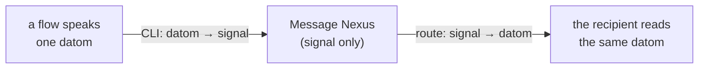
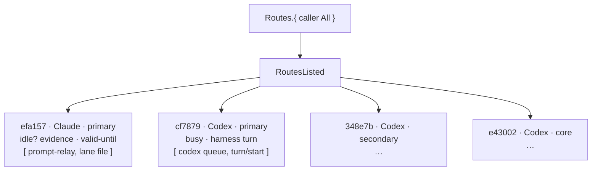
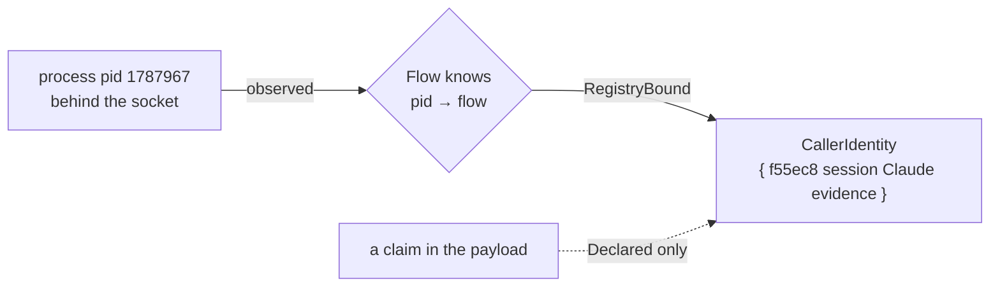
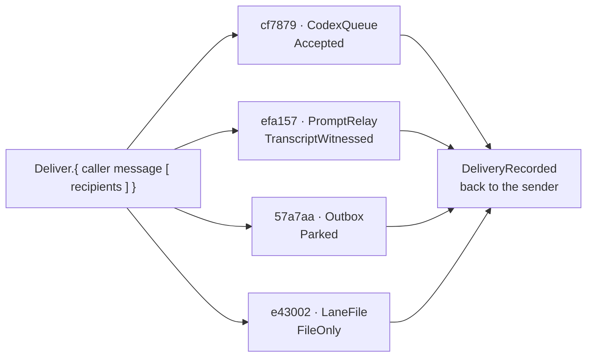
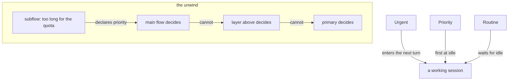
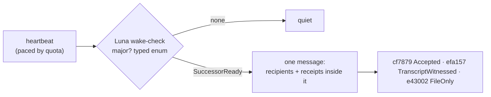
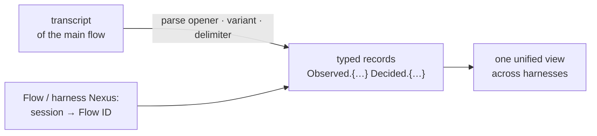
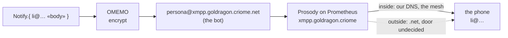
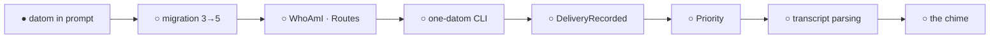

# The Messaging, as it will be

*An idea book that is also the spec. Every picture is the flow of one idea. Where a thing exists today it is marked ●, where it half exists ◐, where it does not ○. Source: the living's words in flows/efa157/vision (messages, transcriptReporting, callerIdentity, heartbeat, domains) and flows/f55ec8/vision (networking, cloud, quota, layers); Vision/nexus.md and signal.md; cf7879's order 10A anatomy; the receipts named in reports/messagingBrief.md.*

---

## 1 · A message is a typed thing, and the typed thing is what you read

A flow never sends prose in an envelope. It sends one datom, a typed value, and that datom, exactly, is what the recipient sees in its prompt: `Peer.{ … }` or `Relay.{ … }`, never a JSON header. The Nexus in the middle never sees text at all: the CLI turns the datom into signal, the Nexus thinks in signal, and the CLI on the far side turns it back into the same datom. ● Proven: four Codex sessions and one Claude session have received a bare datom head today.

---

## 2 · Every flow is a node; the CLI can show the graph

The cluster is a graph and each flow is a node in it: its harness (Claude or Codex), its session, its role (primary, secondary, core, successor), and how it looked when last observed: idle, busy, waiting for approval, unknown, concluded — with the evidence that saw it and the moment that observation goes stale. One query, `Routes`, lists the nodes and the routes to each. ○ Today routes come from a hand-written file; nothing lists them live.

---

## 3 · Who is talking: identity seen at the socket, not claimed in the payload

Three identities ride in one delivery and never blur: the **caller** (the flow invoking the CLI now), the **source** (whose transcript holds the original words; a relay never becomes the author), and the **recipient**. The caller is not believed on its say-so: the Nexus can see the process behind the socket, and Flow knows which process belongs to which flow. That check is a standard, optional part of the signal library, so any client knows to say whether it carries its process id. The evidence has grades: Declared, ProcessSessionObserved, RegistryBound; no grade is upgraded because strings agree. ○ Today everything is Declared. Open: whether Flow, a harness Nexus, or Message answers `WhoAmI` — one owner only, and the living has not chosen.

---

## 4 · A delivery is proven by receipts, and the receipts are words

Delivery is not a boolean. Each recipient gets a receipt of a graded kind: **Accepted** (a transport took it), **TranscriptWitnessed** (the exact datom sits in the recipient's transcript: the only proof that counts), **Parked** (a durable outbox row, because the recipient was busy), **FileOnly** (a report was written; nobody is known to have read it), **Pending** (busy, approval-wait, stale observation, unknown route). The sender gets them back typed: `DeliveryRecorded.{ source [ receipts ] }`, and can ask again later. ◐ The receipts exist as practice, assembled by hand into reports; the typed reply does not exist.

---

## 5 · Priority: what may interrupt, and what climbs

A message carries a priority head: **Routine** waits for idle; **Priority** goes first when idle comes; **Urgent** may enter a working session's next turn — and says, without alarm, what to keep running and what to start. The same word does the second job the living gave it: when a flow meets a limit (quota short, a low-power job too long), it declares its priority; what it cannot decide unwinds upward — subflow to main, main to the layer above — until a layer decides, and the answer comes back down. ○ Neither the head nor the unwind exists; the live gate today refuses anything not "uniquely witnessed idle".

---

## 6 · Something happened and nobody was told: the wake-check writes the message

A heartbeat, paced by the quota left, wakes a small read-only Luna check. It reads the lane tips, the peer reports and the last words of the living, and asks one typed question: did something major happen that was not propagated: a promotion to main, an activation, a failure, the living's word seen in one lane and not another, a successor ready? If so it sends one message over the routes that work, and that message names, inside itself, which flows received it and by what receipt. ◐ A tested prototype exists on Codex's side; not activated.

---

## 7 · The transcript is the report

A main flow stops keeping a separate log. Each response it gives is a typed datom, opener, variant, delimiter, and a harness tool recovers the flow's record by parsing its own transcript for those. The harness Nexus, or Flow, knows which Flow ID sits in which harness session and lends that to the parser; full trust for now. The main flow talks to a few Nexus CLIs and otherwise only speaks. ○ Nothing parses transcripts this way yet; this lane's log is still hand-written.

---

## 8 · Past the cluster: the chime

The same typed message, when it is for the living, leaves the cluster as an encrypted chime. A `Notify.{ jid «body» }` is encrypted with OMEMO, sent by the bot's account `persona@xmpp.goldragon.criome.net` through Prosody on Prometheus, and lands on the phone signed in as `li@xmpp.goldragon.criome.net`. Inside the house the server is `xmpp.goldragon.criome`, answered by our own DNS over the mesh; outside it is the `.net` name. ◐ The Notify parser and an offline OMEMO round trip are real; the consumer, the two accounts, device trust, DNS, TLS and a paired phone are not. Open: the public door (our own DNS inside now; a cloud host or a port-forward outside; a Cloudflare tunnel cannot carry XMPP to a stock phone), and the federation policy between clusters.

---

## 9 · What stands today, and what the spec asks for next

● Done: datom in the prompt on both harnesses; fanout by observed state; the Codex leg; the Message Nexus with two sockets (0.11.1 installed, 0.12 built); a typed Notify; offline OMEMO. ◐ Half: the Claude leg behind the idle gate; the receipt practice without the typed reply; the wake-check prototype. ○ Next, in order: the schema 3→5 migration that unblocks the 0.12 Nexus; `WhoAmI` and `Routes` with one owner; the one-positional-datom CLI; the typed `DeliveryRecorded`; the Priority head; transcript parsing; the chime's consumer and accounts. Forks for the living: identity's home; the Urgent wording; the public door; federation; whether an MCP exists at all.

