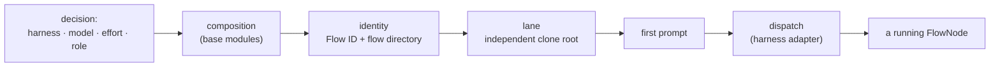
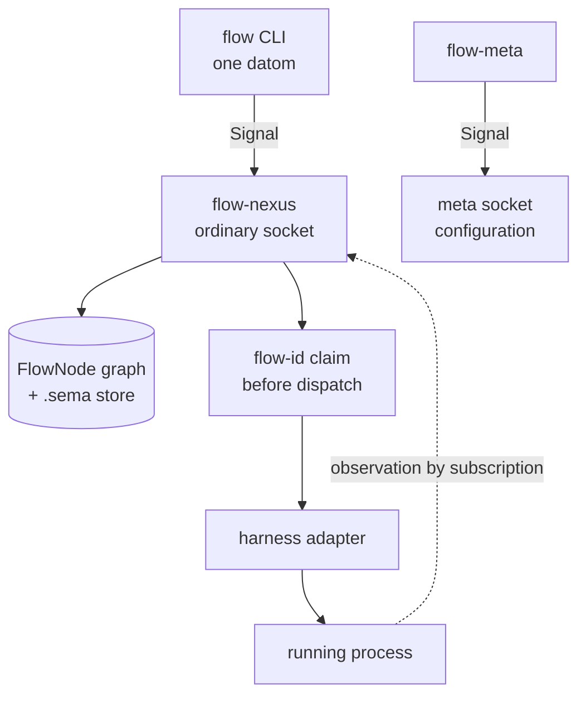
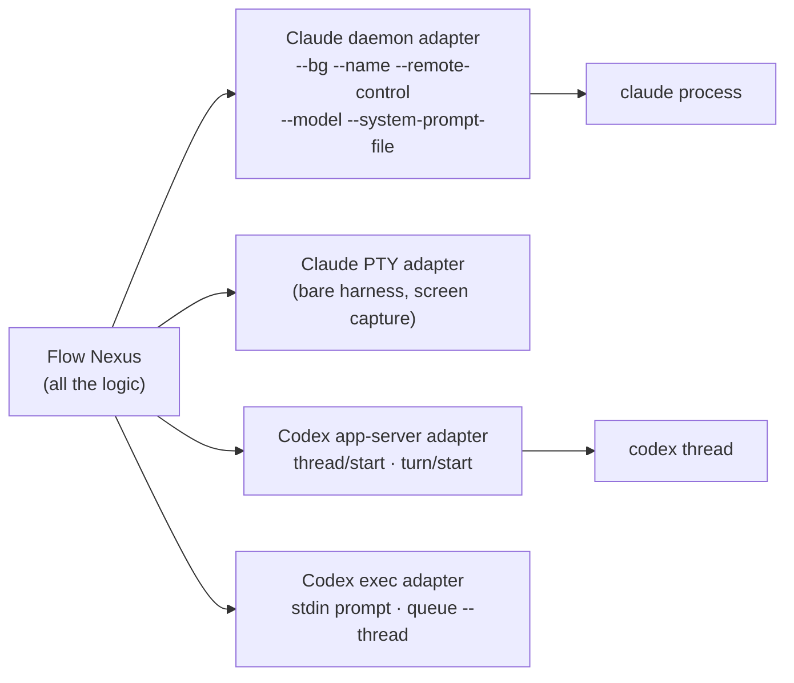
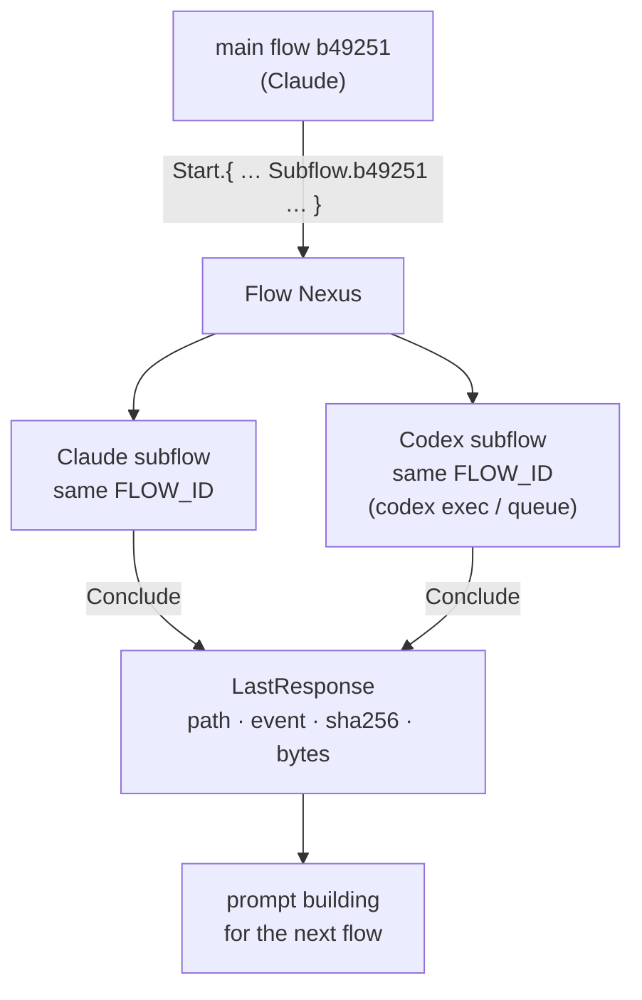
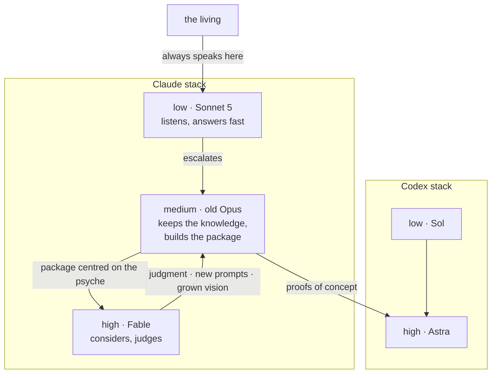
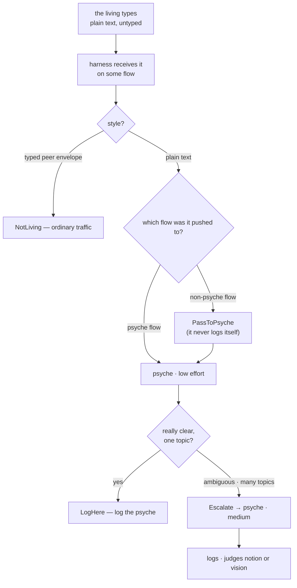
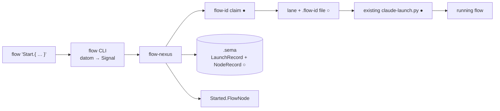

# The Flow Nexus — the anatomy of a launch

*An idea book. One idea per section. The charts are the flow of the idea. Every claim is either witnessed at `file:line` or marked **design** — mine, not the living's, and nothing here stands until the living rules on it.*

Maturity marks: **●** exists and was witnessed · **◐** partly exists · **○** designed here only.

---

## 1 · What a flow launch is

A launch is the creation of one thinking process with a whole context chosen for it. Nine things are decided before the first token: the **harness** (Claude, Codex, later the open-source seat), the **model** inside that harness — the models are per harness, `flows/b49251/vision/psycheFlows.md:35` — the **effort** (low, medium, high, `psycheFlows.md:43`), the **role** (a main flow at a layer, or a subflow of some kind), the **base composition** (the modules that replace the harness's stock context), the **first prompt**, the **lane** (an independent clone root and a flow directory), the **identity**, and whether this is a main flow or a subflow. Today the whole of that is a Python file: `claude-launch.py` on `origin/flow/f55ec8` composes `argv` at lines 25–27 with `--bg`, `--name`, `--remote-control`, `--model fable`, `--system-prompt-file` and the prompt after `--`, refuses a shared workspace at lines 18–22, and dispatches with `stdin=DEVNULL` at line 40. The Nexus concept is: that file becomes one typed query. **Design:** effort is not yet a launch parameter on the Claude side — `claude-launch.py:26` fixes the model and nothing else; on Codex it already is, `codex-launch.mjs:35` passes `effort: 'medium'` to `turn/start`.



---

## 2 · The Flow Nexus owns the launch

**Design.** The Flow Nexus is the vertex that starts flows and remembers them. `Vision/flowNexus.md:5-8` (origin/main): "The Flow Nexus sets up and starts a model flow: its working directory, system prompt, training files and instruction prompt." Its ordinary socket carries four queries — `Start`, `Observe`, `Conclude`, `Route` — and it answers every one with a typed reply, a typed refusal included. It keeps a graph of `FlowNode`s: the shape is not invented here, it is cf7879's message anatomy, `flows/cf7879/reports/order10-message.ethos:53`. Crucially the identity is **passed at launch, not claimed after**: the living asked exactly this — "Can't we get the process that starts the flow to get the ID passed into the prompt… the harness is just started in its own special place, and it has its Flow ID in a file" (`origin/flow/f55ec8:flows/f55ec8/vision/flowIdentity.md:7-9`). Today it is the reverse: `successors-v7/first-prompt.md:1-6` tells the new flow to run `flow-id` itself and says in as many words that "the launcher-claims-first design… is owed and not yet built". The Nexus closes that hole: it calls `flow-id` (**●** `harness-0.3.4/bin/flow-id`, usage witnessed: `flow-id claude --flows-root ABSOLUTE_DIRECTORY --parent-session UUID`) before dispatch, writes the claim into the lane, and the flow reads its name rather than asserting it.

### The Ethos

```
Signal
[]                                                          ; imports
[ Start.Launch                                              ; queries
  Observe.NodeSelection
  Conclude.FlowIdentifier
  Route.LivingTurn ]
[ Started.FlowNode                                          ; responses
  Observed.NodeListing
  Concluded.Closure
  Routed.RoutingDecision
  Refused.Refusal ]
[ FlowIdentifier.String                                     ; types
  FlowDirectory.String
  SessionIdentifier.String
  SourceEventIdentifier.String
  TranscriptPath.String
  CloneRoot.String
  FlowName.String
  RoleName.String
  ModuleName.String
  ModelName.String
  PromptBody.String
  ResponseText.String
  TurnText.String
  Endpoint.String
  Sha256.String
  ByteCount.Integer
  TimestampNanos.Integer

  Harness.[ Claude Codex OpenSource ]
  Effort.[ Low Medium High ]
  Layer.[ Primary Secondary Tertiary Quaternary ]
  SubflowKind.[ Checkup Audit Witness Proof Distillation Illustrate LowPowerThinking ]
  Role.[ Main.Layer  Sub.SubflowKind ]
  Model.{ ModelName Harness Effort }
  Composition.{ Role Harness Vector<ModuleName> }

  Claim.{ FlowIdentifier FlowDirectory }
  Parentage.[ Root  Subflow.FlowIdentifier  Successor.FlowIdentifier ]
  Launch.{ Claim Parentage Composition Model FlowName PromptBody CloneRoot }

  Adapter.[ ClaudeDaemon ClaudePty CodexAppServer CodexExec ]
  RouteKind.[ ClaudeDaemon ClaudePromptRelay CodexQueue CodexTurnStart LaneFile ]
  Route.{ RouteKind Endpoint }

  IdleState.[ Starting Idle Busy ApprovalWait Concluded Unknown ]
  IdleEvidence.[ HarnessTurn DaemonRoster TranscriptEnd Unavailable ]
  Observation.{ IdleState IdleEvidence TimestampNanos }

  FlowNode.{ Claim SessionIdentifier Harness Role Observation Vector<Route> }
  NodeSelection.[ All  Cluster.Layer  One.FlowIdentifier ]
  NodeListing.{ TimestampNanos Vector<FlowNode> }

  LastResponse.{ TranscriptPath SourceEventIdentifier Sha256 ByteCount ResponseText }
  Closure.{ Claim LastResponse TimestampNanos }

  TurnStyle.[ PlainText TypedPeer ]
  LivingTurn.{ FlowNode SourceEventIdentifier TranscriptPath TurnStyle TurnText Sha256 TimestampNanos }
  EscalationReason.[ Ambiguous ManyTopics NotionOrVisionUnclear NotPsycheFlow ]
  Escalation.{ Claim EscalationReason }
  RoutingDecision.[ LogHere.Claim  Escalate.Escalation  PassToPsyche.Claim  NotLiving ]

  Refusal.[ UnknownRole.RoleName
            NoComposition.{ Role Harness }
            SharedWorkspace.CloneRoot
            OversizeDispatch.ByteCount
            AdapterUnavailable.Adapter
            IdentityUnclaimed.FlowName
            UnknownFlow.FlowIdentifier ] ]
```

A Sema sketch, the durable side, importing the wire vocabulary rather than restating it:

```
Sema
[ signal_flow:[ Claim Parentage Composition Model Observation LastResponse
                TurnStyle Harness Role Sha256 ByteCount TimestampNanos
                SessionIdentifier TranscriptPath SourceEventIdentifier ] ]
[ LaunchRecord.{ Claim Parentage Composition Model Sha256 ByteCount TimestampNanos }
  NodeRecord.{ Claim SessionIdentifier Harness Role Observation TimestampNanos }
  TurnRecord.{ Claim SourceEventIdentifier TranscriptPath TurnStyle Sha256 TimestampNanos }
  ClosureRecord.{ Claim LastResponse TimestampNanos } ]
```

### Worked datoms — one per query, one per response

```
flow 'Start.{ { b49251 /abs/clone/flows/b49251 } Successor.f55ec8 { Main.Primary Claude [ spirit psyche behavior datom ethos nexus ] } { fable Claude High } primary-claude-successor-f55ec8 «Read sources/f55ec8/reports/handoffToSuccessor.md first.» /abs/clone }'

Started.{ { b49251 /abs/clone/flows/b49251 } f55ec8ce-4aa1-45d6-9a3e-dc5bc4ed0764 Claude Main.Primary { Starting DaemonRoster 1789012345678901234 } [ { ClaudeDaemon /tmp/cc-daemon-1001/a88e833a/rv/f55ec8ce.sock } ] }
```
```
flow 'Observe.Cluster.Primary'

Observed.{ 1789012345678901234 [ { { b49251 /abs/clone/flows/b49251 } f55ec8ce-4aa1-45d6-9a3e-dc5bc4ed0764 Claude Main.Primary { Busy HarnessTurn 1789012345678901234 } [ { ClaudeDaemon /tmp/cc-daemon-1001/a88e833a/rv/f55ec8ce.sock } ] } ] }
```
```
flow 'Conclude.7c31aa'

Concluded.{ { 7c31aa /abs/clone/flows/7c31aa } { /abs/transcript.jsonl msg_01a0aa9c-b778-76d1-8b1f-2bb0d6430fb2 227bedbfb4bd315dce2c8e38ec31d6de42b70bcecb384a95d23cad4ae3dcd042 1363 «The three launch routes are …» } 1789012399999999999 }
```
```
flow 'Route.{ { { b49251 /abs/clone/flows/b49251 } f55ec8ce-4aa1-45d6-9a3e-dc5bc4ed0764 Claude Main.Primary { Idle HarnessTurn 1789012345678901234 } [] } msg_01a0aa9c-b778-76d1-8b1f-2bb0d6430fb2 /abs/transcript.jsonl PlainText «We won't always necessarily run just these kinds of flows in the cluster.» 227bedbfb4bd315dce2c8e38ec31d6de42b70bcecb384a95d23cad4ae3dcd042 1789012345678901234 }'

Routed.Escalate.{ { a4c092 /abs/clone/flows/a4c092 } ManyTopics }
```
```
Refused.SharedWorkspace.«/home/li/wt/.../claude-successor-b49251»
```



---

## 3 · The adapters are edges, not logic

**Design, from witnessed parts.** Everything that differs between harnesses lives in a thin adapter; no decision lives there. The Claude adapter today is `subprocess.run(argv, cwd, env, stdin=DEVNULL)` — `claude-launch.py:40` — with `TERM=xterm-256color` and `NO_COLOR` popped (lines 29–31), a manifest hash check on every artifact (lines 15–16), a `<100000` byte bound on every argv string (line 28) and a modelled daemon-record bound of 256 KiB with a 64 KiB reserve (lines 32–35), explicitly *modelled*, not measured. The Codex adapter is JSON-RPC over a Unix WebSocket: `initialize` with `capabilities.experimentalApi=true`, `remoteControl/status/read`, `thread/start` with `baseInstructions`, `cwd` and `model`, `thread/name/set`, then `turn/start` with an `effort` and a text input — `codex-launch.mjs:27-36`. A second Codex edge is the CLI: **●** `codex exec [PROMPT]` reads instructions from stdin when the prompt is `-`, takes `-m/--model`, and has `resume` and `fork` subcommands; **●** `codex queue --thread <UUID|name> --message <TEXT>` puts a turn on a live thread. The asymmetry is real and it is what the Nexus normalizes: Claude replaces its base with a *file* (`--system-prompt-file`), Codex with a *field* (`thread/start.baseInstructions`, witnessed at `flows/cf7879/handoff/successors-v5-reviewed/README.md:3`).



---

## 4 · A subflow in another harness

"Each main flow can run subflows in other harnesses too if it wants" — `flows/b49251/vision/flowLaunching.md:7`. **Design:** a subflow is not a different kind of thing from a main flow; it is a `Launch` whose `Parentage` is `Subflow.<parent flow id>` and whose `Claim` carries the **parent's** Flow ID, not a new one. That is already the rule in prose — this brief itself carries `FLOW_ID=b49251` unchanged, and the subflow skill says to pass it unchanged to every nested brief. What the parent gets back is one thing: the last response. The living was precise: "those subflows' last response would be used, potentially for prompts, for prompt building, for another flow… We just want that last response, and then we do an extract. Transcription extraction is basically standard" (`flows/b49251/vision/subflowDispatch.md:7`). So `Conclude` returns a `Closure` whose `LastResponse` names the transcript, the source event, the hash and the bytes — the extraction becomes a receipt, not a paraphrase. Cross-harness dispatch is proved today only the hard way: f55ec8 recorded that "the dispatch of a codex exec illustrator subflow was refused by this session's classifier, so the same brief goes to the paired Codex flow d9961c by queue as its own task" (`origin/flow/f55ec8:flows/f55ec8/log.md:45`). The Nexus removes that: the parent asks the Nexus, the Nexus owns the adapter, and no flow shells out to another harness.



---

## 5 · Specialized main flows — the psyche stack

The living named the stack: "Fable on high power on the cloud side · Medium is old Opus · This is the Psyche stack · Low level is going to be Sonnet… We're going to use Sonnet 5 for now… The same stack on Codex is Astra for the high power" (`flows/b49251/vision/psycheFlows.md:55-60`), with Sol at the no-consideration end (`psycheFlows.md:17`). Three levels, a Codex and a Claude equivalent: "Claude is a model stack, and codex is a model stack" (`psycheFlows.md:43`). The living always talks to the **low** effort, because "talking first is just a low-effort activity, like listening, and then the thinking goes up one level" (`psycheFlows.md:43`). The middle keeps all the knowledge and builds the package: "the middle puts together a nice package for the high effort… and then those top flows can consider this and maybe verify one or two things with their own set of flows, and then render a judgment" (`flows/b49251/vision/layers.md:9`); the Opus side "is more about orchestrating codex to try some proof of concepts" (`layers.md:7`). **Design:** in the Ethos this is exactly one `Composition` per `(Role, Harness)` plus one `Model` carrying its `Effort` — the composer on `origin/proposal/f55ec8-model-flow-anatomy` already has that shape at `anatomy/modelFlowAnatomy.ethos:39` (`Composition.{ Role Harness Vector<ModuleName> }`) and its `Compose.{ RoleName HarnessName OutPath }` at line 54. A specialized main flow is therefore not new machinery: it is a named role whose composition and preferred model are recorded, and `Start` resolves it.



---

## 6 · The awareness command chain

The living, the same evening (`flows/b49251/vision/psycheFlows.md:70-72`): "The harness would know, because of this style of the message, that it's from psyche, and it would know, because of which flow it's been pushed to, where to send it to, just to create this awareness command chain." Recognition is by *style*: the living's turn is plain text, unlike the typed envelopes flows send each other — he said it himself to Codex, "It's recognizable as just plain text. It doesn't have the typed message that you guys send to each other… For now, that's the security model" (`origin/flow/cf7879:flows/cf7879/reports/to-efa157.md:157`). The chain: the plain turn goes to the **psyche flow at low effort**; the low effort logs only when it is really clear, and "if it's any ambiguous and there are a lot of topics, it sends it to the psyche at medium power" for the logging and the notion-or-vision judgment; a **non-psyche** flow does not log at all — it is "instructed to pass it to a psyche agent for logging. Only psyche agents know how to log" (`psycheFlows.md:70-72`). In the Ethos this is the `Route` query of section 2: it carries the receiving `FlowNode` (which says *which* flow it was pushed to, and at what role) and the turn's provenance (`SourceEventIdentifier`, `TranscriptPath`, `Sha256`, `TurnStyle`), and it returns a typed `RoutingDecision` — `LogHere`, `Escalate.{ Claim EscalationReason }`, `PassToPsyche.Claim`, or `NotLiving`. Its worked datom is the fourth pair above.

**What exists today.** **◐** Untyped-turn recognition: `prompt-relay` already distinguishes provenance kinds — `--source-format peer-file` versus transcript mode with its six-word HEAD/TAIL match, literal and refusing on ambiguity (`origin/flow/cf7879:flows/cf7879/reports/to-840e42.md:588`) — so the machinery to tell a transcript user turn from a peer envelope is built, but it is a *transport* discriminator, not a routing decision. **◐** Recognition-and-forward by hand: cf7879 received a plain living turn, preserved it byte-exact with source, hash and timestamp, and routed it to the named layer — "Living prompt intended for primary — verbatim source preserved, recipient delivery pending", `to-efa157.md:150,152-153`; delivery then stalled on a contradictory `idle`/`blocked` gate (`to-efa157.md:164`). **○** Everything typed: the style test, the receiving-node lookup, the clear/ambiguous judgment and the escalation are design here. **Design note:** the low effort's guard is deliberately conservative — the decision type has no "probably clear" variant; anything not plainly one topic is `Escalate`.



---

## 7 · What exists today, and the smallest proof of concept

**●** `flow-id` claims a Flow ID per harness from a parent session, with a lock and a versioned marker (`harness-0.3.4`, README lines 3–20); **●** the v6/v7 launchers dispatch a Claude flow with a replaced base, a name, remote control, a model, an independent-clone check and a bounded argv (`successors-v7/claude-launch.py:15-40`); **●** the Codex launcher creates a thread with replaced base instructions and starts a turn at an effort (`successors-v5-reviewed/codex-launch.mjs:16-36`); **●** `codex exec` and `codex queue` exist as a second edge; **◐** the `FlowNode` vocabulary is written but as *message* anatomy, not flow anatomy (`order10-message.ethos:53`); **◐** the composer's Role/Harness/Composition/Compose types exist as a proposal library, not a Nexus (`anatomy/modelFlowAnatomy.ethos:39,54`); **○** no `flow` Nexus, no `signal-flow`, no `meta-signal-flow`, no `.sema` store, no subscription — and no `flow` or `flow-id` repository under `/git/github.com/LiGoldragon/`; `flow-id` ships from `harness`. Two defects are worth naming because a Nexus fixes them by construction. First, **identity is claimed after start** instead of passed at launch (`successors-v7/first-prompt.md:1-6`) — the living asked for the other order (`flowIdentity.md:7-9`). Second, the **own-scope defect**: f55ec8 recorded "Scope: app-ghostty-surface-transient-2819345.scope, no claude-successor-* unit loaded, so the own-scope gate is not met, as for efa157 and 840e42" (`origin/flow/f55ec8:flows/f55ec8/log.md:3`) — a flow launched from a terminal inherits that terminal's cgroup and dies with it; a Nexus that starts flows owns their scopes.

**The smallest proof of concept.** One CLI, `flow`, taking one inline datom — `Start.{ … }` — over the ordinary socket. The Nexus claims the Flow ID with the existing `flow-id`, writes the lane, runs the *existing* `claude-launch.py` unchanged as the Claude adapter, records a `LaunchRecord` and a `NodeRecord` in its `.sema`, and answers `Started.FlowNode`. Nothing else: no Codex adapter, no `Route`, no subscription, no meta surface beyond `Configure`. It is falsifiable in one command, and it proves the only thing in doubt — that a launch can be one typed value.



---

## Sources

Read whole: `flows/b49251/vision/flowLaunching.md`, `psycheFlows.md`, `subflowDispatch.md`, `layers.md` (this worktree). On `origin/main`: `Vision/flowNexus.md`, `Vision/nexus.md`. On `origin/flow/f55ec8`: `flows/f55ec8/vision/flowIdentity.md`, `flows/f55ec8/log.md`, `flows/f55ec8/handoff/successors-v7/{README.md,first-prompt.md,claude-launch.py}`. On `origin/flow/cf7879`: `flows/cf7879/reports/order10-message.ethos`, `flows/cf7879/reports/to-efa157.md`, `flows/cf7879/reports/to-840e42.md`, `flows/cf7879/handoff/successors-v6-reviewed/claude-launch.py`, `flows/cf7879/handoff/successors-v5-reviewed/{README.md,codex-launch.mjs}`. On `origin/proposal/f55ec8-model-flow-anatomy`: `anatomy/modelFlowAnatomy.ethos`. Executed: `flow-id` (no args and `--help`), `readlink -f $(which flow-id)` → `/nix/store/b4wzlwmzbfis6ys2b1svh531dplxxyd3-harness-0.3.4/bin/flow-id`, `/git/github.com/LiGoldragon/harness/README.md`, `codex exec --help`, `codex queue --help`, a listing of `/git/github.com/LiGoldragon/`. Form after `flows/b49251/reports/ideaBook-powerModes.md`. No repository edits.
