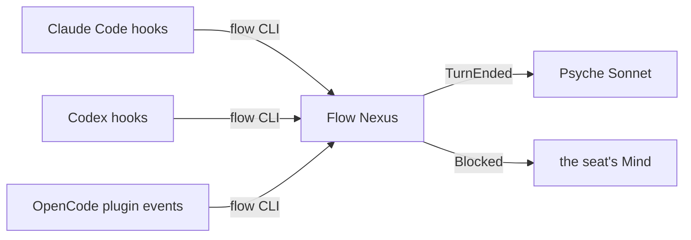
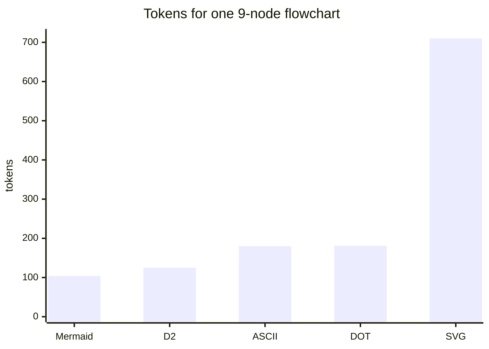

`Book.«Hooks, graphs and the book maker»`

## 1. Every harness can tell Flow what it's doing, without polling

| Flow event | Claude Code | Codex | OpenCode |
|---|---|---|---|
| session start | SessionStart | SessionStart | session.created |
| prompt submitted | UserPromptSubmit | UserPromptSubmit | chat.message |
| turn ended | Stop | Stop | session.status idle |
| permission asked | PermissionRequest (can answer) | PermissionRequest (can answer) | permission.asked (notify only) |
| compaction | PreCompact / PostCompact | PreCompact / PostCompact | session.compacted |
| session end | SessionEnd | SessionEnd | deletion only |

**The gap:** no harness fires anything when its process crashes or is killed. Flow has to watch the process itself and learn of its exit as an event.

## 2. The open-source harness research is complete
- **OpenCode with Kimi K3** is ruled ("Let's set that up"). It's installed on Zeus, but the test that its reasoning and tool calls survive a round trip was never run.
- **Replacing the system prompt** is clean in four places:
  - research harnesses such as SWE-agent;
  - a proxy on the wire;
  - OpenCode's prompt-rewrite hook;
  - Pi, Kimi Code and DeepSeek Harness, each through its own full-replacement setting.

  In Claude Code and Codex, replacing it is possible but never clean.
- **Still open:** whether Codex quietly demotes its base instructions. Only a capture of the traffic can show it.

## 3. Graphs cost little when a script draws them

Mermaid is cheapest for a model to write, and ASCII also lays the graph out badly. A script in the page turns Mermaid into a readable picture, so no model call goes into drawing.

## 4. Skill proposals
**trial-flashbook: replace** "The first page is always an illustration. Pages alternate: an illustration, then at most a small paragraph or a few points, ideally with a flowchart, then an illustration again. Never two charts in a row; an illustration follows every text page." **with:**
> A page carries one graph or a few lines of text. A graph is written as Mermaid and drawn in the page by its script, never by a model.

**trial-flashbook: remove** "Load trial-flashbook-illustration for every illustration." This drops its dependency on trial-flashbook-illustration.

**New skill, trial-graph:**
> **Description:** A graph is about to be written for the living.
>
> Show the mechanism, not its name: a box for each action, a diamond for each question, a label on every arrow. One accent colour marks the path that matters. One graph makes one point.

**New subagent, book-maker** (Sonnet, light effort; loads trial-flashbook and trial-graph):
> Make the book from the marked block named in the brief: one private page, drawn by its own script. Commit its Markdown, and nothing else.