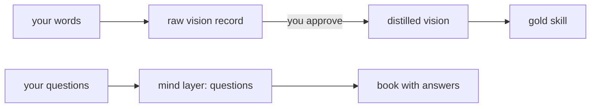

`Book.«Illustrated flowcharts, and vision becoming skill»`

## 1. My graph proposal, revised
You called the stylized flowchart in «Your questions since 28 September» an illustrated flowchart, and a good one. So illustrations stay, but each one starts from a flowchart. **trial-flashbook: replace** its first line on illustrations **with:**
> A page carries one illustrated flowchart or a few lines of text. The flowchart is written as Mermaid; Sonnet gives it style and feeling as an illustration, keeping every box and arrow.

The dependency on trial-flashbook-illustration stays. The book-maker subagent is unchanged.

## 2. Vision becomes skill
You wrote: "now vision is skill. Let's make that whole migration." Before Mind Sol builds it, the shape has three open points:
- **What becomes a skill.** Either only the distilled Vision files, which you've reviewed, or the raw records too.
- **Its kind.** Vision you approved would be a gold skill, one that changes only on your word.
- **Questions as a layer of mind.** A question would be recorded the way vision is, in each flow's own records, under its own layer name.

