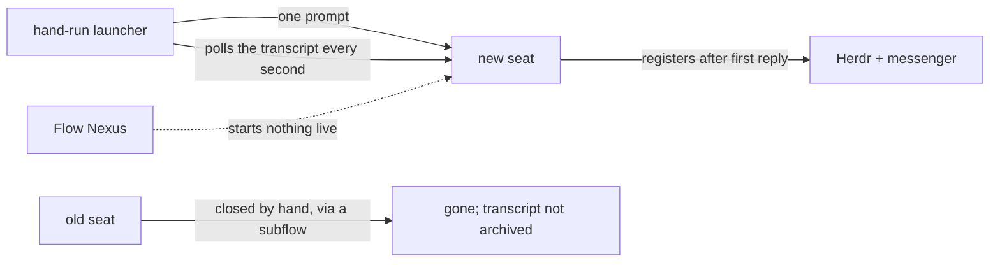

## 1. Starting a seat
- **Claude seats.** They start from a hand-run launcher with no model calls. It names the seat first and sends one full prompt, which is right. Then it checks the transcript every second until the seat replies, and only then registers it.
- **Codex seats.** Each launch is a one-off script a flow writes, and the seat names itself with its own model turns.
- **Flow.** No live seat came through Flow, so its Start operation exists but isn't used.

## 2. Restarting and retiring
- **Restarting.** A successor's brief is written by the old seat's model, and a subflow launches it. That cost about a million tokens for Fable's relaunch, against your "almost zero".
- **Retiring.** A subflow closes the old seat by hand, and deregistering needs four exact values. Nothing archives Claude transcripts. The reaper has never been applied, so 347 flow folders sit in place, and Flow keeps 25 rows for dead seats.
- **Skills.** No skill says how to restart or retire a seat.

## 3. Messages and state
- **Messages bypass the nexuses.** Messages go straight to the screen through Herdr, past the Message and Flow nexuses. A message held for a busy or blocked seat is never sent later.
- **Herdr's screen reading** is how seat state is known, and it is the one part that keeps checking. The only hook anywhere tells Herdr a session started.
- **Flow can't take reports.** It has no request a hook could call to report idle, blocked or done.
- **Sonnet blocked again.** It appears to have been stuck a second time today, for over eleven hours, on a permission dialog.

## 4. Short-lived flows
- **Subagent models.** Claude subagents come in Haiku, Sonnet and Opus. The book maker is Haiku with no skill, though you ruled it a light Sonnet. Codex subagents still name last generation's models.
- **One-off flows** have no path of their own.