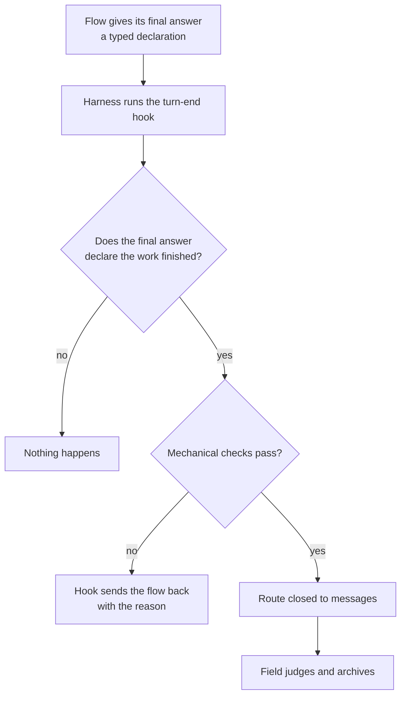

# Fable's last presentation — evidence

Subflow of bd0019, read-only. Transcript T = `/home/li/.claude/projects/-home-li-primary/c64ee3f5-0732-4315-936e-7ffc63e3000b.jsonl` (554 lines, model `claude-fable-5-1`). The `transcript` CLI named by the transcript-search skill is not installed here; records were read by line with `json.loads`. Line numbers are JSONL line numbers of T.

## 1. Presentations in T, with markers (observed)

| Line | uuid | Timestamp | Begin marker | End marker |
|---|---|---|---|---|
| 285 | 20bd9ab9-98b8-4ecc-b8f0-f656af84e536 | 2026-09-29T16:33:36.629Z | `ANATOMY ONE BEGINS — skill deployment, pre-concepts and questions` | `ANATOMY ONE ENDS — skill deployment, pre-concepts and questions` |
| 487 | 5d95e611-de22-4dd1-bdef-b7c5f3a41799 | 2026-09-29T18:49:54.718Z | `ANATOMY TWO BEGINS — knowing when a session is finished` | `ANATOMY TWO ENDS — knowing when a session is finished` |
| 530 | cfe541f9-bd58-478b-9a20-836721b4dfba | 2026-09-29T18:55:11.663Z | `ANATOMY CORRECTION BEGINS — the two ethos blocks, written whole` | `ANATOMY CORRECTION ENDS — the two ethos blocks, written whole` |

The last marked presentation is line 530 (ANATOMY CORRECTION). The last full new-topic presentation is line 487 (ANATOMY TWO). Line 530 corrects code blocks in both 285 and 487. Final record in T is line 552 (18:57:09Z); nothing after.

Other Fable sessions checked (same projects dir, modified 2026-09-29): `1b8bd717…` (Fable, one "help" exchange at 17:23Z, no presentation); `c02c0dd5…` (Fable, last record 00:16Z, before line 285; no BEGINS/ENDS markers). Other sessions of the day are Opus/Sonnet. No later Fable presentation found elsewhere.

## 2. Verbatim: the presentations and Fable's statements after them

### T line 487 — 2026-09-29T18:49:54.718Z — assistant

````text
ANATOMY TWO BEGINS — knowing when a session is finished

# Knowing when a session is finished: first anatomy

Like the first, this is mostly questions. What I state about the harnesses, a subflow read from the programs installed here, without the web. The shapes I propose are my own pre-concepts.

## Three things that are easy to confuse

- **A turn ended.** The flow gave its final answer and is waiting. Both harnesses know this.
- **A session ended.** The program exited or the conversation was cleared. Both harnesses know this, except when the program is killed outright, which tells no one.
- **The work is finished.** Neither harness has any notion of this. It can only be read from what the flow said last, or judged by someone reading the transcript.

Reaping needs the third. The hooks give the first two.

## What the harnesses offer

A hook is a small program the harness runs by itself when something happens.

- **At the end of every turn,** both Claude and Codex can run a hook and hand it the session's identifier, where the transcript is, and the text of the final answer.
- **Claude also hands over the list of background work still running,** so a hook can tell a flow that is done from one that is only waiting to be woken.
- **The turn-end hook may answer back.** It can make the flow continue instead of stopping, and give it a reason.
- **At the end of a session,** both can run a hook that only observes.
- **Today neither is used.** Only a session-start hook is set up. The messenger learns that a seat is working or done from patterns on the terminal screen, not from the harness.

This also answers part of your earlier question on addressing a transcript: at the end of a turn the harness itself hands out the transcript's location and the final answer's text, in both harnesses.

## Pre-concept: the flow declares, the hook hears



You said on 19 September that when a flow's last final response is clearly a typed one, reaping needs little judgment. And you said today that the important part of the output no longer has to be in the final answer. Together these suggest the final answer can be the declaration itself.

A draft of such a declaration, not yet checked against the Ethos generator:

```
FlowId.String
Remainder.String
Completion.[ Finished.{ Option<FlowId> Vector<Remainder> } ]
```

Written as data, by a flow that has a successor and leaves one thing undone:

```
Finished.{ Some.1bc255 [ «The page link was never sent.» ] }
```

## Questions

### 1. Who says the work is finished

- **The flow itself,** by its typed final answer.
- **You,** by telling the flow or Field that it is done.
- **A judge,** reading the transcript, as you described on 18 September.
- **The successor,** by acknowledging it has what it needs.

Which of these is enough alone, and which are needed together?

### 2. The form of the declaration

- **The whole final answer is the typed value,** and everything meant for reading is printed before it.
- **The typed value is one line** inside an ordinary final answer.

### 3. What the hook does when it hears finished

You said on 26 September that the hook picks up the final response and locks messages from being sent there immediately.

- **It only reports.** Someone else acts.
- **It closes the route at once.**
- **It checks first,** and sends the flow back to work if something is left: unpushed changes, a held lock, open Beads, background work still running.

### 4. Sessions that never declare

The old Codex sessions you want reaped now never declared anything, and a killed session tells no one. Is reading their transcripts by a judge the only way for these, or is there a rule by which silence for long enough counts?

### 5. What archiving does

The present reaping tool moves a flow's folder away. Your raw words live in those folders and are found by searching them, so a moved folder's records would no longer be found.

- **The folder stays** and only the harness's session files are archived.
- **The folder moves** and the search reaches the archive too.
- **The folder moves only after** its psyche records are distilled.

And your records differ on keeping: archives kept a year, or redistilled to a short chronology and tossed.

### 6. Who receives the hook's report

- **The messenger,** as it is today, as a compensation until better exists.
- **The Flow Nexus,** with the hook as a small client speaking signal to it.

### 7. Reawakening

You said once that waking a concluded flow to ask a question is possible but better not, and later that obsolete flows should be closed so they cannot be woken. Is a closed route closed for good?

## What it must not do, as I see it so far

- Take a turn ending, or a quiet screen, as the work being finished.
- Archive on the mechanical checks alone.
- Move a flow's records out of where psyche is searched.
- Close a route and move files as one act.

ANATOMY TWO ENDS — knowing when a session is finished
````

### T line 502 — 2026-09-29T18:50:18.662Z — assistant

````text
The second presentation is printed above, between "ANATOMY TWO BEGINS" and "ANATOMY TWO ENDS". It is on knowing when a session is finished, with seven questions. A subflow is placing it on your page below the first, and bringing back any comments you have left there.

The one finding that shapes it: both harnesses can run a hook at the end of every turn and hand it the final answer's text, but neither has any notion of the work being finished. So the hook can hear a flow declare itself finished; it cannot know it otherwise.

My log is pushed.
````

### T line 524 — 2026-09-29T18:54:24.363Z — assistant

````text
The second anatomy is on your page, below the first, at the same link.

Your comment on the first anatomy's type block reached me and is logged in your words: a block lacking its type is not ethos. Both of my presentations showed such fragments, cut out of whole files. A subflow is now checking the whole files against the real generator; when it returns I will answer your correction with the corrected blocks and the line for the skill.
````

### T line 530 — 2026-09-29T18:55:11.663Z — assistant

````text
ANATOMY CORRECTION BEGINS — the two ethos blocks, written whole

# The two ethos blocks, written whole

You corrected me: a block lacking its type is not ethos. Both of my anatomies showed a few declarations cut out of a file, without the root that says what kind of file it is. Here are the two written whole. A subflow ran each through the real generator, which accepted both unchanged, and the data examples round-tripped through the datom library byte for byte.

## For the first anatomy: the wire vocabulary of the Curriculum Nexus

This is a Signal root. Its sections, in order, are imports, queries, responses, types.

```
Signal
[]
[ Submit.Collection  Generate.WorkspaceName ]
[ Submitted.Collection  Generated.Deployment  Refused.Refusal ]
[ SkillName.String
  Situation.String
  SkillText.String
  WorkspaceName.String
  PsycheType.[ Vision Intent ]
  MindType.[ Operation Documentation ]
  FieldType.[ Compensation Trial ]
  SkillType.[ Psyche.PsycheType  Mind.MindType  Field.FieldType ]
  Loading.[ ByFlow ByUser ]
  Skill.{ SkillName SkillType Loading Situation Vector<SkillName> SkillText }
  Collection.{ Vector<Skill> }
  Harness.[ Claude Codex Pi ]
  Deployed.{ SkillName SkillType Harness }
  Deployment.{ WorkspaceName Vector<Deployed> }
  Refusal.[ UnknownWorkspace.WorkspaceName  DuplicateSkill.SkillName ] ]
```

It remains a draft to react to. The two requests, the three replies, and the refusals are my pre-concept and depend on your answers to the nine questions.

## For the second anatomy: a flow's declaration that it is finished

This is a Library root. Its sections, in order, are imports, types, kinds, associations.

```
Library
[]
[ FlowId.String
  Remainder.String
  Completion.[ Finished.{ Option<FlowId> Vector<Remainder> } ] ]
[]
[]
```

In the second anatomy I said this draft was not yet checked. It now is.

ANATOMY CORRECTION ENDS — the two ethos blocks, written whole
````

### T line 545 — 2026-09-29T18:55:42.903Z — assistant

````text
Both ethos blocks are now written whole, above, between "ANATOMY CORRECTION BEGINS" and "ANATOMY CORRECTION ENDS". A subflow is replacing the fragments on your page with them.

## What led to the fault

No sentence in the skills I loaded told me to show a fragment. The ethos skill says the unit is the file, but it has no sentence saying that ethos shown or written anywhere must be a whole file. So I cut six declarations out of a file the generator had accepted whole, and showed only those.

## The line for the ethos skill, for your word

To go under "Roots and file shape", after the paragraph that says the unit is the file:

> Ethos is written only as a whole file: the root's head, every one of its sections, and every type it names declared or imported. A part of a file is not ethos.

This adds one rule and changes nothing else. It is a gold skill, so it waits on your word.

## What the check found

- **Both files were accepted unchanged** by the real generator, and the data examples round-tripped through the datom library byte for byte.
- **The generator agrees with you.** A bare fragment is refused, and so is a file naming a type it does not declare.
- **A small file is still a whole file.** A Library root carrying only the few types under discussion is valid, so showing little does not require showing a fragment.

## Still open for your word

- The two vocabulary lines, commentary and final answer.
- Whether the book subagent's definition should carry its own instructions.
- The nine questions of the first anatomy and the seven of the second, on the page.
````

### T line 552 — 2026-09-29T18:57:09.567Z — assistant

````text
The page now shows both ethos blocks written whole, at the same link: https://claude.ai/artifact/Afo898DtrDNPf82Q5aLi3H

## What differs

- **Your comment stays attached** to the block it was on, which is now the whole Signal file. Its label on the page still quotes the old text.
- **I could not answer on the thread itself.** The page refuses replies to a comment that was not sent to Claude, so my answer to your correction is only here in the pane.
- **One sentence was reworded by the subflow,** not by me: in the second anatomy, "not yet checked against the Ethos generator" became "now checked against the Ethos generator". The rest of the prose is unchanged.
- **The page lists the proposed ethos skill line** among the things waiting on you.

You have left no other comment since that one.

## A fault to know about

The skill that tells a flow how to update your page describes a page layout that differs from the page as it is. Three subflows in a row met this and wrote to what the page shows instead. The owning file is the page-updating operation skill, which is Mind's to correct.

## Waiting on your word

- The line for the ethos skill.
- The two vocabulary lines, commentary and final answer.
- Whether the book subagent's definition should carry its own instructions.
- The nine questions of the first anatomy and the seven of the second.

No subflow is out.
````

## 3. The living's correction (observed, verbatim)

Page comment, 2026-09-29 16:55, anchored on the first code block of Anatomy One (`PsycheType.[ Vision Intent ]…`), reported by the page subflow in T line 508 and again line 551:

> "We need to edit the skill that concerns this. Whenever ethos is written, this block is not ethos because it's lacking a type so it's invalid. Ethos always has to be correctly written; otherwise it's out of context, which means we don't know what it is. Actually you're telling me that it's ethos but still we should just write it correctly."

Logged by Fable as record c64ee3-3, `flows/c64ee3/vision/ethos.md` (commit d4e029c70, on origin/main; not in the local HEAD checkout at the time of reading).

No typed message from the living appears in T after line 285: user records 400 and 467 are messenger relays from Field Astra d5b96b (topic: reaping/completion hooks); the rest are task-notifications.

## 4. Candidate "mistakes" Fable talked about (observed quotes)

A. Ethos fragments — the living's correction. T line 545:
> "No sentence in the skills I loaded told me to show a fragment. The ethos skill says the unit is the file, but it has no sentence saying that ethos shown or written anywhere must be a whole file. So I cut six declarations out of a file the generator had accepted whole, and showed only those."
Proposed skill line (545): "Ethos is written only as a whole file: the root's head, every one of its sections, and every type it names declared or imported. A part of a file is not ethos."
Also 524: "Both of my presentations showed such fragments, cut out of whole files."

B. Page-updating skill describes a different page layout. T line 552, heading "A fault to know about":
> "The skill that tells a flow how to update your page describes a page layout that differs from the page as it is. Three subflows in a row met this and wrote to what the page shows instead. The owning file is the page-updating operation skill, which is Mind's to correct."
(Subflow reports: line 334 "the live page's schema is `subjects`/`waiting`/`distillations`/`items`, not the `items`/`news`/`state` the skill describes"; 508 and 551 likewise.)

C. The book subagent failed on its one line. T line 360:
> "**Why the book subagent failed:** its definition is only a header and the general preamble. It carries no instruction naming the page, where the transcript is, or which skill to load, so the one line gave it nothing to act on."
(Subflow, line 334: "/home/li/primary/.claude/agents/book.md is 12 lines — frontmatter plus the generic preamble.")

D. The page subflow reworded the record. T line 552:
> "**One sentence was reworded by the subflow,** not by me: in the second anatomy, \"not yet checked against the Ethos generator\" became \"now checked against the Ethos generator\". The rest of the prose is unchanged."

E. Rendering substitutions on the page (not called a mistake). T line 360: "the diagram was drawn by hand from the same parts and labels, because the page could not draw Mermaid itself." Line 508 subflow: "**Not rendered faithfully:** … **Heading:** it reads \"…: first anatomy\", as the record does. That might be mistaken for the first anatomy." Code fragments "scroll sideways on a phone".

## 5. How the earlier page was made (observed, c64ee3 records)

- Page: https://claude.ai/artifact/Afo898DtrDNPf82Q5aLi3H — the standing page "For You" (flows/8904b1/log.md:3555, flows/8904b1/vision/presentation.md 8904b1-30).
- v4 (T 334): Anatomy One placed as static section at top, each of nine questions its own bordered article; "Rendered faithfully, with one substitution: the Mermaid fence is drawn as a hand-authored inline SVG"; "Prose, the three code fragments, bullets and headings are the record's exact words."
- v5 (T 508): Anatomy Two below the first; "I checked the new section's prose against the record by machine: it matches word for word, without the two marker lines."
- v6 (T 551): code blocks replaced by whole files from the correction record; "The code blocks were copied from the record by a script and checked to match exactly." Wording choice: "The sentence now reads \"A draft of such a declaration, now checked against the Ethos generator:\"."
- Witness `flows/c64ee3/witnesses/presentation-address.md`: the address of a printed presentation is transcript file + line (or record uuid), knowable only after writing; marker first/last lines are how a flow points at its own output.
- Living's instruction record `flows/c64ee3/vision/presentation.md` (c64ee3-2): print the presentation mid-turn "in Markdown with Mermaid and code blocks"; give a subflow "the first few and the last few words".
- Not found: any record in c64ee3, 8904b1, 183ae0 saying the "For You" page copy was "reformatted". The closest observed items are D and E above.

## 6. Inference (not observed)

- The living's "the mistake that he talked about" most likely means A (ethos shown as fragments): it is the only fault corrected by the living, Fable named it "the fault" and explained its cause (545), and a page built from Anatomy Two alone would repeat it (487 still carries the fragment `FlowId.String / Remainder.String / Completion.[…]`, fixed only in 530). A page from "the last presentation" should therefore use 487's content with 530's whole Library file in place of the fragment — or include 530.
- B is the second strongest: Fable labelled it "A fault to know about" in the final answer (552), and it bears directly on an agent making a page ("so I'm sure the agent will be able to figure it out").
- Which one the living meant is not settled by the transcript; both A and B are live.
