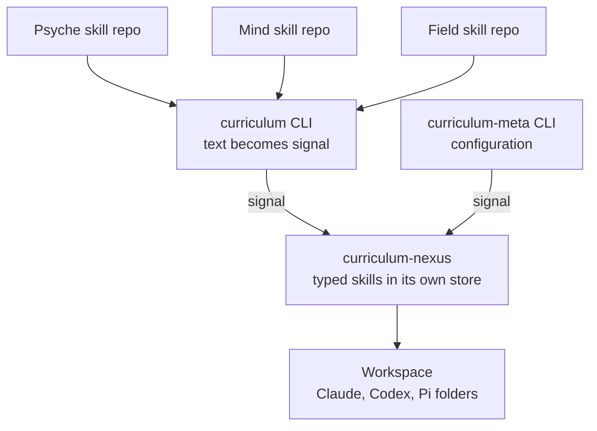

<!--
Source transcript: /home/li/.claude/projects/-home-li-primary/c64ee3f5-0732-4315-936e-7ffc63e3000b.jsonl
Transcript JSONL line: 285 (one assistant text record; both markers are inside it)
Record uuid: 20bd9ab9-98b8-4ecc-b8f0-f656af84e536
message.id: msg_011CfY3zXcJqahqs296v3Jmq
Timestamp: 2026-09-29T16:33:36.629Z
Model: claude-fable-5-1 (flow c64ee3)
Within the record's text field: marker lines are text lines 1 and 126 of 126.
Begin marker (verbatim): ANATOMY ONE BEGINS — skill deployment, pre-concepts and questions
End marker (verbatim):   ANATOMY ONE ENDS — skill deployment, pre-concepts and questions
Body below is the record's .message.content[0].text, extracted with jq -r, unaltered, markers included.
Prior address witness: /home/li/primary/flows/c64ee3/witnesses/presentation-address.md
-->

ANATOMY ONE BEGINS — skill deployment, pre-concepts and questions

# Skill deployment: first anatomy

This is a first pass: what I think the thing looks like, and the questions whose answers decide it. Nothing here is settled. Where I state something about today's system, a subflow read the code; where I state a shape for the new one, it is my own pre-concept.

## What exists today

A subflow read the present system and reported this.

- **The skill texts** sit in one repository named Curriculum: fifty-one Markdown files in one flat folder. Each file's header holds a description, sometimes a list of dependencies, and sometimes the mark that only the user may load it.
- **The generator** is a separate Rust repository, `curriculum-deploy`. It is a command that runs once and exits. It is not a Nexus.
- **Nothing in the code knows a skill's kind.** The prefixes (operation, compensation, trial) exist only as a naming habit described in a skill.
- **What the Rust does hold** is the knowledge of how each harness wants its files: where Claude, Codex and Pi look, what a user-only skill becomes in each, and how subagent definitions are written.
- **Deploying a changed skill today** takes: commit it, move a pin in the primary workspace to the new commit, run the generator, commit the generated folders.

On the rebuild: a subflow found that changing a skill text does not rebuild the executable today; the texts were separated from the Rust in August. You have told me the rebuild claim was Opus's, not yours, so it falls. What does rebuild the executable is changing how harness files are shaped, or adding a skill type.

## Pre-concept: the parts



- **Three skill repositories**, one per aspect. Each holds skill texts and a registry that types them. No Rust.
- **The Nexus repository**, `curriculum`: only what compiles the executable `curriculum-nexus` and its two commands.
- **Two wire vocabularies**, written in Ethos: one for ordinary requests, one for configuration.
- **The store**: the Nexus keeps the skills it was given, typed, in its own database.
- **The output**: the skill folders of a workspace, one set per harness.

## Pre-concept: a typed skill

A subflow ran this through the real Ethos generator, which accepted it unchanged; both example texts below round-tripped through the datom library byte for byte. It is a draft to react to, not a proposal to land.

```
PsycheType.[ Vision Intent ]
MindType.[ Operation Documentation ]
FieldType.[ Compensation Trial ]
SkillType.[ Psyche.PsycheType  Mind.MindType  Field.FieldType ]
Loading.[ ByFlow ByUser ]
Skill.{ SkillName SkillType Loading Situation Vector<SkillName> SkillText }
```

One skill, written as data:

```
{ datom Psyche.Vision ByFlow «Constructing, reading or interpreting datom text.» [] «The text of the skill.» }
```

A request to generate a workspace:

```
Generate.primary
```

The type carries the aspect, so a skill's aspect is never written twice. The empty bracket is the list of skills it depends on.

## Questions

### 1. A payload from several places

Your notion named two ways: a path inside datom, which you called not very pure, and a compiled signal file beside the datom file. I see three scenarios.

- **Several messages, nothing kept.** The registry and texts are turned into signal at the moment of submitting and sent as one message. The request to generate is a second message. The Nexus joins them in its store. No payload is ever drawn from two places.
- **A compiled signal file kept beside the registry.** Your second way. Any client can send the file as it is. It can fall behind its source, so a test must hold it fresh.
- **A path inside datom.** Your first way, which changes the datom language.

Which of these? And in the first two, what does the compiling: the `curriculum` command itself, or a separate tool?

### 2. Where a skill's type is declared

On 17 September you spoke of a type given per skill, in a header or a file beside it. On 24 September you said the type is assigned to the repository and centrally controlled. Today you said skills are typed and the directory name is not the source.

- **Per skill**, in the repository's registry.
- **Per repository**, in the Nexus's configuration.
- **Both**: configuration says which aspect a repository is; the registry says each skill's type within that aspect; the Nexus refuses a type from the wrong aspect.

### 3. Who writes the files into the workspace

- **The Nexus writes them.** It needs the right to write into every workspace.
- **The Nexus answers with typed rendered skills and the caller writes them.** The Nexus touches no workspace; later the Flow Nexus could be that caller.

### 4. Does the Nexus hold the skills now

You said skills will eventually live in the daemon and not in a Git repository.

- **Now**: once submitted, the Nexus's copy is what gets deployed; a workspace can be regenerated with no repository present.
- **Later**: for now the Nexus keeps nothing between requests and every generation is fed afresh.

### 5. What regeneration removes

You noted that a skill may be in more than one source, and that the generator should only delete the types it is overwriting. My pre-concept: the Nexus records which source each deployed skill came from, and a regeneration removes only what that same source deployed before and no longer carries. Does that match what you see?

### 6. Subagent definitions

You asked whether each skill repository gets a subagent section. Today they sit in one file in the Curriculum repository and the same generator writes them. Are they part of this Nexus's work, typed and submitted like skills, or a separate matter?

### 7. Role, rationale and user-only skills

Are a role skill and a rationale skill types of their own, beside vision and operation, or marks on a skill of any type? In the draft above, user-only is a mark, and role and rationale are absent.

### 8. Vision as skill

You said distilled vision is automatically a skill, with no separation. Does that mean the distilled vision file is itself the skill text, one topic one skill, typed as vision in the Psyche repository's registry, with no second file written from it?

### 9. Names

Under the Nexus naming, `curriculum` becomes the name of the Rust repository. Today that name belongs to the repository of skill texts, which would empty into the three. What are the three called?

## What it must not do, as I see it so far

- Read datom or any other text format inside the Nexus.
- Take a skill's type from a file name or a directory name.
- Hold any skill text in the repository that compiles the executable.
- Remove a skill it did not deploy.
- Decide who may change a skill; that belongs to the aspects and to you.
- Depend on a pin moved by hand in a workspace.

ANATOMY ONE ENDS — skill deployment, pre-concepts and questions
