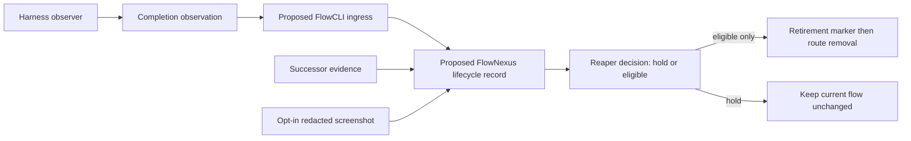

# Final-response lifecycle design — TESTING

## Status

This is a design proposal, not an enabled hook, FlowCLI operation, FlowNexus feature, or reaper policy. No harness, FlowCLI, FlowNexus, reaper, message route, or live session was changed while preparing it. Psyche consultation completed on 2026-09-19; the root decision described below remains open.

## Source request

The raw request is preserved in [operational-finalResponseLifecycleHook.md](../vision/operational-finalResponseLifecycleHook.md). It asks for an end-of-last-reply observation sent to Flow through FlowCLI, then to a reaper that can judge whether the flow ended, with successor evidence and an optional screenshot.

## What the installed surfaces actually show

| Surface | Observed seam | What it proves | What it does not prove |
|---|---|---|---|
| Codex 0.153.4 rollout JSONL | `event_msg` with `payload.type = task_complete`, a turn ID, timestamps, and a last-agent-message field | A completed Codex task/turn can be observed from the rollout | That the conversation, its flow, or its work has ended; a configured external callback is not established |
| Claude Code 2.1.263 hook documentation | `Stop`, `SubagentStop`, and `SessionEnd` hook events are documented | A configured Claude installation can expose stop and session-end hook seams | That primary has enabled them: `~/.claude/settings.json` currently has no `hooks`; `Stop` is an agent-stopping event and is distinct from `SessionEnd` |
| Flow CLI POC | `start`, `restart`, `show`, and `complete` are implemented in `tools/flow-cli-poc/flow.py` | The POC can mark a fixture attempt completed; restart waits for successor readiness before retiring an old fixture | Production FlowNexus, reaper dispatch, a completion ingress, authentication, or a production screenshot path |
| Installed `flow` wrapper | Current help exposes `start`, `restart`, and `resolve` | Existing command surface is small | A current completion or reaper command |

The POC README explicitly says it is a local SQLite test adapter and not production Nexus, Sema, Signal, authentication, or provisioning. It stores a transcript reference rather than transcript bodies.

## Distinct states

An assistant message being complete is output-level evidence only. A harness turn completion is a typed Codex `task_complete` observation or a separately verified Claude event. Claude `Stop` means the agent is stopping; `SessionEnd` means the session ends. A flow retirement is a separate, explicit reaper decision. None implies the next state.

## Proposed minimal path

1. A harness-specific observer records one immutable completion observation. It contains an internal exact session reference, harness event kind, turn reference when present, observation time, and a digest or reference for the final response. It defaults to a reference/digest: sending final-response content is optional and requires a separately settled privacy rule. Psyche proposes the typed ordinary-socket shape `Report.EndOfTurn.{ … }`; subscriptions are proposed, not implemented.
2. A **proposed** FlowCLI ingress translates that harness observation into `Report.EndOfTurn`, resolves it to one exact Flow identity, and records it idempotently. It does not start, resume, prompt, register, or retire anything. A mismatch, unknown identity, or duplicate with different evidence records `hold`.
3. A **proposed** FlowNexus lifecycle record joins the observation only with evidence bound to that same predecessor: a distinct successor's identity and readiness receipt, accepted handoff/open-work record, current lock and child state, and any explicit retention requirement. It must preserve the existing Hacky Messenger retirement guard; it must not send a liveness probe.
4. The reaper alone decides `hold` or `eligible`. `eligible` requires the successor evidence and preservation conditions to pass. Psyche's stated completion conditions include returned children, released locks, pushed changes, and handoff/successor readiness. It writes the exact immutable retirement marker before deregistration or pane closure, making later delivery fail closed. The operation is idempotent by predecessor flow identity and native session identity.

A final-response observer must only enqueue evidence. It may never call reaping against its own live session, kill a process, remove a route, or treat its own final message as a retirement decision. This prevents a normal final response from ending an active conversation or creating recursive hook behavior.

## Successor screenshot

A screenshot is optional corroboration, never identity, readiness, currentness, or no-work proof. The proposed record requires explicit opt-in, exact target identity, capture time, redaction rules, and a local artifact path plus digest. It must be a bounded current-terminal image with secrets and unrelated panes excluded. Do not collect or publish bulk transcripts or screenshots by default.

## Psyche input and root decision

Psyche recommends preserving authoritative transcript provenance through a bounded excerpt and its location, model, turn, and Flow provenance, while omitting raw living text and full tool output. It also calls out event coverage for crash, timeout, and context exhaustion, and retirement after refresh only as the final step after handoff.

The remaining root design decision is narrow: determine how accepted ownership of unresolved work is recorded so it survives retirement without treating every unresolved question as a reason to keep an otherwise completed predecessor alive. This report does not settle it. The user has rejected the over-conservative blanket rule.

## Failure behavior and narrow next experiment

Every missing, malformed, stale, or identity-mismatched record yields `hold`; it does not trigger probing, message delivery, restart, route recreation, or reaping. The first implementation experiment should be a packaged, remote-built fixture that sends a synthetic completion observation through a no-op FlowCLI ingress and demonstrates that it cannot retire a live fixture. It must separately test a confirmed successor-ready case and an identity mismatch. No local build, live hook activation, or screenshot capture is part of this proposal.

## Sources

- `flows/cf3553/vision/operational-finalResponseLifecycleHook.md`
- `tools/flow-cli-poc/README.md`
- `tools/flow-cli-poc/flow.py`
- `/home/li/.claude/plugins/marketplaces/claude-plugins-official/plugins/plugin-dev/skills/hook-development/SKILL.md`, event descriptions at lines 211–215, 266–268, and 634–642
- `/home/li/.codex/sessions/`, existing rollout `event_msg.payload.type = task_complete` records
- `operational-final-response` and `subflow-scripts` generated skill projections, read as source evidence only
