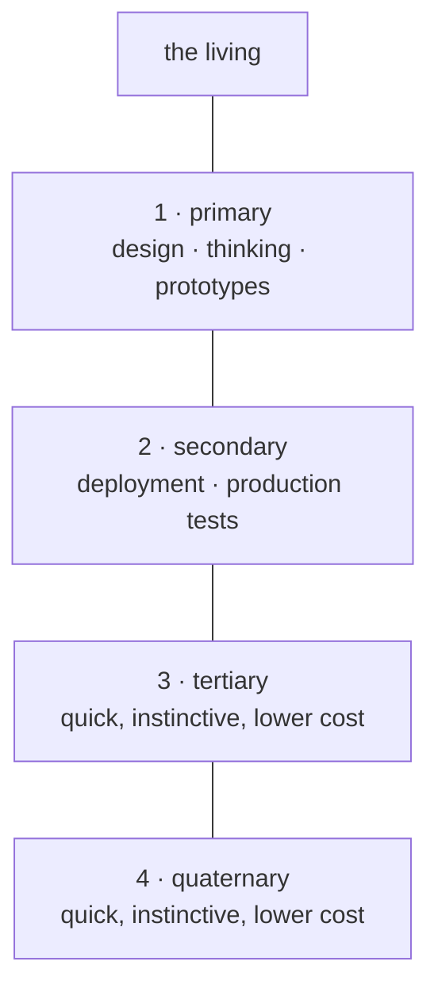
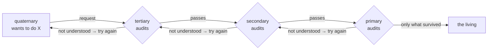
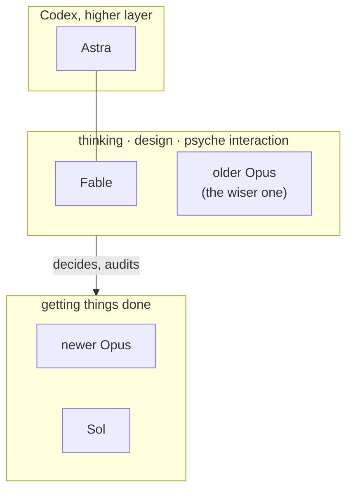
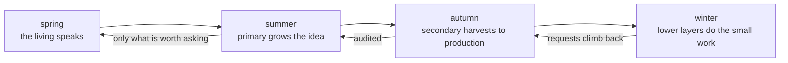

# The Four Layers

*An idea book. One idea, four boxes. The charts are the flow of the idea; the pictures are made from the charts.*

## 1 · One mind, four depths

A psyche extends itself through a cluster of flows. The flows are not a hierarchy of bosses; they are one mind at four depths. The top is slow and considers; the bottom is quick and instinctive. Every depth is a pair: a Claude half and a Codex half, the same message reaching both.

![1 · One mind, four depths illustration](data:image/svg+xml,%3Csvg%20xmlns%3D%22http%3A%2F%2Fwww.w3.org%2F2000%2Fsvg%22%20viewBox%3D%220%200%20760%20430%22%20role%3D%22img%22%20aria-labelledby%3D%22la1_t%20la1_d%22%3E%3Ctitle%20id%3D%22la1_t%22%3EOne%20mind%2C%20four%20depths%3C%2Ftitle%3E%3Cdesc%20id%3D%22la1_d%22%3EFour%20paired%20light-and-dark%20figures%20climb%20a%20single%20staircase%20from%20quick%20work%20toward%20reflection.%3C%2Fdesc%3E%3Cdefs%3E%3ClinearGradient%20id%3D%22la1_g%22%20x1%3D%220%22%20x2%3D%221%22%3E%3Cstop%20stop-color%3D%22%235f56d8%22%2F%3E%3Cstop%20offset%3D%221%22%20stop-color%3D%22%23ed8e57%22%2F%3E%3C%2FlinearGradient%3E%3Cfilter%20id%3D%22la1_s%22%3E%3CfeDropShadow%20dx%3D%220%22%20dy%3D%228%22%20stdDeviation%3D%228%22%20flood-opacity%3D%22.18%22%2F%3E%3C%2Ffilter%3E%3C%2Fdefs%3E%3Crect%20width%3D%22760%22%20height%3D%22430%22%20rx%3D%2228%22%20fill%3D%22%23f7f4ee%22%2F%3E%3Cpath%20d%3D%22M105%20332h112v-62h112v-62h112v-62h112v-62h108%22%20fill%3D%22none%22%20stroke%3D%22%2326334a%22%20stroke-width%3D%2213%22%20stroke-linejoin%3D%22round%22%2F%3E%3Cg%20stroke%3D%22%2326334a%22%20stroke-width%3D%225%22%3E%3Cg%20fill%3D%22%23ed8e57%22%3E%3Ccircle%20cx%3D%22164%22%20cy%3D%22297%22%20r%3D%2218%22%2F%3E%3Ccircle%20cx%3D%22195%22%20cy%3D%22297%22%20r%3D%2218%22%2F%3E%3C%2Fg%3E%3Cg%20fill%3D%22%23ed8e57%22%3E%3Ccircle%20cx%3D%22276%22%20cy%3D%22235%22%20r%3D%2218%22%2F%3E%3Ccircle%20cx%3D%22307%22%20cy%3D%22235%22%20r%3D%2218%22%2F%3E%3C%2Fg%3E%3Cg%20fill%3D%22%23ed8e57%22%3E%3Ccircle%20cx%3D%22388%22%20cy%3D%22173%22%20r%3D%2218%22%2F%3E%3Ccircle%20cx%3D%22419%22%20cy%3D%22173%22%20r%3D%2218%22%2F%3E%3C%2Fg%3E%3Cg%20fill%3D%22%23ed8e57%22%3E%3Ccircle%20cx%3D%22500%22%20cy%3D%22111%22%20r%3D%2218%22%2F%3E%3Ccircle%20cx%3D%22531%22%20cy%3D%22111%22%20r%3D%2218%22%2F%3E%3C%2Fg%3E%3C%2Fg%3E%3Cg%20fill%3D%22%235f56d8%22%20opacity%3D%22.9%22%3E%3Cpath%20d%3D%22M151%20323v42h25v-42M182%20323v42h25v-42M263%20261v42h25v-42M294%20261v42h25v-42M375%20199v42h25v-42M406%20199v42h25v-42M487%20137v42h25v-42M518%20137v42h25v-42%22%2F%3E%3C%2Fg%3E%3Ctext%20x%3D%22160%22%20y%3D%22399%22%20text-anchor%3D%22middle%22%20fill%3D%22%2326334a%22%20font-family%3D%22system-ui%22%20font-size%3D%2220%22%20font-weight%3D%22700%22%3Equick%3C%2Ftext%3E%3Ctext%20x%3D%22520%22%20y%3D%2255%22%20text-anchor%3D%22middle%22%20fill%3D%22%2326334a%22%20font-family%3D%22system-ui%22%20font-size%3D%2220%22%20font-weight%3D%22700%22%3Eslow%20%C2%B7%20considers%3C%2Ftext%3E%3C%2Fsvg%3E)

## 2 · Requests climb; each layer is a filter

A lower layer never bothers the one above it directly. What it wants goes to the layer just above, which reads it as an auditor: *did you understand the instruction?* If not, it says so and sends the layer back to work, to present another prospect, another proof of concept. Only what passes that audit climbs further. Any layer functions this way, all the way to the living.

![2 · Requests climb; each layer is a filter illustration](data:image/svg+xml,%3Csvg%20xmlns%3D%22http%3A%2F%2Fwww.w3.org%2F2000%2Fsvg%22%20viewBox%3D%220%200%20760%20430%22%20role%3D%22img%22%20aria-labelledby%3D%22la2_t%20la2_d%22%3E%3Ctitle%20id%3D%22la2_t%22%3ERequests%20rise%20through%20audits%20and%20return%20when%20unclear%3C%2Ftitle%3E%3Cdesc%20id%3D%22la2_d%22%3EFour%20layer%20landings%20form%20a%20staircase.%20Orange%20return%20arrows%20travel%20down%20to%20rework%3B%20a%20clear%20request%20rises%20to%20the%20living.%3C%2Fdesc%3E%3Cdefs%3E%3ClinearGradient%20id%3D%22la2_g%22%20x1%3D%220%22%20x2%3D%221%22%3E%3Cstop%20stop-color%3D%22%235f56d8%22%2F%3E%3Cstop%20offset%3D%221%22%20stop-color%3D%22%23ed8e57%22%2F%3E%3C%2FlinearGradient%3E%3Cfilter%20id%3D%22la2_s%22%3E%3CfeDropShadow%20dx%3D%220%22%20dy%3D%228%22%20stdDeviation%3D%228%22%20flood-opacity%3D%22.18%22%2F%3E%3C%2Ffilter%3E%3Cmarker%20id%3D%22la2_a%22%20viewBox%3D%220%20-7%2014%2014%22%20refX%3D%2212%22%20refY%3D%220%22%20markerWidth%3D%228%22%20markerHeight%3D%228%22%20orient%3D%22auto%22%3E%3Cpath%20d%3D%22M0-7%20L14%200%20L0%207Z%22%20fill%3D%22%2326334a%22%2F%3E%3C%2Fmarker%3E%3Cmarker%20id%3D%22la2_w%22%20viewBox%3D%220%20-7%2014%2014%22%20refX%3D%2212%22%20refY%3D%220%22%20markerWidth%3D%228%22%20markerHeight%3D%228%22%20orient%3D%22auto%22%3E%3Cpath%20d%3D%22M0-7%20L14%200%20L0%207Z%22%20fill%3D%22%23ed8e57%22%2F%3E%3C%2Fmarker%3E%3C%2Fdefs%3E%3Crect%20width%3D%22760%22%20height%3D%22430%22%20rx%3D%2228%22%20fill%3D%22%23f7f4ee%22%2F%3E%3Cpath%20d%3D%22M65%20350h112v-65h112v-65h112v-65h112v-65h110%22%20fill%3D%22none%22%20stroke%3D%22%2326334a%22%20stroke-width%3D%2212%22%20stroke-linejoin%3D%22round%22%2F%3E%3Cg%20fill%3D%22%23fff%22%20stroke%3D%22%2326334a%22%20stroke-width%3D%225%22%20filter%3D%22url%28%23la2_s%29%22%3E%3Ccircle%20cx%3D%22235%22%20cy%3D%22258%22%20r%3D%2230%22%2F%3E%3Ccircle%20cx%3D%22347%22%20cy%3D%22193%22%20r%3D%2230%22%2F%3E%3Ccircle%20cx%3D%22459%22%20cy%3D%22128%22%20r%3D%2230%22%2F%3E%3C%2Fg%3E%3Cg%20fill%3D%22%235f56d8%22%20stroke%3D%22%235f56d8%22%20stroke-width%3D%228%22%3E%3Cpath%20d%3D%22M223%20259l10%2010%2019-23%22%20fill%3D%22none%22%2F%3E%3Cpath%20d%3D%22M335%20194l10%2010%2019-23%22%20fill%3D%22none%22%2F%3E%3Cpath%20d%3D%22M447%20129l10%2010%2019-23%22%20fill%3D%22none%22%2F%3E%3C%2Fg%3E%3Cpath%20d%3D%22M87%20332c66%2058%20130%2019%20120-43M199%20267c66%2058%20130%2019%20120-43%22%20fill%3D%22none%22%20stroke%3D%22%23ed8e57%22%20stroke-width%3D%226%22%20marker-end%3D%22url%28%23la2_w%29%22%2F%3E%3Cpath%20d%3D%22M505%2098c70-22%20124%2017%20149%2068%22%20fill%3D%22none%22%20stroke%3D%22%235f56d8%22%20stroke-width%3D%227%22%20marker-end%3D%22url%28%23la2_a%29%22%2F%3E%3Ctext%20x%3D%2280%22%20y%3D%22406%22%20fill%3D%22%2326334a%22%20font-family%3D%22system-ui%22%20font-size%3D%2219%22%20font-weight%3D%22800%22%3Erequest%3C%2Ftext%3E%3Ctext%20x%3D%22542%22%20y%3D%22202%22%20fill%3D%22%2326334a%22%20font-family%3D%22system-ui%22%20font-size%3D%2218%22%20font-weight%3D%22800%22%3Eonly%20what%3C%2Ftext%3E%3Ctext%20x%3D%22542%22%20y%3D%22225%22%20fill%3D%22%2326334a%22%20font-family%3D%22system-ui%22%20font-size%3D%2218%22%20font-weight%3D%22800%22%3Esurvived%20rises%3C%2Ftext%3E%3Ctext%20x%3D%22187%22%20y%3D%22106%22%20fill%3D%22%23ed8e57%22%20font-family%3D%22system-ui%22%20font-size%3D%2217%22%20font-weight%3D%22800%22%3Eunclear%20%E2%86%92%20rework%3C%2Ftext%3E%3C%2Fsvg%3E)

## 3 · Who thinks, who does

Two Opus models, named by what they are for. The **older Opus** is the wiser one: consideration, qualitative audits, comparing a proof against the vision, the thinking behind a Fable flow. The **newer Opus** is faster and blinder, good at getting things done. **Fable**, newest, sits with the old Opus wherever a psyche is being read: design, thinking, the conversation itself. On the Codex side the lower layers run the latest **Sol**; the higher layer runs **Astra**.

![3 · Who thinks, who does illustration](data:image/svg+xml,%3Csvg%20xmlns%3D%22http%3A%2F%2Fwww.w3.org%2F2000%2Fsvg%22%20viewBox%3D%220%200%20760%20430%22%20role%3D%22img%22%20aria-labelledby%3D%22la3_t%20la3_d%22%3E%3Ctitle%20id%3D%22la3_t%22%3EThinking%20directs%20doing%3C%2Ftitle%3E%3Cdesc%20id%3D%22la3_d%22%3EFable%20and%20older%20Opus%20form%20a%20reflective%20thinking%20current.%20Astra%20joins%20that%20high%20layer%2C%20which%20sends%20a%20clear%20downward%20arrow%20to%20newer%20Opus%20and%20Sol%20doing%20work.%3C%2Fdesc%3E%3Cdefs%3E%3ClinearGradient%20id%3D%22la3_g%22%20x1%3D%220%22%20x2%3D%221%22%3E%3Cstop%20stop-color%3D%22%235f56d8%22%2F%3E%3Cstop%20offset%3D%221%22%20stop-color%3D%22%23ed8e57%22%2F%3E%3C%2FlinearGradient%3E%3Cfilter%20id%3D%22la3_s%22%3E%3CfeDropShadow%20dx%3D%220%22%20dy%3D%228%22%20stdDeviation%3D%228%22%20flood-opacity%3D%22.18%22%2F%3E%3C%2Ffilter%3E%3Cmarker%20id%3D%22la3_a%22%20viewBox%3D%220%20-7%2014%2014%22%20refX%3D%2212%22%20refY%3D%220%22%20markerWidth%3D%228%22%20markerHeight%3D%228%22%20orient%3D%22auto%22%3E%3Cpath%20d%3D%22M0-7%20L14%200%20L0%207Z%22%20fill%3D%22%2326334a%22%2F%3E%3C%2Fmarker%3E%3Cmarker%20id%3D%22la3_w%22%20viewBox%3D%220%20-7%2014%2014%22%20refX%3D%2212%22%20refY%3D%220%22%20markerWidth%3D%228%22%20markerHeight%3D%228%22%20orient%3D%22auto%22%3E%3Cpath%20d%3D%22M0-7%20L14%200%20L0%207Z%22%20fill%3D%22%23ed8e57%22%2F%3E%3C%2Fmarker%3E%3C%2Fdefs%3E%3Crect%20width%3D%22760%22%20height%3D%22430%22%20rx%3D%2228%22%20fill%3D%22%23f7f4ee%22%2F%3E%3Cpath%20d%3D%22M74%20128c105-75%20214-55%20292%2013%22%20fill%3D%22none%22%20stroke%3D%22%235f56d8%22%20stroke-width%3D%2220%22%20stroke-linecap%3D%22round%22%2F%3E%3Cpath%20d%3D%22M392%20218c95%2078%20183%2075%20292%206%22%20fill%3D%22none%22%20stroke%3D%22%23ed8e57%22%20stroke-width%3D%2220%22%20stroke-linecap%3D%22round%22%2F%3E%3Cpath%20d%3D%22M378%20145v65%22%20stroke%3D%22%2326334a%22%20stroke-width%3D%227%22%20marker-end%3D%22url%28%23la3_a%29%22%2F%3E%3Ccircle%20cx%3D%22212%22%20cy%3D%22103%22%20r%3D%2234%22%20fill%3D%22%23fff%22%20stroke%3D%22%2326334a%22%20stroke-width%3D%225%22%2F%3E%3Ccircle%20cx%3D%22547%22%20cy%3D%22312%22%20r%3D%2234%22%20fill%3D%22%23fff%22%20stroke%3D%22%2326334a%22%20stroke-width%3D%225%22%2F%3E%3Cpath%20d%3D%22M355%2076l24-42%2024%2042z%22%20fill%3D%22%2326334a%22%2F%3E%3Ctext%20x%3D%22212%22%20y%3D%22110%22%20text-anchor%3D%22middle%22%20fill%3D%22%2326334a%22%20font-family%3D%22system-ui%22%20font-size%3D%2218%22%20font-weight%3D%22800%22%3Ethink%3C%2Ftext%3E%3Ctext%20x%3D%22547%22%20y%3D%22319%22%20text-anchor%3D%22middle%22%20fill%3D%22%2326334a%22%20font-family%3D%22system-ui%22%20font-size%3D%2218%22%20font-weight%3D%22800%22%3Edo%3C%2Ftext%3E%3Ctext%20x%3D%2290%22%20y%3D%2265%22%20fill%3D%22%2326334a%22%20font-family%3D%22system-ui%22%20font-size%3D%2221%22%20font-weight%3D%22800%22%3EFable%20%C2%B7%20older%20Opus%3C%2Ftext%3E%3Ctext%20x%3D%22316%22%20y%3D%2225%22%20fill%3D%22%2326334a%22%20font-family%3D%22system-ui%22%20font-size%3D%2218%22%20font-weight%3D%22800%22%3EAstra%20%C2%B7%20higher%20Codex%3C%2Ftext%3E%3Ctext%20x%3D%22395%22%20y%3D%22395%22%20fill%3D%22%2326334a%22%20font-family%3D%22system-ui%22%20font-size%3D%2221%22%20font-weight%3D%22800%22%3Enewer%20Opus%20%C2%B7%20Sol%3C%2Ftext%3E%3Ctext%20x%3D%22407%22%20y%3D%22184%22%20fill%3D%22%2326334a%22%20font-family%3D%22system-ui%22%20font-size%3D%2218%22%20font-weight%3D%22800%22%3Edecides%20%E2%86%92%3C%2Ftext%3E%3C%2Fsvg%3E)

## 4 · The season of each layer

Read the four as seasons of one year. Spring is the living speaking. Summer is the primary, where ideas are grown into prototypes. Autumn is the secondary, where what ripened is harvested into production and tested there. Winter is the quick lower layers: little light, little cost, instinct doing the small work so the year can turn again. Every winter request climbs back through autumn and summer before it reaches spring.

![4 · The season of each layer illustration](data:image/svg+xml,%3Csvg%20xmlns%3D%22http%3A%2F%2Fwww.w3.org%2F2000%2Fsvg%22%20viewBox%3D%220%200%20760%20430%22%20role%3D%22img%22%20aria-labelledby%3D%22la4_t%20la4_d%22%3E%3Ctitle%20id%3D%22la4_t%22%3EFour%20seasons%20turn%20and%20return%20requests%20upward%3C%2Ftitle%3E%3Cdesc%20id%3D%22la4_d%22%3EA%20season%20wheel%20has%20a%20clear%20central%20medallion.%20Directional%20arrows%20show%20winter%20requests%20returning%20through%20autumn%20and%20summer%20to%20spring.%3C%2Fdesc%3E%3Cdefs%3E%3ClinearGradient%20id%3D%22la4_g%22%20x1%3D%220%22%20x2%3D%221%22%3E%3Cstop%20stop-color%3D%22%235f56d8%22%2F%3E%3Cstop%20offset%3D%221%22%20stop-color%3D%22%23ed8e57%22%2F%3E%3C%2FlinearGradient%3E%3Cfilter%20id%3D%22la4_s%22%3E%3CfeDropShadow%20dx%3D%220%22%20dy%3D%228%22%20stdDeviation%3D%228%22%20flood-opacity%3D%22.18%22%2F%3E%3C%2Ffilter%3E%3Cmarker%20id%3D%22la4_a%22%20viewBox%3D%220%20-7%2014%2014%22%20refX%3D%2212%22%20refY%3D%220%22%20markerWidth%3D%228%22%20markerHeight%3D%228%22%20orient%3D%22auto%22%3E%3Cpath%20d%3D%22M0-7%20L14%200%20L0%207Z%22%20fill%3D%22%2326334a%22%2F%3E%3C%2Fmarker%3E%3Cmarker%20id%3D%22la4_w%22%20viewBox%3D%220%20-7%2014%2014%22%20refX%3D%2212%22%20refY%3D%220%22%20markerWidth%3D%228%22%20markerHeight%3D%228%22%20orient%3D%22auto%22%3E%3Cpath%20d%3D%22M0-7%20L14%200%20L0%207Z%22%20fill%3D%22%23ed8e57%22%2F%3E%3C%2Fmarker%3E%3C%2Fdefs%3E%3Crect%20width%3D%22760%22%20height%3D%22430%22%20rx%3D%2228%22%20fill%3D%22%23f7f4ee%22%2F%3E%3Ccircle%20cx%3D%22380%22%20cy%3D%22216%22%20r%3D%22151%22%20fill%3D%22%23fff%22%20stroke%3D%22%2326334a%22%20stroke-width%3D%227%22%20filter%3D%22url%28%23la4_s%29%22%2F%3E%3Cpath%20d%3D%22M380%20216L380%2065A151%20151%200%200%201%20531%20216Z%22%20fill%3D%22%23d9e89b%22%2F%3E%3Cpath%20d%3D%22M380%20216L531%20216A151%20151%200%200%201%20380%20367Z%22%20fill%3D%22%23edb25a%22%2F%3E%3Cpath%20d%3D%22M380%20216L380%20367A151%20151%200%200%201%20229%20216Z%22%20fill%3D%22%23c86a48%22%2F%3E%3Cpath%20d%3D%22M380%20216L229%20216A151%20151%200%200%201%20380%2065Z%22%20fill%3D%22%238fc8dc%22%2F%3E%3Cpath%20d%3D%22M380%2065v302M229%20216h302%22%20stroke%3D%22%2326334a%22%20stroke-width%3D%226%22%2F%3E%3Ccircle%20cx%3D%22380%22%20cy%3D%22216%22%20r%3D%2251%22%20fill%3D%22%23fffdf9%22%20stroke%3D%22%2326334a%22%20stroke-width%3D%225%22%2F%3E%3Ctext%20x%3D%22380%22%20y%3D%22211%22%20text-anchor%3D%22middle%22%20fill%3D%22%2326334a%22%20font-family%3D%22system-ui%22%20font-size%3D%2216%22%20font-weight%3D%22800%22%3Eone%20year%3C%2Ftext%3E%3Ctext%20x%3D%22380%22%20y%3D%22232%22%20text-anchor%3D%22middle%22%20fill%3D%22%2326334a%22%20font-family%3D%22system-ui%22%20font-size%3D%2215%22%20font-weight%3D%22700%22%3Efour%20depths%3C%2Ftext%3E%3Cg%20fill%3D%22%2326334a%22%20font-family%3D%22system-ui%22%20font-size%3D%2219%22%20font-weight%3D%22800%22%20text-anchor%3D%22middle%22%3E%3Ctext%20x%3D%22455%22%20y%3D%22158%22%3Esummer%3C%2Ftext%3E%3Ctext%20x%3D%22455%22%20y%3D%22286%22%3Eautumn%3C%2Ftext%3E%3Ctext%20x%3D%22305%22%20y%3D%22286%22%3Ewinter%3C%2Ftext%3E%3Ctext%20x%3D%22305%22%20y%3D%22158%22%3Espring%3C%2Ftext%3E%3C%2Fg%3E%3Cpath%20d%3D%22M289%20322c-48-22-59-76-27-107%22%20fill%3D%22none%22%20stroke%3D%22%23ed8e57%22%20stroke-width%3D%227%22%20marker-end%3D%22url%28%23la4_w%29%22%2F%3E%3Cpath%20d%3D%22M319%20342c29%2037%2087%2039%20115%206%22%20fill%3D%22none%22%20stroke%3D%22%23ed8e57%22%20stroke-width%3D%227%22%20marker-end%3D%22url%28%23la4_w%29%22%2F%3E%3Cpath%20d%3D%22M473%20286c40-22%2053-73%2025-106%22%20fill%3D%22none%22%20stroke%3D%22%23ed8e57%22%20stroke-width%3D%227%22%20marker-end%3D%22url%28%23la4_w%29%22%2F%3E%3Cpath%20d%3D%22M440%2089c-29-36-87-37-115-4%22%20fill%3D%22none%22%20stroke%3D%22%23ed8e57%22%20stroke-width%3D%227%22%20marker-end%3D%22url%28%23la4_w%29%22%2F%3E%3Ctext%20x%3D%2276%22%20y%3D%2258%22%20fill%3D%22%2326334a%22%20font-family%3D%22system-ui%22%20font-size%3D%2218%22%20font-weight%3D%22800%22%3Ewinter%20request%20returns%20%E2%86%91%3C%2Ftext%3E%3C%2Fsvg%3E)

*Source: the living's words of 2026-09-16 in flows/efa157/vision/layers.md and flows/f55ec8/vision/layers.md, modelRoles.md. The Codex-side names Sol and Astra are the living's; no model id is attached to them yet.*
