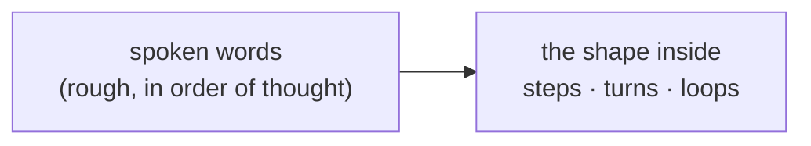
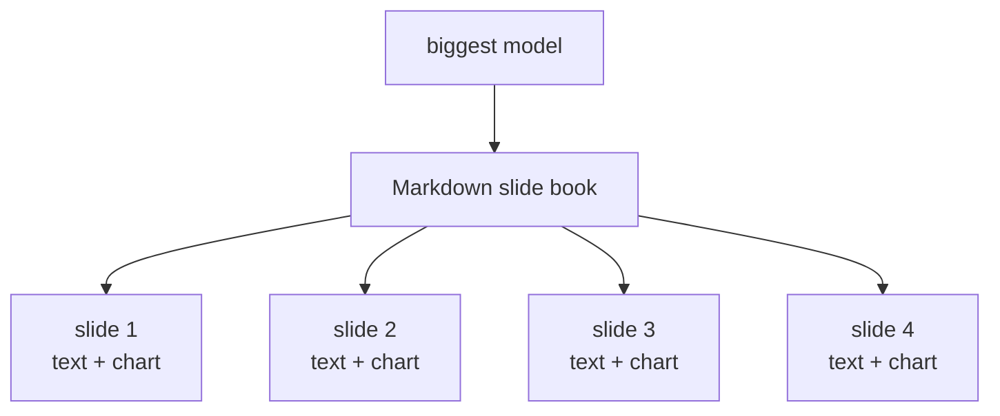
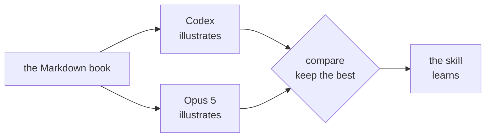
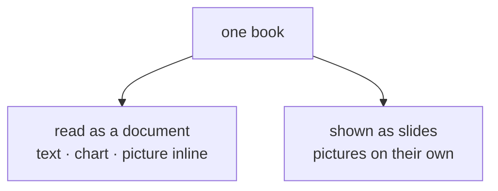

# The Visual Idea Publication

*An idea book about idea books. Four boxes. The charts are the flow of the idea; the pictures are made from the charts. This one is run through its own pipeline.*

## 1 · The idea is spoken

A psyche speaks an idea out loud. It arrives as words: a little rough, in order of thought, with a shape inside it that the words only half show. The first job is not to draw it. The first job is to find the shape: how many steps, what turns into what, where it loops.

![1 · The idea is spoken illustration](data:image/svg+xml,%3Csvg%20xmlns%3D%22http%3A%2F%2Fwww.w3.org%2F2000%2Fsvg%22%20viewBox%3D%220%200%20760%20430%22%20role%3D%22img%22%20aria-labelledby%3D%22vi1_t%20vi1_d%22%3E%3Ctitle%20id%3D%22vi1_t%22%3ESpoken%20words%20become%20a%20shape%3C%2Ftitle%3E%3Cdesc%20id%3D%22vi1_d%22%3EA%20voice%20ribbon%20feeds%20a%20lens%20that%20resolves%20it%20into%20steps%2C%20turns%20and%20a%20loop.%3C%2Fdesc%3E%3Cdefs%3E%3ClinearGradient%20id%3D%22vi1_g%22%20x1%3D%220%22%20x2%3D%221%22%3E%3Cstop%20stop-color%3D%22%235f56d8%22%2F%3E%3Cstop%20offset%3D%221%22%20stop-color%3D%22%23ed8e57%22%2F%3E%3C%2FlinearGradient%3E%3Cfilter%20id%3D%22vi1_s%22%3E%3CfeDropShadow%20dx%3D%220%22%20dy%3D%228%22%20stdDeviation%3D%228%22%20flood-opacity%3D%22.18%22%2F%3E%3C%2Ffilter%3E%3C%2Fdefs%3E%3Crect%20width%3D%22760%22%20height%3D%22430%22%20rx%3D%2228%22%20fill%3D%22%23f7f4ee%22%2F%3E%3Cpath%20d%3D%22M75%20218%20C130%20105%20185%20325%20245%20205%20S350%20145%20390%20212%22%20fill%3D%22none%22%20stroke%3D%22url%28%23vi1_g%29%22%20stroke-width%3D%2218%22%20stroke-linecap%3D%22round%22%2F%3E%3Cpath%20d%3D%22M50%20175%20Q86%20145%20113%20175%20M50%20250%20Q86%20280%20113%20250%22%20fill%3D%22none%22%20stroke%3D%22%2326334a%22%20stroke-width%3D%226%22%2F%3E%3Ccircle%20cx%3D%2295%22%20cy%3D%22212%22%20r%3D%2248%22%20fill%3D%22none%22%20stroke%3D%22%2326334a%22%20stroke-width%3D%226%22%2F%3E%3Cpath%20d%3D%22M395%20212%20H468%22%20stroke%3D%22%2326334a%22%20stroke-width%3D%225%22%20marker-end%3D%22url%28%23vi1_a%29%22%2F%3E%3Cdefs%3E%3Cmarker%20id%3D%22vi1_a%22%20viewBox%3D%220%20-7%2014%2014%22%20refX%3D%2212%22%20refY%3D%220%22%20markerWidth%3D%228%22%20markerHeight%3D%228%22%20orient%3D%22auto%22%3E%3Cpath%20d%3D%22M0-7%20L14%200%20L0%207Z%22%20fill%3D%22%2326334a%22%2F%3E%3C%2Fmarker%3E%3C%2Fdefs%3E%3Ccircle%20cx%3D%22550%22%20cy%3D%22212%22%20r%3D%2292%22%20fill%3D%22%23fff%22%20stroke%3D%22%2326334a%22%20stroke-width%3D%226%22%20filter%3D%22url%28%23vi1_s%29%22%2F%3E%3Cpath%20d%3D%22M505%20212h90M550%20167v90%22%20stroke%3D%22%235f56d8%22%20stroke-width%3D%2210%22%20stroke-linecap%3D%22round%22%2F%3E%3Ccircle%20cx%3D%22550%22%20cy%3D%22212%22%20r%3D%2226%22%20fill%3D%22%23ed8e57%22%2F%3E%3Ctext%20x%3D%22550%22%20y%3D%22340%22%20text-anchor%3D%22middle%22%20fill%3D%22%2326334a%22%20font-family%3D%22system-ui%22%20font-size%3D%2223%22%20font-weight%3D%22700%22%3Ethe%20shape%20inside%3C%2Ftext%3E%3C%2Fsvg%3E)

## 2 · The biggest model writes the book

The biggest model writes a slide book in plain Markdown: one slide per beat, a short paragraph each, and under each paragraph a Mermaid chart. The chart is not decoration. The chart *is* the flow of the idea, the main idea of the meme, drawn as boxes and arrows. Four steps become four boxes. A cycle becomes a ring. The book is already readable here, chart and text inline, before any picture exists.

![2 · The biggest model writes the book illustration](data:image/svg+xml,%3Csvg%20xmlns%3D%22http%3A%2F%2Fwww.w3.org%2F2000%2Fsvg%22%20viewBox%3D%220%200%20760%20430%22%20role%3D%22img%22%20aria-labelledby%3D%22vi2_t%20vi2_d%22%3E%3Ctitle%20id%3D%22vi2_t%22%3EA%20book%20opens%20into%20four%20slides%3C%2Ftitle%3E%3Cdesc%20id%3D%22vi2_d%22%3EA%20pen%20creates%20a%20book%2C%20whose%20single%20source%20branches%20visibly%20into%20four%20numbered%20slide%20pages.%3C%2Fdesc%3E%3Cdefs%3E%3ClinearGradient%20id%3D%22vi2_g%22%20x1%3D%220%22%20x2%3D%221%22%3E%3Cstop%20stop-color%3D%22%235f56d8%22%2F%3E%3Cstop%20offset%3D%221%22%20stop-color%3D%22%23ed8e57%22%2F%3E%3C%2FlinearGradient%3E%3Cfilter%20id%3D%22vi2_s%22%3E%3CfeDropShadow%20dx%3D%220%22%20dy%3D%228%22%20stdDeviation%3D%228%22%20flood-opacity%3D%22.18%22%2F%3E%3C%2Ffilter%3E%3Cmarker%20id%3D%22vi2_a%22%20viewBox%3D%220%20-7%2014%2014%22%20refX%3D%2212%22%20refY%3D%220%22%20markerWidth%3D%228%22%20markerHeight%3D%228%22%20orient%3D%22auto%22%3E%3Cpath%20d%3D%22M0-7%20L14%200%20L0%207Z%22%20fill%3D%22%2326334a%22%2F%3E%3C%2Fmarker%3E%3Cmarker%20id%3D%22vi2_w%22%20viewBox%3D%220%20-7%2014%2014%22%20refX%3D%2212%22%20refY%3D%220%22%20markerWidth%3D%228%22%20markerHeight%3D%228%22%20orient%3D%22auto%22%3E%3Cpath%20d%3D%22M0-7%20L14%200%20L0%207Z%22%20fill%3D%22%23ed8e57%22%2F%3E%3C%2Fmarker%3E%3C%2Fdefs%3E%3Crect%20width%3D%22760%22%20height%3D%22430%22%20rx%3D%2228%22%20fill%3D%22%23f7f4ee%22%2F%3E%3Cpath%20d%3D%22M74%20115l123%2088-28%2040-122-88z%22%20fill%3D%22%23ed8e57%22%20stroke%3D%22%2326334a%22%20stroke-width%3D%226%22%2F%3E%3Cpath%20d%3D%22M168%20238l-33%2073%2072-35%22%20fill%3D%22%235f56d8%22%20stroke%3D%22%2326334a%22%20stroke-width%3D%226%22%2F%3E%3Cpath%20d%3D%22M247%20214h67%22%20stroke%3D%22%2326334a%22%20stroke-width%3D%225%22%20marker-end%3D%22url%28%23vi2_a%29%22%2F%3E%3Cpath%20d%3D%22M329%20111q54-28%20108%200v150q-54-29-108%200z%22%20fill%3D%22%23fff%22%20stroke%3D%22%2326334a%22%20stroke-width%3D%226%22%20filter%3D%22url%28%23vi2_s%29%22%2F%3E%3Cpath%20d%3D%22M437%20111q54-28%20108%200v150q-54-29-108%200z%22%20fill%3D%22%23fff%22%20stroke%3D%22%2326334a%22%20stroke-width%3D%226%22%2F%3E%3Cpath%20d%3D%22M437%20111v150M355%20149h56M355%20183h52M464%20149h54M464%20183h49%22%20stroke%3D%22%235f56d8%22%20stroke-width%3D%228%22%20stroke-linecap%3D%22round%22%2F%3E%3Cpath%20d%3D%22M545%20186c48%200%2038-75%2084-75M545%20186c48%200%2038%2075%2084%2075%22%20fill%3D%22none%22%20stroke%3D%22%2326334a%22%20stroke-width%3D%225%22%2F%3E%3Cg%20stroke%3D%22%2326334a%22%20stroke-width%3D%225%22%20filter%3D%22url%28%23vi2_s%29%22%3E%3Crect%20x%3D%22630%22%20y%3D%2261%22%20width%3D%2272%22%20height%3D%2276%22%20rx%3D%229%22%20fill%3D%22%23fff%22%2F%3E%3Crect%20x%3D%22630%22%20y%3D%22155%22%20width%3D%2272%22%20height%3D%2276%22%20rx%3D%229%22%20fill%3D%22%23fff%22%2F%3E%3Crect%20x%3D%22630%22%20y%3D%22249%22%20width%3D%2272%22%20height%3D%2276%22%20rx%3D%229%22%20fill%3D%22%23fff%22%2F%3E%3Crect%20x%3D%22630%22%20y%3D%22343%22%20width%3D%2272%22%20height%3D%2255%22%20rx%3D%229%22%20fill%3D%22%23fff%22%2F%3E%3C%2Fg%3E%3Cg%20fill%3D%22%23ed8e57%22%20font-family%3D%22system-ui%22%20font-size%3D%2218%22%20font-weight%3D%22800%22%20text-anchor%3D%22middle%22%3E%3Ctext%20x%3D%22666%22%20y%3D%22105%22%3E01%3C%2Ftext%3E%3Ctext%20x%3D%22666%22%20y%3D%22199%22%3E02%3C%2Ftext%3E%3Ctext%20x%3D%22666%22%20y%3D%22293%22%3E03%3C%2Ftext%3E%3Ctext%20x%3D%22666%22%20y%3D%22378%22%3E04%3C%2Ftext%3E%3C%2Fg%3E%3Ctext%20x%3D%22462%22%20y%3D%22347%22%20text-anchor%3D%22middle%22%20fill%3D%22%2326334a%22%20font-family%3D%22system-ui%22%20font-size%3D%2221%22%20font-weight%3D%22800%22%3Eone%20source%20%E2%86%92%20four%20slide%20beats%3C%2Ftext%3E%3C%2Fsvg%3E)

## 3 · Two illustrators, one brief, compared

The same book goes to two illustrators: Codex and Opus 5. Each turns every slide's chart plus its text into one picture: a comic panel, a ring of four seasons, four boxes with arrows, whatever the chart's shape asks for. Neither sees the other's work. Then the two books of pictures are laid side by side and the better illustration of each idea is kept. The skill learns from which one was kept.

![3 · Two illustrators, one brief, compared illustration](data:image/svg+xml,%3Csvg%20xmlns%3D%22http%3A%2F%2Fwww.w3.org%2F2000%2Fsvg%22%20viewBox%3D%220%200%20760%20430%22%20role%3D%22img%22%20aria-labelledby%3D%22vi3_t%20vi3_d%22%3E%3Ctitle%20id%3D%22vi3_t%22%3ECodex%20and%20Opus%205%20compete%20then%20teach%20the%20skill%3C%2Ftitle%3E%3Cdesc%20id%3D%22vi3_d%22%3EA%20labeled%20manuscript%20branches%20to%20two%20named%20illustrators%2C%20meets%20at%20a%20selection%2C%20and%20continues%20to%20skill%20learning.%3C%2Fdesc%3E%3Cdefs%3E%3ClinearGradient%20id%3D%22vi3_g%22%20x1%3D%220%22%20x2%3D%221%22%3E%3Cstop%20stop-color%3D%22%235f56d8%22%2F%3E%3Cstop%20offset%3D%221%22%20stop-color%3D%22%23ed8e57%22%2F%3E%3C%2FlinearGradient%3E%3Cfilter%20id%3D%22vi3_s%22%3E%3CfeDropShadow%20dx%3D%220%22%20dy%3D%228%22%20stdDeviation%3D%228%22%20flood-opacity%3D%22.18%22%2F%3E%3C%2Ffilter%3E%3Cmarker%20id%3D%22vi3_a%22%20viewBox%3D%220%20-7%2014%2014%22%20refX%3D%2212%22%20refY%3D%220%22%20markerWidth%3D%228%22%20markerHeight%3D%228%22%20orient%3D%22auto%22%3E%3Cpath%20d%3D%22M0-7%20L14%200%20L0%207Z%22%20fill%3D%22%2326334a%22%2F%3E%3C%2Fmarker%3E%3Cmarker%20id%3D%22vi3_w%22%20viewBox%3D%220%20-7%2014%2014%22%20refX%3D%2212%22%20refY%3D%220%22%20markerWidth%3D%228%22%20markerHeight%3D%228%22%20orient%3D%22auto%22%3E%3Cpath%20d%3D%22M0-7%20L14%200%20L0%207Z%22%20fill%3D%22%23ed8e57%22%2F%3E%3C%2Fmarker%3E%3C%2Fdefs%3E%3Crect%20width%3D%22760%22%20height%3D%22430%22%20rx%3D%2228%22%20fill%3D%22%23f7f4ee%22%2F%3E%3Cpath%20d%3D%22M55%20142h137v152H55z%22%20fill%3D%22%23fff%22%20stroke%3D%22%2326334a%22%20stroke-width%3D%226%22%20filter%3D%22url%28%23vi3_s%29%22%2F%3E%3Cpath%20d%3D%22M82%20183h82M82%20215h58M82%20247h86%22%20stroke%3D%22%235f56d8%22%20stroke-width%3D%228%22%20stroke-linecap%3D%22round%22%2F%3E%3Ctext%20x%3D%22124%22%20y%3D%22320%22%20text-anchor%3D%22middle%22%20fill%3D%22%2326334a%22%20font-family%3D%22system-ui%22%20font-size%3D%2218%22%20font-weight%3D%22800%22%3Eone%20Markdown%20book%3C%2Ftext%3E%3Cpath%20d%3D%22M192%20218c94%200%2085-105%20155-105M192%20218c94%200%2085%20105%20155%20105%22%20fill%3D%22none%22%20stroke%3D%22%2326334a%22%20stroke-width%3D%225%22%20marker-end%3D%22url%28%23vi3_a%29%22%2F%3E%3Cg%20stroke%3D%22%2326334a%22%20stroke-width%3D%225%22%20filter%3D%22url%28%23vi3_s%29%22%3E%3Ccircle%20cx%3D%22406%22%20cy%3D%22108%22%20r%3D%2263%22%20fill%3D%22%235f56d8%22%2F%3E%3Ccircle%20cx%3D%22406%22%20cy%3D%22328%22%20r%3D%2263%22%20fill%3D%22%23ed8e57%22%2F%3E%3C%2Fg%3E%3Cpath%20d%3D%22M376%20126l25-59%2033%2059-26-9z%22%20fill%3D%22%23fff%22%2F%3E%3Cpath%20d%3D%22M369%20332q37-48%2074%200%22%20fill%3D%22none%22%20stroke%3D%22%23fff%22%20stroke-width%3D%229%22%2F%3E%3Cg%20fill%3D%22%2326334a%22%20font-family%3D%22system-ui%22%20font-size%3D%2219%22%20font-weight%3D%22800%22%20text-anchor%3D%22middle%22%3E%3Ctext%20x%3D%22406%22%20y%3D%22199%22%3ECodex%20illustrates%3C%2Ftext%3E%3Ctext%20x%3D%22406%22%20y%3D%22418%22%3EOpus%205%20illustrates%3C%2Ftext%3E%3C%2Fg%3E%3Cpath%20d%3D%22M470%20108c72%200%2068%20110%20115%20110M470%20328c72%200%2068-110%20115-110%22%20fill%3D%22none%22%20stroke%3D%22%2326334a%22%20stroke-width%3D%225%22%2F%3E%3Cpath%20d%3D%22M622%20160l51%2058-51%2058-51-58z%22%20fill%3D%22%23fff%22%20stroke%3D%22%2326334a%22%20stroke-width%3D%226%22%20filter%3D%22url%28%23vi3_s%29%22%2F%3E%3Cpath%20d%3D%22M600%20218l17%2018%2030-36%22%20fill%3D%22none%22%20stroke%3D%22%235f56d8%22%20stroke-width%3D%2210%22%20stroke-linecap%3D%22round%22%2F%3E%3Ctext%20x%3D%22622%22%20y%3D%22304%22%20text-anchor%3D%22middle%22%20fill%3D%22%2326334a%22%20font-family%3D%22system-ui%22%20font-size%3D%2218%22%20font-weight%3D%22800%22%3Ekeep%20best%3C%2Ftext%3E%3Cpath%20d%3D%22M674%20218h52%22%20stroke%3D%22%2326334a%22%20stroke-width%3D%225%22%20marker-end%3D%22url%28%23vi3_a%29%22%2F%3E%3Ctext%20x%3D%22702%22%20y%3D%22182%22%20text-anchor%3D%22middle%22%20fill%3D%22%2326334a%22%20font-family%3D%22system-ui%22%20font-size%3D%2217%22%20font-weight%3D%22800%22%3Eskill%3C%2Ftext%3E%3Ctext%20x%3D%22702%22%20y%3D%22202%22%20text-anchor%3D%22middle%22%20fill%3D%22%2326334a%22%20font-family%3D%22system-ui%22%20font-size%3D%2217%22%20font-weight%3D%22800%22%3Elearns%3C%2Ftext%3E%3C%2Fsvg%3E)

## 4 · Two ways to read it

The result reads two ways. In the Markdown, with the pictures inline, the idea is a document: text, chart, picture, next. As slides on their own, it is a deck to show. Both are the same book. This page is the first run: written by the biggest model, sent to both illustrators, and the pictures you see beside it are whichever won.

![4 · Two ways to read it illustration](data:image/svg+xml,%3Csvg%20xmlns%3D%22http%3A%2F%2Fwww.w3.org%2F2000%2Fsvg%22%20viewBox%3D%220%200%20760%20430%22%20role%3D%22img%22%20aria-labelledby%3D%22vi4_t%20vi4_d%22%3E%3Ctitle%20id%3D%22vi4_t%22%3EOne%20book%2C%20two%20readings%3C%2Ftitle%3E%3Cdesc%20id%3D%22vi4_d%22%3EA%20single%20bound%20source%20fans%20into%20a%20scrolling%20document%20and%20a%20projected%20slide%20deck.%3C%2Fdesc%3E%3Cdefs%3E%3ClinearGradient%20id%3D%22vi4_g%22%20x1%3D%220%22%20x2%3D%221%22%3E%3Cstop%20stop-color%3D%22%235f56d8%22%2F%3E%3Cstop%20offset%3D%221%22%20stop-color%3D%22%23ed8e57%22%2F%3E%3C%2FlinearGradient%3E%3Cfilter%20id%3D%22vi4_s%22%3E%3CfeDropShadow%20dx%3D%220%22%20dy%3D%228%22%20stdDeviation%3D%228%22%20flood-opacity%3D%22.18%22%2F%3E%3C%2Ffilter%3E%3C%2Fdefs%3E%3Crect%20width%3D%22760%22%20height%3D%22430%22%20rx%3D%2228%22%20fill%3D%22%23f7f4ee%22%2F%3E%3Cpath%20d%3D%22M285%20118%20Q380%2076%20475%20118v196Q380%20270%20285%20314z%22%20fill%3D%22%23fff%22%20stroke%3D%22%2326334a%22%20stroke-width%3D%226%22%20filter%3D%22url%28%23vi4_s%29%22%2F%3E%3Cpath%20d%3D%22M380%20100v190%22%20stroke%3D%22%2326334a%22%20stroke-width%3D%225%22%2F%3E%3Cpath%20d%3D%22M317%20150h48M317%20184h42M396%20150h48M396%20184h42%22%20stroke%3D%22%235f56d8%22%20stroke-width%3D%228%22%20stroke-linecap%3D%22round%22%2F%3E%3Cpath%20d%3D%22M282%20225%20C180%20225%20183%20165%20120%20165%22%20fill%3D%22none%22%20stroke%3D%22%2326334a%22%20stroke-width%3D%225%22%2F%3E%3Cpath%20d%3D%22M478%20225%20C580%20225%20577%20165%20640%20165%22%20fill%3D%22none%22%20stroke%3D%22%2326334a%22%20stroke-width%3D%225%22%2F%3E%3Crect%20x%3D%2262%22%20y%3D%22118%22%20width%3D%22115%22%20height%3D%22165%22%20rx%3D%2210%22%20fill%3D%22%23ed8e57%22%20stroke%3D%22%2326334a%22%20stroke-width%3D%226%22%2F%3E%3Cpath%20d%3D%22M85%20154h68M85%20185h58M85%20216h70%22%20stroke%3D%22%23fff%22%20stroke-width%3D%228%22%2F%3E%3Crect%20x%3D%22580%22%20y%3D%22116%22%20width%3D%22125%22%20height%3D%22100%22%20rx%3D%2210%22%20fill%3D%22%235f56d8%22%20stroke%3D%22%2326334a%22%20stroke-width%3D%226%22%2F%3E%3Ccircle%20cx%3D%22642%22%20cy%3D%22166%22%20r%3D%2225%22%20fill%3D%22%23ed8e57%22%2F%3E%3Cpath%20d%3D%22M598%20252h90%22%20stroke%3D%22%2326334a%22%20stroke-width%3D%228%22%2F%3E%3Ctext%20x%3D%22120%22%20y%3D%22327%22%20text-anchor%3D%22middle%22%20fill%3D%22%2326334a%22%20font-family%3D%22system-ui%22%20font-size%3D%2221%22%20font-weight%3D%22700%22%3Edocument%3C%2Ftext%3E%3Ctext%20x%3D%22642%22%20y%3D%22293%22%20text-anchor%3D%22middle%22%20fill%3D%22%2326334a%22%20font-family%3D%22system-ui%22%20font-size%3D%2221%22%20font-weight%3D%22700%22%3Eslides%3C%2Ftext%3E%3C%2Fsvg%3E)

*Source: the living's words of 2026-09-16 in flows/f55ec8/vision/visualPublication.md.*
