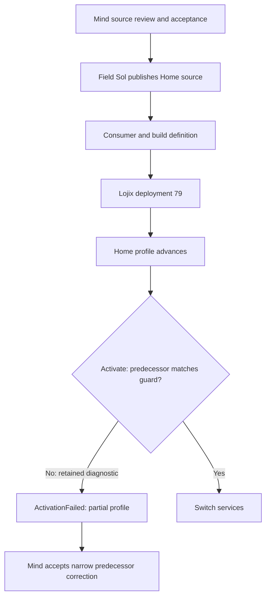
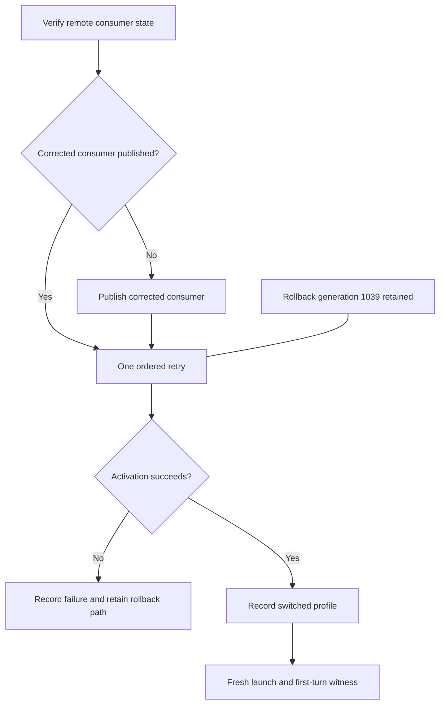
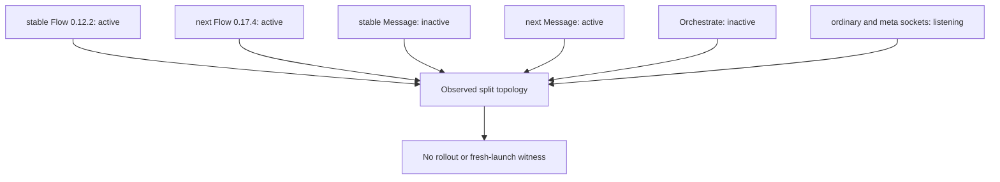
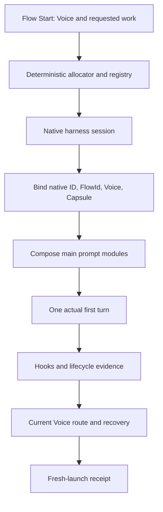

# Home deployment and Flow anatomy

## 1. Why deployment stalled — retained facts, timeline pending

The living's production request is explicit:

> Yeah I want the deployment done. Somebody's asking me in one of the cloud
> artifacts about the home deployment that was blocked for some reason. I don't
> know why it was blocked but I would like it unblocked and deployed. I want to
> test these components in actual starting new flows and things.

— psyche, typed, 2026-10-03; [Opus record](../../5578cc/log.md).

The retained terminal evidence says Lojix deployment 79 advanced the Home
profile, then its resulting Home Manager generation failed at `Activate` with
`ActivationFailed`, exit status 1. Activation refused to replace the
non-legacy `~/.local/bin/messenger-clj` binding because the actual managed-file
predecessor did not match the source guard. Profile advancement is therefore a
partial result, not a successful switch.

The correction recognizes the observed predecessor while preserving refusal of
foreign files, links, wrong roots, and aliases. It is a repair to the guard's
known predecessor, not a relaxation of ownership protection. The exact full
activation stderr and journal context are not retained in this packet.

The full delay chronology is **pending**. Opus and Mind are restoring and
compiling it under their home-deployment-report lock; this report does not
duplicate their investigation or touch their artifact. This section contains
only the retained terminal mechanism until their timeline is available.

## 2. How the ordered fix works

Opus's direct co-report records the living's disposition: Field Sol, as sole
executor, verifies the remote state, publishes the corrected consumer if it is
not already published, then makes one retry while retaining rollback generation
1039. Field Astra coordinates. Mind has completed source review for this
correction and returns to Flow design.

A later Field log says the consumer was subsequently published and its remote
branch matched, while the retained deployment evidence says it remained local
after an earlier GitHub SSH attempt had no route. Both records say no retry was
submitted. The SSH result is historical; it does not prove the current route is
blocked. Field's execution receipt resolves the remote state and records the
terminal retry outcome. Those are receipts of the ordered work, not added
review gates.

Current Field fact: the remote Goldragon Horizon build succeeded, but the
qualified transfer through the configured builder failed SSH authentication
before transfer. No local build, credential read, bypass, or retry followed;
the proposed new Lojix deployment was not materialized. The current blocker is
builder authorization, not the earlier no-route result. Field's sanitized
transfer receipt will name the endpoint label, command class, error class, and
owner of builder authorization without exposing credentials.

## 3. Current anatomy

Rollback generation 1039 still has a profile link and activation entrypoint.
The current Home profile is another generation, but retained evidence does not
show it was produced by deployment 79.

The observed runtime is split: stable Flow is active at 0.12.2, next Flow at
0.17.4, stable Message is inactive, next Message is active, and Orchestrate is
inactive while ordinary and meta sockets listen. Stable and next socket pairs
exist. This does not establish a completed rollout, a socket/process owner, a
fresh launch, or a first turn.

The qualified source record exists. Current detached checkouts and untracked
build material mean those directories are not authoritative execution sources;
they do not mean the source was lost.

Fable's native succession is independent. Field's retained result says the
predecessor pane and Messenger route were closed after successor and handover
verification, with recovery assets preserved. That completed retirement neither
repairs Home activation nor publishes a consumer.

## 4. Needed anatomy: a working Flow after Home succeeds

A successful Home switch provides the runtime substrate. Flow then needs a
durable, readable address, a bound native session, prompt composition, lifecycle
evidence, and a fresh first turn.

**Address and registry.** The living asked for words that can be converted back:

> Well it seems to me that the first 33 bits of the actual ID we were using
> from the harness's ID is what we're using and then converting it into words
> because then we can go back.

— psyche, typed book comment, 2026-10-03T15:59,
[identifier record](../../5578cc/vision/identifiers.md).

Three words recover the selected 33-bit Flow value, then deterministic code
uses the full native-ID registry to locate transcript candidates. A collision
must remain explicit; it must never silently select a transcript. The separate
Voice registry resolves a durable voice such as `Psyche.Primary` to its current
Flow.

The literal first-33-bit proposal is an informed design choice still pending:
for a UUIDv7 it is time-shaped, while the current Codex alias evidence points
to a random-tail location. Selecting a Codex random tail avoids the timestamp
problem, but does not settle allocation, collision, or whether it is the living's
chosen interpretation. It must not be presented as settled.

**Deterministic work.** The living requested an Intent statement:

> Let's make this so we need something developed into intent: that we intend
> to do anything that is deterministic into code, to save the context, cost,
> and noise that making an LLM do it would incur.

— psyche, typed book comment, 2026-10-03T16:17,
[Flow record](../../5578cc/vision/flow.md).

A proposed exact Intent wording still needs the living's yes; this quote is the
direction, not approval of an invented final sentence. Allocation, registry
lookup, collision handling, and receipt comparison belong in deterministic code;
the model receives the readable Flow address and result.

**Prompt modules in Ethos.** The living requested a prompt anatomy split into
behavior, personality, and operational safety:

> We need to draw up the anatomy of this in ethos ... splitting them up into:
> - what this is
> - is this behavior?
> - is this personality?
> - is this operational safety?

— psyche, typed book comment, 2026-10-03T16:20,
[system-prompt record](../vision/systemPrompt.md).

A candidate Ethos boundary is
`PromptModule.[ Behavior Personality OperationalSafety ]`, with each module
also declaring its audience and inheritance rule. The main Flow receives the
composed prompt. Current Claude evidence supports main-only system/append
markers in the observed cases, but does not settle native fork or output-style
inheritance; Codex subagent inheritance also remains unproven. Module handling
must therefore record the harness-specific evidence rather than promise a
withheld module it cannot enforce.

Finally, the living withdrew the inferred “questions only” rule:

> No, I never meant that, even if it sounded like it. ... I'm expressing myself
> through examples. You have to try to understand the philosophy behind my acts
> to see the posture behind the movement.

— psyche, typed book comment, 2026-10-03T17:49,
[reading record](../../edf227/vision/readingTheLiving.md).

This preserves context and relevance as a judgment, without inventing a
prohibition on what Psyche may receive.

## Sources

- [Field deployment 79 evidence](../../42265e/reports/home-deployment-79-evidence.md)
- [Field retirement result](../../42265e/reports/retirement-result.md)
- [Field deployment log](../../42265e/log.md), deployment entries dated 2026-10-03
- [Field Astra coordination record](../../7de94a/log.md), ownership entries
- [Mind Home review](../../41fa34/log.md), Home deployment review entry
- [Opus living and deployment record](../../5578cc/log.md)
- [Identifier vision](../../5578cc/vision/identifiers.md)
- [Deterministic-work and prompt-module vision](../../5578cc/vision/flow.md)
