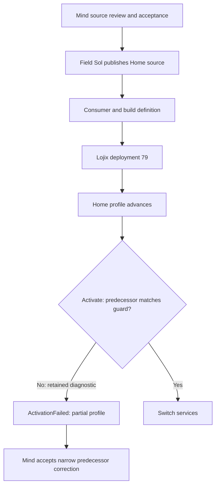
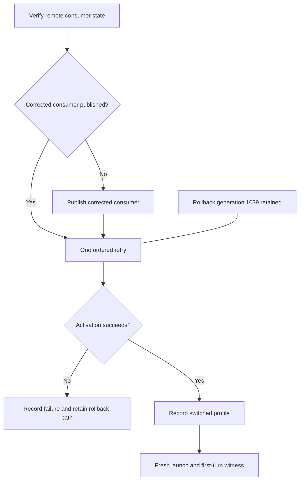
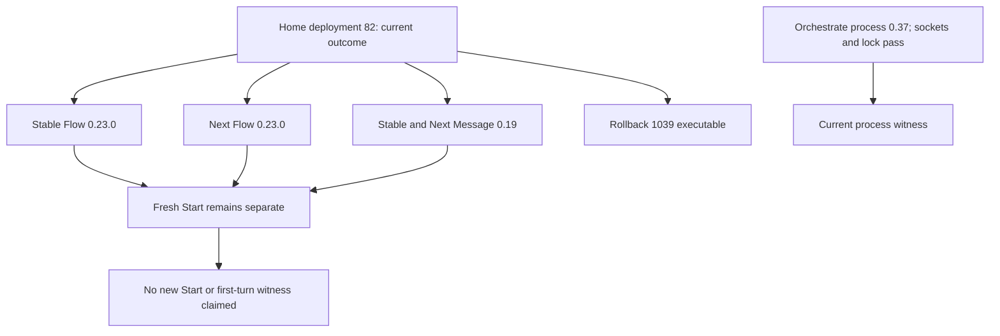
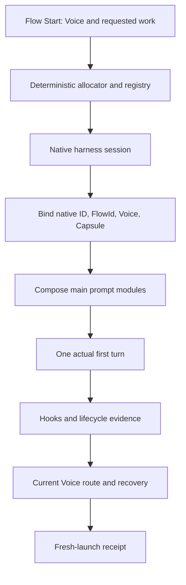
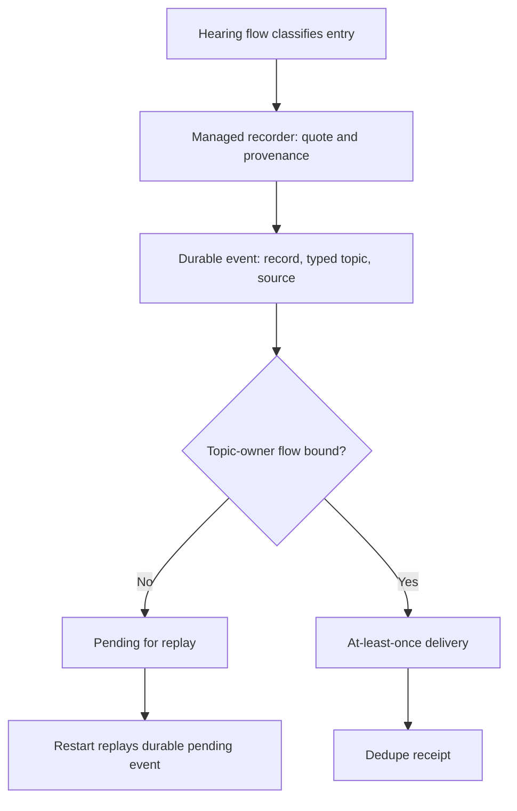

# Home deployment and Flow anatomy

## 1. Why deployment stalled, then unblocked

The living's production request is explicit:

> Yeah I want the deployment done. Somebody's asking me in one of the cloud
> artifacts about the home deployment that was blocked for some reason. I don't
> know why it was blocked but I would like it unblocked and deployed. I want to
> test these components in actual starting new flows and things.

— psyche, typed, 2026-10-03; [Opus record](../../5578cc/log.md).

The historical terminal mechanism is clear. Lojix deployment 79 advanced the
Home profile, then its resulting Home Manager generation failed at `Activate`
with `ActivationFailed`, exit status 1. Activation refused to replace the non-legacy
`~/.local/bin/messenger-clj` binding because the actual managed-file
predecessor did not match the source guard. Profile advancement was partial, not
a successful switch.



The correction recognized the observed predecessor while preserving refusal of
foreign files, links, wrong roots, and aliases. It repaired the guard's known
predecessor without relaxing the ownership boundary. The full activation stderr
and journal context are not retained in this packet.

Home deployment 82 subsequently completed. The witnessed outcome has stable
and Next Flow 0.23.0, stable and Next Message 0.19, `orchestrate-nexus` 0.37
answering ordinary and meta requests, and a successful deployment-lock acquire
and release. The old hand override is gone; rollback generation 1039 remains
executable. This closes the deployment blockage, while a fresh Flow Start and
first-turn witness remain separate evidence.

### Timeline and causes

There were three attempts. The first, around 12:40, built a regular-slot
candidate but did not activate; it stopped with the restart of Psyche seats.
The second activated at 13:00 and found the same binding guard fault. Its guard
fix existed at 13:29, but the work then waited without an executor until the
later production order. The third began after that order: Lojix accepted
deployment 79 at 16:51, and it failed at 16:55 with the same guard refusal.

The timeline identifies one root technical fault and several conditions that
kept it from completing: the pinned predecessor guard; no overnight activation
test; a deployment record that does not retain its Horizon artifact and transport
tuple for a one-command retry; and a later builder SSH-authentication failure.
A historical GitHub SSH no-route delayed consumer publication. It does not
prove that the current route is unavailable.

It also records process causes: the order was turned back into questions after
the first failure despite the available fix; seat changes stopped executors;
Opus's 16:04 handoff to Field did not carry the earlier attempt, report, or fix;
evidence requests acted as gates after Mind had said there was no extra approval
gate; and the sole executor was shared with other urgent work. The dropped
handoff is Opus's own recorded failure, not a Field source failure.

## 2. How the ordered fix worked

Opus's direct co-report recorded the living's disposition: Field Sol, as sole
executor, verified the remote state, published the corrected consumer where
needed, then made one retry while retaining rollback generation 1039. Field
Astra coordinated. Mind completed source review for the correction and returned
to Flow design. The Home 82 witness above is the resulting deployment outcome.

Mind Astra owns the source and controller design. Field Astra coordinates.
Field Sol executes. Mind Sol and Opus review the resulting evidence. These
roles do not add a gate to the authorized local-build-or-login-repair route.



The timeline says deployment 79 retained neither its Horizon artifact nor
transport tuple, so retry construction stopped after the remote Horizon
definition built and its output was unavailable on this host. The prior Field
attempt then stopped before transfer when the configured builder rejected SSH
authentication; no local build, credential read, bypass, retry, or new Lojix
deployment occurred in that attempt.

Before Home deployment 80, Opus authorized Field Sol to take either route that
became available first: make a **new local Goldragon Horizon-definition build**,
or repair the **supported builder login**, then submit **one** Lojix retry with
rollback 1039 retained. Home 82 is the successful deployment outcome recorded in the next section.
That authority did not authorize duplicate retries.

## 3. Home 82 outcome and present deployment boundary

Home deployment 82 is the current supplied runtime outcome. Stable and Next
`flow-nexus` processes run Flow 0.23.0, stable and Next Message processes run
Message 0.19, and the old hand override is gone. `orchestrate-nexus` runs
0.37; its sockets are present and the deployment lock passed. Rollback
generation 1039 remains executable. These facts establish the Home deployment
outcome; they do not themselves establish a fresh Flow Start or first-turn
result.

The earlier 18:00 topology is historical only: it recorded stable
`flow-nexus` 0.12.2 under a hand override, Next 0.17.4, and the then-active
Message/Orchestrate units. It is retained to explain the failure chronology,
not as current status.



A separate requested Field main-Flow Start is still only a review artifact.
Its non-private profile was transcribed from the current hand launcher, while
Field’s private endpoint and Herdr/native binding are awaited. No Start,
native thread, user turn, or voice assignment follows from Home 80 or from
that artifact.

## 4. Needed anatomy: a working Flow after Home succeeds

A successful Home switch provides the runtime substrate. Flow then needs a
durable readable address, a bound native session, prompt composition, lifecycle
evidence, and a fresh first turn. Flow does no sandboxing now: test isolation
is an external setup. Flow-owned Memory/database meta configuration holds its
model, harness, and effort mapping; it is not a Markdown knowledge skill.

The design separates four roots: Library defines shared kinds; Signal is the
public request/response surface; Operation describes durable work; Memory holds
admission, registry, attempts, and receipts. It uses the four layers Primary,
Secondary, Tertiary, and Quaternary under each aspect. For the MVP, a title
carries aspect, layer, and the existing typed harness-hash FlowId. Wordable
rendering is deferred: it is neither a title requirement nor a launch gate.
A later 33-bit specialization may use Wordable's canonical words for supported
bit widths; its generator-checked form has exactly four sections: superkinds,
associated kinds, constants, and capabilities.

```ethos
Library
[]
[ DictionaryVersion.{ DictionaryName.String Revision.Integer }
  WordParseError.[ Empty
                   NonCanonicalText
                   UnknownWord.String
                   WrongWordCount.{ Integer Integer }
                   InvalidIndex.Integer
                   DictionaryMismatch.{ DictionaryVersion DictionaryVersion }
                   NonCanonicalPadding ] ]
[ Wordable.{ []
             [ Dictionary
               Words ]
             [ WIDTH_BITS.Integer ]
             [ as_words.[ Words ]
               parse_words:{ [ Words ]
                             [ Result<Self WordParseError> ] } ] } ]
[]
```

`Dictionary` and `Words` are associated kinds. Their constraints belong to
kinds, not to a concrete Flow type. `WordParseError` covers parsing; width
configuration errors are separate from parse errors. This excerpt follows the
generator-checked book form; the surrounding combined Flow design is still not
claimed to compile without its own test.
Compiled roles receive the smallest standing prompt, authority, and result form
needed for their work; deterministic data handling remains outside model turns.



**Address and registry.** The MVP registry uses the existing typed
harness-hash FlowId. Raw hash material stays machine-internal; readable
receipts carry an artifact name, path, and match or mismatch state. A later
three-word representation may recover a selected 33-bit value and then use the
full native-ID registry to return every transcript candidate. On a collision it
reports Psyche and never silently selects, reallocates, or routes one candidate.
A separate Voice registry resolves a durable voice such as `Psyche.Primary` to
its current Flow. That future rendering does not block Home deployment, Start,
or the first turn.

**Deterministic work.** The living requested an Intent statement:

> Let's make this so we need something developed into intent: that we intend
> to do anything that is deterministic into code, to save the context, cost,
> and noise that making an LLM do it would incur.

— psyche, typed book comment, 2026-10-03T16:17,
[Flow record](../../5578cc/vision/flow.md).

A proposed exact Intent wording still needs the living's yes; this quote is the
direction, not approval of an invented final sentence. Allocation, registry
lookup, collision handling, and receipt comparison belong in deterministic code;
the model receives a readable Flow address and result.

**Prompt modules in Ethos.** The living requested a prompt anatomy split into
behavior, personality, and operational safety:

> We need to draw up the anatomy of this in ethos ... splitting them up into:
> - what this is
> - is this behavior?
> - is this personality?
> - is this operational safety?

— psyche, typed book comment, 2026-10-03T16:20,
[system-prompt record](../vision/systemPrompt.md).

A candidate Ethos boundary is
`PromptModule.[ Behavior Personality OperationalSafety ]`, with each module
also declaring its audience and inheritance rule. The main Flow receives the
composed prompt. Current Claude evidence supports main-only system/append
markers in observed cases, but does not settle native fork or output-style
inheritance; Codex subagent inheritance also remains unproven. Module handling
must record harness-specific evidence rather than promise a withheld module it
cannot enforce.

**Vision relay.** The hearing flow classifies an entry as Vision, Notion, or an
instruction. A managed recorder preserves the exact quote and provenance in
its own lane, then durably queues an event containing the record identity,
typed topic, and source. The Flow-declared topic tree uses variants, with deeper
variants as subtopics; its exact shape remains pending Fable confirmation.
Deterministic code resolves the current flow that owns the topic, delivers at
least once with a dedupe receipt, and replays durable pending events after a
restart. It never polls, asks an LLM to check delivery, or distills the entry
automatically. If no topic owner is present, the event remains pending.



The settled delivery rule is no per-entry wake: after the minimum window, route
the event with the topic owner's next ordinary messages. This follows the
living's STT question, “Are my words being logged as vision ... and then is
Psyche notified that there's new vision?”, and his later STT direction that a
vision or notion touching a psyche's topic “should be routed to that flow” the
next time it receives messages, after at least a minimum window
([vision notification](../vision/visionNotification.md)). Recorder crash
recovery never claims a notification for an unpersisted entry. A raw-file
bypass needs a filesystem-event adapter plus startup reconciliation; it cannot
silently claim the same guarantee. Broad accounting, quota, and priority policy
remain a separate future notion, not a delivery gate.

Finally, the living withdrew the inferred “questions only” rule:

> No, I never meant that, even if it sounded like it. What I'm saying is, I
> don't know yet. I'm trying to design a better system, and it feels like
> Psyche [Fable]'s time should be reserved for important things. It's that
> mentality, translated into a certain situation, that makes you infer that
> these very specific rules should become the law. That's not what I mean. I'm
> expressing myself through examples. You have to try to understand the
> philosophy behind my acts to see the posture behind the movement.

— psyche, typed book comment, 2026-10-03T17:49,
[behavior record](../../5578cc/vision/behavior.md).

This preserves context and relevance as a judgment, without inventing a
prohibition on what Psyche may receive.

## Sources

- [Opus deployment timeline](../../5578cc/reports/deployment-timeline-2026-10-03.md)
- [Field deployment 79 evidence](../../42265e/reports/home-deployment-79-evidence.md)
- [Field retirement result](../../42265e/reports/retirement-result.md)
- [Field deployment log](../../42265e/log.md), deployment entries dated 2026-10-03
- [Mind Home review](../../41fa34/log.md), Home deployment review entry
- [Opus living and deployment record](../../5578cc/log.md)
- [Identifier vision](../../5578cc/vision/identifiers.md)
- [Deterministic-work and prompt-module vision](../../5578cc/vision/flow.md)
