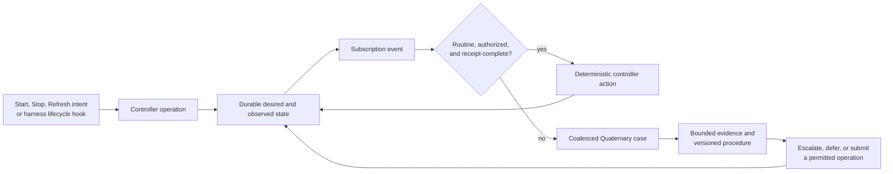

# Field Quaternary lifecycle desk

## Decision

Give `Voice.{ Field Quaternary }` one lifecycle-desk role. It is an
exception-handling operator with a small, versioned Field skill library; it is
not the source of truth and it does not inspect an idle flow repeatedly. The
durable Flow controller owns lifecycle state, authorization, routing, and
receipts. The desk receives a subscription snapshot at registration and events
when state changes. It is quiet while nothing changes.

This applies the living's order to let Field Quaternary monitor, bring up and
bring down flows, develop the right handover, and extract proven skills that
reduce later handover context ([source](../vision/fieldLifecycleOperator.md)).
It also preserves the existing Flow rule that a refreshed session reaps its
replaced end from message routing, rather than leaving a dead end addressable
([Flow Nexus](../../../Vision/flowNexus.md)). `Idle` is an observed working
state, not a failure and not an instruction to end a flow.

## State and authority boundary

The controller maintains two separate records for every flow:

| Record | Meaning | Writer |
|---|---|---|
| Desired state | Authorized target: `Running`, `Stopped`, or `Refreshed` with a successor request | authorized ordinary/meta operation |
| Observed state | What the controller/harness has actually confirmed: admitted, started, bound, idle, stopped, refused, or ambiguous | typed controller outcome or harness hook |

The desk never turns an observation into a desired state by itself. It may
submit the routine action only when the existing authority attached to the
operation permits it. It escalates an exception when desired and observed state
diverge, when an identifier/binding is ambiguous, or when a required receipt is
missing. A refused Start is evidence, not a reason to invent another attempt.

The current lifecycle record exposes typed Start and Flow-ID routing, but does
not establish the complete cross-harness event bridge. The latest retained
private Start reached `BindingRefused` after Claude started and the controller
discarded the internal guard reason. This design therefore requires a durable,
typed refusal/observation record before the desk may classify a refusal as a
known procedure. It does not infer a specific guard from that event.

## Event-driven operation queue



The durable queue contains operation intents and exception cases, never a
periodic “check every flow” job. An exception case has a stable key such as
`flow + desired transition + observed condition`; later identical events update
its evidence and count rather than waking the desk repeatedly. A case contains
only the current desired/observed states, operation receipt handles, relevant
binding/route facts, authority boundary, and the procedure version tried. It
keeps ambiguous attempts rather than choosing one candidate.

Routine controller actions are deterministic: record an authorized Start,
Stop, or Refresh request; perform the supported operation; persist its typed
outcome; and publish the corresponding subscription event. Field Quaternary
handles only the bounded remainder: select an already-approved procedure,
request missing evidence, recommend escalation, or record that the case is
pending. It cannot broaden an operation's authority, wake a flow merely to
monitor it, bypass a refusal, or treat model reasoning as a state oracle.

## Refresh and close

Refresh is one linked transaction:

```mermaid
sequenceDiagram
  participant C as Controller
  participant S as Successor
  participant P as Predecessor
  participant R as Routing
  C->>S: authorized Start/Refresh
  S-->>C: observed readiness + accepted handover
  C->>R: atomically route current address to successor
  C->>P: close/reap after routing switch
  P-->>C: close receipt or explicit ambiguity
  C-->>R: successor current; predecessor non-addressable
```

“Ready” requires a native/session binding where the harness supports one, a
registered route, and explicit acceptance of the compact handover. The
predecessor remains reachable until this succeeds. Once routing switches, the
predecessor is removed from delivery and then closed; its transcript and
incident evidence remain preserved. If any identity, route, native binding, or
close result is ambiguous, the controller records `Ambiguous` and leaves the
case for Field Quaternary. It never silently closes a candidate.

This matches retained lifecycle evidence: a predecessor was to retire only
after successor registration was witnessed, and a later native retirement
preserved evidence while removing the predecessor from Herdr and Messenger.
It also makes the older reaping direction concrete: reaping happens as part of
refresh, while forensic review reports what was reaped, suspected, saved, and
archived rather than guessing a cause.

## Memory and reusable Field skill

Use three different durable forms:

1. **Current state and in-flight cases.** Controller-owned records for desired
   state, observations, operations, routing, and unresolved ambiguity.
2. **Incident evidence.** Append-only facts and receipts for a completed or
   refused transition. It is searchable but is not injected into every handover.
3. **Procedure library.** Versioned compact `field-skills` modules with scope,
   preconditions, exact deterministic action boundary, expected receipt, stop
   condition, replay fixture, and review result.

A deterministic handover builder supplies Field Quaternary only: mission and
scope, current procedure-library version, open cases/current operations, and
facts changed since the last accepted handover. It excludes resolved chronology
already represented by a procedure and excludes raw identifiers. The role's
compiled configuration selects the Field operations skill plus the relevant
procedure modules; it does not rely on model memory or an ever-growing prior
transcript.

Promotion is deliberate: an incident becomes a candidate procedure only after
an event replay or fixture demonstrates its preconditions and outcome, followed
by review. One anecdote never automatically becomes a general rule, and a
procedure cannot expand authority beyond the operation that supplied its
receipts. Pending and disputed cases remain cases, not skills.

## Concrete example and MVP

**Example: native binding refusal.** A fresh authorized Start creates desired
`Running`. The harness hook reports that a session exists; Flow reports
`BindingRefused` without a durable internal reason. The controller records
`observed=Refused`, retains the operation receipt, and emits one case. The desk
cannot retry. It attaches the “binding refusal: reason absent” evidence request
and waits for a supported controller/hook improvement or a reviewed procedure.
When a future typed reason and fixture establish a narrow repair, that repair
may become a Field procedure; it still needs authorization for a new Start.

**MVP.** Use the current typed Flow Start/route surface, existing refresh and
retirement mechanism, and subscription/event mechanism where already supplied.
Add no autonomous polling loop and no model-driven health test. The first
vertical slice is: persist Start/Stop/Refresh intents and typed outcomes;
subscribe the desk to those outcomes; coalesce refused/ambiguous transitions;
and generate the compact handover from controller state plus a manually
versioned Field procedure file. Native hook coverage, full stop semantics, and
a controller-owned event queue are implementation work, not claimed current
capability.

Acceptance tests:

- an idle observation emits no case and triggers no action;
- an authorized routine Start has one persisted intent and one typed terminal
  outcome; duplicate events coalesce;
- a refusal with no reason creates one pending case and submits no retry;
- successor readiness and handover acceptance occur before route switch and
  predecessor close;
- an ambiguous native identity leaves both evidence and the case intact;
- a resolved case is absent from the next handover when its accepted procedure
  covers it; and
- a candidate procedure cannot be selected until its replay/fixture and review
  are recorded.

## Material unresolved choice

The one material choice is the exact authority policy for an automatic
**Stop**: whether an already-authorized `Stopped` desired state is sufficient,
or whether every stop requires a fresh human/meta authorization. The safe MVP
requires the latter except for the predecessor-close step inside an already
authorized, receipt-complete refresh. This decision should be made before
Field Quaternary receives any automatic stop capability.

No implementation, launch, stop, or subscription was performed for this
report.
