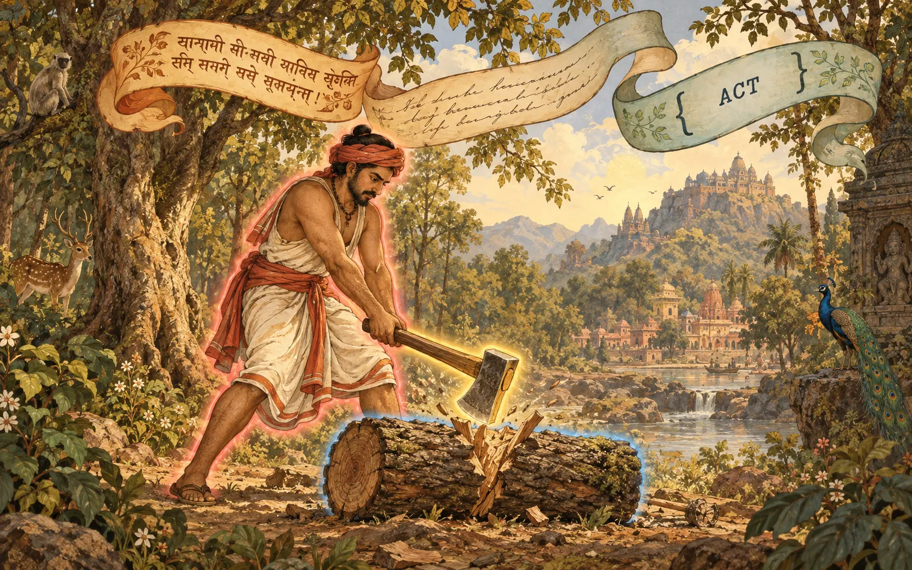
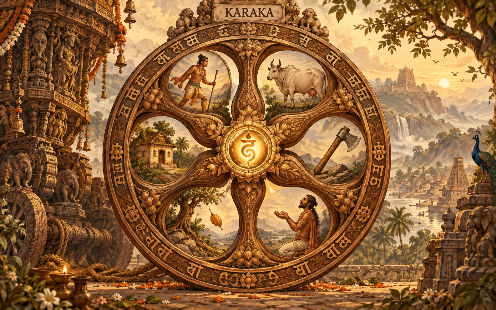
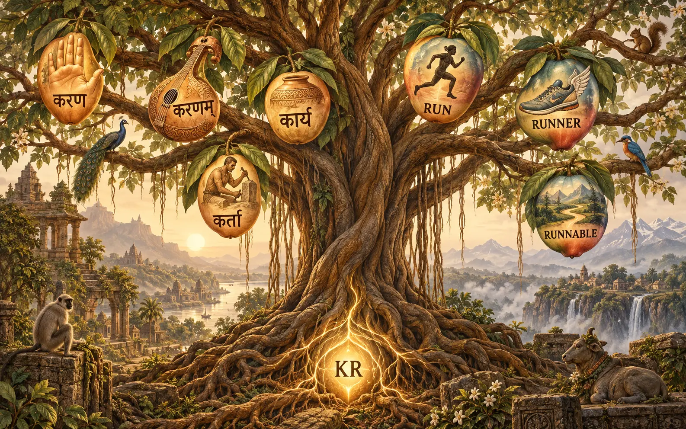

# Sanskrit and Ethos

## Page 1 · One sentence, three scripts



*devadattaḥ kuṭhāreṇa kāṣṭhaṃ chinatti* means "Devadatta cuts the wood with the axe". The doer, the tool and the thing cut each have a role. The same act is written three ways: in Sanskrit, in English and in Datom. *(The script on the ribbons is decorative and not real Sanskrit.)*

## Page 2 · Why Sanskrit, in your words

> You're just going to have this specified language, kind of Sanskrit redone for computers, if you will. All the meaning, right? That's why we're going to use Panini Sanskrit grammar work as a base because it's basically a computer. It's a perfect computer language. ... It's going to create the ontology of this meaning language, which would then translate to any language. We're creating the English user interface first because we're bootstrapping in English.

-- psyche, typed, 2026-09-24, flows/b7da5d/vision/meaningLanguage.md

> It's going to be the base for everything: how our system thinks, communicates, and classifies things in the world.

-- psyche, STT, flows/5851f4/vision/ashtadhyayiKnowledgeBase.md

The sentence from page 1 as a datom `Act` *(constructed, not validated by any reader)*:

```
{ chid Primary Lat Kartari Prathama Eka None
  [ { Kartr { h1 None } } { Karana { h2 None } } { KarmanKaraka { h3 None } } ] }
```

- `chid` is the root "cut".
- `Lat` is present tense, `Kartari` is active voice, `Prathama` is third person, and `Eka` is singular.
- `Kartr` is the doer (Devadatta), `Karana` the tool (the axe) and `KarmanKaraka` the thing acted on (the wood).

## Page 3 · The kāraka wheel



The verb is at the hub. Around it are the roles a verb can give out: the doer, the thing acted on, the tool, the one who receives, the point something leaves from, and the place. *(The wheel shows five scenes. The "leaving from" role appears only as the falling leaf.)*

## Page 4 · Endings versus positions

> We'll quickly move into a full set of verbs. We use Sanskrit. There are all these different situations, and that's what all these different verbs define: these different situations, the different relations of time, people, numbers, gender, and intention.

-- psyche, 2026-09-19, flows/f38926/vision/archive-meaningLanguage.md

This is the built `Act`, from `meaning-language/ethos/meaning.ethos` *(witnessed; a proposal, not adopted)*:

```
Act.{ Dhatu StemComposition Lakara Prayoga Purusha Vachana Option<AgreementForm> Vector<Karaka> }
Lakara.[ Lat Lit Lut Lrt Let Lot Lan Lin.LinUse Lun Lrn ]
Prayoga.[ Kartari Karmani Bhave ]
Purusha.[ Prathama Madhyama Uttama ]  Vachana.[ Eka Dvi Bahu ]  Linga.[ Pum Stri Napumsaka ]
KarakaRole.[ Kartr KarmanKaraka Karana Sampradana Apadana Adhikarana ]
```

- **Time** is `Lakara`, **people** is `Purusha`, **number** is `Vachana` and **gender** is `Linga`.
- **Intention** has no grammatical category. It is held as `IntentionHole.OpaqueMeaning`.

**The key difference.** Sanskrit marks a role with a word ending, so word order is free. Datom marks meaning by position and uses no names. The `Act` borrows the Sanskrit way for its participants: each `Karaka` names its role, which works like an ending. A role and its ending are not one-to-one, though. In the passive, the thing acted on takes the nominative ending. So "translate to any language" needs a step that assigns endings at render time. That step is not built, and there is no `Vibhakti` type.

## Page 5 · One root, many words



The root √kṛ, "do or make", gives *kartṛ* (the doer), *karaṇa* (the instrument), *kārya* (what is to be done) and *kāraka* (a role in an act). Ethos names its kinds the same way: run → runner → Runnable, meaning "fit to be run".

## Page 6 · Roots, compounds and dual names

- **Roots (dhātu).** Built as `Dhatu.String` (`VerbalRoot`). There is no list of the roughly 2,000 roots yet. `StemFormation.[ Nic San Yan Namadhatu ]` is built.
- **Compounds (samāsa).** Our type names are head-last, like a Sanskrit tatpuruṣa compound: `LockRequest` is a kind of request. Ethos makes field names from them mechanically (`lock_path_vector`).
- **Carrying words forward (anuvṛtti).** Pāṇini never repeats a word that a later rule can inherit. Ethos says "Any repetition in ethos syntax is an implementation failure", and fields are named after their types. This is the strongest match between the two.

> Let's map it out with the Sanskrit roots, but then we can translate, and we don't have to use a single word for translation. We can use a Pascal-case sentence expression to describe one of the gunas

-- psyche, 2026-09-19, flows/f38926/vision/archive-meaningLanguage.md

So each Sanskrit-rooted type also has an English PascalCase name: `IndependentAgent`, `MostEffectiveInstrument`, `FixedPointOfDeparture`.

> You can write kind of like how Sanskrit writes a sentence without spaces. That would qualify as a bare string

-- psyche, STT, flows/564f55/vision/archive-datom.md

## Page 7 · The grammar machine


Pāṇini's grammar is a machine with five kinds of rules. Ethos has a counterpart for four of them. The fifth, the rule that transforms (*vidhi*), is the empty cradle.

## Page 8 · Five kinds of rule, four matched

| Pāṇini | What it does | Ethos counterpart |
|---|---|---|
| saṃjñā | defines a technical term | a declaration, `Name.{ … }` |
| paribhāṣā | a rule for reading rules | the reader contract (sweet form becomes braced form) |
| adhikāra | a heading that governs what follows | the root section: `Library`, `Signal`, `Sema` |
| anuvṛtti | a word carried silently into later rules | no repetition, and fields named by type |
| vidhi | transforms material into a word | **nothing**, because Ethos only declares |

**Built versus asked** *(witnessed in the repos)*:

- The Ashtadhyayi knowledge base has its volumes and outlines, but `sutras/` is empty.
- `Act` exists only as a proposal, checked for structure.
- There is no full verb list, and translation to other languages is not built.
- There is no rule engine, and how a sūtra would be written as a datom rule is not specified.

## Page 9 · Proposals

1. ☐ Rule whether Datom participants keep case marking (a role on each `Karaka`, free order) or move to fixed positions like the rest of Datom.
2. ☐ Add a `Vibhakti` type and an ending-assignment step, so an `Act` can be rendered into a language, starting with the passive.
3. ☐ Give intention a home: decide whether `IntentionHole` becomes a mood, a desiderative stem, or a field of its own.
4. ☐ Load the Dhātupāṭha root list, so `Dhatu` becomes a closed enum instead of a `String`.
5. ☐ Specify how a sūtra is written as a datom rule. This would give Ethos its first *vidhi*, a rule that transforms.
6. ☐ Rule how the Vaiśeṣika roots and the Pāṇinian verbs divide the meaning language (Vision/meaning.md says this is "not yet ruled").
7. ☐ Fill `sutras/` in the Ashtadhyayi repo with the extracted "most potent parts" you asked for.
