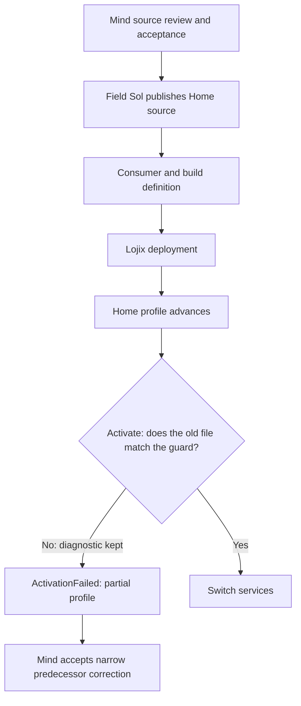
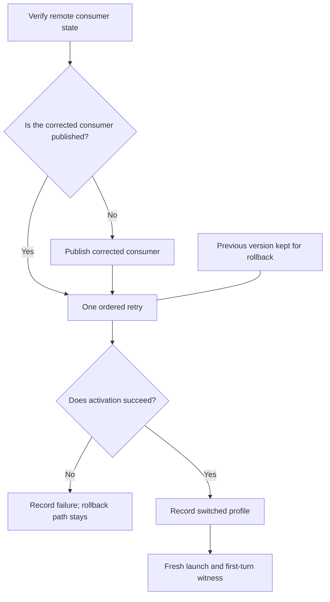
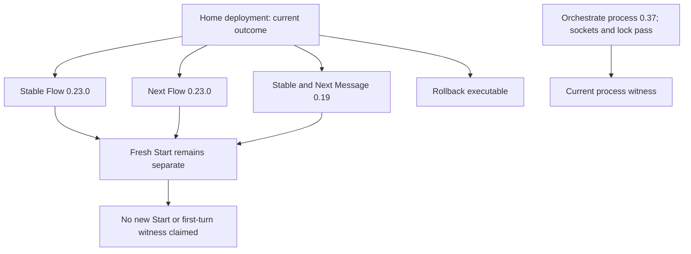
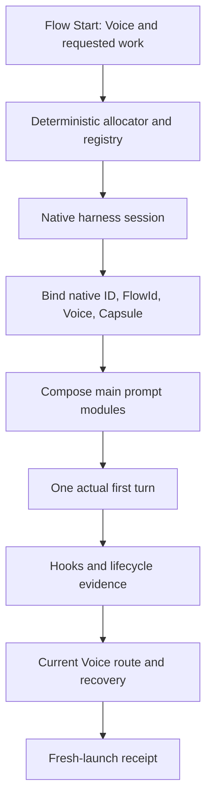
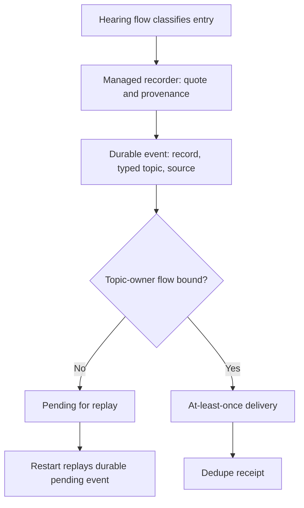

Presentation.{ «The deployment, in four parts» }

Respond by comment. Nothing here has buttons.

## 1. Why it stalled



Home deployment puts the new Flow software on the living's machine. The final switch was refused twice, because an older messenger link did not match its guard. A narrow correction was accepted, and foreign files are still refused.

## 2. How the ordered fix works



The fix is one ordered retry by Field Sol. It publishes the corrected piece only if it is missing, then retries once with the old version kept for going back. A fresh flow then proves it.

## 3. Where Home now stands



The retry worked. Flow 0.23.0 and Message 0.19 now run in both stable and Next, and the old override is gone. No fresh flow has yet answered a first turn.

## 4. What a working flow needs





A working flow needs a readable three-word address, a real session, a prompt and a true first turn. Plain code does the allocating and the lookup. Which 33 bits make the words still awaits the living's choice; the draft word kind is below.

```ethos
Library
[]
[ DictionaryVersion.{
    DictionaryName.String
    Revision.Integer }
  WordParseError.[
    Empty
    NonCanonicalText
    UnknownWord.String
    WrongWordCount.{
      Integer
      Integer }
    InvalidIndex.Integer
    DictionaryMismatch.{
      DictionaryVersion
      DictionaryVersion }
    NonCanonicalPadding ] ]
[ Wordable.{
    []
    [ Dictionary
      Words ]
    [ WIDTH_BITS.Integer ]
    [ as_words.[ Words ]
      parse_words:{
        [ Words ]
        [ Result<Self
                 WordParseError> ] } ] } ]
[]
```

1. Noted. 2. Comment.
