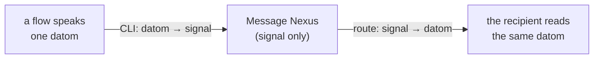
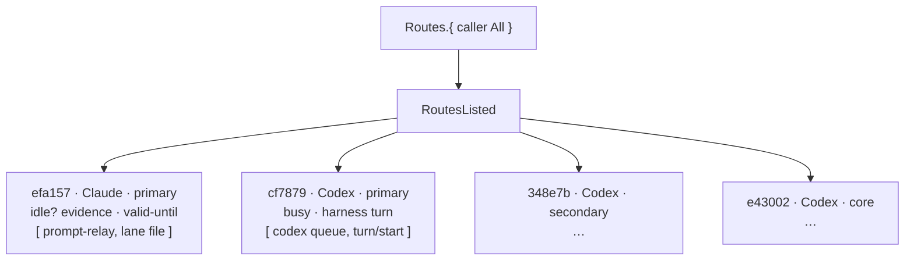
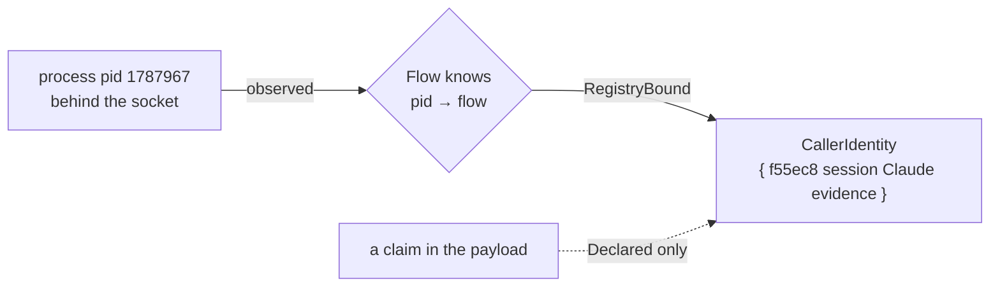
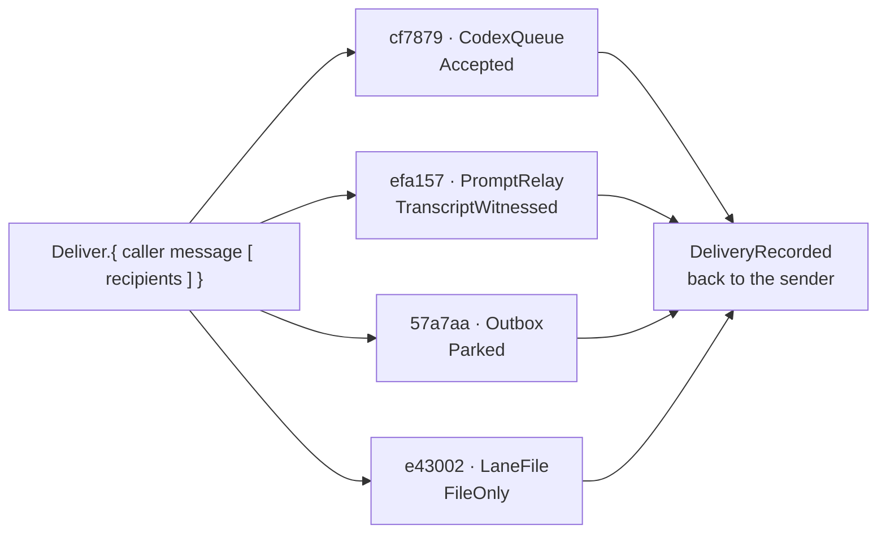
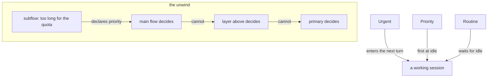
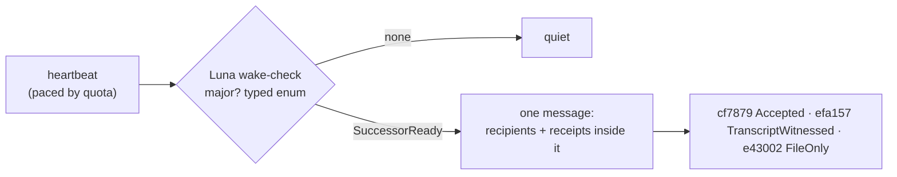
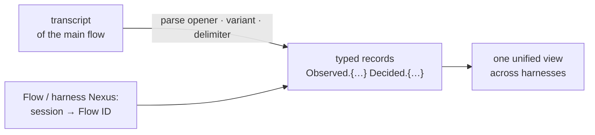

# The Messaging, as it will be

*An idea book that is also the spec. Every picture is the flow of one idea. Where a thing exists today it is marked ●, where it half exists ◐, where it does not ○. Source: the living's words in flows/efa157/vision (messages, transcriptReporting, callerIdentity, heartbeat, domains) and flows/f55ec8/vision (networking, cloud, quota, layers); Vision/nexus.md and signal.md; cf7879's order 10A anatomy; the receipts named in reports/messagingBrief.md.*

---

## 1 · A message is a typed thing, and the typed thing is what you read

A flow never sends prose in an envelope. It sends one datom, a typed value, and that datom, exactly, is what the recipient sees in its prompt: `Peer.{ … }` or `Relay.{ … }`, never a JSON header. The Nexus in the middle never sees text at all: the CLI turns the datom into signal, the Nexus thinks in signal, and the CLI on the far side turns it back into the same datom. ● Proven: four Codex sessions and one Claude session have received a bare datom head today.

![A sealed typed parcel passes through the Message Nexus, which converts it to signal and back without ever opening it.](data:image/svg+xml;base64,PHN2ZyB4bWxucz0iaHR0cDovL3d3dy53My5vcmcvMjAwMC9zdmciIHZpZXdCb3g9IjAgMCA3MjAgMjU4IiB3aWR0aD0iNzIwIiBoZWlnaHQ9IjI1OCIgcm9sZT0iaW1nIiBhcmlhLWxhYmVsPSJBIHNlYWxlZCB0eXBlZCBwYXJjZWwgcGFzc2VzIHRocm91Z2ggdGhlIE1lc3NhZ2UgTmV4dXMsIHdoaWNoIGNvbnZlcnRzIGl0IHRvIHNpZ25hbCBhbmQgYmFjayB3aXRob3V0IGV2ZXIgb3BlbmluZyBpdC4iPjxyZWN0IHg9IjAiIHk9IjAiIHdpZHRoPSI3MjAiIGhlaWdodD0iMjU4IiBzdHlsZT0iZmlsbDojZjZmOGY0Ii8+PGRlZnM+PG1hcmtlciBpZD0iZjEtYXIiIHZpZXdCb3g9IjAgMCAxMCAxMCIgcmVmWD0iOSIgcmVmWT0iNSIgbWFya2VyV2lkdGg9IjciIG1hcmtlckhlaWdodD0iNyIgb3JpZW50PSJhdXRvLXN0YXJ0LXJldmVyc2UiPjxwYXRoIGQ9Ik0wIDAgTDEwIDUgTDAgMTAgWiIgc3R5bGU9ImZpbGw6IzE2MjExZiIvPjwvbWFya2VyPjxtYXJrZXIgaWQ9ImYxLWFyYiIgdmlld0JveD0iMCAwIDEwIDEwIiByZWZYPSI5IiByZWZZPSI1IiBtYXJrZXJXaWR0aD0iNyIgbWFya2VySGVpZ2h0PSI3IiBvcmllbnQ9ImF1dG8tc3RhcnQtcmV2ZXJzZSI+PHBhdGggZD0iTTAgMCBMMTAgNSBMMCAxMCBaIiBzdHlsZT0iZmlsbDojOWE2NDE0Ii8+PC9tYXJrZXI+PG1hcmtlciBpZD0iZjEtYXJ0IiB2aWV3Qm94PSIwIDAgMTAgMTAiIHJlZlg9IjkiIHJlZlk9IjUiIG1hcmtlcldpZHRoPSI3IiBtYXJrZXJIZWlnaHQ9IjciIG9yaWVudD0iYXV0by1zdGFydC1yZXZlcnNlIj48cGF0aCBkPSJNMCAwIEwxMCA1IEwwIDEwIFoiIHN0eWxlPSJmaWxsOiMxYTY3NjMiLz48L21hcmtlcj48bWFya2VyIGlkPSJmMS1hcnIiIHZpZXdCb3g9IjAgMCAxMCAxMCIgcmVmWD0iOSIgcmVmWT0iNSIgbWFya2VyV2lkdGg9IjciIG1hcmtlckhlaWdodD0iNyIgb3JpZW50PSJhdXRvLXN0YXJ0LXJldmVyc2UiPjxwYXRoIGQ9Ik0wIDAgTDEwIDUgTDAgMTAgWiIgc3R5bGU9ImZpbGw6I2EyNDU0YyIvPjwvbWFya2VyPjxtYXJrZXIgaWQ9ImYxLWFybSIgdmlld0JveD0iMCAwIDEwIDEwIiByZWZYPSI5IiByZWZZPSI1IiBtYXJrZXJXaWR0aD0iNyIgbWFya2VySGVpZ2h0PSI3IiBvcmllbnQ9ImF1dG8tc3RhcnQtcmV2ZXJzZSI+PHBhdGggZD0iTTAgMCBMMTAgNSBMMCAxMCBaIiBzdHlsZT0iZmlsbDojNWQ2YjY2Ii8+PC9tYXJrZXI+PHBhdHRlcm4gaWQ9ImYxLWhhbGYiIHdpZHRoPSI3IiBoZWlnaHQ9IjciIHBhdHRlcm5Vbml0cz0idXNlclNwYWNlT25Vc2UiIHBhdHRlcm5UcmFuc2Zvcm09InJvdGF0ZSg0NSkiPjxsaW5lIHgxPSIwIiB5MT0iMCIgeDI9IjAiIHkyPSI3IiBzdHlsZT0ic3Ryb2tlOiM5YTY0MTQ7c3Ryb2tlLXdpZHRoOjIuODtvcGFjaXR5Oi40MCIvPjwvcGF0dGVybj48cGF0dGVybiBpZD0iZjEtaGFsZnQiIHdpZHRoPSI3IiBoZWlnaHQ9IjciIHBhdHRlcm5Vbml0cz0idXNlclNwYWNlT25Vc2UiIHBhdHRlcm5UcmFuc2Zvcm09InJvdGF0ZSg0NSkiPjxsaW5lIHgxPSIwIiB5MT0iMCIgeDI9IjAiIHkyPSI3IiBzdHlsZT0ic3Ryb2tlOiMxYTY3NjM7c3Ryb2tlLXdpZHRoOjIuODtvcGFjaXR5Oi4zNCIvPjwvcGF0dGVybj48L2RlZnM+PHJlY3QgeD0iMTAiIHk9IjEwNCIgd2lkdGg9IjEyNiIgaGVpZ2h0PSI3NCIgcng9IjQiIHN0eWxlPSJmaWxsOiNmNmY4ZjQ7c3Ryb2tlOiMxNjIxMWY7c3Ryb2tlLXdpZHRoOjEuNyIvPjx0ZXh0IHg9IjIyIiB5PSIxMjYuMCIgdGV4dC1hbmNob3I9InN0YXJ0IiBzdHlsZT0iZmlsbDojMTYyMTFmO2ZvbnQtZmFtaWx5OidJQk0gUGxleCBTYW5zIENvbmRlbnNlZCcsJ0hlbHZldGljYSBOZXVlJyxBcmlhbCxzYW5zLXNlcmlmO2ZvbnQtc2l6ZToxMi41cHg7Zm9udC13ZWlnaHQ6NjAwO29wYWNpdHk6MSI+YSBmbG93IHNwZWFrczwvdGV4dD48dGV4dCB4PSIyMiIgeT0iMTQ2IiB0ZXh0LWFuY2hvcj0ic3RhcnQiIHN0eWxlPSJmaWxsOiM1ZDZiNjY7Zm9udC1mYW1pbHk6J0lCTSBQbGV4IFNhbnMgQ29uZGVuc2VkJywnSGVsdmV0aWNhIE5ldWUnLEFyaWFsLHNhbnMtc2VyaWY7Zm9udC1zaXplOjExLjVweDtmb250LXdlaWdodDo1MDA7b3BhY2l0eToxIj5vbmUgZGF0b208L3RleHQ+PHRleHQgeD0iMjIiIHk9IjE2NiIgdGV4dC1hbmNob3I9InN0YXJ0IiBzdHlsZT0iZmlsbDojOWE2NDE0O2ZvbnQtZmFtaWx5OidJQk0gUGxleCBNb25vJyx1aS1tb25vc3BhY2UsJ1NGTW9uby1SZWd1bGFyJyxNZW5sbyxtb25vc3BhY2U7Zm9udC1zaXplOjEyLjVweDtmb250LXdlaWdodDo2MDA7b3BhY2l0eToxIj5QZWVyLnsg4oCmIH08L3RleHQ+PHJlY3QgeD0iMTUyIiB5PSIxMTkiIHdpZHRoPSI2MiIgaGVpZ2h0PSI0NCIgcng9IjMiIHN0eWxlPSJmaWxsOiNmNmY4ZjQ7c3Ryb2tlOiM5YTY0MTQ7c3Ryb2tlLXdpZHRoOjEuNyIvPjxwYXRoIGQ9Ik0xNTIgMTMzIEwyMTQgMTMzIiBzdHlsZT0ic3Ryb2tlOiM5YTY0MTQ7c3Ryb2tlLXdpZHRoOjEuMjtmaWxsOm5vbmU7c3Ryb2tlLWxpbmVjYXA6cm91bmQ7c3Ryb2tlLWxpbmVqb2luOnJvdW5kO29wYWNpdHk6MC41NSIvPjxwYXRoIGQ9Ik0xODMgMTE5IEwxODMgMTMzIiBzdHlsZT0ic3Ryb2tlOiM5YTY0MTQ7c3Ryb2tlLXdpZHRoOjEuMjtmaWxsOm5vbmU7c3Ryb2tlLWxpbmVjYXA6cm91bmQ7c3Ryb2tlLWxpbmVqb2luOnJvdW5kO29wYWNpdHk6MC41NSIvPjxjaXJjbGUgY3g9IjE4MyIgY3k9IjE0NyIgcj0iNy41IiBzdHlsZT0iZmlsbDojOWE2NDE0O29wYWNpdHk6MSIvPjxwYXRoIGQ9Ik0xNzkgMTQ3IEwxODcgMTQ3IE0xODMgMTQzIEwxODMgMTUxIiBzdHlsZT0ic3Ryb2tlOiNmNmY4ZjQ7c3Ryb2tlLXdpZHRoOjEuNDtmaWxsOm5vbmU7c3Ryb2tlLWxpbmVjYXA6cm91bmQ7c3Ryb2tlLWxpbmVqb2luOnJvdW5kO29wYWNpdHk6MSIvPjx0ZXh0IHg9IjE4MyIgeT0iMTc5IiB0ZXh0LWFuY2hvcj0ibWlkZGxlIiBzdHlsZT0iZmlsbDojNWQ2YjY2O2ZvbnQtZmFtaWx5OidJQk0gUGxleCBTYW5zIENvbmRlbnNlZCcsJ0hlbHZldGljYSBOZXVlJyxBcmlhbCxzYW5zLXNlcmlmO2ZvbnQtc2l6ZToxMC41cHg7Zm9udC13ZWlnaHQ6NjAwO29wYWNpdHk6MTtsZXR0ZXItc3BhY2luZzowLjVweCI+c2VhbGVkIMK3IHR5cGVkPC90ZXh0PjxyZWN0IHg9IjI0NiIgeT0iNzgiIHdpZHRoPSIxODYiIGhlaWdodD0iMTI4IiByeD0iNiIgc3R5bGU9ImZpbGw6I2Y2ZjhmNDtzdHJva2U6IzE2MjExZjtzdHJva2Utd2lkdGg6MS44Ii8+PHRleHQgeD0iMzM5IiB5PSIxMDAiIHRleHQtYW5jaG9yPSJtaWRkbGUiIHN0eWxlPSJmaWxsOiMxNjIxMWY7Zm9udC1mYW1pbHk6J0lCTSBQbGV4IFNhbnMgQ29uZGVuc2VkJywnSGVsdmV0aWNhIE5ldWUnLEFyaWFsLHNhbnMtc2VyaWY7Zm9udC1zaXplOjEyLjVweDtmb250LXdlaWdodDo3MDA7b3BhY2l0eToxO2xldHRlci1zcGFjaW5nOjEuMnB4Ij5NRVNTQUdFIE5FWFVTPC90ZXh0Pjx0ZXh0IHg9IjMzOSIgeT0iMTE3IiB0ZXh0LWFuY2hvcj0ibWlkZGxlIiBzdHlsZT0iZmlsbDojNWQ2YjY2O2ZvbnQtZmFtaWx5OidJQk0gUGxleCBTYW5zIENvbmRlbnNlZCcsJ0hlbHZldGljYSBOZXVlJyxBcmlhbCxzYW5zLXNlcmlmO2ZvbnQtc2l6ZToxMXB4O2ZvbnQtd2VpZ2h0OjUwMDtvcGFjaXR5OjEiPnRoaW5rcyBpbiBzaWduYWwgb25seTwvdGV4dD48cGF0aCBkPSJNMjY2IDEzMCBoMTQ2IiBzdHlsZT0ic3Ryb2tlOiMxNjIxMWY7c3Ryb2tlLXdpZHRoOjEuMjtmaWxsOm5vbmU7c3Ryb2tlLWxpbmVjYXA6cm91bmQ7c3Ryb2tlLWxpbmVqb2luOnJvdW5kO29wYWNpdHk6MC4zNSIvPjxwYXRoIGQ9Ik0zMDAgMTQ2IHExMiA5IDI0IDAiIHN0eWxlPSJzdHJva2U6IzVkNmI2NjtzdHJva2Utd2lkdGg6MS42O2ZpbGw6bm9uZTtzdHJva2UtbGluZWNhcDpyb3VuZDtzdHJva2UtbGluZWpvaW46cm91bmQ7b3BhY2l0eToxIi8+PHBhdGggZD0iTTM1NiAxNDYgcTEyIDkgMjQgMCIgc3R5bGU9InN0cm9rZTojNWQ2YjY2O3N0cm9rZS13aWR0aDoxLjY7ZmlsbDpub25lO3N0cm9rZS1saW5lY2FwOnJvdW5kO3N0cm9rZS1saW5lam9pbjpyb3VuZDtvcGFjaXR5OjEiLz48dGV4dCB4PSIzMzkiIHk9IjE3MiIgdGV4dC1hbmNob3I9Im1pZGRsZSIgc3R5bGU9ImZpbGw6IzVkNmI2Njtmb250LWZhbWlseTonSUJNIFBsZXggU2FucyBDb25kZW5zZWQnLCdIZWx2ZXRpY2EgTmV1ZScsQXJpYWwsc2Fucy1zZXJpZjtmb250LXNpemU6MTFweDtmb250LXdlaWdodDo2MDA7b3BhY2l0eToxIj50aGUgbGlkIG5ldmVyIG9wZW5zPC90ZXh0Pjx0ZXh0IHg9IjMzOSIgeT0iMTkwIiB0ZXh0LWFuY2hvcj0ibWlkZGxlIiBzdHlsZT0iZmlsbDojMWE2NzYzO2ZvbnQtZmFtaWx5OidJQk0gUGxleCBNb25vJyx1aS1tb25vc3BhY2UsJ1NGTW9uby1SZWd1bGFyJyxNZW5sbyxtb25vc3BhY2U7Zm9udC1zaXplOjExcHg7Zm9udC13ZWlnaHQ6NTAwO29wYWNpdHk6MSI+MHg5ZiAweDIxIDB4MDQg4oCmPC90ZXh0PjxwYXRoIGQ9Ik0yNDYgMTI4IGgxODYgTTI0NiAxNjAgaDE4NiIgc3R5bGU9InN0cm9rZTojMWE2NzYzO3N0cm9rZS13aWR0aDoxO2ZpbGw6bm9uZTtzdHJva2UtbGluZWNhcDpyb3VuZDtzdHJva2UtbGluZWpvaW46cm91bmQ7b3BhY2l0eTowLjQ1O3N0cm9rZS1kYXNoYXJyYXk6NSA0Ii8+PHJlY3QgeD0iNDUyIiB5PSIxMTkiIHdpZHRoPSI2MiIgaGVpZ2h0PSI0NCIgcng9IjMiIHN0eWxlPSJmaWxsOiNmNmY4ZjQ7c3Ryb2tlOiM5YTY0MTQ7c3Ryb2tlLXdpZHRoOjEuNyIvPjxwYXRoIGQ9Ik00NTIgMTMzIEw1MTQgMTMzIiBzdHlsZT0ic3Ryb2tlOiM5YTY0MTQ7c3Ryb2tlLXdpZHRoOjEuMjtmaWxsOm5vbmU7c3Ryb2tlLWxpbmVjYXA6cm91bmQ7c3Ryb2tlLWxpbmVqb2luOnJvdW5kO29wYWNpdHk6MC41NSIvPjxwYXRoIGQ9Ik00ODMgMTE5IEw0ODMgMTMzIiBzdHlsZT0ic3Ryb2tlOiM5YTY0MTQ7c3Ryb2tlLXdpZHRoOjEuMjtmaWxsOm5vbmU7c3Ryb2tlLWxpbmVjYXA6cm91bmQ7c3Ryb2tlLWxpbmVqb2luOnJvdW5kO29wYWNpdHk6MC41NSIvPjxjaXJjbGUgY3g9IjQ4MyIgY3k9IjE0NyIgcj0iNy41IiBzdHlsZT0iZmlsbDojOWE2NDE0O29wYWNpdHk6MSIvPjxwYXRoIGQ9Ik00NzkgMTQ3IEw0ODcgMTQ3IE00ODMgMTQzIEw0ODMgMTUxIiBzdHlsZT0ic3Ryb2tlOiNmNmY4ZjQ7c3Ryb2tlLXdpZHRoOjEuNDtmaWxsOm5vbmU7c3Ryb2tlLWxpbmVjYXA6cm91bmQ7c3Ryb2tlLWxpbmVqb2luOnJvdW5kO29wYWNpdHk6MSIvPjxyZWN0IHg9IjU0MCIgeT0iMTA0IiB3aWR0aD0iMTY4IiBoZWlnaHQ9Ijc0IiByeD0iNCIgc3R5bGU9ImZpbGw6I2Y2ZjhmNDtzdHJva2U6IzE2MjExZjtzdHJva2Utd2lkdGg6MS43Ii8+PHRleHQgeD0iNTUyIiB5PSIxMjYuMCIgdGV4dC1hbmNob3I9InN0YXJ0IiBzdHlsZT0iZmlsbDojMTYyMTFmO2ZvbnQtZmFtaWx5OidJQk0gUGxleCBTYW5zIENvbmRlbnNlZCcsJ0hlbHZldGljYSBOZXVlJyxBcmlhbCxzYW5zLXNlcmlmO2ZvbnQtc2l6ZToxMi41cHg7Zm9udC13ZWlnaHQ6NjAwO29wYWNpdHk6MSI+dGhlIHJlY2lwaWVudCByZWFkczwvdGV4dD48dGV4dCB4PSI1NTIiIHk9IjE0NiIgdGV4dC1hbmNob3I9InN0YXJ0IiBzdHlsZT0iZmlsbDojNWQ2YjY2O2ZvbnQtZmFtaWx5OidJQk0gUGxleCBTYW5zIENvbmRlbnNlZCcsJ0hlbHZldGljYSBOZXVlJyxBcmlhbCxzYW5zLXNlcmlmO2ZvbnQtc2l6ZToxMS41cHg7Zm9udC13ZWlnaHQ6NTAwO29wYWNpdHk6MSI+dGhlIHNhbWUgZGF0b208L3RleHQ+PHRleHQgeD0iNTUyIiB5PSIxNjYiIHRleHQtYW5jaG9yPSJzdGFydCIgc3R5bGU9ImZpbGw6IzlhNjQxNDtmb250LWZhbWlseTonSUJNIFBsZXggTW9ubycsdWktbW9ub3NwYWNlLCdTRk1vbm8tUmVndWxhcicsTWVubG8sbW9ub3NwYWNlO2ZvbnQtc2l6ZToxMi41cHg7Zm9udC13ZWlnaHQ6NjAwO29wYWNpdHk6MSI+UGVlci57IOKApiB9PC90ZXh0PjxsaW5lIHgxPSIxMzYiIHkxPSIxNDEiIHgyPSIxNDgiIHkyPSIxNDEiIHN0eWxlPSJzdHJva2U6IzlhNjQxNDtzdHJva2Utd2lkdGg6MS44O2ZpbGw6bm9uZTtzdHJva2UtbGluZWNhcDpyb3VuZDtvcGFjaXR5OjEiIG1hcmtlci1lbmQ9InVybCgjZjEtYXJiKSIvPjxsaW5lIHgxPSIyMTYiIHkxPSIxNDEiIHgyPSIyNDAiIHkyPSIxNDEiIHN0eWxlPSJzdHJva2U6IzlhNjQxNDtzdHJva2Utd2lkdGg6MS44O2ZpbGw6bm9uZTtzdHJva2UtbGluZWNhcDpyb3VuZDtvcGFjaXR5OjEiIG1hcmtlci1lbmQ9InVybCgjZjEtYXJiKSIvPjx0ZXh0IHg9IjIyOCIgeT0iMTI4IiB0ZXh0LWFuY2hvcj0ibWlkZGxlIiBzdHlsZT0iZmlsbDojNWQ2YjY2O2ZvbnQtZmFtaWx5OidJQk0gUGxleCBTYW5zIENvbmRlbnNlZCcsJ0hlbHZldGljYSBOZXVlJyxBcmlhbCxzYW5zLXNlcmlmO2ZvbnQtc2l6ZToxMHB4O2ZvbnQtd2VpZ2h0OjcwMDtvcGFjaXR5OjE7bGV0dGVyLXNwYWNpbmc6MC44cHgiPkNMSTwvdGV4dD48bGluZSB4MT0iNDMyIiB5MT0iMTQxIiB4Mj0iNDQ4IiB5Mj0iMTQxIiBzdHlsZT0ic3Ryb2tlOiM5YTY0MTQ7c3Ryb2tlLXdpZHRoOjEuODtmaWxsOm5vbmU7c3Ryb2tlLWxpbmVjYXA6cm91bmQ7b3BhY2l0eToxIiBtYXJrZXItZW5kPSJ1cmwoI2YxLWFyYikiLz48bGluZSB4MT0iNTE2IiB5MT0iMTQxIiB4Mj0iNTM0IiB5Mj0iMTQxIiBzdHlsZT0ic3Ryb2tlOiM5YTY0MTQ7c3Ryb2tlLXdpZHRoOjEuODtmaWxsOm5vbmU7c3Ryb2tlLWxpbmVjYXA6cm91bmQ7b3BhY2l0eToxIiBtYXJrZXItZW5kPSJ1cmwoI2YxLWFyYikiLz48dGV4dCB4PSIyMjgiIHk9IjIzNiIgdGV4dC1hbmNob3I9Im1pZGRsZSIgc3R5bGU9ImZpbGw6IzFhNjc2Mztmb250LWZhbWlseTonSUJNIFBsZXggU2FucyBDb25kZW5zZWQnLCdIZWx2ZXRpY2EgTmV1ZScsQXJpYWwsc2Fucy1zZXJpZjtmb250LXNpemU6MTEuNXB4O2ZvbnQtd2VpZ2h0OjYwMDtvcGFjaXR5OjEiPmRhdG9tIOKGkiBzaWduYWw8L3RleHQ+PHRleHQgeD0iNDUyIiB5PSIyMzYiIHRleHQtYW5jaG9yPSJtaWRkbGUiIHN0eWxlPSJmaWxsOiMxYTY3NjM7Zm9udC1mYW1pbHk6J0lCTSBQbGV4IFNhbnMgQ29uZGVuc2VkJywnSGVsdmV0aWNhIE5ldWUnLEFyaWFsLHNhbnMtc2VyaWY7Zm9udC1zaXplOjExLjVweDtmb250LXdlaWdodDo2MDA7b3BhY2l0eToxIj5zaWduYWwg4oaSIGRhdG9tPC90ZXh0PjxwYXRoIGQ9Ik0yMjggMjI2IEwyMjggMjEwIEwyNDYgMjEwIiBzdHlsZT0ic3Ryb2tlOiMxYTY3NjM7c3Ryb2tlLXdpZHRoOjEuMjtmaWxsOm5vbmU7c3Ryb2tlLWxpbmVjYXA6cm91bmQ7c3Ryb2tlLWxpbmVqb2luOnJvdW5kO29wYWNpdHk6MTtzdHJva2UtZGFzaGFycmF5OjUgNCIvPjxwYXRoIGQ9Ik00NTIgMjI2IEw0NTIgMjEwIEw0MzIgMjEwIiBzdHlsZT0ic3Ryb2tlOiMxYTY3NjM7c3Ryb2tlLXdpZHRoOjEuMjtmaWxsOm5vbmU7c3Ryb2tlLWxpbmVjYXA6cm91bmQ7c3Ryb2tlLWxpbmVqb2luOnJvdW5kO29wYWNpdHk6MTtzdHJva2UtZGFzaGFycmF5OjUgNCIvPjxjaXJjbGUgY3g9IjE2IiBjeT0iMjQiIHI9IjcuNSIgc3R5bGU9ImZpbGw6IzlhNjQxNDtzdHJva2U6IzlhNjQxNDtzdHJva2Utd2lkdGg6MS43Ii8+PHRleHQgeD0iMjkiIHk9IjI4LjQiIHRleHQtYW5jaG9yPSJzdGFydCIgc3R5bGU9ImZpbGw6IzVkNmI2Njtmb250LWZhbWlseTonSUJNIFBsZXggU2FucyBDb25kZW5zZWQnLCdIZWx2ZXRpY2EgTmV1ZScsQXJpYWwsc2Fucy1zZXJpZjtmb250LXNpemU6MTFweDtmb250LXdlaWdodDo2MDA7b3BhY2l0eToxO2xldHRlci1zcGFjaW5nOjAuN3B4Ij5FWElTVFM8L3RleHQ+PC9zdmc+)

*Sealed in, sealed out*

---

## 2 · Every flow is a node; the CLI can show the graph

The cluster is a graph and each flow is a node in it: its harness (Claude or Codex), its session, its role (primary, secondary, core, successor), and how it looked when last observed: idle, busy, waiting for approval, unknown, concluded — with the evidence that saw it and the moment that observation goes stale. One query, `Routes`, lists the nodes and the routes to each. ○ Today routes come from a hand-written file; nothing lists them live.

![A constellation of flow nodes — harness, role, last observed state and the evidence for it — returned by one Routes query. Drawn dashed: it does not exist yet.](data:image/svg+xml;base64,PHN2ZyB4bWxucz0iaHR0cDovL3d3dy53My5vcmcvMjAwMC9zdmciIHZpZXdCb3g9IjAgMCA3MjAgMzMwIiB3aWR0aD0iNzIwIiBoZWlnaHQ9IjMzMCIgcm9sZT0iaW1nIiBhcmlhLWxhYmVsPSJBIGNvbnN0ZWxsYXRpb24gb2YgZmxvdyBub2RlcyDigJQgaGFybmVzcywgcm9sZSwgbGFzdCBvYnNlcnZlZCBzdGF0ZSBhbmQgdGhlIGV2aWRlbmNlIGZvciBpdCDigJQgcmV0dXJuZWQgYnkgb25lIFJvdXRlcyBxdWVyeS4gRHJhd24gZGFzaGVkOiBpdCBkb2VzIG5vdCBleGlzdCB5ZXQuIj48cmVjdCB4PSIwIiB5PSIwIiB3aWR0aD0iNzIwIiBoZWlnaHQ9IjMzMCIgc3R5bGU9ImZpbGw6I2Y2ZjhmNCIvPjxkZWZzPjxtYXJrZXIgaWQ9ImYyLWFyIiB2aWV3Qm94PSIwIDAgMTAgMTAiIHJlZlg9IjkiIHJlZlk9IjUiIG1hcmtlcldpZHRoPSI3IiBtYXJrZXJIZWlnaHQ9IjciIG9yaWVudD0iYXV0by1zdGFydC1yZXZlcnNlIj48cGF0aCBkPSJNMCAwIEwxMCA1IEwwIDEwIFoiIHN0eWxlPSJmaWxsOiMxNjIxMWYiLz48L21hcmtlcj48bWFya2VyIGlkPSJmMi1hcmIiIHZpZXdCb3g9IjAgMCAxMCAxMCIgcmVmWD0iOSIgcmVmWT0iNSIgbWFya2VyV2lkdGg9IjciIG1hcmtlckhlaWdodD0iNyIgb3JpZW50PSJhdXRvLXN0YXJ0LXJldmVyc2UiPjxwYXRoIGQ9Ik0wIDAgTDEwIDUgTDAgMTAgWiIgc3R5bGU9ImZpbGw6IzlhNjQxNCIvPjwvbWFya2VyPjxtYXJrZXIgaWQ9ImYyLWFydCIgdmlld0JveD0iMCAwIDEwIDEwIiByZWZYPSI5IiByZWZZPSI1IiBtYXJrZXJXaWR0aD0iNyIgbWFya2VySGVpZ2h0PSI3IiBvcmllbnQ9ImF1dG8tc3RhcnQtcmV2ZXJzZSI+PHBhdGggZD0iTTAgMCBMMTAgNSBMMCAxMCBaIiBzdHlsZT0iZmlsbDojMWE2NzYzIi8+PC9tYXJrZXI+PG1hcmtlciBpZD0iZjItYXJyIiB2aWV3Qm94PSIwIDAgMTAgMTAiIHJlZlg9IjkiIHJlZlk9IjUiIG1hcmtlcldpZHRoPSI3IiBtYXJrZXJIZWlnaHQ9IjciIG9yaWVudD0iYXV0by1zdGFydC1yZXZlcnNlIj48cGF0aCBkPSJNMCAwIEwxMCA1IEwwIDEwIFoiIHN0eWxlPSJmaWxsOiNhMjQ1NGMiLz48L21hcmtlcj48bWFya2VyIGlkPSJmMi1hcm0iIHZpZXdCb3g9IjAgMCAxMCAxMCIgcmVmWD0iOSIgcmVmWT0iNSIgbWFya2VyV2lkdGg9IjciIG1hcmtlckhlaWdodD0iNyIgb3JpZW50PSJhdXRvLXN0YXJ0LXJldmVyc2UiPjxwYXRoIGQ9Ik0wIDAgTDEwIDUgTDAgMTAgWiIgc3R5bGU9ImZpbGw6IzVkNmI2NiIvPjwvbWFya2VyPjxwYXR0ZXJuIGlkPSJmMi1oYWxmIiB3aWR0aD0iNyIgaGVpZ2h0PSI3IiBwYXR0ZXJuVW5pdHM9InVzZXJTcGFjZU9uVXNlIiBwYXR0ZXJuVHJhbnNmb3JtPSJyb3RhdGUoNDUpIj48bGluZSB4MT0iMCIgeTE9IjAiIHgyPSIwIiB5Mj0iNyIgc3R5bGU9InN0cm9rZTojOWE2NDE0O3N0cm9rZS13aWR0aDoyLjg7b3BhY2l0eTouNDAiLz48L3BhdHRlcm4+PHBhdHRlcm4gaWQ9ImYyLWhhbGZ0IiB3aWR0aD0iNyIgaGVpZ2h0PSI3IiBwYXR0ZXJuVW5pdHM9InVzZXJTcGFjZU9uVXNlIiBwYXR0ZXJuVHJhbnNmb3JtPSJyb3RhdGUoNDUpIj48bGluZSB4MT0iMCIgeTE9IjAiIHgyPSIwIiB5Mj0iNyIgc3R5bGU9InN0cm9rZTojMWE2NzYzO3N0cm9rZS13aWR0aDoyLjg7b3BhY2l0eTouMzQiLz48L3BhdHRlcm4+PC9kZWZzPjxyZWN0IHg9IjEwIiB5PSIxMjgiIHdpZHRoPSIxNzAiIGhlaWdodD0iNzYiIHJ4PSI0IiBzdHlsZT0iZmlsbDpub25lO3N0cm9rZTojMTYyMTFmO3N0cm9rZS13aWR0aDoxLjU7c3Ryb2tlLWRhc2hhcnJheTo1IDQ7b3BhY2l0eTouOTIiLz48dGV4dCB4PSIyNCIgeT0iMTUyIiB0ZXh0LWFuY2hvcj0ic3RhcnQiIHN0eWxlPSJmaWxsOiM5YTY0MTQ7Zm9udC1mYW1pbHk6J0lCTSBQbGV4IE1vbm8nLHVpLW1vbm9zcGFjZSwnU0ZNb25vLVJlZ3VsYXInLE1lbmxvLG1vbm9zcGFjZTtmb250LXNpemU6MTIuNXB4O2ZvbnQtd2VpZ2h0OjYwMDtvcGFjaXR5OjEiPlJvdXRlcy57IGNhbGxlciBBbGwgfTwvdGV4dD48dGV4dCB4PSIyNCIgeT0iMTc0IiB0ZXh0LWFuY2hvcj0ic3RhcnQiIHN0eWxlPSJmaWxsOiM1ZDZiNjY7Zm9udC1mYW1pbHk6J0lCTSBQbGV4IFNhbnMgQ29uZGVuc2VkJywnSGVsdmV0aWNhIE5ldWUnLEFyaWFsLHNhbnMtc2VyaWY7Zm9udC1zaXplOjExcHg7Zm9udC13ZWlnaHQ6NjAwO29wYWNpdHk6MTtsZXR0ZXItc3BhY2luZzowLjZweCI+b25lIHF1ZXJ5PC90ZXh0Pjx0ZXh0IHg9IjI0IiB5PSIxOTIiIHRleHQtYW5jaG9yPSJzdGFydCIgc3R5bGU9ImZpbGw6IzE2MjExZjtmb250LWZhbWlseTonSUJNIFBsZXggTW9ubycsdWktbW9ub3NwYWNlLCdTRk1vbm8tUmVndWxhcicsTWVubG8sbW9ub3NwYWNlO2ZvbnQtc2l6ZToxMS41cHg7Zm9udC13ZWlnaHQ6NTAwO29wYWNpdHk6MSI+4oaSIFJvdXRlc0xpc3RlZDwvdGV4dD48bGluZSB4MT0iMTgwIiB5MT0iMTY2IiB4Mj0iMzA0IiB5Mj0iNjAiIHN0eWxlPSJzdHJva2U6IzVkNmI2NjtzdHJva2Utd2lkdGg6MS4zO2ZpbGw6bm9uZTtzdHJva2UtbGluZWNhcDpyb3VuZDtvcGFjaXR5OjAuNzU7c3Ryb2tlLWRhc2hhcnJheTo1IDQiIG1hcmtlci1lbmQ9InVybCgjZjItYXJtKSIvPjxsaW5lIHgxPSIxODAiIHkxPSIxNjYiIHgyPSIzMDQiIHkyPSIyNjgiIHN0eWxlPSJzdHJva2U6IzVkNmI2NjtzdHJva2Utd2lkdGg6MS4zO2ZpbGw6bm9uZTtzdHJva2UtbGluZWNhcDpyb3VuZDtvcGFjaXR5OjAuNzU7c3Ryb2tlLWRhc2hhcnJheTo1IDQiIG1hcmtlci1lbmQ9InVybCgjZjItYXJtKSIvPjxsaW5lIHgxPSIxODAiIHkxPSIxNjYiIHgyPSI1NDAiIHkyPSIxMDYiIHN0eWxlPSJzdHJva2U6IzVkNmI2NjtzdHJva2Utd2lkdGg6MS4zO2ZpbGw6bm9uZTtzdHJva2UtbGluZWNhcDpyb3VuZDtvcGFjaXR5OjAuNzU7c3Ryb2tlLWRhc2hhcnJheTo1IDQiIG1hcmtlci1lbmQ9InVybCgjZjItYXJtKSIvPjxsaW5lIHgxPSIxODAiIHkxPSIxNjYiIHgyPSI1NDAiIHkyPSIyMzYiIHN0eWxlPSJzdHJva2U6IzVkNmI2NjtzdHJva2Utd2lkdGg6MS4zO2ZpbGw6bm9uZTtzdHJva2UtbGluZWNhcDpyb3VuZDtvcGFjaXR5OjAuNzU7c3Ryb2tlLWRhc2hhcnJheTo1IDQiIG1hcmtlci1lbmQ9InVybCgjZjItYXJtKSIvPjxjaXJjbGUgY3g9IjMzMCIgY3k9IjYwIiByPSIyNSIgc3R5bGU9ImZpbGw6bm9uZTtzdHJva2U6IzE2MjExZjtzdHJva2Utd2lkdGg6MS40MDAwMDAwMDAwMDAwMDAxO3N0cm9rZS1kYXNoYXJyYXk6NSA0O29wYWNpdHk6LjkyIi8+PGNpcmNsZSBjeD0iMzMwIiBjeT0iNjAiIHI9IjQuNSIgc3R5bGU9ImZpbGw6IzlhNjQxNDtvcGFjaXR5OjAuOCIvPjx0ZXh0IHg9IjMzMCIgeT0iMjYiIHRleHQtYW5jaG9yPSJtaWRkbGUiIHN0eWxlPSJmaWxsOiMxNjIxMWY7Zm9udC1mYW1pbHk6J0lCTSBQbGV4IE1vbm8nLHVpLW1vbm9zcGFjZSwnU0ZNb25vLVJlZ3VsYXInLE1lbmxvLG1vbm9zcGFjZTtmb250LXNpemU6MTIuNXB4O2ZvbnQtd2VpZ2h0OjcwMDtvcGFjaXR5OjEiPmVmYTE1NzwvdGV4dD48dGV4dCB4PSIzNjQiIHk9IjU4IiB0ZXh0LWFuY2hvcj0ic3RhcnQiIHN0eWxlPSJmaWxsOiM1ZDZiNjY7Zm9udC1mYW1pbHk6J0lCTSBQbGV4IFNhbnMgQ29uZGVuc2VkJywnSGVsdmV0aWNhIE5ldWUnLEFyaWFsLHNhbnMtc2VyaWY7Zm9udC1zaXplOjExLjVweDtmb250LXdlaWdodDo2MDA7b3BhY2l0eToxIj5DbGF1ZGUgwrcgcHJpbWFyeTwvdGV4dD48dGV4dCB4PSIzNjQiIHk9Ijc0IiB0ZXh0LWFuY2hvcj0ic3RhcnQiIHN0eWxlPSJmaWxsOiMxYTY3NjM7Zm9udC1mYW1pbHk6J0lCTSBQbGV4IFNhbnMgQ29uZGVuc2VkJywnSGVsdmV0aWNhIE5ldWUnLEFyaWFsLHNhbnMtc2VyaWY7Zm9udC1zaXplOjExLjVweDtmb250LXdlaWdodDo2MDA7b3BhY2l0eToxIj5pZGxlPyDCtyBldmlkZW5jZTwvdGV4dD48dGV4dCB4PSIzNjQiIHk9Ijg5IiB0ZXh0LWFuY2hvcj0ic3RhcnQiIHN0eWxlPSJmaWxsOiM1ZDZiNjY7Zm9udC1mYW1pbHk6J0lCTSBQbGV4IE1vbm8nLHVpLW1vbm9zcGFjZSwnU0ZNb25vLVJlZ3VsYXInLE1lbmxvLG1vbm9zcGFjZTtmb250LXNpemU6MTAuNXB4O2ZvbnQtd2VpZ2h0OjUwMDtvcGFjaXR5OjEiPlsgdmFsaWQtdW50aWwgMTQ6MDIgXTwvdGV4dD48Y2lyY2xlIGN4PSIzMzAiIGN5PSIyNjgiIHI9IjI1IiBzdHlsZT0iZmlsbDpub25lO3N0cm9rZTojMTYyMTFmO3N0cm9rZS13aWR0aDoxLjQwMDAwMDAwMDAwMDAwMDE7c3Ryb2tlLWRhc2hhcnJheTo1IDQ7b3BhY2l0eTouOTIiLz48Y2lyY2xlIGN4PSIzMzAiIGN5PSIyNjgiIHI9IjQuNSIgc3R5bGU9ImZpbGw6IzlhNjQxNDtvcGFjaXR5OjAuOCIvPjx0ZXh0IHg9IjMzMCIgeT0iMjM0IiB0ZXh0LWFuY2hvcj0ibWlkZGxlIiBzdHlsZT0iZmlsbDojMTYyMTFmO2ZvbnQtZmFtaWx5OidJQk0gUGxleCBNb25vJyx1aS1tb25vc3BhY2UsJ1NGTW9uby1SZWd1bGFyJyxNZW5sbyxtb25vc3BhY2U7Zm9udC1zaXplOjEyLjVweDtmb250LXdlaWdodDo3MDA7b3BhY2l0eToxIj4zNDhlN2I8L3RleHQ+PHRleHQgeD0iMzY0IiB5PSIyNjYiIHRleHQtYW5jaG9yPSJzdGFydCIgc3R5bGU9ImZpbGw6IzVkNmI2Njtmb250LWZhbWlseTonSUJNIFBsZXggU2FucyBDb25kZW5zZWQnLCdIZWx2ZXRpY2EgTmV1ZScsQXJpYWwsc2Fucy1zZXJpZjtmb250LXNpemU6MTEuNXB4O2ZvbnQtd2VpZ2h0OjYwMDtvcGFjaXR5OjEiPkNvZGV4IMK3IHNlY29uZGFyeTwvdGV4dD48dGV4dCB4PSIzNjQiIHk9IjI4MiIgdGV4dC1hbmNob3I9InN0YXJ0IiBzdHlsZT0iZmlsbDojMWE2NzYzO2ZvbnQtZmFtaWx5OidJQk0gUGxleCBTYW5zIENvbmRlbnNlZCcsJ0hlbHZldGljYSBOZXVlJyxBcmlhbCxzYW5zLXNlcmlmO2ZvbnQtc2l6ZToxMS41cHg7Zm9udC13ZWlnaHQ6NjAwO29wYWNpdHk6MSI+d2FpdGluZyBmb3IgYXBwcm92YWw8L3RleHQ+PHRleHQgeD0iMzY0IiB5PSIyOTciIHRleHQtYW5jaG9yPSJzdGFydCIgc3R5bGU9ImZpbGw6IzVkNmI2Njtmb250LWZhbWlseTonSUJNIFBsZXggTW9ubycsdWktbW9ub3NwYWNlLCdTRk1vbm8tUmVndWxhcicsTWVubG8sbW9ub3NwYWNlO2ZvbnQtc2l6ZToxMC41cHg7Zm9udC13ZWlnaHQ6NTAwO29wYWNpdHk6MSI+WyBsYW5lIGZpbGUgXTwvdGV4dD48Y2lyY2xlIGN4PSI1NjYiIGN5PSIxMDYiIHI9IjI1IiBzdHlsZT0iZmlsbDpub25lO3N0cm9rZTojMTYyMTFmO3N0cm9rZS13aWR0aDoxLjQwMDAwMDAwMDAwMDAwMDE7c3Ryb2tlLWRhc2hhcnJheTo1IDQ7b3BhY2l0eTouOTIiLz48Y2lyY2xlIGN4PSI1NjYiIGN5PSIxMDYiIHI9IjQuNSIgc3R5bGU9ImZpbGw6IzlhNjQxNDtvcGFjaXR5OjAuOCIvPjx0ZXh0IHg9IjU2NiIgeT0iNzIiIHRleHQtYW5jaG9yPSJtaWRkbGUiIHN0eWxlPSJmaWxsOiMxNjIxMWY7Zm9udC1mYW1pbHk6J0lCTSBQbGV4IE1vbm8nLHVpLW1vbm9zcGFjZSwnU0ZNb25vLVJlZ3VsYXInLE1lbmxvLG1vbm9zcGFjZTtmb250LXNpemU6MTIuNXB4O2ZvbnQtd2VpZ2h0OjcwMDtvcGFjaXR5OjEiPmNmNzg3OTwvdGV4dD48dGV4dCB4PSI2MDAiIHk9IjEwNCIgdGV4dC1hbmNob3I9InN0YXJ0IiBzdHlsZT0iZmlsbDojNWQ2YjY2O2ZvbnQtZmFtaWx5OidJQk0gUGxleCBTYW5zIENvbmRlbnNlZCcsJ0hlbHZldGljYSBOZXVlJyxBcmlhbCxzYW5zLXNlcmlmO2ZvbnQtc2l6ZToxMS41cHg7Zm9udC13ZWlnaHQ6NjAwO29wYWNpdHk6MSI+Q29kZXggwrcgcHJpbWFyeTwvdGV4dD48dGV4dCB4PSI2MDAiIHk9IjEyMCIgdGV4dC1hbmNob3I9InN0YXJ0IiBzdHlsZT0iZmlsbDojMWE2NzYzO2ZvbnQtZmFtaWx5OidJQk0gUGxleCBTYW5zIENvbmRlbnNlZCcsJ0hlbHZldGljYSBOZXVlJyxBcmlhbCxzYW5zLXNlcmlmO2ZvbnQtc2l6ZToxMS41cHg7Zm9udC13ZWlnaHQ6NjAwO29wYWNpdHk6MSI+YnVzeSDCtyBoYXJuZXNzIHR1cm48L3RleHQ+PHRleHQgeD0iNjAwIiB5PSIxMzUiIHRleHQtYW5jaG9yPSJzdGFydCIgc3R5bGU9ImZpbGw6IzVkNmI2Njtmb250LWZhbWlseTonSUJNIFBsZXggTW9ubycsdWktbW9ub3NwYWNlLCdTRk1vbm8tUmVndWxhcicsTWVubG8sbW9ub3NwYWNlO2ZvbnQtc2l6ZToxMC41cHg7Zm9udC13ZWlnaHQ6NTAwO29wYWNpdHk6MSI+WyBjb2RleCBxdWV1ZSBdPC90ZXh0PjxjaXJjbGUgY3g9IjU2NiIgY3k9IjIzNiIgcj0iMjUiIHN0eWxlPSJmaWxsOm5vbmU7c3Ryb2tlOiMxNjIxMWY7c3Ryb2tlLXdpZHRoOjEuNDAwMDAwMDAwMDAwMDAwMTtzdHJva2UtZGFzaGFycmF5OjUgNDtvcGFjaXR5Oi45MiIvPjxjaXJjbGUgY3g9IjU2NiIgY3k9IjIzNiIgcj0iNC41IiBzdHlsZT0iZmlsbDojOWE2NDE0O29wYWNpdHk6MC44Ii8+PHRleHQgeD0iNTY2IiB5PSIyMDIiIHRleHQtYW5jaG9yPSJtaWRkbGUiIHN0eWxlPSJmaWxsOiMxNjIxMWY7Zm9udC1mYW1pbHk6J0lCTSBQbGV4IE1vbm8nLHVpLW1vbm9zcGFjZSwnU0ZNb25vLVJlZ3VsYXInLE1lbmxvLG1vbm9zcGFjZTtmb250LXNpemU6MTIuNXB4O2ZvbnQtd2VpZ2h0OjcwMDtvcGFjaXR5OjEiPmU0MzAwMjwvdGV4dD48dGV4dCB4PSI2MDAiIHk9IjIzNCIgdGV4dC1hbmNob3I9InN0YXJ0IiBzdHlsZT0iZmlsbDojNWQ2YjY2O2ZvbnQtZmFtaWx5OidJQk0gUGxleCBTYW5zIENvbmRlbnNlZCcsJ0hlbHZldGljYSBOZXVlJyxBcmlhbCxzYW5zLXNlcmlmO2ZvbnQtc2l6ZToxMS41cHg7Zm9udC13ZWlnaHQ6NjAwO29wYWNpdHk6MSI+Q29kZXggwrcgY29yZTwvdGV4dD48dGV4dCB4PSI2MDAiIHk9IjI1MCIgdGV4dC1hbmNob3I9InN0YXJ0IiBzdHlsZT0iZmlsbDojMWE2NzYzO2ZvbnQtZmFtaWx5OidJQk0gUGxleCBTYW5zIENvbmRlbnNlZCcsJ0hlbHZldGljYSBOZXVlJyxBcmlhbCxzYW5zLXNlcmlmO2ZvbnQtc2l6ZToxMS41cHg7Zm9udC13ZWlnaHQ6NjAwO29wYWNpdHk6MSI+dW5rbm93biDCtyBzdGFsZTwvdGV4dD48dGV4dCB4PSI2MDAiIHk9IjI2NSIgdGV4dC1hbmNob3I9InN0YXJ0IiBzdHlsZT0iZmlsbDojNWQ2YjY2O2ZvbnQtZmFtaWx5OidJQk0gUGxleCBNb25vJyx1aS1tb25vc3BhY2UsJ1NGTW9uby1SZWd1bGFyJyxNZW5sbyxtb25vc3BhY2U7Zm9udC1zaXplOjEwLjVweDtmb250LXdlaWdodDo1MDA7b3BhY2l0eToxIj5bIG5vIHJvdXRlIF08L3RleHQ+PHRleHQgeD0iOTYiIHk9IjIzMiIgdGV4dC1hbmNob3I9Im1pZGRsZSIgc3R5bGU9ImZpbGw6IzVkNmI2Njtmb250LWZhbWlseTonSUJNIFBsZXggU2FucyBDb25kZW5zZWQnLCdIZWx2ZXRpY2EgTmV1ZScsQXJpYWwsc2Fucy1zZXJpZjtmb250LXNpemU6MTFweDtmb250LXdlaWdodDo2MDA7b3BhY2l0eToxO2xldHRlci1zcGFjaW5nOjAuOHB4Ij50aGUgZ3JhcGgsIGxpdmU8L3RleHQ+PGNpcmNsZSBjeD0iMTYiIGN5PSIyNCIgcj0iNy41IiBzdHlsZT0iZmlsbDpub25lO3N0cm9rZTojOWE2NDE0O3N0cm9rZS13aWR0aDoxLjU7c3Ryb2tlLWRhc2hhcnJheTo1IDQ7b3BhY2l0eTouOTIiLz48dGV4dCB4PSIyOSIgeT0iMjguNCIgdGV4dC1hbmNob3I9InN0YXJ0IiBzdHlsZT0iZmlsbDojNWQ2YjY2O2ZvbnQtZmFtaWx5OidJQk0gUGxleCBTYW5zIENvbmRlbnNlZCcsJ0hlbHZldGljYSBOZXVlJyxBcmlhbCxzYW5zLXNlcmlmO2ZvbnQtc2l6ZToxMXB4O2ZvbnQtd2VpZ2h0OjYwMDtvcGFjaXR5OjE7bGV0dGVyLXNwYWNpbmc6MC43cHgiPk5PVCBZRVQ8L3RleHQ+PC9zdmc+)

*Every flow is a node*

---

## 3 · Who is talking: identity seen at the socket, not claimed in the payload

Three identities ride in one delivery and never blur: the **caller** (the flow invoking the CLI now), the **source** (whose transcript holds the original words; a relay never becomes the author), and the **recipient**. The caller is not believed on its say-so: the Nexus can see the process behind the socket, and Flow knows which process belongs to which flow. That check is a standard, optional part of the signal library, so any client knows to say whether it carries its process id. The evidence has grades: Declared, ProcessSessionObserved, RegistryBound; no grade is upgraded because strings agree. ○ Today everything is Declared. Open: whether Flow, a harness Nexus, or Message answers `WhoAmI` — one owner only, and the living has not chosen.

![A socket with a real process behind it yields RegistryBound identity; a name tag in the payload yields only Declared.](data:image/svg+xml;base64,PHN2ZyB4bWxucz0iaHR0cDovL3d3dy53My5vcmcvMjAwMC9zdmciIHZpZXdCb3g9IjAgMCA3MjAgMzE0IiB3aWR0aD0iNzIwIiBoZWlnaHQ9IjMxNCIgcm9sZT0iaW1nIiBhcmlhLWxhYmVsPSJBIHNvY2tldCB3aXRoIGEgcmVhbCBwcm9jZXNzIGJlaGluZCBpdCB5aWVsZHMgUmVnaXN0cnlCb3VuZCBpZGVudGl0eTsgYSBuYW1lIHRhZyBpbiB0aGUgcGF5bG9hZCB5aWVsZHMgb25seSBEZWNsYXJlZC4iPjxyZWN0IHg9IjAiIHk9IjAiIHdpZHRoPSI3MjAiIGhlaWdodD0iMzE0IiBzdHlsZT0iZmlsbDojZjZmOGY0Ii8+PGRlZnM+PG1hcmtlciBpZD0iZjMtYXIiIHZpZXdCb3g9IjAgMCAxMCAxMCIgcmVmWD0iOSIgcmVmWT0iNSIgbWFya2VyV2lkdGg9IjciIG1hcmtlckhlaWdodD0iNyIgb3JpZW50PSJhdXRvLXN0YXJ0LXJldmVyc2UiPjxwYXRoIGQ9Ik0wIDAgTDEwIDUgTDAgMTAgWiIgc3R5bGU9ImZpbGw6IzE2MjExZiIvPjwvbWFya2VyPjxtYXJrZXIgaWQ9ImYzLWFyYiIgdmlld0JveD0iMCAwIDEwIDEwIiByZWZYPSI5IiByZWZZPSI1IiBtYXJrZXJXaWR0aD0iNyIgbWFya2VySGVpZ2h0PSI3IiBvcmllbnQ9ImF1dG8tc3RhcnQtcmV2ZXJzZSI+PHBhdGggZD0iTTAgMCBMMTAgNSBMMCAxMCBaIiBzdHlsZT0iZmlsbDojOWE2NDE0Ii8+PC9tYXJrZXI+PG1hcmtlciBpZD0iZjMtYXJ0IiB2aWV3Qm94PSIwIDAgMTAgMTAiIHJlZlg9IjkiIHJlZlk9IjUiIG1hcmtlcldpZHRoPSI3IiBtYXJrZXJIZWlnaHQ9IjciIG9yaWVudD0iYXV0by1zdGFydC1yZXZlcnNlIj48cGF0aCBkPSJNMCAwIEwxMCA1IEwwIDEwIFoiIHN0eWxlPSJmaWxsOiMxYTY3NjMiLz48L21hcmtlcj48bWFya2VyIGlkPSJmMy1hcnIiIHZpZXdCb3g9IjAgMCAxMCAxMCIgcmVmWD0iOSIgcmVmWT0iNSIgbWFya2VyV2lkdGg9IjciIG1hcmtlckhlaWdodD0iNyIgb3JpZW50PSJhdXRvLXN0YXJ0LXJldmVyc2UiPjxwYXRoIGQ9Ik0wIDAgTDEwIDUgTDAgMTAgWiIgc3R5bGU9ImZpbGw6I2EyNDU0YyIvPjwvbWFya2VyPjxtYXJrZXIgaWQ9ImYzLWFybSIgdmlld0JveD0iMCAwIDEwIDEwIiByZWZYPSI5IiByZWZZPSI1IiBtYXJrZXJXaWR0aD0iNyIgbWFya2VySGVpZ2h0PSI3IiBvcmllbnQ9ImF1dG8tc3RhcnQtcmV2ZXJzZSI+PHBhdGggZD0iTTAgMCBMMTAgNSBMMCAxMCBaIiBzdHlsZT0iZmlsbDojNWQ2YjY2Ii8+PC9tYXJrZXI+PHBhdHRlcm4gaWQ9ImYzLWhhbGYiIHdpZHRoPSI3IiBoZWlnaHQ9IjciIHBhdHRlcm5Vbml0cz0idXNlclNwYWNlT25Vc2UiIHBhdHRlcm5UcmFuc2Zvcm09InJvdGF0ZSg0NSkiPjxsaW5lIHgxPSIwIiB5MT0iMCIgeDI9IjAiIHkyPSI3IiBzdHlsZT0ic3Ryb2tlOiM5YTY0MTQ7c3Ryb2tlLXdpZHRoOjIuODtvcGFjaXR5Oi40MCIvPjwvcGF0dGVybj48cGF0dGVybiBpZD0iZjMtaGFsZnQiIHdpZHRoPSI3IiBoZWlnaHQ9IjciIHBhdHRlcm5Vbml0cz0idXNlclNwYWNlT25Vc2UiIHBhdHRlcm5UcmFuc2Zvcm09InJvdGF0ZSg0NSkiPjxsaW5lIHgxPSIwIiB5MT0iMCIgeDI9IjAiIHkyPSI3IiBzdHlsZT0ic3Ryb2tlOiMxYTY3NjM7c3Ryb2tlLXdpZHRoOjIuODtvcGFjaXR5Oi4zNCIvPjwvcGF0dGVybj48L2RlZnM+PHJlY3QgeD0iMTQiIHk9IjY0IiB3aWR0aD0iMTY4IiBoZWlnaHQ9IjEzOCIgcng9IjUiIHN0eWxlPSJmaWxsOm5vbmU7c3Ryb2tlOiMxNjIxMWY7c3Ryb2tlLXdpZHRoOjEuNTtzdHJva2UtZGFzaGFycmF5OjUgNDtvcGFjaXR5Oi45MiIvPjx0ZXh0IHg9Ijk4IiB5PSI4NiIgdGV4dC1hbmNob3I9Im1pZGRsZSIgc3R5bGU9ImZpbGw6IzVkNmI2Njtmb250LWZhbWlseTonSUJNIFBsZXggU2FucyBDb25kZW5zZWQnLCdIZWx2ZXRpY2EgTmV1ZScsQXJpYWwsc2Fucy1zZXJpZjtmb250LXNpemU6MTEuNXB4O2ZvbnQtd2VpZ2h0OjcwMDtvcGFjaXR5OjE7bGV0dGVyLXNwYWNpbmc6MS4xcHgiPlRIRSBTT0NLRVQ8L3RleHQ+PGNpcmNsZSBjeD0iOTgiIGN5PSIxNDAiIHI9IjI2IiBzdHlsZT0iZmlsbDpub25lO3N0cm9rZTojMWE2NzYzO3N0cm9rZS13aWR0aDoxLjM7c3Ryb2tlLWRhc2hhcnJheTo1IDQ7b3BhY2l0eTouOTIiLz48cGF0aCBkPSJNNzAgMTgwIHEyOCAtMjYgNTYgMCIgc3R5bGU9InN0cm9rZTojMWE2NzYzO3N0cm9rZS13aWR0aDoxLjU7ZmlsbDpub25lO3N0cm9rZS1saW5lY2FwOnJvdW5kO3N0cm9rZS1saW5lam9pbjpyb3VuZDtvcGFjaXR5OjEiLz48Y2lyY2xlIGN4PSI4OCIgY3k9IjEzNSIgcj0iMi42IiBzdHlsZT0iZmlsbDojMWE2NzYzO29wYWNpdHk6MSIvPjxjaXJjbGUgY3g9IjEwOCIgY3k9IjEzNSIgcj0iMi42IiBzdHlsZT0iZmlsbDojMWE2NzYzO29wYWNpdHk6MSIvPjxwYXRoIGQ9Ik04OCAxNTIgcTEwIDcgMjAgMCIgc3R5bGU9InN0cm9rZTojMWE2NzYzO3N0cm9rZS13aWR0aDoxLjQ7ZmlsbDpub25lO3N0cm9rZS1saW5lY2FwOnJvdW5kO3N0cm9rZS1saW5lam9pbjpyb3VuZDtvcGFjaXR5OjEiLz48Y2lyY2xlIGN4PSI5OCIgY3k9IjE0MCIgcj0iMzgiIHN0eWxlPSJmaWxsOm5vbmU7c3Ryb2tlOiM1ZDZiNjY7c3Ryb2tlLXdpZHRoOjEuMztzdHJva2UtZGFzaGFycmF5OjUgNDtvcGFjaXR5Oi45MiIvPjx0ZXh0IHg9Ijk4IiB5PSIxOTYiIHRleHQtYW5jaG9yPSJtaWRkbGUiIHN0eWxlPSJmaWxsOiMxYTY3NjM7Zm9udC1mYW1pbHk6J0lCTSBQbGV4IE1vbm8nLHVpLW1vbm9zcGFjZSwnU0ZNb25vLVJlZ3VsYXInLE1lbmxvLG1vbm9zcGFjZTtmb250LXNpemU6MTEuNXB4O2ZvbnQtd2VpZ2h0OjYwMDtvcGFjaXR5OjEiPnBpZCAxNzg3OTY3PC90ZXh0PjxwYXRoIGQ9Ik0zMDAgOTYgTDM3MCAxMzMgTDMwMCAxNzAgTDIzMCAxMzMgWiIgc3R5bGU9InN0cm9rZTojMTYyMTFmO3N0cm9rZS13aWR0aDoxLjU7ZmlsbDpub25lO3N0cm9rZS1saW5lY2FwOnJvdW5kO3N0cm9rZS1saW5lam9pbjpyb3VuZDtvcGFjaXR5OjE7c3Ryb2tlLWRhc2hhcnJheTo1IDQiLz48dGV4dCB4PSIzMDAiIHk9IjEyOCIgdGV4dC1hbmNob3I9Im1pZGRsZSIgc3R5bGU9ImZpbGw6IzE2MjExZjtmb250LWZhbWlseTonSUJNIFBsZXggU2FucyBDb25kZW5zZWQnLCdIZWx2ZXRpY2EgTmV1ZScsQXJpYWwsc2Fucy1zZXJpZjtmb250LXNpemU6MTJweDtmb250LXdlaWdodDo2MDA7b3BhY2l0eToxIj5GbG93IGtub3dzPC90ZXh0Pjx0ZXh0IHg9IjMwMCIgeT0iMTQ2IiB0ZXh0LWFuY2hvcj0ibWlkZGxlIiBzdHlsZT0iZmlsbDojOWE2NDE0O2ZvbnQtZmFtaWx5OidJQk0gUGxleCBNb25vJyx1aS1tb25vc3BhY2UsJ1NGTW9uby1SZWd1bGFyJyxNZW5sbyxtb25vc3BhY2U7Zm9udC1zaXplOjEycHg7Zm9udC13ZWlnaHQ6NjAwO29wYWNpdHk6MSI+cGlkIOKGkiBmbG93PC90ZXh0PjxsaW5lIHgxPSIxODIiIHkxPSIxMzMiIHgyPSIyMjYiIHkyPSIxMzMiIHN0eWxlPSJzdHJva2U6IzFhNjc2MztzdHJva2Utd2lkdGg6MjtmaWxsOm5vbmU7c3Ryb2tlLWxpbmVjYXA6cm91bmQ7b3BhY2l0eToxIiBtYXJrZXItZW5kPSJ1cmwoI2YzLWFydCkiLz48dGV4dCB4PSIyMDQiIHk9IjEyMSIgdGV4dC1hbmNob3I9Im1pZGRsZSIgc3R5bGU9ImZpbGw6IzFhNjc2Mztmb250LWZhbWlseTonSUJNIFBsZXggU2FucyBDb25kZW5zZWQnLCdIZWx2ZXRpY2EgTmV1ZScsQXJpYWwsc2Fucy1zZXJpZjtmb250LXNpemU6MTAuNXB4O2ZvbnQtd2VpZ2h0OjcwMDtvcGFjaXR5OjE7bGV0dGVyLXNwYWNpbmc6MC41cHgiPm9ic2VydmVkPC90ZXh0PjxyZWN0IHg9IjQzMCIgeT0iODIiIHdpZHRoPSIyNzYiIGhlaWdodD0iMTAyIiByeD0iNCIgc3R5bGU9ImZpbGw6bm9uZTtzdHJva2U6IzE2MjExZjtzdHJva2Utd2lkdGg6MS41O3N0cm9rZS1kYXNoYXJyYXk6NSA0O29wYWNpdHk6LjkyIi8+PHRleHQgeD0iNDQ0IiB5PSIxMDYiIHRleHQtYW5jaG9yPSJzdGFydCIgc3R5bGU9ImZpbGw6IzE2MjExZjtmb250LWZhbWlseTonSUJNIFBsZXggU2FucyBDb25kZW5zZWQnLCdIZWx2ZXRpY2EgTmV1ZScsQXJpYWwsc2Fucy1zZXJpZjtmb250LXNpemU6MTNweDtmb250LXdlaWdodDo3MDA7b3BhY2l0eToxIj5DYWxsZXJJZGVudGl0eTwvdGV4dD48dGV4dCB4PSI0NDQiIHk9IjEyOCIgdGV4dC1hbmNob3I9InN0YXJ0IiBzdHlsZT0iZmlsbDojOWE2NDE0O2ZvbnQtZmFtaWx5OidJQk0gUGxleCBNb25vJyx1aS1tb25vc3BhY2UsJ1NGTW9uby1SZWd1bGFyJyxNZW5sbyxtb25vc3BhY2U7Zm9udC1zaXplOjExLjVweDtmb250LXdlaWdodDo2MDA7b3BhY2l0eToxIj57IGY1NWVjOCBzZXNzaW9uIENsYXVkZSBldmlkZW5jZSB9PC90ZXh0Pjx0ZXh0IHg9IjQ0NCIgeT0iMTUyIiB0ZXh0LWFuY2hvcj0ic3RhcnQiIHN0eWxlPSJmaWxsOiMxYTY3NjM7Zm9udC1mYW1pbHk6J0lCTSBQbGV4IFNhbnMgQ29uZGVuc2VkJywnSGVsdmV0aWNhIE5ldWUnLEFyaWFsLHNhbnMtc2VyaWY7Zm9udC1zaXplOjExLjVweDtmb250LXdlaWdodDo3MDA7b3BhY2l0eToxIj5SZWdpc3RyeUJvdW5kPC90ZXh0Pjx0ZXh0IHg9IjQ0NCIgeT0iMTcwIiB0ZXh0LWFuY2hvcj0ic3RhcnQiIHN0eWxlPSJmaWxsOiM1ZDZiNjY7Zm9udC1mYW1pbHk6J0lCTSBQbGV4IFNhbnMgQ29uZGVuc2VkJywnSGVsdmV0aWNhIE5ldWUnLEFyaWFsLHNhbnMtc2VyaWY7Zm9udC1zaXplOjExcHg7Zm9udC13ZWlnaHQ6NTAwO29wYWNpdHk6MSI+Jmd0OyBQcm9jZXNzU2Vzc2lvbk9ic2VydmVkICZndDsgRGVjbGFyZWQ8L3RleHQ+PGxpbmUgeDE9IjM3MiIgeTE9IjEzMyIgeDI9IjQyNCIgeTI9IjEzMyIgc3R5bGU9InN0cm9rZTojMWE2NzYzO3N0cm9rZS13aWR0aDoyO2ZpbGw6bm9uZTtzdHJva2UtbGluZWNhcDpyb3VuZDtvcGFjaXR5OjEiIG1hcmtlci1lbmQ9InVybCgjZjMtYXJ0KSIvPjx0ZXh0IHg9IjM5OCIgeT0iMTIxIiB0ZXh0LWFuY2hvcj0ibWlkZGxlIiBzdHlsZT0iZmlsbDojMWE2NzYzO2ZvbnQtZmFtaWx5OidJQk0gUGxleCBTYW5zIENvbmRlbnNlZCcsJ0hlbHZldGljYSBOZXVlJyxBcmlhbCxzYW5zLXNlcmlmO2ZvbnQtc2l6ZToxMC41cHg7Zm9udC13ZWlnaHQ6NzAwO29wYWNpdHk6MTtsZXR0ZXItc3BhY2luZzowLjVweCI+Ym91bmQ8L3RleHQ+PHBhdGggZD0iTTY0IDI0MiBoMTMyIHY1NCBoLTEzMiB6IE0xMDQgMjQyIGwyNiAwIiBzdHlsZT0ic3Ryb2tlOiNhMjQ1NGM7c3Ryb2tlLXdpZHRoOjEuNDtmaWxsOm5vbmU7c3Ryb2tlLWxpbmVjYXA6cm91bmQ7c3Ryb2tlLWxpbmVqb2luOnJvdW5kO29wYWNpdHk6MTtzdHJva2UtZGFzaGFycmF5OjUgNCIvPjxjaXJjbGUgY3g9IjEzMCIgY3k9IjI0NiIgcj0iNCIgc3R5bGU9ImZpbGw6bm9uZTtzdHJva2U6I2EyNDU0YztzdHJva2Utd2lkdGg6MS4zO3N0cm9rZS1kYXNoYXJyYXk6NSA0O29wYWNpdHk6LjkyIi8+PHRleHQgeD0iNzYiIHk9IjI2NCIgdGV4dC1hbmNob3I9InN0YXJ0IiBzdHlsZT0iZmlsbDojYTI0NTRjO2ZvbnQtZmFtaWx5OidJQk0gUGxleCBTYW5zIENvbmRlbnNlZCcsJ0hlbHZldGljYSBOZXVlJyxBcmlhbCxzYW5zLXNlcmlmO2ZvbnQtc2l6ZToxMXB4O2ZvbnQtd2VpZ2h0OjYwMDtvcGFjaXR5OjEiPmEgY2xhaW0gaW4gdGhlIHBheWxvYWQ8L3RleHQ+PHRleHQgeD0iNzYiIHk9IjI4MiIgdGV4dC1hbmNob3I9InN0YXJ0IiBzdHlsZT0iZmlsbDojYTI0NTRjO2ZvbnQtZmFtaWx5OidJQk0gUGxleCBNb25vJyx1aS1tb25vc3BhY2UsJ1NGTW9uby1SZWd1bGFyJyxNZW5sbyxtb25vc3BhY2U7Zm9udC1zaXplOjExLjVweDtmb250LXdlaWdodDo2MDA7b3BhY2l0eToxIj7igJxJIGFtIGY1NWVjOOKAnTwvdGV4dD48cGF0aCBkPSJNMTk2IDI2OCBMNDMwIDI2OCBMNDMwIDE5MCIgc3R5bGU9InN0cm9rZTojYTI0NTRjO3N0cm9rZS13aWR0aDoxLjQ7ZmlsbDpub25lO3N0cm9rZS1saW5lY2FwOnJvdW5kO3N0cm9rZS1saW5lam9pbjpyb3VuZDtvcGFjaXR5OjE7c3Ryb2tlLWRhc2hhcnJheTo1IDQiIG1hcmtlci1lbmQ9InVybCgjZjMtYXJyKSIvPjx0ZXh0IHg9IjQxOCIgeT0iMjU2IiB0ZXh0LWFuY2hvcj0ibWlkZGxlIiBzdHlsZT0iZmlsbDojYTI0NTRjO2ZvbnQtZmFtaWx5OidJQk0gUGxleCBTYW5zIENvbmRlbnNlZCcsJ0hlbHZldGljYSBOZXVlJyxBcmlhbCxzYW5zLXNlcmlmO2ZvbnQtc2l6ZToxMXB4O2ZvbnQtd2VpZ2h0OjYwMDtvcGFjaXR5OjEiPkRlY2xhcmVkIG9ubHkg4oCUIG5ldmVyIHVwZ3JhZGVkIGJlY2F1c2Ugc3RyaW5ncyBhZ3JlZTwvdGV4dD48Y2lyY2xlIGN4PSIxNiIgY3k9IjI0IiByPSI3LjUiIHN0eWxlPSJmaWxsOm5vbmU7c3Ryb2tlOiM5YTY0MTQ7c3Ryb2tlLXdpZHRoOjEuNTtzdHJva2UtZGFzaGFycmF5OjUgNDtvcGFjaXR5Oi45MiIvPjx0ZXh0IHg9IjI5IiB5PSIyOC40IiB0ZXh0LWFuY2hvcj0ic3RhcnQiIHN0eWxlPSJmaWxsOiM1ZDZiNjY7Zm9udC1mYW1pbHk6J0lCTSBQbGV4IFNhbnMgQ29uZGVuc2VkJywnSGVsdmV0aWNhIE5ldWUnLEFyaWFsLHNhbnMtc2VyaWY7Zm9udC1zaXplOjExcHg7Zm9udC13ZWlnaHQ6NjAwO29wYWNpdHk6MTtsZXR0ZXItc3BhY2luZzowLjdweCI+Tk9UIFlFVDwvdGV4dD48L3N2Zz4=)

*Seen at the socket, not claimed in the payload*

---

## 4 · A delivery is proven by receipts, and the receipts are words

Delivery is not a boolean. Each recipient gets a receipt of a graded kind: **Accepted** (a transport took it), **TranscriptWitnessed** (the exact datom sits in the recipient's transcript: the only proof that counts), **Parked** (a durable outbox row, because the recipient was busy), **FileOnly** (a report was written; nobody is known to have read it), **Pending** (busy, approval-wait, stale observation, unknown route). The sender gets them back typed: `DeliveryRecorded.{ source [ receipts ] }`, and can ask again later. ◐ The receipts exist as practice, assembled by hand into reports; the typed reply does not exist.

![A rack of five receipt stamps that exist as practice, feeding a typed DeliveryRecorded reply that does not exist yet.](data:image/svg+xml;base64,PHN2ZyB4bWxucz0iaHR0cDovL3d3dy53My5vcmcvMjAwMC9zdmciIHZpZXdCb3g9IjAgMCA3MjAgMjk4IiB3aWR0aD0iNzIwIiBoZWlnaHQ9IjI5OCIgcm9sZT0iaW1nIiBhcmlhLWxhYmVsPSJBIHJhY2sgb2YgZml2ZSByZWNlaXB0IHN0YW1wcyB0aGF0IGV4aXN0IGFzIHByYWN0aWNlLCBmZWVkaW5nIGEgdHlwZWQgRGVsaXZlcnlSZWNvcmRlZCByZXBseSB0aGF0IGRvZXMgbm90IGV4aXN0IHlldC4iPjxyZWN0IHg9IjAiIHk9IjAiIHdpZHRoPSI3MjAiIGhlaWdodD0iMjk4IiBzdHlsZT0iZmlsbDojZjZmOGY0Ii8+PGRlZnM+PG1hcmtlciBpZD0iZjQtYXIiIHZpZXdCb3g9IjAgMCAxMCAxMCIgcmVmWD0iOSIgcmVmWT0iNSIgbWFya2VyV2lkdGg9IjciIG1hcmtlckhlaWdodD0iNyIgb3JpZW50PSJhdXRvLXN0YXJ0LXJldmVyc2UiPjxwYXRoIGQ9Ik0wIDAgTDEwIDUgTDAgMTAgWiIgc3R5bGU9ImZpbGw6IzE2MjExZiIvPjwvbWFya2VyPjxtYXJrZXIgaWQ9ImY0LWFyYiIgdmlld0JveD0iMCAwIDEwIDEwIiByZWZYPSI5IiByZWZZPSI1IiBtYXJrZXJXaWR0aD0iNyIgbWFya2VySGVpZ2h0PSI3IiBvcmllbnQ9ImF1dG8tc3RhcnQtcmV2ZXJzZSI+PHBhdGggZD0iTTAgMCBMMTAgNSBMMCAxMCBaIiBzdHlsZT0iZmlsbDojOWE2NDE0Ii8+PC9tYXJrZXI+PG1hcmtlciBpZD0iZjQtYXJ0IiB2aWV3Qm94PSIwIDAgMTAgMTAiIHJlZlg9IjkiIHJlZlk9IjUiIG1hcmtlcldpZHRoPSI3IiBtYXJrZXJIZWlnaHQ9IjciIG9yaWVudD0iYXV0by1zdGFydC1yZXZlcnNlIj48cGF0aCBkPSJNMCAwIEwxMCA1IEwwIDEwIFoiIHN0eWxlPSJmaWxsOiMxYTY3NjMiLz48L21hcmtlcj48bWFya2VyIGlkPSJmNC1hcnIiIHZpZXdCb3g9IjAgMCAxMCAxMCIgcmVmWD0iOSIgcmVmWT0iNSIgbWFya2VyV2lkdGg9IjciIG1hcmtlckhlaWdodD0iNyIgb3JpZW50PSJhdXRvLXN0YXJ0LXJldmVyc2UiPjxwYXRoIGQ9Ik0wIDAgTDEwIDUgTDAgMTAgWiIgc3R5bGU9ImZpbGw6I2EyNDU0YyIvPjwvbWFya2VyPjxtYXJrZXIgaWQ9ImY0LWFybSIgdmlld0JveD0iMCAwIDEwIDEwIiByZWZYPSI5IiByZWZZPSI1IiBtYXJrZXJXaWR0aD0iNyIgbWFya2VySGVpZ2h0PSI3IiBvcmllbnQ9ImF1dG8tc3RhcnQtcmV2ZXJzZSI+PHBhdGggZD0iTTAgMCBMMTAgNSBMMCAxMCBaIiBzdHlsZT0iZmlsbDojNWQ2YjY2Ii8+PC9tYXJrZXI+PHBhdHRlcm4gaWQ9ImY0LWhhbGYiIHdpZHRoPSI3IiBoZWlnaHQ9IjciIHBhdHRlcm5Vbml0cz0idXNlclNwYWNlT25Vc2UiIHBhdHRlcm5UcmFuc2Zvcm09InJvdGF0ZSg0NSkiPjxsaW5lIHgxPSIwIiB5MT0iMCIgeDI9IjAiIHkyPSI3IiBzdHlsZT0ic3Ryb2tlOiM5YTY0MTQ7c3Ryb2tlLXdpZHRoOjIuODtvcGFjaXR5Oi40MCIvPjwvcGF0dGVybj48cGF0dGVybiBpZD0iZjQtaGFsZnQiIHdpZHRoPSI3IiBoZWlnaHQ9IjciIHBhdHRlcm5Vbml0cz0idXNlclNwYWNlT25Vc2UiIHBhdHRlcm5UcmFuc2Zvcm09InJvdGF0ZSg0NSkiPjxsaW5lIHgxPSIwIiB5MT0iMCIgeDI9IjAiIHkyPSI3IiBzdHlsZT0ic3Ryb2tlOiMxYTY3NjM7c3Ryb2tlLXdpZHRoOjIuODtvcGFjaXR5Oi4zNCIvPjwvcGF0dGVybj48L2RlZnM+PGxpbmUgeDE9IjE0IiB5MT0iNTYiIHgyPSI3MDYiIHkyPSI1NiIgc3R5bGU9InN0cm9rZTojYzlkMmNiO3N0cm9rZS13aWR0aDoxLjQ7ZmlsbDpub25lO3N0cm9rZS1saW5lY2FwOnJvdW5kO29wYWNpdHk6MSIvPjxyZWN0IHg9IjYyIiB5PSI2MiIgd2lkdGg9IjM0IiBoZWlnaHQ9IjIwIiByeD0iMyIgc3R5bGU9ImZpbGw6I2Y2ZjhmNDtzdHJva2U6IzE2MjExZjtzdHJva2Utd2lkdGg6MS41Ii8+PGxpbmUgeDE9Ijc5IiB5MT0iODIiIHgyPSI3OSIgeTI9Ijk0IiBzdHlsZT0ic3Ryb2tlOiMxNjIxMWY7c3Ryb2tlLXdpZHRoOjIuNDtmaWxsOm5vbmU7c3Ryb2tlLWxpbmVjYXA6cm91bmQ7b3BhY2l0eToxIi8+PHJlY3QgeD0iMjAiIHk9Ijk2IiB3aWR0aD0iMTE4IiBoZWlnaHQ9IjgyIiByeD0iMyIgc3R5bGU9ImZpbGw6I2Y2ZjhmNDtzdHJva2U6IzE2MjExZjtzdHJva2Utd2lkdGg6MS41Ii8+PHRleHQgeD0iNzkiIHk9IjEyMiIgdGV4dC1hbmNob3I9Im1pZGRsZSIgc3R5bGU9ImZpbGw6IzE2MjExZjtmb250LWZhbWlseTonSUJNIFBsZXggU2FucyBDb25kZW5zZWQnLCdIZWx2ZXRpY2EgTmV1ZScsQXJpYWwsc2Fucy1zZXJpZjtmb250LXNpemU6MTIuNXB4O2ZvbnQtd2VpZ2h0OjcwMDtvcGFjaXR5OjEiPkFjY2VwdGVkPC90ZXh0Pjx0ZXh0IHg9Ijc5IiB5PSIxNDAiIHRleHQtYW5jaG9yPSJtaWRkbGUiIHN0eWxlPSJmaWxsOiM1ZDZiNjY7Zm9udC1mYW1pbHk6J0lCTSBQbGV4IFNhbnMgQ29uZGVuc2VkJywnSGVsdmV0aWNhIE5ldWUnLEFyaWFsLHNhbnMtc2VyaWY7Zm9udC1zaXplOjEwLjVweDtmb250LXdlaWdodDo1MDA7b3BhY2l0eToxIj5hIHRyYW5zcG9ydCB0b29rIGl0PC90ZXh0Pjx0ZXh0IHg9Ijc5IiB5PSIxOTQiIHRleHQtYW5jaG9yPSJtaWRkbGUiIHN0eWxlPSJmaWxsOiM1ZDZiNjY7Zm9udC1mYW1pbHk6J0lCTSBQbGV4IE1vbm8nLHVpLW1vbm9zcGFjZSwnU0ZNb25vLVJlZ3VsYXInLE1lbmxvLG1vbm9zcGFjZTtmb250LXNpemU6MTAuNXB4O2ZvbnQtd2VpZ2h0OjUwMDtvcGFjaXR5OjEiPmNmNzg3OSDCtyBDb2RleFF1ZXVlPC90ZXh0PjxsaW5lIHgxPSI3OSIgeTE9IjIwMiIgeDI9Ijc5IiB5Mj0iMjE4IiBzdHlsZT0ic3Ryb2tlOiM1ZDZiNjY7c3Ryb2tlLXdpZHRoOjEuMjtmaWxsOm5vbmU7c3Ryb2tlLWxpbmVjYXA6cm91bmQ7b3BhY2l0eToxO3N0cm9rZS1kYXNoYXJyYXk6NSA0IiBtYXJrZXItZW5kPSJ1cmwoI2Y0LWFybSkiLz48cmVjdCB4PSIyMDAiIHk9IjYyIiB3aWR0aD0iMzQiIGhlaWdodD0iMjAiIHJ4PSIzIiBzdHlsZT0iZmlsbDojZjZmOGY0O3N0cm9rZTojOWE2NDE0O3N0cm9rZS13aWR0aDoxLjUiLz48bGluZSB4MT0iMjE3IiB5MT0iODIiIHgyPSIyMTciIHkyPSI5NCIgc3R5bGU9InN0cm9rZTojOWE2NDE0O3N0cm9rZS13aWR0aDoyLjQ7ZmlsbDpub25lO3N0cm9rZS1saW5lY2FwOnJvdW5kO29wYWNpdHk6MSIvPjxyZWN0IHg9IjE1OCIgeT0iOTYiIHdpZHRoPSIxMTgiIGhlaWdodD0iODIiIHJ4PSIzIiBzdHlsZT0iZmlsbDojZjZmOGY0O3N0cm9rZTojOWE2NDE0O3N0cm9rZS13aWR0aDoyIi8+PHRleHQgeD0iMjE3IiB5PSIxMjIiIHRleHQtYW5jaG9yPSJtaWRkbGUiIHN0eWxlPSJmaWxsOiM5YTY0MTQ7Zm9udC1mYW1pbHk6J0lCTSBQbGV4IFNhbnMgQ29uZGVuc2VkJywnSGVsdmV0aWNhIE5ldWUnLEFyaWFsLHNhbnMtc2VyaWY7Zm9udC1zaXplOjEzcHg7Zm9udC13ZWlnaHQ6NzAwO29wYWNpdHk6MSI+VHJhbnNjcmlwdDwvdGV4dD48dGV4dCB4PSIyMTciIHk9IjEzOCIgdGV4dC1hbmNob3I9Im1pZGRsZSIgc3R5bGU9ImZpbGw6IzlhNjQxNDtmb250LWZhbWlseTonSUJNIFBsZXggU2FucyBDb25kZW5zZWQnLCdIZWx2ZXRpY2EgTmV1ZScsQXJpYWwsc2Fucy1zZXJpZjtmb250LXNpemU6MTIuNXB4O2ZvbnQtd2VpZ2h0OjcwMDtvcGFjaXR5OjEiPldpdG5lc3NlZDwvdGV4dD48dGV4dCB4PSIyMTciIHk9IjE1NiIgdGV4dC1hbmNob3I9Im1pZGRsZSIgc3R5bGU9ImZpbGw6IzVkNmI2Njtmb250LWZhbWlseTonSUJNIFBsZXggU2FucyBDb25kZW5zZWQnLCdIZWx2ZXRpY2EgTmV1ZScsQXJpYWwsc2Fucy1zZXJpZjtmb250LXNpemU6MTAuNXB4O2ZvbnQtd2VpZ2h0OjUwMDtvcGFjaXR5OjEiPnRoZSBleGFjdCBkYXRvbSBzaXRzPC90ZXh0Pjx0ZXh0IHg9IjIxNyIgeT0iMTcwIiB0ZXh0LWFuY2hvcj0ibWlkZGxlIiBzdHlsZT0iZmlsbDojOWE2NDE0O2ZvbnQtZmFtaWx5OidJQk0gUGxleCBTYW5zIENvbmRlbnNlZCcsJ0hlbHZldGljYSBOZXVlJyxBcmlhbCxzYW5zLXNlcmlmO2ZvbnQtc2l6ZToxMHB4O2ZvbnQtd2VpZ2h0OjYwMDtvcGFjaXR5OjEiPnRoZSBvbmx5IHByb29mIHRoYXQgY291bnRzPC90ZXh0Pjx0ZXh0IHg9IjIxNyIgeT0iMTk0IiB0ZXh0LWFuY2hvcj0ibWlkZGxlIiBzdHlsZT0iZmlsbDojNWQ2YjY2O2ZvbnQtZmFtaWx5OidJQk0gUGxleCBNb25vJyx1aS1tb25vc3BhY2UsJ1NGTW9uby1SZWd1bGFyJyxNZW5sbyxtb25vc3BhY2U7Zm9udC1zaXplOjEwLjVweDtmb250LXdlaWdodDo1MDA7b3BhY2l0eToxIj5lZmExNTcgwrcgUHJvbXB0UmVsYXk8L3RleHQ+PGxpbmUgeDE9IjIxNyIgeTE9IjIwMiIgeDI9IjIxNyIgeTI9IjIxOCIgc3R5bGU9InN0cm9rZTojNWQ2YjY2O3N0cm9rZS13aWR0aDoxLjI7ZmlsbDpub25lO3N0cm9rZS1saW5lY2FwOnJvdW5kO29wYWNpdHk6MTtzdHJva2UtZGFzaGFycmF5OjUgNCIgbWFya2VyLWVuZD0idXJsKCNmNC1hcm0pIi8+PHJlY3QgeD0iMzM4IiB5PSI2MiIgd2lkdGg9IjM0IiBoZWlnaHQ9IjIwIiByeD0iMyIgc3R5bGU9ImZpbGw6I2Y2ZjhmNDtzdHJva2U6IzE2MjExZjtzdHJva2Utd2lkdGg6MS41Ii8+PGxpbmUgeDE9IjM1NSIgeTE9IjgyIiB4Mj0iMzU1IiB5Mj0iOTQiIHN0eWxlPSJzdHJva2U6IzE2MjExZjtzdHJva2Utd2lkdGg6Mi40O2ZpbGw6bm9uZTtzdHJva2UtbGluZWNhcDpyb3VuZDtvcGFjaXR5OjEiLz48cmVjdCB4PSIyOTYiIHk9Ijk2IiB3aWR0aD0iMTE4IiBoZWlnaHQ9IjgyIiByeD0iMyIgc3R5bGU9ImZpbGw6I2Y2ZjhmNDtzdHJva2U6IzE2MjExZjtzdHJva2Utd2lkdGg6MS41Ii8+PHRleHQgeD0iMzU1IiB5PSIxMjIiIHRleHQtYW5jaG9yPSJtaWRkbGUiIHN0eWxlPSJmaWxsOiMxNjIxMWY7Zm9udC1mYW1pbHk6J0lCTSBQbGV4IFNhbnMgQ29uZGVuc2VkJywnSGVsdmV0aWNhIE5ldWUnLEFyaWFsLHNhbnMtc2VyaWY7Zm9udC1zaXplOjEyLjVweDtmb250LXdlaWdodDo3MDA7b3BhY2l0eToxIj5QYXJrZWQ8L3RleHQ+PHRleHQgeD0iMzU1IiB5PSIxNDAiIHRleHQtYW5jaG9yPSJtaWRkbGUiIHN0eWxlPSJmaWxsOiM1ZDZiNjY7Zm9udC1mYW1pbHk6J0lCTSBQbGV4IFNhbnMgQ29uZGVuc2VkJywnSGVsdmV0aWNhIE5ldWUnLEFyaWFsLHNhbnMtc2VyaWY7Zm9udC1zaXplOjEwLjVweDtmb250LXdlaWdodDo1MDA7b3BhY2l0eToxIj5kdXJhYmxlIG91dGJveCByb3c8L3RleHQ+PHRleHQgeD0iMzU1IiB5PSIxOTQiIHRleHQtYW5jaG9yPSJtaWRkbGUiIHN0eWxlPSJmaWxsOiM1ZDZiNjY7Zm9udC1mYW1pbHk6J0lCTSBQbGV4IE1vbm8nLHVpLW1vbm9zcGFjZSwnU0ZNb25vLVJlZ3VsYXInLE1lbmxvLG1vbm9zcGFjZTtmb250LXNpemU6MTAuNXB4O2ZvbnQtd2VpZ2h0OjUwMDtvcGFjaXR5OjEiPjU3YTdhYSDCtyBPdXRib3g8L3RleHQ+PGxpbmUgeDE9IjM1NSIgeTE9IjIwMiIgeDI9IjM1NSIgeTI9IjIxOCIgc3R5bGU9InN0cm9rZTojNWQ2YjY2O3N0cm9rZS13aWR0aDoxLjI7ZmlsbDpub25lO3N0cm9rZS1saW5lY2FwOnJvdW5kO29wYWNpdHk6MTtzdHJva2UtZGFzaGFycmF5OjUgNCIgbWFya2VyLWVuZD0idXJsKCNmNC1hcm0pIi8+PHJlY3QgeD0iNDc2IiB5PSI2MiIgd2lkdGg9IjM0IiBoZWlnaHQ9IjIwIiByeD0iMyIgc3R5bGU9ImZpbGw6I2Y2ZjhmNDtzdHJva2U6IzE2MjExZjtzdHJva2Utd2lkdGg6MS41Ii8+PGxpbmUgeDE9IjQ5MyIgeTE9IjgyIiB4Mj0iNDkzIiB5Mj0iOTQiIHN0eWxlPSJzdHJva2U6IzE2MjExZjtzdHJva2Utd2lkdGg6Mi40O2ZpbGw6bm9uZTtzdHJva2UtbGluZWNhcDpyb3VuZDtvcGFjaXR5OjEiLz48cmVjdCB4PSI0MzQiIHk9Ijk2IiB3aWR0aD0iMTE4IiBoZWlnaHQ9IjgyIiByeD0iMyIgc3R5bGU9ImZpbGw6I2Y2ZjhmNDtzdHJva2U6IzE2MjExZjtzdHJva2Utd2lkdGg6MS41Ii8+PHRleHQgeD0iNDkzIiB5PSIxMjIiIHRleHQtYW5jaG9yPSJtaWRkbGUiIHN0eWxlPSJmaWxsOiMxNjIxMWY7Zm9udC1mYW1pbHk6J0lCTSBQbGV4IFNhbnMgQ29uZGVuc2VkJywnSGVsdmV0aWNhIE5ldWUnLEFyaWFsLHNhbnMtc2VyaWY7Zm9udC1zaXplOjEyLjVweDtmb250LXdlaWdodDo3MDA7b3BhY2l0eToxIj5GaWxlT25seTwvdGV4dD48dGV4dCB4PSI0OTMiIHk9IjE0MCIgdGV4dC1hbmNob3I9Im1pZGRsZSIgc3R5bGU9ImZpbGw6IzVkNmI2Njtmb250LWZhbWlseTonSUJNIFBsZXggU2FucyBDb25kZW5zZWQnLCdIZWx2ZXRpY2EgTmV1ZScsQXJpYWwsc2Fucy1zZXJpZjtmb250LXNpemU6MTAuNXB4O2ZvbnQtd2VpZ2h0OjUwMDtvcGFjaXR5OjEiPndyaXR0ZW4sIHVucmVhZDwvdGV4dD48dGV4dCB4PSI0OTMiIHk9IjE5NCIgdGV4dC1hbmNob3I9Im1pZGRsZSIgc3R5bGU9ImZpbGw6IzVkNmI2Njtmb250LWZhbWlseTonSUJNIFBsZXggTW9ubycsdWktbW9ub3NwYWNlLCdTRk1vbm8tUmVndWxhcicsTWVubG8sbW9ub3NwYWNlO2ZvbnQtc2l6ZToxMC41cHg7Zm9udC13ZWlnaHQ6NTAwO29wYWNpdHk6MSI+ZTQzMDAyIMK3IExhbmVGaWxlPC90ZXh0PjxsaW5lIHgxPSI0OTMiIHkxPSIyMDIiIHgyPSI0OTMiIHkyPSIyMTgiIHN0eWxlPSJzdHJva2U6IzVkNmI2NjtzdHJva2Utd2lkdGg6MS4yO2ZpbGw6bm9uZTtzdHJva2UtbGluZWNhcDpyb3VuZDtvcGFjaXR5OjE7c3Ryb2tlLWRhc2hhcnJheTo1IDQiIG1hcmtlci1lbmQ9InVybCgjZjQtYXJtKSIvPjxyZWN0IHg9IjYxNCIgeT0iNjIiIHdpZHRoPSIzNCIgaGVpZ2h0PSIyMCIgcng9IjMiIHN0eWxlPSJmaWxsOiNmNmY4ZjQ7c3Ryb2tlOiMxNjIxMWY7c3Ryb2tlLXdpZHRoOjEuNSIvPjxsaW5lIHgxPSI2MzEiIHkxPSI4MiIgeDI9IjYzMSIgeTI9Ijk0IiBzdHlsZT0ic3Ryb2tlOiMxNjIxMWY7c3Ryb2tlLXdpZHRoOjIuNDtmaWxsOm5vbmU7c3Ryb2tlLWxpbmVjYXA6cm91bmQ7b3BhY2l0eToxIi8+PHJlY3QgeD0iNTcyIiB5PSI5NiIgd2lkdGg9IjExOCIgaGVpZ2h0PSI4MiIgcng9IjMiIHN0eWxlPSJmaWxsOiNmNmY4ZjQ7c3Ryb2tlOiMxNjIxMWY7c3Ryb2tlLXdpZHRoOjEuNSIvPjx0ZXh0IHg9IjYzMSIgeT0iMTIyIiB0ZXh0LWFuY2hvcj0ibWlkZGxlIiBzdHlsZT0iZmlsbDojMTYyMTFmO2ZvbnQtZmFtaWx5OidJQk0gUGxleCBTYW5zIENvbmRlbnNlZCcsJ0hlbHZldGljYSBOZXVlJyxBcmlhbCxzYW5zLXNlcmlmO2ZvbnQtc2l6ZToxMi41cHg7Zm9udC13ZWlnaHQ6NzAwO29wYWNpdHk6MSI+UGVuZGluZzwvdGV4dD48dGV4dCB4PSI2MzEiIHk9IjE0MCIgdGV4dC1hbmNob3I9Im1pZGRsZSIgc3R5bGU9ImZpbGw6IzVkNmI2Njtmb250LWZhbWlseTonSUJNIFBsZXggU2FucyBDb25kZW5zZWQnLCdIZWx2ZXRpY2EgTmV1ZScsQXJpYWwsc2Fucy1zZXJpZjtmb250LXNpemU6MTAuNXB4O2ZvbnQtd2VpZ2h0OjUwMDtvcGFjaXR5OjEiPmJ1c3kgwrcgc3RhbGUgwrcgdW5rbm93bjwvdGV4dD48dGV4dCB4PSI2MzEiIHk9IjE5NCIgdGV4dC1hbmNob3I9Im1pZGRsZSIgc3R5bGU9ImZpbGw6IzVkNmI2Njtmb250LWZhbWlseTonSUJNIFBsZXggTW9ubycsdWktbW9ub3NwYWNlLCdTRk1vbm8tUmVndWxhcicsTWVubG8sbW9ub3NwYWNlO2ZvbnQtc2l6ZToxMC41cHg7Zm9udC13ZWlnaHQ6NTAwO29wYWNpdHk6MSI+bm8gcm91dGUga25vd248L3RleHQ+PGxpbmUgeDE9IjYzMSIgeTE9IjIwMiIgeDI9IjYzMSIgeTI9IjIxOCIgc3R5bGU9InN0cm9rZTojNWQ2YjY2O3N0cm9rZS13aWR0aDoxLjI7ZmlsbDpub25lO3N0cm9rZS1saW5lY2FwOnJvdW5kO29wYWNpdHk6MTtzdHJva2UtZGFzaGFycmF5OjUgNCIgbWFya2VyLWVuZD0idXJsKCNmNC1hcm0pIi8+PHJlY3QgeD0iMjAiIHk9IjIyNCIgd2lkdGg9IjY4NiIgaGVpZ2h0PSI1OCIgcng9IjQiIHN0eWxlPSJmaWxsOm5vbmU7c3Ryb2tlOiM5YTY0MTQ7c3Ryb2tlLXdpZHRoOjEuNTtzdHJva2UtZGFzaGFycmF5OjUgNDtvcGFjaXR5Oi45MiIvPjx0ZXh0IHg9IjM2MyIgeT0iMjUwIiB0ZXh0LWFuY2hvcj0ibWlkZGxlIiBzdHlsZT0iZmlsbDojOWE2NDE0O2ZvbnQtZmFtaWx5OidJQk0gUGxleCBNb25vJyx1aS1tb25vc3BhY2UsJ1NGTW9uby1SZWd1bGFyJyxNZW5sbyxtb25vc3BhY2U7Zm9udC1zaXplOjE0cHg7Zm9udC13ZWlnaHQ6NjAwO29wYWNpdHk6MSI+RGVsaXZlcnlSZWNvcmRlZC57IHNvdXJjZSBbIHJlY2VpcHRzIF0gfTwvdGV4dD48dGV4dCB4PSIzNjMiIHk9IjI3MCIgdGV4dC1hbmNob3I9Im1pZGRsZSIgc3R5bGU9ImZpbGw6IzVkNmI2Njtmb250LWZhbWlseTonSUJNIFBsZXggU2FucyBDb25kZW5zZWQnLCdIZWx2ZXRpY2EgTmV1ZScsQXJpYWwsc2Fucy1zZXJpZjtmb250LXNpemU6MTFweDtmb250LXdlaWdodDo1MDA7b3BhY2l0eToxIj50aGUgdHlwZWQgcmVwbHkgYmFjayB0byB0aGUgc2VuZGVyIOKAlCBkb2VzIG5vdCBleGlzdDsgdG9kYXkgdGhlIHJlY2VpcHRzIGFyZSBhc3NlbWJsZWQgYnkgaGFuZCBpbnRvIHJlcG9ydHM8L3RleHQ+PGNpcmNsZSBjeD0iMTYiIGN5PSIyNCIgcj0iNy41IiBzdHlsZT0iZmlsbDp1cmwoI2Y0LWhhbGYpO3N0cm9rZTojOWE2NDE0O3N0cm9rZS13aWR0aDoxLjciLz48dGV4dCB4PSIyOSIgeT0iMjguNCIgdGV4dC1hbmNob3I9InN0YXJ0IiBzdHlsZT0iZmlsbDojNWQ2YjY2O2ZvbnQtZmFtaWx5OidJQk0gUGxleCBTYW5zIENvbmRlbnNlZCcsJ0hlbHZldGljYSBOZXVlJyxBcmlhbCxzYW5zLXNlcmlmO2ZvbnQtc2l6ZToxMXB4O2ZvbnQtd2VpZ2h0OjYwMDtvcGFjaXR5OjE7bGV0dGVyLXNwYWNpbmc6MC43cHgiPkhBTEY8L3RleHQ+PC9zdmc+)

*Five kinds of receipt*

---

## 5 · Priority: what may interrupt, and what climbs

A message carries a priority head: **Routine** waits for idle; **Priority** goes first when idle comes; **Urgent** may enter a working session's next turn — and says, without alarm, what to keep running and what to start. The same word does the second job the living gave it: when a flow meets a limit (quota short, a low-power job too long), it declares its priority; what it cannot decide unwinds upward — subflow to main, main to the layer above — until a layer decides, and the answer comes back down. ○ Neither the head nor the unwind exists; the live gate today refuses anything not "uniquely witnessed idle".

![Routine, Priority and Urgent enter a working session at different points; what a flow cannot decide climbs subflow to main to layer to primary, and the answer descends.](data:image/svg+xml;base64,PHN2ZyB4bWxucz0iaHR0cDovL3d3dy53My5vcmcvMjAwMC9zdmciIHZpZXdCb3g9IjAgMCA3MjAgNDI0IiB3aWR0aD0iNzIwIiBoZWlnaHQ9IjQyNCIgcm9sZT0iaW1nIiBhcmlhLWxhYmVsPSJSb3V0aW5lLCBQcmlvcml0eSBhbmQgVXJnZW50IGVudGVyIGEgd29ya2luZyBzZXNzaW9uIGF0IGRpZmZlcmVudCBwb2ludHM7IHdoYXQgYSBmbG93IGNhbm5vdCBkZWNpZGUgY2xpbWJzIHN1YmZsb3cgdG8gbWFpbiB0byBsYXllciB0byBwcmltYXJ5LCBhbmQgdGhlIGFuc3dlciBkZXNjZW5kcy4iPjxyZWN0IHg9IjAiIHk9IjAiIHdpZHRoPSI3MjAiIGhlaWdodD0iNDI0IiBzdHlsZT0iZmlsbDojZjZmOGY0Ii8+PGRlZnM+PG1hcmtlciBpZD0iZjUtYXIiIHZpZXdCb3g9IjAgMCAxMCAxMCIgcmVmWD0iOSIgcmVmWT0iNSIgbWFya2VyV2lkdGg9IjciIG1hcmtlckhlaWdodD0iNyIgb3JpZW50PSJhdXRvLXN0YXJ0LXJldmVyc2UiPjxwYXRoIGQ9Ik0wIDAgTDEwIDUgTDAgMTAgWiIgc3R5bGU9ImZpbGw6IzE2MjExZiIvPjwvbWFya2VyPjxtYXJrZXIgaWQ9ImY1LWFyYiIgdmlld0JveD0iMCAwIDEwIDEwIiByZWZYPSI5IiByZWZZPSI1IiBtYXJrZXJXaWR0aD0iNyIgbWFya2VySGVpZ2h0PSI3IiBvcmllbnQ9ImF1dG8tc3RhcnQtcmV2ZXJzZSI+PHBhdGggZD0iTTAgMCBMMTAgNSBMMCAxMCBaIiBzdHlsZT0iZmlsbDojOWE2NDE0Ii8+PC9tYXJrZXI+PG1hcmtlciBpZD0iZjUtYXJ0IiB2aWV3Qm94PSIwIDAgMTAgMTAiIHJlZlg9IjkiIHJlZlk9IjUiIG1hcmtlcldpZHRoPSI3IiBtYXJrZXJIZWlnaHQ9IjciIG9yaWVudD0iYXV0by1zdGFydC1yZXZlcnNlIj48cGF0aCBkPSJNMCAwIEwxMCA1IEwwIDEwIFoiIHN0eWxlPSJmaWxsOiMxYTY3NjMiLz48L21hcmtlcj48bWFya2VyIGlkPSJmNS1hcnIiIHZpZXdCb3g9IjAgMCAxMCAxMCIgcmVmWD0iOSIgcmVmWT0iNSIgbWFya2VyV2lkdGg9IjciIG1hcmtlckhlaWdodD0iNyIgb3JpZW50PSJhdXRvLXN0YXJ0LXJldmVyc2UiPjxwYXRoIGQ9Ik0wIDAgTDEwIDUgTDAgMTAgWiIgc3R5bGU9ImZpbGw6I2EyNDU0YyIvPjwvbWFya2VyPjxtYXJrZXIgaWQ9ImY1LWFybSIgdmlld0JveD0iMCAwIDEwIDEwIiByZWZYPSI5IiByZWZZPSI1IiBtYXJrZXJXaWR0aD0iNyIgbWFya2VySGVpZ2h0PSI3IiBvcmllbnQ9ImF1dG8tc3RhcnQtcmV2ZXJzZSI+PHBhdGggZD0iTTAgMCBMMTAgNSBMMCAxMCBaIiBzdHlsZT0iZmlsbDojNWQ2YjY2Ii8+PC9tYXJrZXI+PHBhdHRlcm4gaWQ9ImY1LWhhbGYiIHdpZHRoPSI3IiBoZWlnaHQ9IjciIHBhdHRlcm5Vbml0cz0idXNlclNwYWNlT25Vc2UiIHBhdHRlcm5UcmFuc2Zvcm09InJvdGF0ZSg0NSkiPjxsaW5lIHgxPSIwIiB5MT0iMCIgeDI9IjAiIHkyPSI3IiBzdHlsZT0ic3Ryb2tlOiM5YTY0MTQ7c3Ryb2tlLXdpZHRoOjIuODtvcGFjaXR5Oi40MCIvPjwvcGF0dGVybj48cGF0dGVybiBpZD0iZjUtaGFsZnQiIHdpZHRoPSI3IiBoZWlnaHQ9IjciIHBhdHRlcm5Vbml0cz0idXNlclNwYWNlT25Vc2UiIHBhdHRlcm5UcmFuc2Zvcm09InJvdGF0ZSg0NSkiPjxsaW5lIHgxPSIwIiB5MT0iMCIgeDI9IjAiIHkyPSI3IiBzdHlsZT0ic3Ryb2tlOiMxYTY3NjM7c3Ryb2tlLXdpZHRoOjIuODtvcGFjaXR5Oi4zNCIvPjwvcGF0dGVybj48L2RlZnM+PHJlY3QgeD0iNTUyIiB5PSI0MCIgd2lkdGg9IjE1NCIgaGVpZ2h0PSIxODAiIHJ4PSI0IiBzdHlsZT0iZmlsbDpub25lO3N0cm9rZTojMTYyMTFmO3N0cm9rZS13aWR0aDoxLjU7c3Ryb2tlLWRhc2hhcnJheTo1IDQ7b3BhY2l0eTouOTIiLz48dGV4dCB4PSI2OTgiIHk9Ijk2IiB0ZXh0LWFuY2hvcj0iZW5kIiBzdHlsZT0iZmlsbDojOWE2NDE0O2ZvbnQtZmFtaWx5OidJQk0gUGxleCBTYW5zIENvbmRlbnNlZCcsJ0hlbHZldGljYSBOZXVlJyxBcmlhbCxzYW5zLXNlcmlmO2ZvbnQtc2l6ZToxMC41cHg7Zm9udC13ZWlnaHQ6NzAwO29wYWNpdHk6MSI+bmV4dCB0dXJuPC90ZXh0Pjx0ZXh0IHg9IjYyOSIgeT0iNjIiIHRleHQtYW5jaG9yPSJtaWRkbGUiIHN0eWxlPSJmaWxsOiM1ZDZiNjY7Zm9udC1mYW1pbHk6J0lCTSBQbGV4IFNhbnMgQ29uZGVuc2VkJywnSGVsdmV0aWNhIE5ldWUnLEFyaWFsLHNhbnMtc2VyaWY7Zm9udC1zaXplOjExcHg7Zm9udC13ZWlnaHQ6NzAwO29wYWNpdHk6MTtsZXR0ZXItc3BhY2luZzowLjlweCI+QSBXT1JLSU5HIFNFU1NJT048L3RleHQ+PGxpbmUgeDE9IjU2NCIgeTE9Ijc2IiB4Mj0iNjk4IiB5Mj0iNzYiIHN0eWxlPSJzdHJva2U6I2M5ZDJjYjtzdHJva2Utd2lkdGg6MS4yO2ZpbGw6bm9uZTtzdHJva2UtbGluZWNhcDpyb3VuZDtvcGFjaXR5OjEiLz48dGV4dCB4PSI1NzIiIHk9Ijk2IiB0ZXh0LWFuY2hvcj0ic3RhcnQiIHN0eWxlPSJmaWxsOiM1ZDZiNjY7Zm9udC1mYW1pbHk6J0lCTSBQbGV4IE1vbm8nLHVpLW1vbm9zcGFjZSwnU0ZNb25vLVJlZ3VsYXInLE1lbmxvLG1vbm9zcGFjZTtmb250LXNpemU6MTAuNXB4O2ZvbnQtd2VpZ2h0OjUwMDtvcGFjaXR5OjEiPnR1cm4gMTwvdGV4dD48bGluZSB4MT0iNTY0IiB5MT0iMTEwIiB4Mj0iNjk4IiB5Mj0iMTEwIiBzdHlsZT0ic3Ryb2tlOiNjOWQyY2I7c3Ryb2tlLXdpZHRoOjEuMjtmaWxsOm5vbmU7c3Ryb2tlLWxpbmVjYXA6cm91bmQ7b3BhY2l0eToxIi8+PHRleHQgeD0iNTcyIiB5PSIxMzAiIHRleHQtYW5jaG9yPSJzdGFydCIgc3R5bGU9ImZpbGw6IzVkNmI2Njtmb250LWZhbWlseTonSUJNIFBsZXggTW9ubycsdWktbW9ub3NwYWNlLCdTRk1vbm8tUmVndWxhcicsTWVubG8sbW9ub3NwYWNlO2ZvbnQtc2l6ZToxMC41cHg7Zm9udC13ZWlnaHQ6NTAwO29wYWNpdHk6MSI+dHVybiAyPC90ZXh0PjxsaW5lIHgxPSI1NjQiIHkxPSIxNDQiIHgyPSI2OTgiIHkyPSIxNDQiIHN0eWxlPSJzdHJva2U6I2M5ZDJjYjtzdHJva2Utd2lkdGg6MS4yO2ZpbGw6bm9uZTtzdHJva2UtbGluZWNhcDpyb3VuZDtvcGFjaXR5OjEiLz48dGV4dCB4PSI1NzIiIHk9IjE2NCIgdGV4dC1hbmNob3I9InN0YXJ0IiBzdHlsZT0iZmlsbDojNWQ2YjY2O2ZvbnQtZmFtaWx5OidJQk0gUGxleCBNb25vJyx1aS1tb25vc3BhY2UsJ1NGTW9uby1SZWd1bGFyJyxNZW5sbyxtb25vc3BhY2U7Zm9udC1zaXplOjEwLjVweDtmb250LXdlaWdodDo1MDA7b3BhY2l0eToxIj50dXJuIDM8L3RleHQ+PGxpbmUgeDE9IjU2NCIgeTE9IjE3OCIgeDI9IjY5OCIgeTI9IjE3OCIgc3R5bGU9InN0cm9rZTojYzlkMmNiO3N0cm9rZS13aWR0aDoxLjI7ZmlsbDpub25lO3N0cm9rZS1saW5lY2FwOnJvdW5kO29wYWNpdHk6MSIvPjx0ZXh0IHg9IjU3MiIgeT0iMTk4IiB0ZXh0LWFuY2hvcj0ic3RhcnQiIHN0eWxlPSJmaWxsOiM1ZDZiNjY7Zm9udC1mYW1pbHk6J0lCTSBQbGV4IE1vbm8nLHVpLW1vbm9zcGFjZSwnU0ZNb25vLVJlZ3VsYXInLE1lbmxvLG1vbm9zcGFjZTtmb250LXNpemU6MTAuNXB4O2ZvbnQtd2VpZ2h0OjUwMDtvcGFjaXR5OjEiPnR1cm4gNDwvdGV4dD48cmVjdCB4PSIxNCIgeT0iNDkiIHdpZHRoPSIxMDgiIGhlaWdodD0iMzQiIHJ4PSIxNyIgc3R5bGU9ImZpbGw6bm9uZTtzdHJva2U6IzlhNjQxNDtzdHJva2Utd2lkdGg6MS41O3N0cm9rZS1kYXNoYXJyYXk6NSA0O29wYWNpdHk6LjkyIi8+PHRleHQgeD0iNjgiIHk9IjcxIiB0ZXh0LWFuY2hvcj0ibWlkZGxlIiBzdHlsZT0iZmlsbDojOWE2NDE0O2ZvbnQtZmFtaWx5OidJQk0gUGxleCBTYW5zIENvbmRlbnNlZCcsJ0hlbHZldGljYSBOZXVlJyxBcmlhbCxzYW5zLXNlcmlmO2ZvbnQtc2l6ZToxM3B4O2ZvbnQtd2VpZ2h0OjcwMDtvcGFjaXR5OjEiPlVyZ2VudDwvdGV4dD48dGV4dCB4PSIxNCIgeT0iOTgiIHRleHQtYW5jaG9yPSJzdGFydCIgc3R5bGU9ImZpbGw6IzVkNmI2Njtmb250LWZhbWlseTonSUJNIFBsZXggU2FucyBDb25kZW5zZWQnLCdIZWx2ZXRpY2EgTmV1ZScsQXJpYWwsc2Fucy1zZXJpZjtmb250LXNpemU6MTAuNXB4O2ZvbnQtd2VpZ2h0OjYwMDtvcGFjaXR5OjEiPm1heSBlbnRlciBhIHdvcmtpbmcgc2Vzc2lvbuKAmXMgbmV4dCB0dXJuPC90ZXh0PjxwYXRoIGQ9Ik0xMzAgNjYgTDUwMCA2NiBMNTAwIDk2IEw1NDggOTYiIHN0eWxlPSJzdHJva2U6IzlhNjQxNDtzdHJva2Utd2lkdGg6MS42O2ZpbGw6bm9uZTtzdHJva2UtbGluZWNhcDpyb3VuZDtzdHJva2UtbGluZWpvaW46cm91bmQ7b3BhY2l0eToxO3N0cm9rZS1kYXNoYXJyYXk6NSA0IiBtYXJrZXItZW5kPSJ1cmwoI2Y1LWFyYikiLz48cmVjdCB4PSIxNCIgeT0iMTA5IiB3aWR0aD0iMTA4IiBoZWlnaHQ9IjM0IiByeD0iMTciIHN0eWxlPSJmaWxsOm5vbmU7c3Ryb2tlOiMxYTY3NjM7c3Ryb2tlLXdpZHRoOjEuNTtzdHJva2UtZGFzaGFycmF5OjUgNDtvcGFjaXR5Oi45MiIvPjx0ZXh0IHg9IjY4IiB5PSIxMzEiIHRleHQtYW5jaG9yPSJtaWRkbGUiIHN0eWxlPSJmaWxsOiMxYTY3NjM7Zm9udC1mYW1pbHk6J0lCTSBQbGV4IFNhbnMgQ29uZGVuc2VkJywnSGVsdmV0aWNhIE5ldWUnLEFyaWFsLHNhbnMtc2VyaWY7Zm9udC1zaXplOjEzcHg7Zm9udC13ZWlnaHQ6NzAwO29wYWNpdHk6MSI+UHJpb3JpdHk8L3RleHQ+PHRleHQgeD0iMTQiIHk9IjE1OCIgdGV4dC1hbmNob3I9InN0YXJ0IiBzdHlsZT0iZmlsbDojNWQ2YjY2O2ZvbnQtZmFtaWx5OidJQk0gUGxleCBTYW5zIENvbmRlbnNlZCcsJ0hlbHZldGljYSBOZXVlJyxBcmlhbCxzYW5zLXNlcmlmO2ZvbnQtc2l6ZToxMC41cHg7Zm9udC13ZWlnaHQ6NjAwO29wYWNpdHk6MSI+Z29lcyBmaXJzdCB3aGVuIGlkbGUgY29tZXM8L3RleHQ+PHBhdGggZD0iTTEzMCAxMjYgTDUwMCAxMjYgTDUwMCAxNTAgTDU0OCAxNTAiIHN0eWxlPSJzdHJva2U6IzFhNjc2MztzdHJva2Utd2lkdGg6MS42O2ZpbGw6bm9uZTtzdHJva2UtbGluZWNhcDpyb3VuZDtzdHJva2UtbGluZWpvaW46cm91bmQ7b3BhY2l0eToxO3N0cm9rZS1kYXNoYXJyYXk6NSA0IiBtYXJrZXItZW5kPSJ1cmwoI2Y1LWFydCkiLz48cmVjdCB4PSIxNCIgeT0iMTY5IiB3aWR0aD0iMTA4IiBoZWlnaHQ9IjM0IiByeD0iMTciIHN0eWxlPSJmaWxsOm5vbmU7c3Ryb2tlOiM1ZDZiNjY7c3Ryb2tlLXdpZHRoOjEuNTtzdHJva2UtZGFzaGFycmF5OjUgNDtvcGFjaXR5Oi45MiIvPjx0ZXh0IHg9IjY4IiB5PSIxOTEiIHRleHQtYW5jaG9yPSJtaWRkbGUiIHN0eWxlPSJmaWxsOiM1ZDZiNjY7Zm9udC1mYW1pbHk6J0lCTSBQbGV4IFNhbnMgQ29uZGVuc2VkJywnSGVsdmV0aWNhIE5ldWUnLEFyaWFsLHNhbnMtc2VyaWY7Zm9udC1zaXplOjEzcHg7Zm9udC13ZWlnaHQ6NzAwO29wYWNpdHk6MSI+Um91dGluZTwvdGV4dD48dGV4dCB4PSIxNCIgeT0iMjE4IiB0ZXh0LWFuY2hvcj0ic3RhcnQiIHN0eWxlPSJmaWxsOiM1ZDZiNjY7Zm9udC1mYW1pbHk6J0lCTSBQbGV4IFNhbnMgQ29uZGVuc2VkJywnSGVsdmV0aWNhIE5ldWUnLEFyaWFsLHNhbnMtc2VyaWY7Zm9udC1zaXplOjEwLjVweDtmb250LXdlaWdodDo2MDA7b3BhY2l0eToxIj53YWl0cyBmb3IgaWRsZTwvdGV4dD48cGF0aCBkPSJNMTMwIDE4NiBMNTAwIDE4NiBMNTAwIDE5MiBMNTQ4IDE5MiIgc3R5bGU9InN0cm9rZTojNWQ2YjY2O3N0cm9rZS13aWR0aDoxLjY7ZmlsbDpub25lO3N0cm9rZS1saW5lY2FwOnJvdW5kO3N0cm9rZS1saW5lam9pbjpyb3VuZDtvcGFjaXR5OjE7c3Ryb2tlLWRhc2hhcnJheTo1IDQiIG1hcmtlci1lbmQ9InVybCgjZjUtYXJtKSIvPjxsaW5lIHgxPSI0NzAiIHkxPSIxMTYiIHgyPSI0NzAiIHkyPSIyMTQiIHN0eWxlPSJzdHJva2U6IzE2MjExZjtzdHJva2Utd2lkdGg6MS41O2ZpbGw6bm9uZTtzdHJva2UtbGluZWNhcDpyb3VuZDtvcGFjaXR5OjE7c3Ryb2tlLWRhc2hhcnJheTo1IDQiLz48dGV4dCB4PSI0NzAiIHk9IjIzMiIgdGV4dC1hbmNob3I9Im1pZGRsZSIgc3R5bGU9ImZpbGw6IzVkNmI2Njtmb250LWZhbWlseTonSUJNIFBsZXggU2FucyBDb25kZW5zZWQnLCdIZWx2ZXRpY2EgTmV1ZScsQXJpYWwsc2Fucy1zZXJpZjtmb250LXNpemU6MTAuNXB4O2ZvbnQtd2VpZ2h0OjcwMDtvcGFjaXR5OjE7bGV0dGVyLXNwYWNpbmc6MC42cHgiPnRoZSBpZGxlIGdhdGU8L3RleHQ+PHRleHQgeD0iMTQiIHk9IjI1NCIgdGV4dC1hbmNob3I9InN0YXJ0IiBzdHlsZT0iZmlsbDojNWQ2YjY2O2ZvbnQtZmFtaWx5OidJQk0gUGxleCBTYW5zIENvbmRlbnNlZCcsJ0hlbHZldGljYSBOZXVlJyxBcmlhbCxzYW5zLXNlcmlmO2ZvbnQtc2l6ZToxMXB4O2ZvbnQtd2VpZ2h0OjcwMDtvcGFjaXR5OjE7bGV0dGVyLXNwYWNpbmc6MXB4Ij5USEUgVU5XSU5EIMK3IFRIRSBTQU1FIFdPUkQsIFNFQ09ORCBKT0I8L3RleHQ+PHJlY3QgeD0iMjAiIHk9IjM3MiIgd2lkdGg9IjE1OCIgaGVpZ2h0PSI0MCIgcng9IjQiIHN0eWxlPSJmaWxsOm5vbmU7c3Ryb2tlOiMxNjIxMWY7c3Ryb2tlLXdpZHRoOjEuNDAwMDAwMDAwMDAwMDAwMTtzdHJva2UtZGFzaGFycmF5OjUgNDtvcGFjaXR5Oi45MiIvPjx0ZXh0IHg9IjMyIiB5PSIzOTAiIHRleHQtYW5jaG9yPSJzdGFydCIgc3R5bGU9ImZpbGw6IzE2MjExZjtmb250LWZhbWlseTonSUJNIFBsZXggU2FucyBDb25kZW5zZWQnLCdIZWx2ZXRpY2EgTmV1ZScsQXJpYWwsc2Fucy1zZXJpZjtmb250LXNpemU6MTIuNXB4O2ZvbnQtd2VpZ2h0OjcwMDtvcGFjaXR5OjEiPnN1YmZsb3c8L3RleHQ+PHRleHQgeD0iMzIiIHk9IjQwNSIgdGV4dC1hbmNob3I9InN0YXJ0IiBzdHlsZT0iZmlsbDojNWQ2YjY2O2ZvbnQtZmFtaWx5OidJQk0gUGxleCBTYW5zIENvbmRlbnNlZCcsJ0hlbHZldGljYSBOZXVlJyxBcmlhbCxzYW5zLXNlcmlmO2ZvbnQtc2l6ZToxMC41cHg7Zm9udC13ZWlnaHQ6NTAwO29wYWNpdHk6MSI+dG9vIGxvbmcgZm9yIHRoZSBxdW90YTwvdGV4dD48cGF0aCBkPSJNMTc4IDM4NiBMMTg1IDM4NiBMMTg1IDM1OCBMMTkyIDM1OCIgc3R5bGU9InN0cm9rZTojOWE2NDE0O3N0cm9rZS13aWR0aDoxLjY7ZmlsbDpub25lO3N0cm9rZS1saW5lY2FwOnJvdW5kO3N0cm9rZS1saW5lam9pbjpyb3VuZDtvcGFjaXR5OjE7c3Ryb2tlLWRhc2hhcnJheTo1IDQiIG1hcmtlci1lbmQ9InVybCgjZjUtYXJiKSIvPjx0ZXh0IHg9IjE5MCIgeT0iNDA4IiB0ZXh0LWFuY2hvcj0ic3RhcnQiIHN0eWxlPSJmaWxsOiM5YTY0MTQ7Zm9udC1mYW1pbHk6J0lCTSBQbGV4IFNhbnMgQ29uZGVuc2VkJywnSGVsdmV0aWNhIE5ldWUnLEFyaWFsLHNhbnMtc2VyaWY7Zm9udC1zaXplOjEwcHg7Zm9udC13ZWlnaHQ6NjAwO29wYWNpdHk6MSI+Y2xpbWJzPC90ZXh0PjxyZWN0IHg9IjE5MiIgeT0iMzM4IiB3aWR0aD0iMTU4IiBoZWlnaHQ9IjQwIiByeD0iNCIgc3R5bGU9ImZpbGw6bm9uZTtzdHJva2U6IzE2MjExZjtzdHJva2Utd2lkdGg6MS40MDAwMDAwMDAwMDAwMDAxO3N0cm9rZS1kYXNoYXJyYXk6NSA0O29wYWNpdHk6LjkyIi8+PHRleHQgeD0iMjA0IiB5PSIzNTYiIHRleHQtYW5jaG9yPSJzdGFydCIgc3R5bGU9ImZpbGw6IzE2MjExZjtmb250LWZhbWlseTonSUJNIFBsZXggU2FucyBDb25kZW5zZWQnLCdIZWx2ZXRpY2EgTmV1ZScsQXJpYWwsc2Fucy1zZXJpZjtmb250LXNpemU6MTIuNXB4O2ZvbnQtd2VpZ2h0OjcwMDtvcGFjaXR5OjEiPm1haW4gZmxvdzwvdGV4dD48dGV4dCB4PSIyMDQiIHk9IjM3MSIgdGV4dC1hbmNob3I9InN0YXJ0IiBzdHlsZT0iZmlsbDojNWQ2YjY2O2ZvbnQtZmFtaWx5OidJQk0gUGxleCBTYW5zIENvbmRlbnNlZCcsJ0hlbHZldGljYSBOZXVlJyxBcmlhbCxzYW5zLXNlcmlmO2ZvbnQtc2l6ZToxMC41cHg7Zm9udC13ZWlnaHQ6NTAwO29wYWNpdHk6MSI+ZGVjaWRlcywgb3IgY2Fubm90PC90ZXh0PjxwYXRoIGQ9Ik0zNTAgMzUyIEwzNTcgMzUyIEwzNTcgMzI0IEwzNjQgMzI0IiBzdHlsZT0ic3Ryb2tlOiM5YTY0MTQ7c3Ryb2tlLXdpZHRoOjEuNjtmaWxsOm5vbmU7c3Ryb2tlLWxpbmVjYXA6cm91bmQ7c3Ryb2tlLWxpbmVqb2luOnJvdW5kO29wYWNpdHk6MTtzdHJva2UtZGFzaGFycmF5OjUgNCIgbWFya2VyLWVuZD0idXJsKCNmNS1hcmIpIi8+PHJlY3QgeD0iMzY0IiB5PSIzMDQiIHdpZHRoPSIxNTgiIGhlaWdodD0iNDAiIHJ4PSI0IiBzdHlsZT0iZmlsbDpub25lO3N0cm9rZTojMTYyMTFmO3N0cm9rZS13aWR0aDoxLjQwMDAwMDAwMDAwMDAwMDE7c3Ryb2tlLWRhc2hhcnJheTo1IDQ7b3BhY2l0eTouOTIiLz48dGV4dCB4PSIzNzYiIHk9IjMyMiIgdGV4dC1hbmNob3I9InN0YXJ0IiBzdHlsZT0iZmlsbDojMTYyMTFmO2ZvbnQtZmFtaWx5OidJQk0gUGxleCBTYW5zIENvbmRlbnNlZCcsJ0hlbHZldGljYSBOZXVlJyxBcmlhbCxzYW5zLXNlcmlmO2ZvbnQtc2l6ZToxMi41cHg7Zm9udC13ZWlnaHQ6NzAwO29wYWNpdHk6MSI+bGF5ZXIgYWJvdmU8L3RleHQ+PHRleHQgeD0iMzc2IiB5PSIzMzciIHRleHQtYW5jaG9yPSJzdGFydCIgc3R5bGU9ImZpbGw6IzVkNmI2Njtmb250LWZhbWlseTonSUJNIFBsZXggU2FucyBDb25kZW5zZWQnLCdIZWx2ZXRpY2EgTmV1ZScsQXJpYWwsc2Fucy1zZXJpZjtmb250LXNpemU6MTAuNXB4O2ZvbnQtd2VpZ2h0OjUwMDtvcGFjaXR5OjEiPmRlY2lkZXMsIG9yIGNhbm5vdDwvdGV4dD48cGF0aCBkPSJNNTIyIDMxOCBMNTI5IDMxOCBMNTI5IDI5MCBMNTM2IDI5MCIgc3R5bGU9InN0cm9rZTojOWE2NDE0O3N0cm9rZS13aWR0aDoxLjY7ZmlsbDpub25lO3N0cm9rZS1saW5lY2FwOnJvdW5kO3N0cm9rZS1saW5lam9pbjpyb3VuZDtvcGFjaXR5OjE7c3Ryb2tlLWRhc2hhcnJheTo1IDQiIG1hcmtlci1lbmQ9InVybCgjZjUtYXJiKSIvPjxyZWN0IHg9IjUzNiIgeT0iMjcwIiB3aWR0aD0iMTU4IiBoZWlnaHQ9IjQwIiByeD0iNCIgc3R5bGU9ImZpbGw6bm9uZTtzdHJva2U6IzE2MjExZjtzdHJva2Utd2lkdGg6MS40MDAwMDAwMDAwMDAwMDAxO3N0cm9rZS1kYXNoYXJyYXk6NSA0O29wYWNpdHk6LjkyIi8+PHRleHQgeD0iNTQ4IiB5PSIyODgiIHRleHQtYW5jaG9yPSJzdGFydCIgc3R5bGU9ImZpbGw6IzE2MjExZjtmb250LWZhbWlseTonSUJNIFBsZXggU2FucyBDb25kZW5zZWQnLCdIZWx2ZXRpY2EgTmV1ZScsQXJpYWwsc2Fucy1zZXJpZjtmb250LXNpemU6MTIuNXB4O2ZvbnQtd2VpZ2h0OjcwMDtvcGFjaXR5OjEiPnByaW1hcnk8L3RleHQ+PHRleHQgeD0iNTQ4IiB5PSIzMDMiIHRleHQtYW5jaG9yPSJzdGFydCIgc3R5bGU9ImZpbGw6IzVkNmI2Njtmb250LWZhbWlseTonSUJNIFBsZXggU2FucyBDb25kZW5zZWQnLCdIZWx2ZXRpY2EgTmV1ZScsQXJpYWwsc2Fucy1zZXJpZjtmb250LXNpemU6MTAuNXB4O2ZvbnQtd2VpZ2h0OjUwMDtvcGFjaXR5OjEiPmRlY2lkZXM8L3RleHQ+PHBhdGggZD0iTTY5NCAzNDggTDY5NCA0MDggTDIwIDQwOCBMMjAgMzk2IiBzdHlsZT0ic3Ryb2tlOiMxYTY3NjM7c3Ryb2tlLXdpZHRoOjEuNTtmaWxsOm5vbmU7c3Ryb2tlLWxpbmVjYXA6cm91bmQ7c3Ryb2tlLWxpbmVqb2luOnJvdW5kO29wYWNpdHk6MTtzdHJva2UtZGFzaGFycmF5OjUgNCIgbWFya2VyLWVuZD0idXJsKCNmNS1hcnQpIi8+PHRleHQgeD0iMzU3IiB5PSI0MDIiIHRleHQtYW5jaG9yPSJtaWRkbGUiIHN0eWxlPSJmaWxsOiMxYTY3NjM7Zm9udC1mYW1pbHk6J0lCTSBQbGV4IFNhbnMgQ29uZGVuc2VkJywnSGVsdmV0aWNhIE5ldWUnLEFyaWFsLHNhbnMtc2VyaWY7Zm9udC1zaXplOjExcHg7Zm9udC13ZWlnaHQ6NjAwO29wYWNpdHk6MSI+dGhlIGFuc3dlciBjb21lcyBiYWNrIGRvd248L3RleHQ+PGNpcmNsZSBjeD0iMTYiIGN5PSIyNCIgcj0iNy41IiBzdHlsZT0iZmlsbDpub25lO3N0cm9rZTojOWE2NDE0O3N0cm9rZS13aWR0aDoxLjU7c3Ryb2tlLWRhc2hhcnJheTo1IDQ7b3BhY2l0eTouOTIiLz48dGV4dCB4PSIyOSIgeT0iMjguNCIgdGV4dC1hbmNob3I9InN0YXJ0IiBzdHlsZT0iZmlsbDojNWQ2YjY2O2ZvbnQtZmFtaWx5OidJQk0gUGxleCBTYW5zIENvbmRlbnNlZCcsJ0hlbHZldGljYSBOZXVlJyxBcmlhbCxzYW5zLXNlcmlmO2ZvbnQtc2l6ZToxMXB4O2ZvbnQtd2VpZ2h0OjYwMDtvcGFjaXR5OjE7bGV0dGVyLXNwYWNpbmc6MC43cHgiPk5PVCBZRVQ8L3RleHQ+PC9zdmc+)

*Three lanes, and a staircase that unwinds*

---

## 6 · Something happened and nobody was told: the wake-check writes the message

A heartbeat, paced by the quota left, wakes a small read-only Luna check. It reads the lane tips, the peer reports and the last words of the living, and asks one typed question: did something major happen that was not propagated: a promotion to main, an activation, a failure, the living's word seen in one lane and not another, a successor ready? If so it sends one message over the routes that work, and that message names, inside itself, which flows received it and by what receipt. ◐ A tested prototype exists on Codex's side; not activated.

![A quota-paced heartbeat wakes a read-only check that, when something major went unpropagated, emits one message carrying its own receipts.](data:image/svg+xml;base64,PHN2ZyB4bWxucz0iaHR0cDovL3d3dy53My5vcmcvMjAwMC9zdmciIHZpZXdCb3g9IjAgMCA3MjAgMjUyIiB3aWR0aD0iNzIwIiBoZWlnaHQ9IjI1MiIgcm9sZT0iaW1nIiBhcmlhLWxhYmVsPSJBIHF1b3RhLXBhY2VkIGhlYXJ0YmVhdCB3YWtlcyBhIHJlYWQtb25seSBjaGVjayB0aGF0LCB3aGVuIHNvbWV0aGluZyBtYWpvciB3ZW50IHVucHJvcGFnYXRlZCwgZW1pdHMgb25lIG1lc3NhZ2UgY2FycnlpbmcgaXRzIG93biByZWNlaXB0cy4iPjxyZWN0IHg9IjAiIHk9IjAiIHdpZHRoPSI3MjAiIGhlaWdodD0iMjUyIiBzdHlsZT0iZmlsbDojZjZmOGY0Ii8+PGRlZnM+PG1hcmtlciBpZD0iZjYtYXIiIHZpZXdCb3g9IjAgMCAxMCAxMCIgcmVmWD0iOSIgcmVmWT0iNSIgbWFya2VyV2lkdGg9IjciIG1hcmtlckhlaWdodD0iNyIgb3JpZW50PSJhdXRvLXN0YXJ0LXJldmVyc2UiPjxwYXRoIGQ9Ik0wIDAgTDEwIDUgTDAgMTAgWiIgc3R5bGU9ImZpbGw6IzE2MjExZiIvPjwvbWFya2VyPjxtYXJrZXIgaWQ9ImY2LWFyYiIgdmlld0JveD0iMCAwIDEwIDEwIiByZWZYPSI5IiByZWZZPSI1IiBtYXJrZXJXaWR0aD0iNyIgbWFya2VySGVpZ2h0PSI3IiBvcmllbnQ9ImF1dG8tc3RhcnQtcmV2ZXJzZSI+PHBhdGggZD0iTTAgMCBMMTAgNSBMMCAxMCBaIiBzdHlsZT0iZmlsbDojOWE2NDE0Ii8+PC9tYXJrZXI+PG1hcmtlciBpZD0iZjYtYXJ0IiB2aWV3Qm94PSIwIDAgMTAgMTAiIHJlZlg9IjkiIHJlZlk9IjUiIG1hcmtlcldpZHRoPSI3IiBtYXJrZXJIZWlnaHQ9IjciIG9yaWVudD0iYXV0by1zdGFydC1yZXZlcnNlIj48cGF0aCBkPSJNMCAwIEwxMCA1IEwwIDEwIFoiIHN0eWxlPSJmaWxsOiMxYTY3NjMiLz48L21hcmtlcj48bWFya2VyIGlkPSJmNi1hcnIiIHZpZXdCb3g9IjAgMCAxMCAxMCIgcmVmWD0iOSIgcmVmWT0iNSIgbWFya2VyV2lkdGg9IjciIG1hcmtlckhlaWdodD0iNyIgb3JpZW50PSJhdXRvLXN0YXJ0LXJldmVyc2UiPjxwYXRoIGQ9Ik0wIDAgTDEwIDUgTDAgMTAgWiIgc3R5bGU9ImZpbGw6I2EyNDU0YyIvPjwvbWFya2VyPjxtYXJrZXIgaWQ9ImY2LWFybSIgdmlld0JveD0iMCAwIDEwIDEwIiByZWZYPSI5IiByZWZZPSI1IiBtYXJrZXJXaWR0aD0iNyIgbWFya2VySGVpZ2h0PSI3IiBvcmllbnQ9ImF1dG8tc3RhcnQtcmV2ZXJzZSI+PHBhdGggZD0iTTAgMCBMMTAgNSBMMCAxMCBaIiBzdHlsZT0iZmlsbDojNWQ2YjY2Ii8+PC9tYXJrZXI+PHBhdHRlcm4gaWQ9ImY2LWhhbGYiIHdpZHRoPSI3IiBoZWlnaHQ9IjciIHBhdHRlcm5Vbml0cz0idXNlclNwYWNlT25Vc2UiIHBhdHRlcm5UcmFuc2Zvcm09InJvdGF0ZSg0NSkiPjxsaW5lIHgxPSIwIiB5MT0iMCIgeDI9IjAiIHkyPSI3IiBzdHlsZT0ic3Ryb2tlOiM5YTY0MTQ7c3Ryb2tlLXdpZHRoOjIuODtvcGFjaXR5Oi40MCIvPjwvcGF0dGVybj48cGF0dGVybiBpZD0iZjYtaGFsZnQiIHdpZHRoPSI3IiBoZWlnaHQ9IjciIHBhdHRlcm5Vbml0cz0idXNlclNwYWNlT25Vc2UiIHBhdHRlcm5UcmFuc2Zvcm09InJvdGF0ZSg0NSkiPjxsaW5lIHgxPSIwIiB5MT0iMCIgeDI9IjAiIHkyPSI3IiBzdHlsZT0ic3Ryb2tlOiMxYTY3NjM7c3Ryb2tlLXdpZHRoOjIuODtvcGFjaXR5Oi4zNCIvPjwvcGF0dGVybj48L2RlZnM+PHBhdGggZD0iTTE0IDEyMCBoNDQgbDEwIC0zMCBsMTIgNjAgbDEyIC03MCBsMTIgNDAgaDQwIGwxMCAtMzAgbDEyIDYwIGwxMiAtNzAgbDEyIDQwIGgzNCIgc3R5bGU9InN0cm9rZTojOWE2NDE0O3N0cm9rZS13aWR0aDoyO2ZpbGw6bm9uZTtzdHJva2UtbGluZWNhcDpyb3VuZDtzdHJva2UtbGluZWpvaW46cm91bmQ7b3BhY2l0eToxIi8+PHRleHQgeD0iMTQiIHk9IjE2NiIgdGV4dC1hbmNob3I9InN0YXJ0IiBzdHlsZT0iZmlsbDojNWQ2YjY2O2ZvbnQtZmFtaWx5OidJQk0gUGxleCBTYW5zIENvbmRlbnNlZCcsJ0hlbHZldGljYSBOZXVlJyxBcmlhbCxzYW5zLXNlcmlmO2ZvbnQtc2l6ZToxMXB4O2ZvbnQtd2VpZ2h0OjYwMDtvcGFjaXR5OjEiPmhlYXJ0YmVhdCDCtyBwYWNlZCBieSB0aGUgcXVvdGEgbGVmdDwvdGV4dD48bGluZSB4MT0iNjgiIHkxPSIxMzIiIHgyPSI2OCIgeTI9IjE1MiIgc3R5bGU9InN0cm9rZTojYzlkMmNiO3N0cm9rZS13aWR0aDoxLjI7ZmlsbDpub25lO3N0cm9rZS1saW5lY2FwOnJvdW5kO29wYWNpdHk6MSIvPjxsaW5lIHgxPSIxNzgiIHkxPSIxMzIiIHgyPSIxNzgiIHkyPSIxNTIiIHN0eWxlPSJzdHJva2U6I2M5ZDJjYjtzdHJva2Utd2lkdGg6MS4yO2ZpbGw6bm9uZTtzdHJva2UtbGluZWNhcDpyb3VuZDtvcGFjaXR5OjEiLz48Y2lyY2xlIGN4PSIyOTIiIGN5PSIxMjAiIHI9IjQwIiBzdHlsZT0iZmlsbDp1cmwoI2Y2LWhhbGZ0KTtzdHJva2U6IzFhNjc2MztzdHJva2Utd2lkdGg6MS44Ii8+PGNpcmNsZSBjeD0iMjkyIiBjeT0iMTE2IiByPSIxNyIgc3R5bGU9ImZpbGw6I2Y2ZjhmNDtzdHJva2U6IzFhNjc2MztzdHJva2Utd2lkdGg6MS41Ii8+PGNpcmNsZSBjeD0iMjkyIiBjeT0iMTE2IiByPSI2IiBzdHlsZT0iZmlsbDojMWE2NzYzO29wYWNpdHk6MSIvPjxwYXRoIGQ9Ik0yNjIgOTYgcTMwIC0yMiA2MCAwIiBzdHlsZT0ic3Ryb2tlOiMxYTY3NjM7c3Ryb2tlLXdpZHRoOjEuNjtmaWxsOm5vbmU7c3Ryb2tlLWxpbmVjYXA6cm91bmQ7c3Ryb2tlLWxpbmVqb2luOnJvdW5kO29wYWNpdHk6MSIvPjx0ZXh0IHg9IjI5MiIgeT0iMTgwIiB0ZXh0LWFuY2hvcj0ibWlkZGxlIiBzdHlsZT0iZmlsbDojMTYyMTFmO2ZvbnQtZmFtaWx5OidJQk0gUGxleCBTYW5zIENvbmRlbnNlZCcsJ0hlbHZldGljYSBOZXVlJyxBcmlhbCxzYW5zLXNlcmlmO2ZvbnQtc2l6ZToxMi41cHg7Zm9udC13ZWlnaHQ6NzAwO29wYWNpdHk6MSI+THVuYSB3YWtlLWNoZWNrPC90ZXh0Pjx0ZXh0IHg9IjI5MiIgeT0iMTk2IiB0ZXh0LWFuY2hvcj0ibWlkZGxlIiBzdHlsZT0iZmlsbDojNWQ2YjY2O2ZvbnQtZmFtaWx5OidJQk0gUGxleCBTYW5zIENvbmRlbnNlZCcsJ0hlbHZldGljYSBOZXVlJyxBcmlhbCxzYW5zLXNlcmlmO2ZvbnQtc2l6ZToxMC41cHg7Zm9udC13ZWlnaHQ6NTAwO29wYWNpdHk6MSI+cmVhZC1vbmx5IMK3IGxhbmUgdGlwcywgcGVlciByZXBvcnRzLDwvdGV4dD48dGV4dCB4PSIyOTIiIHk9IjIxMCIgdGV4dC1hbmNob3I9Im1pZGRsZSIgc3R5bGU9ImZpbGw6IzVkNmI2Njtmb250LWZhbWlseTonSUJNIFBsZXggU2FucyBDb25kZW5zZWQnLCdIZWx2ZXRpY2EgTmV1ZScsQXJpYWwsc2Fucy1zZXJpZjtmb250LXNpemU6MTAuNXB4O2ZvbnQtd2VpZ2h0OjUwMDtvcGFjaXR5OjEiPnRoZSBsYXN0IHdvcmRzIG9mIHRoZSBsaXZpbmc8L3RleHQ+PGxpbmUgeDE9IjIyOCIgeTE9IjEyMCIgeDI9IjI0OCIgeTI9IjEyMCIgc3R5bGU9InN0cm9rZTojOWE2NDE0O3N0cm9rZS13aWR0aDoxLjg7ZmlsbDpub25lO3N0cm9rZS1saW5lY2FwOnJvdW5kO29wYWNpdHk6MSIgbWFya2VyLWVuZD0idXJsKCNmNi1hcmIpIi8+PHBhdGggZD0iTTMzMiA5NiBMNDA2IDYyIiBzdHlsZT0ic3Ryb2tlOiM1ZDZiNjY7c3Ryb2tlLXdpZHRoOjEuNDtmaWxsOm5vbmU7c3Ryb2tlLWxpbmVjYXA6cm91bmQ7c3Ryb2tlLWxpbmVqb2luOnJvdW5kO29wYWNpdHk6MTtzdHJva2UtZGFzaGFycmF5OjUgNCIgbWFya2VyLWVuZD0idXJsKCNmNi1hcm0pIi8+PHRleHQgeD0iNDE0IiB5PSI1OCIgdGV4dC1hbmNob3I9InN0YXJ0IiBzdHlsZT0iZmlsbDojNWQ2YjY2O2ZvbnQtZmFtaWx5OidJQk0gUGxleCBTYW5zIENvbmRlbnNlZCcsJ0hlbHZldGljYSBOZXVlJyxBcmlhbCxzYW5zLXNlcmlmO2ZvbnQtc2l6ZToxMS41cHg7Zm9udC13ZWlnaHQ6NjAwO29wYWNpdHk6MSI+bm9uZSDihpIgcXVpZXQ8L3RleHQ+PHBhdGggZD0iTTMzMiAxNDAgTDM5NiAxNjgiIHN0eWxlPSJzdHJva2U6IzlhNjQxNDtzdHJva2Utd2lkdGg6MS44O2ZpbGw6bm9uZTtzdHJva2UtbGluZWNhcDpyb3VuZDtzdHJva2UtbGluZWpvaW46cm91bmQ7b3BhY2l0eToxIiBtYXJrZXItZW5kPSJ1cmwoI2Y2LWFyYikiLz48dGV4dCB4PSIzNjAiIHk9IjE0NCIgdGV4dC1hbmNob3I9InN0YXJ0IiBzdHlsZT0iZmlsbDojOWE2NDE0O2ZvbnQtZmFtaWx5OidJQk0gUGxleCBTYW5zIENvbmRlbnNlZCcsJ0hlbHZldGljYSBOZXVlJyxBcmlhbCxzYW5zLXNlcmlmO2ZvbnQtc2l6ZToxMC41cHg7Zm9udC13ZWlnaHQ6NjAwO29wYWNpdHk6MSI+bWFqb3I/IFN1Y2Nlc3NvclJlYWR5PC90ZXh0PjxyZWN0IHg9IjQwMCIgeT0iMTA4IiB3aWR0aD0iMzA2IiBoZWlnaHQ9IjEyOCIgcng9IjQiIHN0eWxlPSJmaWxsOm5vbmU7c3Ryb2tlOiM5YTY0MTQ7c3Ryb2tlLXdpZHRoOjEuNjtzdHJva2UtZGFzaGFycmF5OjUgNDtvcGFjaXR5Oi45MiIvPjxwYXRoIGQ9Ik00MDAgMTA4IEw1NTMgMTY4IEw3MDYgMTA4IiBzdHlsZT0ic3Ryb2tlOiM5YTY0MTQ7c3Ryb2tlLXdpZHRoOjEuNDtmaWxsOm5vbmU7c3Ryb2tlLWxpbmVjYXA6cm91bmQ7c3Ryb2tlLWxpbmVqb2luOnJvdW5kO29wYWNpdHk6MTtzdHJva2UtZGFzaGFycmF5OjUgNCIvPjx0ZXh0IHg9IjQxNCIgeT0iMTMwIiB0ZXh0LWFuY2hvcj0ic3RhcnQiIHN0eWxlPSJmaWxsOiM5YTY0MTQ7Zm9udC1mYW1pbHk6J0lCTSBQbGV4IFNhbnMgQ29uZGVuc2VkJywnSGVsdmV0aWNhIE5ldWUnLEFyaWFsLHNhbnMtc2VyaWY7Zm9udC1zaXplOjEyLjVweDtmb250LXdlaWdodDo3MDA7b3BhY2l0eToxIj5vbmUgbWVzc2FnZTwvdGV4dD48dGV4dCB4PSI0MTQiIHk9IjE4MiIgdGV4dC1hbmNob3I9InN0YXJ0IiBzdHlsZT0iZmlsbDojNWQ2YjY2O2ZvbnQtZmFtaWx5OidJQk0gUGxleCBTYW5zIENvbmRlbnNlZCcsJ0hlbHZldGljYSBOZXVlJyxBcmlhbCxzYW5zLXNlcmlmO2ZvbnQtc2l6ZToxMC41cHg7Zm9udC13ZWlnaHQ6NTAwO29wYWNpdHk6MSI+YW5kIGl0IG5hbWVzLCBpbnNpZGUgaXRzZWxmLCB3aG8gcmVjZWl2ZWQgaXQ6PC90ZXh0PjxyZWN0IHg9IjQxNCIgeT0iMTkwIiB3aWR0aD0iOTIiIGhlaWdodD0iMzQiIHJ4PSIzIiBzdHlsZT0iZmlsbDojZjZmOGY0O3N0cm9rZTojMTYyMTFmO3N0cm9rZS13aWR0aDoxLjMiLz48dGV4dCB4PSI0NjAiIHk9IjIwNCIgdGV4dC1hbmNob3I9Im1pZGRsZSIgc3R5bGU9ImZpbGw6IzE2MjExZjtmb250LWZhbWlseTonSUJNIFBsZXggTW9ubycsdWktbW9ub3NwYWNlLCdTRk1vbm8tUmVndWxhcicsTWVubG8sbW9ub3NwYWNlO2ZvbnQtc2l6ZToxMC41cHg7Zm9udC13ZWlnaHQ6NzAwO29wYWNpdHk6MSI+Y2Y3ODc5PC90ZXh0Pjx0ZXh0IHg9IjQ2MCIgeT0iMjE4IiB0ZXh0LWFuY2hvcj0ibWlkZGxlIiBzdHlsZT0iZmlsbDojMTYyMTFmO2ZvbnQtZmFtaWx5OidJQk0gUGxleCBTYW5zIENvbmRlbnNlZCcsJ0hlbHZldGljYSBOZXVlJyxBcmlhbCxzYW5zLXNlcmlmO2ZvbnQtc2l6ZTo5LjVweDtmb250LXdlaWdodDo2MDA7b3BhY2l0eToxIj5BY2NlcHRlZDwvdGV4dD48cmVjdCB4PSI1MTIiIHk9IjE5MCIgd2lkdGg9IjkyIiBoZWlnaHQ9IjM0IiByeD0iMyIgc3R5bGU9ImZpbGw6I2Y2ZjhmNDtzdHJva2U6IzFhNjc2MztzdHJva2Utd2lkdGg6MS4zIi8+PHRleHQgeD0iNTU4IiB5PSIyMDQiIHRleHQtYW5jaG9yPSJtaWRkbGUiIHN0eWxlPSJmaWxsOiMxNjIxMWY7Zm9udC1mYW1pbHk6J0lCTSBQbGV4IE1vbm8nLHVpLW1vbm9zcGFjZSwnU0ZNb25vLVJlZ3VsYXInLE1lbmxvLG1vbm9zcGFjZTtmb250LXNpemU6MTAuNXB4O2ZvbnQtd2VpZ2h0OjcwMDtvcGFjaXR5OjEiPmVmYTE1NzwvdGV4dD48dGV4dCB4PSI1NTgiIHk9IjIxOCIgdGV4dC1hbmNob3I9Im1pZGRsZSIgc3R5bGU9ImZpbGw6IzFhNjc2Mztmb250LWZhbWlseTonSUJNIFBsZXggU2FucyBDb25kZW5zZWQnLCdIZWx2ZXRpY2EgTmV1ZScsQXJpYWwsc2Fucy1zZXJpZjtmb250LXNpemU6OS41cHg7Zm9udC13ZWlnaHQ6NjAwO29wYWNpdHk6MSI+VHJhbnNjcmlwdFdpdG5lc3NlZDwvdGV4dD48cmVjdCB4PSI2MTAiIHk9IjE5MCIgd2lkdGg9IjkyIiBoZWlnaHQ9IjM0IiByeD0iMyIgc3R5bGU9ImZpbGw6I2Y2ZjhmNDtzdHJva2U6IzVkNmI2NjtzdHJva2Utd2lkdGg6MS4zIi8+PHRleHQgeD0iNjU2IiB5PSIyMDQiIHRleHQtYW5jaG9yPSJtaWRkbGUiIHN0eWxlPSJmaWxsOiMxNjIxMWY7Zm9udC1mYW1pbHk6J0lCTSBQbGV4IE1vbm8nLHVpLW1vbm9zcGFjZSwnU0ZNb25vLVJlZ3VsYXInLE1lbmxvLG1vbm9zcGFjZTtmb250LXNpemU6MTAuNXB4O2ZvbnQtd2VpZ2h0OjcwMDtvcGFjaXR5OjEiPmU0MzAwMjwvdGV4dD48dGV4dCB4PSI2NTYiIHk9IjIxOCIgdGV4dC1hbmNob3I9Im1pZGRsZSIgc3R5bGU9ImZpbGw6IzVkNmI2Njtmb250LWZhbWlseTonSUJNIFBsZXggU2FucyBDb25kZW5zZWQnLCdIZWx2ZXRpY2EgTmV1ZScsQXJpYWwsc2Fucy1zZXJpZjtmb250LXNpemU6OS41cHg7Zm9udC13ZWlnaHQ6NjAwO29wYWNpdHk6MSI+RmlsZU9ubHk8L3RleHQ+PGNpcmNsZSBjeD0iMTYiIGN5PSIyNCIgcj0iNy41IiBzdHlsZT0iZmlsbDp1cmwoI2Y2LWhhbGYpO3N0cm9rZTojOWE2NDE0O3N0cm9rZS13aWR0aDoxLjciLz48dGV4dCB4PSIyOSIgeT0iMjguNCIgdGV4dC1hbmNob3I9InN0YXJ0IiBzdHlsZT0iZmlsbDojNWQ2YjY2O2ZvbnQtZmFtaWx5OidJQk0gUGxleCBTYW5zIENvbmRlbnNlZCcsJ0hlbHZldGljYSBOZXVlJyxBcmlhbCxzYW5zLXNlcmlmO2ZvbnQtc2l6ZToxMXB4O2ZvbnQtd2VpZ2h0OjYwMDtvcGFjaXR5OjE7bGV0dGVyLXNwYWNpbmc6MC43cHgiPkhBTEY8L3RleHQ+PC9zdmc+)

*A heartbeat wakes a small watcher*

---

## 7 · The transcript is the report

A main flow stops keeping a separate log. Each response it gives is a typed datom, opener, variant, delimiter, and a harness tool recovers the flow's record by parsing its own transcript for those. The harness Nexus, or Flow, knows which Flow ID sits in which harness session and lends that to the parser; full trust for now. The main flow talks to a few Nexus CLIs and otherwise only speaks. ○ Nothing parses transcripts this way yet; this lane's log is still hand-written.

![Typed records are lifted out of a main flow's own transcript by parsing opener, variant and delimiter, keyed by a session-to-Flow-ID lookup.](data:image/svg+xml;base64,PHN2ZyB4bWxucz0iaHR0cDovL3d3dy53My5vcmcvMjAwMC9zdmciIHZpZXdCb3g9IjAgMCA3MjAgMzIwIiB3aWR0aD0iNzIwIiBoZWlnaHQ9IjMyMCIgcm9sZT0iaW1nIiBhcmlhLWxhYmVsPSJUeXBlZCByZWNvcmRzIGFyZSBsaWZ0ZWQgb3V0IG9mIGEgbWFpbiBmbG93J3Mgb3duIHRyYW5zY3JpcHQgYnkgcGFyc2luZyBvcGVuZXIsIHZhcmlhbnQgYW5kIGRlbGltaXRlciwga2V5ZWQgYnkgYSBzZXNzaW9uLXRvLUZsb3ctSUQgbG9va3VwLiI+PHJlY3QgeD0iMCIgeT0iMCIgd2lkdGg9IjcyMCIgaGVpZ2h0PSIzMjAiIHN0eWxlPSJmaWxsOiNmNmY4ZjQiLz48ZGVmcz48bWFya2VyIGlkPSJmNy1hciIgdmlld0JveD0iMCAwIDEwIDEwIiByZWZYPSI5IiByZWZZPSI1IiBtYXJrZXJXaWR0aD0iNyIgbWFya2VySGVpZ2h0PSI3IiBvcmllbnQ9ImF1dG8tc3RhcnQtcmV2ZXJzZSI+PHBhdGggZD0iTTAgMCBMMTAgNSBMMCAxMCBaIiBzdHlsZT0iZmlsbDojMTYyMTFmIi8+PC9tYXJrZXI+PG1hcmtlciBpZD0iZjctYXJiIiB2aWV3Qm94PSIwIDAgMTAgMTAiIHJlZlg9IjkiIHJlZlk9IjUiIG1hcmtlcldpZHRoPSI3IiBtYXJrZXJIZWlnaHQ9IjciIG9yaWVudD0iYXV0by1zdGFydC1yZXZlcnNlIj48cGF0aCBkPSJNMCAwIEwxMCA1IEwwIDEwIFoiIHN0eWxlPSJmaWxsOiM5YTY0MTQiLz48L21hcmtlcj48bWFya2VyIGlkPSJmNy1hcnQiIHZpZXdCb3g9IjAgMCAxMCAxMCIgcmVmWD0iOSIgcmVmWT0iNSIgbWFya2VyV2lkdGg9IjciIG1hcmtlckhlaWdodD0iNyIgb3JpZW50PSJhdXRvLXN0YXJ0LXJldmVyc2UiPjxwYXRoIGQ9Ik0wIDAgTDEwIDUgTDAgMTAgWiIgc3R5bGU9ImZpbGw6IzFhNjc2MyIvPjwvbWFya2VyPjxtYXJrZXIgaWQ9ImY3LWFyciIgdmlld0JveD0iMCAwIDEwIDEwIiByZWZYPSI5IiByZWZZPSI1IiBtYXJrZXJXaWR0aD0iNyIgbWFya2VySGVpZ2h0PSI3IiBvcmllbnQ9ImF1dG8tc3RhcnQtcmV2ZXJzZSI+PHBhdGggZD0iTTAgMCBMMTAgNSBMMCAxMCBaIiBzdHlsZT0iZmlsbDojYTI0NTRjIi8+PC9tYXJrZXI+PG1hcmtlciBpZD0iZjctYXJtIiB2aWV3Qm94PSIwIDAgMTAgMTAiIHJlZlg9IjkiIHJlZlk9IjUiIG1hcmtlcldpZHRoPSI3IiBtYXJrZXJIZWlnaHQ9IjciIG9yaWVudD0iYXV0by1zdGFydC1yZXZlcnNlIj48cGF0aCBkPSJNMCAwIEwxMCA1IEwwIDEwIFoiIHN0eWxlPSJmaWxsOiM1ZDZiNjYiLz48L21hcmtlcj48cGF0dGVybiBpZD0iZjctaGFsZiIgd2lkdGg9IjciIGhlaWdodD0iNyIgcGF0dGVyblVuaXRzPSJ1c2VyU3BhY2VPblVzZSIgcGF0dGVyblRyYW5zZm9ybT0icm90YXRlKDQ1KSI+PGxpbmUgeDE9IjAiIHkxPSIwIiB4Mj0iMCIgeTI9IjciIHN0eWxlPSJzdHJva2U6IzlhNjQxNDtzdHJva2Utd2lkdGg6Mi44O29wYWNpdHk6LjQwIi8+PC9wYXR0ZXJuPjxwYXR0ZXJuIGlkPSJmNy1oYWxmdCIgd2lkdGg9IjciIGhlaWdodD0iNyIgcGF0dGVyblVuaXRzPSJ1c2VyU3BhY2VPblVzZSIgcGF0dGVyblRyYW5zZm9ybT0icm90YXRlKDQ1KSI+PGxpbmUgeDE9IjAiIHkxPSIwIiB4Mj0iMCIgeTI9IjciIHN0eWxlPSJzdHJva2U6IzFhNjc2MztzdHJva2Utd2lkdGg6Mi44O29wYWNpdHk6LjM0Ii8+PC9wYXR0ZXJuPjwvZGVmcz48cGF0aCBkPSJNNDAgNTIgcS0xOCAxNCAwIDI4IHYxOTAgcS0xOCAxNCAwIDI4IGgxNzAgcS0xOCAtMTQgMCAtMjggdi0xOTAgcS0xOCAtMTQgMCAtMjggeiIgc3R5bGU9InN0cm9rZTojMTYyMTFmO3N0cm9rZS13aWR0aDoxLjU7ZmlsbDpub25lO3N0cm9rZS1saW5lY2FwOnJvdW5kO3N0cm9rZS1saW5lam9pbjpyb3VuZDtvcGFjaXR5OjE7c3Ryb2tlLWRhc2hhcnJheTo1IDQiLz48dGV4dCB4PSIxMjYiIHk9IjQwIiB0ZXh0LWFuY2hvcj0ibWlkZGxlIiBzdHlsZT0iZmlsbDojNWQ2YjY2O2ZvbnQtZmFtaWx5OidJQk0gUGxleCBTYW5zIENvbmRlbnNlZCcsJ0hlbHZldGljYSBOZXVlJyxBcmlhbCxzYW5zLXNlcmlmO2ZvbnQtc2l6ZToxMC41cHg7Zm9udC13ZWlnaHQ6NzAwO29wYWNpdHk6MTtsZXR0ZXItc3BhY2luZzowLjhweCI+VFJBTlNDUklQVCBPRiBUSEUgTUFJTiBGTE9XPC90ZXh0PjxsaW5lIHgxPSI1NCIgeTE9Ijc0IiB4Mj0iMTcyIiB5Mj0iNzQiIHN0eWxlPSJzdHJva2U6IzVkNmI2NjtzdHJva2Utd2lkdGg6MztmaWxsOm5vbmU7c3Ryb2tlLWxpbmVjYXA6cm91bmQ7b3BhY2l0eTowLjM1Ii8+PGNpcmNsZSBjeD0iNjAiIGN5PSI5OCIgcj0iOCIgc3R5bGU9ImZpbGw6bm9uZTtzdHJva2U6IzlhNjQxNDtzdHJva2Utd2lkdGg6MS40MDAwMDAwMDAwMDAwMDAxO3N0cm9rZS1kYXNoYXJyYXk6NSA0O29wYWNpdHk6LjkyIi8+PGxpbmUgeDE9Ijc2IiB5MT0iOTgiIHgyPSIxMzIiIHkyPSI5OCIgc3R5bGU9InN0cm9rZTojNWQ2YjY2O3N0cm9rZS13aWR0aDozO2ZpbGw6bm9uZTtzdHJva2UtbGluZWNhcDpyb3VuZDtvcGFjaXR5OjAuMzUiLz48bGluZSB4MT0iNTQiIHkxPSIxMjIiIHgyPSIxODQiIHkyPSIxMjIiIHN0eWxlPSJzdHJva2U6IzVkNmI2NjtzdHJva2Utd2lkdGg6MztmaWxsOm5vbmU7c3Ryb2tlLWxpbmVjYXA6cm91bmQ7b3BhY2l0eTowLjM1Ii8+PGxpbmUgeDE9IjU0IiB5MT0iMTQ2IiB4Mj0iMTU4IiB5Mj0iMTQ2IiBzdHlsZT0ic3Ryb2tlOiM1ZDZiNjY7c3Ryb2tlLXdpZHRoOjM7ZmlsbDpub25lO3N0cm9rZS1saW5lY2FwOnJvdW5kO29wYWNpdHk6MC4zNSIvPjxyZWN0IHg9IjUyIiB5PSIxNjIiIHdpZHRoPSIxNiIgaGVpZ2h0PSIxNiIgcng9IjIiIHN0eWxlPSJmaWxsOm5vbmU7c3Ryb2tlOiM5YTY0MTQ7c3Ryb2tlLXdpZHRoOjEuNDAwMDAwMDAwMDAwMDAwMTtzdHJva2UtZGFzaGFycmF5OjUgNDtvcGFjaXR5Oi45MiIvPjxsaW5lIHgxPSI3NiIgeTE9IjE3MCIgeDI9IjE1OCIgeTI9IjE3MCIgc3R5bGU9InN0cm9rZTojNWQ2YjY2O3N0cm9rZS13aWR0aDozO2ZpbGw6bm9uZTtzdHJva2UtbGluZWNhcDpyb3VuZDtvcGFjaXR5OjAuMzUiLz48bGluZSB4MT0iNTQiIHkxPSIxOTQiIHgyPSIxNDIiIHkyPSIxOTQiIHN0eWxlPSJzdHJva2U6IzVkNmI2NjtzdHJva2Utd2lkdGg6MztmaWxsOm5vbmU7c3Ryb2tlLWxpbmVjYXA6cm91bmQ7b3BhY2l0eTowLjM1Ii8+PGxpbmUgeDE9IjU0IiB5MT0iMjE4IiB4Mj0iMTgwIiB5Mj0iMjE4IiBzdHlsZT0ic3Ryb2tlOiM1ZDZiNjY7c3Ryb2tlLXdpZHRoOjM7ZmlsbDpub25lO3N0cm9rZS1saW5lY2FwOnJvdW5kO29wYWNpdHk6MC4zNSIvPjxwYXRoIGQ9Ik02MCAyMzAgbDkgMTIgbC05IDEyIGwtOSAtMTIgeiIgc3R5bGU9InN0cm9rZTojOWE2NDE0O3N0cm9rZS13aWR0aDoxLjY7ZmlsbDpub25lO3N0cm9rZS1saW5lY2FwOnJvdW5kO3N0cm9rZS1saW5lam9pbjpyb3VuZDtvcGFjaXR5OjE7c3Ryb2tlLWRhc2hhcnJheTo1IDQiLz48bGluZSB4MT0iNzYiIHkxPSIyNDIiIHgyPSIxMzYiIHkyPSIyNDIiIHN0eWxlPSJzdHJva2U6IzVkNmI2NjtzdHJva2Utd2lkdGg6MztmaWxsOm5vbmU7c3Ryb2tlLWxpbmVjYXA6cm91bmQ7b3BhY2l0eTowLjM1Ii8+PGxpbmUgeDE9IjU0IiB5MT0iMjY2IiB4Mj0iMTY2IiB5Mj0iMjY2IiBzdHlsZT0ic3Ryb2tlOiM1ZDZiNjY7c3Ryb2tlLXdpZHRoOjM7ZmlsbDpub25lO3N0cm9rZS1saW5lY2FwOnJvdW5kO29wYWNpdHk6MC4zNSIvPjxwYXRoIGQ9Ik0yMTIgOTggUTI4OCA5NS4wIDMzNiA5MiIgc3R5bGU9InN0cm9rZTojOWE2NDE0O3N0cm9rZS13aWR0aDoxLjU7ZmlsbDpub25lO3N0cm9rZS1saW5lY2FwOnJvdW5kO3N0cm9rZS1saW5lam9pbjpyb3VuZDtvcGFjaXR5OjE7c3Ryb2tlLWRhc2hhcnJheTo1IDQiIG1hcmtlci1lbmQ9InVybCgjZjctYXJiKSIvPjxwYXRoIGQ9Ik0yMTIgMTcwIFEyODggMTU5LjAgMzM2IDE0OCIgc3R5bGU9InN0cm9rZTojOWE2NDE0O3N0cm9rZS13aWR0aDoxLjU7ZmlsbDpub25lO3N0cm9rZS1saW5lY2FwOnJvdW5kO3N0cm9rZS1saW5lam9pbjpyb3VuZDtvcGFjaXR5OjE7c3Ryb2tlLWRhc2hhcnJheTo1IDQiIG1hcmtlci1lbmQ9InVybCgjZjctYXJiKSIvPjxwYXRoIGQ9Ik0yMTIgMjQyIFEyODggMjIzLjAgMzM2IDIwNCIgc3R5bGU9InN0cm9rZTojOWE2NDE0O3N0cm9rZS13aWR0aDoxLjU7ZmlsbDpub25lO3N0cm9rZS1saW5lY2FwOnJvdW5kO3N0cm9rZS1saW5lam9pbjpyb3VuZDtvcGFjaXR5OjE7c3Ryb2tlLWRhc2hhcnJheTo1IDQiIG1hcmtlci1lbmQ9InVybCgjZjctYXJiKSIvPjx0ZXh0IHg9IjIyMCIgeT0iMjgwLjAiIHRleHQtYW5jaG9yPSJzdGFydCIgc3R5bGU9ImZpbGw6IzlhNjQxNDtmb250LWZhbWlseTonSUJNIFBsZXggU2FucyBDb25kZW5zZWQnLCdIZWx2ZXRpY2EgTmV1ZScsQXJpYWwsc2Fucy1zZXJpZjtmb250LXNpemU6MTAuNXB4O2ZvbnQtd2VpZ2h0OjYwMDtvcGFjaXR5OjEiPnBhcnNlOiBvcGVuZXIgwrc8L3RleHQ+PHRleHQgeD0iMjIwIiB5PSIyOTQuNSIgdGV4dC1hbmNob3I9InN0YXJ0IiBzdHlsZT0iZmlsbDojOWE2NDE0O2ZvbnQtZmFtaWx5OidJQk0gUGxleCBTYW5zIENvbmRlbnNlZCcsJ0hlbHZldGljYSBOZXVlJyxBcmlhbCxzYW5zLXNlcmlmO2ZvbnQtc2l6ZToxMC41cHg7Zm9udC13ZWlnaHQ6NjAwO29wYWNpdHk6MSI+dmFyaWFudCDCtyBkZWxpbWl0ZXI8L3RleHQ+PHJlY3QgeD0iMzQ0IiB5PSI2MiIgd2lkdGg9IjE5NCIgaGVpZ2h0PSIxNzgiIHJ4PSI0IiBzdHlsZT0iZmlsbDpub25lO3N0cm9rZTojMTYyMTFmO3N0cm9rZS13aWR0aDoxLjU7c3Ryb2tlLWRhc2hhcnJheTo1IDQ7b3BhY2l0eTouOTIiLz48dGV4dCB4PSI0NDEiIHk9Ijg2IiB0ZXh0LWFuY2hvcj0ibWlkZGxlIiBzdHlsZT0iZmlsbDojNWQ2YjY2O2ZvbnQtZmFtaWx5OidJQk0gUGxleCBTYW5zIENvbmRlbnNlZCcsJ0hlbHZldGljYSBOZXVlJyxBcmlhbCxzYW5zLXNlcmlmO2ZvbnQtc2l6ZToxMXB4O2ZvbnQtd2VpZ2h0OjcwMDtvcGFjaXR5OjE7bGV0dGVyLXNwYWNpbmc6MXB4Ij5UWVBFRCBSRUNPUkRTPC90ZXh0PjxjaXJjbGUgY3g9IjM3MiIgY3k9IjEwOCIgcj0iOCIgc3R5bGU9ImZpbGw6bm9uZTtzdHJva2U6IzlhNjQxNDtzdHJva2Utd2lkdGg6MS40MDAwMDAwMDAwMDAwMDAxO3N0cm9rZS1kYXNoYXJyYXk6NSA0O29wYWNpdHk6LjkyIi8+PHRleHQgeD0iMzkwIiB5PSIxMTMiIHRleHQtYW5jaG9yPSJzdGFydCIgc3R5bGU9ImZpbGw6IzE2MjExZjtmb250LWZhbWlseTonSUJNIFBsZXggTW9ubycsdWktbW9ub3NwYWNlLCdTRk1vbm8tUmVndWxhcicsTWVubG8sbW9ub3NwYWNlO2ZvbnQtc2l6ZToxMS41cHg7Zm9udC13ZWlnaHQ6NjAwO29wYWNpdHk6MSI+T2JzZXJ2ZWQueyDigKYgfTwvdGV4dD48cmVjdCB4PSIzNjQiIHk9IjE0MiIgd2lkdGg9IjE2IiBoZWlnaHQ9IjE2IiByeD0iMiIgc3R5bGU9ImZpbGw6bm9uZTtzdHJva2U6IzlhNjQxNDtzdHJva2Utd2lkdGg6MS40MDAwMDAwMDAwMDAwMDAxO3N0cm9rZS1kYXNoYXJyYXk6NSA0O29wYWNpdHk6LjkyIi8+PHRleHQgeD0iMzkwIiB5PSIxNTUiIHRleHQtYW5jaG9yPSJzdGFydCIgc3R5bGU9ImZpbGw6IzE2MjExZjtmb250LWZhbWlseTonSUJNIFBsZXggTW9ubycsdWktbW9ub3NwYWNlLCdTRk1vbm8tUmVndWxhcicsTWVubG8sbW9ub3NwYWNlO2ZvbnQtc2l6ZToxMS41cHg7Zm9udC13ZWlnaHQ6NjAwO29wYWNpdHk6MSI+RGVjaWRlZC57IOKApiB9PC90ZXh0PjxwYXRoIGQ9Ik0zNzIgMTgwIGw5IDEyIGwtOSAxMiBsLTkgLTEyIHoiIHN0eWxlPSJzdHJva2U6IzlhNjQxNDtzdHJva2Utd2lkdGg6MS42O2ZpbGw6bm9uZTtzdHJva2UtbGluZWNhcDpyb3VuZDtzdHJva2UtbGluZWpvaW46cm91bmQ7b3BhY2l0eToxO3N0cm9rZS1kYXNoYXJyYXk6NSA0Ii8+PHRleHQgeD0iMzkwIiB5PSIxOTciIHRleHQtYW5jaG9yPSJzdGFydCIgc3R5bGU9ImZpbGw6IzE2MjExZjtmb250LWZhbWlseTonSUJNIFBsZXggTW9ubycsdWktbW9ub3NwYWNlLCdTRk1vbm8tUmVndWxhcicsTWVubG8sbW9ub3NwYWNlO2ZvbnQtc2l6ZToxMS41cHg7Zm9udC13ZWlnaHQ6NjAwO29wYWNpdHk6MSI+UmVsYXllZC57IOKApiB9PC90ZXh0Pjx0ZXh0IHg9IjQ0MSIgeT0iMjI2IiB0ZXh0LWFuY2hvcj0ibWlkZGxlIiBzdHlsZT0iZmlsbDojNWQ2YjY2O2ZvbnQtZmFtaWx5OidJQk0gUGxleCBTYW5zIENvbmRlbnNlZCcsJ0hlbHZldGljYSBOZXVlJyxBcmlhbCxzYW5zLXNlcmlmO2ZvbnQtc2l6ZToxMC41cHg7Zm9udC13ZWlnaHQ6NTAwO29wYWNpdHk6MSI+cmVjb3ZlcmVkIGZyb20gaXRzIG93biB3b3JkczwvdGV4dD48cmVjdCB4PSIzNDQiIHk9IjI1OCIgd2lkdGg9IjE5NCIgaGVpZ2h0PSI0NiIgcng9IjQiIHN0eWxlPSJmaWxsOm5vbmU7c3Ryb2tlOiMxYTY3NjM7c3Ryb2tlLXdpZHRoOjEuMztzdHJva2UtZGFzaGFycmF5OjUgNDtvcGFjaXR5Oi45MiIvPjx0ZXh0IHg9IjQ0MSIgeT0iMjc4IiB0ZXh0LWFuY2hvcj0ibWlkZGxlIiBzdHlsZT0iZmlsbDojMWE2NzYzO2ZvbnQtZmFtaWx5OidJQk0gUGxleCBTYW5zIENvbmRlbnNlZCcsJ0hlbHZldGljYSBOZXVlJyxBcmlhbCxzYW5zLXNlcmlmO2ZvbnQtc2l6ZToxMXB4O2ZvbnQtd2VpZ2h0OjcwMDtvcGFjaXR5OjEiPkZsb3cgLyBoYXJuZXNzIE5leHVzPC90ZXh0Pjx0ZXh0IHg9IjQ0MSIgeT0iMjk0IiB0ZXh0LWFuY2hvcj0ibWlkZGxlIiBzdHlsZT0iZmlsbDojNWQ2YjY2O2ZvbnQtZmFtaWx5OidJQk0gUGxleCBTYW5zIENvbmRlbnNlZCcsJ0hlbHZldGljYSBOZXVlJyxBcmlhbCxzYW5zLXNlcmlmO2ZvbnQtc2l6ZToxMC41cHg7Zm9udC13ZWlnaHQ6NTAwO29wYWNpdHk6MSI+c2Vzc2lvbiDihpIgRmxvdyBJRCDCtyBmdWxsIHRydXN0IGZvciBub3c8L3RleHQ+PGxpbmUgeDE9IjQ0MSIgeTE9IjI1NCIgeDI9IjQ0MSIgeTI9IjI0NCIgc3R5bGU9InN0cm9rZTojMWE2NzYzO3N0cm9rZS13aWR0aDoxLjU7ZmlsbDpub25lO3N0cm9rZS1saW5lY2FwOnJvdW5kO29wYWNpdHk6MSIgbWFya2VyLWVuZD0idXJsKCNmNy1hcnQpIi8+PHJlY3QgeD0iNTYwIiB5PSI5NiIgd2lkdGg9IjE0NiIgaGVpZ2h0PSIxMTAiIHJ4PSI0IiBzdHlsZT0iZmlsbDpub25lO3N0cm9rZTojMTYyMTFmO3N0cm9rZS13aWR0aDoxLjU7c3Ryb2tlLWRhc2hhcnJheTo1IDQ7b3BhY2l0eTouOTIiLz48dGV4dCB4PSI1NzQiIHk9IjEzMC4wIiB0ZXh0LWFuY2hvcj0ic3RhcnQiIHN0eWxlPSJmaWxsOiMxNjIxMWY7Zm9udC1mYW1pbHk6J0lCTSBQbGV4IFNhbnMgQ29uZGVuc2VkJywnSGVsdmV0aWNhIE5ldWUnLEFyaWFsLHNhbnMtc2VyaWY7Zm9udC1zaXplOjEyLjVweDtmb250LXdlaWdodDo2MDA7b3BhY2l0eToxIj5vbmUgdW5pZmllZCB2aWV3PC90ZXh0Pjx0ZXh0IHg9IjU3NCIgeT0iMTQ2LjUiIHRleHQtYW5jaG9yPSJzdGFydCIgc3R5bGU9ImZpbGw6IzE2MjExZjtmb250LWZhbWlseTonSUJNIFBsZXggU2FucyBDb25kZW5zZWQnLCdIZWx2ZXRpY2EgTmV1ZScsQXJpYWwsc2Fucy1zZXJpZjtmb250LXNpemU6MTIuNXB4O2ZvbnQtd2VpZ2h0OjYwMDtvcGFjaXR5OjEiPmFjcm9zcyBoYXJuZXNzZXM8L3RleHQ+PHRleHQgeD0iNTc0IiB5PSIxNzQiIHRleHQtYW5jaG9yPSJzdGFydCIgc3R5bGU9ImZpbGw6IzVkNmI2Njtmb250LWZhbWlseTonSUJNIFBsZXggU2FucyBDb25kZW5zZWQnLCdIZWx2ZXRpY2EgTmV1ZScsQXJpYWwsc2Fucy1zZXJpZjtmb250LXNpemU6MTFweDtmb250LXdlaWdodDo1MDA7b3BhY2l0eToxIj5ubyBzZXBhcmF0ZSBsb2c8L3RleHQ+PHRleHQgeD0iNTc0IiB5PSIxOTAiIHRleHQtYW5jaG9yPSJzdGFydCIgc3R5bGU9ImZpbGw6IzlhNjQxNDtmb250LWZhbWlseTonSUJNIFBsZXggU2FucyBDb25kZW5zZWQnLCdIZWx2ZXRpY2EgTmV1ZScsQXJpYWwsc2Fucy1zZXJpZjtmb250LXNpemU6MTFweDtmb250LXdlaWdodDo2MDA7b3BhY2l0eToxIj50aGUgZmxvdyBvbmx5IHNwZWFrczwvdGV4dD48bGluZSB4MT0iNTQwIiB5MT0iMTUwIiB4Mj0iNTU0IiB5Mj0iMTUwIiBzdHlsZT0ic3Ryb2tlOiMxNjIxMWY7c3Ryb2tlLXdpZHRoOjEuNTtmaWxsOm5vbmU7c3Ryb2tlLWxpbmVjYXA6cm91bmQ7b3BhY2l0eToxO3N0cm9rZS1kYXNoYXJyYXk6NSA0IiBtYXJrZXItZW5kPSJ1cmwoI2Y3LWFyKSIvPjxjaXJjbGUgY3g9IjE2IiBjeT0iMjQiIHI9IjcuNSIgc3R5bGU9ImZpbGw6bm9uZTtzdHJva2U6IzlhNjQxNDtzdHJva2Utd2lkdGg6MS41O3N0cm9rZS1kYXNoYXJyYXk6NSA0O29wYWNpdHk6LjkyIi8+PHRleHQgeD0iMjkiIHk9IjI4LjQiIHRleHQtYW5jaG9yPSJzdGFydCIgc3R5bGU9ImZpbGw6IzVkNmI2Njtmb250LWZhbWlseTonSUJNIFBsZXggU2FucyBDb25kZW5zZWQnLCdIZWx2ZXRpY2EgTmV1ZScsQXJpYWwsc2Fucy1zZXJpZjtmb250LXNpemU6MTFweDtmb250LXdlaWdodDo2MDA7b3BhY2l0eToxO2xldHRlci1zcGFjaW5nOjAuN3B4Ij5OT1QgWUVUPC90ZXh0Pjwvc3ZnPg==)

*The transcript is the report*

---

## 8 · Past the cluster: the chime

The same typed message, when it is for the living, leaves the cluster as an encrypted chime. A `Notify.{ jid «body» }` is encrypted with OMEMO, sent by the bot's account `persona@xmpp.goldragon.criome.net` through Prosody on Prometheus, and lands on the phone signed in as `li@xmpp.goldragon.criome.net`. Inside the house the server is `xmpp.goldragon.criome`, answered by our own DNS over the mesh; outside it is the `.net` name. ◐ The Notify parser and an offline OMEMO round trip are real; the consumer, the two accounts, device trust, DNS, TLS and a paired phone are not. Open: the public door (our own DNS inside now; a cloud host or a port-forward outside; a Cloudflare tunnel cannot carry XMPP to a stock phone), and the federation policy between clusters.

![An OMEMO-encrypted Notify leaves the cluster through Prosody; inside it travels the mesh, outside the public door is not chosen.](data:image/svg+xml;base64,PHN2ZyB4bWxucz0iaHR0cDovL3d3dy53My5vcmcvMjAwMC9zdmciIHZpZXdCb3g9IjAgMCA3MjAgMzAwIiB3aWR0aD0iNzIwIiBoZWlnaHQ9IjMwMCIgcm9sZT0iaW1nIiBhcmlhLWxhYmVsPSJBbiBPTUVNTy1lbmNyeXB0ZWQgTm90aWZ5IGxlYXZlcyB0aGUgY2x1c3RlciB0aHJvdWdoIFByb3NvZHk7IGluc2lkZSBpdCB0cmF2ZWxzIHRoZSBtZXNoLCBvdXRzaWRlIHRoZSBwdWJsaWMgZG9vciBpcyBub3QgY2hvc2VuLiI+PHJlY3QgeD0iMCIgeT0iMCIgd2lkdGg9IjcyMCIgaGVpZ2h0PSIzMDAiIHN0eWxlPSJmaWxsOiNmNmY4ZjQiLz48ZGVmcz48bWFya2VyIGlkPSJmOC1hciIgdmlld0JveD0iMCAwIDEwIDEwIiByZWZYPSI5IiByZWZZPSI1IiBtYXJrZXJXaWR0aD0iNyIgbWFya2VySGVpZ2h0PSI3IiBvcmllbnQ9ImF1dG8tc3RhcnQtcmV2ZXJzZSI+PHBhdGggZD0iTTAgMCBMMTAgNSBMMCAxMCBaIiBzdHlsZT0iZmlsbDojMTYyMTFmIi8+PC9tYXJrZXI+PG1hcmtlciBpZD0iZjgtYXJiIiB2aWV3Qm94PSIwIDAgMTAgMTAiIHJlZlg9IjkiIHJlZlk9IjUiIG1hcmtlcldpZHRoPSI3IiBtYXJrZXJIZWlnaHQ9IjciIG9yaWVudD0iYXV0by1zdGFydC1yZXZlcnNlIj48cGF0aCBkPSJNMCAwIEwxMCA1IEwwIDEwIFoiIHN0eWxlPSJmaWxsOiM5YTY0MTQiLz48L21hcmtlcj48bWFya2VyIGlkPSJmOC1hcnQiIHZpZXdCb3g9IjAgMCAxMCAxMCIgcmVmWD0iOSIgcmVmWT0iNSIgbWFya2VyV2lkdGg9IjciIG1hcmtlckhlaWdodD0iNyIgb3JpZW50PSJhdXRvLXN0YXJ0LXJldmVyc2UiPjxwYXRoIGQ9Ik0wIDAgTDEwIDUgTDAgMTAgWiIgc3R5bGU9ImZpbGw6IzFhNjc2MyIvPjwvbWFya2VyPjxtYXJrZXIgaWQ9ImY4LWFyciIgdmlld0JveD0iMCAwIDEwIDEwIiByZWZYPSI5IiByZWZZPSI1IiBtYXJrZXJXaWR0aD0iNyIgbWFya2VySGVpZ2h0PSI3IiBvcmllbnQ9ImF1dG8tc3RhcnQtcmV2ZXJzZSI+PHBhdGggZD0iTTAgMCBMMTAgNSBMMCAxMCBaIiBzdHlsZT0iZmlsbDojYTI0NTRjIi8+PC9tYXJrZXI+PG1hcmtlciBpZD0iZjgtYXJtIiB2aWV3Qm94PSIwIDAgMTAgMTAiIHJlZlg9IjkiIHJlZlk9IjUiIG1hcmtlcldpZHRoPSI3IiBtYXJrZXJIZWlnaHQ9IjciIG9yaWVudD0iYXV0by1zdGFydC1yZXZlcnNlIj48cGF0aCBkPSJNMCAwIEwxMCA1IEwwIDEwIFoiIHN0eWxlPSJmaWxsOiM1ZDZiNjYiLz48L21hcmtlcj48cGF0dGVybiBpZD0iZjgtaGFsZiIgd2lkdGg9IjciIGhlaWdodD0iNyIgcGF0dGVyblVuaXRzPSJ1c2VyU3BhY2VPblVzZSIgcGF0dGVyblRyYW5zZm9ybT0icm90YXRlKDQ1KSI+PGxpbmUgeDE9IjAiIHkxPSIwIiB4Mj0iMCIgeTI9IjciIHN0eWxlPSJzdHJva2U6IzlhNjQxNDtzdHJva2Utd2lkdGg6Mi44O29wYWNpdHk6LjQwIi8+PC9wYXR0ZXJuPjxwYXR0ZXJuIGlkPSJmOC1oYWxmdCIgd2lkdGg9IjciIGhlaWdodD0iNyIgcGF0dGVyblVuaXRzPSJ1c2VyU3BhY2VPblVzZSIgcGF0dGVyblRyYW5zZm9ybT0icm90YXRlKDQ1KSI+PGxpbmUgeDE9IjAiIHkxPSIwIiB4Mj0iMCIgeTI9IjciIHN0eWxlPSJzdHJva2U6IzFhNjc2MztzdHJva2Utd2lkdGg6Mi44O29wYWNpdHk6LjM0Ii8+PC9wYXR0ZXJuPjwvZGVmcz48cGF0aCBkPSJNMjggMTIwIEwxNTIgNTIgTDI3NiAxMjAiIHN0eWxlPSJzdHJva2U6IzE2MjExZjtzdHJva2Utd2lkdGg6MS44O2ZpbGw6bm9uZTtzdHJva2UtbGluZWNhcDpyb3VuZDtzdHJva2UtbGluZWpvaW46cm91bmQ7b3BhY2l0eToxIi8+PHJlY3QgeD0iNDQiIHk9IjEyMCIgd2lkdGg9IjIxNiIgaGVpZ2h0PSIxMjgiIHJ4PSIzIiBzdHlsZT0iZmlsbDojZjZmOGY0O3N0cm9rZTojMTYyMTFmO3N0cm9rZS13aWR0aDoxLjciLz48dGV4dCB4PSIxNTIiIHk9IjE0NiIgdGV4dC1hbmNob3I9Im1pZGRsZSIgc3R5bGU9ImZpbGw6IzE2MjExZjtmb250LWZhbWlseTonSUJNIFBsZXggU2FucyBDb25kZW5zZWQnLCdIZWx2ZXRpY2EgTmV1ZScsQXJpYWwsc2Fucy1zZXJpZjtmb250LXNpemU6MTIuNXB4O2ZvbnQtd2VpZ2h0OjcwMDtvcGFjaXR5OjEiPlByb3NvZHkgb24gUHJvbWV0aGV1czwvdGV4dD48dGV4dCB4PSIxNTIiIHk9IjE2NCIgdGV4dC1hbmNob3I9Im1pZGRsZSIgc3R5bGU9ImZpbGw6IzFhNjc2Mztmb250LWZhbWlseTonSUJNIFBsZXggTW9ubycsdWktbW9ub3NwYWNlLCdTRk1vbm8tUmVndWxhcicsTWVubG8sbW9ub3NwYWNlO2ZvbnQtc2l6ZToxMS41cHg7Zm9udC13ZWlnaHQ6NjAwO29wYWNpdHk6MSI+eG1wcC5nb2xkcmFnb24uY3Jpb21lPC90ZXh0PjxjaXJjbGUgY3g9Ijk2IiBjeT0iMjA0IiByPSIyMiIgc3R5bGU9ImZpbGw6I2Y2ZjhmNDtzdHJva2U6IzlhNjQxNDtzdHJva2Utd2lkdGg6MS42Ii8+PGNpcmNsZSBjeD0iODkiIGN5PSIyMDAiIHI9IjIuNiIgc3R5bGU9ImZpbGw6IzlhNjQxNDtvcGFjaXR5OjEiLz48Y2lyY2xlIGN4PSIxMDMiIGN5PSIyMDAiIHI9IjIuNiIgc3R5bGU9ImZpbGw6IzlhNjQxNDtvcGFjaXR5OjEiLz48cGF0aCBkPSJNODggMjEyIHE4IDYgMTYgMCIgc3R5bGU9InN0cm9rZTojOWE2NDE0O3N0cm9rZS13aWR0aDoxLjQ7ZmlsbDpub25lO3N0cm9rZS1saW5lY2FwOnJvdW5kO3N0cm9rZS1saW5lam9pbjpyb3VuZDtvcGFjaXR5OjEiLz48dGV4dCB4PSI5NiIgeT0iMjQwIiB0ZXh0LWFuY2hvcj0ibWlkZGxlIiBzdHlsZT0iZmlsbDojNWQ2YjY2O2ZvbnQtZmFtaWx5OidJQk0gUGxleCBTYW5zIENvbmRlbnNlZCcsJ0hlbHZldGljYSBOZXVlJyxBcmlhbCxzYW5zLXNlcmlmO2ZvbnQtc2l6ZToxMC41cHg7Zm9udC13ZWlnaHQ6NjAwO29wYWNpdHk6MSI+dGhlIGJvdDwvdGV4dD48cmVjdCB4PSIxODYiIHk9IjE5NiIgd2lkdGg9IjM0IiBoZWlnaHQ9IjI4IiByeD0iMyIgc3R5bGU9ImZpbGw6I2Y2ZjhmNDtzdHJva2U6IzFhNjc2MztzdHJva2Utd2lkdGg6MS43Ii8+PHBhdGggZD0iTTE5NCAxOTYgdi0xMCBxOSAtMTEgMTggMCB2MTAiIHN0eWxlPSJzdHJva2U6IzFhNjc2MztzdHJva2Utd2lkdGg6MS43O2ZpbGw6bm9uZTtzdHJva2UtbGluZWNhcDpyb3VuZDtzdHJva2UtbGluZWpvaW46cm91bmQ7b3BhY2l0eToxIi8+PGNpcmNsZSBjeD0iMjAzIiBjeT0iMjEwIiByPSIzLjQiIHN0eWxlPSJmaWxsOiMxYTY3NjM7b3BhY2l0eToxIi8+PHRleHQgeD0iMjAzIiB5PSIyNDAiIHRleHQtYW5jaG9yPSJtaWRkbGUiIHN0eWxlPSJmaWxsOiMxYTY3NjM7Zm9udC1mYW1pbHk6J0lCTSBQbGV4IFNhbnMgQ29uZGVuc2VkJywnSGVsdmV0aWNhIE5ldWUnLEFyaWFsLHNhbnMtc2VyaWY7Zm9udC1zaXplOjEwLjVweDtmb250LXdlaWdodDo3MDA7b3BhY2l0eToxO2xldHRlci1zcGFjaW5nOjAuNXB4Ij5PTUVNTzwvdGV4dD48dGV4dCB4PSIxNTIiIHk9IjI2OCIgdGV4dC1hbmNob3I9Im1pZGRsZSIgc3R5bGU9ImZpbGw6IzVkNmI2Njtmb250LWZhbWlseTonSUJNIFBsZXggTW9ubycsdWktbW9ub3NwYWNlLCdTRk1vbm8tUmVndWxhcicsTWVubG8sbW9ub3NwYWNlO2ZvbnQtc2l6ZToxMXB4O2ZvbnQtd2VpZ2h0OjUwMDtvcGFjaXR5OjEiPnBlcnNvbmFAeG1wcC5nb2xkcmFnb24uY3Jpb21lLm5ldDwvdGV4dD48cGF0aCBkPSJNMjg2IDExMS4wIGExOCAxOCAwIDAgMSAwIDE4IiBzdHlsZT0ic3Ryb2tlOiM5YTY0MTQ7c3Ryb2tlLXdpZHRoOjEuNjtmaWxsOm5vbmU7c3Ryb2tlLWxpbmVjYXA6cm91bmQ7c3Ryb2tlLWxpbmVqb2luOnJvdW5kO29wYWNpdHk6MC44NSIvPjxwYXRoIGQ9Ik0yODggMTA0LjAgYTMyIDMyIDAgMCAxIDAgMzIiIHN0eWxlPSJzdHJva2U6IzlhNjQxNDtzdHJva2Utd2lkdGg6MS42O2ZpbGw6bm9uZTtzdHJva2UtbGluZWNhcDpyb3VuZDtzdHJva2UtbGluZWpvaW46cm91bmQ7b3BhY2l0eTowLjY0OTk5OTk5OTk5OTk5OTkiLz48cGF0aCBkPSJNMjkwIDk3LjAgYTQ2IDQ2IDAgMCAxIDAgNDYiIHN0eWxlPSJzdHJva2U6IzlhNjQxNDtzdHJva2Utd2lkdGg6MS42O2ZpbGw6bm9uZTtzdHJva2UtbGluZWNhcDpyb3VuZDtzdHJva2UtbGluZWpvaW46cm91bmQ7b3BhY2l0eTowLjQ0OTk5OTk5OTk5OTk5OTk2Ii8+PHRleHQgeD0iMzE4IiB5PSI5MiIgdGV4dC1hbmNob3I9InN0YXJ0IiBzdHlsZT0iZmlsbDojOWE2NDE0O2ZvbnQtZmFtaWx5OidJQk0gUGxleCBTYW5zIENvbmRlbnNlZCcsJ0hlbHZldGljYSBOZXVlJyxBcmlhbCxzYW5zLXNlcmlmO2ZvbnQtc2l6ZToxMS41cHg7Zm9udC13ZWlnaHQ6NzAwO29wYWNpdHk6MSI+dGhlIGNoaW1lPC90ZXh0Pjx0ZXh0IHg9IjMxOCIgeT0iMTA4IiB0ZXh0LWFuY2hvcj0ic3RhcnQiIHN0eWxlPSJmaWxsOiM5YTY0MTQ7Zm9udC1mYW1pbHk6J0lCTSBQbGV4IE1vbm8nLHVpLW1vbm9zcGFjZSwnU0ZNb25vLVJlZ3VsYXInLE1lbmxvLG1vbm9zcGFjZTtmb250LXNpemU6MTFweDtmb250LXdlaWdodDo2MDA7b3BhY2l0eToxIj5Ob3RpZnkueyBqaWQgwqtib2R5wrsgfTwvdGV4dD48cmVjdCB4PSI1ODYiIHk9Ijc0IiB3aWR0aD0iMTA4IiBoZWlnaHQ9IjE5NCIgcng9IjEyIiBzdHlsZT0iZmlsbDpub25lO3N0cm9rZTojMTYyMTFmO3N0cm9rZS13aWR0aDoxLjY7c3Ryb2tlLWRhc2hhcnJheTo1IDQ7b3BhY2l0eTouOTIiLz48cmVjdCB4PSI1OTgiIHk9Ijk2IiB3aWR0aD0iODQiIGhlaWdodD0iMTUwIiByeD0iMyIgc3R5bGU9ImZpbGw6bm9uZTtzdHJva2U6IzVkNmI2NjtzdHJva2Utd2lkdGg6MS4zO3N0cm9rZS1kYXNoYXJyYXk6NSA0O29wYWNpdHk6LjkyIi8+PGxpbmUgeDE9IjYyNCIgeTE9Ijg2IiB4Mj0iNjU2IiB5Mj0iODYiIHN0eWxlPSJzdHJva2U6IzVkNmI2NjtzdHJva2Utd2lkdGg6MjtmaWxsOm5vbmU7c3Ryb2tlLWxpbmVjYXA6cm91bmQ7b3BhY2l0eToxIi8+PHRleHQgeD0iNjQwIiB5PSIxMzQiIHRleHQtYW5jaG9yPSJtaWRkbGUiIHN0eWxlPSJmaWxsOiMxNjIxMWY7Zm9udC1mYW1pbHk6J0lCTSBQbGV4IE1vbm8nLHVpLW1vbm9zcGFjZSwnU0ZNb25vLVJlZ3VsYXInLE1lbmxvLG1vbm9zcGFjZTtmb250LXNpemU6MTJweDtmb250LXdlaWdodDo3MDA7b3BhY2l0eToxIj5saUA8L3RleHQ+PHRleHQgeD0iNjQwIiB5PSIxNTIiIHRleHQtYW5jaG9yPSJtaWRkbGUiIHN0eWxlPSJmaWxsOiM1ZDZiNjY7Zm9udC1mYW1pbHk6J0lCTSBQbGV4IE1vbm8nLHVpLW1vbm9zcGFjZSwnU0ZNb25vLVJlZ3VsYXInLE1lbmxvLG1vbm9zcGFjZTtmb250LXNpemU6MTAuNXB4O2ZvbnQtd2VpZ2h0OjYwMDtvcGFjaXR5OjEiPnhtcHAuZ29sZHJhZ29uPC90ZXh0Pjx0ZXh0IHg9IjY0MCIgeT0iMTY2IiB0ZXh0LWFuY2hvcj0ibWlkZGxlIiBzdHlsZT0iZmlsbDojNWQ2YjY2O2ZvbnQtZmFtaWx5OidJQk0gUGxleCBNb25vJyx1aS1tb25vc3BhY2UsJ1NGTW9uby1SZWd1bGFyJyxNZW5sbyxtb25vc3BhY2U7Zm9udC1zaXplOjEwLjVweDtmb250LXdlaWdodDo2MDA7b3BhY2l0eToxIj4uY3Jpb21lLm5ldDwvdGV4dD48dGV4dCB4PSI2NDAiIHk9IjIwMCIgdGV4dC1hbmNob3I9Im1pZGRsZSIgc3R5bGU9ImZpbGw6I2EyNDU0Yztmb250LWZhbWlseTonSUJNIFBsZXggU2FucyBDb25kZW5zZWQnLCdIZWx2ZXRpY2EgTmV1ZScsQXJpYWwsc2Fucy1zZXJpZjtmb250LXNpemU6MTFweDtmb250LXdlaWdodDo2MDA7b3BhY2l0eToxIj5ub3QgcGFpcmVkPC90ZXh0Pjx0ZXh0IHg9IjY0MCIgeT0iMjg2IiB0ZXh0LWFuY2hvcj0ibWlkZGxlIiBzdHlsZT0iZmlsbDojNWQ2YjY2O2ZvbnQtZmFtaWx5OidJQk0gUGxleCBTYW5zIENvbmRlbnNlZCcsJ0hlbHZldGljYSBOZXVlJyxBcmlhbCxzYW5zLXNlcmlmO2ZvbnQtc2l6ZToxMXB4O2ZvbnQtd2VpZ2h0OjcwMDtvcGFjaXR5OjE7bGV0dGVyLXNwYWNpbmc6MC44cHgiPnRoZSBwaG9uZTwvdGV4dD48cGF0aCBkPSJNMzUyIDEzOCBRNDcwIDEwNCA1ODAgMTE4IiBzdHlsZT0ic3Ryb2tlOiMxYTY3NjM7c3Ryb2tlLXdpZHRoOjEuODtmaWxsOm5vbmU7c3Ryb2tlLWxpbmVjYXA6cm91bmQ7c3Ryb2tlLWxpbmVqb2luOnJvdW5kO29wYWNpdHk6MSIgbWFya2VyLWVuZD0idXJsKCNmOC1hcnQpIi8+PHRleHQgeD0iNDY2IiB5PSI5MiIgdGV4dC1hbmNob3I9Im1pZGRsZSIgc3R5bGU9ImZpbGw6IzFhNjc2Mztmb250LWZhbWlseTonSUJNIFBsZXggU2FucyBDb25kZW5zZWQnLCdIZWx2ZXRpY2EgTmV1ZScsQXJpYWwsc2Fucy1zZXJpZjtmb250LXNpemU6MTFweDtmb250LXdlaWdodDo2MDA7b3BhY2l0eToxIj5pbnNpZGU6IG91ciBvd24gRE5TLCBvdmVyIHRoZSBtZXNoPC90ZXh0PjxwYXRoIGQ9Ik0zNTIgMTg4IFE0NzAgMjM2IDU4MCAyMTAiIHN0eWxlPSJzdHJva2U6I2EyNDU0YztzdHJva2Utd2lkdGg6MS42O2ZpbGw6bm9uZTtzdHJva2UtbGluZWNhcDpyb3VuZDtzdHJva2UtbGluZWpvaW46cm91bmQ7b3BhY2l0eToxO3N0cm9rZS1kYXNoYXJyYXk6NSA0IiBtYXJrZXItZW5kPSJ1cmwoI2Y4LWFycikiLz48dGV4dCB4PSI0NjYiIHk9IjI1NCIgdGV4dC1hbmNob3I9Im1pZGRsZSIgc3R5bGU9ImZpbGw6I2EyNDU0Yztmb250LWZhbWlseTonSUJNIFBsZXggU2FucyBDb25kZW5zZWQnLCdIZWx2ZXRpY2EgTmV1ZScsQXJpYWwsc2Fucy1zZXJpZjtmb250LXNpemU6MTFweDtmb250LXdlaWdodDo2MDA7b3BhY2l0eToxIj5vdXRzaWRlOiB0aGUgLm5ldCBuYW1lIOKAlCB0aGUgcHVibGljIGRvb3IgdW5kZWNpZGVkPC90ZXh0Pjx0ZXh0IHg9IjQ2NiIgeT0iMjcwIiB0ZXh0LWFuY2hvcj0ibWlkZGxlIiBzdHlsZT0iZmlsbDojNWQ2YjY2O2ZvbnQtZmFtaWx5OidJQk0gUGxleCBTYW5zIENvbmRlbnNlZCcsJ0hlbHZldGljYSBOZXVlJyxBcmlhbCxzYW5zLXNlcmlmO2ZvbnQtc2l6ZToxMC41cHg7Zm9udC13ZWlnaHQ6NTAwO29wYWNpdHk6MSI+Y2xvdWQgaG9zdD8gcG9ydC1mb3J3YXJkPyBub3QgYSBDbG91ZGZsYXJlIHR1bm5lbDwvdGV4dD48Y2lyY2xlIGN4PSIxNiIgY3k9IjI0IiByPSI3LjUiIHN0eWxlPSJmaWxsOnVybCgjZjgtaGFsZik7c3Ryb2tlOiM5YTY0MTQ7c3Ryb2tlLXdpZHRoOjEuNyIvPjx0ZXh0IHg9IjI5IiB5PSIyOC40IiB0ZXh0LWFuY2hvcj0ic3RhcnQiIHN0eWxlPSJmaWxsOiM1ZDZiNjY7Zm9udC1mYW1pbHk6J0lCTSBQbGV4IFNhbnMgQ29uZGVuc2VkJywnSGVsdmV0aWNhIE5ldWUnLEFyaWFsLHNhbnMtc2VyaWY7Zm9udC1zaXplOjExcHg7Zm9udC13ZWlnaHQ6NjAwO29wYWNpdHk6MTtsZXR0ZXItc3BhY2luZzowLjdweCI+SEFMRjwvdGV4dD48L3N2Zz4=)

*The chime crosses from the house to the phone*

---

## 9 · What stands today, and what the spec asks for next

● Done: datom in the prompt on both harnesses; fanout by observed state; the Codex leg; the Message Nexus with two sockets (0.11.1 installed, 0.12 built); a typed Notify; offline OMEMO. ◐ Half: the Claude leg behind the idle gate; the receipt practice without the typed reply; the wake-check prototype. ○ Next, in order: the schema 3→5 migration that unblocks the 0.12 Nexus; `WhoAmI` and `Routes` with one owner; the one-positional-datom CLI; the typed `DeliveryRecorded`; the Priority head; transcript parsing; the chime's consumer and accounts. Forks for the living: identity's home; the Urgent wording; the public door; federation; whether an MCP exists at all.

![The nine sections as stones along a road — filled, half-toned or dashed by their state — with the ordered next steps beyond the horizon.](data:image/svg+xml;base64,PHN2ZyB4bWxucz0iaHR0cDovL3d3dy53My5vcmcvMjAwMC9zdmciIHZpZXdCb3g9IjAgMCA3MjAgMzE2IiB3aWR0aD0iNzIwIiBoZWlnaHQ9IjMxNiIgcm9sZT0iaW1nIiBhcmlhLWxhYmVsPSJUaGUgbmluZSBzZWN0aW9ucyBhcyBzdG9uZXMgYWxvbmcgYSByb2FkIOKAlCBmaWxsZWQsIGhhbGYtdG9uZWQgb3IgZGFzaGVkIGJ5IHRoZWlyIHN0YXRlIOKAlCB3aXRoIHRoZSBvcmRlcmVkIG5leHQgc3RlcHMgYmV5b25kIHRoZSBob3Jpem9uLiI+PHJlY3QgeD0iMCIgeT0iMCIgd2lkdGg9IjcyMCIgaGVpZ2h0PSIzMTYiIHN0eWxlPSJmaWxsOiNmNmY4ZjQiLz48ZGVmcz48bWFya2VyIGlkPSJmOS1hciIgdmlld0JveD0iMCAwIDEwIDEwIiByZWZYPSI5IiByZWZZPSI1IiBtYXJrZXJXaWR0aD0iNyIgbWFya2VySGVpZ2h0PSI3IiBvcmllbnQ9ImF1dG8tc3RhcnQtcmV2ZXJzZSI+PHBhdGggZD0iTTAgMCBMMTAgNSBMMCAxMCBaIiBzdHlsZT0iZmlsbDojMTYyMTFmIi8+PC9tYXJrZXI+PG1hcmtlciBpZD0iZjktYXJiIiB2aWV3Qm94PSIwIDAgMTAgMTAiIHJlZlg9IjkiIHJlZlk9IjUiIG1hcmtlcldpZHRoPSI3IiBtYXJrZXJIZWlnaHQ9IjciIG9yaWVudD0iYXV0by1zdGFydC1yZXZlcnNlIj48cGF0aCBkPSJNMCAwIEwxMCA1IEwwIDEwIFoiIHN0eWxlPSJmaWxsOiM5YTY0MTQiLz48L21hcmtlcj48bWFya2VyIGlkPSJmOS1hcnQiIHZpZXdCb3g9IjAgMCAxMCAxMCIgcmVmWD0iOSIgcmVmWT0iNSIgbWFya2VyV2lkdGg9IjciIG1hcmtlckhlaWdodD0iNyIgb3JpZW50PSJhdXRvLXN0YXJ0LXJldmVyc2UiPjxwYXRoIGQ9Ik0wIDAgTDEwIDUgTDAgMTAgWiIgc3R5bGU9ImZpbGw6IzFhNjc2MyIvPjwvbWFya2VyPjxtYXJrZXIgaWQ9ImY5LWFyciIgdmlld0JveD0iMCAwIDEwIDEwIiByZWZYPSI5IiByZWZZPSI1IiBtYXJrZXJXaWR0aD0iNyIgbWFya2VySGVpZ2h0PSI3IiBvcmllbnQ9ImF1dG8tc3RhcnQtcmV2ZXJzZSI+PHBhdGggZD0iTTAgMCBMMTAgNSBMMCAxMCBaIiBzdHlsZT0iZmlsbDojYTI0NTRjIi8+PC9tYXJrZXI+PG1hcmtlciBpZD0iZjktYXJtIiB2aWV3Qm94PSIwIDAgMTAgMTAiIHJlZlg9IjkiIHJlZlk9IjUiIG1hcmtlcldpZHRoPSI3IiBtYXJrZXJIZWlnaHQ9IjciIG9yaWVudD0iYXV0by1zdGFydC1yZXZlcnNlIj48cGF0aCBkPSJNMCAwIEwxMCA1IEwwIDEwIFoiIHN0eWxlPSJmaWxsOiM1ZDZiNjYiLz48L21hcmtlcj48cGF0dGVybiBpZD0iZjktaGFsZiIgd2lkdGg9IjciIGhlaWdodD0iNyIgcGF0dGVyblVuaXRzPSJ1c2VyU3BhY2VPblVzZSIgcGF0dGVyblRyYW5zZm9ybT0icm90YXRlKDQ1KSI+PGxpbmUgeDE9IjAiIHkxPSIwIiB4Mj0iMCIgeTI9IjciIHN0eWxlPSJzdHJva2U6IzlhNjQxNDtzdHJva2Utd2lkdGg6Mi44O29wYWNpdHk6LjQwIi8+PC9wYXR0ZXJuPjxwYXR0ZXJuIGlkPSJmOS1oYWxmdCIgd2lkdGg9IjciIGhlaWdodD0iNyIgcGF0dGVyblVuaXRzPSJ1c2VyU3BhY2VPblVzZSIgcGF0dGVyblRyYW5zZm9ybT0icm90YXRlKDQ1KSI+PGxpbmUgeDE9IjAiIHkxPSIwIiB4Mj0iMCIgeTI9IjciIHN0eWxlPSJzdHJva2U6IzFhNjc2MztzdHJva2Utd2lkdGg6Mi44O29wYWNpdHk6LjM0Ii8+PC9wYXR0ZXJuPjwvZGVmcz48cGF0aCBkPSJNMTAgMzAwIEw0NTIgOTgiIHN0eWxlPSJzdHJva2U6I2M5ZDJjYjtzdHJva2Utd2lkdGg6MS42O2ZpbGw6bm9uZTtzdHJva2UtbGluZWNhcDpyb3VuZDtzdHJva2UtbGluZWpvaW46cm91bmQ7b3BhY2l0eToxIi8+PHBhdGggZD0iTTMyMCAzMDAgTDU2MCA5OCIgc3R5bGU9InN0cm9rZTojYzlkMmNiO3N0cm9rZS13aWR0aDoxLjY7ZmlsbDpub25lO3N0cm9rZS1saW5lY2FwOnJvdW5kO3N0cm9rZS1saW5lam9pbjpyb3VuZDtvcGFjaXR5OjEiLz48cGF0aCBkPSJNNDUyIDk4IEw1NjAgOTgiIHN0eWxlPSJzdHJva2U6I2M5ZDJjYjtzdHJva2Utd2lkdGg6MS4yO2ZpbGw6bm9uZTtzdHJva2UtbGluZWNhcDpyb3VuZDtzdHJva2UtbGluZWpvaW46cm91bmQ7b3BhY2l0eToxO3N0cm9rZS1kYXNoYXJyYXk6NSA0Ii8+PGNpcmNsZSBjeD0iNjYuMCIgY3k9IjI4Ni4wIiByPSIyNi4wIiBzdHlsZT0iZmlsbDojOWE2NDE0O3N0cm9rZTojOWE2NDE0O3N0cm9rZS13aWR0aDoxLjciLz48dGV4dCB4PSI2Ni4wIiB5PSIyOTAuMCIgdGV4dC1hbmNob3I9Im1pZGRsZSIgc3R5bGU9ImZpbGw6I2Y2ZjhmNDtmb250LWZhbWlseTonSUJNIFBsZXggU2FucyBDb25kZW5zZWQnLCdIZWx2ZXRpY2EgTmV1ZScsQXJpYWwsc2Fucy1zZXJpZjtmb250LXNpemU6MTMuMHB4O2ZvbnQtd2VpZ2h0OjcwMDtvcGFjaXR5OjEiPjE8L3RleHQ+PHRleHQgeD0iMTAwLjAiIHk9IjI5MC4wIiB0ZXh0LWFuY2hvcj0ic3RhcnQiIHN0eWxlPSJmaWxsOiM1ZDZiNjY7Zm9udC1mYW1pbHk6J0lCTSBQbGV4IFNhbnMgQ29uZGVuc2VkJywnSGVsdmV0aWNhIE5ldWUnLEFyaWFsLHNhbnMtc2VyaWY7Zm9udC1zaXplOjEyLjBweDtmb250LXdlaWdodDo2MDA7b3BhY2l0eToxIj5kYXRvbSBpbiB0aGUgcHJvbXB0PC90ZXh0PjxjaXJjbGUgY3g9IjExNS41IiBjeT0iMjY0LjAiIHI9IjI0LjM3NSIgc3R5bGU9ImZpbGw6bm9uZTtzdHJva2U6IzE2MjExZjtzdHJva2Utd2lkdGg6MS41O3N0cm9rZS1kYXNoYXJyYXk6NSA0O29wYWNpdHk6LjkyIi8+PHRleHQgeD0iMTE1LjUiIHk9IjI2OC4wIiB0ZXh0LWFuY2hvcj0ibWlkZGxlIiBzdHlsZT0iZmlsbDojMTYyMTFmO2ZvbnQtZmFtaWx5OidJQk0gUGxleCBTYW5zIENvbmRlbnNlZCcsJ0hlbHZldGljYSBOZXVlJyxBcmlhbCxzYW5zLXNlcmlmO2ZvbnQtc2l6ZToxMi42MjVweDtmb250LXdlaWdodDo3MDA7b3BhY2l0eToxIj4yPC90ZXh0Pjx0ZXh0IHg9IjE0Ny44NzUiIHk9IjI2OC4wIiB0ZXh0LWFuY2hvcj0ic3RhcnQiIHN0eWxlPSJmaWxsOiM1ZDZiNjY7Zm9udC1mYW1pbHk6J0lCTSBQbGV4IFNhbnMgQ29uZGVuc2VkJywnSGVsdmV0aWNhIE5ldWUnLEFyaWFsLHNhbnMtc2VyaWY7Zm9udC1zaXplOjExLjc1cHg7Zm9udC13ZWlnaHQ6NjAwO29wYWNpdHk6MSI+Um91dGVzPC90ZXh0PjxjaXJjbGUgY3g9IjE2NS4wIiBjeT0iMjQyLjAiIHI9IjIyLjc1IiBzdHlsZT0iZmlsbDpub25lO3N0cm9rZTojMTYyMTFmO3N0cm9rZS13aWR0aDoxLjU7c3Ryb2tlLWRhc2hhcnJheTo1IDQ7b3BhY2l0eTouOTIiLz48dGV4dCB4PSIxNjUuMCIgeT0iMjQ2LjAiIHRleHQtYW5jaG9yPSJtaWRkbGUiIHN0eWxlPSJmaWxsOiMxNjIxMWY7Zm9udC1mYW1pbHk6J0lCTSBQbGV4IFNhbnMgQ29uZGVuc2VkJywnSGVsdmV0aWNhIE5ldWUnLEFyaWFsLHNhbnMtc2VyaWY7Zm9udC1zaXplOjEyLjI1cHg7Zm9udC13ZWlnaHQ6NzAwO29wYWNpdHk6MSI+MzwvdGV4dD48dGV4dCB4PSIxOTUuNzUiIHk9IjI0Ni4wIiB0ZXh0LWFuY2hvcj0ic3RhcnQiIHN0eWxlPSJmaWxsOiM1ZDZiNjY7Zm9udC1mYW1pbHk6J0lCTSBQbGV4IFNhbnMgQ29uZGVuc2VkJywnSGVsdmV0aWNhIE5ldWUnLEFyaWFsLHNhbnMtc2VyaWY7Zm9udC1zaXplOjExLjVweDtmb250LXdlaWdodDo2MDA7b3BhY2l0eToxIj5XaG9BbUk8L3RleHQ+PGNpcmNsZSBjeD0iMjE0LjUiIGN5PSIyMjAuMCIgcj0iMjEuMTI1IiBzdHlsZT0iZmlsbDp1cmwoI2Y5LWhhbGYpO3N0cm9rZTojOWE2NDE0O3N0cm9rZS13aWR0aDoxLjciLz48dGV4dCB4PSIyMTQuNSIgeT0iMjI0LjAiIHRleHQtYW5jaG9yPSJtaWRkbGUiIHN0eWxlPSJmaWxsOiMxNjIxMWY7Zm9udC1mYW1pbHk6J0lCTSBQbGV4IFNhbnMgQ29uZGVuc2VkJywnSGVsdmV0aWNhIE5ldWUnLEFyaWFsLHNhbnMtc2VyaWY7Zm9udC1zaXplOjExLjg3NXB4O2ZvbnQtd2VpZ2h0OjcwMDtvcGFjaXR5OjEiPjQ8L3RleHQ+PHRleHQgeD0iMjQzLjYyNSIgeT0iMjI0LjAiIHRleHQtYW5jaG9yPSJzdGFydCIgc3R5bGU9ImZpbGw6IzVkNmI2Njtmb250LWZhbWlseTonSUJNIFBsZXggU2FucyBDb25kZW5zZWQnLCdIZWx2ZXRpY2EgTmV1ZScsQXJpYWwsc2Fucy1zZXJpZjtmb250LXNpemU6MTEuMjVweDtmb250LXdlaWdodDo2MDA7b3BhY2l0eToxIj5yZWNlaXB0czwvdGV4dD48Y2lyY2xlIGN4PSIyNjQuMCIgY3k9IjE5OC4wIiByPSIxOS41IiBzdHlsZT0iZmlsbDpub25lO3N0cm9rZTojMTYyMTFmO3N0cm9rZS13aWR0aDoxLjU7c3Ryb2tlLWRhc2hhcnJheTo1IDQ7b3BhY2l0eTouOTIiLz48dGV4dCB4PSIyNjQuMCIgeT0iMjAyLjAiIHRleHQtYW5jaG9yPSJtaWRkbGUiIHN0eWxlPSJmaWxsOiMxNjIxMWY7Zm9udC1mYW1pbHk6J0lCTSBQbGV4IFNhbnMgQ29uZGVuc2VkJywnSGVsdmV0aWNhIE5ldWUnLEFyaWFsLHNhbnMtc2VyaWY7Zm9udC1zaXplOjExLjVweDtmb250LXdlaWdodDo3MDA7b3BhY2l0eToxIj41PC90ZXh0Pjx0ZXh0IHg9IjI5MS41IiB5PSIyMDIuMCIgdGV4dC1hbmNob3I9InN0YXJ0IiBzdHlsZT0iZmlsbDojNWQ2YjY2O2ZvbnQtZmFtaWx5OidJQk0gUGxleCBTYW5zIENvbmRlbnNlZCcsJ0hlbHZldGljYSBOZXVlJyxBcmlhbCxzYW5zLXNlcmlmO2ZvbnQtc2l6ZToxMS4wcHg7Zm9udC13ZWlnaHQ6NjAwO29wYWNpdHk6MSI+UHJpb3JpdHk8L3RleHQ+PGNpcmNsZSBjeD0iMzEzLjUiIGN5PSIxNzYuMCIgcj0iMTcuODc1IiBzdHlsZT0iZmlsbDp1cmwoI2Y5LWhhbGYpO3N0cm9rZTojOWE2NDE0O3N0cm9rZS13aWR0aDoxLjciLz48dGV4dCB4PSIzMTMuNSIgeT0iMTgwLjAiIHRleHQtYW5jaG9yPSJtaWRkbGUiIHN0eWxlPSJmaWxsOiMxNjIxMWY7Zm9udC1mYW1pbHk6J0lCTSBQbGV4IFNhbnMgQ29uZGVuc2VkJywnSGVsdmV0aWNhIE5ldWUnLEFyaWFsLHNhbnMtc2VyaWY7Zm9udC1zaXplOjExLjEyNXB4O2ZvbnQtd2VpZ2h0OjcwMDtvcGFjaXR5OjEiPjY8L3RleHQ+PHRleHQgeD0iMzM5LjM3NSIgeT0iMTgwLjAiIHRleHQtYW5jaG9yPSJzdGFydCIgc3R5bGU9ImZpbGw6IzVkNmI2Njtmb250LWZhbWlseTonSUJNIFBsZXggU2FucyBDb25kZW5zZWQnLCdIZWx2ZXRpY2EgTmV1ZScsQXJpYWwsc2Fucy1zZXJpZjtmb250LXNpemU6MTAuNzVweDtmb250LXdlaWdodDo2MDA7b3BhY2l0eToxIj53YWtlLWNoZWNrPC90ZXh0PjxjaXJjbGUgY3g9IjM2My4wIiBjeT0iMTU0LjAiIHI9IjE2LjI1IiBzdHlsZT0iZmlsbDpub25lO3N0cm9rZTojMTYyMTFmO3N0cm9rZS13aWR0aDoxLjU7c3Ryb2tlLWRhc2hhcnJheTo1IDQ7b3BhY2l0eTouOTIiLz48dGV4dCB4PSIzNjMuMCIgeT0iMTU4LjAiIHRleHQtYW5jaG9yPSJtaWRkbGUiIHN0eWxlPSJmaWxsOiMxNjIxMWY7Zm9udC1mYW1pbHk6J0lCTSBQbGV4IFNhbnMgQ29uZGVuc2VkJywnSGVsdmV0aWNhIE5ldWUnLEFyaWFsLHNhbnMtc2VyaWY7Zm9udC1zaXplOjEwLjc1cHg7Zm9udC13ZWlnaHQ6NzAwO29wYWNpdHk6MSI+NzwvdGV4dD48dGV4dCB4PSIzODcuMjUiIHk9IjE1OC4wIiB0ZXh0LWFuY2hvcj0ic3RhcnQiIHN0eWxlPSJmaWxsOiM1ZDZiNjY7Zm9udC1mYW1pbHk6J0lCTSBQbGV4IFNhbnMgQ29uZGVuc2VkJywnSGVsdmV0aWNhIE5ldWUnLEFyaWFsLHNhbnMtc2VyaWY7Zm9udC1zaXplOjEwLjVweDtmb250LXdlaWdodDo2MDA7b3BhY2l0eToxIj50cmFuc2NyaXB0czwvdGV4dD48Y2lyY2xlIGN4PSI0MTIuNSIgY3k9IjEzMi4wIiByPSIxNC42MjUiIHN0eWxlPSJmaWxsOnVybCgjZjktaGFsZik7c3Ryb2tlOiM5YTY0MTQ7c3Ryb2tlLXdpZHRoOjEuNyIvPjx0ZXh0IHg9IjQxMi41IiB5PSIxMzYuMCIgdGV4dC1hbmNob3I9Im1pZGRsZSIgc3R5bGU9ImZpbGw6IzE2MjExZjtmb250LWZhbWlseTonSUJNIFBsZXggU2FucyBDb25kZW5zZWQnLCdIZWx2ZXRpY2EgTmV1ZScsQXJpYWwsc2Fucy1zZXJpZjtmb250LXNpemU6MTAuMzc1cHg7Zm9udC13ZWlnaHQ6NzAwO29wYWNpdHk6MSI+ODwvdGV4dD48dGV4dCB4PSI0MzUuMTI1IiB5PSIxMzYuMCIgdGV4dC1hbmNob3I9InN0YXJ0IiBzdHlsZT0iZmlsbDojNWQ2YjY2O2ZvbnQtZmFtaWx5OidJQk0gUGxleCBTYW5zIENvbmRlbnNlZCcsJ0hlbHZldGljYSBOZXVlJyxBcmlhbCxzYW5zLXNlcmlmO2ZvbnQtc2l6ZToxMC4yNXB4O2ZvbnQtd2VpZ2h0OjYwMDtvcGFjaXR5OjEiPnRoZSBjaGltZTwvdGV4dD48Y2lyY2xlIGN4PSI0NjIuMCIgY3k9IjExMC4wIiByPSIxMy4wIiBzdHlsZT0iZmlsbDp1cmwoI2Y5LWhhbGYpO3N0cm9rZTojOWE2NDE0O3N0cm9rZS13aWR0aDoxLjciLz48dGV4dCB4PSI0NjIuMCIgeT0iMTE0LjAiIHRleHQtYW5jaG9yPSJtaWRkbGUiIHN0eWxlPSJmaWxsOiMxNjIxMWY7Zm9udC1mYW1pbHk6J0lCTSBQbGV4IFNhbnMgQ29uZGVuc2VkJywnSGVsdmV0aWNhIE5ldWUnLEFyaWFsLHNhbnMtc2VyaWY7Zm9udC1zaXplOjEwLjBweDtmb250LXdlaWdodDo3MDA7b3BhY2l0eToxIj45PC90ZXh0Pjx0ZXh0IHg9IjQ4My4wIiB5PSIxMTQuMCIgdGV4dC1hbmNob3I9InN0YXJ0IiBzdHlsZT0iZmlsbDojNWQ2YjY2O2ZvbnQtZmFtaWx5OidJQk0gUGxleCBTYW5zIENvbmRlbnNlZCcsJ0hlbHZldGljYSBOZXVlJyxBcmlhbCxzYW5zLXNlcmlmO2ZvbnQtc2l6ZToxMC4wcHg7Zm9udC13ZWlnaHQ6NjAwO29wYWNpdHk6MSI+dG9kYXk8L3RleHQ+PHRleHQgeD0iNTYwIiB5PSI3NCIgdGV4dC1hbmNob3I9InN0YXJ0IiBzdHlsZT0iZmlsbDojNWQ2YjY2O2ZvbnQtZmFtaWx5OidJQk0gUGxleCBTYW5zIENvbmRlbnNlZCcsJ0hlbHZldGljYSBOZXVlJyxBcmlhbCxzYW5zLXNlcmlmO2ZvbnQtc2l6ZToxMXB4O2ZvbnQtd2VpZ2h0OjcwMDtvcGFjaXR5OjE7bGV0dGVyLXNwYWNpbmc6MXB4Ij5ORVhULCBJTiBPUkRFUjwvdGV4dD48Y2lyY2xlIGN4PSI1NjYiIGN5PSI5NCIgcj0iNC41IiBzdHlsZT0iZmlsbDpub25lO3N0cm9rZTojMTYyMTFmO3N0cm9rZS13aWR0aDoxLjM7c3Ryb2tlLWRhc2hhcnJheTo1IDQ7b3BhY2l0eTouOTIiLz48dGV4dCB4PSI1ODAiIHk9Ijk4IiB0ZXh0LWFuY2hvcj0ic3RhcnQiIHN0eWxlPSJmaWxsOiMxNjIxMWY7Zm9udC1mYW1pbHk6J0lCTSBQbGV4IFNhbnMgQ29uZGVuc2VkJywnSGVsdmV0aWNhIE5ldWUnLEFyaWFsLHNhbnMtc2VyaWY7Zm9udC1zaXplOjExLjVweDtmb250LXdlaWdodDo2MDA7b3BhY2l0eToxIj5taWdyYXRpb24gM+KGkjU8L3RleHQ+PGNpcmNsZSBjeD0iNTY2IiBjeT0iMTE2IiByPSI0LjUiIHN0eWxlPSJmaWxsOm5vbmU7c3Ryb2tlOiMxNjIxMWY7c3Ryb2tlLXdpZHRoOjEuMztzdHJva2UtZGFzaGFycmF5OjUgNDtvcGFjaXR5Oi45MiIvPjx0ZXh0IHg9IjU4MCIgeT0iMTIwIiB0ZXh0LWFuY2hvcj0ic3RhcnQiIHN0eWxlPSJmaWxsOiMxNjIxMWY7Zm9udC1mYW1pbHk6J0lCTSBQbGV4IFNhbnMgQ29uZGVuc2VkJywnSGVsdmV0aWNhIE5ldWUnLEFyaWFsLHNhbnMtc2VyaWY7Zm9udC1zaXplOjExLjVweDtmb250LXdlaWdodDo2MDA7b3BhY2l0eToxIj5XaG9BbUkgwrcgUm91dGVzPC90ZXh0PjxjaXJjbGUgY3g9IjU2NiIgY3k9IjEzOCIgcj0iNC41IiBzdHlsZT0iZmlsbDpub25lO3N0cm9rZTojMTYyMTFmO3N0cm9rZS13aWR0aDoxLjM7c3Ryb2tlLWRhc2hhcnJheTo1IDQ7b3BhY2l0eTouOTIiLz48dGV4dCB4PSI1ODAiIHk9IjE0MiIgdGV4dC1hbmNob3I9InN0YXJ0IiBzdHlsZT0iZmlsbDojMTYyMTFmO2ZvbnQtZmFtaWx5OidJQk0gUGxleCBTYW5zIENvbmRlbnNlZCcsJ0hlbHZldGljYSBOZXVlJyxBcmlhbCxzYW5zLXNlcmlmO2ZvbnQtc2l6ZToxMS41cHg7Zm9udC13ZWlnaHQ6NjAwO29wYWNpdHk6MSI+b25lLWRhdG9tIENMSTwvdGV4dD48Y2lyY2xlIGN4PSI1NjYiIGN5PSIxNjAiIHI9IjQuNSIgc3R5bGU9ImZpbGw6bm9uZTtzdHJva2U6IzE2MjExZjtzdHJva2Utd2lkdGg6MS4zO3N0cm9rZS1kYXNoYXJyYXk6NSA0O29wYWNpdHk6LjkyIi8+PHRleHQgeD0iNTgwIiB5PSIxNjQiIHRleHQtYW5jaG9yPSJzdGFydCIgc3R5bGU9ImZpbGw6IzE2MjExZjtmb250LWZhbWlseTonSUJNIFBsZXggU2FucyBDb25kZW5zZWQnLCdIZWx2ZXRpY2EgTmV1ZScsQXJpYWwsc2Fucy1zZXJpZjtmb250LXNpemU6MTEuNXB4O2ZvbnQtd2VpZ2h0OjYwMDtvcGFjaXR5OjEiPkRlbGl2ZXJ5UmVjb3JkZWQ8L3RleHQ+PGNpcmNsZSBjeD0iNTY2IiBjeT0iMTgyIiByPSI0LjUiIHN0eWxlPSJmaWxsOm5vbmU7c3Ryb2tlOiMxNjIxMWY7c3Ryb2tlLXdpZHRoOjEuMztzdHJva2UtZGFzaGFycmF5OjUgNDtvcGFjaXR5Oi45MiIvPjx0ZXh0IHg9IjU4MCIgeT0iMTg2IiB0ZXh0LWFuY2hvcj0ic3RhcnQiIHN0eWxlPSJmaWxsOiMxNjIxMWY7Zm9udC1mYW1pbHk6J0lCTSBQbGV4IFNhbnMgQ29uZGVuc2VkJywnSGVsdmV0aWNhIE5ldWUnLEFyaWFsLHNhbnMtc2VyaWY7Zm9udC1zaXplOjExLjVweDtmb250LXdlaWdodDo2MDA7b3BhY2l0eToxIj5Qcmlvcml0eSBoZWFkPC90ZXh0PjxjaXJjbGUgY3g9IjU2NiIgY3k9IjIwNCIgcj0iNC41IiBzdHlsZT0iZmlsbDpub25lO3N0cm9rZTojMTYyMTFmO3N0cm9rZS13aWR0aDoxLjM7c3Ryb2tlLWRhc2hhcnJheTo1IDQ7b3BhY2l0eTouOTIiLz48dGV4dCB4PSI1ODAiIHk9IjIwOCIgdGV4dC1hbmNob3I9InN0YXJ0IiBzdHlsZT0iZmlsbDojMTYyMTFmO2ZvbnQtZmFtaWx5OidJQk0gUGxleCBTYW5zIENvbmRlbnNlZCcsJ0hlbHZldGljYSBOZXVlJyxBcmlhbCxzYW5zLXNlcmlmO2ZvbnQtc2l6ZToxMS41cHg7Zm9udC13ZWlnaHQ6NjAwO29wYWNpdHk6MSI+dHJhbnNjcmlwdCBwYXJzaW5nPC90ZXh0PjxjaXJjbGUgY3g9IjU2NiIgY3k9IjIyNiIgcj0iNC41IiBzdHlsZT0iZmlsbDpub25lO3N0cm9rZTojMTYyMTFmO3N0cm9rZS13aWR0aDoxLjM7c3Ryb2tlLWRhc2hhcnJheTo1IDQ7b3BhY2l0eTouOTIiLz48dGV4dCB4PSI1ODAiIHk9IjIzMCIgdGV4dC1hbmNob3I9InN0YXJ0IiBzdHlsZT0iZmlsbDojMTYyMTFmO2ZvbnQtZmFtaWx5OidJQk0gUGxleCBTYW5zIENvbmRlbnNlZCcsJ0hlbHZldGljYSBOZXVlJyxBcmlhbCxzYW5zLXNlcmlmO2ZvbnQtc2l6ZToxMS41cHg7Zm9udC13ZWlnaHQ6NjAwO29wYWNpdHk6MSI+dGhlIGNoaW1lPC90ZXh0PjxsaW5lIHgxPSI1NDgiIHkxPSI5NiIgeDI9IjU0OCIgeTI9IjI0NCIgc3R5bGU9InN0cm9rZTojYzlkMmNiO3N0cm9rZS13aWR0aDoxLjI7ZmlsbDpub25lO3N0cm9rZS1saW5lY2FwOnJvdW5kO29wYWNpdHk6MTtzdHJva2UtZGFzaGFycmF5OjUgNCIvPjxjaXJjbGUgY3g9IjMwIiBjeT0iNDQiIHI9IjgiIHN0eWxlPSJmaWxsOiM5YTY0MTQ7c3Ryb2tlOiM5YTY0MTQ7c3Ryb2tlLXdpZHRoOjEuNiIvPjx0ZXh0IHg9IjQ0IiB5PSI0OCIgdGV4dC1hbmNob3I9InN0YXJ0IiBzdHlsZT0iZmlsbDojNWQ2YjY2O2ZvbnQtZmFtaWx5OidJQk0gUGxleCBTYW5zIENvbmRlbnNlZCcsJ0hlbHZldGljYSBOZXVlJyxBcmlhbCxzYW5zLXNlcmlmO2ZvbnQtc2l6ZToxMXB4O2ZvbnQtd2VpZ2h0OjYwMDtvcGFjaXR5OjEiPmRvbmU8L3RleHQ+PGNpcmNsZSBjeD0iMTA4IiBjeT0iNDQiIHI9IjgiIHN0eWxlPSJmaWxsOnVybCgjZjktaGFsZik7c3Ryb2tlOiM5YTY0MTQ7c3Ryb2tlLXdpZHRoOjEuNiIvPjx0ZXh0IHg9IjEyMiIgeT0iNDgiIHRleHQtYW5jaG9yPSJzdGFydCIgc3R5bGU9ImZpbGw6IzVkNmI2Njtmb250LWZhbWlseTonSUJNIFBsZXggU2FucyBDb25kZW5zZWQnLCdIZWx2ZXRpY2EgTmV1ZScsQXJpYWwsc2Fucy1zZXJpZjtmb250LXNpemU6MTFweDtmb250LXdlaWdodDo2MDA7b3BhY2l0eToxIj5oYWxmPC90ZXh0PjxjaXJjbGUgY3g9IjE3NiIgY3k9IjQ0IiByPSI4IiBzdHlsZT0iZmlsbDpub25lO3N0cm9rZTojMTYyMTFmO3N0cm9rZS13aWR0aDoxLjQwMDAwMDAwMDAwMDAwMDE7c3Ryb2tlLWRhc2hhcnJheTo1IDQ7b3BhY2l0eTouOTIiLz48dGV4dCB4PSIxOTAiIHk9IjQ4IiB0ZXh0LWFuY2hvcj0ic3RhcnQiIHN0eWxlPSJmaWxsOiM1ZDZiNjY7Zm9udC1mYW1pbHk6J0lCTSBQbGV4IFNhbnMgQ29uZGVuc2VkJywnSGVsdmV0aWNhIE5ldWUnLEFyaWFsLHNhbnMtc2VyaWY7Zm9udC1zaXplOjExcHg7Zm9udC13ZWlnaHQ6NjAwO29wYWNpdHk6MSI+bm90IHlldDwvdGV4dD48L3N2Zz4=)

*A road of nine stones*
