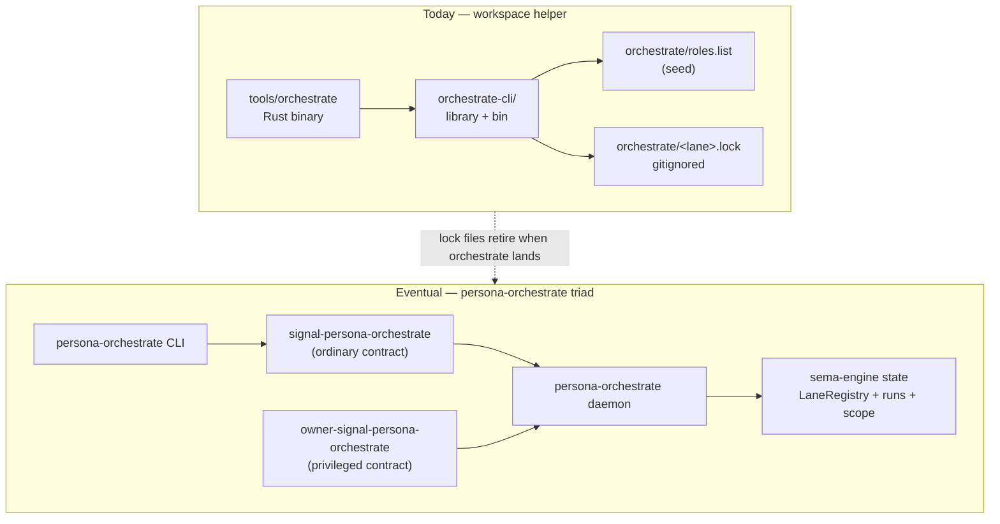
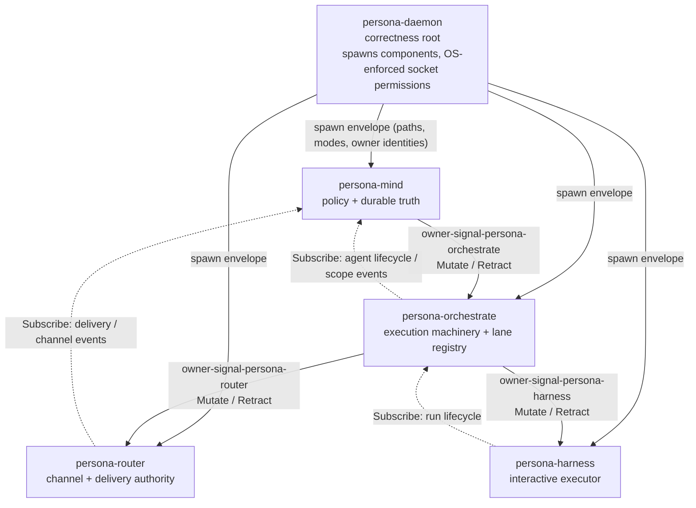

# orchestrate — architecture

*The workspace's coordination surface for who-is-doing-what.
Today: a thin Rust client against `signal-persona-mind` projecting
typed role records to per-lane lock files on disk. Eventual: a full
triad component (`persona-orchestrate`) carrying the execution
machinery — agent spawning, supervision, scheduling, escalation —
and a runtime-mutable lane registry. Lock files retire when the
component lands.*

> **Scope.** This file describes both the today-shape (running on
> every workspace) and the eventual-shape (the planned
> `persona-orchestrate` Persona component). Sections are tagged
> *today* or *eventual* where it matters. Per
> `~/primary/ESSENCE.md` §"Today and eventually — different things,
> different names", the today-shape is built rightly for the scope
> it serves now; it is not a draft of the eventual.

---

## 0 · TL;DR

`orchestrate` is the workspace's role-coordination surface. It
answers *who has claimed which scope right now* and *who is doing
which tracked work*. Today it is two pieces: the protocol document
at `orchestrate/AGENTS.md` and the `tools/orchestrate` Rust binary
(built from `orchestrate-cli/`). The binary decodes the convenience
argv form (`claim`/`release`/`status`) into typed
`signal_persona_mind::MindRequest` records and writes per-lane lock
files at `orchestrate/<lane>.lock` as the side-effect projection.

The eventual shape is a full triad component
(`persona-orchestrate`) per `~/primary/skills/component-triad.md`:
its own daemon binary, thin CLI client, ordinary
`signal-persona-orchestrate` contract, privileged
`owner-signal-persona-orchestrate` contract, and a `sema-engine`
database carrying the lane registry, agent-run lifecycle, scope
acquisition workflow, and scheduling state. The Mutate authority
chain runs through it — `persona-mind` orders orchestrate;
orchestrate orders `persona-router` (channel grants) and
`persona-harness` (agent spawn). Lock files disappear; the registry
becomes data, runtime-mutable via the owner socket.



---

## 1 · Components today (shell-helper era)

| Surface | Path | Role |
|---|---|---|
| Protocol document | `orchestrate/AGENTS.md` | Claim flow, release flow, lock-file format, BEADS/orchestration boundary, status command, blocked-work flow. |
| Lane registry | `orchestrate/roles.list` | One lane per line; optional `assistant-of:<main-role>` marker. Seed for the eventual typed registry; bash-readable today so the helper can be tooling-light. |
| Lane lock files | `orchestrate/<lane>.lock` | Per-lane runtime state; gitignored. Empty file means lane is idle. Each non-empty line is one scope, optionally annotated with `# <reason>`. |
| CLI binary | `tools/orchestrate` (bash shim → release binary) | The user-facing helper. Subcommands `claim`, `release`, `status`. |
| CLI source | `orchestrate-cli/` Cargo crate | Library + binary; thin client over `signal-persona-mind`. Lib re-exports cover `Lane`, `LaneRegistry`, `Workspace`, `NormalizedScope`, `LockFile`, `claim::*`, `request::*`, `render::*`. |

The binary's flow is *argv → typed MindRequest → lock-file
projection + overlap check → typed outcome → plain-text render
matching the shell-helper output byte-for-byte*. The typed
`MindRequest` is constructed for every flow so the future routing
to `persona-mind`'s socket is a single substitution.

Scope kinds the helper knows today:

| Kind | Form | Overlap rule |
|---|---|---|
| Path scope | absolute path | nested or equal paths overlap; siblings do not |
| Task scope | bracketed token `[primary-68cb]` | exact-match token equality |
| Cross-kind | — | never overlap |

`.beads/` is explicitly never a claim scope — the protocol forbids
it (BEADS is shared coordination state, not an ownership surface).
The helper rejects path scopes that resolve into the workspace
`.beads/` directory.

---

## 2 · Components eventual (`persona-orchestrate` triad)

| Surface | Repo | Role |
|---|---|---|
| Daemon + CLI | `persona-orchestrate/` | One Cargo crate, two `[[bin]]`s (`persona-orchestrate-daemon` long-lived; `persona-orchestrate` thin CLI client). Owns Kameo actor root + sema-engine database. |
| Ordinary contract | `signal-persona-orchestrate/` | Typed wire vocabulary for non-privileged callers: scope-acquisition submissions, blocked-work reports, own-run observation, plan validation. Plus read-only lane-registry observation/subscription. |
| Owner contract | `owner-signal-persona-orchestrate/` | Privileged vocabulary the owner component (`persona-mind`) speaks: spawn orders, scope-install orders, supervision policy, stop/drain, lane registry mutation (`RegisterLaneOrder`, `RetractLaneOrder`, `UpdateLaneMetadataOrder`). |

`persona-orchestrate` follows the five triad invariants:

1. The CLI has exactly one Signal peer — its own daemon.
2. The daemon's external surface is exclusively `signal-core` frames.
3. The verb is declared per-variant in the contract crate.
4. Durable state lives in a `sema-engine` database.
5. Privileged authority is on a separate `owner-signal-*` contract
   and socket.

One actor per Signal contract surface — the daemon binds an
ordinary socket and an owner socket, each handled by its own typed
client/server actor.

---

## 3 · Wire vocabulary

### Today

Argv → `signal_persona_mind::MindRequest`:

| argv | Verb | Record |
|---|---|---|
| `claim <lane> <scope>... -- <reason>` | `Assert` | `RoleClaim { role, scopes, reason }` |
| `release <lane>` | `Retract` | `RoleRelease { role }` |
| `status` | `Match` | `RoleObservation` |

`RoleName` is a closed 8-variant enum on the contract today
(`Operator`, `OperatorAssistant`, `Designer`, `DesignerAssistant`,
`SystemSpecialist`, `SystemAssistant`, `Poet`, `PoetAssistant`).
The workspace registry lists 11 lanes; the three second-tier
assistant lanes (`second-*-assistant`) collapse onto the matching
first-tier `*Assistant` variant for the typed projection. The
per-lane identity is preserved in the lock-file projection. This
collapse is the today-only compromise; the eventual shape (§4)
dissolves it.

### Eventual

`signal-persona-orchestrate` (ordinary):

| Family | Verb | Origin |
|---|---|---|
| `ScopeAcquisitionSubmission` | `Assert` | peer / CLI |
| `ScopeReleaseSubmission` | `Retract` | scope holder |
| `BlockedWorkReport` | `Assert` | executor / agent |
| `OwnRunObservation` | `Match` | peer / CLI |
| `OwnRunLifecycleSubscription` | `Subscribe` | peer / CLI |
| `SpawnPlanValidation` | `Validate` | mind / CLI dry-run |
| `LaneRegistryObservation` | `Match` | any peer |
| `LaneRegistrySubscription` | `Subscribe` | any observer |

`owner-signal-persona-orchestrate` (privileged; owner is
`persona-mind`):

| Family | Verb | Notes |
|---|---|---|
| `SpawnAgentOrder` | `Mutate` | Owner orders spawn/allocate of an agent run. |
| `StopAgentOrder` | `Mutate` / `Retract` | Stop a running allocation; exact semantics by whether stop is a transition or a removal. |
| `AcquireScopeOrder` | `Mutate` | Owner orders installation of an accepted scope. Distinct from the ordinary `ScopeAcquisitionSubmission`. |
| `ReleaseScopeOrder` | `Retract` | Owner retracts an installed scope. |
| `SetSchedulingPolicy` | `Mutate` | Owner adjusts scheduler/capacity policy. |
| `SetSupervisionPolicy` | `Mutate` | Owner registers restart/drain/escalation policy. |
| `EscalationOrder` | `Mutate` | Owner surfaces/escalates a blocked situation. |
| `RegisterLaneOrder` | `Mutate` | Add a new lane to the registry. |
| `RetractLaneOrder` | `Retract` | Remove a lane (no active claims). |
| `UpdateLaneMetadataOrder` | `Mutate` | Adjust `assistant-of` mapping or other lane metadata. |
| `OwnerSnapshotQuery` | `Match` | Full privileged state view. |
| `AgentLifecycleSubscription` | `Subscribe` | Privileged lifecycle stream. |

`LaneIdentifier` on the wire is a registry-minted typed identifier
(per the workspace's *infrastructure mints identity, time, and
sender* rule); the helper-era `RoleName` enum disappears entirely.
The shape (string newtype vs hash vs typed slot) is an open
contract-design question.

The submission/order distinction is structural: an `Assert
ScopeAcquisitionSubmission` is a peer asking, not authority
ordering. The owner's `Mutate AcquireScopeOrder` is mind's typed
authority decision after adjudication. The contract surfaces never
let an ordinary peer compile against owner-only frames.

---

## 4 · Authority chain

Persona's correctness is maintained top-down via Mutate chains.
`orchestrate` is mind's first downstream subordinate and the parent
of the runtime executors.



Each `Mutate` step is *obey-then-confirm*: the issuer holds
possibly-mutated state until the typed reply arrives; on
confirmation it transitions to now-mutated and may issue the next
downstream order. Replies are confirmations or typed rejections,
not opinions. The chain is the protocol that lets the next step be
safe — the harness is not spawned with channel rights until the
router has confirmed the channel exists. Per
`~/primary/skills/component-triad.md` §"The six verbs".

Subscriptions flow the opposite direction: observers up-tree
subscribe to producers down-tree. Mind subscribes to orchestrate's
agent-lifecycle events; orchestrate subscribes to harness/router
events. Push, not poll (per `~/primary/skills/push-not-pull.md`).

---

## 5 · State and ownership

| State | Owner | Notes |
|---|---|---|
| Lane lock files *(today)* | filesystem at `orchestrate/<lane>.lock` | Gitignored runtime projection of typed claim/release records. Retires with `persona-orchestrate`. |
| Lane registry | `orchestrate/roles.list` *(today)* → `persona-orchestrate.redb` `LaneRegistry` table *(eventual)* | Seed-on-disk today; runtime-mutable durable state via owner-Mutate eventually. |
| Role claims, releases, handoffs | `persona-mind.redb` | Mind owns the durable role/coordination truth. Orchestrate orchestrates the workflow; mind persists the result. |
| Work graph, decisions, activity | `persona-mind.redb` | Mind state. Not duplicated in orchestrate. |
| Agent-run lifecycle, spawn plans, scope acquisition workflow, scheduling state, escalation state | `persona-orchestrate.redb` | Execution machinery state. Not in mind. |
| Channel state | `persona-router.redb` | Router state. Orchestrate orders grants; router persists. |
| Component process lifecycle | `persona-daemon` | Engine manager. Owns spawn, sockets, OS permissions. |

The introspection split is clean: ask mind for *what is true about
roles and work*; ask orchestrate for *what is running and what is
pending*; ask persona-daemon for *which components are alive*.

---

## 6 · Boundaries

This surface owns:

- The claim / release / status flow at the workspace level *(today)*.
- The lane lock-file format and overlap-detection rules *(today)*.
- The role-coordination protocol document `orchestrate/AGENTS.md`.
- The lane registry's editable seed `orchestrate/roles.list`
  *(today)* and the runtime-mutable `LaneRegistry` table *(eventual)*.
- Agent-run lifecycle, supervision policy, scheduling, escalation
  *(eventual, in `persona-orchestrate.redb`)*.

It does not own:

- The role records themselves (`RoleClaim`, `RoleRelease`,
  `RoleHandoff`, `ActivitySubmission`). Those live in
  `signal-persona-mind` and persist in `persona-mind.redb`.
- The work graph (items, notes, edges, decisions, aliases). Mind's
  surface.
- Channel state. Router's surface.
- Component process lifecycle, socket creation, OS permission
  substrate. `persona-daemon`'s surface.
- Terminal byte paths. `persona-terminal` / `terminal-cell`
  surface.
- The BEADS database. Shared coordination state; never claimed,
  never owned by any one component.

---

## 7 · Constraints

- The claim helper never owns BEADS as a claim scope. A path scope
  resolving into the workspace `.beads/` directory is rejected
  before any write.
- Lock-file overlap rules: path scopes overlap iff nested or equal;
  task scopes overlap iff the bracketed token matches exactly;
  cross-kind scopes never overlap. *(today)*
- The `tools/orchestrate` binary is a thin Signal client; it does
  not invent a parallel claim vocabulary. Every flow projects into
  the contract's typed records *(today: `signal-persona-mind`;
  eventual: `signal-persona-orchestrate`)*.
- Lock files are gitignored runtime state; they never travel
  between machines and never appear in version-control history.
- *(Eventual)* The daemon's durable state lives in a `sema-engine`
  database. The lane registry is a registered table; mutation
  happens via the engine's `Assert` / `Mutate` / `Retract` verbs
  and emits per-commit subscription deltas.
- *(Eventual)* Owner-only operations are inexpressible on the
  ordinary contract; ordinary callers cannot compile against
  `owner-signal-persona-orchestrate` types.
- *(Eventual)* Owner-socket connectivity is OS-enforced via
  per-component Unix users/groups established by `persona-daemon`
  at spawn time. A non-owner component cannot connect to the
  owner socket even if it knows the path.
- *(Eventual)* The daemon binds one socket per Signal contract
  surface; one typed client/server actor per socket. No generic
  multi-contract socket actor exists.
- *(Eventual)* The CLI has exactly one Signal peer (its own
  daemon's ordinary socket).
- *(Eventual)* The CLI accepts exactly one NOTA request record on
  argv/stdin and prints exactly one NOTA reply record.

---

## 8 · Invariants

- Roles are coordination identities, not security identities. The
  OS security boundary is per-component Unix users/groups
  *(eventual)*; the lane is workflow vocabulary on top of it.
- The contract is the model. Authority is verb-shaped on the wire
  (`Mutate` = top-down order; `Assert` = new fact; `Subscribe` =
  observation), not encoded as runtime if-statements over a broad
  enum.
- Mind is the policy + durable-truth authority root for role and
  work records. Orchestrate is the workflow and execution
  machinery between mind and the runtime executors. Neither
  duplicates the other's records.
- The lane registry is data. New lanes land via configuration
  *(today)* or owner-Mutate *(eventual)*, not by recompiling
  contract crates.

---

## Code Map

```text
orchestrate/
├── ARCHITECTURE.md            this file
├── AGENTS.md                  protocol document (claim/release/status, lock format)
├── roles.list                 lane registry (one per line; assistant-of:<main>)
└── <lane>.lock                gitignored per-lane runtime state

orchestrate-cli/               today's Rust port (shell-helper-era)
├── Cargo.toml
├── src/
│   ├── lib.rs                 module entry + re-exports
│   ├── error.rs               typed Error enum
│   ├── lane.rs                closed 11-variant Lane enum + role-name projection
│   ├── registry.rs            roles.list parser
│   ├── scope.rs               RawScope + NormalizedScope + lexical resolve
│   ├── lockfile.rs            LockFile parser/writer
│   ├── overlap.rs             path-nesting + task exact-match
│   ├── workspace.rs           Workspace layout (root, locks, beads)
│   ├── request.rs             argv → MindRequest projection
│   ├── claim.rs               claim/release/status flows + outcomes
│   ├── render.rs              plain-text rendering (shell-byte-compatible)
│   └── bin/orchestrate.rs     CLI entry
└── tests/                     pure + integration witnesses

tools/orchestrate              bash shim → orchestrate-cli release binary

(eventual) /git/github.com/LiGoldragon/persona-orchestrate/
(eventual) /git/github.com/LiGoldragon/signal-persona-orchestrate/
(eventual) /git/github.com/LiGoldragon/owner-signal-persona-orchestrate/
```

---

## See also

- `~/primary/ARCHITECTURE.md` — the workspace's apex architecture
  this surface sits inside.
- `~/primary/orchestrate/AGENTS.md` — the role-coordination
  protocol (the procedural counterpart of this file).
- `~/primary/skills/component-triad.md` — the universal shape
  `persona-orchestrate` will take; the five invariants this
  architecture commits to *(eventual)*.
- `~/primary/skills/role-lanes.md` — the lane meta-pattern; under
  the runtime-mutable registry this becomes a single owner-Mutate
  per lane.
- `~/primary/skills/contract-repo.md` — the contract-crate
  discipline `signal-persona-orchestrate` and
  `owner-signal-persona-orchestrate` follow.
- `~/primary/skills/push-not-pull.md` — subscriptions; the
  observation discipline orchestrate respects on both sides.
- `~/primary/skills/architectural-truth-tests.md` — the witness
  shape every triad invariant takes.
- `~/primary/ESSENCE.md` §"Infrastructure mints identity, time,
  and sender" — the rule the eventual `LaneIdentifier` follows.
- `~/primary/ESSENCE.md` §"Today and eventually — different
  things, different names" — the scope discipline this file
  follows.
- `/git/github.com/LiGoldragon/signal-persona-mind/ARCHITECTURE.md` —
  the contract today's helper projects into.
- `/git/github.com/LiGoldragon/sema-engine/ARCHITECTURE.md` — the
  database engine the eventual `LaneRegistry` table runs over.
- `/git/github.com/LiGoldragon/signal-core/ARCHITECTURE.md` — the
  wire kernel and the six-verb spine.
