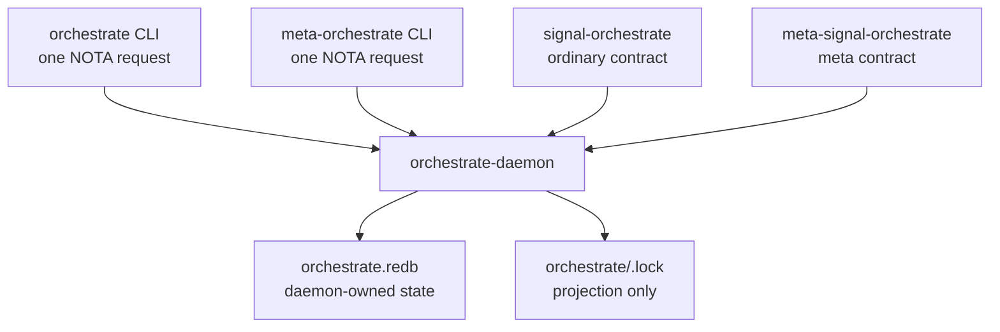

# orchestrate — architecture

*The workspace's daemon-backed coordination surface for who-is-doing-what.*

## 0 · Current shape

`orchestrate` answers *who has claimed which scope right now* and *who is doing which tracked work*. The production implementation is the `orchestrate` component:

- `orchestrate-daemon` owns durable coordination state in `orchestrate/orchestrate.redb`.
- `orchestrate` is the ordinary thin CLI. It takes exactly one NOTA request and prints exactly one NOTA reply.
- `meta-orchestrate` is the meta-policy thin CLI for owner-level operations.
- `signal-orchestrate` is the ordinary working contract.
- `meta-signal-orchestrate` is the meta-policy contract.
- `orchestrate/<lane>.lock` files are downstream visibility projections only.

New coordination work uses direct NOTA through the component CLI.



## 1 · Ordinary operations

Common ordinary calls:

```sh
orchestrate "(Claim (system-maintainer [(Path /absolute/path/to/workspace/AGENTS.md)] [refresh coordination docs]))"
orchestrate "(Release system-maintainer)"
orchestrate "(Observe Roles)"
orchestrate "(Observe Lanes)"
orchestrate "(Observe Worktrees)"
orchestrate "(Query (20 []))"
```

Scope kinds:

| Kind | NOTA form | Overlap rule |
|---|---|---|
| Path scope | `(Path /absolute/path)` | nested or equal paths overlap; siblings do not |
| Task scope | `(Task primary-68cb)` | exact token equality |
| Cross-kind | — | never overlap |

`.beads/` is explicitly never a claim scope. BEADS remains a shared work-item store while it exists; orchestrate coordinates active ownership, not BEADS storage.

## 2 · State and projection

The daemon-owned store is canonical. Lock files are regenerated projections for humans and for old eyes-on-files workflows. Agents may inspect a lock file, but they do not edit it as the working path.

| State | Owner | Notes |
|---|---|---|
| Active role claims | `orchestrate-daemon` / `orchestrate.redb` | Mutated by `Claim`, `Release`, and `Handoff`. |
| Lane registry | `orchestrate-daemon` / `orchestrate.redb` | Observed by `Observe Lanes`; changed through meta operations. |
| Worktree registry | `orchestrate-daemon` / `orchestrate.redb` | Observed by `Observe Worktrees`. |
| Lock files | projection under `orchestrate/*.lock` | Human-readable projection; not canonical. |
| BEADS | `.beads/` | Shared transitional work-item store, not a claim scope. |

## 3 · Component boundary

`orchestrate` follows the component triad discipline:

1. The CLI has exactly one Signal peer — its own daemon.
2. The daemon's external surface is Signal frames.
3. The public verbs live in the contract crates.
4. Durable state lives in the daemon-owned SEMA/redb store.
5. Meta authority is separated onto `meta-signal-orchestrate` and the meta socket.

The CLI is a text edge: it accepts NOTA for humans and sends the typed binary frame to the daemon. The daemon does not become an argv parser and does not gain a compatibility command grammar.

## 4 · Current code map

```text
github:LiGoldragon/orchestrate/
├── src/main.rs                 orchestrate-daemon
├── src/bin/orchestrate.rs      ordinary one-NOTA CLI
├── src/bin/meta_orchestrate.rs meta one-NOTA CLI
├── src/claim.rs                claim/release/handoff logic
├── src/lock_projection.rs      lock-file projection from daemon state
├── src/tables.rs               SEMA/redb table access
└── schema/                     schema-authored runtime planes

github:LiGoldragon/signal-orchestrate/
└── schema/lib.schema           ordinary request/reply contract

github:LiGoldragon/meta-signal-orchestrate/
└── schema/lib.schema           meta-policy request/reply contract

<workspace>/orchestrate/
├── AGENTS.md                   operator-facing protocol
├── ARCHITECTURE.md             this file
├── roles.list                  transitional seed / documentation of lanes
├── orchestrate.redb            daemon store
└── <lane>.lock                 projected runtime state
```

## 5 · Current invocation surface

Callers use the contract shape directly:

```text
orchestrate "(Claim (system-maintainer [(Path /path)] [reason]))"
orchestrate "(Release system-maintainer)"
orchestrate "(Observe Roles)"
```
