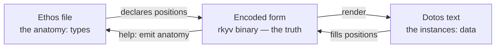

# Ethos and Dotos: the Syntax Primer — 2026-08-02

The two syntaxes most agents will face. **Ethos specifies types — the
anatomy. Dotos fills them with data — the instances.** The basic CLI
help of a Dotos-speaking object emits the Ethos anatomy of its types:
you learn what data to write by reading the type that expects it.

Authority lives in the design log (`design/ProtosEngine/`); this primer
is the training projection of the seated rulings, written 2026-08-02.

## 1. The one idea under both

Text is a projection. The truth is the encoded form (rkyv binary); the
reader and writer move between text and encoded form through one shared
structural mechanism. Therefore:

- **The expected type at every position is known before reading.** The
  reader never guesses meaning from token content; it asks which
  admissible form this shape selects at this known position.
- **Everything is positional.** No field names in data, no type tags on
  values, no labels — position carries the meaning, and the type
  carries the names.
- **Never write what the position or type already knows.** Repetition
  the position implies is an implementation failure, not style.
- **No grammar keywords.** Builtins are prior definitions; what a
  symbol means comes from what it resolves to, never from spelling.

When designing or judging syntax, always consider how it is encoded
and decoded — that rule catches every mistake below before it is made.



## 2. The mirror: same delimiters, two sides

The anatomy and its data, side by side:

```ethos
Topic.Text
Topics.Vector.Topic
Kind.[Decision Principle Correction]
Magnitude.[Low Medium High]
Description.Text
Entry.{Topics Kind Description Magnitude}
```

```dotos
{[net dns] Decision (primary resolver flaked) High}
```

That Dotos line is a complete `Entry`. Read the pairs:

| Anatomy (Ethos) | Instance (Dotos) | Why |
| --- | --- | --- |
| `Entry.{Topics Kind Description Magnitude}` | `{...}` | struct is `{}`; the body is headless — the position already knows it holds an Entry |
| `Topics.Vector.Topic` | `[net dns]` | vectors are `[]`; bare atoms are canonical strings |
| `Kind.[Decision ...]` | `Decision` | a unit variant is its bare name |
| `Description.Text` | `(primary resolver flaked)` | multi-word text takes `()` |
| `Magnitude.[... High]` | `High` | position selects the enum; the value selects the variant |

More mirror pairs:

| Anatomy | Instance |
| --- | --- |
| `RecordIdentifier.Integer` (newtype) | `7` — newtypes are invisible in data; the position knows |
| `Status.[Pending Ready.Integer Batch.{Vector.Integer Integer}]` | `Pending` / `Ready.7` / `Batch.{[3 9] 2}` |
| `Identifiers.Vector.Integer` | `[3 9 27]` |
| a vector of Entry | `[{...} {...}]` — headless bodies, no per-element tags |

## 3. Dotos peculiarities (the data side)

- **Struct is `{}`**, vector is `[]`, multi-word text is `(...)`.
- **Bare atoms are canonical strings** — `dns`, `schema:spirit:Entry`,
  `github:LiGoldragon/dotos` (`:` and `/` are legal atom characters).
  Atoms are classified by the expected type, not by their spelling.
- **Dotted variants**: `Idle` (unit), `Tick.7` (single field, payload
  carried directly whatever its delimiter — `Batch.[3 9 27]`,
  `Deprecated.(remote archived + local deleted)`), `Range.{3 9}`
  (multi-field product takes braces), and nested enum paths
  `Technology.Software.Programming.CodeGeneration`.
- **Pipe-text** `(|...|)` / `[|...|]` only when content genuinely
  needs it: structural delimiters, `;;`, or multiline. Multiline
  pipe-text is dedented by the minimal common indent of its lines —
  indentation belongs to the document, never to the value.
- **Every field is present**: an empty collection is written `[]`,
  never omitted.
- **`;;` comments.**
- **Never**: a type tag on a value at a known position, a field label,
  a wrapper restating what position implies. `(Repo dotos ...)` and
  `(Family Dotos)` are the canonical mistakes — the corrections are a
  headless `{...}` body and a bare `Dotos`.

## 4. Ethos peculiarities (the type side)

- **A file is header, imports, body.** The header is two things: the
  file kind and a version (`Interface.1`). Imports are the second
  object, textual-form-only (encoded form addresses absolutely).
  The body's root type comes from the header's kind; file kinds differ
  ONLY by root type — one shared parsing machinery.
- **Shape declares kind, name comes first**: `X.Y` newtype, `X.[...]`
  enum, `X.{...}` struct. Inside an enum body the same shapes mean
  variants: `A`, `A.T`, `A.{T1 T2}`. Same surface, different position,
  different meaning — that is the design, not an accident.
- **Applications are operator-first**: `Stream.Observer.{...}` is a
  stream named Observer. The one law: **an operator is written exactly
  once — as the head of a standalone application — or zero times, when
  its section supplies it; never as the second symbol of a name-first
  form.** (`Observer.Stream.{...}` standalone is incoherent: it decodes
  as a newtype of the application.)
- **Sections supply operators.** In an interface file the body
  positions are inputs, outputs, refusals, shared types: a type listed
  in the inputs position falls under the input trait with nothing
  written. In a traits file every declaration is a trait, no tag. In a
  sema file, families are `table.{Record Key}`.
- **Traits**: `ScopeContainment.{contains.{Scope Bool}}` — each member
  is `method.{Params... Return}`, last position is the return type,
  the receiver is implied by membership, and borrowing/dispatch belong
  to the assembly layer, never authored.
- **Generics are traits**: `SimpleGeneric` takes a contract reference,
  never a type variable — Rust's `T` is a generated visible name.
- **Most terse, never repetitive**: if a symbol can be implied by
  position or by the governing Nomos object, writing it is an
  implementation failure of the language, and the fix belongs in the
  transformer, not in the author repeating themselves.

## 5. How an agent avoids every historical mistake

1. Before writing any form, name the position you are at and its
   expected type. If you cannot, stop — you are guessing.
2. Ask what the encoder and decoder do with your spelling. A form that
   needs the reader to reach outside its own structure is wrong.
3. Write no word the position, section, file kind, or type already
   supplies: no type tags, no field labels, no repeated symbols, no
   empty ceremony.
4. Struct is `{}`.
5. Operators lead or vanish; names never precede their operator.
6. Pipe-text is for content that needs it, nothing else.
7. When you need a new pattern, do not bend the grammar — that is a
   new Nomos object with its own most-terse surface.
8. Text is not the truth. When in doubt, reason about the encoded
   form, then ask what text should project it.
