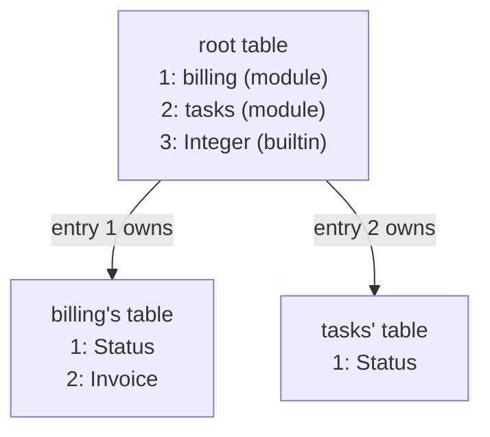

# Naming Model Brief — 2026-07-28

For the Codex root session and its subagents. This brief renders the naming and
identity model as ruled and confirmed in
`protos-engine/design/ProtosEngine/DesignReviewRulings-2026-07-28.md` (entries
1–11 — read them; they control wording). It **supersedes** the naming
amendments in the earlier translator-daemon reply wherever they conflict — in
particular, the "one global lexicon" rendering is dead; the model is nested.

## The model

1. **One nametable per module.** A module's members receive their encodedIDs
   from their own module's table. The module itself is an entry in its
   container's table, recursively, up to the root. Containment is structural —
   membership is never an attribute on a flat row.
2. **The durable identity is the encodedID** (the concept earlier called
   coreID; the code currently calls it `Identifier` — the rename to encodedID
   rides the terminology train). Nothing else mints identity. There is no
   per-thing content-hash identity (see 9).
3. **A thing's full identity is the chain of encodedIDs** from the root:
   billing's Status above is 1.1, tasks' Status is 2.1. EncodedForm references
   hold chains of integers, never words.
4. **Rename is a one-entry spelling edit in the owning table — identical at
   member and module level.** Renaming tasks' Status edits entry 1 in tasks'
   table; renaming the module edits entry 2 in the root table. No reference,
   no identity, and no emitted name moves. Rename (and all editing, in the
   endgame) is an operation sent to the daemon and applied atomically.
5. **Words-as-values never rename.** Language vocabulary (Rust keywords, std
   names) and dynamic-enum value words are things whose spelling is their
   substance; changing one is a value change, not a rename.
6. **Redefinition at seal = the same spelling twice in one module's table.**
   Rationale, ruled: this matches what the parsers of the bridged standard
   languages accept — the constraint is inherited from the textual interface,
   not intrinsic to the model. Do not build anything that depends on it being
   a deep invariant.
7. **The tables are exact and case-sensitive.** "public" and "Public" are
   different entries. No canonicalization, no case logic, no normalization in
   any table — casing and derivation live in the projection layer, evaluated
   only at TextualForm.
8. **Emitted Rust identifies our things by a rustc-friendly textual encoding
   of the encodedID chain**, not by projected human names — rename-proof by
   construction. Rust's own vocabulary keeps Rust's spellings. The encoding
   scheme is undesigned matter: propose it (rustc rules: letter or underscore
   first). Accessibility mitigations (regenerated doc comments carrying
   projected names) are matter for the same proposal.
9. **Content hashing is whole-capsule, after full encoding — nothing else is
   ruled.** core-logos's per-item `content_identity()` stands on
   implementation, not on any ruling; reconcile it in the identity-train
   proposal rather than assuming it. Recursive leaf-first hashing is
   explicitly undiscussed — do not build it.
10. **Token-level longest-match is law** (entry 1): a token is the longest run
    its character class accepts; typed disjointness and conservative refusal
    govern everything above the token level.
11. **Terminology:** the container's working term is **module**; never
    "domain" (the word is four-times taken for hash separation — term-overload
    law). The final term is matter and can itself be renamed later.

## What this changes in the translator-daemon plan

The approved operational frame stands: sole writer, atomic idempotent
universe sealing, typed authorization and failures, no distributed
transaction, engines caching verified immutable snapshots. What must be
revised before implementation:

- The stored-state model becomes **nested module-owned tables with encodedID
  chains** — not global spelling bindings.
- **The rename operation enters the contract**: an atomic spelling edit on one
  entry of one module's table, member and module alike.
- **name-table's flat word→ID index (`NameIndexCollision`) is off-model**: the
  replacement is module-scoped lookup. Do not "fix" the collision in place;
  redesign the lookup direction in the revised proposal.
- Allocation refines entry 3 of the log: allocation is by module — "unallocated
  word" means unallocated in that module's table.

Bring the revised stored-state section back as a design proposal before any
code, meeting the conduct bar of log entry 10 of SliceOneRulings and entry 10's
explained-in-practice law.

## Open — do not infer, do not code around

- The root table's top-level variant set (open question 12 of the handover).
- The encodedID chain encoding scheme for emission.
- The **move** operation (re-parenting a thing between modules): follows from
  the same operational-editing endgame but is unruled.
- How module tables relate to the capsule's pinned composed nametree, and
  whether capsule IDs are minted or derived — unruled; decisive for parts of
  the capsule contract.
- Whether dynamic-enum members become things with their own encodedIDs — this
  touches "stored as integers using this SEMA naming component" and is unruled.
- Identifier retirement policy; the daemon's final name.

## Poisoned documents — correct before subagents read them

Verified 2026-07-28 by audit; both teach refused or off-model designs as canon:

- `raw-discovery/ARCHITECTURE.md` — a section titled "Structure is span-free"
  presents the refused span-free block model as design and never mentions the
  real `BlockCue`/`BlockTree` machinery.
- `core-nomos/ARCHITECTURE.md` — relabels the 1,892-line `generation.rs` as
  "the emission boundary, not macro evaluation", a written license to bypass
  the no-strings rule for anything called "emission".
- `sema-storage/ARCHITECTURE.md` and `ethos-engine/ARCHITECTURE.md`/`AGENTS.md`
  — still document the overruled central-daemon architecture (already known).
