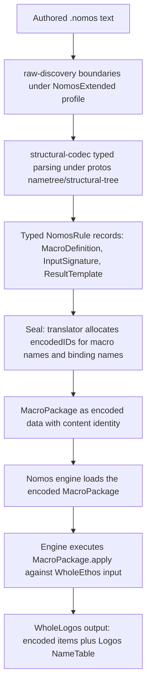

# Authored Nomos: the TextualNomos Surface and Load Path

A design proposal for how transformation rules are authored as data in text,
loaded by the protos infrastructure, and executed by the Nomos engine. This is
the missing TextualNomos surface the crate itself names as open: "TextualNomos
... remains an open design question. Nothing in this crate parses or prints a
Nomos text surface" (core-nomos lib.rs lines 8-14).

This document is a proposal. Settled law is quoted verbatim with its log and
entry. Proposal text is the designer's and marked as such. Open decisions for
the psyche are collected in section 8.

## 1. The Existing Machinery

The production Nomos engine is already a transformers-as-data system. The design
does not start from zero.

**MacroDefinition** (core-nomos/src/definition.rs) is "one macro, entirely as
data: its stringless name, its kind, its typed input signature ... and its
result template ... a macro is a value." Its fields, all typed:

1. `name: Identifier` (positional: the macro's stringless name)
2. `kind: MacroKind` (Named or Structural with a SectionDefault)
3. `input: InputSignature` (the `{ ... }` meta-shape as data)
4. `template: ResultTemplate` (quoted logos skeleton with escape nodes)

**The escape algebra** (template.rs) is closed at three members: `Realize`
(unquote one bound value with an optional name transform), `Invoke` (recursively
call another macro by identity), and `Splice` (expand a bound sequence into a
vector). This is the system the psyche confirmed: **[confirmed]** "transformers
are data" (ShapeAndSliceRulings entry 8, confirmed 2026-07-27; the original
turn is unlocated).

**MacroPackage** (package.rs) is "Nomos stateful at rest": a content-identified
`MacroDefinitions` table keyed by `MacroIdentity`, plus a sibling NameTable
excluded from the content hash. The package is rename-stable by construction:
renaming a macro edits only the sibling NameTable.

**The engine** (engine.rs) applies the package to a `WholeEthos` through
`MacroPackage::apply` / `apply_enriched`, producing `Lowering` (a
`Vec<EncodedItem>` plus a Logos NameTable). Evaluation is typed end to end; no
text crosses this path.

**What is missing:**

1. **No authoring surface.** Macros are constructed by Rust functions in
   `fixtures.rs`. There is no file format, no text syntax, no loading from
   authored artifacts.

2. **The enriched generation surface is not data.** `GenerationClass` variants
   are dispatch tags; `generation.rs` (1,890 lines) builds method and match
   skeletons directly in hardcoded Rust, routed through string-bearing machinery
   (`name_boundary.rs`, `prelude.rs`). The compilation notes: "the no-strings
   law is honored exactly one file deep" (ProtosEngineDesign section 14).

This proposal addresses gap 1 entirely and frames gap 2 as a growth path within
the same surface.

## 2. The Transformer as an Authored Object

A transformer (a `MacroDefinition` or a `MacroPackage`) is authored data. It has
a name, and that name is a word like any other authored word. The identity
question has a standing answer:

**[ruled]** (DesignReviewRulings entry 3): "no, nothing declares the coreID, the
coreID is allocated by the translator on receiving an unallocated word."

The transformer's name is an authored word. When the translator receives it, the
translator allocates its encodedID. There is no special minting ceremony. The
word `WireNewtype` arrives at the translator, receives an encodedID in the
module's table, and becomes durably identifiable. The same mechanism that gives
`Status` or `Entry` their identities gives `WireNewtype` its identity.

The `MacroIdentity(u32)` that currently keys the package-internal table is a
package-local mint index (identity.rs line 13: "a monotonic package mint").
Under the full authored path, this local index relates to the translator's
encodedID the same way any internal representation relates to the durable
identity: the translator allocates the durable ID when the authored word first
arrives; the package-local index is implementation structure.

## 3. The TextualNomos Syntax

### 3.1 Design Constraints

The syntax is a textualform view on typed encoded data. Every syntactic element
maps to a typed position in a fully typed record. This is the strict invariant:

**[confirmed]** (SliceOneRulings entry 9): "nametree and structural tree from
the protos library drive all the decoding and encoding to/from text with DATA -
strict invariant. nothing else will do."

**[ruled]** (ShapeAndSliceRulings entry 2): "wtf is this garbage? Thats a vector
of strings, not typed data! it should be fully typed struct."

**[ruled]** (ProtosEngineDesign section 10): "in the nomos transformation
([ethos] to logos), there shall be *no string manipulation/introduction/reading
of any kind*", with walkers at the boundary ("that is necessary.").

No bare strings as rule content. Spellings are data on typed positions. Fields
are positional. The syntax must feel like the same language family as Ethos.

### 3.2 The Nomos Glyph Extension

The raw-discovery profile already provisions for Nomos: `GlyphSet::NomosExtended`
(profile.rs line 44) admits the `$` sigil that the Standard profile forbids. The
Nomos textualform uses the NOTA family's existing boundary mechanisms (dotted
application, braces, square brackets, parentheses, `(| ... |)` carriers) plus
the `$` sigil for escape positions. The `;;` line comment is shared.

### 3.3 Running Example 1: the Enumeration Structural Default

The current Rust fixture (fixtures.rs lines 199-232) builds the enumeration
structural default. Its data content:

- Name: `Enumeration`
- Kind: `Structural(SectionDefault::Enumeration)`
- Input: `{ name: Name, variants: Variants }`
- Template: an `EnumerationTemplate` with visibility Public, attributes invoking
  `EnumerationAttributes`, name realized from the `name` binding, empty generics,
  variants spliced from the `variants` binding.

**Proposed textualform:**

```
Enumeration.Structural.Enumeration {
  ($name.Name $variants.Variants)
  Public @EnumerationAttributes $name () [$@variants]
}
```

**Position-by-position mapping:**

| Syntax element              | Typed record position                            |
|:----------------------------|:-------------------------------------------------|
| `Enumeration`               | `MacroDefinition.name` (Identifier)              |
| `Structural.Enumeration`    | `MacroDefinition.kind` (MacroKind variant)        |
| `($name.Name ...)`          | `MacroDefinition.input` (InputSignature)          |
| `$name`                     | `InputParameter.binding` (Identifier)             |
| `Name`                      | `InputParameter.meta` (MetaType::Name)            |
| `$variants`                 | `InputParameter.binding` (Identifier)             |
| `Variants`                  | `InputParameter.meta` (MetaType::Variants)        |
| `Public`                    | `EnumerationTemplate.visibility` (literal)        |
| `@EnumerationAttributes`    | `Escape::Invoke(MacroIdentity)` in attributes     |
| `$name`                     | `Scalar::Escape(Realize{name, Identity})` for name|
| `()`                        | `Generics::none()`                                |
| `[$@variants]`              | `Sequence::of(Escape::Splice{variants, Variant})` |

The sigil vocabulary:

- `$binding` — Realize escape (unquote one bound value, identity transform)
- `$@binding` — Splice escape (expand a bound sequence into the vector)
- `@MacroName` — Invoke escape (recursively call a named macro)
- Bare words — literal encoded values (identifiers resolved through the
  nametree)
- `.` — application (dotted declarations, as in Ethos)
- `{ ... }` — the template body delimiter
- `( ... )` — input signature delimiter, also generics and grouping
- `[ ... ]` — variant/vector positions

This corresponds to the existing closed escape set: `$` is Realize, `$@` is
Splice, `@` is Invoke. The psyche's ruling confirmed exactly two escape
primitives plus one recursion mechanism: **[ruled]** "the escape set is closed
at two primitives (`$x` realizes, `$@xs` splices — 'agreed')"
(ProtosEngineDesign section 11). The `@` invoke is the recursion mechanism, not
a third escape primitive; the psyche ruled the closed set and `Invoke` is the
recursive call into another macro by identity.

### 3.4 Running Example 2: the Newtype Structural Default

The production fixture (fixtures.rs lines 131-159):

```
WireNewtype.Structural.Newtype {
  ($name.Name $type.Type)
  Public @WireAttributes $name $type
}
```

Mapping: `Public` is the literal `Visibility::Public` for the produced item.
`@WireAttributes` invokes the attributes macro. `$name` realizes the bound
`name` as `Scalar::Escape(Realize{name, Identity})`. `$type` realizes the bound
`type` as `Scalar::Escape(Realize{type, Identity})`.

The wrapped field's visibility (`Private`) is positional in the
`NewtypeTemplate` struct and does not appear in the syntax because it is the
fixed structural default for that position. **Decision point 1:** should the
template syntax make the wrapped-field visibility explicit (e.g.
`Public @WireAttributes $name Private.$type`) or should it remain positional and
implicit? The current `NewtypeTemplate` struct carries it as an explicit field.
Making it visible in the textualform is the more honest position.

With explicit wrapped visibility:

```
WireNewtype.Structural.Newtype {
  ($name.Name $type.Type)
  Public @WireAttributes $name Private $type
}
```

### 3.5 Running Example 3: the Named Attributes Macro

The `WireAttributes` macro (fixtures.rs lines 108-115):

```
WireAttributes.Named {
  ()
  [
    rustfmt.skip
    (| nota-text |).[ nota.NotaDecode nota.NotaDecodeTraced nota.NotaEncode ]
    [ rkyv.Archive rkyv.Serialize rkyv.Deserialize Clone Debug PartialEq Eq ]
  ]
}
```

This is a `ResultTemplate::Attributes(Sequence<Attribute>)`. The input is unit
`()`. The body is a vector of literal attributes:

- `rustfmt.skip` is `Attribute::ToolPath(PathNode{["rustfmt", "skip"]})`
- The `(| nota-text |)` carrier is a `ConfigurationAttribute` with a
  `ConfigurationPredicate::Feature("nota-text")` wrapping a derive group
- The `[ ... ]` square bracket group is a `DeriveGroup`

The syntax reuses the NOTA carriers and boundaries exactly as the existing
profile defines them. The `(| ... |)` carrier already exists in
raw-discovery's trigger definitions for the NomosExtended profile (profile.rs
line 412-416).

### 3.6 Running Example 4: the Particular-Struct Default

```
ParticularStruct.Structural.Struct {
  ($name.Name $fields.Fields)
  Public @WireAttributes $name () [$@fields.FieldRuleDispatch.Public]
}
```

The splice element carries the field-name rule and the per-field visibility:
`$@fields.FieldRuleDispatch.Public` means
`Splice{fields, SpliceElement::Field{FieldRuleDispatch, Public}}`.

### 3.7 A Complete `.nomos` File: the Wire Package

A `.nomos` file is a complete `MacroPackage`. It follows the six-slot document
structure that Ethos uses (the fixtures confirm this: `spirit-min.ethos` has six
top-level blocks). The Nomos slots carry:

```
;; Wire package revision 1
{1}
;; No interface inputs
[]
;; No interface outputs
[]
;; Macro definitions
{
  WireAttributes.Named {
    ()
    [
      rustfmt.skip
      (| nota-text |).[ nota.NotaDecode nota.NotaDecodeTraced nota.NotaEncode ]
      [ rkyv.Archive rkyv.Serialize rkyv.Deserialize Clone Debug PartialEq Eq ]
    ]
  }

  EnumerationAttributes.Named {
    ()
    [
      rustfmt.skip
      (| nota-text |).[ nota.NotaDecode nota.NotaDecodeTraced nota.NotaEncode ]
      [ rkyv.Archive rkyv.Serialize rkyv.Deserialize Clone Copy Debug PartialEq Eq ]
    ]
  }

  WireNewtype.Structural.Newtype {
    ($name.Name $type.Type)
    Public @WireAttributes $name Private $type
  }

  ParticularStruct.Structural.Struct {
    ($name.Name $fields.Fields)
    Public @WireAttributes $name () [$@fields.FieldRuleDispatch.Public]
  }

  Enumeration.Structural.Enumeration {
    ($name.Name $variants.Variants)
    Public @EnumerationAttributes $name () [$@variants]
  }
}
;; No enriched generation selection (plain package)
{}
;; No capsule metadata
{}
```

### 3.8 Name Transforms in the Syntax

The `NameTransform` variants (Identity, FieldName, Screaming, PascalCase) apply
to Realize escapes. The bare `$name` is identity. Transformed realizations
use a dotted suffix:

- `$name` — `NameTransform::Identity`
- `$name.FieldName` — `NameTransform::FieldName`
- `$name.Screaming` — `NameTransform::Screaming`
- `$name.PascalCase` — `NameTransform::PascalCase`

These are data on a typed position (the `Realize.transform` field), not string
operations: "name synthesis inside `Realize` instead of becoming a fourth
escape" (template.rs line 93-94). The NameTableBoundary performs the actual
derivation at the boundary, not during evaluation.

### 3.9 Running Example 5: ScopeOf Expansion

This is the complex case. `DomainScope.ScopeOf.Domain` is a single authored
Ethos declaration that must expand into complete ordinary Logos data: 38 scope
enums mirroring the 38 domain enums, plus conversions and containment
operations.

The ScopeOf expansion is a different kind of transformation from the structural
defaults above. The structural defaults lower one Ethos declaration into one
Logos item. ScopeOf reads the entire Domain tree and produces many items. The
existing escape algebra handles per-declaration lowering. ScopeOf needs a way
to express recursive tree traversal as data.

**The gap in the current escape algebra:** the existing `Splice` walks a flat
vector (fields or variants) and produces one element per input. ScopeOf must
walk a tree recursively: for each payload-bearing variant in Domain, produce a
scope enum that mirrors it; for each sub-enum, recurse. The escape algebra has
no tree-fold construct today.

**Proposed extension:** a fourth escape form, `Fold`, that expresses recursive
tree traversal as data. This is the genuine open design surface.

```
ScopeOfExpander.Named {
  ($source.Name $target.Name)
  [
    $target.[ All $@source.Variants.MirrorScope ]
    $@source.PayloadVariants.Fold {
      ($child.Name $childSource.Name)
      $child.[ All $@childSource.Variants.MirrorScope ]
    }
  ]
}
```

Where:

- `$@source.Variants.MirrorScope` — a new splice element kind that mirrors each
  source variant into the scope enum (preserving the variant name, converting a
  payload-bearing variant into a scope-typed payload)
- `$@source.PayloadVariants.Fold { ... }` — the recursive fold: for each
  payload-bearing variant in the source, bind `$child` to the derived scope
  sub-enum name and `$childSource` to the source sub-enum, then produce items
  from the body and recurse

The `.Fold` construct is the recursion mechanism the ScopeOf expansion needs.
It is data: a closed binding signature and a template body that executes per
tree node. The recursion terminates when a level has no payload-bearing variants
(all variants are leaves).

**Why Fold rather than Invoke:** `Invoke` calls a named macro by identity, but
it does not bind new parameters per recursion level. Fold binds fresh parameters
at each recursive step (the child name and child source change at each level of
the Domain tree). Making Fold a new escape variant rather than overloading Invoke
keeps the algebra honest about what it does.

The invocation from Ethos:

```
DomainScope.ScopeOf.Domain
```

This is sugar in Ethos. The Nomos engine, on encountering a `ScopeOf`
declaration, locates the `ScopeOfExpander` macro (or a built-in transformer
handling this item kind), loads the source tree (Domain's full type structure
from the encoded Ethos), and executes the expansion template.

**Decision point 2:** should `Fold` be a fourth escape variant in the closed
algebra, or should tree-recursive expansion be a separate mechanism outside the
escape algebra (e.g. a distinct `TransformationKind` rather than a template
extension)? The escape algebra is explicitly closed ("a fourth escape would be a
new variant and a compile error until handled" — template.rs line 53). Adding
Fold is coherent with that discipline; it grows the algebra by one variant.
But the psyche may prefer to keep the escape set at the ruled three and handle
tree recursion at a different level.

**Decision point 3:** should ScopeOf be handled by a macro authored in the
`.nomos` file, or by a built-in transformer that the engine recognizes directly
from the `ScopeOf` keyword in the Ethos declaration? The current `SectionDefault`
dispatches by declaration kind (Newtype, Struct, Enumeration); ScopeOf is a new
declaration kind. The production path would be: the Ethos engine parses
`DomainScope.ScopeOf.Domain` as an `EncodedType::ScopeOf(...)` variant; the
Nomos engine has a structural default for ScopeOf declarations that maps to the
ScopeOfExpander macro. This keeps ScopeOf within the macro system rather than
special-casing it.

## 4. The Load Path

### 4.1 Overview



### 4.2 Step by Step

**Step 1: raw-discovery boundaries.** The `.nomos` file is text under the
`NomosExtended` profile (which admits `$`). raw-discovery's `BoundaryReader`
finds the block boundaries: the six top-level document slots (braces, brackets),
the macro definition blocks, the template bodies, the input signatures. No
grammar is applied here; just balanced delimiters and carrier-opaque scanning.

**Step 2: structural-codec typed parsing.** The structural evaluator parses each
discovered block under the typed rule vocabulary for Nomos. The rule vocabulary
for Nomos is a downstream vocabulary extending the structural-codec kernel,
exactly as the Ethos vocabulary and the Rust vocabulary extend it. The
`Position<Role, Root, Descriptor>` records define the typed positions of a
`MacroDefinition` rule (its name position, kind position, input position,
template position), using the same `SharedDescriptor` machinery that Ethos and
Rust use: `Declaration` descriptors for the macro name, `Literal` descriptors
for fixed vocabulary words (`Structural`, `Named`, `Public`, `Private`,
`Name`, `Type`, `Fields`, `Variants`), and `Delegate` descriptors for
recursive structures.

This is the strict invariant in action: "nametree and structural tree from the
protos library drive all the decoding and encoding to/from text with DATA -
strict invariant. nothing else will do."

**Step 3: typed records.** The evaluator produces typed `MacroDefinition`
records, `InputSignature` records, and `ResultTemplate` trees. Every identifier
in the records is an `Identifier` from the nametree. No strings remain.

**Step 4: seal with translator.** The authored macro names and binding names are
submitted to the sema-translator. The translator allocates encodedIDs for each
new word in the appropriate module table. **[ruled]** (DesignReviewRulings
entry 3): "nothing declares the coreID, the coreID is allocated by the
translator on receiving an unallocated word." Macro names are authored words
and receive their encodedIDs by the same mechanism as any other authored name.

**Step 5: encoded MacroPackage.** The sealed definitions, their identifiers, and
the structural defaults compose into a `MacroPackage` with its sibling
NameTable. The package's `content_identity()` hashes the stringless
`MacroDefinitions` table, excluding the NameTable. The package is "Nomos
stateful at rest" — an archivable, content-addressed value.

The package is a `Capsule<NomosKind>` under the ruled generic-struct model
(**[ruled]** SliceOneRulings entry 1: "Generic struct"). The capsule kind
is a type parameter; the capsule pins the complete composition of its nametree
(**[ruled]** ShapeAndSliceRulings entry 1: "yes"). Whether the capsule kind for
Nomos packages is a new kind or whether it composes with the Ethos capsule is
**Decision point 4** below.

**Step 6: engine loads.** The Nomos engine daemon loads the encoded
`MacroPackage` from its sema database. The package is the transformer; the
engine is the executor/interpreter that applies it.

**Step 7: engine executes.** `MacroPackage::apply(ethos, ethos_names)` or
`apply_enriched(ethos, ethos_names)` runs the existing evaluation machinery:
bind the input signature, evaluate the template, realize escapes, splice
sequences, invoke recursively. The engine's role is interpreter/executor over
the data; the transformation rules live in the package.

**Step 8: WholeLogos output.** The engine produces `Lowering`: a
`Vec<EncodedItem>` (the Logos encoded form) and a Logos NameTable composed with
the Ethos compatibility slice.

### 4.3 The Engine's Role Shrinks

The engine (`engine.rs`, `Evaluator`) is already an interpreter: it walks the
template tree, matches escapes, binds inputs, and produces encoded logos values.
The authored surface does not change this role; it eliminates the fixture
constructors as the source of truth. The engine does not become smaller; it
becomes the only consumer of authored package data rather than a consumer of
Rust-constructed package data.

The enriched generation surface (`generation.rs`, 1,890 lines) is the part that
does NOT yet fit this model. Its `GenerationClass` variants are dispatch tags
that select hardcoded Rust generation logic. The path from generation classes
to authored template data is the next phase: each generation class would become
an authored macro (or set of macros) in the `.nomos` file, using the extended
escape algebra (including Fold for tree-walking constructs like the method-body
match skeletons). This is growth, not immediate work.

## 5. Execution Semantics Sketch

### 5.1 What a Rule Application Is

A rule application is:

1. **Typed match over Ethos carrier positions.** The engine receives an
   `EncodedDeclaration` (an `EncodedType` with a `Visibility`). The
   `SectionDefault::of_encoded_type` dispatch selects which macro handles which
   declaration kind. The input signature's `MetaType` vocabulary binds the
   declaration's typed positions: `Name` binds the identifier, `Type` binds a
   newtype's wrapped reference, `Fields` binds a struct's fields, `Variants`
   binds an enum's variants. This is exhaustive over declaration kinds and
   total; an unmatched meta-type is a typed error.

2. **Typed construction of Logos carriers.** The template is a quoted Logos
   skeleton where non-literal positions are escapes. `Realize` unquotes one bound
   value (an identifier or a type reference from the Ethos side) into its
   corresponding Logos position. `Splice` expands a bound vector (fields or
   variants) through a per-element production. `Invoke` recursively evaluates
   another macro. Every produced value is a genuine `core_logos` typed value
   (`EncodedItem`, `Newtype`, `Struct`, `Enumeration`, `Field`, `Variant`,
   `TypeReference`, `Attribute`). No string is ever produced.

### 5.2 How ScopeOf's Recursion Is Expressed as Data

Under the proposed Fold extension, the ScopeOf expansion would work as follows:

1. The Ethos engine parses `DomainScope.ScopeOf.Domain` and produces an encoded
   declaration whose type is `EncodedType::ScopeOf { target: "DomainScope",
   source: "Domain" }` (or an equivalent positional carrier).

2. The Nomos engine dispatches this declaration kind to a ScopeOf structural
   default (a new `SectionDefault::ScopeOf` variant).

3. The macro's input signature binds the target name (`DomainScope`) and the
   source tree root (`Domain`).

4. The template's Fold escape walks the Domain tree. At each level:
   - It produces a scope enum mirroring the source enum plus an `All` variant
   - For each payload-bearing variant, it recurses into the child enum
   - Recursion terminates at leaf enums (all unit variants)

5. The fold produces a flat list of `EncodedItem::Enumeration` values: one
   `DomainScope` enum at the top, and one `*Scope` enum for each intermediate
   level of the Domain tree.

6. The identity of each produced scope enum follows the ScopeOf identity
   ruling. **Note:** the psyche has not yet ruled on the ScopeOf identity
   question (see `ScopeOfIdentityBriefing-2026-07-29.md`). The two options
   (helpers as durable Universal declarations vs. helpers as implementation
   structure under the single authored identity) are open. The TextualNomos
   design works with either answer: under Option A, the Fold names its produced
   enums and submits them to the translator; under Option B, the produced
   items are implementation structure and their values are paths of existing
   source-variant encodedIDs.

### 5.3 Refusal

Refusal is typed and atomic. The existing engine already refuses loudly on
typed grounds:

- `NomosError::NoStructuralDefault(section)` — no macro registered for a
  declaration kind
- `NomosError::UnknownMacro(identity)` — an invoke references a nonexistent
  macro
- `NomosError::RecursionCycle(identity)` — a recursive invocation cycle
- `NomosError::MetaShape { meta }` — a meta-type does not match the
  declaration's structure
- `NomosError::UnboundInput(binding)` — a template references a binding that
  was never set
- `NomosError::EscapeShape(message)` — an escape is used in a position its
  type does not fit (splice in a scalar slot, invoke in a type position)
- `NomosError::NameTransformShape` — a name transform applied to a non-name
  binding

The authored surface adds load-time refusals (malformed `.nomos` text,
unresolvable macro references, unknown meta-types) that are typed structural
errors, consistent with the existing conservative-refusal law: what cannot be
proven disjoint is rejected. Partial results are never produced.

For ScopeOf specifically, the expansion refuses atomically on: missing source
tree (the Domain type does not exist in the Ethos), cyclic source trees,
unsupported source structures (a source type that is not an enum tree), and
unresolvable variant references.

## 6. What Happens to slice_one.rs

`SliceOneTransformation` in `core-nomos/src/slice_one.rs` is a zero-state
hardcoded lowering of `WholeEthos` to `WholeLogos`. It is exercised only by
tests (core-nomos/tests/slice_one.rs and language-engine-witness). It has zero
production call sites.

The production path already runs `MacroPackage::enriched_fixture().apply_enriched(...)`.
`SliceOneTransformation` exists as the reference/bootstrap implementation for the
first vertical slice's limited vocabulary (enum/newtype lowering without
attributes, without enriched generation).

**The honest transition story:** `SliceOneTransformation` remains the
reference implementation until the authored TextualNomos surface can express
the same transformations it performs and the engine proves equivalence. The
proof is behavioral: the same Ethos input produces the same Logos output through
both paths. Once equivalence is proven, `SliceOneTransformation` becomes dead
code. No deletion timeline is specified here; this is a design document.

The production fixture path (`MacroPackage::wire_fixture()`,
`MacroPackage::plain_fixture()`) transitions similarly: the Rust fixture
constructors are replaced by authored `.nomos` files loaded through the
TextualNomos surface. The fixture functions become test-only equivalence
oracles.

## 7. The Generation Surface Growth Path

The enriched generation surface (`generation.rs`, `GenerationClass`) is where
"the no-strings law is honored exactly one file deep." Each `GenerationClass`
variant (NewtypeErgonomics, InterfaceErgonomics, WireContract,
WireExchangeCodec, WireExchangeEnvelope, TraceSupport) is a whole-Ethos
generator that builds impl blocks, method bodies, match arms, const modules,
and type aliases in hardcoded Rust.

The long path is to express each generation class as authored macro data using
the same escape algebra (extended as needed). What this requires:

1. **Expression-level templates.** The current `ResultTemplate` produces items
   (newtypes, structs, enumerations) and attribute vectors. Generation classes
   produce impl blocks, functions, match expressions, and statement bodies.
   The template vocabulary would grow: `ImplBlockTemplate`,
   `FunctionTemplate`, `MatchTemplate`, `ExpressionTemplate`. Each is a quoted
   Logos skeleton with escapes, exactly like the existing item templates, but
   covering the richer `EncodedItem` and `Expression` algebra.

2. **The Fold escape.** Generation classes that walk the newtype catalogue or
   variant tree to produce per-item impl blocks need the same tree-fold
   construct proposed for ScopeOf.

3. **Richer meta-types.** The current `MetaType` vocabulary (Name, Type, Fields,
   Variants) covers declarations. Generation classes read the whole Ethos
   structure: the newtype catalogue, the interface roots, the declaration
   roles. New meta-types would be needed: `NewtypeCatalogue`, `InterfaceRoots`,
   `DeclarationRoles`.

This is growth within a coherent architecture, not a redesign. Each generation
class can be migrated independently: author its template in `.nomos`, prove
equivalence against the hardcoded output, then retire the Rust generator. The
escapes, meta-types, and template kinds grow variant-by-variant, each a compile
error until handled — the existing discipline.

**Decision point 5:** should the generation surface growth be part of the
TextualNomos design scope, or should it remain deferred? The escape algebra
extension (Fold) serves both ScopeOf and generation classes. But the template
vocabulary growth (ImplBlockTemplate, etc.) is substantial and may warrant its
own design round.

## 8. Decision Points for the Psyche

Every choice below is genuinely open. Alternatives are presented honestly.

**Decision 1: Nomos textualform file extension and separation.**

Should Nomos have its own `.nomos` files, or should Nomos rules ride inside
`.ethos` files?

- **Own files (proposed):** a `.nomos` file is a standalone `MacroPackage` in
  textualform, under the NomosExtended raw-discovery profile (which admits `$`).
  The manifest associates `.nomos` files to the transformer. This matches the
  pipeline: Ethos is the schema language, Nomos is the transformer, Logos is the
  output; each has its own authored surface.
- **Inside Ethos:** Nomos rules would be declarations in the Ethos file. This
  would require extending the Ethos grammar to carry escape syntax (`$`, `@`),
  which violates the profile separation (the Standard profile forbids `$`).
  It would also mean the Ethos engine must understand template constructs.
- **Hybrid:** the Ethos file carries a `ScopeOf` declaration (sugar); the
  `.nomos` file carries the expansion template. This is already the model
  assumed by the ScopeOf running example.

**Decision 2: the Fold escape.**

Should tree-recursive expansion be:

- **(a) A fourth escape variant** (`Escape::Fold`) in the closed algebra, growing
  it from three to four members. The algebra's own documentation says "a fourth
  escape would be a new variant and a compile error until handled" — this is
  exactly that growth path.
- **(b) A separate mechanism** outside the escape algebra — e.g. a
  `TransformationKind::TreeFold` that wraps a template but is not itself an
  escape. This keeps the escape set at the ruled three members at the cost of
  a second dispatch mechanism.
- **(c) Deferred** until ScopeOf implementation reaches the point where the
  exact recursion shape is concrete enough to design against real data.

The honest tension: the psyche ruled the escape set closed at two primitives
plus Invoke. Fold is a genuine new primitive. The alternative (b) avoids growing
the escape set but adds a parallel mechanism. The psyche's call.

**Decision 3: ScopeOf as a macro vs. a built-in.**

Should ScopeOf expansion be:

- **(a) A macro authored in `.nomos`**, dispatched through a new
  `SectionDefault::ScopeOf` variant. This keeps ScopeOf within the macro
  system; the engine treats it as another structural default.
- **(b) A built-in transformer** the engine recognizes from the `ScopeOf`
  keyword, with hardcoded expansion logic. This is simpler for the first
  implementation but makes ScopeOf a special case rather than an instance of
  the general mechanism.

The honest case for (b): ScopeOf's tree recursion, All-variant injection,
conversion generation, and containment operations are complex enough that
expressing them as template data may require so many escape-algebra extensions
that the template is harder to understand than the direct logic.

**Decision 4: Nomos capsule kind.**

Should the Nomos `MacroPackage` be:

- **(a) Its own capsule kind** — `Capsule<NomosKind>` alongside
  `Capsule<EthosKind>` and `Capsule<LogosKind>`. This gives Nomos packages their
  own content-identity variant and short-identifier type.
- **(b) Composed with the Ethos capsule** — the Nomos package rides as part of
  the Ethos capsule's data, since Nomos is the transformer that the Ethos
  manifest configures.

The production `MacroPackage` already has its own content identity
(`ContentHash<EncodedNomosDomain>`, package.rs line 146). Making it a capsule
is the natural step. But if the Nomos package is always associated with exactly
one Ethos manifest, composition may be the better model.

**Decision 5: generation surface scope.**

Should this design cover:

- **(a) Only the authoring surface** (TextualNomos for
  MacroDefinition/ResultTemplate), leaving the enriched generation classes as
  hardcoded Rust until they are individually migrated.
- **(b) The authoring surface plus the generation vocabulary growth path** (new
  template kinds for impl blocks, functions, expressions), designed now even if
  not implemented immediately.

**Decision 6: escape sigil assignment.**

The proposed sigils are `$` for Realize, `$@` for Splice, `@` for Invoke. These
are consistent with the NomosExtended profile's `$` admission. Alternatives:

- `$x` / `$@xs` / `$!macro` — using `$!` for invoke instead of bare `@`
- `$x` / `$@xs` / `$(macro)` — using a delimited form for invoke

The `@` standalone sigil is not currently in any trigger definition (profile.rs
shows only `.`, `()`, `[]`, `{}`, `(| |)`, whitespace, `;;`). It would be a new
trigger in the NomosExtended profile, which is extensible. The `$` family
keeps escapes visually unified.

## 9. Observations from the Sources

**The existing machinery is more complete than expected.** The production daemon
path already runs transformers-as-data through `MacroPackage::apply_enriched`.
The missing piece is purely the authoring surface: how a human writes a
`.nomos` file and how that file becomes a `MacroPackage`. The engine, the
template algebra, the content identity, the NameTable composition, the typed
evaluation — all of this is live.

**The NomosExtended profile exists.** raw-discovery already provisions a Nomos
glyph set (profile.rs line 43-49, line 68-71). The `$` sigil is explicitly
gated by profile selection. This is not accidental; the codebase anticipated
a Nomos textualform.

**The enriched generation surface is the real hard problem.** The structural
defaults (newtype, struct, enumeration lowering) are straightforward to express
as authored templates — the running examples above demonstrate this directly.
The generation classes (1,890 lines of hardcoded logic producing impl blocks,
method bodies, match arms, codec implementations) are the frontier. They require
template vocabulary growth, richer meta-types, and possibly the Fold escape.
This is where the "transformers are data" vision meets its most demanding test.

**No partial authored-Nomos design was found in the design surface.** The
design documents, the code, and the reports contain no prior proposal for
TextualNomos syntax. The crate itself marks it as open. This proposal is the
first concrete design for the authoring surface.

**Terminology alignment.** The crate calls its rules "macros" throughout
(`MacroDefinition`, `MacroPackage`, `MacroIdentity`). The psyche's language
uses "transformers" and "nomos." The textualform design adopts the psyche's
framing (transformers, authored rules) while noting that the Rust types retain
the "Macro" prefix — renaming the types is implementation matter.
