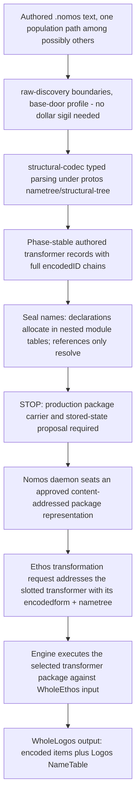
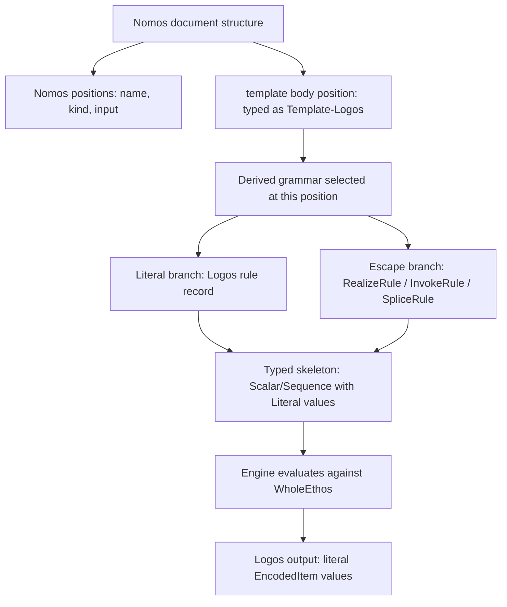
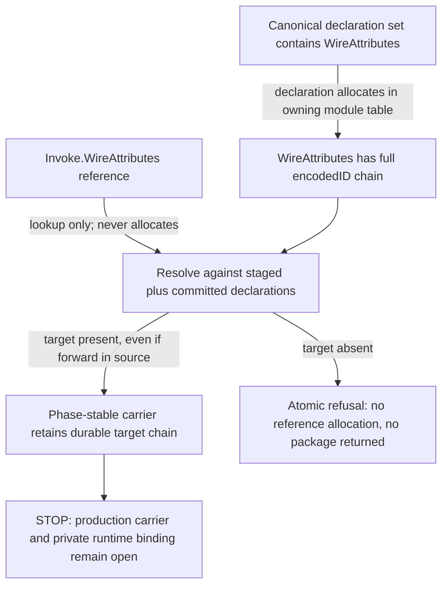

# Authored Nomos: the TextualNomos Surface and Load Path

**Design summary and framing control:** the `ProtosEngineDesign-2026-07-29.md`
compilation now carries the design summary for the TextualNomos surface and
transformer architecture (sections 10-12). Where this document and the
compilation disagree on framing, the compilation controls. This document
remains the detailed specification for the running Codex train
(`protos-engine-po2`), with bead notes referencing its Section 11
(Template(Logos) derivation) as the implementation spec.

A design proposal for how transformation rules are authored as data in text,
loaded by the protos infrastructure, and executed by the Nomos engine. This is
the missing TextualNomos surface the crate itself names as open: "TextualNomos
... remains an open design question. Nothing in this crate parses or prints a
Nomos text surface" (core-nomos lib.rs lines 8-14).

This document is a proposal. Settled law is quoted verbatim with its log and
entry. Proposal text is the designer's and marked as such. Where Nomos lives
is settled law, restored from recovery and recorded in section 8. Remaining
open decisions for the psyche are collected in section 9.

> **STOP-LINE — PRODUCTION PACKAGE STORED STATE IS NOT DESIGNED.**
> The legacy flat `MacroPackage` is an execution fixture and equivalence
> oracle, not a settled production target for authored Nomos. Do not implement
> a general `LoadedNomosPopulation -> MacroPackage` seal from this document.
> Full encodedID chains, nested module-owned tables, sibling homonyms, and
> spelling-only rename stability are settled. The production package carrier,
> its versioning and archive/migration boundary, any private runtime cache,
> `PackageRevision` issuance and hash participation, and Capsule-pin
> composition remain open and require proposals before implementation.

## 1. The Existing Machinery

**Terminology (ruled, 2026-07-29):** this document uses **transformer**, not
macro, as the prose name for the authored unit. **[ruled]**
(PsycheVisionReacquisition-2026-07-29.md Entry 5, "the transformer crux"):

> I'm going to use the word transformer instead of macro because I think
> macro is overloaded and it doesn't... I think agents associate it too much
> with string transformation, and this is really a type transformation.

Existing Rust identifiers (`MacroDefinition`, `MacroPackage`, `MacroIdentity`,
`MacroKind`, `NomosError::UnknownMacro`, and similar) predate this ruling and
stay accurate as code literals — they are quoted or named here exactly as they
exist in the crate, not renamed by this document. Prose below says
transformer; code-identifier references keep their actual spelling.

The production Nomos engine is already a transformers-as-data system. The design
does not start from zero.

**MacroDefinition** (core-nomos/src/definition.rs) is "one macro, entirely as
data: its stringless name, its kind, its typed input signature ... and its
result template ... a macro is a value." Its fields, all typed:

1. `name: Identifier` (positional: the transformer's stringless name)
2. `kind: MacroKind` (Named or Structural with a SectionDefault)
3. `input: InputSignature` (the `{ ... }` meta-shape as data)
4. `template: ResultTemplate` (quoted logos skeleton with escape nodes)

**The escape algebra** (template.rs) is closed at three members: `Realize`
(unquote one bound value with an optional name transform), `Invoke` (recursively
call another transformer by identity), and `Splice` (expand a bound sequence into a
vector). This is the system the psyche confirmed: **[confirmed]** "transformers
are data" (ShapeAndSliceRulings entry 8, confirmed 2026-07-27; the original
turn is unlocated).

**MacroPackage** (package.rs) is "Nomos stateful at rest": a content-identified
`MacroDefinitions` table keyed by `MacroIdentity`, plus a sibling NameTable
excluded from the content hash. This describes the live legacy execution
fixture, not an approved production stored-state model. Its NameTable is flat:
two valid same-spelled declarations in different authored module tables
collapse to one legacy `Identifier`, and a later rename cannot preserve the
settled full-chain identity through that collapse. Excluding the NameTable
from its hash does not make this carrier a complete operational-rename model.

**The engine** (engine.rs) applies the package to a `WholeEthos` through
`MacroPackage::apply` / `apply_enriched`, producing `Lowering` (a
`Vec<EncodedItem>` plus a Logos NameTable). Evaluation is typed end to end; no
text crosses this path.

**What is missing:**

1. **No authoring surface.** Transformers are constructed by Rust functions in
   `fixtures.rs`. There is no file format, no text syntax, no loading from
   authored artifacts.

2. **The enriched generation surface is not data.** `GenerationClass` variants
   are dispatch tags; `generation.rs` (1,890 lines) builds method and match
   skeletons directly in hardcoded Rust, routed through string-bearing machinery
   (`name_boundary.rs`, `prelude.rs`). The compilation notes: "the no-strings
   law is honored exactly one file deep" (ProtosEngineDesign section 14).

This proposal addresses the authored textual surface in gap 1 and frames gap 2
as a growth path. It does not settle the production package representation that
connects authored state to the existing evaluator.

## 2. The Transformer as an Authored Object

An authored transformer declaration is data. It has a name, and that name is a
word like any other authored word. The identity question has a standing answer:

**[ruled]** (DesignReviewRulings entry 3): "no, nothing declares the coreID, the
coreID is allocated by the translator on receiving an unallocated word."

The transformer's name is an authored word. When the translator receives it, the
translator allocates its encodedID. There is no special minting ceremony. The
word `WireNewtype` arrives at the translator, receives an encodedID in the
module's table, and becomes durably identifiable. The same mechanism that gives
`Status` or `Entry` their identities gives `WireNewtype` its identity.

The `MacroIdentity(u32)` that currently keys the package-internal table is a
package-local mint index (identity.rs line 13: "a monotonic package mint").
It may remain private evaluator cache structure only if a future package
proposal preserves every durable reference and name lookup by full encodedID
chain. Whether such a cache exists, how it is rebuilt, and whether
`MacroIdentity` remains in the production carrier are open; this proposal does
not promote the current index into durable identity.

## 3. The TextualNomos Syntax

### 3.0 The Two-TextualForm Law

**[ruled] 2026-07-17** (textual-form-vision-design-v1.md lines 78-80, restored
by `RecoveredNomosVision-2026-07-29.md`): Nomos gets a structural table so
plain raw NOTA decodes into transformers first, with the dollar-sigil / double-angle
template spelling coming later as a second form ("we can do that"). Two
TextualForms for Nomos over one EncodedForm: a plain-NOTA base door and a
richer `$`/`<<>>` sibling. This is the founding multiple-textualforms-per-
encodedform vision (2026-07-17, session 29d00eb1 line 108, quoted in full in
section 8 below): "the vision even allowed multiple textualforms per
encodedform."

This document was previously structured the other way around — the sigil
form presented as the (only) TextualNomos design, with no base door at all.
That is corrected here. Section 3.1-3.9 below present the **base door**: the
v1 authoring surface, spelled using only the seven existing protos triggers
(no new lexer or raw-discovery work). Section 3.10-3.11 present the
sigil-rich form as the **second textualform**, marked throughout as the ruled
future refinement it is — not yet built, and not this design's v1 scope.

### 3.1 Design Constraints

The syntax is a textualform view on typed encoded data. Every syntactic element
maps to a typed position in a fully typed record. This is the strict invariant:

**[confirmed]** (SliceOneRulings entry 9): "nametree and structural tree from
the protos library drive all the decoding and encoding to/from text with DATA -
strict invariant. nothing else will do."

**[ruled]** (ShapeAndSliceRulings entry 2): "wtf is this garbage? Thats a vector
of strings, not typed data! it should be fully typed struct."

**[ruled]** (ProtosEngineDesign section 10): "in the nomos transformation
([ethos] to logos), there shall be *no string manipulation/introduction/reading
of any kind*", with walkers at the boundary ("that is necessary.").

No bare strings as rule content. Spellings are data on typed positions. Fields
are positional. The syntax must feel like the same language family as Ethos.

**What "template" means here (ruled, 2026-07-29):** every occurrence of
"template" in this document — `ResultTemplate`, `EnumerationTemplate`,
`NewtypeTemplate`, and the running examples' template bodies — means a typed
Logos skeleton: typed encoded data with typed placeholder (escape) positions,
never text. String templates are explicitly ruled out. **[ruled]**
(PsycheVisionReacquisition-2026-07-29.md Entry 5):

> I was originally asking, and I still want the transformation to be strictly
> through the encoded form. So there's strictly no string manipulation of any
> kind, or like if we talk about template, I think you mean string templates,
> in which case that's not at all what I'm looking for.

Transformation is strictly encoded-form to encoded-form. Encoded form may
also be called **the true form**: "All of our three languages, well, four if
we include Noto, have textual form and encoded form, which we could also
refer to as the true form." (same Entry 5 dictation). This is a naming
option, not a replacement — "encoded form" and "true form" name the same
thing; this document continues to use "encoded form" as its working term and
notes "true form" as the psyche's alternate name for it.

**Recovered note on the input-signature vocabulary:** the psyche's own working
through the newtype case (2026-07-13, nomos-macro-model-v1.md lines 67-70)
considered the input-signature words themselves as possibly shared machinery:

> so if WireNewType only takes a name and inner type, then the input field
> would be `{ Name Type }`. Name and Type could be pretty standard things,
> perhaps nomos builtins, even a concept shared with schema somehow (it is a
> schema concept after all).

Reading (proposal, not ruled): `Name`, `Type`, `Fields`, `Variants` as
`MetaType` vocabulary may be Nomos builtins that Ethos (schema) also shares
rather than a Nomos-only vocabulary invented fresh. This document does not
resolve that sharing; it is noted here so a future design round does not
reinvent the same words independently in both languages.

### 3.2 The Base Door: Escape Positions Distinguished Structurally

The base door uses only the seven triggers that already exist in every NOTA
family profile, including plain Standard (raw-discovery profile.rs lines
381-429): the three bracket boundaries `(`/`)`, `[`/`]`, `{`/`}`; the `.`
application glyph; the `(| ... |)` carrier; whitespace; and the `;;` line
comment. No new trigger, character class, or glyph is introduced. This
directly satisfies the base-door requirement in section 3.0: the plain-NOTA
form decodes first, before any sigil machinery exists.

The 2026-07-13 ruling (session 0fd2d07c line 572, restored in
`RecoveredNomosVision-2026-07-29.md`) requires escape positions to be visually
distinguished from ordinary literal content:

> we should use a structural syntax, since this will be hard to tell from
> the rest of the syntax; it just looks the same as everything else, which
> is why macros conventions use `$` or `#` type prefix.

The base door satisfies this without a prefix glyph: the three escape forms
are spelled as **reserved keyword applications** — `Realize.<binding>`,
`Splice.<binding>`, `Invoke.<transformer>` — using the same dotted-application
mechanism that already distinguishes `Structural.Enumeration` from a bare
word, or `Public`/`Private` from an ordinary identifier. At any structural
position where an escape may legally appear, the typed rule for that position
is a closed alternation between the literal-word shape and these three
keyword-application shapes; `Realize`, `Splice`, and `Invoke` are reserved
vocabulary words in the Nomos nametree at that position, exactly as
`Structural` and `Named` are reserved at the kind position. The distinguishing
signal is the reserved keyword occupying a known structural slot, not a glyph
— this is visual distinction achieved through vocabulary and position, not
through new lexer machinery. The `$`/`#` sigil convention the psyche named as
precedent is the second textualform's job (section 3.10); it is not required
to satisfy the 07-13 ruling in the base door, because the base door has its
own, different, structural means of the same end.

An input-signature binding declaration (e.g. `name.Name`) is not itself an
escape use-site — it is a plain two-field record (`binding.meta`), unconditionally
interpreted under the `InputSignature` structural position, with no ambiguity
against template-body content to resolve. Only template-body positions, where
a literal word and an escape use are both legal, need the reserved-keyword
distinction above.

### 3.3 Running Example 1: the Enumeration Structural Default

The current Rust fixture (fixtures.rs lines 199-232) builds the enumeration
structural default. Its data content:

- Name: `Enumeration`
- Kind: `Structural(SectionDefault::Enumeration)`
- Input: `{ name: Name, variants: Variants }`
- Template: an `EnumerationTemplate` with visibility Public, attributes invoking
  `EnumerationAttributes`, name realized from the `name` binding, empty generics,
  variants spliced from the `variants` binding.

**Proposed base-door textualform:**

```
Enumeration.Structural.Enumeration {
  (name.Name variants.Variants)
  Public Invoke.EnumerationAttributes Realize.name () [Splice.variants]
}
```

**Position-by-position mapping:**

| Syntax element                | Typed record position                             |
|:-------------------------------|:--------------------------------------------------|
| `Enumeration`                  | `MacroDefinition.name` (Identifier)               |
| `Structural.Enumeration`       | `MacroDefinition.kind` (MacroKind variant)        |
| `(name.Name variants.Variants)`| `MacroDefinition.input` (InputSignature)          |
| `name`                          | `InputParameter.binding` (Identifier)             |
| `Name`                          | `InputParameter.meta` (MetaType::Name)            |
| `variants`                      | `InputParameter.binding` (Identifier)             |
| `Variants`                      | `InputParameter.meta` (MetaType::Variants)        |
| `Public`                        | `EnumerationTemplate.visibility` (literal)        |
| `Invoke.EnumerationAttributes`  | Phase-stable Invoke target (full encodedID chain); the legacy evaluator uses `Escape::Invoke(MacroIdentity)` |
| `Realize.name`                  | `Scalar::Escape(Realize{name, Identity})` for name|
| `()`                            | `Generics::none()`                                |
| `[Splice.variants]`             | `Sequence::of(Escape::Splice{variants, Variant})` |

The base-door vocabulary:

- `Realize.binding` — Realize escape (unquote one bound value, identity
  transform)
- `Splice.binding` — Splice escape (expand a bound sequence into the vector)
- `Invoke.TransformerName` — Invoke escape (recursively call a named transformer)
- Bare words — literal encoded values (identifiers resolved through the
  nametree)
- `.` — application (dotted declarations, as in Ethos)
- `{ ... }` — the template body delimiter
- `( ... )` — input signature delimiter, also generics and grouping
- `[ ... ]` — variant/vector positions

This corresponds to the existing closed escape set: `Realize`, `Splice`,
`Invoke`. The psyche's ruling confirmed exactly two escape primitives plus one
recursion mechanism: **[ruled]** "the escape set is closed at two primitives
(`$x` realizes, `$@xs` splices — 'agreed')" (ProtosEngineDesign section 11).
That ruling names the sigil spellings (`$x`, `$@xs`) because that is how the
question was put to the psyche at the time; the ruling is about the *count and
kind* of escapes (two primitives plus Invoke as the recursion mechanism), not
about the sigil glyphs, which the base door spells as reserved keyword
applications instead. `Invoke` is the recursion mechanism, not a third escape
primitive; the psyche ruled the closed set and `Invoke` is the recursive call
into another transformer by identity.

### 3.4 Running Example 2: the Newtype Structural Default

The production fixture (fixtures.rs lines 131-159):

```
WireNewtype.Structural.Newtype {
  (name.Name type.Type)
  Public Invoke.WireAttributes Realize.name Realize.type
}
```

Mapping: `Public` is the literal `Visibility::Public` for the produced item.
`Invoke.WireAttributes` invokes the attributes transformer. `Realize.name` realizes
the bound `name` as `Scalar::Escape(Realize{name, Identity})`. `Realize.type`
realizes the bound `type` as `Scalar::Escape(Realize{type, Identity})`.

The wrapped field's visibility (`Private`) is positional in the
`NewtypeTemplate` struct and does not appear in the syntax because it is the
fixed structural default for that position. **Open styling question (minor,
not in the section 9 list):** should the template syntax make the wrapped-field
visibility explicit (e.g.
`Public Invoke.WireAttributes Realize.name Private.Realize.type`) or should it
remain positional and implicit? The current `NewtypeTemplate` struct carries it
as an explicit field. Making it visible in the textualform is the more honest
position.

With explicit wrapped visibility:

```
WireNewtype.Structural.Newtype {
  (name.Name type.Type)
  Public Invoke.WireAttributes Realize.name Private Realize.type
}
```

### 3.5 Running Example 3: the Named Attributes Transformer

The `WireAttributes` transformer (fixtures.rs lines 108-115):

```
WireAttributes.Named {
  ()
  [
    rustfmt.skip
    (| nota-text |).[ nota.NotaDecode nota.NotaDecodeTraced nota.NotaEncode ]
    [ rkyv.Archive rkyv.Serialize rkyv.Deserialize Clone Debug PartialEq Eq ]
  ]
}
```

This is a `ResultTemplate::Attributes(Sequence<Attribute>)`. The input is unit
`()`. The body is a vector of literal attributes (no escapes at all, so this
example is identical in the base door and the second form):

- `rustfmt.skip` is `Attribute::ToolPath(PathNode{["rustfmt", "skip"]})`
- The `(| nota-text |)` carrier is a `ConfigurationAttribute` with a
  `ConfigurationPredicate::Feature("nota-text")` wrapping a derive group
- The `[ ... ]` square bracket group is a `DeriveGroup`

The syntax reuses the NOTA carriers and boundaries exactly as the existing
profile defines them — the same seven triggers listed in section 3.2, present
under both the Standard and NomosExtended glyph sets (section 3.11 corrects
what actually differs between the two).

### 3.6 Running Example 4: the Particular-Struct Default

```
ParticularStruct.Structural.Struct {
  (name.Name fields.Fields)
  Public Invoke.WireAttributes Realize.name () [Splice.fields.FieldRuleDispatch.Public]
}
```

The splice element carries the field-name rule and the per-field visibility:
`Splice.fields.FieldRuleDispatch.Public` means
`Splice{fields, SpliceElement::Field{FieldRuleDispatch, Public}}`.

### 3.7 A Complete `.nomos` Document: the Wire Population

A `.nomos` file contributes authored Nomos data to the manifest-resolved
population. It is not thereby the legacy flat `MacroPackage`, and this document
does not decide the production package carrier. The example follows the
six-slot document structure that Ethos uses (the fixtures confirm this:
`spirit-min.ethos` has six top-level blocks). Loading such a file is one
population path, not the only one — see section 4.2 step 0 on the manifest and
the "possibly, but not necessarily" hedge. The Nomos slots carry:

```
;; Authored document revision 1
{1}
;; No interface inputs
[]
;; No interface outputs
[]
;; Transformer definitions
{
  WireAttributes.Named {
    ()
    [
      rustfmt.skip
      (| nota-text |).[ nota.NotaDecode nota.NotaDecodeTraced nota.NotaEncode ]
      [ rkyv.Archive rkyv.Serialize rkyv.Deserialize Clone Debug PartialEq Eq ]
    ]
  }

  EnumerationAttributes.Named {
    ()
    [
      rustfmt.skip
      (| nota-text |).[ nota.NotaDecode nota.NotaDecodeTraced nota.NotaEncode ]
      [ rkyv.Archive rkyv.Serialize rkyv.Deserialize Clone Copy Debug PartialEq Eq ]
    ]
  }

  WireNewtype.Structural.Newtype {
    (name.Name type.Type)
    Public Invoke.WireAttributes Realize.name Private Realize.type
  }

  ParticularStruct.Structural.Struct {
    (name.Name fields.Fields)
    Public Invoke.WireAttributes Realize.name () [Splice.fields.FieldRuleDispatch.Public]
  }

  Enumeration.Structural.Enumeration {
    (name.Name variants.Variants)
    Public Invoke.EnumerationAttributes Realize.name () [Splice.variants]
  }
}
;; No enriched generation selection (plain package)
{}
;; No capsule metadata
{}
```

### 3.8 Name Transforms in the Syntax

The `NameTransform` variants (Identity, FieldName, Screaming, PascalCase) apply
to Realize escapes. Bare `Realize.name` is identity. Transformed realizations
use a further dotted suffix:

- `Realize.name` — `NameTransform::Identity`
- `Realize.name.FieldName` — `NameTransform::FieldName`
- `Realize.name.Screaming` — `NameTransform::Screaming`
- `Realize.name.PascalCase` — `NameTransform::PascalCase`

These are data on a typed position (the `Realize.transform` field), not string
operations: "name synthesis inside `Realize` instead of becoming a fourth
escape" (template.rs line 93-94). The NameTableBoundary performs the actual
derivation at the boundary, not during evaluation.

### 3.9 Running Example 5: ScopeOf Expansion

This is the complex case. `DomainScope.ScopeOf.Domain` is a single authored
Ethos declaration that must expand into complete ordinary Logos data: 38 scope
enums mirroring the 38 domain enums, plus conversions and containment
operations.

The ScopeOf expansion is a different kind of transformation from the structural
defaults above. The structural defaults lower one Ethos declaration into one
Logos item. ScopeOf reads the entire Domain tree and produces many items. The
existing escape algebra handles per-declaration lowering. ScopeOf needs a way
to express recursive tree traversal as data.

Recursive transformer invocation itself is not open — it is a ruled requirement:
"We also need to be able to call more macros recursively." (2026-07-13,
session 0fd2d07c line 572, restored in `RecoveredNomosVision-2026-07-29.md`).
What is open is the mechanism that satisfies it for tree-shaped recursion
(Decision 1, section 9); `Invoke` already satisfies simple, non-tree-shaped
recursive calls.

**The gap in the current escape algebra:** the existing `Splice` walks a flat
vector (fields or variants) and produces one element per input. ScopeOf must
walk a tree recursively: for each payload-bearing variant in Domain, produce a
scope enum that mirrors it; for each sub-enum, recurse. The escape algebra has
no tree-fold construct today.

**Proposed extension (matter, not ruled):** a fourth escape form, `Fold`, that
expresses recursive tree traversal as data. This proposal is one candidate way
to satisfy the ruled recursion requirement for the tree-shaped case; it is not
itself something the psyche has ruled on, and Decision 1 in section 9 leaves
open whether Fold, a separate mechanism, or a deferred design is the right
shape.

```
ScopeOfExpander.Named {
  (source.Name target.Name)
  [
    Splice.target.[ All Splice.source.Variants.MirrorScope ]
    Fold.source.PayloadVariants {
      (child.Name childSource.Name)
      Splice.child.[ All Splice.childSource.Variants.MirrorScope ]
    }
  ]
}
```

Where:

- `Splice.source.Variants.MirrorScope` — a new splice element kind that mirrors
  each source variant into the scope enum (preserving the variant name,
  converting a payload-bearing variant into a scope-typed payload)
- `Fold.source.PayloadVariants { ... }` — the recursive fold: for each
  payload-bearing variant in the source, bind `child` to the derived scope
  sub-enum name and `childSource` to the source sub-enum, then produce items
  from the body and recurse

The `Fold` construct is the recursion mechanism proposed for the ScopeOf need.
It is data: a closed binding signature and a template body that executes per
tree node. The recursion terminates when a level has no payload-bearing variants
(all variants are leaves).

**Why Fold rather than Invoke:** `Invoke` calls a named transformer by identity, but
it does not bind new parameters per recursion level. Fold binds fresh parameters
at each recursive step (the child name and child source change at each level of
the Domain tree). Making Fold a new escape variant rather than overloading Invoke
keeps the algebra honest about what it does.

The invocation from Ethos:

```
DomainScope.ScopeOf.Domain
```

This is sugar in Ethos. The Nomos engine, on encountering a `ScopeOf`
declaration, locates the `ScopeOfExpander` transformer (or a built-in transformer
handling this item kind), loads the source tree (Domain's full type structure
from the encoded Ethos), and executes the expansion template. This is the
concrete instance of the ruled shape from section 8: Ethos carries the sugar
declaration; Nomos, in its own files, carries the expansion.

Open decisions carried forward to section 9: whether `Fold` is the right
mechanism for the recursion requirement (Decision 1), and whether ScopeOf
dispatches through the transformer system or a built-in (Decision 2).

### 3.10 The Second TextualForm: the Sigil-Rich Spelling (Proposal, Ruled Future Refinement)

Section 3.0 restored the 2026-07-17 ruling that a second, sigil-rich
textualform comes later, over the same EncodedForm, once the base door exists.
This section illustrates the target spelling this document previously
presented as the (only) design. It remains useful as a sketch of what the
second form is for — terser, template-like spelling — but it is not built, and
its concrete sigil assignment is open (Decision 4, section 9). Nothing below
is machinery; section 3.11 states plainly what exists and what would need
building.

Illustrative second-form spelling of the Enumeration example (section 3.3):

```
Enumeration.Structural.Enumeration {
  ($name.Name $variants.Variants)
  Public @EnumerationAttributes $name () [$@variants]
}
```

Illustrative second-form spelling of the Newtype example (section 3.4):

```
WireNewtype.Structural.Newtype {
  ($name.Name $type.Type)
  Public @WireAttributes $name Private $type
}
```

Illustrative sigil vocabulary sketch (not ruled, not built):

- `$binding` — Realize
- `$@binding` — Splice
- `@TransformerName` — Invoke
- `$name.FieldName` / `$name.Screaming` / `$name.PascalCase` — transformed
  Realize, by the same dotted-suffix convention as the base door

### 3.11 What the Second Form Actually Requires

This document previously claimed the raw-discovery `NomosExtended` glyph set
was "pre-provisioned for this exact purpose" — built specifically to carry a
sigil escape syntax. Reading the machinery directly (raw-discovery
`src/profile.rs`) shows that claim was not accurate. The honest state:

- `GlyphSet` has exactly two variants, `Standard` and `NomosExtended`
  (profile.rs lines 40-44), and they differ by exactly one thing:
  `NomosExtended` removes `$` from the profile's `forbidden_bare_characters`
  set (profile.rs lines 430-434: Standard forbids `"` and `$`; NomosExtended
  forbids only `"`).
- `$` is **not** a trigger. It has no entry in the seven-trigger definition
  table (profile.rs lines 381-429: two boundaries, one carrier, application,
  whitespace, line comment — no `$`, no `@`). It has no capture semantics and
  never participates in longest-match trigger resolution, because it is not a
  trigger at all.
- Under `NomosExtended`, `$x` is an ordinary bare atom — a plain identifier
  whose first character happens to be `$` — with no special meaning to
  raw-discovery. Nothing downstream currently reads that leading `$` as an
  escape marker.
- There is no `$@` or `@` machinery anywhere in the codebase. Both were
  spellings this document invented for the illustration in section 3.10, not
  things raw-discovery, structural-codec, or core-nomos implement.
- "Seals cleanly" (a claim in an earlier draft) is trivially true: removing one
  character from a forbidden-bare-characters set cannot introduce a trigger
  ambiguity, because it does not touch the trigger table at all. This was not
  evidence of purpose-built provisioning; it is the necessary consequence of
  the change being that narrow.
- The crate's own documentation names what `GlyphSet` and `RawProfile` actually
  are: "compatibility selectors" (raw-discovery lib.rs line 34) — a
  compatibility-naming mechanism for the two established NOTA-family profiles,
  not an escape-syntax feature.

**What a real sigil form would require**, honestly, as second-form work — not
yet done, not scoped by this document:

- Either new trigger/character-class design in raw-discovery (a `Punctuation`
  or `LeadingCharacterClass` trigger for `$`, with the associated ambiguity
  proof against the existing seven — `can_tie` in profile.rs governs this),
  giving raw-discovery itself a notion of an escape-marked atom; or
- Handling at the structural-codec layer instead: leave raw-discovery's atom
  recognition untouched (a `$`-led atom stays an ordinary bare atom all the
  way through boundary discovery) and let the Nomos structural-codec
  vocabulary, when it resolves that atom against the nametree at an escape-
  legal position, treat a leading `$` in the atom's *text* as a second-form
  spelling of `Realize`/`Splice`/`Invoke` — a convention at the typed-parsing
  layer, not a new lexical trigger.

Which of these two shapes is right, or whether a third shape is better, is not
decided here; it is the second-form design's task, separate from and after
the base door.

## 4. The Load Path

### 4.1 Overview

The recovered load-path statement (2026-07-22 14:19 UTC, session bc636bdb
line 444, restored in `RecoveredNomosVision-2026-07-29.md`) is the controlling
account and is quoted here in full because it settles more than any single
step below:

> I think I was first designing thinking the nomos logic would be applied to
> schema text, but then later realized that it would be pure-data
> transformation (the data for this machinery is *populated* (possibly, but
> not necessarily) by parsing nomos files (with a manifest for dependency
> resolution and an entry-point file) into nomos encodedform + nametree
> data - only after the nomos data is loaded in its daemon (with a slot,
> ostensibly; it should be able to run several versions - same
> short-addressale ID concept we use so much; agent-friendly [...]) can the
> schema tranformation request use the slotted nomos transformer to send its
> encodedform + nametree [...] to generate logos encodedform + nametree, and
> probably then rust textualform

Read plainly, this settles: (1) the transformation is pure-data, not text
manipulation, confirming the strict invariant already in section 3.1; (2)
parsing `.nomos` files is **one** population path for the encoded transformer
data, not the only one — "possibly, but not necessarily" is the psyche's own
hedge, preserving an operational-editing endgame where the data is populated
or edited directly and file-parsing is bypassed; (3) file-based loading needs
a manifest for dependency resolution plus an entry-point file, not an
unordered pile of `.nomos` files; (4) the Nomos daemon runs the loaded package
in a **slot**, and can run several versions simultaneously, addressed by the
same short-addressable-ID concept used elsewhere in the engine; (5) the schema
(Ethos) transformation request uses the *slotted* Nomos transformer by
addressing it, sending its own encodedform + nametree to be transformed.



### 4.2 Step by Step

**Step 0: manifest and entry point.** Before any `.nomos` file is read, a
manifest resolves dependencies between `.nomos` files and names an entry-point
file — the same shape the recovered quote requires. This document does not
design the manifest format; it records the requirement so it is not lost
again.

**Step 1: raw-discovery boundaries.** The `.nomos` file is text. The base-door
syntax (section 3.2) needs nothing beyond the Standard profile's seven
triggers — no `$` admission is required for v1. raw-discovery's
`BoundaryReader` finds the block boundaries: the six top-level document slots
(braces, brackets), the transformer definition blocks, the template bodies,
the input signatures. No grammar is applied here; just balanced delimiters and
carrier-opaque scanning. (The `NomosExtended` profile remains relevant only to
the second textualform, section 3.10-3.11, not to this step.)

**Step 2: structural-codec typed parsing.** The structural evaluator parses each
discovered block under the typed rule vocabulary for Nomos. The rule vocabulary
for Nomos is a downstream vocabulary extending the structural-codec kernel,
exactly as the Ethos vocabulary and the Rust vocabulary extend it. The
`Position<Role, Root, Descriptor>` records define the typed positions of a
`MacroDefinition` rule (its name position, kind position, input position,
template position), using the same `SharedDescriptor` machinery that Ethos and
Rust use: `Declaration` descriptors for the transformer name, `Literal` descriptors
for fixed vocabulary words (`Structural`, `Named`, `Public`, `Private`,
`Name`, `Type`, `Fields`, `Variants`), and `Delegate` descriptors for
recursive structures.

This is the strict invariant in action: "nametree and structural tree from the
protos library drive all the decoding and encoding to/from text with DATA -
strict invariant. nothing else will do."

**Step 3: typed records.** The evaluator produces typed `MacroDefinition`
shapes, `InputSignature` records, and `ResultTemplate` trees in the
phase-stable authored carrier. Every durable identity and reference is a full
variant-fronted encodedID chain. No strings remain. The legacy
`MacroDefinition` execution type is not evidence that the production authored
carrier may flatten those chains.

**Step 4: seal with translator.** The authored transformer names and binding names are
submitted to the sema-translator. The translator allocates encodedIDs for each
new word in the appropriate module table. **[ruled]** (DesignReviewRulings
entry 3): "nothing declares the coreID, the coreID is allocated by the
translator on receiving an unallocated word." Transformer names are authored words
and receive their encodedIDs by the same mechanism as any other authored
declaration. References, including `Invoke`, only resolve; they never allocate.
Allocation and uniqueness are scoped to each module-owned table. The complete
chain through those nested tables is the durable identity.

> **STOP-LINE AT STEP 5 — DO NOT SEAL GENERAL AUTHORED STATE INTO THE LEGACY
> FLAT `MacroPackage`.**

**Step 5: production package representation — OPEN.** The current
`MacroPackage`/`MacroDefinitions`/flat `NameTable` shape is a legacy execution
fixture and equivalence oracle. It cannot represent two same-spelled
declarations from different module tables as distinct durable identities, and
it cannot provide spelling-only operational rename without changing or
collapsing those identities. It is therefore not a settled production seal
target, and the former "no new data model" route is withdrawn.

Settled facts the replacement must preserve:

- full variant-fronted encodedID chains are durable identity and every durable
  reference retains them;
- module-owned nested tables allocate and enforce uniqueness locally, so
  sibling-module homonyms remain distinct;
- the NameTable spelling state is a sibling of encoded content;
- an operational member or module rename edits only the owning table's
  spelling and leaves every encodedID chain and content identity unchanged.

Open, requiring proposals before implementation:

- whether the production carrier replaces or versions the legacy
  `MacroPackage`;
- whether a private full-chain-to-`MacroIdentity` evaluator cache exists and,
  if so, how it is derived without becoming durable identity;
- the package archive envelope, migration, and compatibility policy;
- ownership and minting of `PackageRevision`, and whether it participates in
  the content-hash preimage;
- how module tables compose into the complete nametree pin;
- how the package representation relates to the generic `Capsule` carrier.

Historical provenance remains: the container is the ruled generic `Capsule`
struct, kind-distinct by its type parameter (**[ruled]** SliceOneRulings entry
1: "Generic struct"), and a Capsule pins the complete composition of its
nametree (**[ruled]** ShapeAndSliceRulings entry 1: "yes"). Historical
provenance, not a current implementation instruction: **[ruled 07-25]**
"capsule and short-identifier are protos concepts — protos traits with
per-engine implementations." That does not bind the unresolved production
package carrier to Capsule or decide pin composition. The later
ShapeAndSliceRulings entries 6-7 supersede the short-identifier half: no
`ShortIdentifier` supertrait or stored short code exists. A short identifier
is an unstored, kind-distinct display projection of the full content hash, at
least four characters and lengthened against a resolver/database view. Its
alphabet and byte encoding remain unresolved.

**Step 6: engine loads, slotted.** The Nomos engine daemon loads the encoded
package representation approved by the future Step 5 proposal into a slot. Per
the recovered load-path quote, the daemon "should be able to run several
versions" of a transformer concurrently. Selection uses the shared
short-addressable display concept described above; no stored short identity is
introduced. The slot's durable identity/schema and the daemon request,
storage, authorization, and failure contract are not designed here.

**Step 7: engine executes.** The current
`MacroPackage::apply(ethos, ethos_names)` /
`apply_enriched(ethos, ethos_names)` methods remain the legacy evaluator and
equivalence oracle: bind the input signature, evaluate the template, realize
escapes, splice sequences, and invoke recursively. A production package
proposal must define how lossless full-chain state reaches that evaluator or
its successor; this document does not choose the bridge.

**Step 8: WholeLogos output.** The engine produces `Lowering`: a
`Vec<EncodedItem>` (the Logos encoded form) and a Logos NameTable composed with
the Ethos compatibility slice.

### 4.3 The Engine's Role Shrinks

The engine (`engine.rs`, `Evaluator`) is already an interpreter: it walks the
template tree, matches escapes, binds inputs, and produces encoded logos values.
The authored surface does not change that role. It can eliminate fixture
constructors as the source of truth only after the open production package
representation and lossless evaluator bridge are designed and proven.

The enriched generation surface (`generation.rs`, 1,890 lines) is the part that
does NOT yet fit this model. Its `GenerationClass` variants are dispatch tags
that select hardcoded Rust generation logic. The path from generation classes
to authored template data is the next phase: each generation class would become
an authored transformer (or set of transformers) in the `.nomos` file, using the extended
escape algebra (including Fold for tree-walking constructs like the method-body
match skeletons). This is growth, not immediate work.

### 4.4 Nomos Runtime Scope (settled, 2026-07-29)

The Nomos engine's runtime is not scoped to one transformer's local input and
output types. **[ruled]** (PsycheVisionReacquisition-2026-07-29.md Entry 5):

> Obviously, Nomos is going to have to load all of the Logos types into its
> runtime because it has to convert into them, and it's going to have to load
> all of the Ethos type, obviously, too, because it's going to convert them.
> So the Nomos engine knows about everything. Well, not Rust, obviously, but
> it knows about the three languages.

The engine loads the **complete Ethos and Logos type universes** into its
runtime — not just the declaration a given transformer touches. It knows the
three languages (Ethos, Nomos, Logos), not Rust. Placeholders (the escape
positions in the typed skeleton, section 3.1-3.2) key the movement of typed
values from Ethos input into generated Logos output:

> it has to take the handwritten textual form Nomos and create this
> transformation logic where the placeholders with the dollar signs or
> whatever are... hold the key as to what gets put where, from the Ethos type
> into the generated Logos type that it produces, or Logos types, probably,
> plural, because some of these transformations can create quite complex code.

Two consequences for this design that were not previously stated:

- **Plural output types.** One transformer application may produce more than
  one Logos type (the running examples in section 3 each produce one item;
  this is the common case, not a universal one).
- **Positional insertion, including into vector slots.** A placeholder can key
  insertion "into a particular spot in a vector where a certain item gets
  inserted" (Entry 5) — not only whole-item production but insertion at a
  specific position within a produced sequence. The existing `Splice` escape
  (section 1) expands a bound sequence into a vector wholesale; targeted
  positional insertion into an existing or partially-built vector is a
  narrower operation than `Splice` currently expresses, and is not designed
  in this document. It is noted here as a real requirement the escape algebra
  does not yet cover, separate from the Fold proposal.

This section is settled scope, not a decision point: the runtime loading all
three languages, and placeholders keying cross-type movement (plural,
positional), is the psyche's own account of how the engine must work, not a
design choice open to alternatives.

## 5. Execution Semantics Sketch

### 5.1 What a Rule Application Is

A rule application is:

1. **Typed match over Ethos carrier positions.** The engine receives an
   `EncodedDeclaration` (an `EncodedType` with a `Visibility`). The
   `SectionDefault::of_encoded_type` dispatch selects which transformer handles which
   declaration kind. The input signature's `MetaType` vocabulary binds the
   declaration's typed positions: `Name` binds the identifier, `Type` binds a
   newtype's wrapped reference, `Fields` binds a struct's fields, `Variants`
   binds an enum's variants. This is exhaustive over declaration kinds and
   total; an unmatched meta-type is a typed error.

2. **Typed construction of Logos carriers.** The template is a quoted Logos
   skeleton where non-literal positions are escapes. `Realize` unquotes one bound
   value (an identifier or a type reference from the Ethos side) into its
   corresponding Logos position. `Splice` expands a bound vector (fields or
   variants) through a per-element production. `Invoke` recursively evaluates
   another transformer. Every produced value is a genuine `core_logos` typed value
   (`EncodedItem`, `Newtype`, `Struct`, `Enumeration`, `Field`, `Variant`,
   `TypeReference`, `Attribute`). No string is ever produced.

### 5.2 How ScopeOf's Recursion Is Expressed as Data

Under the proposed Fold extension, the ScopeOf expansion would work as follows:

1. The Ethos engine parses `DomainScope.ScopeOf.Domain` and produces an encoded
   declaration whose type is `EncodedType::ScopeOf { target: "DomainScope",
   source: "Domain" }` (or an equivalent positional carrier).

2. The Nomos engine dispatches this declaration kind to a ScopeOf structural
   default (a new `SectionDefault::ScopeOf` variant).

3. The transformer's input signature binds the target name (`DomainScope`) and the
   source tree root (`Domain`).

4. The template's Fold escape walks the Domain tree. At each level:
   - It produces a scope enum mirroring the source enum plus an `All` variant
   - For each payload-bearing variant, it recurses into the child enum
   - Recursion terminates at leaf enums (all unit variants)

5. The fold produces a flat list of `EncodedItem::Enumeration` values: one
   `DomainScope` enum at the top, and one `*Scope` enum for each intermediate
   level of the Domain tree.

6. The identity of each produced scope enum follows the ScopeOf identity
   ruling. **Note:** the psyche has not yet ruled on the ScopeOf identity
   question (see `ScopeOfIdentityBriefing-2026-07-29.md`). The two options
   (helpers as durable Universal declarations vs. helpers as implementation
   structure under the single authored identity) are open. The TextualNomos
   design works with either answer: under Option A, the Fold names its produced
   enums and submits them to the translator; under Option B, the produced
   items are implementation structure and their values are paths of existing
   source-variant encodedIDs.

### 5.3 Refusal

Refusal is typed and atomic. The existing engine already refuses loudly on
typed grounds:

- `NomosError::NoStructuralDefault(section)` — no transformer registered for a
  declaration kind
- `NomosError::UnknownMacro(identity)` — an invoke references a nonexistent
  transformer
- `NomosError::RecursionCycle(identity)` — a recursive invocation cycle
- `NomosError::MetaShape { meta }` — a meta-type does not match the
  declaration's structure
- `NomosError::UnboundInput(binding)` — a template references a binding that
  was never set
- `NomosError::EscapeShape(message)` — an escape is used in a position its
  type does not fit (splice in a scalar slot, invoke in a type position)
- `NomosError::NameTransformShape` — a name transform applied to a non-name
  binding

The authored surface adds load-time refusals (malformed `.nomos` text,
unresolvable transformer references, unknown meta-types) that are typed structural
errors, consistent with the existing conservative-refusal law: what cannot be
proven disjoint is rejected. Partial results are never produced.

For ScopeOf specifically, the expansion refuses atomically on: missing source
tree (the Domain type does not exist in the Ethos), cyclic source trees,
unsupported source structures (a source type that is not an enum tree), and
unresolvable variant references.

### 5.4 Whole-Payload Transformation (New Design Consideration, Beyond v1 Scope)

Every rule application described in section 5.1 is scoped to one Ethos
declaration producing output from that declaration's own bound input. The
psyche's Entry 5 dictation names a case this document's execution model does
not cover: a transformer whose correct output depends on **other**
declarations elsewhere in the Ethos payload, not just its own input. **[ruled,
as a requirement on the architecture]** (PsycheVisionReacquisition-2026-07-29.md
Entry 5):

> I see a quite possible scenario in which the transformation depends on
> other factors. Or in other words, the transformation happens for the entire
> payload, the entire Ethos payload. Some transformers might be affected by
> what other declarations say about objects that are involved in a particular
> transformation. Kind of like how the Rust compiler has to take so many
> things into account before it can decide that, okay, yes, the lifetimes are
> correct, the ownership is correct, the types are correct. It has to do a
> very wide spectrum of analyses before it can actually decide that, all
> right, we can start generating the assembler for this.

This is a real requirement on the architecture, not a feature this design
implements. Nothing in sections 1-5 above is described as precluding it —
section 4.4 already establishes that the engine's runtime holds the complete
Ethos and Logos type universes, which is a necessary (not sufficient)
precondition for cross-declaration analysis — but nothing in this document
designs the analysis itself: how a transformer would declare a dependency on
other declarations, how the engine would order or fix a point over the whole
payload before committing output, or what a "the lifetimes are correct, the
ownership is correct" class of check looks like for Nomos's own type system.
The rustc analogy is the psyche's own framing of the difficulty, not a
prescription to imitate rustc's specific passes.

**What this document commits to:** the running examples and load path above
(sections 3-4) are the v1, per-declaration case; nothing here should be read
as a final architecture that whole-payload analysis would have to be
retrofitted around. Whether whole-payload transformation needs its own
mechanism (a distinct transformer kind, a pre-pass over the Ethos payload
before ordinary rule application, or something else) is unscoped and left
for a future design round, explicitly marked beyond this document's v1 scope.

## 6. What Happens to slice_one.rs

`SliceOneTransformation` in `core-nomos/src/slice_one.rs` is a zero-state
hardcoded lowering of `WholeEthos` to `WholeLogos`. It is exercised only by
tests (core-nomos/tests/slice_one.rs and language-engine-witness). It has zero
production call sites.

The production path already runs `MacroPackage::enriched_fixture().apply_enriched(...)`.
`SliceOneTransformation` exists as the reference/bootstrap implementation for the
first vertical slice's limited vocabulary (enum/newtype lowering without
attributes, without enriched generation).

**The honest transition story:** `SliceOneTransformation` remains the
reference implementation until the authored TextualNomos surface can express
the same transformations it performs and the engine proves equivalence. The
proof is behavioral: the same Ethos input produces the same Logos output through
both paths. Once equivalence is proven, `SliceOneTransformation` becomes dead
code. No deletion timeline is specified here; this is a design document.

The production fixture path (`MacroPackage::wire_fixture()`,
`MacroPackage::plain_fixture()`) can transition only after the open production
carrier and lossless evaluator bridge are designed. Authored `.nomos` data may
then replace Rust fixture constructors as the source of truth through that
approved path; until then, the fixture functions remain equivalence oracles,
not a production stored-state design.

## 7. The Generation Surface Growth Path

The enriched generation surface (`generation.rs`, `GenerationClass`) is where
"the no-strings law is honored exactly one file deep." Each `GenerationClass`
variant (NewtypeErgonomics, InterfaceErgonomics, WireContract,
WireExchangeCodec, WireExchangeEnvelope, TraceSupport) is a whole-Ethos
generator that builds impl blocks, method bodies, match arms, const modules,
and type aliases in hardcoded Rust.

The long path is to express each generation class as authored transformer data using
the same escape algebra (extended as needed). What this requires:

1. **Expression-level templates.** The current `ResultTemplate` produces items
   (newtypes, structs, enumerations) and attribute vectors. Generation classes
   produce impl blocks, functions, match expressions, and statement bodies.
   The template vocabulary would grow: `ImplBlockTemplate`,
   `FunctionTemplate`, `MatchTemplate`, `ExpressionTemplate`. Each is a quoted
   Logos skeleton with escapes, exactly like the existing item templates, but
   covering the richer `EncodedItem` and `Expression` algebra.

2. **The Fold escape.** Generation classes that walk the newtype catalogue or
   variant tree to produce per-item impl blocks need the same tree-fold
   construct proposed for ScopeOf.

3. **Richer meta-types.** The current `MetaType` vocabulary (Name, Type, Fields,
   Variants) covers declarations. Generation classes read the whole Ethos
   structure: the newtype catalogue, the interface roots, the declaration
   roles. New meta-types would be needed: `NewtypeCatalogue`, `InterfaceRoots`,
   `DeclarationRoles`.

This is growth within a coherent architecture, not a redesign. Each generation
class can be migrated independently: author its template in `.nomos`, prove
equivalence against the hardcoded output, then retire the Rust generator. The
escapes, meta-types, and template kinds grow variant-by-variant, each a compile
error until handled — the existing discipline.

This question — whether generation-surface growth belongs in this design's
scope or stays deferred — is carried forward as Decision 3 in section 9, not
repeated here.

## 8. Where Nomos Lives — Settled Law

This was presented in the 2026-07-29 draft of this document as an open
decision ("Decision 1"). The psyche ruled the presentation itself wrong: this
was never open — his design existed and had been lost from the design
surface. `RecoveredNomosVision-2026-07-29.md` restores the firsthand quote
chain; it controls over this section.

**[ruled]** Nomos is its own language with its own files, its own syntax, its
own EncodedForm, its own nametable and structural table, loaded through the
same protos TextualForm mechanism that Ethos and Logos use. The chain, in the
psyche's own words:

2026-07-11 (session 0fd2d07c line 402):

> actually, we should keep nomos, because it is its own language syntax.
> logos is a rust-equivalent, but our macros will not be rust macros

2026-07-17 (session 29d00eb1 line 108, the founding TextualForm/EncodedForm
vision):

> that means a major part of the vision was lost, or ignored. I had a great
> vision for a shared abstraction around textualform and encodedform (use to
> be called true/core) ... a nametree and a structuretree ... textualform
> trait writes and reads the name and structure trees ... this drives all
> textual en/decoding, including rust ... actually, the vision even allowed
> multiple textualforms per encodedform; logos -> logos or logos -> rust ...
> even nota can take this architecture; it would be the basic/most-universal
> example.

2026-07-29 (PsycheVisionReacquisition entry 4, the triple-language dictation,
the newest and controlling anchor):

> We have three languages, ethos, nomos, and logos. And all three use the
> same mechanism to load to and from textual form into encoded form. They
> have their own syntax. Well, they look very similar. They're all protos
> family languages, like NOTA is actually, you could say, the fourth language
> in the foundation. [...] Nomos is there to create the sugar syntax, the
> beautiful syntax of ethos, and logos is there to give us a true
> representation of essentially our assembly language [...] the entire reason
> why we have nomos is so that we can modify the transformation using the
> nomos language. So if the nomos language was never implemented, then the
> entire engine is currently a failure because the whole point of creating
> nomos was to be able to modify.

Own files, not declarations riding inside `.ethos` files, and not a hybrid
where only sugar-level `ScopeOf` markers live in Ethos: Nomos is a full
sibling authored surface. The `ScopeOf` running example in section 3.9 above
is still correct under this ruling — the Ethos declaration is sugar that
names a transform; the transform itself is authored in Nomos's own files —
it was never the "hybrid" alternative this document previously offered as one
option among several; it is the only ruled shape.

**Matter, not psyche-ruled:** the `.nomos` extension itself. "Own files" is
ruled; which literal extension names those files is an agent convention, no
different from any other file-naming choice, and is not recorded as a psyche
ruling anywhere in the recovered chain. This document continues to use
`.nomos` as the working convention.

## 9. Decision Points for the Psyche

The recovery sweep settled where Nomos lives (section 8), recursive transformer
invocation as a requirement (section 3.9), and Nomos's kind in the generic
`Capsule` carrier plus the shared kind-distinct short-display concept (section
4.2, step 5). The later display ruling supersedes the historical
`ShortIdentifier`-trait rendering. The production package stored state remains
an explicit stop-line, not a decision this document answers. The ScopeOf
identity question is tracked separately and is not repeated here (see
`ScopeOfIdentityBriefing-2026-07-29.md`); it is pending with the psyche
independent of this design.

**Decision 1: the recursion construct's mechanics.**

Recursive transformer invocation is ruled required ("We also need to be able to
call more macros recursively." — 2026-07-13, session 0fd2d07c line 572). What
is open is the mechanism, not the requirement. `Invoke` (call a named transformer by
identity) already satisfies simple recursion. Whether tree-shaped recursion
(ScopeOf's walk over a variable-depth Domain tree, binding fresh parameters at
each level) needs a distinct construct is not settled:

- **(a) A fourth escape variant** (`Escape::Fold`) in the closed algebra,
  proposed in section 3.9/5.2 below and marked as proposal throughout. The
  algebra's own documentation says "a fourth escape would be a new variant and
  a compile error until handled" — this is exactly that growth path.
- **(b) A separate mechanism** outside the escape algebra — e.g. a
  `TransformationKind::TreeFold` that wraps a template but is not itself an
  escape. This keeps the escape set at the ruled three members at the cost of
  a second dispatch mechanism.
- **(c) Deferred** until ScopeOf implementation reaches the point where the
  exact recursion shape is concrete enough to design against real data.

The honest tension: the psyche ruled the escape set closed at two primitives
plus Invoke. Fold (proposal, not ruled) is a genuine new primitive under
option (a). The alternative (b) avoids growing the escape set but adds a
parallel mechanism. The psyche's call.

**Decision 2: ScopeOf as a transformer vs. a built-in.**

Should ScopeOf expansion be:

- **(a) A transformer authored in `.nomos`**, dispatched through a new
  `SectionDefault::ScopeOf` variant. This keeps ScopeOf within the transformer
  system; the engine treats it as another structural default.
- **(b) A built-in transformer** the engine recognizes from the `ScopeOf`
  keyword, with hardcoded expansion logic. This is simpler for the first
  implementation but makes ScopeOf a special case rather than an instance of
  the general mechanism.

The honest case for (b): ScopeOf's tree recursion, All-variant injection,
conversion generation, and containment operations are complex enough that
expressing them as template data may require so many escape-algebra extensions
that the template is harder to understand than the direct logic.

**Decision 3: generation surface scope and migration ordering.**

Should this design cover:

- **(a) Only the authoring surface** (TextualNomos for
  MacroDefinition/ResultTemplate), leaving the enriched generation classes as
  hardcoded Rust until they are individually migrated.
- **(b) The authoring surface plus the generation vocabulary growth path** (new
  template kinds for impl blocks, functions, expressions), designed now even if
  not implemented immediately.

Separately open: the order in which `SliceOneTransformation` (section 6) and
the fixture-constructed packages retire once the authored surface proves
equivalence, and whether any generation class migrates before the base-door
TextualNomos syntax (section 3) is itself proven against production fixtures.

**Decision 4: the second-textualform (sigil) details.**

The two-textualform shape is ruled (section 3.0): a plain-NOTA base door
first, a sigil-rich `$`/`<<>>` form second, over the same EncodedForm. What is
open is the second form's concrete spelling, since it does not yet exist as
machinery (section 3.11 below lays out honestly what building it requires):

- Whether Realize/Splice/Invoke get sigils at all, or whether the sigil form's
  value is elsewhere (e.g. compact template literals) with escapes staying
  structural even in the second form.
- If sigils are wanted: `$x` / `$@xs` / `@transformer`, or `$x` / `$@xs` / `$!transformer`,
  or `$x` / `$@xs` / `$(transformer)` — several spellings are equally plausible and
  none is ruled.
- Which layer builds it — a new trigger/character-class in raw-discovery, or a
  structural-codec-level convention over ordinary bare atoms (section 3.11) —
  is itself part of what is open, not a settled implementation detail.

## 10. Observations from the Sources

**The existing machinery is more complete than expected.** The production daemon
path already runs transformers-as-data through `MacroPackage::apply_enriched`.
The authoring surface is no longer the only missing piece. The engine and
template algebra are live, but the flat legacy `MacroPackage` cannot be the
general authored stored-state carrier under the settled nested-table identity
model. The open production carrier, runtime-cache boundary, archive/migration,
`PackageRevision`, and Capsule-pin questions in section 4.2 Step 5 must be
designed before the authored population can replace fixtures in production.

**Correction: the NomosExtended profile is narrower than earlier drafts
claimed.** raw-discovery does carry a `GlyphSet::NomosExtended` variant
(profile.rs lines 40-49), and it is real, deliberate machinery — but it is not
"pre-provisioned for" a sigil escape syntax, as an earlier draft of this
document claimed. It differs from `Standard` by exactly one thing: removing
`$` from the forbidden-bare-characters set (profile.rs lines 430-434). `$` is
not a trigger anywhere in the seven-trigger table; it has no capture
semantics; a `$`-led atom is an ordinary bare atom with no special reading by
anything in the codebase today. The crate's own documentation calls
`GlyphSet`/`RawProfile` "compatibility selectors" (raw-discovery lib.rs line
34), not an escape-syntax feature. Section 3.11 states plainly what building a
real sigil form on top of this would require.

**The enriched generation surface is the real hard problem.** The structural
defaults (newtype, struct, enumeration lowering) are straightforward to express
as authored templates — the running examples above demonstrate this directly.
The generation classes (1,890 lines of hardcoded logic producing impl blocks,
method bodies, match arms, codec implementations) are the frontier. They require
template vocabulary growth, richer meta-types, and possibly the Fold escape.
This is where the "transformers are data" vision meets its most demanding test.

**Correction (2026-07-29): the claim of no prior design was false.** This
document originally stated that no partial authored-Nomos design existed in
the design surface and that this proposal was the first concrete design. The
psyche rejected that presentation when "where Nomos lives" was shown to him as
an open decision: his design existed and had been lost, not absent. A recovery
sweep located it — in `primary/reports/logos/nomos-macro-model-v1.md`,
`textual-form-vision-design-v1.md` and `-v2.md`, `up-close-design-v1.md`, and
in session transcripts spanning 2026-07-11 through 2026-07-22 — and restored it
to `RecoveredNomosVision-2026-07-29.md` in this design tree, which is now
controlling over this document wherever the two conflict. This document has
been corrected against that restoration; see section 3 and section 8 above for
the corrected settled/open split.

**Terminology alignment (ruled, corrected).** This document previously treated
"transformer" as this design's own preferred framing alongside the crate's
"macro." That undersold it: the psyche ruled the term directly (Entry 5,
quoted in section 1 above) — "macro" is retired from prose because it is
overloaded toward string transformation, and the unit is a type
transformation, named transformer. The crate calls its rules "macros"
throughout (`MacroDefinition`, `MacroPackage`, `MacroIdentity`, `MacroKind`);
these identifiers predate the ruling and remain accurate as code literals —
renaming the types is implementation matter, not addressed by this document.

**Long-term vision (psyche, marked explicitly long-term, Entry 5).** The
psyche framed Nomos's eventual scope beyond anything this document designs:

> we might make Nomos, or we will eventually make Nomos the most load-bearing
> part that could do all of the correctness verification or more than what
> the Rust compiler actually does today. So it has to become an extremely
> capable and extendable system. [...] we could have logos actually compile
> into assembly language through LLVM.

This is long-term direction, not a near-term design constraint: Nomos
eventually verifying correctness at or beyond rustc's level, with Logos
compiling to assembly through LLVM. The psyche paired this with an explicit
acknowledgment that the difficulty was underestimated and that he does not
yet have the answers — rulings will continue incrementally as vertical slices
reveal how the system actually behaves, and agents are invited to research
prior art on typed, placeholder-driven program transformation. Nothing in
sections 1-9 of this document should be read as resolving this long-term
scope; it orients direction, not this document's v1 decisions.

## 11. Template(Logos): the Derived Grammar for Transformer Compilation

> **STOP-LINE FOR SECTION 11 IMPLEMENTERS.**
> Template(Logos) produces phase-stable authored data with full encodedID
> chains. It does not authorize sealing through the legacy flat
> `MacroPackage`, converting durable references to `MacroIdentity`, or binding
> a package to Capsule. References only resolve and never allocate. Continue
> only as far as the open production stored-state boundary in section 4.2 Step
> 5 and section 12.

**[approved for implementation under delegated assent, Entry 6, 2026-07-29]**
(PsycheVisionReacquisition-2026-07-29.md, protos-engine commit 31ee995b). The
psyche's verbatim ruling:

> fine, I dont quite understand but we can implement it and then Ill have
> actual code for you and I to actually look at

What this grade means: implementation of the Template(X) derivation is
authorized so that concrete, reviewable code exists — it is not the psyche's
reviewed conviction that the design is correct. No agent may cite this
section, or Entry 6, as psyche endorsement of Template(X) beyond that. The
psyche explicitly does not yet fully understand the design and retains full
authority to redirect once real code and real behavior are visible to him.
This is the same grade as the 2026-07-28 translator-daemon approval.

**Design-level clarification the psyche's challenge produced.** Before
assenting, the psyche challenged the proposal's hidden assumption: "what will
write the type with the placeholding future type? I bet if I hadnt asked,
they would be handwritten in rust." The answer that resolved the challenge,
and that his assent covers, sharpens what was written in this section below:
the derivation walks BOTH the Logos grammar rules AND the Logos type
declarations in one pass. The landing types — the value-or-future-value
twins at every widened position — are **computed, never authored**, whether
per-transformer or per-type, in any form, including emitted Rust. There is no
handwritten twin type anywhere in the system for any transformer or any
Logos type; the only fixed substrate machinery is the derivation function
(`lift_descriptor`/`lift_position`, section 11.3) and the evaluator that
walks its output (engine.rs, section 11.5/11.6). His acknowledgment en route
to assent: "ahh, so every placeholder is value-or-future-value, so there is
no handwritten type per transformer."

This section was previously written as a proposal awaiting ruling; the
subsections below are retained as the specification the delegated-assent
implementation must follow, not as still-open design questions.

### 11.1 The Conundrum

The psyche identified the core difficulty when working through the
transformer-compilation question. **[ruled, 2026-07-29]**
(PsycheVisionReacquisition-2026-07-29.md Entry 5):

> And taking a textual form Nomos transformer and creating a Rust type
> transformation logic, I can see that now is a fairly difficult endeavor.

> it has to take the handwritten textual form Nomos and create this
> transformation logic where the placeholders with the dollar signs or
> whatever are... hold the key as to what gets put where, from the Ethos
> type into the generated Logos type that it produces

The conundrum in operational terms: a transformer's result template is a
Logos skeleton with typed placeholder positions. It must be parsed as
Logos — its structure IS Logos structure (newtypes, structs, enumerations,
attributes, fields, variants, all in their correct structural positions).
But it is not Logos yet: some positions carry escapes (Realize, Invoke,
Splice) instead of literal values. The template body cannot parse under the
Logos grammar, because the Logos grammar does not admit escapes at term
positions. It cannot parse under a hand-maintained alternative grammar
either, because a hand-maintained second grammar is a synchronization
liability that drifts from the Logos grammar it mirrors.

And the psyche was explicit that string templates are not the answer.
**[ruled, 2026-07-29]** (same Entry 5):

> I was originally asking, and I still want the transformation to be strictly
> through the encoded form. So there's strictly no string manipulation of any
> kind, or like if we talk about template, I think you mean string templates,
> in which case that's not at all what I'm looking for.

### 11.2 The Proposed Dissolution: Template(X) as a Mechanically Derived Grammar

**[approved for implementation under delegated assent, Entry 6]** The template body is parsed under a second grammar derived
mechanically from the Logos grammar. The derivation is specified as a
function over the structural-codec rule records that define the Logos
grammar — the same `Position<Role, Root, SharedDescriptor<Root>>` and
`StructuralRule<Root>` types (structural-codec form.rs) already used to
define every protos-family grammar. No hand-maintained parallel grammar
exists; the derived grammar is computed from the Logos grammar's own typed
data.

The derivation has one operation: at every position in a Logos rule record
where a term-producing descriptor sits, the derived grammar admits either the
original term OR a typed escape whose output type matches what the original
position expected. Structural positions (delimiters, operators, repetition
scaffolding) pass through unchanged — they shape the skeleton, not fill it.
Fixed vocabulary words (`SharedDescriptor::Literal` descriptors) also pass
through unchanged — the visibility keyword `Public` in a template body is a
literal, not a hole.

### 11.3 The Derivation Function, Against the Real Types

The structural-codec `SharedDescriptor<Root>` (form.rs lines 175-213) is an
enum with 11 variants. The derivation function `lift_descriptor` classifies
each variant into one of three treatments.

**Term-producing positions — admit the escape alternation:**

| SharedDescriptor variant | Lifting | What the escape represents |
|:---|:---|:---|
| `Declaration(AtomDescriptor)` | Alternation: the original `Declaration`, or a Realize escape at this position | A `Realize` unquoting a bound identifier into a name slot |
| `Reference(AtomDescriptor)` | Alternation: the original `Reference`, or an Invoke escape at this position | An `Invoke` calling another transformer by reference |
| `Delegate { target, payload }` | Recursively lift the delegated target: `Delegate { target: Template(target), payload }` | The sub-rule is itself a template, whose positions may carry escapes |

**Structural positions — pass through, lifting content recursively:**

| SharedDescriptor variant | Lifting |
|:---|:---|
| `Repeated { minimum, maximum, element }` | `Repeated { minimum, maximum, element: lift(*element) }` — repetition structure unchanged, element descriptor lifted |
| `OrderedProduct(members)` | Members unchanged — the product names typed positions; each member's own descriptor is lifted independently through its `Position` |
| `OrderedSequence(members)` | Same — the sequence names typed positions; each member is lifted through its `Position` |
| `Application { operator, head, payload }` | Application structure unchanged — head and payload positions are lifted through their respective Positions |
| `Delimited { boundary, content }` | Boundary unchanged, content position lifted through its `Position` |
| `ItemBoundary { boundary, content }` | Same |

**Fixed positions — unchanged:**

| SharedDescriptor variant | Why unchanged |
|:---|:---|
| `Literal(EncodedId<Root>)` | Fixed vocabulary word (e.g. `Public`, `Private`, `Structural`); no escape admitted |
| `Leaf(LeafCodec)` | Literal codec value (integer, text, etc.); not a typed hole |

The function over a `Position`:

`lift_position(Position<Role, Root, SharedDescriptor<Root>>)` applies
`lift_descriptor` to the position's descriptor. Where the descriptor is
widened (Declaration or Reference becoming an alternation), the widened
descriptor is represented through the existing `RuleCoproduct<Left, Right>`
machinery (form.rs lines 542-586): the evaluator at that position accepts
either the original rule branch (literal case) or the escape rule branch
(escape case). The coproduct composition is the structural-codec's own
dispatch mechanism, already used to compose downstream vocabulary rule sets
with the kernel's structural rules.

### 11.4 The Escape Construct as a Typed Record in the Derived Grammar

Each escape form is itself a typed rule record in the derived grammar, not an
ad-hoc parse. Because the base-door escape syntax (section 3.2) is a dotted
application — `Realize.name`, `Invoke.EnumerationAttributes`,
`Splice.variants` — each escape is an `ApplicationRule<Root>` (form.rs lines
357-422) whose positions carry typed descriptors:

**Realize** at a Declaration position: an `ApplicationRule<Root>` where the
head is `SharedDescriptor::Literal(realize_keyword_id)` — the reserved word
`Realize` identified by its complete encodedID chain — and the payload is
`SharedDescriptor::Declaration(AtomDescriptor)` — the binding name, resolved
as a declaration in the input-signature namespace. An optional chained
application carries the `NameTransform` (`.FieldName`, `.Screaming`,
`.PascalCase`) as a further `Literal` descriptor.

**Invoke** at a Reference position: an `ApplicationRule<Root>` where the head
is `SharedDescriptor::Literal(invoke_keyword_id)` and the payload is
`SharedDescriptor::Reference(AtomDescriptor)` — the transformer name,
resolved by lookup through the nametree. The transformer is declared elsewhere
in the same canonical declaration set; this position only uses it. The
declaration allocates if needed. The `Invoke` reference never allocates and
retains the resolved full target chain in the phase-stable carrier. Whether a
future production representation derives any private execution handle is open
at the stored-state boundary (section 12.3).

**Splice** at a Repeated position: an `ApplicationRule<Root>` or
`ApplicationDelimitedRule<Root>` (form.rs lines 426-516) where the head is
`SharedDescriptor::Literal(splice_keyword_id)` and the payload carries the
binding reference and per-element production data (the `SpliceElement`
information as further typed positions).

The derived `RuleCoproduct` at a widened position assembles as:

```
RuleCoproduct<OriginalLogosDescriptor,
    RuleCoproduct<RealizeEscapeRule,
        RuleCoproduct<InvokeEscapeRule,
                      SpliceEscapeRule>>>
```

This uses the existing `RuleCoproduct<Left, Right>` nesting — no new generic
type is needed. The shared evaluator's dispatch over `RuleCoproduct` branches
(form.rs `StructureRecord<Root>` trait, `BorrowedFieldView<Root>` trait) already
handles this nesting; the derived grammar's escape branches implement the same
traits.

### 11.5 The Parse Product: a Typed Skeleton in a Parallel Universe

The parse product under the derived grammar is a typed skeleton in a parallel
typed universe: at every position, the value is either a literal Logos value
(an `Identifier`, `TypeReference`, `Visibility`, `Attribute`, etc.) or a
typed escape (a `Realize`, `Invoke`, or `Splice` whose output type is
constrained by the Logos type the position expects). This is exactly the
`Scalar<Literal>` / `Sequence<Literal>` / `SequenceItem<Literal>` algebra
already in core-nomos template.rs:

- `Scalar<Identifier>` at a name position: either `Literal(Identifier)` or
  `Escape(Realize{binding, transform})` — a literal name or a realized bound
  name
- `Scalar<TypeReference>` at a type position: either `Literal(TypeReference)`
  or `Escape(Realize{binding, Identity})` — a literal type or a realized
  bound type
- `Sequence<Attribute>` at an attribute position: items that are each
  `Literal(Attribute)` or `Escape(Invoke(identity))` — literal attributes or
  a recursive transformer invocation
- `Sequence<Variant>` at a variants position: items that are
  `Literal(Variant)` or `Escape(Splice{binding, Variant})` — literal variants
  or a spliced bound vector

The Template(Logos) skeleton becomes Logos only at application time, when the
evaluator (engine.rs) fills each escape with typed Ethos-derived data.
Escapes typed by their position guarantee that ill-formed output is
unrepresentable: a Realize in a name slot must produce an `Identifier`; a
Realize in a type slot must produce a `TypeReference`; a Splice in a variant
vector must produce `Variant` values. A Realize in a name slot producing a
`TypeReference` is a type error in the *derived grammar* — caught at
transformer load time, never at generation time.

This directly instantiates the prior art survey's lesson 1
(TransformerPriorArt-2026-07-29.md): "A Nomos transformer must be rejected
at load time if any placeholder's Logos type, vector-slot position, or Ethos
binding is wrong — never at generation time. MPS's generation-time-only
failures, and the thousands of tests mbeddr needed to compensate, are the
cost of skipping this." The derived grammar's typed positions enforce this: a
template that misplaces an escape is a parse error in Template(Logos), not a
generation-time surprise. The psyche's "strictly through the encoded form"
ruling (Entry 5, quoted in 11.1) is the mechanism that makes this concrete:
every position is typed to its Logos type, and no string template exists to
degenerate into.

### 11.6 Fit to the Two-Pass Architecture

The existing load path (section 4.2) operates in two passes: pass 1
(raw-discovery) discovers block boundaries; pass 2 (structural-codec)
evaluates each block under the typed rule vocabulary for its structural
position in the document.

Template(Logos) fits without change to pass 1. Block discovery is
structural — delimiters, boundaries, carrier-opaque scanning. A template
body's curly-brace block is discovered the same way any block is discovered.
Escapes use the same seven triggers (dotted application for `Realize.name`,
brackets for `[Splice.variants]`, etc.) and create no new discovery-time
distinctions.

In pass 2, the structural evaluator selects the rule set for each position by
the document's typed structure. A transformer definition's top-level
positions (name, kind, input, template) are Nomos structural positions; the
template body position, within that, is a Logos-shaped position — but under
the derived grammar. The decoder at that position selects the
Template(Logos) rule set, not the plain Logos rule set. The dispatch signal is
the structural position itself: a `ResultTemplate` body is typed as
Template(Logos) in the Nomos document structure, exactly as a `MacroKind`
position is typed as the kind vocabulary. The decoder need not inspect the
content to decide which grammar to use; the template body position's
structural type tells it.

The result block in a transformer definition carries type Template(Logos), so
the structural evaluator at that position dispatches to the derived rule set.
Escape constructs — `Realize.name`, `Invoke.EnumerationAttributes`,
`Splice.variants` — are ordinary typed constructs of the derived grammar,
evaluated through the same `StructureRecord<Root>` / `BorrowedFieldView<Root>`
machinery that evaluates every other structural-codec rule. They are not lexer
specials, not token-stream markers, not string-interpolation sites. They are
typed positions in a typed grammar, evaluated to typed values.



### 11.7 Genericity: Template(X) for Any Protos-Family Language

The derivation is specified over `SharedDescriptor<Root>` and
`Position<Role, Root>`, not over Logos-specific types. Any protos-family
language X whose grammar is expressed as structural-codec rule records admits
the same derivation. Today X=Logos because Nomos transformers produce Logos
output. If a future transformer targets a different protos-family language,
the same `lift_descriptor` function derives Template(X) from X's grammar with
no new design.

Template(Nomos) — a transformer whose output is itself a Nomos
transformer — is the natural consequence: a meta-transformer authored in
Nomos whose template body is a Nomos-shaped skeleton with escapes, parsed
under the derived Template(Nomos) grammar. Whether meta-transformers are in
scope is not decided here; the genericity is a design property of the
derivation, not a feature commitment.

### 11.8 Relation to the Existing Escape Algebra

The existing `ResultTemplate` / `Escape` / `Scalar<Literal>` /
`Sequence<Literal>` algebra in template.rs *is* the evaluation-side
representation of Template(Logos). The derivation function proposed here does
not replace it; it provides the *parse-side* specification that produces it.
The relationship:

- The derived grammar's typed positions parse authored text into the
  `Scalar<Literal>` / `Sequence<Literal>` values that template.rs defines
- The existing `Escape` enum (`Realize`, `Invoke`, `Splice`) is the
  evaluation-side escape set — unchanged, closed at three members
- Template(Logos) is the name for the grammatical universe in which those
  escapes live alongside literal Logos values

Where the escape algebra must still grow (noted as open, section 9
Decision 1): the `Fold` construct proposed for tree-shaped recursion
(ScopeOf, section 3.9) and targeted positional insertion into vector slots
(section 4.4, the psyche's "a particular spot in a vector where a certain
item gets inserted"). These are growth of the escape set, not growth of the
derivation mechanism — `Fold` would be a new escape variant, and
`lift_descriptor` would admit it at the appropriate positions by the same
widening logic. The derivation function does not assume the escape set is
frozen; it parameterizes over whatever `Escape` enum the evaluation side
defines.

### 11.9 Concrete Example: the Enumeration Template Under the Derivation

The Enumeration structural default (section 3.3) has these template
positions. Walking each through the derivation:

1. **visibility** (`Public`): Logos position expecting `Visibility` — a
   `Literal` descriptor for the fixed word `Public`. Under the derivation:
   **unchanged**. It IS a literal (`SharedDescriptor::Literal`); no escape is
   admitted. The authored text `Public` parses to `Visibility::Public`
   directly.

2. **attributes** (`Invoke.EnumerationAttributes`): Logos position expecting
   `Sequence<Attribute>` — a `Repeated` descriptor over an attribute element.
   Under the derivation: **lifted** — each element in the repetition admits
   either a literal `Attribute` or an `Escape`. In the running example,
   `Invoke.EnumerationAttributes` is parsed by the Invoke escape rule branch
   (an `ApplicationRule` with head=`Invoke` literal, payload=
   `EnumerationAttributes` reference), producing
   `SequenceItem::Escape(Invoke(EnumerationAttributes_identity))`.

3. **name** (`Realize.name`): Logos position expecting `Identifier` — a
   `Declaration(AtomDescriptor)` descriptor. Under the derivation:
   **widened** — the position admits either a literal `Declaration` (a fixed
   name) or a `Realize` escape. `Realize.name` is parsed by the Realize
   escape rule branch (an `ApplicationRule` with head=`Realize` literal,
   payload=`name` declaration), producing
   `Scalar::Escape(Realize{binding: Input(name), transform: Identity})`.

4. **generics** (`()`): Logos position expecting `Generics` — a structured
   Logos type. Under the derivation: **lifted recursively** via `Delegate`.
   But `()` is a literal empty generics, so the literal branch is taken,
   producing `Generics::none()`.

5. **variants** (`[Splice.variants]`): Logos position expecting
   `Sequence<Variant>` — a `Repeated` descriptor over a variant element.
   Under the derivation: **lifted** — each element admits either a literal
   `Variant` or an `Escape`. `Splice.variants` is parsed by the Splice escape
   rule branch, producing
   `Sequence::of(SequenceItem::Escape(Splice{binding: Input(variants), element: Variant}))`.

The derived grammar parses this template body into exactly the
`EnumerationTemplate` value that fixtures.rs constructs by hand — the same
typed data, parsed from text through a typed grammar rather than built from
Rust constructors. This is the same mapping table presented in section 3.3,
but now with a grammatical account of *how* the parser reaches those values:
not by ad-hoc recognition of escape keywords, but by the derived grammar's
typed rule records dispatching through `RuleCoproduct` branches at each
position.

## 12. The Train's First Stop-Line: Phase-Stable Identity and Dependency Ordering

This section is a **proposal for the psyche's ruling**, written at his
direction. It addresses the dependency mismatch Codex's worker discovered
and the design responses to it.

### 12.1 The Evidence

The first worker to implement po2.1 (plain-NOTA text decode into typed
transformer declarations) hit a real dependency mismatch before writing code.
Codex's report, verbatim:

> The first worker hit a real dependency mismatch before writing code, which
> is exactly what the train's stop-line is for. The current structural-codec
> pin cannot represent ordered Nomos records; the newer codec can, but it
> requires full translator-issued encodedID chains that core-nomos does not
> yet carry. Separately, Invoke.\<name\> cannot honestly become the
> package-local MacroIdentity until package registration. The worker created
> po2.11 rather than smuggling in a flat-ID or forward-reference adapter; the
> train manager is resequencing po2.1/.2/.4 around that evidence.

**Verification against po2.11.** The bead (protos-engine-po2.11, "Authored
Nomos needs a phase-stable identity carrier from decode through package
sealing") confirms every claim in this summary:

1. **structural-codec pin**: po2.11 records that structural-codec 0.6.0
   (the pin core-nomos carries, commit 23497c43) "cannot represent the
   approved whitespace-separated fixed positional record." The newer
   structural-codec 0.8.0 (commit 5c11e1fb7f58 and later, current c36c0cef)
   adds `OrderedSequence` — the rule record type that expresses the
   fixed-position records the base-door syntax requires — but simultaneously
   requires translator-issued full `EncodedId` chains through
   `DecodeNameBindings`. core-nomos stores flat `name_table::Identifier`, not
   full chains.

2. **Invoke forward reference**: po2.11 records that "Invoke.\<name\> cannot
   become existing Escape::Invoke(MacroIdentity) until package-local
   identities are assigned during po2.4 sealing, especially for
   forward/cross-file references."

3. **Stop-line behavior**: po2.11 was created as a DISCOVERED-FROM bead of
   po2.1. The worker created the bead recording the dependency rather than
   working around it. po2.11's design section explicitly states: "Do not add
   a temporary flat-ID adapter or let core-nomos allocate names."

4. **Resequencing**: po2.1 now DEPENDS ON po2.11. The dependency graph is:
   po2.11 (phase-stable carrier) blocks po2.1 (decode), which blocks po2.2
   (translator allocation), which feeds po2.4 (package seal).

### 12.2 Design Response: the Ordering Is Real

> **STOP-LINE FOR po2.4 WORKERS — THE OLD FINAL ARROW TO FLAT
> `MacroPackage` IS WITHDRAWN.**
> Phase-stable full-chain authored state is implemented. Its production package
> carrier is not designed. Do not treat legacy execution types as approval for
> flattening at seal.

**[proposal, endorsed as design fact]** The Template(Logos) decode described
in section 11 rides the newer structural-codec, whose `OrderedSequence` and
typed `DecodeNameBindings` require translator-issued `EncodedId` chains in
core-nomos. This is a real dependency: the nametable/encodedID work
(migrating core-nomos from flat `Identifier` to full `EncodedId` chains,
publishing the updated structural-codec pin) must precede the
Template(Logos) typed decode, which must precede the full
authored-transformer load path.

The dependency order, stated as design fact:

1. **po2.11**: define the phase-stable authored carrier that retains full
   `EncodedId` chains from decode through seal; legacy `MacroDefinition` and
   `MacroIdentity` remain execution-fixture types, not settled production
   stored state
2. **po2.1**: decode authored `.nomos` text through raw-discovery +
   structural-codec into the phase-stable carrier, using the
   Template(Logos) derived grammar for template bodies
3. **po2.2**: submit authored transformer and binding names to the
   translator for `encodedID` allocation
4. **po2.4**: stop for a production stored-state proposal before sealing the
   complete declaration set; do not choose the carrier, archive, revision, or
   private evaluator cache by analogy with the legacy fixture

No provisional or flat-ID intermediate or final representation is acceptable.
po2.11's design section is explicit: "Do not add a temporary flat-ID adapter
or let core-nomos allocate names." This is refusal over pretending: a
flat-ID adapter would create a representation that lies about the phase it
occupies, and would have to be torn out when the real carrier arrives. The
train's stop-line exists to prevent exactly this kind of technical debt from
entering the codebase under schedule pressure.

This aligns with the resequencing rather than proposing a workaround. The
worker who discovered the mismatch did the right thing by creating po2.11
and stopping. The same discipline now applies at the package boundary exposed
by po2.4: implementation resumes only after the open Step 5 surfaces receive a
design proposal.

### 12.3 Design Response: Declarations Allocate; Invoke References Only Resolve

The Invoke forward-reference problem has two parts: allocating the declared
transformer's durable identity and resolving an `Invoke` reference to that
identity. The approved mechanism distinguishes them strictly.

**Declarations allocate (settled).** A transformer declaration contributes its
exact spelling in its owning module table. An unallocated declaration spelling
receives the next module-local encodedID under the authority's canonical
allocation order. The full variant-fronted chain is retained in the
phase-stable authored carrier.

**References only resolve (settled).** An `Invoke` occurrence never allocates.
The complete canonical declaration set is staged before its references are
resolved, so a valid forward reference may appear earlier in source or
traversal order and still resolve to the target declaration's full chain. If
the target is absent from that declaration set, resolution refuses atomically:
no allocation is caused by the reference and no package value is returned.
Duplicate declarations in one owning table likewise refuse atomically.

> **STOP-LINE AT THE RUNTIME BINDING — DO NOT INFER A
> full-chain-to-`MacroIdentity` REBIND.**
> Whether a future production carrier derives a private evaluator cache, keeps
> full chains directly, replaces `MacroIdentity`, or uses another approved
> execution representation belongs to the open stored-state proposal.



**What is settled vs. proposal vs. open:**

- **Settled**: declarations allocate; references only resolve and never
  allocate; valid forward references resolve against the same canonical
  declaration set; unresolved references and duplicate same-table
  declarations refuse atomically; every durable target stays a full chain.
- **Open**: the production package carrier or replacement and its versioning;
  any private runtime cache or full-chain-to-execution mapping; archive and
  migration policy; `PackageRevision` issuance and hash participation; and
  Capsule-pin composition. No answer to any of these is proposed here.
