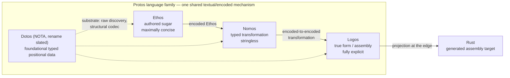
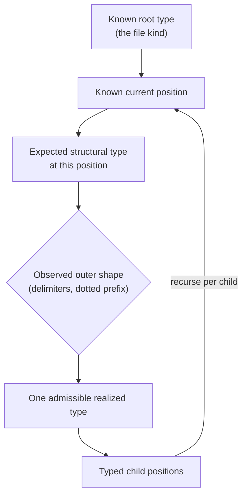
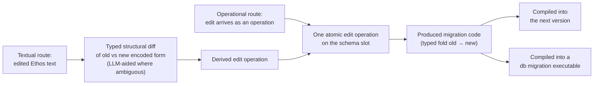

# ProtosEngine High-Level Understanding — 2026-08-02

This is the dedicated high-level understanding report for the ProtosEngine,
written at the psyche's request as the reusable orientation surface. It
integrates the nine seated design-log rulings of 2026-07-31/08-01
(`design/ProtosEngine/`, `design/Nomos/`) with the reacquired vision
(`reports/PsycheVisionFirstPrinciples-2026-07-31.md`,
`reports/protosVisionReacquisition/`). Gradings follow the corpus vocabulary:
**[psyche-verbatim]**, **[psyche-ruled]**, **[psyche-vision]**,
**[agent-inference]**. Everything ungraded is summary of graded material.

## 1. What the ProtosEngine is

The ProtosEngine is a language engine built from four foundational languages
that share one mechanism for moving between textual form and encoded form.
The encoded form — not text — is the source of truth; text files are
bootstrap. The engine holds all source in slots, every change enters as one
atomic operation, and the per-engine change log of operations is the version
control system. Rust is the current assembly target: generated, correct, and
never hand-polished.

**[psyche-verbatim]** "We have three languages, ethos, nomos, and logos. And
all three use the same mechanism to load to and from textual form into
encoded form... They're all protos family languages, like NOTA is actually,
you could say, the fourth language in the foundation... Nomos is there to
create the sugar syntax, the beautiful syntax of ethos, and logos is there to
give us a true representation of essentially our assembly language."

**[psyche-verbatim]** "the reason I'm approaching this triple layer is
manifold, one of which is to keep agents honest and the other is to create a
stable ethos syntax while allowing us to deeply change the behavior of what
that syntax actually does in practice by changing nomos while also allowing
us to extend, maintain, improve, debug, or support... the Rust compiler,
basically, with the logos layer, which also gives us an incredible debugging
interface."



The separation is load-bearing, not incidental:

- **Ethos** is the destination surface. Eventually "we're only going to be
  writing ethos" **[psyche-verbatim]**. It is the stable sugar whose meaning
  can be deeply changed underneath it.
- **Nomos** exists so the Ethos-to-Logos transformation is itself authored
  and modifiable. "If the nomos language was never implemented, then the
  entire engine is currently a failure" **[psyche-verbatim]**.
- **Logos** is the truthful, fully explicit data representation of a program
  — the gateway into assembly-Rust and the debugging interface.
- **Dotos** (currently NOTA; rename lands with the new engine train,
  **[psyche-verbatim]** "dotos is good. let's slate a rename for nota with
  the new protos engine train landing") is the foundational typed positional
  data language beneath the family.
- **Protos** is the shared substrate: nametree + structuretree drive all
  encoding and decoding between text and data — strict invariant, nothing
  else will do **[psyche-ruled]**.

## 2. The root principle: positional, structurally typed reading

**[psyche-verbatim]** "the ethos source file is a struct, is an already
known struct. So we're reading data basically... we already know how to
parse it." And: "this opens up the possibility of using the same kind of
syntax tricks to mean different things at different places."

**[psyche-verbatim]** "After I did Nota and gave up on the more conventional
way of parsing language, I suddenly realized that I could think of the
language as data... we aren't really parsing so much a full source file of
text as we are parsing sections, each of which have their particular type
and therefore have their particular parsing logic. Hence why I call it
structural parsing." And: "No programming language has ever done this
strictly and then leveraged it like we are."

The reader never asks "what does this token sequence mean?" globally. It
asks "at this already-known typed position, which admissible realized form
does this outer structure select?" Meaning is position-local; the same
surface shape legitimately denotes different types at different positions.
All fields are positional; authored field names are illegal in the protos
data model (Rust's named fields are a separate layer) **[psyche-ruled]**.



**File-kind law [psyche-ruled]**: file kinds differ ONLY by their root type.
Every kind is parsed by the same shared expected-type-at-position machinery;
adding a kind costs a new root type plus at most a simple trait
implementation. Per-file-kind parsing code means the implementation failed.
The set of kinds is adaptive — grown by observed usefulness, not fixed up
front.

**Non-repetition law [psyche-verbatim]**: "we wouldnt repeat Ord; any such
repition in ethos syntax is an implementation failure. ethos will be the
most terse non-repetitive syntax ever made." Authored Ethos never repeats a
symbol the position or the governing Nomos object can imply.

**Conciseness gradient [psyche-ruled]**: Ethos maximally concise; Nomos
concise where it can be; Logos fully explicit, optimized as data
representation, never for brevity.

## 3. The four languages, best current syntax

### 3.1 Dotos (currently NOTA)

Foundational typed positional data: positional records, bare atoms for
canonical strings, named enum variants, flag lists. From
`protocols/repos-manifest.dotos`:

```dotos
[
  ;; Dotos
  (Repo dotos github:LiGoldragon/dotos (Family Dotos) Code Active Architecture [])
  (Repo tree-sitter-dotos github:LiGoldragon/tree-sitter-dotos (Family Dotos) Code Active (OtherDoc README.md) [BuildTimeConsumed])

  ;; Persona — core stack daemon components
  (Repo persona-pi github:LiGoldragon/persona-pi (Family Persona) Code (Deprecated [|remote archived + local deleted|]) Architecture [])
]
```

The grammar fixture (`tree-sitter-dotos/test/fixtures/basic.dotos`) shows
the full surface: three base delimiter pairs, pipe-text for escape strings,
`;;` comments:

```dotos
(Record [Topic Description] {key value} [|long text|])
(| EnumLike [Child] |)
{| StructLike field value |}
42 -3 4.5 schema:spirit:Entry text;atom
;; trailing comment
```

Every position's expected type is already known before reading; the raw
reader discovers delimiter structure, never guesses semantic types from
content — atoms are classified on demand by expected type. Dotos text is a
projection at one edge of a binary system: rkyv binary is the single
encoded form, at rest as the SEMA body in each daemon's database and on the
wire as component messaging. Daemons speak binary exclusively; the
text/binary boundary lives in the client.

### 3.2 Ethos

The authored surface. Domain declarations from the ScopeOf fixture
(`schema-rust/tests/fixtures/domain-terminal-scope.schema`):

```ethos
Domain.[Technology.Software]
Software.[Programming.ProgrammingLeaf Theory]
ProgrammingLeaf.[All TypeSystems Parsing]
DomainScope.ScopeOf.Domain
ScopeSet.Vector.DomainScope
```

Type declarations in the types position (the landed types-only root reads
exactly one brace-delimited types block — no tags, no empty slots
**[psyche-ruled via slice; canonical-source ruling pending]**):

```ethos
{Identifiers.Vector.Integer Status.{Pending Ready.{Integer} Batch.{Vector.Integer Integer}}}
```

Positional reading: `X.Y` is newtype X wrapping Y; `X.[A B]` / `X.{A B}` at
a declaration position is enum X with variants; inside an enum body, `A` is
a unit variant, `A.T` a payload variant — same shapes, position-local
meanings.

The non-repetition law's worked example — a generic authored with its
contract written exactly once:

```ethos
Sorted.SimpleGeneric.{Ord Vector}
```

```rust
pub struct Sorted<T: Ord>(Vec<T>);
```

There is no `T` in the concept layer: **[psyche-verbatim]** "the answer is
the mandatory trait! so T would be a trait!" A generic parameter IS a
contract reference; `T` is a generated visible name in the assembly
projection, authored by no one.

### 3.3 Nomos

Stringless typed transformation, Ethos encoded form to Logos encoded form.
A transformer is authored in textual Nomos, decoded into its own encoded
form, and operates encoded-to-encoded — never on strings. From
`core-nomos/tests/textual_nomos.rs`:

```nomos
Enumeration.Structural.Enumeration {
  (name.Name variants.Variants)
  Public Invoke.EnumerationAttributes Realize.name () [Splice.variants]
}
```

```nomos
WireAttributes.Named {
  ()
  [
    rustfmt.skip
    (| nota-text |).[ nota.NotaDecode nota.NotaDecodeTraced nota.NotaEncode ]
    [ rkyv.Archive rkyv.Serialize rkyv.Deserialize Clone Debug PartialEq Eq ]
  ]
}
```

The escape vocabulary is a sealed three-member set: `Realize.<binding>`
(unquote one typed value), `Splice.<binding>` (expand a typed sequence),
`Invoke.<transformer>` (call another transformer). Everything else in a
template is literal structure. Transformer kinds are `Named`, `Structural`,
and `Recursive` (self-invoking, e.g. `ScopeOfStep.Recursive.Enumeration`
with `Invoke.ScopeOfStep` inside its own template) — the recursion and
`InsertAt` surfaces carry delegated-assent grade, not psyche ruling.

The sugar doctrine **[psyche-vision]** makes Nomos the engine of language
growth: generics, attributes, `main`, wire types — today's language surface
is mostly sugar, each pattern getting a Nomos object "that gives it the most
elegant syntax — meaning it only lets us write the bits that change."

### 3.4 Logos

Fully explicit true form. The psyche-written base sample
(`reports/logos/samples/v2-psyche-base.logos`):

```logos
Public.Newtype.(
  CommitSequence
  [ Literal.[rustfmt.skip]
    ConfigurationAttribute.Feature.(
      nota-text
      [NotaDecode NotaDecodeTraced NotaEncode])
    Derive.[rkyv.[Archive Serialize Deserialize]
            Clone Debug PartialEq Eq]]
  Integer
)
```

Ratified item payloads (positional slot type-tags, not field names):

```logos
NewtypePayload.{ ItemName Visibility Attributes WrappedField }
StructPayload.{ ItemName Visibility Attributes Generics Fields }
EnumerationPayload.{ ItemName Visibility Attributes Generics Variants }
```

**[psyche-ruled]** "Logos is a fully explicit language; it's our gateway
into assembly-Rust, a data representation of a program. It cannot have the
same conciseness as Ethos." FFI belongs in Logos — the one place Logos would
actually be authored — exposed through a specialized Nomos object
**[psyche-lean]**.

## 4. Three-layer naming

**[psyche-ruled]** Every object has three names, each doing one job:

| Layer | What it is | Stability |
| --- | --- | --- |
| True name | Content address; "something that truly differentiates one object from another" | Changes on every edit |
| Encoded name | Stable identity minted when a concept is introduced; encoded form references through it | Stable across edits |
| Visible name | Human, textual, symbolic pointer | Freely changeable |

A table maps encoded name to current true name, so an object mutates without
database-wide renaming, and renaming a visible symbol touches nothing
structural. Imports are textual-form artifacts only: **[psyche-verbatim]**
"it's represented differently in encoded form. Because there you address
things absolutely."

Name tables nest by module ownership **[psyche-confirmed]**: each module
owns the table of its members, and the module itself is an entry in its
container's table, recursively. Full identity is the chain of
module-allocated encoded IDs, so `billing`'s `Status` and `tasks`' `Status`
are different things in different tables with no clash. Allocation is
translator-only **[psyche-ruled]**: "nothing declares the coreID, the coreID
is allocated by the translator on receiving an unallocated word."

**Identity law [psyche-verbatim]**: "if two things have the same true name,
they are the same thing." Identity IS the content address. Byte-identical
content is one thing referenced from many places; divergence happens only
when a later operation produces different content. There is no
two-encoded-names-one-true-name dedup model, and no re-run
continuity-matching problem: a generated object's slot is created by the
operation that first produces it.

Open sub-choice **[psyche-ruled as open]**: encoded-name minting — first
version's true name (traceability chain) vs random number.

## 5. Operational editing and the change log as VCS

**[psyche-verbatim, condensed]** "the real model is a single-edit operation,
through an operation-interface (signal message), which will naturally create
a vcs. 'single-edit' doesnt necessarily mean only a single object is
affected. I should say atomic edit (one operation; it either works and goes
through or doesnt and doesnt change anything)... all the 3 engines hold the
encoded form in slots, with the associated change log (which gives us vcs)"

**[psyche-verbatim]** "you're not going to be editing text. You're going to
be doing operational editing. You're going to send operations, and it'll all
be atomically edited in the daemon. And that's when we'll have the renaming
operation."

Physically, each engine is a stateful daemon with its own embedded SEMA
database holding the encoded form ("sema is the database of each daemon.
either you are in or out" **[psyche-verbatim]**), and a separate small
translator daemon owns naming and identity allocation.

The vocabulary is plain English by ruling (**[psyche-verbatim]** "im not
looking for exotic names. plain english engineering terms." — exotic naming
is reserved for the language family):

- **operation** — the atomic unit of change
- **operation interface** — the signal-message entry point
- **slot** — the encoded-form holder; the encoded name's continuity is the
  slot's continuity
- **change log** — the per-engine record of operations, which IS the version
  control system
- **operational editing** — the paradigm (the psyche's own 07-29 phrase)

```mermaid
sequenceDiagram
    participant A as Author / agent
    participant OI as Operation interface<br/>(signal message)
    participant EN as Engine slots<br/>(encoded form)
    participant CL as Change log<br/>(= VCS)

    A->>OI: one atomic operation
    OI->>EN: apply edit + every cascaded effect<br/>(topological walk of affected DAG subgraph)
    alt all effects succeed
        EN->>CL: append the operation
        CL-->>A: new state; history is the log
    else any effect refuses (e.g. cycle)
        OI-->>A: typed refusal; nothing changed
    end
    A->>EN: ask to see a part
    EN-->>A: rendered textual form (projection)
```

Key consequences:

- VCS is not layered on top; it falls out of the model. Git vocabulary
  (commit, diff, rebase, cherry-pick) is deliberately avoided — each drags
  the wrong mental model.
- Text files are bootstrap. The engine's slots plus change log are the
  source; a capsule (**[psyche-verbatim]** "a capsule is now a program (or a
  library) - what would correspond to the code needed to create a compiled
  artifact in rust") populates from encoded names via the registry, and
  rendering it to text is a balanced distribution into reasonably sized
  files. Files in are not files out; imports/exports are derived views.
- An operation is atomic across its whole cascade: many objects, one
  operation, or nothing.

**Dependency DAG law [psyche-verbatim]**: "dag". Transformation and
derivation dependencies form a DAG; cycles refuse with a typed error naming
the loop, and the refusing operation changes nothing. Inside an atomic
operation, cascaded regeneration is a topological walk of the affected
subgraph — every affected declaration runs exactly once, after everything it
needs. No lazy evaluation for dependency reasons, no fixpoint evaluator, no
constraint-region machinery — permanently out of the design.

Prior-art position (`reports/OperationalEditingPriorArt-2026-08-01.md`): the
combination — Unison's content-addressed identity, event sourcing's
log-as-source-of-truth, projectional editors' text-as-rendered-projection,
ACID atomicity — appears to be novel as a whole.

## 6. The database evolution engine

**[psyche-confirmed 2026-08-02]** — the original statement of this concept
survived in no transcript; the reconstruction below was presented to the
psyche and confirmed, with a sharpening, in
`design/ProtosEngine/databaseEvolutionEngine-2026-08-02.md`:

**[psyche-verbatim]** "exactly; the edit operation of the database schema
automatically gives us the database migration logic. so the database
editing operation produces the migration code, which could either be
compiled in the next version, or compiled in a db migration executable"

### 6.1 The database-focused part of the Ethos dialect

The database-focused part of Ethos is the subset that declares stored data
rather than interfaces: record types, the tables that hold them, and the
keys that address them. Under the file-kind law it needs no special
machinery: a database-focused file kind is just another root type over the
same shared parsing — the daemon database's schema authored in Ethos, held
as encoded form in a slot. **[psyche-verbatim]** SEMA "means more than just
a database. It's a new way of thinking about data, which doesn't contain
strings eventually."

Historical evidence only, retired surface and retired names: the `Family`
construct once bound a record type to storage —

```ethos
EntryFamily (Family { record Entry table entries key Domain })
```

— naming the stored record type, its table, and its key type; and the
ancestor language's specialized interface-definition use explains why
input/output slots ever existed. Neither retired name defines the current
dialect.

### 6.2 Evolution by diffing the encoded form

Under the engine model, a database schema is an encoded value in a slot,
versioned by the change log like everything else. There are two routes into
a schema change **[psyche-ruled 2026-08-02]**, and both end at the same
place:

- **Operational route** (the native model): the edit arrives as an atomic
  operation through the operation interface. Because the operation names
  the slot it edits, a rename is visibly not a structural change at all —
  encoded names persist across edits.
- **Textual route** (the bootstrap): someone edits textual Ethos; the
  engine derives the edit operation by diffing the old and new encoded
  forms — a structural, typed diff, exact where structure decides and
  LLM-aided where it does not. The ambiguity the LLM resolves is exactly
  the class the operational route never has: whether a textual change is a
  rename of an existing slot or a removal plus a new thing. The derived
  operation then applies atomically like any other.

Either way, **it is the atomic edit operation that yields the database
update logic**:

1. The operation's cascade **produces the migration code** — the typed fold
   from the old layout to the new. Migration logic is derived output, never
   authored.
2. The produced migration code has two sanctioned compilation vehicles
   **[psyche-ruled]**: compiled into the next version of the program, or
   compiled into a standalone database migration executable. Applying it to
   a live database is a deployment act through one of those vehicles.



### 6.3 What already exists toward this

- **The landed lineage mechanism** (`schema-language/ARCHITECTURE.md`): the
  CoreSchema / NameTable / TrueSchema split gives every declaration a
  minted nominal identifier preserved across all edits including rename.
  The core hash over CoreSchema is a lineage address; each structural edit
  (`AddField`, `ChangeFieldType`, `AddVariant`) records a
  parent-to-child-core-hash receipt and emits a `From` implementation;
  historical-to-current conversion is the composition of receipts along the
  lineage path. A rename is a name-delta receipt with equal parent and
  child core hashes — a core-preserving self-loop that emits **zero
  migration**, proven by the test
  `renaming_a_type_moves_the_true_name_hash_but_not_the_core_hash`. This is
  the encoded-form diff principle already running: structural change and
  naming change are mechanically distinguished, and only structural change
  produces migration.
- **The `upgrade` repository** carries a first read-only diffing slice at
  the SEMA layer: `SemaSchemaSnapshot` old/new in, deterministic
  `SchemaDifferenceReport` out, detecting added/removed/likely-renamed
  families and fields, type changes, key and storage changes, classified
  `AutoSafe` / `NeedsExplicitUpgradeRule` / `Unsupported`.
- **The seated SEMA migration universals** **[psyche-ruled via
  delegation]**: sealed layout version, one-way typed fold,
  reject-not-coerce, frozen reader per window — the execution shape a
  derived migration compiles into.

### 6.4 What the confirmed vision adds beyond the landed pieces

The diff input moves up from storage-layer snapshots to the encoded form
of the Ethos schema declaration itself, so database evolution is derived
from the same source of truth the engine already version-controls. The
receipt-graph mechanism generalizes from the frozen `schema-language` donor
into the engine's change log: the operation that edits the schema *is* the
receipt, and the change log *is* the lineage graph. No separate migration
authoring, no migration files — evolution is a projection of the schema's
operation history, exactly as VCS is; the projection's concrete output is
migration code, shipped in the next version or as a migration executable.

## 7. Standing laws, one screen

| Law | Ruling |
| --- | --- |
| Positional fields | All protos data fields positional; authored field names illegal (Rust named fields are the assembly layer) |
| Same form | Ethos, Nomos, Logos round-trip textual/encoded through the same nametree + structuretree machinery |
| File kinds | Differ only by root type; per-kind parsing code = implementation failure |
| Non-repetition | Inferable repetition in authored Ethos = implementation failure |
| Stringless Nomos | Transformation is encoded-to-encoded; no string manipulation, no templates |
| True-name identity | Same true name = same thing; identity is the content address |
| Reuse == correctness | Byte-identical authored content reuses the existing identity |
| Atomicity | One operation, whole cascade or nothing |
| DAG | Dependencies form a DAG; cycles are typed refusals; no fixpoint, ever |
| Translator-only identity | Transformers never allocate output identities |
| Generics are traits | A generic parameter is a contract reference; no type variables in the concept layer |
| Traits first | Traits are always the first pass; they are the spec in code |
| Rust tuples forbidden | Newtype exception only |
| Capsule | The compilation unit (program or library), not a file or namespace |
| Conciseness gradient | Ethos maximal, Nomos where possible, Logos fully explicit |
| Plain-English machinery | operation, operation interface, change log, slot, operational editing; exotic names only for languages |
| Correctness spirit | Correctness gained outweighs machinery added, and compounds as the system expands |

## 8. Where the work stands and what is open

Current implementation state is reported in
`reports/ProtosEngineOvernightMorningReport-2026-08-02.md`: the ScopeOf
trait target and Slice 1 root integration are landed; the types-only Ethos
producer, tuple-clean Logos/Rust train, and pre-gate ScopeOf transformer are
landed on component mains but not yet integrated through the language
witness and the ProtosEngine root; Slice 3 stops correctly at the
generated-output-identity gate, which the atomic-operation model resolves in
principle (the operation that first produces an output creates its slot) but
whose concrete translator design awaits ruling.

Principal open questions (detail in the morning report's ranked list):

1. Which source representation is canonical for the types-only Ethos file
   kind — and the bridge from the legacy six-slot schema.
2. How the translator assigns stable true identity to transformation
   outputs, and how that act enters the operation and change log.
3. How variable-depth child work is expressed under the DAG law.
4. The complete typed Logos family ScopeOf must emit.
5. Encoded-name minting scheme (first-version true name vs random).
6. The database evolution engine is now seated
   (`design/ProtosEngine/databaseEvolutionEngine-2026-08-02.md`). Remaining
   open beneath it: the concrete representation of the produced migration
   code (presumably Logos through the normal pipeline to Rust), and when
   each compilation vehicle — next version vs standalone executable — is
   the right choice.
