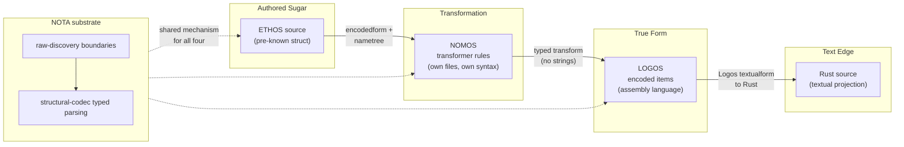
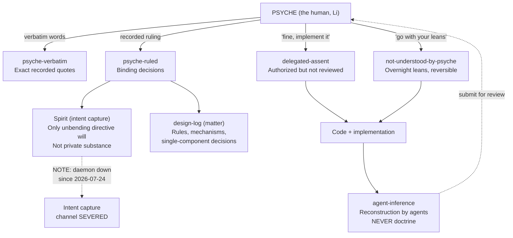

# Psyche Vision Reconstructed from First Principles

**TENTATIVE** -- this is a reconstruction for psyche review, assembled by an
agent from the surviving corpus on 2026-07-31. It is not authoritative
doctrine. Every substantive claim carries a provenance grade. The report
becomes authoritative only after the psyche reviews it and ports its content
into a more authoritative form. Until then, treat it as a working surface for
reorientation, not as a source to cite.

Provenance grades used throughout:

- **[psyche-verbatim]** -- the psyche's own recorded words, quoted exactly
- **[psyche-ruled]** -- a recorded ruling by the psyche, binding
- **[delegated-assent]** -- authorized for implementation; the psyche has not
  reviewed the substance ("fine, I dont quite understand but we can implement
  it")
- **[not-understood-by-psyche]** -- overnight lean taken under explicit
  authorization; psyche has not reviewed; fully reversible
- **[agent-inference]** -- reconstruction by agents; may be wrong; never
  doctrine

Bead: primary-06m.

Source sessions cited:
`~/.claude/projects/-home-li-primary/df3857a3-2c92-4545-9659-d43727d969cb.jsonl`,
`e659bbc8-10bc-4a4b-81c8-0ff7a7b5d882.jsonl` (same dir),
`~/.codex/sessions/2026/07/30/rollout-2026-07-30T11-12-27-019fb24b-ea61-7440-88d3-9679e407131a.jsonl`.

Design directory: `/git/github.com/LiGoldragon/protos-engine/design/ProtosEngine/`.

## 1. The Root Principle: Structural Positional Parsing

This is the centerpiece. On 2026-07-31, the psyche broadcast a re-explanation
to both the Claude session (df3857a3) and the Codex session (019fb24b) that
regrounds everything.

The ethos source file is a pre-known struct: typed data with a known root
type. The parser does not discover structure by reading tokens in sequence --
it knows the type at the root, and at each position within that type there is
a position-specific set of structural possibilities. Parsing is structural,
not conventional.

**[psyche-verbatim]**: "the ethos source file is a struct, is an already
known struct. So we're reading data basically... each of these positions is
parsed in the, we already know how to parse it."

**[psyche-verbatim]**: "this opens up the possibility of using the same kind
of syntax tricks to mean different things at different places."

The implication is fundamental: the same surface glyph -- `.{}`, `.()`,
`.[]`, plain `{}`, `[]`, `()`, dotted symbol chains -- can mean DIFFERENT
things at different positions because the parser already knows the type at
that position and selects the appropriate structural reading.

**[psyche-verbatim]**: "'X.[...] declares an enum' is only true at a
particular position; protos language is *positional*"

This is not a parsing technique bolted onto an otherwise conventional
language. It IS the language. The parser never guesses what something means by
looking at what characters are present -- it knows because it knows where it
is in a pre-known typed structure.

### What this supersedes

**[psyche-verbatim]**: "you've all just been implementing without really
understanding what we're making at the root."

**[psyche-verbatim]**: "there's been some design lost, and then a lot of stuff
has been written without the right design in mind. So we have to sort of doubt
everything now."

Everything written before this re-explanation is evidence, not doctrine. The
agents (Claude and Codex both) had been building under a universal-syntax
assumption -- treating syntactic forms as having fixed meanings regardless of
position. That assumption is wrong.

**[psyche-verbatim]** (about the six-slot layout found in core-ethos): "that's
an old design what you found and I don't think that it would be very
consistent to just follow it blindly"

### The declaration vs. reference positional fact

**[implementation-fact]** The deepest existing proof of positional meaning is
in the current codec. The same atom spelling means different binding behavior
depending on which position it occupies:

- A **declaration** position requires a translator-issued assignment already
  made for that spelling (allocates)
- A **reference** position requires the spelling to resolve against a prior
  already known (never allocates)

Source: `core-ethos/src/whole.rs`, `SharedDescriptor::Declaration` vs
`SharedDescriptor::Reference`; test-proven at
`core-ethos/tests/whole_six_slot.rs` lines 386-402.

**[psyche-ruled]** (DesignReviewRulings-2026-07-28.md, Entry 3): "no, nothing
declares the coreID, the coreID is allocated by the translator on receiving an
unallocated word."

## 2. The Four-Language Family

**[psyche-verbatim]** (session e659bbc8, PsycheVisionReacquisition-2026-07-29
Entry 4):

> We have three languages, ethos, nomos, and logos. And all three use the
> same mechanism to load to and from textual form into encoded form... They're
> all protos family languages, like NOTA is actually, you could say, the
> fourth language in the foundation... The separation in three was necessary.
> Nomos is there to create the sugar syntax, the beautiful syntax of ethos,
> and logos is there to give us a true representation of essentially our
> assembly language... the entire reason why we have nomos is so that we can
> modify the transformation using the nomos language. If the nomos language
> was never implemented, then the entire engine is currently a failure.

### The pipeline

```
 NOTA substrate (the fourth foundational language)
      |
      v
+---------------------------------------------+
| PROTOS shared mechanism:                     |
|   nametree + structuretree + textualform     |
|   drives all decoding/encoding to/from text  |
+---------------------------------------------+
      |                |                |
      v                v                v
  ETHOS            NOMOS            LOGOS
  authored         transformation   true form /
  sugar syntax     language         assembly
                                    language
      |                |                |
      |    +-----------+                |
      |    |                            |
      v    v                            v
  Ethos ----[Nomos transform]----> Logos ----[projection]----> Rust text
  encodedform                      encodedform                 (at the edge)
```

**[psyche-verbatim]** (Entry 4): Logos is "kind of like Shen's kernel lambda."

**[psyche-verbatim]** (Entry 5): "All of our three languages, well, four if
we include Noto, have textual form and encoded form, which we could also refer
to as the true form."

Key properties [psyche-ruled unless noted]:

- Programs exist as typed encoded data (the true form); text is only a
  projection. [psyche-ruled, Entry 5]
- Identity is integer encodedID chains, never spellings. [psyche-ruled,
  DesignReviewRulings Entry 2-3]
- The nametree + structuretree load mechanism is shared by all four
  languages. [psyche-ruled, SliceOneRulings Entry 9: "nametree and structural
  tree from the protos library drive all the decoding and encoding to/from
  text with DATA - strict invariant. nothing else will do."]
- Multiple textualforms per encodedform are possible (e.g. Logos to Logos text
  or Logos to Rust text). [psyche-ruled, session 29d00eb1 line 108, 2026-07-17]
- **[psyche-verbatim]** (review of this report, 2026-07-31): "Nomos must have
  the same textual/encoded form as the other two, so it can round-trip from/to
  either forms. this is undoubtedly the hardest part to get right." Nomos is
  not a special case bolted onto the mechanism: it round-trips through the
  shared textualform/encodedform machinery exactly like Ethos and Logos, and
  the psyche flags this as the hardest part of the design to get right.
- **[psyche-verbatim]** (same review, sharpening the above): "The hardest
  problem is the nomos to logos. There's two types there. One in nomos has the
  same shape as a corresponding logos type, but it's not the same thing. And
  the transformation is going to have to take one of those things and generate
  the other. So maybe we need to go do some pretty hardcore low-level rust
  research here." [agent-inference reading]: every Logos type has a Nomos-side
  counterpart of the same shape that is nonetheless a distinct type; the
  transformer consumes the Nomos-side value and generates the genuine Logos
  value. How to represent this shape-identical-but-distinct type pair in
  low-level Rust without hand-duplicating the whole Logos vocabulary is an
  open research question.

### Why three languages, not one

**[psyche-verbatim]** (Entry 4): "the reason I'm approaching this triple
layer is manifold, one of which is to keep agents honest and the other is to
create a stable ethos syntax while allowing us to deeply change the behavior
of what that syntax actually does in practice by changing nomos while also
allowing us to extend, maintain, improve, debug, or support of the Rust syntax
and the Rust functionality, the Rust compiler, basically, with the logos
layer, which also gives us an incredible debugging interface."

### The four-language pipeline diagram



## 3. Syntax Walkthroughs: Positional Reading

### 3.1 The six-slot Ethos document

**Grade: [implementation-fact] for the structure; the six-slot layout itself
is OLD DESIGN per the psyche's 2026-07-31 re-explanation. Do not follow it
blindly.**

Source: `core-ethos/src/whole.rs` struct `SixSlotDocumentRecord` at line 583;
`core-ethos/tests/whole_six_slot.rs` `BREADTH_SOURCE` at line 21.

```
{} [] [] {Identifiers.Vector.Integer Status.{Pending Ready.{Integer} Batch.{Vector.Integer Integer}}} {} {}
```

Reading (position-by-position, in the current six-slot codec):

| Position | Slot | Delimiter | Status |
|:---------|:-----|:----------|:-------|
| 1 | Imports | `{}` | empty_braces only [implementation-fact] |
| 2 | Input | `[]` | empty_square only [implementation-fact] |
| 3 | Output | `[]` | empty_square only [implementation-fact] |
| 4 | Types | `{}` | **only slot with content parsing** [implementation-fact] |
| 5 | Generics | `{}` | empty_braces only [implementation-fact] |
| 6 | Impls | `{}` | empty_braces only [implementation-fact] |

The Types slot (position 4) is where the positional principle comes alive.
Inside `{}` at this position, the same dotted forms mean specific things:

| Surface form | Reading at Types slot | Source |
|:-------------|:----------------------|:-------|
| `X.Y` | newtype `X` wrapping type `Y` | `newtype_rule`, whole.rs line 731 |
| `X.Y.Z` | newtype `X` wrapping application `Y.Z` | `application_reference_rule`, line 798 |
| `X.{A B}` | enum `X` with brace-delimited variants | `brace_enumeration_rule`, line 741 |
| `X.[A B]` | enum `X` with square-delimited variants | `square_enumeration_rule`, line 754 |

Inside an enum body, variant forms:

| Surface form | Reading inside enum body | Source |
|:-------------|:-------------------------|:-------|
| `A` | unit variant | `unit_variant_rule`, line 767 |
| `A.T` | payload variant | `payload_variant_rule`, line 784 |
| `A.{T1 T2}` | tuple variant | `tuple_variant_rule`, line 771 |

**The same `X.{...}` form means enum-declaration at the top level of the
Types slot but tuple-variant inside an enum body.** This is positional parsing
in action -- the form's meaning comes from where it sits in the pre-known
typed structure.

### 3.2 Positional / structural parse picture

This diagram shows how the SAME surface forms mean different things at
different positions in the pre-known typed struct.

```
ETHOS DOCUMENT (root type: SixSlotDocument)
|
|-- position 1: {} --> Imports slot (must be empty in current codec)
|-- position 2: [] --> Input slot (must be empty in current codec)
|-- position 3: [] --> Output slot (must be empty in current codec)
|-- position 4: {} --> Types slot (PARSED)
|   |
|   |-- at this level: X.Y = NEWTYPE DECLARATION (X wraps Y)
|   |                  X.{...} = ENUM DECLARATION (X with variants)
|   |                  X.[...] = ENUM DECLARATION (square variant)
|   |
|   |-- inside an enum body:
|   |   |-- A = UNIT VARIANT
|   |   |-- A.T = PAYLOAD VARIANT
|   |   |-- A.{T1 T2} = TUPLE VARIANT  <-- same .{} form, different meaning!
|   |
|   |-- in a type reference position:
|   |   |-- Y = IDENTITY REFERENCE (bare name resolves against priors)
|   |   |-- Y.Z = APPLICATION (Y applied to Z, right-associative)
|   |   |-- Vector.Integer = Vector applied to Integer
|   |
|   |-- declaration vs. reference:
|       |-- X in "X.Y" (head) = DECLARATION (allocates via translator)
|       |-- Y in "X.Y" (payload) = REFERENCE (resolves, never allocates)
|       |-- SAME ATOM, different binding rule by position
|
|-- position 5: {} --> Generics slot (must be empty)
|-- position 6: {} --> Impls slot (must be empty)
```

**[implementation-fact]**: Application heads must be registered priors.
Default builtin priors are **only `Integer` and `Vector`**
(`WholeEthosBuiltinPriors`, whole.rs lines 1023-1032). `ScopeOf`, `Optional`,
and all other names require explicit registration to head an application.

### 3.3 ScopeOf example

Source fixture: `schema-rust/tests/fixtures/domain-terminal-scope.schema`
(verified 2026-07-31).

```
Domain.[Technology.Software]
Software.[Programming.ProgrammingLeaf Theory]
ProgrammingLeaf.[All TypeSystems Parsing]
DomainScope.ScopeOf.Domain
ScopeSet.Vector.DomainScope
```

Positional readings within the Types slot:

| Line | Reading | Grade |
|:-----|:--------|:------|
| `Domain.[Technology.Software]` | enum `Domain` with square-delimited variants; `Technology.Software` is a payload variant (Technology carrying Software) | [implementation-fact] current syntax shape |
| `Software.[Programming.ProgrammingLeaf Theory]` | enum `Software` with variants including a payload variant `Programming.ProgrammingLeaf` and a unit variant `Theory` | [implementation-fact] |
| `ProgrammingLeaf.[All TypeSystems Parsing]` | enum `ProgrammingLeaf` with three unit variants | [implementation-fact] |
| `DomainScope.ScopeOf.Domain` | newtype `DomainScope` wrapping the application `ScopeOf.Domain` (X.Y.Z = newtype wrapping Y applied to Z) | [implementation-fact] shape, conditional on ScopeOf registration as application-head prior |
| `ScopeSet.Vector.DomainScope` | newtype `ScopeSet` wrapping `Vector.DomainScope` | [implementation-fact] |

**[psyche-ruled, 2026-07-31]**: `All` is a whole-tree wildcard -- "All should,
as the name implies, match all." Supersedes the overnight lean that `All`
matches only itself. Recorded in
`design/Nomos/allMatchesAllScopeOf-2026-07-31.md`.

Legacy-generated Rust (from `signal-domain/src/schema/domain.rs`, ~2,300
lines of scope enums from line 1048):
- 38 scope enums mirroring 38 domain enums
- 38 `From<SourceDomain>` impls (recursive `.into()`)
- 38 `contains_scope` inherent methods
- Root-level `(Self::All, _) => true` in branching and leaf scopes (sub-root);
  root `DomainScope` has the `All` wildcard only in hand-written
  `matches_domain` short-circuits, creating an asymmetry the ruling implies
  should be uniform.

### 3.4 Textual Nomos examples

Source: `reports/NomosAuthoredRulesDesign-2026-07-29.md` sections 3.3-3.5;
verified against `core-nomos/tests/textual_nomos.rs`.

**Enumeration structural default** (NomosAuthoredRulesDesign section 3.3;
matches `core-nomos/tests/textual_nomos.rs` lines 113-116):

```
Enumeration.Structural.Enumeration {
  (name.Name variants.Variants)
  Public Invoke.EnumerationAttributes Realize.name () [Splice.variants]
}
```

Positional reading within the Nomos document's Types slot:

```
Enumeration                  --> transformer name (Declaration position)
  .Structural.Enumeration    --> kind: Structural with SectionDefault Enumeration
  {                          --> template body delimiter
    (name.Name               --> input binding: "name" bound to MetaType Name
     variants.Variants)      --> input binding: "variants" bound to MetaType Variants
    Public                   --> literal Visibility at the visibility position
    Invoke.EnumerationAttributes --> escape: invoke another transformer
    Realize.name             --> escape: unquote bound "name" value
    ()                       --> empty generics
    [Splice.variants]        --> escape: splice bound "variants" into vector
  }
```

**WireNewtype structural default** (NomosAuthoredRulesDesign section 3.4;
matches `core-nomos/tests/textual_nomos.rs` lines 96-98):

```
WireNewtype.Structural.Newtype {
  (name.Name type.Type)
  Public Invoke.WireAttributes Realize.name Private Realize.type
}
```

**WireAttributes named transformer** (NomosAuthoredRulesDesign section 3.5):

```
WireAttributes.Named {
  ()
  [
    rustfmt.skip
    (| nota-text |).[ nota.NotaDecode nota.NotaDecodeTraced nota.NotaEncode ]
    [ rkyv.Archive rkyv.Serialize rkyv.Deserialize Clone Debug PartialEq Eq ]
  ]
}
```

The escape vocabulary in the base-door textualform [psyche-ruled for the
closed set; base-door spelling is [agent-inference]]:

| Escape | Spelling | Meaning |
|:-------|:---------|:--------|
| Realize | `Realize.<binding>` | unquote one bound value |
| Splice | `Splice.<binding>` | expand a bound sequence into a vector |
| Invoke | `Invoke.<transformer>` | recursively call another transformer |

**[psyche-ruled]** (ProtosEngineDesign section 11): "the escape set is closed
at two primitives ($x realizes, $@xs splices -- 'agreed')" -- the ruling is
about count and kind (two primitives plus Invoke as the recursion mechanism).

### 3.5 ScopeOfStep recursive transformer fixture

Source: `core-nomos/tests/textual_nomos.rs` lines 104-111. Grade:
**[delegated-assent]** -- built before the 2026-07-31 re-explanation, under
the discredited universal-syntax assumption.

```
ScopeOfStep.Recursive.Enumeration {
  (variant.Name source.Variants children.Variants)
  [
    Invoke.ScopeOfStep
    Splice.children
    InsertAt.children 0 rustfmt.skip
    [Clone]
  ]
}
```

This introduces `Recursive` as a third `MacroKind` alongside `Structural` and
`Named`, and `InsertAt` as a new escape form. Both were implemented under
[delegated-assent] before the psyche ruled on po2.19. The positional-meaning
content within (three input bindings, recursive Invoke, InsertAt for targeted
vector insertion) remains illustrative of the recursion machinery needed for
ScopeOf expansion.

### 3.6 NOTA positional records

**[implementation-fact]**: NOTA is the fourth foundational language. Its
records are positional -- bare atoms serve as canonical strings. A live
example is the offline intent-capture queue at
`/home/li/primary/spiritbackup.nota:25`:

```
(SpiritBackup [])
```

A positional record: bare-atom constructor `SpiritBackup` in the first
position, an (empty) vector body in the second. Nothing is named; the
positions carry the meaning. The general principle -- positional records,
bare atoms for strings -- is [psyche-ruled] through the "all fields
positional" and "field names illegal" rulings.

## 4. Authority and Provenance Flow



**The critical distinction** [psyche-ruled via AGENTS.md]:

- **Intent** (goes to Spirit): the rare, orienting will of the psyche -- an
  aim, value, or belief he holds against his own convenience that bends a whole
  class of downstream choices
- **Matter** (goes to code, docs, skills): everything else -- defaults, rules,
  mechanisms, single-component decisions, Spirit-operation instructions

**When it is not clearly intent, it is matter. When unsure, ask instead of
inferring.** [psyche-ruled]

### What the grades mean in practice

An agent must never present [agent-inference] as doctrine. That exact failure
-- agent prose styled as doctrine -- is one of the drifts this entire effort
corrects. The psyche said agents had been "implementing without really
understanding what we're making at the root," and much of what was built
reflected agent reconstruction that was never submitted for review.

The grade hierarchy:

1. [psyche-verbatim] -- highest authority; exact words
2. [psyche-ruled] -- binding decision, may not be verbatim
3. [delegated-assent] -- authorized for implementation, psyche retains
   redirect authority; "fine, I dont quite understand but we can implement it
   and then Ill have actual code for you and I to actually look at"
4. [not-understood-by-psyche] -- overnight lean, explicitly reversible,
   psyche has not reviewed substance
5. [agent-inference] -- lowest; reconstruction; may be wrong

## 5. Standing Laws

### Positional fields and no field names

**[psyche-ruled]**: "ALL FIELDS ARE POSITIONAL", "field names are now
COMPLETLY ILLEGAL EVERYWHERE" -- this law governs the protos data model
(encoded forms, wire, NOTA records), NOT Rust source.

**[psyche-ruled, 2026-07-30]** (rustTuplesForbiddenLawScope-2026-07-30.md):
The positional-fields law is about the protos languages' data model. Rust
structs use named fields. Named fields and the positional-fields law are not in
tension; they govern different layers. This ruling supersedes the overnight
lean (Decision 3) that the law binds "all new Rust data shapes."

### No string manipulation in Nomos

**[psyche-ruled]** (ProtosEngineDesign section 10): "in the nomos
transformation ([ethos] to logos), there shall be *no string
manipulation/introduction/reading of any kind*"

### Translator-only coreID allocation

**[psyche-ruled]** (DesignReviewRulings Entry 3): "no, nothing declares the
coreID, the coreID is allocated by the translator on receiving an unallocated
word." No second allocation authority exists.

### Tuples forbidden in Rust

**[psyche-ruled, 2026-07-30]** (rustTuplesForbiddenLawScope-2026-07-30.md):
"Tuples are forbidden in Rust. ... I know that a new type is a tuple, but
that's the only exception. I don't consider it to be a tuple." Ad-hoc tuple
types and multi-field tuple structs prohibited; newtype (one-field wrapping
struct) is the sole exception.

### Reuse equals correctness

**[psyche-ruled, 2026-07-30]** (reuseEqualsCorrectnessProvenance-2026-07-30.md):
"I said reuse == correctness." Repeated byte-identical authored content must
reuse (repoint to) the existing identity rather than minting a new durable
occurrence.

### No grammar keywords in Ethos

**[psyche-ruled, 2026-07-22]**: "make them the same thing" -- "exceptions are
symptoms of bad design." Builtins (`Integer`, `String`, `Vector`, `Optional`,
`ScopeOf`, etc.) are **prior definitions in the translator table**,
syntactically identical to any user-authored name. There is no reserved-word
class in the grammar. Source: RecoveredNomosVision-2026-07-29.md, the "make
them the same thing" dissolution.

### Priority stack

**[psyche-ruled]**: clarity > correctness > introspection > beauty.
[agent-inference: sourced from design log; exact session unlocated]

### Transformer vocabulary

**[psyche-ruled]** (PsycheVisionReacquisition Entry 5): "I'm going to use
the word transformer instead of macro because I think macro is overloaded and
it doesn't... I think agents associate it too much with string transformation,
and this is really a type transformation." Existing Rust type names
(`MacroDefinition`, `MacroPackage`, etc.) predate this ruling and stay
accurate as code literals.

## 6. Nomos Escapes and the Open Recursion Question

### The dual spelling to reconcile

The psyche's re-explanation speaks of the placeholder `$` and spliced
placeholder `$@`. The authored-rules design
(`reports/NomosAuthoredRulesDesign-2026-07-29.md`) spells the closed escape
set as `Realize.<binding>` / `Splice.<binding>` / `Invoke.<transformer>`.

**[agent-inference]**: These are two textualforms for the same encodedform,
per the 2026-07-17 ruling: a plain-NOTA base door first (the
`Realize`/`Splice`/`Invoke` keyword-application spelling), and a sigil-rich
`$`/`$@`/`@` form second. The ruling is about count and kind of escapes (two
primitives plus Invoke), not about the surface glyphs. The reconciliation is:
both spellings are valid views of the same three escapes, at different
textualform layers. Flag: this reconciliation is [agent-inference] and should
be confirmed by the psyche.

### The recursion surface: po2.19

**[delegated-assent]** (2026-07-31, from the management session):

The psyche leaned toward Option A: "Recursion remains one authored Invoke
concept... RecursiveInvoke is internal representation: implementation matter,
not authored vocabulary... recursion must be visible in authored text
somewhere -- the target transformer's declaration carries its recursive nature
and termination judgment. All of this at delegated-assent grade, revisitable
on real code."

**[psyche-verbatim]**: "the po2.19 surface question... is not yet ruled -- do
not build recursion surface until it is."

The two options from `reports/NomosRecursionBriefing-2026-07-30.md`:

- **Option A**: one authored `Invoke` concept; the engine distinguishes
  internally between ordinary acyclic calls and structurally-decreasing
  recursive calls; authored algebra stays at three members
- **Option B**: distinct authored `Fold` member; recursion is a visible
  deliberate act at every use site; grows the ruled-closed algebra

The overnight lean (Decision 2 in
`reports/NomosTrainAddendum-2026-07-30.md`) proposed Fold as a new escape
variant. That lean was explicitly [not-understood-by-psyche]. The psyche's
2026-07-31 direction leans toward Option A but has NOT ruled.

## 7. The Doubt Register: What to Doubt and Why

### Everything pre-2026-07-31 is evidence, not doctrine

The psyche's re-explanation of structural positional parsing invalidates the
universal-syntax assumption that underpinned most prior agent work. Specific
artifacts demoted to evidence status:

| Artifact | Original grade | Post-re-explanation status |
|:---------|:---------------|:--------------------------|
| `reports/EthosPositionalGrammar-2026-07-31.md` | [implementation-fact] for code observations | Evidence; six-slot layout is OLD DESIGN |
| `reports/ScopeOfDomainStudy-2026-07-31.md` | Mixed grades | Evidence; assembled minutes before re-explanation |
| `reports/NomosRecursionBriefing-2026-07-30.md` | Mixed grades | Evidence; po2.19 surface explicitly unruled |
| `reports/RustTupleViolationsRegister-2026-07-30.md` | Audit findings | Evidence; tuple law scope clarified by psyche ruling |
| `reports/NomosAuthoredRulesDesign-2026-07-29.md` | Design proposal | Evidence; TextualNomos surface design predates re-explanation |

### po2.19 Fold/RecursiveInvoke/InsertAt machinery

Implemented under [delegated-assent] before ruling, under the discredited
universal-syntax assumption. The `ScopeOfStep.Recursive.Enumeration` fixture
in `core-nomos/tests/textual_nomos.rs` (lines 104-111) was built as a code
fact, not as ruled design. InsertAt as an escape form was built alongside
Fold/RecursiveInvoke, also unruled.

### The ScopeOf design packet

The ScopeOfDomainStudy report was assembled in the codex session (indices
~2496-2504) minutes before the psyche delivered the re-explanation. It was
assembled under the old understanding. Its factual content about legacy Rust
generation (signal-domain/src/schema/domain.rs observations) remains valid
evidence; its design framing is pre-re-explanation.

### NomosTrainAddendum overnight leans

Nine decisions taken at [not-understood-by-psyche] grade
(`reports/NomosTrainAddendum-2026-07-30.md`). Status as of 2026-07-31:

| Decision | Topic | Status |
|:---------|:------|:-------|
| 1 | ScopeOf helper identity | Lean stands but All-matches-all half **reversed** by psyche ruling |
| 2 | Escape-vocabulary growth (Fold + InsertAt) | Lean stands; po2.19 surface **unruled** |
| 3 | Positional-fields law scope | **Reversed** by psyche ruling (law is protos data model, not Rust source) |
| 4 | Alias law scope | Unconfirmed |
| 5 | syn/quote/prettyplease law scope | Unconfirmed |
| 6 | StoreSchema naming exemption | Unconfirmed |
| 7 | Cross-package Invoke | Unconfirmed |
| 8 | Law 5 gate enforcement | Normal-grade hygiene, not a lean |
| 9 | sema-engine "macro" wording | Unconfirmed |

### Spirit daemon down

The Spirit daemon has been down since 2026-07-24 with an empty spiritbackup
queue. This means the intent capture channel has been severed during the most
active design period in the project's history. Rulings from 2026-07-24 through
2026-07-31 -- including the foundational re-explanation itself -- may not have
been captured as Spirit intent records.

### Old material discussed as "schema"

**[psyche-ruled]** (PsycheVisionReacquisition Entry 1-2): The schema-to-ethos
rename covers all protos-engine documents. `schema-rust` is the old
generation; many original sessions are deleted; some rulings survive only as
recovered quotes.

### The psyche's closing directive

**[psyche-verbatim]**: "expect having to rewrite significant portions of many
parts" (bead protos-engine-po2.25, blocks po2.7).

### What is NOT doubted

- po2.4 through po2.6: deployment/identity semantics and tuple cleanup are
  independent of Ethos syntax. [agent-inference: these concern Rust-level
  mechanics, not the positional-parsing design]
- The Nomos engine's evaluator machinery (engine.rs, template.rs, escape
  algebra internals) -- the implementation matter beneath the authored surface
  is separable from the surface-syntax questions now in doubt.
- The standing laws in section 5 above -- these are psyche-ruled and were not
  affected by the re-explanation.

## 8. Open Questions for Psyche Review

These are the items needing the psyche's answers. Each is flagged with what
currently exists (evidence, lean, or nothing) and why it is open.

### 8.1 Design-log recency vs. authority

Design-log entries are governed by "recency governs" within each log. But
recency alone does not establish authority across different surfaces (e.g., a
recent agent-inference report does not outrank an older psyche ruling). The
relationship between recency and authority across surfaces is not codified.
[agent-inference: this is a meta-question about the design process itself]

### 8.2 ScopeOf helper identity

**[not-understood-by-psyche]**: Option A (durable per-helper translator IDs)
vs Option B (implementation structure under one authored identity, scope values
as paths of source-variant encodedIDs). The overnight lean chose Option B.
The psyche has not reviewed.

Source: `reports/NomosTrainAddendum-2026-07-30.md` Decision 1;
`ScopeOfIdentityBriefing-2026-07-29.md`.

### 8.3 po2.19 authored surface

One authored Invoke concept (Option A, psyche lean) vs distinct authored Fold
(Option B, overnight lean)? The psyche said it is "not yet ruled -- do not
build recursion surface until it is."

### 8.4 Remaining unconfirmed overnight leans

Decisions 4-7, 9 from `NomosTrainAddendum-2026-07-30.md` have not been
confirmed or reversed by the psyche. They continue as [not-understood-by-psyche]
grade leans.

### 8.5 The $/$@ vs Realize/Splice spelling reconciliation

Are these indeed two textualforms for the same escapes (per the 2026-07-17
two-textualform ruling), or does the psyche intend something different?
[agent-inference: the reconciliation in section 6 is an agent reading]

### 8.6 Logos payload atoms: positional-slot type-tags or names?

The ratified Logos item vocabulary uses atoms like `ItemName`, `Visibility`,
`Attributes`, `WrappedField`, `Generics`, `Fields`, `Variants` as positions
in:

```
NewtypePayload.{ ItemName Visibility Attributes WrappedField }
StructPayload.{ ItemName Visibility Attributes Generics Fields }
EnumerationPayload.{ ItemName Visibility Attributes Generics Variants }
```

Are these positional-slot type-tags (legal under the positional-fields law) or
field names (illegal)? Under the 2026-07-31 re-explanation, they should be
type-tags identifying the type expected at each position, not names labeling
the field. But this reading is [agent-inference].

Note: this vocabulary was ratified with an unrecovered exception ("otherwise I
like the syntax" -- what "otherwise" excepted was never recovered).
Source: `ProtosEngineDesign-2026-07-26.md`.

### 8.7 Spirit daemon and intent capture

The Spirit daemon has been down since 2026-07-24 with an empty spiritbackup
queue. The intent capture channel was severed during the most active design
period. What intent from this period (if any) needs to be manually captured
before it is lost? [agent-inference: this is an operational question, not a
design question, but it gates the integrity of the intent record]

## 9. The Standing Work Order

**[psyche-ruled, 2026-07-31]** (recorded in
`design/Nomos/allMatchesAllScopeOf-2026-07-31.md`, accompanying direction):

ScopeOf is the worked subject for designing the authoring stack:

1. **First**: the trait-based Rust the transformer must generate (the target)
2. **Then**: the minimal-information Ethos syntax (the source)
3. **Then**: the Nomos transformer between them (the transformation)

This order is deliberate: understand the target before designing the source
syntax, and understand both before designing the transformation between them.

## 10. Live Thoughts from Psyche Review (2026-07-31)

The psyche reviewed this report interactively and produced new vision
material. Everything in this section is explicitly **thought-grade — "this is
just a thought, not a decision"** [psyche-verbatim] — unless marked
otherwise. It is recorded here so it is not lost; none of it is ruled.

### 10.1 Doubt extends to the template substrate

**[psyche-verbatim]**: "I already made it clear the previous slices were
misguided, so we should doubt any and all parts." This explicitly covers the
`TemplateValue<Root>` / `TemplateLandingShape<Root>` substrate that the
mirror-types research (reports/NomosLogosMirrorTypesResearch-2026-07-31.md)
ranked first as "already solved." Its mechanism may be sound, but its
provenance is old-slice implementation: doubt-flagged, to be re-derived from
the vision, not trusted because it exists.

### 10.2 Every-position escapability (proposed ruling, unconfirmed)

Raised by the psyche's question "could we possibly want to support an
evaluation to resolve visibility? ... Isnt the point to have complete
flexibility in nomos to create any level of sugar syntax in ethos?"
[psyche-verbatim]. Proposed ruling line, awaiting confirmation: every
position in a Nomos template is escapable; an escape must resolve to the
position's type; Fixed positions are an implementation artifact, not design.

### 10.3 NOTA-typed positions and typed Ethos programs

**[psyche-verbatim]** (condensed): "In certain positions, I could see a
design where it would expect a data object as in NOTA... we could have
different types of ethos files even... different types of ethos programs.
Type specificity is the strength here and we need to build up on it...
a type of program that expects certain variables to be set."
[agent-inference reading]: the pre-known-struct root principle generalizes —
the root type of an Ethos file is itself selectable, so distinct program
kinds exist, each with its own positional expectations, including positions
whose expected type is a NOTA data object.

### 10.4 Program-wide configuration data objects

**[psyche-verbatim]** (condensed): "we would have a NOTA object in a
particular position that configures certain things... there could be even
certain object types [nomos-defined] that need configuration data in them...
program-wide configuration data objects. And some of the escapes could refer
to these... This is all about standards: we create standard ways to refer to
these things. It could even involve bringing in a new prefix symbol to refer
to this sort of program-wide configuration data object."

### 10.5 Transformation-time evaluation runtime (derived values)

**[psyche-verbatim]** (condensed): "these could even involve some kind of
evaluation that depends on other parts of the configuration to resolve
them — derived values... template conditions or default values: if this
isn't set, then derive from this and this and this. So we could have some
kind of transformation-time — what other languages call macro-expansion-time
— evaluation. We create our own evaluation runtime. It's a thought... worth
researching. Is this something that the most advanced macro language systems
use universally? And is there a good use case for this?" Research
commissioned: expansion-time evaluation prior art
(reports/MacroTimeEvaluationPriorArt-2026-07-31.md when it lands).

### 10.6 Possible rename of NOTA (naming exploration only)

**[psyche-verbatim]** (condensed): "Maybe NOTA — I find it kind of clumsy in
the mouth... next to ethos, nomos, and logos. Maybe it's something like
dattos, or datom — but that conflicts with datum... dattos, D-A-T-O-S...
Maybe you can look in the Greek and the Latin words, something that has to do
with information." Explicitly a thought, not a decision.

Naming research result [agent-inference, exploration only]: top candidate
**Dotos** — Greek δοτός, "given, granted," the literal Greek cognate of Latin
*datum* (attested morpheme, as in Hēró-dotos "given by Hera"); no external
language/database/trademark collision found, no internal collision, easy in
English and French mouths, native to the -os family. Runner-up **Grammos**
(γράμμα, "written character/record" — names the mark rather than the
given-ness; soft collision with "gram"). **Datos** rejected as literally
Spanish for "data" (less a coined name); Semos collides with in-system Sema;
Eidos, Hylos, Mnemos, Morphos, Typos, Notos all rejected for external
collisions or off-meaning.

### 10.7 Whole-program Ethos horizon and Rust FFI porting

**[psyche-verbatim]** (condensed): "Imagine a world in which the whole
program is written in ethos — full Rust language capability on the logos
side. Anything could be expressed, even though we wouldn't necessarily
support all of the Rust features — no multiple-value tuples, no free
functions other than the main function... Libraries that need functions as
arguments (anonymous lambdas) or free tuples could be resolved with a kind of
FFI approach, so those libraries could be quote-unquote ported to be
interoperable with ethos and logos — the PROTOS engine as a whole."

### 10.8 How psyche vision grows (meta)

**[psyche-verbatim]** (condensed): "Discussing the design and exploring
creates more Psyche vision. The Psyche sees things and then, by interacting
with these thought objects, the vision becomes clearer — or at least some
ideas or questions come up which he needs to answer in order to know if he
has made the proper design... sometimes visionaries need something to
inspire them to ask the right question." [agent-inference]: this bears on the
psyche-interraction doctrine — presenting concrete thought objects (worked
examples, reports, syntax sketches) is itself the mechanism by which vision
is elicited, not merely a way to document it.

## 11. Sources Consulted

All paths verified 2026-07-31 against the current checkout.

**Design logs** (controlling authority):
- `/git/github.com/LiGoldragon/protos-engine/design/ProtosEngine/PsycheVisionReacquisition-2026-07-29.md`
- `/git/github.com/LiGoldragon/protos-engine/design/ProtosEngine/RecoveredNomosVision-2026-07-29.md`
- `/git/github.com/LiGoldragon/protos-engine/design/ProtosEngine/DesignReviewRulings-2026-07-28.md`
- `/git/github.com/LiGoldragon/protos-engine/design/ProtosEngine/SliceOneRulings-2026-07-27.md`
- `/git/github.com/LiGoldragon/protos-engine/design/ProtosEngine/ShapeAndSliceRulings-2026-07-26.md`
- `/git/github.com/LiGoldragon/protos-engine/design/ProtosEngine/ProtosEngineDesign-2026-07-26.md`
- `/home/li/primary/design/Nomos/allMatchesAllScopeOf-2026-07-31.md`
- `/home/li/primary/design/Nomos/rustTuplesForbiddenLawScope-2026-07-30.md`
- `/home/li/primary/design/Nomos/reuseEqualsCorrectnessProvenance-2026-07-30.md`

**Reports** (evidence, not doctrine):
- `/home/li/primary/reports/EthosPositionalGrammar-2026-07-31.md`
- `/home/li/primary/reports/ScopeOfDomainStudy-2026-07-31.md`
- `/home/li/primary/reports/NomosAuthoredRulesDesign-2026-07-29.md`
- `/home/li/primary/reports/NomosRecursionBriefing-2026-07-30.md`
- `/home/li/primary/reports/NomosTrainAddendum-2026-07-30.md`

**Source code** (implementation-fact):
- `/git/github.com/LiGoldragon/core-ethos/src/whole.rs`
- `/git/github.com/LiGoldragon/core-ethos/tests/whole_six_slot.rs`
- `/git/github.com/LiGoldragon/core-nomos/tests/textual_nomos.rs`
- `/git/github.com/LiGoldragon/schema-rust/tests/fixtures/domain-terminal-scope.schema`
- `/git/github.com/LiGoldragon/signal-domain/src/schema/domain.rs`

**Session transcripts** (psyche-verbatim source):
- `~/.claude/projects/-home-li-primary/df3857a3-2c92-4545-9659-d43727d969cb.jsonl`
- `~/.claude/projects/-home-li-primary/e659bbc8-10bc-4a4b-81c8-0ff7a7b5d882.jsonl`
- `~/.codex/sessions/2026/07/30/rollout-2026-07-30T11-12-27-019fb24b-ea61-7440-88d3-9679e407131a.jsonl`
