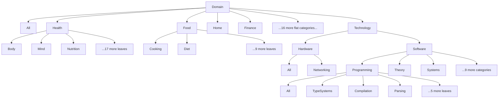
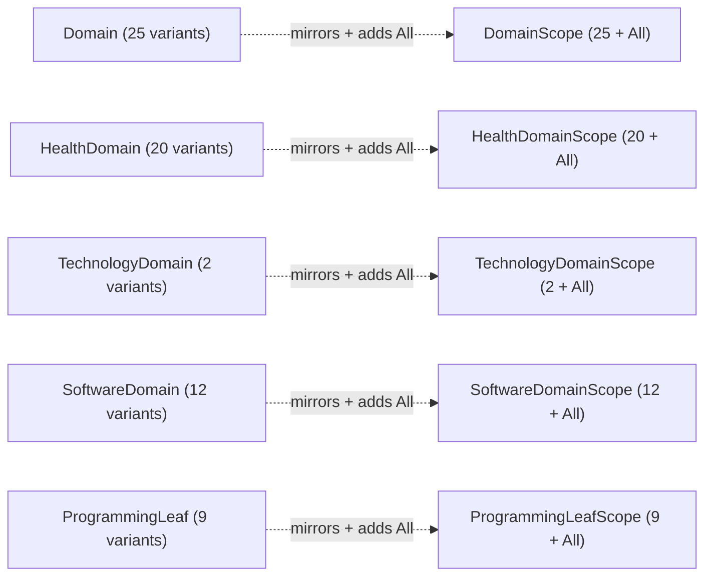
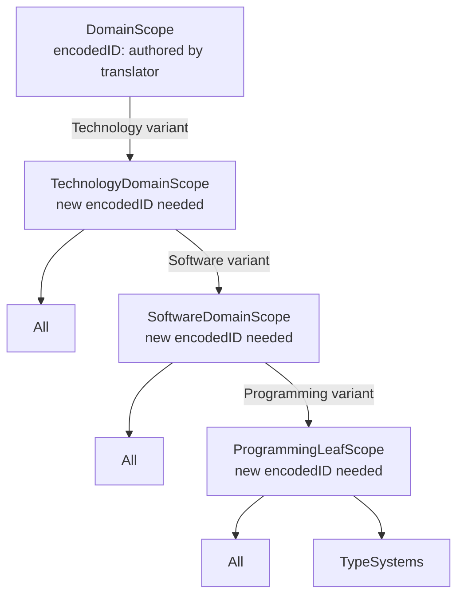
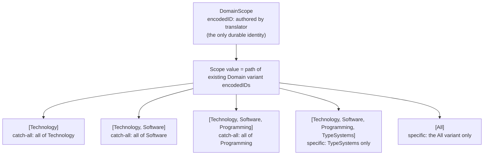

# ScopeOf Identity Briefing

## 1. The Situation

The port of Spirit from Schema to Ethos (protos-engine-po1.10) is blocked on
one item: the executable behavior of `DomainScope.ScopeOf.Domain`. Everything
else in the first slice compiles and runs -- 38 enums, 369 variants, 3
application newtypes, 410 declarations total. The encoding dependency (Base58BTC
production naming) is independently closed. Downstream ports -- Orchestrator,
Mind, Messenger -- are all blocked on this. Codex has a recommendation about how
the synthesized helper scope types should relate to the identity system. It
landed on your desk because it touches translator-allocation law: when Nomos
expands a single authored ScopeOf declaration into dozens of ordinary types,
do those intermediate types get their own durable encodedIDs, or are they
implementation structure under the one authored identity? Saying yes to Codex's
recommendation means helpers have no translator identity of their own, and scope
values are paths of existing source-variant encodedIDs. Saying no means either
authoring all 38 scope enums by hand (defeating ScopeOf) or changing translator
allocation rules to mint identities for words the translator never received.

## 2. What ScopeOf Is For, in Practice

### The Domain Tree

Spirit entries are tagged with Domain values. An entry about type systems
carries `Domain::Technology(TechnologyDomain::Software(SoftwareDomain::
Programming(ProgrammingLeaf::TypeSystems)))`. The Domain tree in signal-domain
has 38 enums and 369 variants across 24 top-level categories (plus a root All
variant). Most categories are flat (one sub-enum of leaves); Technology is
uniquely deep, with nested sub-enums several levels down.

Here is the real tree, abbreviated for readability (the full tree has 24
top-level categories; only three are expanded):



### What Scoping Does

Subscriptions select entries by scope -- "show me everything about Software" or
"show me only TypeSystems." To make this work, the legacy system maintains a
**parallel tree of 38 scope enums** that mirrors the 38 domain enums. Each scope
enum is structurally identical to its domain counterpart, plus an `All` variant
at the top for catch-all matching at that level:



In practice, a subscription to "everything about Software" constructs
`DomainScope::Technology(TechnologyDomainScope::Software(
SoftwareDomainScope::All))` and the `contains_scope` / `matches_domain` methods
walk the parallel trees to test containment.

This parallel structure is approximately 3,355 lines of generated Rust -- 38
scope enums, 38 `From<*Domain>` impls, 38 `contains_scope` methods.

### Why ScopeOf Exists

`ScopeOf` replaces the entire parallel tree with a single authored declaration:

```
DomainScope.ScopeOf.Domain
```

This declaration says: "DomainScope is the scope-type of Domain." The engine
reads this and synthesizes all 38 helper scope enums, their All variants,
conversions, and containment operations automatically. Without ScopeOf, you
would have to author all 38 scope enums by hand -- which is exactly the
state the legacy system is in, and which the Ethos port is designed to leave
behind.

The existing test fixture for ScopeOf (at `schema-rust/tests/fixtures/
domain-terminal-scope.schema`) uses a minimal 3-enum subset of the Domain tree
for testing:

```
Domain.[Technology.Software]
Software.[Programming.ProgrammingLeaf Theory]
ProgrammingLeaf.[All TypeSystems Parsing]
DomainScope.ScopeOf.Domain
ScopeSet.Vector.DomainScope
```

The full `spirit-domain.ethos` fixture with all 38 enums does not exist yet --
it is part of the work blocked on this ruling.

## 3. What Is Already Settled

Each item below is marked with its source. "Settled" means a psyche ruling
exists.

**Translator-only allocation** (DesignReviewRulings Entry 3):

> "no, nothing declares the coreID, the coreID is allocated by the translator
> on receiving an unallocated word"

Log note: "no minting act exists anywhere in the system. The translator
allocates a coreID when it receives a word it has not seen; a known word returns
its existing coreID; that is the only way an ID comes into being."

**The durable identity is the encodedID** (DesignReviewRulings Entry 8):

> "I didnt think of the durable identity as separate from its coreID, which I
> should have called encodedID (I dont know what the code currently calles it,
> but since its encodedform, encodedID is appropriate)"

**EncodedIDs are nested by module** (DesignReviewRulings Entries 9-10):

> "Where your question seems to imply that you've abandoned the concept of
> module and then the names that this module contains. So that name, I mean
> encoded IDs are by module which the module also has an encoded ID."

Identity is a chain of module-allocated encodedIDs. One nametable per module.
Rename is a one-entry edit.

**Emitted Rust names are textual encodings of identity, not projected human
names** (DesignReviewRulings Entry 7):

> "not if we use the coreID for the emitted rust (a textual version of it -
> some kind of textual binary encoding which is friendly to rustc)"

Log note: "emitted Rust identifies our things by a textual encoding of the
identity itself, not by projected human names; renames then touch nothing in
the emitted artifact"

**The exact codec is implementation matter; fixed-width decimal was rejected**
(DesignReviewRulings Entry 17):

> "thats a lame format. why use the most inefficient and reader unfriendly
> format imaginable?"

The V1 Base58BTC codec (protos-engine-po1.10.13, now CLOSED) implements this:
format tag 1, explicit VocabularyRoot wire tag, each LocalEncodedId as
big-endian u16, canonical z-prefixed Base58BTC encode/decode.

**No strings in Nomos** (SliceOneRulings Entry 5, the "sema vision"):

The Nomos transformation (SliceOneTransformation) is stateless, string-free, and
"has no access to any legacy or identity-allocation facility" (core-nomos
`slice_one.rs`, line 5). It preserves complete encoded-ID chains verbatim.

**Clarity standard** (SliceOneRulings Entry 10):

> "am I supposed to understand this? Do you? Like *actually understand* what
> that means in practice?"

### Pipeline Ownership -- Caveat

Codex describes the pipeline division as already settled: "Ethos stores ScopeOf
as sugar; typed, string-free Nomos expands it into complete ordinary Logos data;
rust-logos only transcribes it." This decomposition is consistent with and
follows naturally from the settled rulings above (no strings in Nomos, Nomos
preserves encoded-ID chains, emitted Rust is identity-based). However, no
psyche ruling was found that specifically states "ScopeOf expansion happens in
Nomos." The psyche settled the constraints that make this pipeline the natural
one, but did not directly dictate the pipeline itself. Codex's framing as
"already settled by your earlier vision" overstates slightly -- it is
constrained by your rulings to the point where alternatives would violate them,
but it was not directly spoken.

## 4. The Identity Question Itself, from First Principles

When Nomos expands `DomainScope.ScopeOf.Domain`, it reads the 38-enum Domain
tree and synthesizes ordinary Logos data: scope enums mirroring each domain
enum, plus their conversions and containment operations. This synthesis
produces intermediate helper types -- `HealthDomainScope`,
`TechnologyDomainScope`, `SoftwareDomainScope`, `ProgrammingLeafScope`, and 33
more.

The question is: **what are these helpers, in terms of the identity system?**

There are two options.

### Option A: Helpers Are Durable Universal Declarations

Each synthesized helper scope type (HealthDomainScope, TechnologyDomainScope,
etc.) would be a first-class entry in the Universal vocabulary. Each would need
its own translator-allocated encodedID and an authored spelling for the
nametable.

Here is the Technology subtree under Option A:



Under Option A, selecting "all of Programming" means constructing
`ProgrammingLeafScope::All` -- a value of a type that has its own durable
encodedID in the Universal vocabulary.

### Option B: Helpers Are Implementation Structure (Codex's Recommendation)

Only the authored `DomainScope` has a durable encodedID. The helper types exist
as internal implementation structure during expansion but have no translator
identity. A scope **value** is represented as a path of already-existing
source-variant encodedIDs from the Domain tree:



Under Option B, no new encodedIDs are minted. The scope value reuses the
encodedIDs that the Domain variants already have.

### Concrete Walkthrough of Option B

Suppose a subscriber wants "everything about Software programming." The scope
value is the path:

**`[Technology, Software, Programming]`**

Each element in this path is the encodedID of a variant that already exists in
the authored Domain tree. The path-construction rules:

1. **`[All]`** -- All is a leaf variant in Domain (no payload). It selects
   entries tagged with `Domain::All` specifically. It does not mean "match
   everything" -- catch-all at the root level is handled outside the scope value
   (for example, by an empty `DomainScopes` vector meaning "no filter").

2. **`[Technology]`** -- Technology is a payload-bearing variant (it carries
   `TechnologyDomain`). Ending the path at a payload-bearing variant without
   extending into its children means the catch-all for that subtree. This is
   what `TechnologyDomainScope::All` expressed in the legacy system, but
   without creating a separate type.

3. **`[Technology, Software, Programming, TypeSystems]`** -- TypeSystems is a
   leaf (no payload). Extending the path to a leaf means selecting exactly that
   leaf. This is the most specific scope.

The path `[Technology, Software, Programming]` ends at Programming, which is
payload-bearing (it carries `ProgrammingLeaf`). Ending here means "all of
Programming" -- the same catch-all that `ProgrammingLeafScope::All` expressed in
the legacy system, but now represented as a truncated path of existing variant
encodedIDs rather than a value of a separately-identified type.

## 5. What Each Answer Implies Downstream

### Renames

Under **Option B**: a scope value is a path of encodedIDs, not of human-readable
names. Renaming `Technology` to `Tech` in the authored Ethos changes the
spelling in the nametable but does not change any encodedID. All existing scope
values remain valid without modification. This follows directly from Entry 7:
"renames then touch nothing in the emitted artifact."

Under **Option A**: the 37 synthesized helper types would each have
translator-allocated encodedIDs. Those encodedIDs would be stable across
renames. But the problem shifts: what happens when the Domain tree structure
changes (a variant is added, removed, or moved)? Under Option A, the
corresponding scope type's identity would need to be created, retired, or
re-parented in the nametable -- 37 entries to manage in lockstep with the Domain
tree.

### Archives and Decode Refusal

Under **Option B**: the archive contains scope values as encodedID paths. The
decoder validates: unknown IDs (a variant encodedID not found in the current
Domain tree), invalid paths (an encodedID sequence that doesn't follow the
tree's parent-child relationships), incorrect All semantics (misusing the All
variant), corrupt descriptors, and version mismatches. Any failure is a hard
refusal -- no partial decoding.

Under **Option A**: the archive would contain encodedIDs of the 37 helper types.
The decoder would validate those IDs against the Universal vocabulary. Unknown
helper-type IDs would be refused.

### Migration from Legacy Nested Enums

Under **Option B**: migration folds the old nested enums into encodedID paths.
`DomainScope::Technology(TechnologyDomainScope::Software(
SoftwareDomainScope::All))` becomes the path `[Technology, Software]` (ending at
a payload-bearing variant = catch-all). No dual-format runtime adapter is
needed; it is a one-way structural transformation.

Under **Option A**: migration would create 37 new Universal vocabulary entries
(one per helper scope type) with translator-allocated encodedIDs and authored
spellings, then map old scope values to values of those new types.

### What a "No" Would Require

Rejecting Codex's recommendation means one of:

**(a) Author all 38 scope enums by hand.** This is what the legacy system does.
It defeats the purpose of ScopeOf entirely -- the whole point of the declaration
`DomainScope.ScopeOf.Domain` is to avoid authoring 38 parallel types. The Ethos
port would gain nothing on this axis.

**(b) Change translator allocation to mint identities for unauthored words.**
Entry 3 rules that "the translator allocates a coreID when it receives a word it
has not seen." The helper types were never authored -- the translator has no word
for `HealthDomainScope`. To give it a translator-allocated encodedID, either the
translator must mint IDs for words it never received (contradicting Entry 3), or
a new identity-allocation authority must be introduced for synthesized types.
The SliceOneTransformation explicitly "has no access to any legacy or
identity-allocation facility" -- adding minting capability would change its
design contract.

## 6. The Five Open Surfaces

The bead (protos-engine-po1.10.11) states that "conforming implementation
crosses open surfaces: positional field projection, StringLiteral,
parameter/local identity, trait-definition authority, and plane vocabulary."
These are surfaces the implementation work will cross, not the identity-model
decision itself. Here is what each one is and how it relates to Codex's
recommendation.

### 6.1 Positional Field Projection

**What it is.** All fields are positional -- field names are illegal everywhere.
Deterministic Rust names for positional fields are generated only at
textualform time via the NameProjection algebra. The open question: what
projection rule assigns Rust identifiers to the positional fields of synthesized
scope types? The general positional-field naming mechanism is designed but the
per-position rule for generated (non-authored) types is not.

**Nearest psyche word:** "ALL FIELDS ARE POSITIONAL! ... field names are now
COMPLETLY ILLEGAL EVERYWHERE" (DesignReviewRulings, section 5 consolidation).

**Relationship to this decision.** Codex's recommendation sidesteps this
surface. Under Option B, scope values are paths of encodedIDs, not structs with
named fields. No novel struct fields need positional naming rules. The general
field-projection question remains open but ScopeOf does not depend on it.

### 6.2 StringLiteral

**What it is.** Open question 17.5: "StringLiteral remedy: NameLiteral
(Identifier) vs rename-instability -- the rename model of section 5 bears on
this; close it by the same ruling." Should string literals in the system be
replaced by NameLiteral(Identifier) references to translator-allocated
encodedIDs, making them rename-stable?

**Nearest psyche word.** No direct quote recorded for this question. Section 17
says "close it by the same ruling" as the rename model.

**Relationship to this decision.** Codex's recommendation sidesteps this
surface. The Nomos no-strings invariant already forbids string-based scope
representations. Under Option B, scope values are typed encodedID paths, which
are rename-stable by construction. The general StringLiteral question remains
unresolved but ScopeOf does not depend on its answer.

### 6.3 Parameter and Local Identity

**What it is.** Open question 17.1: "Function-parameter and let-binding names."
When ScopeOf expansion generates functions (constructors, conversions,
containment checks), those functions need parameters. Under the positional-
fields law, parameters are unnamed in the encoded form. What identity do
function parameters and let-bindings receive?

**Nearest psyche word:** "semi-anonymous (very private) types" (on let
statements, ShapeAndSliceRulings Entry 8).

**Relationship to this decision.** Codex's recommendation sidesteps the general
question -- it defers parameter naming to the emitter (rust-logos), not the
identity model. However, any concrete implementation of scope-related functions
will eventually need parameter identifiers in emitted Rust. The identity ruling
does not force an answer on local naming; that dependency falls on the emitter,
not on the ScopeOf expansion.

### 6.4 Trait-Definition Authority

**What it is.** ScopeOf behavior includes conversions (`From<Domain> for
DomainScope`) and containment operations (`contains_scope`). In Rust, these are
trait implementations. The question: when the engine synthesizes a trait
implementation, who authors the trait definition? Are conversion traits
Rust-vocabulary traits (immutable, in the Rust root) or authored Universal
traits? This is not numbered in the open questions list but is carried in the
bead notes as an open surface.

**Nearest psyche word:** "we love traits; they make agents smarter by giving
them an ontology" (DesignReviewRulings section 2). No specific ruling on
ScopeOf-generated trait implementations.

**Relationship to this decision.** Codex's recommendation is independent of this
surface. The recommendation says scope expansion produces "ordinary structs,
attributes, implementations, and functions -- never an opaque ScopeFamily node
or renderer special case." This means traits will be implemented on scope types,
but Codex does not presuppose whether those traits are Rust-standard (From,
Into) or authored Universal. The recommendation could work with either answer.

### 6.5 Plane Vocabulary

**What it is.** Open question 17.6: "Plane vocabulary survival -- deferred
until daemon emission." Planes are a Spirit/daemon-level concept related to
signal routing. The question is whether the current plane vocabulary survives
into the new engine.

**Nearest psyche word.** No direct quote. Explicitly deferred until daemon
emission.

**Relationship to this decision.** Codex's recommendation is independent of this
surface. The recommendation explicitly declines to infer planes. Plane
vocabulary is a daemon-emission concern that the ScopeOf identity model neither
presupposes nor resolves.

### Summary

None of the five surfaces is presupposed by Codex's recommendation. The
recommendation is designed to sidestep or remain independent of all five. The
bead (po1.10.11) lists them as surfaces the *conforming implementation* crosses,
not surfaces the identity-model decision forces answers on. The bead's design
constraint explicitly says: "Do not infer fields, strings, locals, traits,
planes, or Capsule composition."

### Adjacent Open Question

Open question 17.12 asks: "Whether dynamic-enum members become things with
their own encodedIDs." This is not one of the five surfaces, but it is
philosophically adjacent to the ScopeOf identity question. If that question
eventually resolves to "yes, dynamic members get their own encodedIDs," it would
not retroactively force the same answer on ScopeOf helpers -- the two questions
are structurally different (dynamic members are runtime additions to an enum;
ScopeOf helpers are compile-time synthesis from a static tree). But you may wish
to consider them together.

## 7. The Exact Decision(s) Before You

### Codex's Question, Verbatim

> "The ownership is already settled by your earlier vision: Ethos stores ScopeOf
> as sugar; typed, string-free Nomos expands it into complete ordinary Logos
> data; rust-logos only transcribes it.
>
> The remaining question is identity. I recommend that recursive helper scope
> types are not enduring Universal things and receive no translator IDs. Only
> the authored DomainScope has an encodedID. Nomos expands
> DomainScope.ScopeOf.Domain using a typed internal plan, while the resulting
> value is a path of existing source-variant encodedIDs:
>
> - [Domain::All] preserves the authored root All, which matches only itself.
> - Ending after a payload-bearing variant represents that child level's
>   synthesized catch-all.
> - Extending the path selects a narrower child scope.
>
> No derived spelling or post-seal allocation occurs. WholeLogos contains
> ordinary structs, attributes, implementations, and functions -- never an
> opaque ScopeFamily node or renderer special case.
>
> Expansion refuses atomically for missing, stale, cyclic, unsupported,
> unresolved, or unrepresentable source graphs. Archive decoding refuses unknown
> IDs, invalid paths, incorrect All semantics, corrupt descriptors, and version
> mismatches. Migration folds the old nested enums into ID paths without a
> dual-format runtime adapter.
>
> Making every helper a durable declaration would require translator identities
> and spellings that were never authored; Nomos cannot mint either, and
> authoring all 38 helper trees would defeat the purpose of ScopeOf.
>
> Do you approve recursive ScopeOf helpers as implementation structure under the
> single authored result identity, represented by typed source-encodedID paths,
> rather than as new Universal declarations with their own translator
> identities?"

### Codex's Question in Plain Words

When the engine expands one authored ScopeOf declaration into dozens of helper
scope types, should those helpers be anonymous implementation machinery (no
translator identity, no nametable entry, scope values are paths of
already-existing Domain variant encodedIDs) or should each helper be a named,
durable thing in the Universal vocabulary (each with its own translator-
allocated encodedID and authored spelling)?

### Separable Sub-Decisions

Codex's question bundles several decisions that could in principle be approved,
rejected, or redirected independently:

1. **The core identity decision.** Are ScopeOf helper types implementation
   structure (no encodedID) or durable Universal declarations (with encodedID)?
   This is the central question.

2. **The path representation.** Should scope values be paths of existing
   source-variant encodedIDs? This follows naturally from sub-decision 1 (if
   helpers have no identity, the only available identity to build values from
   is the source variants'), but could in principle be decided separately.

3. **The All-matches-only-itself semantic.** Codex specifies that `[Domain::All]`
   matches only entries tagged `Domain::All`, not "everything." In the legacy
   system, `DomainScope::All` matched everything. Under Codex's proposal, the
   root-level catch-all ("match everything") would be expressed outside the
   scope value itself (for example, by an empty scope set meaning "no filter").
   This is a semantic change from the legacy behavior and could be approved or
   modified independently of the identity decision.

4. **The catch-all-by-truncation representation.** Ending a path at a
   payload-bearing variant means "catch-all for this subtree." This is a
   specific representational choice that could be confirmed or replaced with a
   different mechanism (for example, an explicit All sentinel in the path)
   independently of the identity decision.

5. **Atomic refusal semantics.** Expansion and decode failures are hard refusals,
   not partial results. This is an implementation-level safety property that
   most likely does not need separate approval but is noted for completeness.

6. **Migration without dual-format adapter.** The migration from legacy nested
   enums to ID paths is one-way with no runtime compatibility layer. This is a
   migration strategy choice.

### The Strongest Supporting Law for Codex's Recommendation

Entry 3: "the translator allocates a coreID when it receives a word it has not
seen; a known word returns its existing coreID; that is the only way an ID comes
into being." The helper types were never authored. The translator has no word for
them. Under this ruling, the translator has no basis to allocate identities for
them -- they are, by definition, not "received words."

### The Honest Strongest Case for the Alternative

Each helper scope type is a genuine concept in the domain model.
`HealthDomainScope` is as real as `HealthDomain` -- developers think about it,
use it, and write code against it. Treating it as "mere implementation
structure" may be philosophically wrong: it has the same ontological status as
any other type, and denying it an identity creates a class of real-but-invisible
types that exist in the system but cannot be directly addressed by the identity
mechanism. Furthermore, if the Domain tree evolves (variants added or removed),
helpers with their own stable encodedIDs could evolve independently of the
source tree structure, whereas path-based representations are tightly coupled to
the exact shape of the source tree. Finally, open question 17.12 ("whether
dynamic-enum members become things with their own encodedIDs") might eventually
resolve toward broader identity coverage -- and deciding now that synthesized
types have no identity could create an inconsistency if that ruling goes the
other way.
