# rust-component-architecture

*How we design our components.*

## Component triad

*The universal shape for every stateful capability in the workspace.
Five invariants and one argument rule determine whether a design is
in this system at all. Read this once; recognise the shape in every
component's `ARCHITECTURE.md`.*

## Two triads — distinguish them

The workspace uses "triad" in two senses; both apply at different layers.

| Triad | Scope | Members |
|---|---|---|
| **Repo triad** (this skill) | Packaging — how a component is laid out across repositories | `<component>` + `signal-<component>` + `meta-signal-<component>` |
| **Runtime triad** | Logic — what happens INSIDE the daemon (three schema-driven planes) | **Signal** + **Nexus** + **SEMA** |

The runtime triad lives INSIDE the `<component>` daemon repo. This skill
covers the repo triad below; the runtime triad gets its own section at
the bottom of this file. Per psyche record 856; refined by record 964
(Executor renamed to Nexus; all three planes are schema-driven).

### "Signal" names two different schema files — keep them distinct

The word *Signal* appears in both triads, and it refers to two distinct
schema artifacts emitted to two different `RustEmissionTarget`s. Conflating
them hides where `SignalEngine` comes from.

| "Signal schema" | Where it lives | Emission target | Emits |
|---|---|---|---|
| **Public signal contract** | `signal-<component>/schema/…` (separate repo) | `WireContract` | Wire vocabulary + codecs ONLY — zero engines. What peers link against. |
| **Daemon-local signal runtime** | `<component>/schema/signal.schema` (inside the daemon crate, beside `nexus.schema` + `sema.schema`) | `SignalRuntime` | The same wire shape PLUS the `SignalEngine` trait (admission / triage / reply) the daemon implements. |

Same word, different files, different targets, different jobs. A daemon's
`SignalEngine` is generated from its OWN `signal.schema` (`SignalRuntime`),
**never** from the public contract (`WireContract`, engine-free). The full
target set is `WireContract`, `ComponentRuntime` (legacy all-in-one),
`SignalRuntime`, `NexusRuntime`, `SemaRuntime` — see
`schema-rust-next/src/lib.rs` `RustEmissionTarget` (the source of truth,
`runtime_planes()`: WireContract→none, ComponentRuntime→all,
SignalRuntime→signal-only, NexusRuntime→nexus-only, SemaRuntime→sema-only).
The three daemon-plane targets are what realize the three-plane split: a
daemon emits `signal.schema`→`SignalRuntime`, `nexus.schema`→`NexusRuntime`,
`sema.schema`→`SemaRuntime`, dropping the all-in-one `ComponentRuntime`
entirely. Per the SignalRuntime resolution (operator + designer,
2026-06-04; designer report 515 — the prior report 514 saw only the
narrower A/B options precisely because it collapsed these two meanings).

Runtime readability test: schema names the interface, generated Rust names the
objects and traits, and handwritten code mostly matches typed input, makes the
decision, calls the next typed interface, and returns typed output. If a daemon
needs large handwritten plumbing to understand its own contract, the mechanism
belongs in schema emission or shared runtime instead.

## The shape

Every stateful capability is a triad of three repositories:

```
<component>/                      runtime
  src/lib.rs                      component library
  src/bin/<name>-daemon.rs        long-lived daemon
  src/bin/<name>.rs               thin CLI client
  schema/signal.schema            daemon-local signal runtime (SignalRuntime → emits SignalEngine)
  schema/nexus.schema             nexus runtime (NexusRuntime → emits NexusEngine)
  schema/sema.schema              sema runtime (SemaRuntime → emits SemaEngine)
  bootstrap-policy.nota           authored policy seed; deploy/bootstrap client encodes it
signal-<component>/               ordinary wire vocabulary (WireContract → zero engines)
  schema/lib.schema               schema-derived ordinary signal
  src/schema/*.rs                 generated signal types
  tests/round_trip.rs             rkyv + NOTA round-trips
meta-signal-<component>/          meta policy authority/configuration vocabulary (WireContract → zero engines)
  schema/lib.schema               schema-derived meta signal
  src/schema/*.rs                 generated meta signal types
  tests/round_trip.rs             rkyv + NOTA round-trips
```

The contract crates carry no runtime, no actors, no `tokio` — they
declare typed wire vocabulary and generated method surfaces, and
nothing else. The runtime crate
owns the daemon, the CLI, and the typed sema-engine state. The
split is filesystem-enforced (per `skills/micro-components.md`).
The CLI is bundled runtime machinery: the daemon's thin first client,
not one of the triad's three legs.

## Why the contract is a separate repo — rebuild isolation and authority clarity

The three-repo split (`<component>` + `signal-<component>` +
`meta-signal-<component>`) is not bureaucracy. It buys three concrete
properties. Per psyche 2026-06-04 (record 2605):

1. **Rebuild-churn isolation.** Peers that only need to *talk to* a
   component depend on the small `signal-<component>` contract repo —
   so they recompile only when the **wire contract** changes, not when
   the component's internal logic, runtime, or documentation changes.
   If the contract lived inside the daemon repo, every internal edit
   would change that repo and force every dependent to rebuild. The
   contract is small and stable; the daemon is large and churning.
   Separating them couples a peer's build to the contract's pace, not
   the daemon's.

2. **Security-sensitivity visibility.** Owner-only operations live in a
   distinct `meta-signal-<component>` repo, so a security-sensitive
   edit is obvious from *which repo it lands in* — and clients that do
   not need owner authority do not depend on it at all. The authority
   boundary is a repo boundary, not just an enum-variant boundary. The
   *mechanism* of the split (who-can-call, meta socket vs ordinary
   socket) is §"Two authority tiers" below; this is the *why*.

3. **`meta-signal` is optional.** Some components have no owner
   relationship — they only need the ordinary `signal-<component>`
   contract to talk to peers. Those ship two repos (daemon + working
   signal), not three. The meta-signal repo appears only when the
   component has an owner that issues policy.

The split is about **compilation/dependency isolation and authority
clarity — not about where state or logic lives.** State and logic
always live in the daemon; the contract repos carry only typed wire
vocabulary (per record 2593: wire types + codec, no engine traits —
and per record 2604 the daemon's own Nexus and Sema plane-schemas live
as files inside the daemon crate, never as separate per-plane crates or
repos).

## Component binary naming

A component has two binaries: a CLI half and a daemon half. The
component name (`persona`, `spirit`, `harness`, `orchestrator`,
`chroma`, `chronos`) names the **role** of the whole — it is not
itself the name of any single binary. The binaries are:

- **CLI binary** — named `<component>`. The thin Signal client.
- **Daemon binary** — named `<component>-daemon`. The long-lived
  process holding the sema-engine state.

So the `persona` component is two binaries — `persona` (CLI) and
`persona-daemon` (daemon). The `spirit` component is `spirit` (CLI)
and `spirit-daemon` (daemon). Same shape for `harness`,
`orchestrator`, `chroma`, `chronos`, and every future component.

The CLI binary takes the unprefixed role-name because that is what
the human or peer agent types most often; the daemon binary takes
the `-daemon` suffix because it names the long-lived process and is
typed only by launch infrastructure. Both halves together comprise
the component (per intent records 215 + 216 + 270).

### Repository name vs binary name

The repository name follows the component name. When the repository
carries a disambiguation prefix because the component sits inside a
larger system (e.g. `persona-spirit` to mark spirit as the
persona-system's spirit, distinct from any other future spirit), the
binaries inside it follow the **repository's** component identity:

- Repository `persona-spirit` ships binaries `spirit` (CLI) and
  `persona-spirit-daemon` (daemon).
- Repository `persona-mind` ships a `mind` CLI; the daemon (when it
  lands) is `persona-mind-daemon`.

The CLI keeps the short role-name because users type it; the daemon
keeps the full repo-prefixed name because two persona-system
daemons running side by side need disambiguation in process listings,
socket paths, and systemd units.

### What this is NOT

- The role-name on its own (`persona`, `spirit`, `harness`) is not a
  binary unless that binary is the CLI. There is no binary called
  `persona` that is the daemon; the daemon is `persona-daemon`.
- A `<component>-cli` suffix is not used (the unprefixed name IS the
  CLI). `lojix-cli` is a transitional carry-over name, not the
  convention.
- A `<component>-server` or `<component>-service` suffix is not
  used; the daemon binary always ends in `-daemon`.

## Vocabulary

Use these words consistently:

- **Component triad** — `<component>` runtime repo plus two signal
  contract repos: `signal-<component>` and
  `meta-signal-<component>`.
- **Working signal** / **working contract** —
  `signal-<component>`, the ordinary peer-callable contract.
- **Policy signal** / **meta-signal contract** —
  `meta-signal-<component>`, the meta policy authority and
  configuration contract. Daemon configuration verbs live here:
  after first-start configuration, runtime configuration changes are
  meta-signal operations, not CLI flags, ad hoc files, NOTA parsed by
  the daemon, or ordinary signal requests.
- **Signal types** — the schema-generated data types declared in
  either signal contract: operation roots, payload records, replies,
  rejection reasons, filters, mail events, stream tokens, and related
  newtypes.
- **Signal tree** — the whole typed schema shape: which relation
  families exist, what the root enums are, how payloads nest, which
  replies and events correspond, and whether the names reveal the
  right logic separation.
- **Policy state** — daemon-owned durable rules/configuration,
  installed by authenticated meta-signal configuration and then
  changed only through meta-signal authority.
- **Working state** — daemon-owned durable operational records
  produced by ordinary operation, with meta-signal mutations only
  where owner authority is required.

Names in signal types are architecture. If a contract name feels
wrong, audit the signal tree before writing more consumers; the name
may be exposing a misplaced relation, an over-broad root enum, or a
policy/working boundary error.

## The five invariants

Each invariant becomes a witness test (per
`skills/architectural-truth-tests.md`). The test names appear in the
table at the end of this section.

### 1. The CLI has exactly one Signal peer — its own daemon

The CLI is a text bridge into the typed wire for *one* daemon's
contract. It cannot multiplex across daemons, open **any** durable
database, open another component's socket, or speak its own parallel
protocol. "Any database" includes the component's own redb/sema store:
the daemon is the only process that opens durable component state.
The CLI exists because humans and early agents need a text-to-Signal
adapter; once peer daemons speak Signal directly to each other (which
they already do — `persona-introspect`'s daemon queries
`persona-router` over `signal-persona-router`), the CLI is no longer
load-bearing for that path and retires.

The CLI is **eventually obsolete machinery**. Keep CLI-side logic thin
accordingly. A "temporary direct-store CLI" is not a prototype; it is
a triad violation. If the daemon socket is not implemented yet, the
CLI fails closed or remains unshipped rather than opening the store.

### 2. The daemon's external surface is exclusively `signal-frame` frames

No `serde_json` socket, no NOTA on the wire between components, no
parallel control protocol. NOTA exists at named text projection edges
— CLI argv/stdout, authored repo/deploy files consumed by tools,
audit/debug dumps — never inside the daemon and never inter-component.

A daemon may be a Signal client of any number of peer daemons (this is
how daemons compose); the "exactly one peer" constraint applies to
CLIs, not daemons. What no daemon may do is bypass another daemon's
contract — no opening another component's redb, no shared in-memory
state.

### 3. Verbs come in three layers

A component contract speaks three distinct languages, each with
its own concern:

| Layer | Owns | Examples |
|---|---|---|
| **Contract Operation** (external, on the wire) | the domain action the caller invokes | `Submit(Message)`, `Query(Selection)`, `Configure(Configuration)`, `State(Statement)` |
| **Component Command** (internal, per-daemon) | the daemon's typed executable record | `LedgerCommand::RecordEvent(EventRecord)`, `SpiritCommand::AssertEntry(Entry)` |
| **Sema Operation** (cross-component classification) | the universal payloadless class label for observation/introspection | `Assert`, `Mutate`, `Retract`, `Match`, `Subscribe`, `Validate` |

The contract crate's schema names the Layer-1 operations (per
`skills/naming.md` verb-form rule). The daemon owns its Layer-2
commands, but those commands are also schema-authored objects, not
hand-written parallel enums hidden inside daemon code. The six Sema
classes (Layer 3) live in `signal-sema` as
a **payloadless** enum used by observation only — never
executable, never wire-payload-carrying. Component Commands
project to Sema classes via a `ToSemaOperation` trait so
cross-component observation can filter on classification ("all
Asserts across the workspace") without knowing per-daemon
command payloads.

The six Sema classes and their semantic meanings (the same
table, now framed as classification vocabulary):

| Class | Direction | What kind of state-action |
|---|---|---|
| `Assert` | bottom-up or peer | append a new typed fact / event / row |
| `Mutate` | top-down authority order — *"change this, I don't care what you think"*. Authority issues; subordinate obeys and confirms | replace / transition a record at stable identity |
| `Retract` | top-down authority order | tombstone / remove a typed fact |
| `Match` | any direction | one-shot pattern / range / key query |
| `Subscribe` | observer ↔ producer | initial state + commit-deltas (push, not poll) |
| `Validate` | any direction | dry-run an operation without commit |

**Mutate is the authority verb.** When mind issues a `Mutate` to
orchestrate, mind is *ordering* a change, not asserting a fact. The
recipient obeys and confirms; the issuer transitions its own state
from *possibly-mutated* to *now-mutated* on the confirmation, and only
then proceeds to any downstream order. The Mutate chain maintains
correctness top-down.

**Subscribe flows the other way.** Authority observes state via push-
subscriptions from down-tree (per `skills/push-not-pull.md`), decides,
orders via Mutate down-tree. Observation up, authority down.

**Assert is for new facts.** When a CLI user sends a message, the
component asserts the message exists. When a sensor records an
observation, it asserts. No authority chain — just a new typed fact
entered the system.

### 4. Two authority tiers — both part of the triad

A stateful component has two typed authority surfaces, both part of
the triad:

- **`signal-<component>`** — ordinary peer surface. Variants here are
  callable by any authenticated peer.
- **`meta-signal-<component>`** — meta policy authority/configuration
  surface. Variants here are callable only by the component's owner
  (the entity above it in the workspace's owner graph — e.g., mind
  owns orchestrate; orchestrate owns router and harness).

Each surface gets its own typed listener actor inside the daemon and
its own permission-separated socket. Per-component Unix users/groups
enforce the meta socket as an OS security boundary; same-UID prototype
is for author-only development.

**Contracts split by who-can-call, not by what-state-they-touch.**
Variants in the meta-signal contract are owner-only; variants in the
ordinary contract are peer-callable. *Both contracts can carry
`Mutate` variants* against any kind of state — what places a variant
in one contract rather than the other is whether the caller needs
owner authority. A peer-callable `Mutate` (peer mutates a record they
own, like releasing their own claim) lives in the ordinary contract;
an owner-only `Mutate` (mind orders orchestrate to spawn an agent)
lives in the meta-signal contract.

The two surfaces ship together. A daemon with only the ordinary
surface is not yet triad-shaped — the next implementation arc for any
component must deliver both. Privileged mutable configuration enters
through the meta-signal actor; there is no separate privileged side
channel and no "static local config first, meta-signal later"
implementation path.

**`meta-signal` is the canonical policy-contract prefix.** The
workspace-wide rename from `owner-signal-*` to `meta-signal-*` is
active and ratified; new repos, ARCH files, skills, code, and schema
identities use `meta-signal-<component>`. Legacy `owner-signal-*`
and `core-signal-*` names are migration leftovers to retire through
coordinated rename slices, not names to copy into new work.

### 5. Policy state and working state — both in one sema-engine DB

Every triad daemon's durable state splits into two typed categories,
both living in the same `<component>.redb` opened through
`sema-engine`:

**Policy state** — the rules the daemon enforces.
- Source of truth: the daemon's sema tables, after configuration.
- How it changes: only meta-signal `Mutate` verbs.
- First-start population: by authenticated binary meta-signal
  configuration. The portable bootstrap mechanism is a pre-generated
  signal/rkyv startup message/file, not a Persona-only inherited file
  descriptor and not NOTA. It supplies the minimal launch facts needed
  to find/bind startup surfaces and can carry the initial Configure
  meta-signal (record `ur16`). If the daemon opens its sema store and
  finds no policy state / configured marker, it enters an
  `Unconfigured` semi-started state: bind only the configured
  startup/meta surfaces, report not-ready through supervision, reject
  ordinary work, and wait for a binary meta-signal
  configuration/mutation message from the owner or deploy tool.
- Restart: when the configured marker and policy state already exist,
  the daemon self-resumes from persisted SEMA state instead of waiting
  for Configure again. This survives a manager outage and keeps the
  durable store as the daemon's own source of truth (record `ur16`).
- Authored `bootstrap-policy.nota` may exist in the component repo as
  human-reviewable source, but a deploy/bootstrap client reads that
  text and sends the typed binary meta-signal messages. The daemon
  never opens or parses the NOTA file.
- After first configuration: policy changes only via owner `Mutate`.
  Factory reset is deliberate — blow away the sema database or issue
  an explicit reset verb, then configure again through meta-signal.
- Examples (orchestrate): `lane_registry`, `scheduling_policy`,
  `supervision_policies`.

**Working state** — the records produced by operation.
- Source of truth: the daemon's sema tables, from operation.
- How it changes: per the variants in either contract — some peer
  `Assert`s (e.g. activity submission), some peer `Mutate`s of records
  the peer owns (e.g. releasing their own claim), some owner `Mutate`s
  (e.g. mind ordering a run stopped).
- First-start population: empty. Working state never bootstraps from
  file.
- Examples (orchestrate): `claims`, `activities`, `agent_runs`,
  `spawn_plans`, `scope_acquisitions`, `escalation_state`.

The split is by table category — table name prefixes or a sema
table-set declaration — not by storage backend. One sema-engine DB
per component; two categories of table within.

This invariant settles a recurring design question: *"how does the
daemon get its config on first start?"* The answer is not daemon-side
NOTA parsing. The daemon gets enough binary launch data — normally a
pre-generated signal/rkyv startup message — to know its socket/store
paths; if durable policy is absent, it waits in an unconfigured state
for authenticated binary meta-signal configuration.
The authored NOTA file is source for a bootstrap client, not daemon
input and not source-of-truth.

### Witness tests

| Test | Proves invariant |
|---|---|
| `<component>-cli-accepts-one-argument-and-prints-one-nota-reply` | 1 |
| `<component>-cli-has-exactly-one-signal-peer` | 1 |
| `<component>-cli-cannot-open-any-database-or-peer-socket` | 1 |
| `<component>-daemon-rejects-non-signal-traffic-on-its-socket` | 2 |
| `<component>-signal-verb-mapping-covers-every-request-variant` | 3 |
| `<component>-meta-socket-rejects-ordinary-frame` | 4 |
| `<component>-ordinary-socket-rejects-meta-frame` | 4 |
| `<component>-meta-socket-mode-matches-spawn-envelope` | 4 |
| `<component>-virgin-daemon-reports-unconfigured-until-meta-configured` | 5 |
| `<component>-bootstrap-nota-is-encoded-by-bootstrap-client-not-read-by-daemon` | 5 |
| `<component>-policy-changes-after-configuration-only-via-meta-signal` | 5 |
| `<component>-daemon-never-reads-bootstrap-nota-file` | 5 |
| `<component>-binary-rejects-flag-style-arguments` | argument rule below |
| `<component>-daemon-rejects-inline-nota-startup` | argument rule below |
| `<component>-daemon-rejects-nota-file-startup` | argument rule below |

## The one argument rule

Every component process takes exactly one argument on argv, and never a
flag. The accepted encoding differs by edge.

- **CLI / human-agent edge** — one of: an **inline NOTA argument**
  (`persona-orchestrate "(RoleClaim ...)"`), a path to a **NOTA file**
  (`persona-orchestrate ./request.nota`), or a path to a
  signal-encoded file when the contract allows binary batch input.
- **Daemon edge** — a path to a **pre-generated signal-encoded/rkyv
  startup message/file** only (`persona-orchestrate-daemon
  ./startup.rkyv`). The daemon rejects inline NOTA and `.nota` file
  paths before component-specific decode. Daemons do not parse NOTA,
  including startup/configuration and peer traffic (psyche 2026-06-07,
  records `pjvv` and `ur16`). Authored NOTA source files belong to
  CLIs, deploy helpers, bootstrap clients, build tools, and tests that
  encode typed values into binary signal/rkyv data before a daemon
  receives them.

Inline NOTA in a shell is wrapped in double quotes around the whole
NOTA object. NOTA strings use `[text]` or `[|text|]`, not `"` string
delimiters, so the shell double quotes remain available as the clean
single-argument boundary. Do not teach agents to wrap inline NOTA in
single quotes as the normal form.

**No flags.** No `--verbose`, no `--format=json`, no `--config=path`,
no positional second arguments. If the binary needs additional
configuration, that configuration is a typed field in the relevant
contract/configuration schema. For CLI/text-client surfaces the value may
be authored as NOTA. For daemon startup, the value is already binary when
the process sees it.

For the CLI: the argument is a NOTA request record matching one of
the request variants in the component's ordinary or meta-signal contract.

For the daemon: the argument is a binary startup signal/envelope naming
the daemon's identity, socket paths, sema database path, and other
launch-time facts needed before it can listen for meta-signal configuration.
When the daemon is virgin, the same startup signal can carry the initial
Configure meta-signal. The schema lives in the component's daemon-local
schema set or in a small shared configuration contract when deploy tooling
must author the same record.

If a new argument shape is needed, the schema gets a new field or variant
— not a new CLI flag. This keeps one typed invocation shape per edge: NOTA
at human/tool text edges, binary signal/rkyv at daemon edges.

## No NOTA between components — binary protocol is the wire

Per Spirit 1373 (Principle Maximum, 2026-06-01): **there is no NOTA
between live components.** Daemons and components exchange binary
protocol data on the wire; NOTA is the boundary form, not the
inter-component form.

The one argument rule above (§"The one argument rule") governs the
**process boundary** — what a binary accepts on argv and prints on
stdout. NOTA is the human-facing process surface for CLI/text clients
because humans and agents type NOTA. Daemon process startup is binary,
and between two running daemons neither end is human: both sides decode
binary frames directly, and NOTA never enters the wire path.

The CLI is the translation/debugging surface between the two regimes:

- **Production round-trip.** CLI reads inline NOTA argv, translates
  the request into a binary frame on the daemon socket, decodes the
  daemon's binary reply, renders it back as NOTA on stdout. The
  daemon never sees or emits NOTA on its socket — only signal-frame
  binary.
- **Debugging round-trip.** Per Spirit 1373, the CLI can wrap a
  normal call in a debugging request — for example, naming where
  trace logs should be displayed or stored. That wrapping is itself
  a NOTA field on the CLI request; the daemon receives only the
  binary frame the CLI translated it into.

The canonical worked example today is `spirit`: the daemon ↔
CLI wire is rkyv-encoded signal-frame frames, and the optional
`testing-trace` round-trip across the trace socket is the same shape
— `TraceEvent` is an rkyv-encoded record, not a NOTA string. See
`spirit/ARCHITECTURE.md` §"Runtime triad" for the wire layout.

The rule scales: any future inter-component channel (sidecar
sockets, peer subscriptions, lifecycle bus) is binary. NOTA at any
inter-component boundary is a triad violation in the same shape as
NOTA on a daemon socket would be (Invariant 2 above forbids it from
the daemon side; this section names the workspace-wide form).

## Trace enablement is explicit per case

Trace is a typed observability interface, not an implicit runtime side
effect. Each component documents which trace case it is building:

- **Lean daemon / lean CLI.** No trace socket is configured and no trace
  events are collected or rendered. This is the ordinary production
  package shape.
- **Trace-enabled daemon.** The daemon may emit binary rkyv trace frames
  over a typed trace socket. It still does not parse or render NOTA, and
  it never prints trace fallback text with `println!` or `eprintln!`.
  Observation happens through the trace/logging mechanism itself.
- **Trace-enabled CLI or text client.** The client uses the generic
  `triad-runtime` trace client helper to collect typed events and then
  either renders those events as generated NOTA at the user boundary or
  hands them to a SEMA-backed trace/introspect store. The component CLI
  stays a thin wrapper around that reusable client behavior.
- **Trace interface itself.** Do not trace the trace interface by
  default. Trace-of-trace is a separate recursion policy and must be
  designed explicitly before it is enabled.

Schema emission owns the closed trace vocabulary and default engine
hooks. `triad-runtime` owns the reusable trace client/listener/log
mechanics. Component code supplies only domain behavior and, where
needed, a typed sink choice. Do not re-open the old alternatives where
each daemon hand-writes trace listener logic or where schema-rust emits
component-local client glue that should be a shared runtime helper.

## Build configuration is itself a NOTA struct

Per Spirit 1348 (Decision Maximum, 2026-06-01): **build configuration
is itself a NOTA struct with fields.** The one-argument/no-flag
discipline governs runtime invocation; the same typed-shape discipline
governs how a component's build switches between production and testing
modes — by reading a NOTA-shaped build config, not by collecting ad hoc
Cargo feature flags.

Today's `spirit/flake.nix` realises the switch between lean and
trace-enabled packages through Cargo features (`--features
testing-trace` for the `packages.trace*` variants, no features for
the lean `packages.cli` / `packages.daemon`). That shape is the
correct runtime behaviour realised through the wrong substrate — a
flag soup at the Cargo layer rather than a typed NOTA struct.

The destination shape: each component's build emits a typed
build-config NOTA value (a `BuildConfiguration` record in the
component's contract crate, or a small `<component>-build-config`
crate when the build config needs to be shared between
daemon-internal logic and a deploy helper). The flake declares the
value, the build harness reads it, and the same NOTA-as-the-only-
argument-shape discipline applies. Adding a build option means
adding a field to the build-config record, not appending another
Cargo `--features` flag.

The discipline matches the runtime shape: one typed surface governs each
invocation edge, and one NOTA-shaped surface governs build authoring. The
one argument rule generalises across every shape boundary the component
crosses without making daemons parse NOTA.

## Help operations — discovery through NOTA, not through flags

Because the one argument rule forbids `--help`, every component carries
CLI discovery through the NOTA channel like any other operation.
Per Spirit record 263, **every component supports the two Help
operations** in its ordinary contract:

- **`(Help Main)`** — top-level discovery. Reply lists the
  component's operations with a one-line description of each and
  the canonical NOTA shape for invoking them.
- **`(Help (Verb <name>))`** — verb-level detail. Reply carries
  the typed schema for one named operation: payload fields and
  their types, a worked example invocation, and the reply shape.

Help operations follow the same discipline as every other
operation: positional NOTA records at the CLI edge, one argument, daemon-side
implementation, typed reply. No flags, no special parsing.

The cleanest implementation direction is **auto-injection** via
the `signal_channel!` macro — the macro emits the Help arm into
every contract automatically; every contract picks Help up on the
next rebuild with no per-contract boilerplate.

**Source of help text — refined by Spirit 1493 (2026-06-03,
Principle High).** Help text comes from a **mirror description
namespace** over the schema's global symbol namespace, not from
Rust doc comments. Every fully qualified symbol — type, variant,
field, operation, route — has a slot in the description namespace
that carries its typed `Description` value. When a symbol's slot
is empty, a default is generated from the symbol's schema
declaration (humanized variant name, field-type-derived prose).
Rust doc comments are agent-facing source documentation; help
served to clients comes from the schema's description mirror.
The earlier direction of deriving Help text from Rust doc
comments (Spirit 263, 1396) is superseded as the source while
the auto-injection mechanism stands.

Sub-design and demo: `reports/designer/487-Design-trace-help-config-context-meta-2026-06-03/2-help-namespace-design.md`.

## Named carve-outs

These look like triad violations but aren't. Each is *narrow*; do not
extend the pattern of carve-outs.

1. **Pure libraries don't need a daemon.** `signal-frame`, `signal-sema`, `sema`,
   `sema-engine`, `horizon-rs` (projection library) own no state and
   cross no process; the triad does not apply. A test CLI like
   `horizon-cli` for ad-hoc projection is convenience, not a triad.

2. **Data-plane bytes that cannot afford Signal framing.** When a
   component has a high-bandwidth byte path (raw PTY bytes, video,
   audio), the data plane is a separate socket outside the triad. The
   control plane still follows the triad. Canonical example:
   `persona-terminal`'s `control.sock` (Signal) vs `data.sock` (raw
   viewer bytes); raw bytes flow viewer ↔ `terminal-cell`'s
   `data.sock` directly. Document the exception in the component's
   ARCH.

3. **A daemon may be a Signal client of any number of peer daemons.**
   `persona-introspect`'s daemon opens client connections to
   `persona-router`, `persona-terminal`, `persona-manager` over their
   contracts. This is the right shape. The CLI's "exactly one peer"
   constraint does not extend to daemons — fanning out across peers
   is how daemons compose.

## Compile-time module index for triad-internal dispatch

When a daemon dispatches across a static set of internal modules
(sema-upgrade across per-component migrations; a parser across
per-grammar handlers; a codec across per-version translators),
prefer a **compile-time index** over runtime registration. Each row
is an explicit submodule reference plus a function pointer:

```rust
pub struct MigrationModule {
    supported: SupportedMigration,
    run: fn(&Attempt) -> Result<ModuleResult, RejectionReason>,
}
pub struct MigrationIndex { modules: Vec<MigrationModule> }

impl MigrationIndex {
    pub fn prototype() -> Self {
        Self { modules: vec![
            MigrationModule {
                supported: persona_spirit::version_0_1_0_to_0_1_1::supported(),
                run: persona_spirit::version_0_1_0_to_0_1_1::run,
            },
            // each new module = one row added here
        ]}
    }
}
```

The index reads as the daemon's literal catalogue: adding a module
is a single-file edit; no dynamic loading, no `Box<dyn Trait>`, no
inventory crate, no plugin protocol. Owner-side policy (which
dispatches are enabled or blocked) is the daemon's overlay on top:
the index says "what the binary knows how to do," the meta-signal
vocabulary says "what the binary is permitted to do."

## Partial-failure semantics — commit-first-success-and-record-divergence

When an issuer's Mutate chain crosses multiple downstream
components (e.g. mind issues a Mutate that orchestrate
propagates to router *and* harness for a single logical
operation), the partial-failure rule is:

**The issuer commits on the first success and records the
divergence on failure.** It does not roll back the successful
leg; it does not stall waiting for an all-or-nothing two-phase
commit; it advances on the success and records the failed-leg
state as a divergence row that downstream tooling (introspect,
the recovery agent) can reconcile.

This matches the precedent established for version-handover
between main and next: spirit records 180 + 183 settled that
*"operations main cannot process at all are acceptable; dev does
the op and main records only the divergence"* and *"when next
catastrophically fails, main recovers what it can from the
original message via partial application; preserves caller intent
across version-divergence failures."* The shape generalizes
beyond version-handover to any Mutate chain that fans out: the
issuer commits the legs that succeeded and records what diverged,
trusting the introspect plane and recovery agent to surface and
heal the divergence later.

Rationale: an issuer that rolls back on first downstream failure
must hold inverse-mutate logic for every Mutate it issues, and
must succeed in applying the inverse against a remote daemon
that may itself be unhealthy — turning partial-failure into a
distributed-rollback problem with worse failure modes than the
original. An issuer that runs two-phase commit pays the
synchronization cost on every Mutate, slowing the common-case
all-success path for the rare partial-failure case. The commit-
first-success path keeps the common-case fast and pays the
reconciliation cost only where divergence actually occurred.

The downstream legs are responsible for typed Unimplemented or
typed failure replies per the skeleton-honesty rule (per
`signal-persona/ARCHITECTURE.md` §"Skeleton honesty"). The
issuer's "record divergence on failure" relies on those typed
replies — a silent drop or panic breaks the partial-failure
protocol.

## When this skill applies

- **Designing a new stateful component.** Default to the triad. If
  the shape doesn't fit, name which carve-out justifies the
  divergence — or escalate to the user before deviating.
- **Auditing an existing component.** Check it against the five
  invariants and the one argument rule. Surface deviations in a
  report.
- **Reading a component's `ARCHITECTURE.md`.** The ARCH cites this
  skill and only states component-specific carve-outs — never restates
  the universal invariants.

## See also

- `~/primary/ESSENCE.md` §"Micro-components" — the one-capability-
  one-crate-one-repo rule the triad applies on top of.
- `~/primary/skills/micro-components.md` — filesystem-enforced
  per-capability boundary; the triad is the *shape inside the
  boundary*.
- `~/primary/skills/contract-repo.md` — what lives in a `signal-*`
  contract crate; the verb spine; the boundary table for where NOTA
  renders.
- `~/primary/skills/actor-systems.md` §"Runtime roots are actors" —
  the daemon's actor-root shape.
- `~/primary/skills/push-not-pull.md` — Subscribe, not poll.
- `~/primary/skills/architectural-truth-tests.md` — witness-test
  discipline for the invariants above.
- `/git/github.com/LiGoldragon/signal-frame/ARCHITECTURE.md` — the
  wire kernel and signal-frame runtime support.
- `/git/github.com/LiGoldragon/signal-sema/ARCHITECTURE.md` — the
  payloadless Sema classification vocabulary.

## Runtime triad — Signal / Nexus / SEMA (three schema-driven planes)

Inside the `<component>` daemon, three layers organise the logic.
Per psyche record 856; refined by record 964 (Maximum, 2026-05-27);
**consolidated by record 970** (Maximum, 2026-05-27) which names
these the **THREE EXECUTION CENTERS** of the daemon. All three
planes are schema-driven and correspond to the workspace's three
schema types — `Signal` / `Nexus` / `Sema`. Each plane has its
own engine with its own traits, but all three engines share the
pattern of *running code based on input message and returning
output message with populated data*.

**This is Pattern B in the workspace's recurring pattern index**
(per `~/primary/INTENT.md` §"Recurring architectural patterns"
+ record 988, Maximum, 2026-05-27). Pattern A — async lives at
the data-type level — is realised inside the Signal and Nexus
planes via the universal mail mechanism + hookable lifecycle
events (records 935, 962, 963, 970). Pattern D — single-writer
authority + REST-shaped wire — is the SEMA / signal-side pairing
(records 949, 951). Both patterns are intrinsic to this section.

At the schema-language level, all three planes share the same root
shape: imports/exports, input, output, and namespace. Import/export
uses single-colon paths that mirror Rust modules (`crate:module:Type`,
not `crate::module::Type`). The planes differ by runtime ownership,
not by notation: Signal owns communication, Nexus owns execution and
in-flight mail, and SEMA owns durable state.

| Execution center | Schema type | What runs there |
|---|---|---|
| **Signal** | `Signal` schemas | Wire and communication: inter-component messaging |
| **Nexus** | `Nexus` schemas | Execution + mail keeper + Signal-to-SEMA translator: IO, external calls, UI, in-flight message processing |
| **SEMA** | `Sema` schemas | Durable state: single-writer database engine |

### Signal (wire and communication)

**Signal** is the reactive external surface — the daemon's edge,
where messages arrive from outside (people, agents, sibling
daemons). Owns: wire-level framing (length + short-header + rkyv per
the schema-derived stack); schema-emitted Operation enum dispatch;
connection lifecycle; short-header triage before full body decode;
mail-event emission such as `MessageSent`. Does NOT decide
acceptability, touch storage, or interpret payload semantically.

This plane's `SignalEngine` trait is generated from the **daemon-local**
`schema/signal.schema` via the `SignalRuntime` target — NOT from the
public `signal-<component>` contract, which is `WireContract` and
engine-free. See §"'Signal' names two different schema files" above; the
daemon implements `SignalEngine` (e.g. `spirit/src/engine.rs` `impl
SignalEngine for SignalActor`), while peers link only the engine-free
contract.

Per record 963: messages on the signal protocol move through a
universal **mail mechanism** with hookable lifecycle events
(including a method-on-message-sent that fires as soon as a message
is sent). Async representation lives at the data-type level — the
message types themselves carry correlation identifiers and lifecycle
state.

Per record 951 (High, 2026-05-27): the wire is **REST-shaped**.
Schema-emitted Operation enums on the Signal plane are typed
resource operations, not RPC method calls. The single-owner
property (SEMA owns the durable state for each resource kind) is
REST's stateless-server-with-canonical-state semantics realized in
the schema-driven stack.

### Nexus (execution — IO, external calls, UI, mail keeper, translator)

**Nexus** (renamed from Executor per record 964) is the
**execution-layer schema type** and the daemon's **mail keeper +
Signal-to-SEMA translator**. Per record 970 (Maximum, 2026-05-27):
Nexus is *"the in-between runtime layer that owns mail tracking
and Signal-to-SEMA translation. When Nexus has the mail, the mail
is in the BEING-PROCESSED state; Nexus IS the runtime
representation that a mail is being processed."*

**The Nexus schema is the engine's feature catalog — its MAIN reason
for existing is feature VISIBILITY.** Per psyche 2026-06-05 (record
`z6qu`, reinforced by operator capture `gvaz`): every internal engine
feature — any computation, any filtering
or condition on results, any conditional write (conditional writing),
any internal logic feature — **MUST be defined as a Nexus interface verb
+ object in the nexus schema**, never as inline hand-written logic hidden
from the schema. The consequence is load-bearing: the complete surface of
*everything the engine can do internally* is then readable in one place —
the nexus schema declaration. A feature that is not a Nexus verb/object
is **invisible**, and that invisibility is the failure mode this rule
forbids. So when a capability is added to a daemon (a new filter, a
derived computation, a conditional-write rule), the **first** move is to
declare its Nexus verb + object in the schema; the hand-written code then
implements that declared interface. The Signal plane is the wire surface
peers see; the **Nexus plane is the internal-feature surface the engine's
own authors see** — both are schema, neither is ad-hoc code.

Basic Nexus actions: **submit query to Nexus** (execution action)
and **get a reply** (state change or SEMA reply) which Nexus then
translates back into the Signal reply for the Signal plane.

Per records 965-969: Nexus covers ANY layer where code runs in
response to typed input and returns typed output — unifying internal
IO, external execution, and user interfaces under one schema-driven
plane. Per record 970 these uses are **specific instances of the
more fundamental in-between translator + mail keeper role**.

Nexus covers:

| Sub-scope | Example |
|---|---|
| Internal-decision execution | Takes each decoded Operation; decides acceptability, routes forward-only vs state-involving operations; composes Reply |
| External calls (IO) | Cloud component starts the Cloudflare CLI to change DNS — the external call is a nexus schema |
| All user interfaces | **Mencie** (the persona's multi-modal UI with mencie-audio, mencie-introspect, etc. as panels) — each UI panel has its own nexus schema describing data flow and return types |

Two paths through Nexus's internal-decision sub-scope:
**state-involving** (Nexus → SEMA → Nexus → Reply) and
**forward-only** (Nexus → Reply, no SEMA touch).

At the Signal/Nexus boundary, a decoded Signal root becomes
`NexusMail<Payload>` with a `MessageIdentifier`. While Nexus holds
that object, the mail is in processing state. When Nexus receives the
SEMA reply or other execution result, it emits `MessageProcessed<Reply>`
and translates that reply back to the Signal output surface, alongside
logging and hookable lifecycle events. **The on_sent hook fires when
Signal hands mail TO Nexus** (per record 970). The **database marker
travels on the SEMA reply that Nexus receives** and Nexus propagates
it in the Signal response.

Per record 965: Nexus is now **PART OF the schema-derived stack as
the execution-layer schema type**, superseding record 880's earlier
scope-restriction that named Nexus as a separate vocabulary track
parallel to the schema stack.

### SEMA (durable single-writer state)

**SEMA** is the single-writer state layer. Things that don't change
on their own — only the SEMA engine writes. Owns: redb (or
equivalent) read/write of generated archive types; daemon-stamped
timestamps; migration on database load (`mod previous` → `mod next`
bridge); derived indices (topic catalog, identifier mint, etc.);
sema-projection traits where schema declares a sema turn.
**Single-writer invariant**: concurrent operations queue through
SEMA's engine; readers can be multiple but writers are one.

Per record 948: internal database logic uses the same schema-defined
message language as component signals; a growing database component
can split into its own daemon without changing the language pattern.

### The flow (record 970's consolidated picture)

```text
Signal IN
  -> Nexus accepts mail (mail enters BEING-PROCESSED state)
     [on_sent hook fires here — Signal hands mail TO Nexus]
  -> Nexus translates to SEMA query
  -> SEMA engine runs and produces state change + SEMA reply
     (SEMA reply carries the database marker)
  -> Nexus receives SEMA reply (mail has reached state + got response)
  -> Nexus translates SEMA reply to Signal response, propagating
     the database marker; logs the "seriously received" event
     (because there has been a response)
Signal OUT
```

Above all three planes: the schema layer provides the typed shapes
(Input, Output, Action, Response, payload types, mail events) via
schema-emitted Rust. The Rust layer provides the methods on those
shapes (per `skills/rust/methods.md` §"Schema-generated objects are
the method surface").

This is an object-flow rule, not only a naming rule. A decoded Signal
object enters Nexus as mail; the Nexus mail object produces or requests
SEMA work; the SEMA reply carries the database marker; Nexus turns that
reply into the outgoing Signal object. Agents should implement those
steps as methods on the generated objects or on data-bearing actors
(`Engine`, `Nexus`, `Store`, `MailLedger`), never as a loose chain of
free functions.

## Runtime triad engine traits — Signal triage / Nexus computation / SEMA durable

**CORRECTION (Spirit `zk6y`, 2026-06-07): the engines are kameo
actors, not a synchronous method spine.** This section described the
*currently-landed* substrate as synchronous `execute(&mut self) ->
NexusAction` driven by a runner loop over mutex-wrapped state. Per
`zk6y` that synchronous emission is **drift to correct, not a
sanctioned end state** — "actors everywhere" is the architecture and
the generated triad daemons are not exempt. The deferral records
`1483`/`1487` defer *advanced runtime machinery* (backpressure,
scheduling, the runtime-control trait surface) and never said "sync"
or "no kameo"; that interpretation entered here, not in any psyche
statement. The engine `_inner` methods stay **sync-pure component
logic** (testable, no async); the schema-emitted **actor shell** owns
them and drives the `NexusWork`/`NexusAction` loop asynchronously,
`ask`-ing a single-writer SEMA actor and blocking-plane effect actors.
The mechanism below (the `NexusWork`/`NexusAction` pair, effects-as-
data, the five actions, `Continue`) carries over unchanged — it is
exactly the seam that lets sync logic run under an async actor shell.
Full design: `reports/designer/553-actor-native-engine-rewrite/`.

Per spirit records 1326 (operator-addressed Constraint High) and 1327
(designer-captured Principle Maximum, 2026-06-01): **every component
runtime in the workspace triad architecture defines its Signal /
Nexus / SEMA interfaces in schema and conducts core logic through
schema-emitted traits whose methods take and return root types of the
concerned interfaces.** The trait surface is uniform across components;
each component's runtime is a composition of three trait
implementations attached to data-bearing nouns.

The three engine traits and their roles (refined by records 1330-1336):

| Trait | Role | Schema-emitted shape |
|---|---|---|
| `SignalEngine` | **Triage only** (Spirit 1330) — admission, dispatch, identity-stamping, validation, wire-frame handling. No heavy logic. | `triage(signal::Signal<Input>) -> nexus::Nexus<Input>` and a reply path `reply(nexus::Nexus<Output>) -> signal::Signal<Output>`. |
| `NexusEngine` | **Heavy logic** (Spirit 1331) — algorithms, decision-making, database queries, bidirectional translation between Signal and SEMA. Most of a component's work happens here. | `execute(&mut self, nexus::Nexus<Input>) -> nexus::Nexus<Output>` — `&mut self` is the single-flight guard. |
| `SemaEngine` | **Durable single-writer with parallel reads** (Spirit 1332). Writes serialize through `&mut self`; reads run concurrent against `&self` snapshots (redb supports MVCC natively). Database upgrades flow through SEMA per Spirit 1308. | Split: `apply(&mut self, sema::Sema<WriteInput>) -> sema::Sema<WriteOutput>` for writes; `observe(&self, sema::Sema<ReadInput>) -> sema::Sema<ReadOutput>` for parallel reads. |

### Interface direction (Spirit 1333)

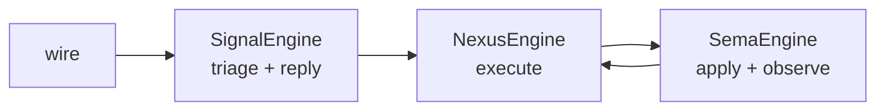

Five nodes. Signal → Nexus is one-way (Signal hands the typed Input
forward; never the other direction). Nexus → SEMA goes down for state
operations; Nexus → Signal goes up for replies. SEMA never calls back
up directly — it returns to Nexus which decides the reply shape.

### Pipeline shape (Spirit 1335)

Full request shape: Signal triage → Nexus execute → SEMA apply or
observe → Nexus receives the SEMA reply → Nexus translates → Signal
reply → wire. The Signal reply doesn't map 1:1 to the SEMA reply per
Spirit 1334; Nexus translates, filters, augments. The on_sent hook
fires when Signal hands mail to Nexus; the on_processed hook fires
when Nexus produces the output.

### Origin identifier protocol (Spirit 1336)

Rolling identifiers thread through the whole pipeline. Each layer
routes its responses back via the origin id. SEMA can use it to
associate partial multi-op replies. Per Spirit 1329, the origin route
is preserved across all six plane envelope hops (Signal in / Nexus in
/ SEMA in / SEMA out / Nexus out / Signal out).

### What this pattern is — and is not

- It IS the workspace-wide adaptation of the spirit-engine constraint:
  every component's runtime is a composition of these three trait
  impls attached to schema-emitted nouns.
- It IS a substrate for testability: each engine can be witnessed
  independently through trait-implementing recorder objects (see
  `skills/architectural-truth-tests.md` §"Schema-chain witnesses use
  schema objects").
- It is NOT a fixed implementation shape. Each trait method's body is
  hand-written domain logic; the trait surface is what's uniform.
  Trivial pilots have thin Nexus bodies; mature components have heavy
  Nexus bodies; the trait surface stays the same.
- It is NOT a fourth-plane substrate. Three planes only; no
  "validation engine," "queue engine," or "audit engine" trait
  proliferation. Concerns that look like they want a new engine
  usually fit inside Nexus's heavy logic.

### Lifecycle hooks on the engine traits

Per Spirit 1487 (Decision High, 2026-06-03): *"Generated Signal,
Nexus, and SEMA engine traits should carry minimal lifecycle
hooks: on_start and on_stop with typed start and stop failure
results. Full actor mailbox, backpressure, and runtime-control
traits stay deferred; lifecycle hooks are the minimum addressable
surface persona supervision can use."*

Each engine trait carries two lifecycle methods plus typed failure
types:

```rust
pub trait NexusEngine {
    fn on_start(&mut self) -> Result<(), ActorStartFailure> { Ok(()) }
    fn on_stop(&mut self) -> Result<(), ActorStopFailure> { Ok(()) }
    // ... existing execute / execute_inner / trace hooks ...
}
```

Default bodies are `Ok(())` so a component that has no setup or
teardown needs no override. Components that bind sockets, open
databases, register listeners, or otherwise hold start-time
resources override `on_start`; the failure type carries typed
reasons (port bound, database missing, dependency unreachable)
that persona supervision reads to decide retry / escalate / fail
the component start. `on_stop` is the corresponding teardown hook
with `ActorStopFailure` reasons (graceful-stop-timeout,
state-flush-failure, etc.).

Full actor mailbox + backpressure + runtime-control traits stay
deferred per Spirit 1483 (*"Workspace explicitly defers
backpressure handling, runtime control layer, inner Nexus engine,
actor scheduling/prioritization and related deeper-runtime work
… future-deeper-runtime that won't be touched for a while."*).
The two lifecycle hooks are the minimum supervision surface; if
the actor-trait promotion lands later, it composes as a
supertrait extension without breaking the engine-trait substrate.

Persona-system supervision binds the lifecycle hooks: a
`persona-system-daemon` brings components up via `on_start`,
takes them down via `on_stop`, and reads the typed failure
results to decide policy. Supervision is the first concrete
consumer of these hooks; future consumers (graceful-restart
orchestration, blue/green-style cutover) compose on the same
surface.

### Nexus mechanism substrate — NexusWork / NexusAction / Continue / effects

Per Spirit 1486 (Decision Maximum, 2026-06-03; substrate
ratification): *"NexusWork/NexusAction asymmetric pair + 5-variant
action set (ReplyToSignal, CommandSemaWrite, CommandSemaRead,
CommandEffect, Continue); macro-generated runner loop (triad_main!
emitted from schema-rust-next); effects per-component declared in
schema with Stash as first universal candidate; Continue as
in-process immediate recursion; cross-component invocation via
Signal contracts not Nexus-internal access."* This is the
workspace-canonical engine mechanism; the parts that hold best
move forward as intent develops.

**Implementation status (LANDED, 2026-06-06).** Both the substrate
and `triad_main!` itself are now realized in the spirit pilot. The
`NexusWork`/`NexusAction` asymmetric pair, the five actions,
`Continue` in-process recursion, and the recursive runner all exist —
and `triad_main!` is built and landed. It is **not a literal
`macro_rules!`** (the trailing `!` is intent shorthand): per Spirit
`lnhj` (Decision, *"triad_main is an EMITTED source-visible daemon
module"*) it is a `schema-rust-next` emitter that writes a
per-component, source-visible **`src/schema/daemon.rs`** — the uniform
daemon skeleton (`DaemonCommand`, the decode→execute→encode spine,
listener selection, and the option-B streaming publish/subscribe
wiring emitted from `Schema::streams()`). The component hand-writes
only a small `impl ComponentDaemon` (chiefly `build_runtime`) plus a
schema `NexusDaemonShape` declaration. spirit's daemon bin is now a
true one-liner — `fn main() -> ExitCode { SpiritDaemon::run_to_exit_code() }`
(`spirit/src/bin/spirit-daemon.rs`) — and the hand-written
`DaemonCommand`/`Daemon`/`SpiritDaemonRuntime` plus the entire
`SubscriptionHub` are deleted. Design + landing in designer reports
542/543; landed across `triad-runtime`, `schema-rust-next`, and
`spirit` main (operator session 328).

The Nexus trait surface in shape:

```rust
pub trait NexusEngine {
    fn execute(&mut self, input: NexusWork) -> NexusAction;
    // plus the trace and lifecycle hooks above
}

pub enum NexusAction {
    ReplyToSignal(Output),                // hand back to Signal for wire egress
    CommandSemaWrite(SemaWriteInput),     // mutate durable state
    CommandSemaRead(SemaReadInput),       // observe durable state
    CommandEffect(Effect),                // per-component declared effect (Stash, …)
    Continue(NexusWork),                  // re-enter Nexus.execute immediately, in-process
}
```

The runner loop — `triad-runtime`'s `Runner::drive`, reached from
the schema-emitted `NexusEngine::execute` default method (the
`triad_main!` entry point is the *emitted daemon module* of Spirit
`lnhj`, now landed per the status note above) — reads
NexusActions and dispatches:

- `ReplyToSignal` → hand to Signal's reply path → wire egress.
- `CommandSemaWrite` / `CommandSemaRead` → call SEMA's `apply` /
  `observe` → result becomes the next `NexusWork`.
- `CommandEffect` → call the component-declared effect handler →
  result becomes the next `NexusWork`.
- `Continue` → loop back into `Nexus.execute` immediately,
  in-process, on the same call stack.

Component code reaches a one-line `main` (the emitted
`Daemon::run_to_exit_code()` entry) because the runner is a shared
`triad-runtime` library reached from a schema-emitted `execute`
default, and the daemon skeleton around it is the emitted
`src/schema/daemon.rs` module; the component supplies only the trait
implementations for its data-bearing nouns plus its
`impl ComponentDaemon`. This is the concrete form of the
engine-baseline decision (Spirit `1488` / `lnhj`, Decision): *"Schema
source carries the triad engine mechanism as the baseline so schema
authors get the runner shape, trace plumbing, and continuation
substrate through generation; per-component variation should use
explicit escape hatches for real domain differences rather than
hand-implemented daemon preference."*

**Effects are per-component declared in schema.** `Stash` is the
first universal candidate (slim Nexus output via handle per Spirit
1389). Each component declares its effect vocabulary; the runner
dispatches via the schema-emitted effect handler trait.

**Cross-component invocation goes through Signal contracts, not
Nexus-internal access.** A component that needs to call another
component's Nexus does so by emitting a Signal request to that
component's wire endpoint — never by reaching into another
component's Nexus directly. This preserves the typed boundary,
the closed schema vocabulary per component, and the supervision
clean-edge.

**Deferred deeper-runtime work** per Spirit 1483: backpressure,
runtime control layer, inner Nexus engine, actor scheduling and
prioritization stay future-direction. Note (Spirit `zk6y`): the
deferral is of that *advanced machinery* only — **kameo adoption is
not deferred**. The engines are kameo actors now (bounded mailboxes,
`on_start`/`on_stop`, simple `OneForOne` supervision); the deferred
items are the backpressure/scheduling/runtime-control trait surface
layered on top. The earlier "until overload evidence appears in real
production load" trigger does not fit a pre-production world and is
not the gate for adopting actors.

### Instrumentation belongs to the engine-trait contract

Per Spirit 1365 (Correction Maximum, 2026-06-01): **traceability is
expressed as traits on schema-derived interfaces — and where
possible, as methods on the Signal/Nexus/SEMA engine traits
themselves — not as a hand-written or generated event enum living
beside the engines.** Instrumentation belongs to the interface/actor
contract, not to a local side vocabulary parallel to it.

The emitted shape: the engine traits carry default-no-op trace hook
methods (`trace_signal_admitted`, `trace_signal_triaged`,
`trace_signal_replied`, `trace_nexus_entered`, `trace_nexus_decided`,
`trace_sema_write_applied`, `trace_sema_read_observed`, and their
per-plane activation entry points). Implementors who want trace
override the hooks; non-trace consumers inherit the no-op default and
pay nothing. The trace surface is part of the trait, not a parallel
vocabulary the runtime carries alongside.

The canonical emission lives at `schema-rust-next/src/lib.rs`
(roughly lines 1825-1907): the schema emitter writes the trace
methods straight into the engine trait declarations. The
`testing-trace` Cargo feature (the runtime side of Spirit 1348's
build-config discipline above) gates whether overrides ship, but the
trait surface is uniform — feature-off implementors get the no-op
default; feature-on implementors override per-hook.

The earlier shape this corrects is the side-enum pattern: a
hand-written `TraceEvent` enum next to the engines, with a
`record_trace` call studded through the engine bodies. That shape
makes instrumentation a separate dialect of the engine; the
trait-method shape keeps instrumentation a first-class extension of
the engine's contract. Per Spirit 1365 the correction direction is
explicit — anywhere instrumentation tempts a side enum, push the
hooks onto the trait instead.

### Trace identity is schema-emitted, not stringly

Per Spirit 1400 (Decision High, 2026-06-02): **trace names are
macro-emitted from the schema-defined enum variant structure, not
free-floating strings.** The macro knows what is being activated
because it generated the variant; the trace surface reuses the
generated names rather than re-deriving them at the call site as
literals.

Per Spirit 1408 (Clarification High): the typed header object is
primary; compact numeric encodings and wider extended headers are
downstream representations of that typed identity.

The shape that landed (`schema-rust-next` commit `fa3f615` +
`spirit` commit `2179f49`): the emitter projects, from each
plane root enum's variants, a `<Plane>ObjectName` enum plus a
wrapping `TraceInterfaceObject` enum. The same emission produces
the `TraceActorObject` enum from per-plane actor variants. The
runtime trace event becomes a typed `TraceObject` (one of the
emitted plane objects), not a `String` newtype or a `&'static str`
literal. Implementors of the engine traits dispatch on the typed
identity rather than parsing a name.

Two trace forms are supported by the macro:

- **COMPACT** — root variant name only (`trace_input_remove`). The
  default for testing-build Layer 2 witnesses where the
  architectural-crossing claim is the substance.
- **EXTENDED** — nested variant chain through enum-typed payloads
  when the payload is itself an enum. The chain stops at the root
  variant when the payload is a struct. The macro has the
  enum-vs-struct information at compile time, so the form is chosen
  statically.

The 2-row interface chain is: row 1 = root variant; row 2 = payload
(struct-leaf, chain stops; or enum-continue, chain continues into
row 3 etc.). The trace name's structural depth measures interface
realism: a deeper chain reflects a richer typed contract. When the
chain bottoms out at a struct in row 2, the component's schema may
be under-developed — compare against §"Interface roots are enums
with more than one variant" below.

The transitional `TraceObjectName(String)` shape that the prototype
in designer 467 introduced retired with the typed-identity
emission. No `String` shadows of the typed identity persist at the
trace surface.

### Interface roots are enums with more than one variant

Per Spirit 1401 (Clarification High, 2026-06-02): **an interface is
an enum at the root with MORE THAN ONE variant.** If a designer
cannot name more than one operation the root represents, the design
is incomplete and not an interface. Single-variant enums prove
themselves newtypes in practice — the variant adds no discrimination
the type system needs.

Input and Output are the two primary interface roots; payloads are
themselves either structs (leaf data) or enums (nested interfaces).
The interface chain depth measures design realism — the row-1 root
plus row-2 payload pattern from the trace identity section above
applies to every interface.

Two consequences for the schema authoring loop:

- When sketching a schema source, ask **"can I name two operations
  on this root?"** If not, the design isn't done yet — keep
  developing until at least two meaningful variants land. Add
  Lookup + Count + Summarize beside Observe; add Subscribe beside
  the request/reply pair; promote the unit variant to its full
  data-bearing form.
- A one-variant root that survives review is a newtype wearing enum
  clothing. Replace it with the struct or scalar it actually is, and
  let the schema's namespace import the type directly.

Worked example: `SemaReadInput [(Observe Query)]` fails the rule —
that's an `Observe(Query)` newtype, not an interface. The expansion
to `SemaReadInput [(Observe Query) (Lookup RecordIdentifier) (Count
Query) (Summarize Query)]` (four variants) makes it a real
interface and gives Nexus a real per-variant decision surface.

Per psyche 2026-06-02 (Spirit 1395 introduced the developed-
interface direction; 1401 formalizes the multi-variant threshold).

### Nexus's inner-world / outer-world vocabulary

Per Spirit 1388 (Clarification, 2026-06-01): **Nexus sits between
two worlds** — the OUTER world (Signal — clients, wire ingress and
egress, the boundary across processes) and the INNER world (SEMA —
durable state mutations and observations). Nexus is the center that
decides; Signal and SEMA are its peripheries.

The vocabulary makes architectural roles explicit. Signal owns the
outer boundary: messages crossing process lines, wire framing,
identity stamping, frame triage. SEMA owns the inner boundary: redb
writes, observation against durable snapshots, the database marker.
Nexus owns the in-between: it receives the typed Input from Signal,
runs the decision logic, requests SEMA work, receives the SEMA
reply, and translates the result back through Signal to the outer
wire.

The shape rhymes with the object-oriented insight of interfaces
first — Nexus is the center holding the interface contract that the
two boundary planes (Signal and SEMA) terminate. Consistent with
the engine-trait architecture above (Spirit 1326-1336) and with the
origin-route threading through the full Signal-Nexus-SEMA pipeline
(Spirit 1336): Nexus is the place the origin route lives long enough
for partial multi-op replies to associate back.

The canonical worked example today is `spirit`: NexusEngine and
SemaEngine are schema-emitted; SignalEngine implementation lives in
the runtime substrate. Per `spirit/ARCHITECTURE.md` §"Runtime
triad" the full pipeline shape and per-engine borrow rules are
documented in code-adjacent prose. The pattern's broader workspace
adoption is part of the porting waves named in the designer-operator
loop.


## Contract repos

*The wire contract between Rust components lives in a dedicated
repo of typed records, not duplicated across consumer crates.
Every component on the same fabric depends on the same contract
crate; rkyv archives produced by one are readable by every
other.*

## What this skill is for

When two or more Rust components need to **signal** each other
over a wire — a Unix socket, TCP, message bus, named pipe,
mmap region — the record types they exchange live in a
**contract repo**: one crate, one home, every consumer pulls
it as a dependency. This skill is *when* you reach for that
pattern, *what* belongs in the contract crate, and *how* it
relates to layered protocols and human-facing NOTA projections.

**Signaling** is the workspace verb for inter-component
communication via length-prefixed rkyv archives. A contract
repo is the typed vocabulary of one signaling fabric — the
shared `Frame`, the closed enum of payloads, the handshake,
and any identity/origin/auth context that genuinely crosses
that boundary. Components that signal each other depend on
the same contract repo.

The principle is `~/primary/ESSENCE.md` §"Perfect specificity at
boundaries" applied across processes. The Rust enforcement
sits on top of `~/primary/skills/rust/storage-and-wire.md` —
that skill defines the rules; this one names how the contract
is *organised* in repos.

The canonical workspace example is **signal**
(`~/primary/repos/signal`) — the wire-protocol crate of the
sema-ecosystem, and the namesake of the pattern. Read its
`ARCHITECTURE.md` once before designing a new contract repo;
the shape is concrete there.

## Why a contract repo exists

rkyv archives interoperate **only** when both ends compile
against the same types with the same feature set. Three
consequences make a shared crate the right home:

- **Schema agreement.** A `Frame` defined in one component and
  redefined in another is two types — the bytes don't round-
  trip even if the field lists look identical. The contract
  crate is the single definition.
- **Derive sharing.** Wire-format derives (rkyv's
  `Archive`/`Serialize`/`Deserialize`, `bytecheck`), text-
  format derives (`NotaEnum` / `NotaRecord` / `NotaTransparent`
  from `nota-codec`), and any project-specific derives all
  live with the type. The contract crate owns both the wire
  shape and the text shape on the same types; consumers do
  not carry shadow types that re-derive across layers.
  Re-deriving in each consumer is dead code at best, drift
  at worst.
- **Layered stability.** When a layered effect crate adds
  operation payloads (e.g. signal-forge over signal), front-end
  clients that depend only on the base contract don't recompile
  on layered-crate churn. The isolation is at the *layered*
  effect-crate boundary, not at the wire/text-derive boundary
  on the base contract itself.

A workspace pattern that doesn't follow this:
- types defined in component A, copy-pasted into component B,
- two components own "the same" wire format,
- bytes silently drift on schema changes.

This is exactly the class of bug rkyv's strict layout makes
invisible (no parse error, just wrong values).

## What goes in a contract repo

```
contract-repo/
├── src/
│   ├── lib.rs        — module entry + re-exports
│   ├── frame.rs      — Frame envelope, encode/decode, error type
│   ├── handshake.rs  — ProtocolVersion + handshake exchange
│   ├── origin.rs     — origin/auth context records (only when the boundary carries them; many local-engine contracts omit this entirely)
│   ├── request.rs    — Request enum (closed; per-operation dispatch)
│   ├── reply.rs      — Reply enum (closed; matches request kinds)
│   ├── <operation>.rs — per-operation typed payloads
│   ├── <kind>.rs     — domain record kinds + paired *Query types
│   └── error.rs      — crate Error enum (thiserror)
├── tests/            — round-trip per record kind, per operation
├── Cargo.toml        — pinned rkyv feature set, versioned
└── ARCHITECTURE.md   — what's owned, what's not, schema discipline
```

The contract crate **owns**:

- The `Frame` envelope and its `encode` / `decode` methods.
- Length-prefix framing rule (4-byte big-endian per archive).
- Handshake + protocol version + compatibility rule
  (major-exact / minor-forward, or whatever the project picks).
- Origin/auth context records only when the boundary carries
  identity, provenance, capability, or signature material.
  Do not create a proof type just because the template has a
  slot for one.
- The closed enum of request kinds + paired reply kinds.
- Per-operation typed payloads (closed enums of typed kinds — no
  generic record wrapper, no `Unknown` variant).
- The version-skew guard's known-slot record (schema +
  wire-format version).
- A complete round-trip test per record kind (rkyv frame
  round-trip *and* NOTA text round-trip, both witnessed in
  `tests/`).
- `NotaEnum` / `NotaRecord` / `NotaTransparent` derives on
  the typed records, so contract values are NOTA-encodable
  directly. The same type IS the wire record AND IS the text
  record; consumers consume it once.
- Reserved record heads stay reserved workspace-wide. No
  domain type defines a record kind named `Bind` or
  `Wildcard`; those heads belong to
  `signal_core::PatternField<T>` dispatch.

It **does not own**:

- Daemon code. No actors, no runtime, no `tokio`.
- Component-internal state at the **runtime** level — each
  daemon's redb tables, its reducer state, its supervisor
  tree are private. Reducers, write paths, transaction
  boundaries, and the actual `Database::open` call stay
  inside the daemon.
- Logic that interprets the records. Validation pipelines,
  routing rules, gate decisions stay in the daemons.
- NOTA projection *policy* and *surfaces*. The contract owns
  text codec on its types (per "What it owns" above) — every
  contract value is NOTA-encodable directly. The contract does
  not own *where* NOTA renders (which CLI prints it, which
  daemon endpoint accepts it, which audit format wraps it) or
  the composition of Nexus wrapper records for a particular
  human-facing form. Projection policy lives in the boundary
  component.
- Configuration. `Cargo.toml`, `flake.nix`, deployment.
- `serde`. Contract types may *also* derive serde for debug
  rendering, but the contract is rkyv-on-the-wire.

It **may own**:

- **Typed introspection record shapes for durable
  inspectable state.** A contract crate may declare the typed
  record shape of a redb-stored value so peer components and
  `persona-introspect` can name what's inspectable. The
  contract owns the *vocabulary* of inspectable state; the
  component still owns the database, the reducers, the
  consistency model, and the projection policy (which
  fields are exposed, how snapshots are taken, redaction
  rules). Operational records (those that cross a live
  boundary) stay in their existing operational contract;
  introspection-only records may land in a dedicated
  `signal-persona-<X>-introspect` crate when the
  inspection vocabulary is heavy or high-churn enough to
  separate from the operational surface.

## Contracts name a component's wire surface

A contract repo is the typed-vocabulary bucket for **one
component's wire surface**. Multiple relations within one
component's contract are fine — a harness component speaks
delivery-from-router, identity-query-from-anyone,
transcript-tail-to-subscribers, lifecycle-observation-to-
mind, all in one signal-persona-harness crate. The
component is the unit of contract ownership; relations
within it co-evolve and share the typed records they touch.

What a contract crate is **not** is a workspace-wide grab
bag mixing vocabularies from unrelated components. A crate
that wants to hold both signal-persona-mind records and
signal-persona-router records has stopped being a contract
and started being a shared utilities crate; split it.

Each relation within a contract crate is still named
explicitly — name the relations in `ARCHITECTURE.md` so
readers can find them, and split source modules by
relation when the file count justifies it (e.g.
`src/delivery.rs`, `src/identity.rs`, `src/transcript.rs`).

For each relation a contract carries, name it in plain
English:

1. **Endpoints.** Who can send, who can receive, and who is
   only observing?
2. **Cardinality.** Is the relation one-to-one, many-to-one,
   one-to-many, or many-to-many?
3. **Direction.** Which facts are requests, replies, events,
   observations, subscriptions, assertions, mutations, or
   retractions?
4. **Authority.** Which side mints identity, time, slots,
   revisions, and sender fields? Those must not be agent-
   supplied fields.
5. **Lifecycle vectors.** What can happen at the root of the
   relation: submitted, accepted, rejected, assigned,
   unassigned, closed, expired, cancelled, observed?

Each named relation within a contract crate has its own
closed root enum (or closed request/reply/event family)
naming that relation's vectors. A `Request`, `Reply`, or
`Event` variant is not "whatever payload fits today"; it is
one mutually-exclusive way the relationship can move. A
multi-relation contract crate (one component, multiple
relations) has one root family per relation, not one
crate-wide enum. If the root variants are wrong, every
consumer is forced to program with the wrong model.

Naming is therefore load-bearing architecture:

- Prefer domain nouns for payload records. A `Submit` operation
  can carry a `Message`; a `Configure` operation can carry a
  `Configuration`; a `Register` operation can carry a
  `Registration`.
- Contract operation roots are verbs, in verb form. `Submit`,
  `Query`, `Observe`, `Configure`, `Register`, `Retire`, `Start`,
  and `Stop` name what the caller is doing at this boundary.
  Do not force those public actions under Sema state-effect
  words such as `Assert` or `Match`.
- Do not repeat namespace already supplied by the crate,
  module, channel, relation, owning component, or enclosing
  enum. This is a hard naming rule, not a style preference.
  A `signal-repository-ledger` payload named
  `RepositoryChangedFileQuery` is wrong because the repository
  ledger context is already supplied by the contract; the name
  should be `ChangedFileQuery`. `signal_persona_message::
  MessageRequest::MessageSubmission` may need `Message`
  because the relation is message-shaped; `PersonaMessage`
  repeats the crate/component namespace.
- Do not fix under-specified names by adding generic suffixes.
  `Data`, `Payload`, `Info`, `Operation`, `Generic`, `Mixed`,
  `Ok`, and `ThingRequest` are warning signs unless the
  surrounding relation makes them exact.
- A variant and its payload may share the same domain noun
  when that noun is the exact vector. That is better than
  shortening the variant until it becomes vague. If the
  phrase stutters, split the meaning: root variant names the
  vector; payload type names the record carried by that
  vector.
- Field names inherit context from their containing record.
  Keep fields short when the record supplies the noun, but
  newtype the wire form when the primitive alone is too weak
  (`WirePath`, `TaskToken`, `TimestampNanos`, `QueryLimit`).
- Never encode lifecycle uncertainty as `Unknown` or a string
  kind. Add the missing relation vector as a closed enum
  variant, then coordinate the upgrade.

Run the naming pass in this order:

1. Read the repo's `ARCHITECTURE.md` and write the relation
   sentence.
2. List every top-level enum and decide whether each enum is
   the root vector set, a payload kind set, a lifecycle state,
   an error reason, or an identity reference.
3. Audit root variants first. They set the domain grammar that
   all payload names must fit.
4. Audit payload structs and nested enums second.
5. Audit field names and primitive wrappers third.
6. Read examples and call sites last. If the code reads like
   the wrong relationship, rename the contract before writing
   more consumers.

For a new contract repo or a large rename, make the naming
review an explicit work item. Contract names are harder to
escape than architecture prose: once consumers compile
against them, the names become the system's enforced model.

## Public contracts use contract-local operation verbs

Signal carries typed contract messages across component
boundaries. Sema names the universal state-action classes used
for observation and introspection. Executable database commands
are component-local typed records owned by each daemon.

A contract crate names the public actions that can cross one
component boundary. Those public actions are **contract-local
operation verbs**: they describe what the caller is doing in
that component's domain, not what the receiver may later do to
its state.

> **Current direction, per psyche 2026-05-20:** the
> universal roots (`Assert`, `Mutate`, `Retract`, `Match`,
> `Subscribe`, `Validate`) are the **Sema classification
> vocabulary** for observation — they are *payloadless* state-
> action class labels, not executable. Executable database work
> happens via **component-local typed Commands** owned by each
> daemon. Contract operations are domain-named (`Submit`, `Query`,
> `Observe`, `Configure`, etc.); the daemon lowers them into
> typed Commands; Commands project to Sema class labels for
> observation. Sema is the cross-component nervous system at
> the classification layer, not a universal executable database
> DSL.

The three layers:

```text
Contract operations  (external — what crosses the wire)
  public per-contract verbs such as Submit, Query, Observe,
  Configure, Register, Retire, State, Watch.
  Owned by signal-* contract crates.

Component commands  (internal — what the daemon executes)
  per-component typed executable records such as
  SpiritCommand::AssertEntry(Entry),
  LedgerCommand::RecordEvent(EventRecord),
  LedgerCommand::ReadRecentRepositories(ReadPlan).
  Owned by each daemon; carry the typed payloads engines need.

Sema operations  (cross-component classification — what
                  observation/introspection sees)
  payloadless state-action class labels:
  Assert | Mutate | Retract | Match | Subscribe | Validate.
  Used only for cross-component observation and introspection;
  never for execution.
```

Each Component Command projects to a Sema class via a
`ToSemaOperation` trait. The engine layer is a reusable
framework parameterized over the component's Command type —
atomic boundaries, snapshots, redb transaction handling are
common; the Command vocabulary is component-local.

The client sends what it wants to do at that boundary:

```nota
(Submit (Message ...))
(Query (RecentRepositories ...))
(Configure (DaemonConfiguration ...))
(State (Quote ...))
```

The daemon decides whether that public action lowers to no
Sema effects, one effect, many effects, a forwarded request,
or a rejection.

### Operation naming rule

**The operation root is a verb, in verb form.** Use `Submit`,
not `Submission`; `Query`, not `QueryRequest`; `Observe`, not
`Observation`; `Configure`, not `Configuration`; `State`, not
`Statement`.

The payload that follows the operation is usually a noun:

```nota
(Submit (Message ...))
(Register (Registration ...))
(Configure (Configuration ...))
```

Same verb spelling across contracts is allowed. The receiver
context supplies the meaning. `Observe` in a repository ledger
contract and `Observe` in a Spirit contract are not required to
mean the same thing beyond "caller asks this receiver to
observe something in its domain."

### What moved below the public contract

The Sema operation vocabulary is still real, but it is not the
public grammar of every component:

| Sema operation | Layer meaning |
|---|---|
| `Assert` | insert/append a typed fact/event/row |
| `Mutate` | transition a record at stable identity |
| `Retract` | tombstone/remove/retract a typed fact |
| `Match` | pattern/range/key read over typed tables |
| `Subscribe` | state-plus-delta stream over typed tables |
| `Validate` | dry-run validation/planning without commit |

These words belong in the Sema engine layer and in any explicit
Sema-facing contract (signal-sema itself, or a deliberately
Sema-facing socket that IS the public service offered) — never on
an ordinary component's public wire. Per psyche 2026-06-04 (record
2612): **Sema classification vocabulary is forbidden on the public
contract wire.** The six words must not appear as request-root
tags, a contract must not mirror them as an `AuthorizedSignalVerb`
enum, and a contract event must not carry the payloadless
`SemaObservation` label. Contract operation roots are domain verbs;
the Sema class is something the daemon derives internally, never
something a peer sends or names on the wire. The earlier soft
"most component contracts should not" is retired in favour of this
firm prohibition — the six legacy contracts that still carry the
pattern (signal-mind, signal-router, signal-criome,
owner-signal-persona, signal-persona-spirit, signal-orchestrate)
are a cleanup track, not a tolerated convention.

### Lowering is daemon logic

Each daemon is the lowering boundary:

```text
public contract operation
  -> validation / routing / authorization
  -> Sema operation plan when durable state changes or reads are needed
  -> commit / reply / event
```

That lowering belongs in the runtime component, not in the
contract crate. The contract may define typed records that make
lowering inspectable, but it does not own reducers,
authorization, routing, transaction boundaries, or table
execution.

Static lowering examples:

```text
Query RecentRepositories -> Sema Match over repository indexes
Watch Entries            -> Sema Subscribe over entry tables
```

Dynamic lowering examples:

```text
Submit Message
  -> reject without write
  -> assert ingress event
  -> mutate delivery state
  -> forward to router

State Quote
  -> record raw psyche statement
  -> update working view
  -> enqueue mind suggestion
```

### Tests for contract-local verbs

Contract tests assert the public grammar:

- every operation root is a domain verb in verb form;
- no public contract operation wraps payloads in mandatory
  Sema roots unless the contract is explicitly Sema-facing;
- examples round-trip in NOTA and rkyv using the same typed
  records;
- repeated suffixes such as `*Query`, `*Command`, `*Event`,
  and `*Listing` are checked as schema smells before the type
  shape is accepted;
- when a daemon publishes lowering witnesses, those witnesses
  prove the runtime mapping from public operation to Sema plan.

Examples of stale shapes to avoid:

```nota
(Assert (Message ...))
(Match (Query ...))
(Mutate (Configure ...))
```

Better public shapes:

```nota
(Submit (Message ...))
(Query (...))
(Configure (...))
```

### Reply discipline

**Reply success variants are verb-past-tense matching the
operation root.** `Submit` → `Submitted`; `Register` →
`Registered`; `Launch` → `Launched`; `Retire` → `Retired`;
`Query` → `Queried` or `Observed` (the action's outcome,
verb-past-tense).

**Reply rejection variants are verb-past-tense + `Rejected`.**
`Submit` → `SubmitRejected`; `Register` → `RegisterRejected`.
Domain-level rejection reasons are payload variants of the
`*Rejected` reply (typed enum named e.g. `SubmitRejectionReason`).

**When the verb-past-tense collides with a noun derived from the
verb,** fall through to the next-best past-tense that names what
the daemon actually did after receiving the operation.
`Announce` → `Announcement` (noun collision; "Announced" would
be ambiguous with the noun) → use `Identified` (the daemon
identified the announcer; concrete past-tense outcome).

**Lifecycle-shaped verbs (`Start` / `Stop` / `Drain` / pairs of
them) may share a single `Action*` pair** when the daemon's
response shape is uniform across them:
`ActionAccepted(ActionAcceptance)` /
`ActionRejected(ActionRejection)`. This is the signal-persona
precedent — both `Start` and `Stop` use the same pair because
the reply contract doesn't vary by which lifecycle verb fired.

Replies are causally tied to the request operation they answer.
If a "reply" becomes an independent observation or event that
can travel without a request, model it as an event/stream record
in the contract. Do not hide independent event traffic inside a
reply enum just because it was convenient for the first test.

**Event variant naming follows the same verb-past-tense rule.**
A `RecordStream` emitting `RecordCaptured` events reads as
"the record was captured"; a `StateStream` emitting `StateChanged`
reads as "the state changed." Past-tense outcome describing what
happened, not what was requested.

### See also

- `~/primary/reports/designer-assistant/125-v2-contract-local-verbs-vs-sema-core-verbs.md`
  — analysis behind the contract-local-verb / Sema split.
- `/git/github.com/LiGoldragon/signal-core/ARCHITECTURE.md`
  — currently in transition; frame/exchange mechanics should
  survive the split.
- `/git/github.com/LiGoldragon/sema-engine/ARCHITECTURE.md`
  — Sema execution vocabulary and read plans.

## The layered pattern

When a wire protocol has audience-scoped concerns — operation
families that only a subset of components care about — those
operations land in a **layered effect crate**, not in the base
contract:

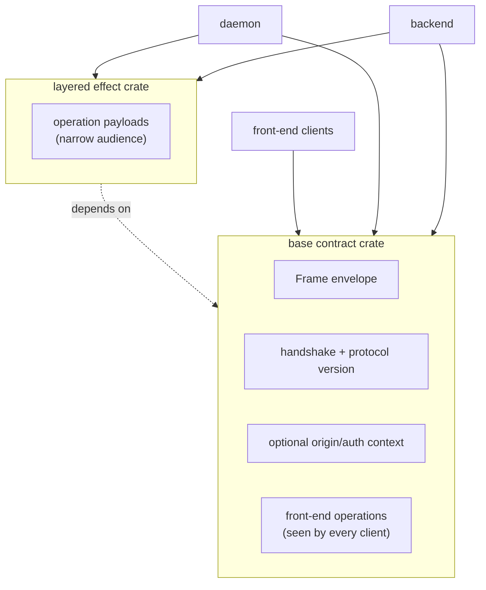

The pattern (signal-forge over signal is the canonical
example): the layered crate **re-uses** the base contract's
`Frame`, handshake, and any boundary origin/auth context, and
**adds** its own operation payload enum. New layered operations
land in the layered crate; front-end clients that depend only on
the base contract don't recompile.

Use a layered crate when:

- The operations have a narrow audience (sender + receiver +
  maybe one transitional caller, not "every client").
- The base contract would otherwise grow to absorb effect-
  specific concerns that don't belong on the front-end
  surface.
- Recompile cost across the front-end surface is real (signal
  has many front-end clients; recompile churn matters).

Don't pre-layer. A second contract crate's layered shape
becomes obvious after one effect-bearing leg is real and a
second is being added.

## Versioning is the wire

The contract crate's semver **is** the wire's semver:

- A bumped major means breaking layout or breaking semantics.
  Every consumer upgrades together. Coordinated upgrade.
- A bumped minor means a backward-compatible addition (new
  variant in a forward-tolerant enum, new optional field).
  Forward-compatible enums must be marked open in their
  decoding strategy; closed enums never accept minor
  additions.
- A bumped patch is documentation, tests, internal cleanup.
  No layout change, no semantic change.

Pin the contract crate version in every consumer's
`Cargo.toml`. Don't `git = "..."` against `main` for
production wire — `main` moves under your feet. Use a tag
or a version-pinned crates.io release.

The **version-skew guard** is part of the wire: a known-slot
record at the canonical key carrying `(schema_version,
wire_version)`, checked at boot. Hard-fail on mismatch. The
guard runs *before* the daemon starts handling traffic; a
mismatch is a coordinated-upgrade signal, not a runtime
error to recover from.

## How NOTA fits

NOTA is the project's only text syntax. Nexus is a NOTA-using
request/message surface, not a second syntax. In practice,
request/message text usually means Nexus records written in NOTA
syntax; configs and convenience CLIs may use direct NOTA records.

The contract crate owns both the wire form (rkyv) and the text
form (NOTA) of its typed records — the same type IS the wire
record AND IS the text record. Consumers do not carry shadow
types that re-derive text projection. Round-trip witnesses for
both forms live in the contract crate's `tests/`.

NOTA is **not the inter-component wire**. Component-to-component
traffic uses rkyv frames, not NOTA text. NOTA *renders* at
surfaces that touch a human or a log:

| Boundary | Format |
|---|---|
| Component ↔ component (Rust ↔ Rust) | contract-crate types via rkyv frames |
| CLI text edge | NOTA on argv/stdin (human types it), often through a convenience CLI that constructs the Nexus wrapper before encoding the daemon's binary frame |
| Daemon startup / daemon ↔ daemon | pre-generated signal/rkyv startup messages and contract-crate types via rkyv frames; daemon never parses NOTA text |
| Harness terminal adapter edge | Adapter projects a typed record to user-facing text before write |
| Audit logs / debug dumps | NOTA projection of typed records |

The CLI, the router, and text/terminal adapters are the parts of the
system that *render* NOTA text on a surface. They use the contract
crate's NOTA derives to produce the text; they do not re-derive text
projection of their own. Everywhere else, components hold typed records
(in memory) or rkyv archives (on disk and on
the wire).

If a contract repo's architecture says it owns the *human-facing
surface* — argv parsing, audit-log formatting, terminal-prompt
composition — narrow it. The contract owns the *codec* on its
types (wire AND text); the boundary component owns the *surface*
(which CLI prints, which daemon endpoint accepts, which audit
format wraps). The codec is the contract's; the surface is the
boundary's. Put the codec round-trip witnesses in the contract
crate (both rkyv and NOTA); put the surface witnesses in the
boundary component.

## When to introduce a contract repo

Indicators the moment is now, not "later":

- A second component is about to read or write the same wire
  bytes. Two components ⇒ contract crate.
- The first component had its types in a private module. As
  soon as the second component needs them, hoist to a
  contract repo.
- A schema change is being planned and the change needs to
  land in two crates simultaneously. The pain is the signal.

Indicators the moment is **not yet**:

- One daemon, no clients, no other component reads its bytes.
  Keep the types private until a second consumer appears.
- Prototyping a serialization shape; the format will change
  three times this week. Stabilise first, hoist after.

The cost of premature hoisting is a contract repo with one
consumer — fine, low overhead. The cost of late hoisting is a
silent schema-drift bug that survives review because both
copies of the type *look* the same. Err early.

## Kernel extraction trigger

A contract repo grows in two distinct ways:
- **Domain growth:** new record kinds, new typed payloads,
  new query shapes — all within the original audience.
- **Audience growth:** a *second* domain wants to speak the
  same wire conventions. The first domain's repo now carries
  both the shared kernel (Frame, handshake, optional
  origin/auth context, version, frame mechanics) *and* its own
  record kinds.

The audience case triggers extraction. **When two or more
domains share the kernel, extract the kernel into its own
crate** so neither domain's records contaminate the other's
namespace.

The trigger:

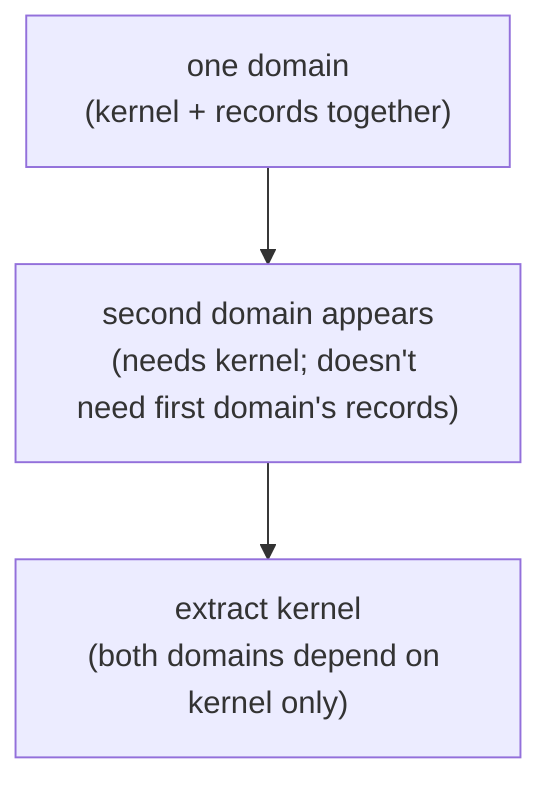

Concrete: `signal` originally held both the sema-ecosystem's
kernel (Frame, handshake, early shared operation vocabulary) and
Criome's record kinds (Node, Edge, Graph). When a second domain
(`signal-persona`) needed the same kernel, leaving everything
in `signal` would have forced `signal-persona` to depend on
a Criome-flavored crate — exactly the boundary confusion
this skill exists to prevent.

The extraction:
- New crate (`signal-core`, or whatever the project calls it)
  holds Frame, handshake, version, exchange mechanics, stream
  mechanics, and only the
  origin/auth context records that are truly shared by every
  domain using that kernel.
- The original crate (`signal`) becomes the first domain's
  *vocabulary* over the kernel — Criome's records, Criome's
  operation payloads.
- The new domain (`signal-persona`) is also a *vocabulary*
  over the kernel — Persona's records, Persona's operation
  payloads.

After extraction, both domains depend only on the kernel,
not on each other. New domains can join the family without
naming-confusion.

**When NOT to extract early:** with a single domain, the
kernel-and-records-together shape is fine. Don't pre-extract
"in case" a second domain shows up. The cost of a one-domain
contract crate is zero; the cost of a kernel crate with no
second consumer is one extra artifact to maintain. Wait for
the second domain.

The signal-forge / signal-arca pattern (per the layered-
effect-crate section above) is *complementary* to kernel
extraction: a layered crate adds operation payloads for a
narrow audience, but it depends on the same kernel as the
base contract. After extraction, signal-forge depends on the
kernel directly *plus* the base contract for record kinds it
references.

## Examples-first round-trip discipline

Every record kind in a contract repo lands as **a concrete
text example + a round-trip test** before its Rust definition
is final.

The order of work:

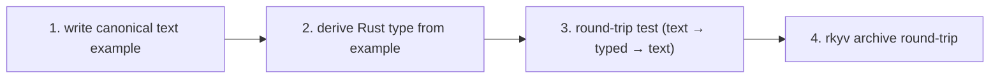

The discipline:

1. **Write the canonical text example.** Before defining the
   Rust struct, write what the record looks like in nexus
   text. The example exercises the field positions, the
   typed enum variants, the optional fields. If the example
   is awkward, the type is wrong — fix the type before
   coding.
2. **Derive the Rust type from the example.** The Rust
   struct's field order matches the text example's positional
   order. The closed enum's variant set matches what the
   example positions can hold. The PatternField fields
   match the positions where binds and wildcards appear.
3. **Round-trip test as the first test.** The first test
   ever written for a new record kind is `text → typed →
   text` and asserts equality. If the round-trip doesn't
   close, the codec or the type definition has a bug.
4. **rkyv archive round-trip as the second test.** The
   record encodes to rkyv bytes, decodes back, and equals
   the original. Per-feature-set parity (per
   `~/primary/repos/lore/rust/rkyv.md`) is checked
   independently.

Why this order:
- The text example is the **falsifiable specification.** A
  Rust definition without an example is unverified
  guesswork.
- The round-trip test catches encoder/decoder asymmetry
  immediately.
- A new agent can read the example file before reading any
  Rust source and know what the record kind is *for*.

In contract crate practice, this means each record kind ships
with:
- An entry in the canonical examples file (one canonical text
  form per kind).
- A test in `tests/<kind>.rs` exercising round-trip in both
  directions.
- The Rust definition in `src/<kind>.rs`.

If the example file is empty, the contract crate is
incomplete — even if all the Rust definitions compile.

## Naming a contract repo

The contract crate is the *protocol the components speak*.
The naming hierarchy reflects the relationship to `signal`:

### `signal-<consumer>` — layered effect crate (the prefix form)

When the contract is **layered atop `signal`** — re-uses
signal's `Frame`, handshake, and shared boundary context,
adds operation payloads for a narrower audience — the canonical name is
**`signal-<consumer>`**:

- `signal-forge` — criome ↔ forge effect operations
- `signal-arca` — writers ↔ arca-daemon effect operations
- `signal-persona` — Persona's wire, layered atop signal

Same shape signal/criome already established. The prefix
order (`signal-` first, consumer name second) is read as
*"this is signal, scoped to consumer."* Front-end clients
that depend only on `signal` don't recompile when a layered
crate churns.

### `<project>-signal` — independent base contract (the suffix form)

When the project's wire is **its own base contract** — owns
its own `Frame`, handshake, and boundary context — the name is
**`<project>-signal`**:

- `signal` — the base contract of the sema-ecosystem (named
  without prefix because it IS the base)

Use this only when the project is genuinely a separate
signaling fabric with its own envelope and boundary-context shape.
Almost always, what feels like "a new ecosystem" is
better modelled as a layered crate atop signal.

### `<project>-protocol` / `<project>-contract` / `<project>-wire`

When the project deliberately uses a **different wire shape
than signal-family** — different framing, different envelope,
no convergence intended — name it `<project>-protocol`,
`<project>-contract`, or `<project>-wire`. These are escape-
hatch names for projects that explicitly aren't part of the
signal family.

### Choosing

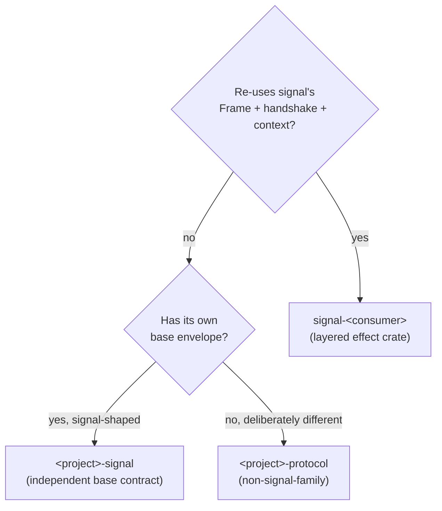

The default is `signal-<consumer>` — the layered shape is
how the workspace's signaling fabric grows.

Don't pick names that name the consumer's *internals*
(`<project>-types`, `<project>-shared`). The repo isn't a
bag of utilities — it is the spoken protocol.

## Common mistakes

| Mistake | What it looks like | Fix |
|---|---|---|
| Types redefined per consumer | Each daemon has its own `Frame` struct with the same fields | One contract crate; every consumer depends on it |
| `serde_json` between Rust components | "We'll switch to rkyv later" | rkyv from the start; if iterating fast, prototype with rkyv too |
| `path = "../contract"` in `Cargo.toml` | Local sibling reference | `git = "..."` with a tag, or a published crates.io version. Cross-crate `path = "../sibling"` is forbidden per ESSENCE §"Micro-components" |
| Contract crate carries logic | Validation, routing, or reducer code in the contract | Move logic to the daemon; contract holds types only |
| Contract crate has a runtime dependency | tokio, kameo, nix system bindings | Contract crate depends only on rkyv + thiserror + (optionally) the project's derive crate |
| New wire operation added to the base contract because it was easy | Front-end clients now recompile on every effect-side change | Add a layered effect crate; base stays stable |
| No `ARCHITECTURE.md` in the contract repo | Schema discipline is unwritten | Every contract repo carries `ARCHITECTURE.md` per `~/primary/lore/AGENTS.md`; schema discipline is the load-bearing part |
| Open enum where closed was meant | Adding `Unknown` variant "for forward compatibility" | Closed enum + coordinated upgrade. The `Unknown` is a polling-shaped escape hatch |
| Boundary unnamed | The repo is described only as "shared types" or "messages," with no named endpoints, direction, authority, lifecycle vectors, or owning component | Name what crosses the boundary: which component/endpoint, which direction, which authority mints what, which lifecycle vectors are open. Sharing types is fine; failing to name what they speak is the bug. |
| Root variants underspecified | `Ok`, `Generic`, `Mixed`, `Data`, or `Submit` where several things can be submitted | Name the vector exactly, or move the generic word under a more precise enclosing enum |
| Namespace repeated as a prefix | `PersonaMessage`, `SignalPersonaRequest`, `HarnessHarnessEvent`, `RepositoryChangedFileQuery` inside `signal-repository-ledger` | Let crate/module/channel/enum context carry the namespace; keep the type name on the domain thing |

## See also

- `~/primary/ESSENCE.md` §"Perfect specificity at boundaries"
  — the principle the contract repo encodes.
- `~/primary/skills/rust/storage-and-wire.md` — the
  Rust-specific rules for the binary contract; this skill
  organises those types into repos.
- `~/primary/skills/micro-components.md` — every component is
  its own repo; the contract crate is the typed protocol
  between them.
- `~/primary/skills/push-not-pull.md` §"Subscription
  contract" — the producer contract for push primitives;
  contract crates own the subscription frame types.
- `~/primary/repos/signal/ARCHITECTURE.md` — the canonical
  worked example.
- `~/primary/repos/signal-forge/ARCHITECTURE.md` — the
  canonical layered effect crate.
- `~/primary/repos/lore/rust/rkyv.md` — the tool reference
  (cargo features, derive aliases, encode/decode API).
- `~/primary/repos/lore/rust/style.md` — Cargo.toml
  conventions, cross-crate dependencies, pin strategy.


## Micro-components

*Components small enough that the whole component fits in a single
LLM context window. The boundary is filesystem-enforced; nothing
else holds.*

## What this skill is for

When you reach for a new feature, this skill decides where it
lands. The default is **a new repo**, not a new module in an
existing crate. The cost (a `Cargo.toml`, a `flake.nix`, a few
minutes of plumbing) is paid once; the cost of bundling is months
or years of future-friction.

Apply this skill at the moment of "should I add this here, or
start a new crate?" — that's where bundling decay begins, and
where this rule has the most leverage.

## The shape

Every functional capability — state engine, code emitter, executor,
store, parser, schema, transport — lives in its own independent
repository with its own `Cargo.toml`, `flake.nix`, and test suite.
Components communicate only through typed protocols, never shared
mutable state. Each component is sized so that the *entire
component, including tests*, fits comfortably in a single LLM
context window.

The discipline is **source-organization, not deployment**:
components may compile into one binary, many binaries, or talk
over a network. The workspace is the assemblage; no individual
component knows about more than its protocol-typed neighbors.

This doctrine is the only known antidote to the failure mode it
closes: **agents and humans bundling new features into existing
crates** until the result is a monolith no one — including the
language model assisting them — can hold in mind.

## The rule

1. **One capability, one crate, one repo.** If you can name the
   new functionality with a noun, it gets its own `Cargo.toml`
   and its own git history — never a new `mod` in an existing
   crate.

2. **A component must fit in a single LLM context window.**
   Roughly: a crate of ~3k–10k lines (~30k–80k tokens including
   tests) can be reasoned about end-to-end. Above that ceiling,
   split. This is not aesthetic — it is the operational gate
   for AI-assisted editing.

3. **Components communicate only through typed protocols.** No
   shared mutable state, no leaked internals via `pub use`, no
   cross-crate `unsafe`. The protocol *is* the contract; the
   type-checker enforces it.

4. **Every component is independently buildable, testable, and
   replaceable.** `cargo build` and `nix flake check` must
   succeed inside the component's own repo with no
   workspace-level helpers. If they don't, the boundary is a
   fiction.

5. **Depend on protocols, not implementations.** A consumer
   crate names the trait/schema crate, never the engine crate.
   This is what makes a component swappable without touching
   its callers.

6. **Adding a feature defaults to a new crate, not editing an
   existing one.** The burden of proof is on the contributor
   (human or agent) who wants to grow a crate. They must
   justify why the new behavior is part of the *same
   capability*, not a new one. The default answer is "new
   crate."

7. **No component owns more than one bounded context.** When
   the ubiquitous language inside a crate starts using two
   vocabularies — "session" meaning two different things, or
   "build" used for both the verb and the artifact — the crate
   must split along that seam.

## Why

The literature on monolith collapse (Parnas 1972 onward)
converges on five structural failures, each closed by
per-capability decomposition:

- **Cognitive load.** No developer holds the whole picture;
  changes are made on partial mental models. Per-capability
  components ensure no one needs to.
- **Change blast radius.** A fix in module A breaks module Z
  because a hidden coupling existed. (Parnas, *On the Criteria
  To Be Used in Decomposing Systems into Modules*, 1972 — the
  foundational paper. Information hiding is the only known
  antidote.)
- **Dependency knots.** Circular and transitive dependencies
  make build/test order brittle. Independent crates make
  cycles a compile error, not a runtime bug.
- **Deployment coupling.** In a monolith, one bug blocks all
  releases. Even when components compile into a single binary,
  the *source* boundary keeps each capability releasable on
  its own schedule.
- **Test fragility.** Integration tests dominate monoliths;
  unit tests become meaningless because units are not isolated.
  Per-capability components have meaningful unit tests because
  the unit is the boundary.

The historical record is unambiguous. Twitter's Ruby monolith
became un-deployable; the eventual rewrite into JVM services
took years. Facebook's PHP monolith was so large the response
was to invent a new compiler (HHVM) rather than decompose.
Healthcare.gov collapsed at launch because integration was
discovered at launch time. Bank and government COBOL systems
persist because they cannot be modified — institutional
knowledge of the whole evaporates with retirements.

## The LLM-context argument

This is the new structural reason in 2024–2026. Frontier model
context windows are 200k–1M tokens. A monolith of millions of
lines simply cannot be loaded; the agent operates on partial
views and produces changes that violate invariants it cannot see.

The fix is *not* a larger context window — codebases grow faster
than windows. The fix is **components small enough that the whole
component fits**.

Empirically, a Rust crate of ~3k–10k lines including tests fits
in ~30k–80k tokens, can be loaded in full, and can be reasoned
about end-to-end. This is the operational definition of
LLM-context-sized.

The historical accident is fortunate: McIlroy's 1978
Unix-philosophy crate-size advice and a 2026 frontier-model
context window converge on the same number.

## How

When you reach for a new feature:

1. **Name the capability as a noun.** If you can't, you don't
   yet understand what you're adding.
2. **Look at the existing crates.** Does the new noun *already
   match* an existing crate's stated capability? Only then add
   to that crate.
3. **Default to a new repo.** Cost: a `Cargo.toml`, a `flake.nix`,
   a few minutes of plumbing. Benefit: a permanent boundary the
   build system enforces.
4. **If the new capability is stateful, default to the triad
   shape.** Per `skills/component-triad.md`: one runtime repo
   carrying a long-lived daemon binary + thin CLI client, one
   separate `signal-<component>` contract repo for the typed wire
   vocabulary. The triad is what gives a stateful component a
   subscribable surface, a debug bridge, and a typed boundary
   that peers can speak directly without going through a CLI.
5. **Define the protocol crate first** if the new component will
   have multiple consumers. Implementation crates depend on the
   protocol crate, not on each other.
6. **Each component carries its own `ARCHITECTURE.md`,
   `AGENTS.md`, and `skills.md` at its repo root.**

The boundary is filesystem-enforced; nothing else holds.
Module-level boundaries inside one crate decay under deadline
pressure into shared internals — the "modular monolith" failure
mode (Brown / Grzybek note this directly).

## Cargo.toml dependencies — named `git =` refs, never `path = "../"`

A repo's `Cargo.toml` must not depend on a sibling repo via
`path = "../sibling"`. Cross-repo dependencies use
`git = "https://github.com/..."` with a **named reference**
or a published crates.io version.

```toml
# Wrong — assumes a filesystem layout the consumer's machine doesn't have
nota-codec = { path = "../nota-codec" }

# Right — portable; the named ref is the API lane, Cargo.lock records the commit
nota-codec = { git = "https://github.com/LiGoldragon/nota-codec.git", branch = "main" }

# Right for a stabilized wire/API cut
nota-codec = { git = "https://github.com/LiGoldragon/nota-codec.git", tag = "v0.3.0" }
```

Use named references — branches, jj/git bookmarks exposed as
branches, or tags — to express the dependency contract. A
raw commit rev is not the default stable-interface mechanism.
The manifest should say which API lane the consumer follows;
`Cargo.lock` records the exact commit that was resolved for a
reproducible build.

Choose the named reference by intent:

| Reference | Use when |
|---|---|
| `branch = "main"` | The consumer intentionally tracks the current development API. |
| `branch = "<compat-lane>"` or bookmark-equivalent | Several repos need a named compatibility lane while the next API settles. |
| `tag = "vX.Y.Z"` | The provider offers a stable release or stable wire/API cut. |
| crates.io version | The provider is published as a normal crate. |

Do not write raw `rev = "<sha>"` in `Cargo.toml` merely to
make a dependency feel pinned. That hides the semantic contract
behind an opaque hash. If a particular commit matters, create
or move a named reference that says why that commit is the one
consumers should use. Raw revs are acceptable only as a short,
local diagnostic override while bisecting or reproducing a bug;
they should not be committed as the normal dependency shape.

The discriminator: **does the path stay inside the repo's
own working tree?** Intra-repo paths (`path = "lib"` inside
a Cargo workspace) are fine — they travel with `git clone`.
Any `..` in the path crosses repo boundaries and breaks
the independently-buildable invariant above.

Three concrete failures the rule prevents:

1. **Fresh clones don't reproduce.** A new machine cloning
   the consumer alone gets `cargo build` failing with
   *"could not find Cargo.toml at ../sibling"*.
2. **Cargo.lock drifts silently.** A `path` dep doesn't record
   an upstream identity — Cargo resolves whatever the local
   sibling has at build time. A `git = "..."` dep names the
   upstream ref in `Cargo.toml` and records the resolved commit
   in `Cargo.lock`; the build is reproducible and the API lane
   remains visible.
3. **`nix flake check` can't fetch.** The build sandbox
   isolates from the host filesystem; `path = "../..."`
   can't cross the sandbox boundary.

For local fast iteration without violating the committed
Cargo.toml, use Cargo's `[patch."https://github.com/..."]`
in a user-local `.cargo/config.toml` (gitignored). This
mirrors the nix `--override-input path:...` pattern in
`skills/nix-discipline.md` §"Iterating against a local
clone."

The toolchain mechanics — the `cargoLock.outputHashes`
pattern in flake.nix, how to compute the sha256 — live in
`lore/rust/style.md` §"Cross-crate dependencies."

## Distinctions

- **Microservices** (Newman, 2015) — runtime processes
  communicating over a network. Different layer.
  Micro-components is *source organization* and is
  deployment-agnostic; the same components may link into one
  binary, many binaries, or talk over a network.
- **Microkernel** — OS design (Mach, L4, seL4). Different
  domain.
- **Modular monolith** — one deployable unit with internal
  modules. Right intent, wrong enforcement: without filesystem
  boundaries, "explicit module boundaries" decay.

The axis micro-components occupies and the others miss:
**source-level filesystem-enforced decomposition,
deployment-agnostic.**

## When you're tempted to grow a crate

Stop. Ask:

- Can I name this new behavior with a noun *distinct from* the
  crate's current capability?
- Would a fresh reader of the resulting crate think "this crate
  does one thing"?
- Does the new behavior introduce vocabulary the current crate
  doesn't already use?

If any answer is "yes," start a new crate. The cost is a few
minutes of plumbing; the cost of bundling is months or years of
future-friction that no LLM and no team will resolve cleanly.

The Unix advice (McIlroy, 1978) and the modern AI-assisted-
development reality both point at the same shape: *small
components that compose*. There is no third path that scales.

## See also

- this workspace's `skills/component-triad.md` — the shape every
  *stateful* component takes inside the per-capability boundary
  this skill enforces: daemon + thin CLI + `signal-*` contract.
- this workspace's `skills/abstractions.md` — every reusable verb
  belongs to a noun; same discipline at the type level.
- this workspace's `skills/beauty.md` — when a crate's structure
  feels ugly, the right decomposition usually hasn't been found
  yet.
- this workspace's `skills/push-not-pull.md` — components
  communicate via subscription primitives, not by polling each
  other.
- this workspace's `skills/skill-editor.md` — every component's
  `skills.md` follows the same conventions.


## Actor systems

*Actors are a thinking discipline: every logical plane gets a
named owner, a typed mailbox, supervision, and tests that prove
the path was used.*

## What this skill is for

Use this skill whenever a component is a daemon, service, runtime,
router, state engine, watcher, delivery engine, database owner, or
other long-lived system with concurrent or ordered behavior.

The workspace uses actors not mainly because actors are fast, but
because actor boundaries force correctness in thinking. An actor
turns a vague step into a noun with state, a mailbox, failure
semantics, and an observable trace. That pressure matters in an
agent-written codebase: an agent can hide a missing phase inside a
helper method, but it is much harder to fake an actor topology,
typed messages, and trace witnesses.

For Rust implementation details, the runtime default is **`kameo`
0.20** — see this workspace's `skills/kameo.md` for usage. Kameo's
native shape (`Self` IS the actor; `Args = Self` is the documented
common case; per-kind `Message<T>` impls; declarative supervision)
agrees with the rules below; no carve-outs needed.

Do not introduce a second actor library or wrapper trait layer as a
prerequisite. Do not name or design a `persona-actor`,
`workspace-actor`, `workspace_actor::Actor`, or equivalent wrapper
crate/trait unless the human explicitly asks for a new actor
abstraction. Those names are historical drift from the
ractor-substitute thread (operator/103); the framework is now Kameo
and the wrapper question is settled. A component may have many
actors; it still has one Rust actor library: `kameo`.

## Recurring patterns this skill realises

The workspace's recurring pattern index (per `~/primary/INTENT.md`
§"Recurring architectural patterns" + record 988, Maximum,
2026-05-27) names several disciplines that this skill anchors:

- **Pattern B — Three execution centers (Signal + Nexus + SEMA).**
  Each execution center is realised as one or more actors with
  state, mailboxes, and supervision. Nexus as mail keeper
  (record 970) is itself an actor-shaped plane.
- **Pattern C — Methods on schema-generated data types.** Kameo
  0.20's `Self IS the actor` shape means schema-emitted nouns
  carry their actor mailbox without a ZST wrapper; per-kind
  `Message<T>` impls attach actor verbs to the data type.
- **Pattern A — Async lives at the data-type level.** The mail
  mechanism + hookable lifecycle events (records 935, 962, 963,
  970) flow through actor mailboxes as typed messages; observers
  attach via methods on typed mail-event objects, not via
  polling.
- **Pattern D — Single-writer authority.** SEMA's single-writer
  invariant is enforced through actor ownership: the SEMA writer
  is one actor; readers can be many; mutations route through the
  one owner via typed messages.

These patterns ARE this skill applied to the schema-driven stack.
The actor-systems discipline is what makes them executable.

## Core rule

**Actors all the way down.**

Every non-trivial logical plane deserves an actor. Smallness is not
an objection; triviality is. A plane is actor-shaped when all three
are true:

- it has a typed domain name, not just a verb on existing data
- it has a failure mode callers act on
- it can be tested independently with typed synthetic input

Those tests catch the boundary. `ClaimConflict`, `IdMint`,
`SemaCommit`, `FocusObservation`, `PromptGuard`, and
`ReplyShape` are actors. "Strip trailing slash" is a method on the
actor that owns path normalization.

If the plane owns state, transforms a request, validates authority,
decides legality, mints identity or time, performs IO, commits
durable state, maintains a view, shapes replies, supervises
children, or records trace, it is probably actor-shaped. The
overhead is acceptable; the correctness in design is the point.

In schema-driven daemons, the three default actor-shaped planes are
Signal, Nexus, and SEMA. Signal receives generated root messages;
Nexus is the async mail keeper and execution translator; SEMA is the
single-writer durable state owner. The mail lifecycle is itself an
actor-object flow: a generated `MessageSent` enters a typed mailbox,
Nexus owns `NexusMail<Payload>` while processing, and a generated
`MessageProcessed<Reply>` leaves after SEMA or execution replies. If
that flow appears as a group of helper functions, the actor boundary
has been erased.

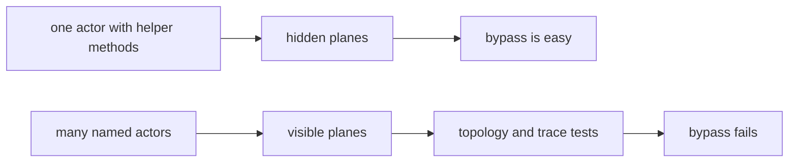

## Actor per plane

An actor-heavy system should look over-named to conventional Rust
eyes. That is expected.

| Plane | Actor noun |
|---|---|
| Parse one CLI record with diagnostics | `NotaDecoder` |
| Identify caller | `CallerIdentityResolver` |
| Add actor identity to request | `EnvelopeBuilder` |
| Route request by type | `RequestDispatcher` |
| Normalize a claim path | `ClaimNormalizer` |
| Check claim conflicts | `ClaimConflictDetector` |
| Mint item identity | `IdMint` |
| Mint store time | `Clock` |
| Append event | `EventAppender` |
| Commit state | `SemaWriter` |
| Read state | `SemaReader` |
| Maintain ready-work view | `ReadyWorkView` |
| Shape query result | `QueryResultShaper` |
| Encode reply | `NotaReplyEncoder` |

(Names follow `skills/kameo.md` §"Naming actor types": the type
IS the actor; the role describes what it does; no `Actor` suffix.)

These actors may be small. Some may be short-lived per request.
Some may be long-lived singletons. Some may become pools. The
choice of residency is a runtime decision; the actor identity is an
architecture decision.

Do not create actors for pure value transformations that have no
domain failure and no independent runtime ownership. Those methods
belong on the data-bearing actor that owns the surrounding phase.

## Actor or data type

When an actor wraps exactly one data type and only forwards to that
data type's methods, the data type is probably the actor. Prefer
`impl Actor for MemoryState` over `StoreSupervisor` holding a
`MemoryState` and forwarding every message into it.

Use this test:

- If the wrapped data type already owns the state and verbs, put the
  mailbox on that type.
- If the wrapper owns lifecycle, supervision, admission control,
  backpressure, restart policy, or a real child set, keep the
  wrapper actor and make those responsibilities explicit in its
  fields and tests.
- If the type has only `ActorRef<_>` fields and just forwards
  messages, it is a forwarding helper, not an actor. Either give it
  real state/failure policy or collapse it into the parent.

When collapsing a wrapper into the data-bearing actor, move tested
witness fields with the data. A counter that proves `MemoryState`
handled a write belongs on `MemoryState` after the collapse, not on a
leftover `StoreSupervisor`. When deleting a wrapper outright, delete
wrapper-only counters too after grepping for tests that read them.
Counter fields never keep a wrapper actor alive by themselves.

Runtime roots are the important exception: a root actor may carry
child `ActorRef<_>` fields because child lifecycle and restart policy
are its state. A root that merely exposes convenience methods over
sibling refs is still a non-actor wrapper and should be removed or
made into the actual root actor.

**Phase actors are the second exception**: an actor whose only state
is downstream `ActorRef<_>`s and whose only behavior is
forward-with-trace earns its place when the trace plane IS the
domain — when each forwarding hop is a witness that the pipeline
ran a particular stage and that witness is part of what the system
guarantees. Name these `*Phase` (e.g., `IngressPhase`, `DispatchPhase`),
**not** `*Supervisor` — they don't supervise. A `*Phase` actor must
satisfy three conditions to earn the carve-out:

- the trace event it emits is structurally part of the domain (the
  pipeline's witness contract), not opportunistic logging;
- there is a test that asserts the witness was emitted (the trace IS
  the testable claim);
- supervision happens elsewhere (typically the runtime root) — the
  `*Phase` actor's name does not lie about what it does.

If those three conditions don't hold, the rule above applies: the
type is a forwarding helper. Either give it real state/failure policy
or collapse it into the parent.

Every manifest-declared actor must have a concrete `impl Actor`.
Trace-only names are not actors. If a trace witness includes phases,
name them as trace nodes or pipeline phases, and make the value carry
the label data it reports. Do not use `ActorKind` as a bucket for both
real actors and aspirational phases; tests must not mistake trace
witness vocabulary for runtime architecture.

### Zero-sized actors are not actors

A zero-sized struct that implements `Actor` and whose only behavior is
to receive one message variant, call a method on data carried *inside*
the message, and reply with the result, is not an actor. It is a
method on the message's payload, wearing a mailbox costume.

```rust
// Anti-pattern. The actor is empty; the data lives in the message.
pub struct ProposalReader;
pub enum ProposalMsg {
    Read { source: ProposalSource, reply: RpcReplyPort<Result<ClusterProposal>> },
}
impl Actor for ProposalReader {
    type State = ();
    async fn handle(&self, _: ActorRef<_>, msg: Self::Msg, _: &mut ()) -> Result<()> {
        match msg {
            ProposalMsg::Read { source, reply } => {
                let _ = reply.send(source.load());
            }
        }
        Ok(())
    }
}
```

The three failures stack:

- The `Actor` has no state — `State = ()`. There is nothing the actor
  *holds* between messages.
- The data the verb operates on (`source`) is carried in the message,
  not in the actor. The actor is a relay between the message-payload
  type's existing method (`ProposalSource::load`) and the reply port.
- The handler is structurally `let _ = reply.send(message.payload.method())`.
  Spawning a Kameo task to do that is ceremony, not concurrency.

The fix is the obvious one. Delete the actor type, delete the message
enum, call the method directly:

```rust
// `ProposalSource::load()` already exists. Use it.
let proposal = source.load()?;
```

This is the diagnostic worth remembering: **a real actor's state field
names the noun the actor is.** If `type State = ()`, the actor is
nameless — the would-be "actor" is asking the data carried in its
message to play the role the actor itself failed to.

The lojix-cli kameo migration (bead `primary-q3y`) is the worked
example. Six "actors" — `ProposalReader`, `HorizonProjector`,
`HorizonArtifact`, `NixBuilder`, `ClosureCopier`, `Activator` — each
ZST, each `State = ()`, each one-variant. The "migration" was not
ractor → kameo; it was actors → methods. The data nouns
(`ProposalSource`, `HorizonProjection`, `ArtifactMaterialization`,
`NixBuild`, `ClosureCopy`, `Activation`) already owned the verbs.
The wrappers and a `DeployCoordinator` that supervised them collapsed
into one `pub async fn deploy(req) -> Result<DeployOutcome>`. About
200 lines of ceremony deleted; tests all still passed. See the commit
on `lojix-cli/push-ovulwxnnpykv` for the diff.

This anti-pattern is the most common false positive when a codebase
"wants actors": the discipline says "every plane gets an actor," so a
plane that *isn't actor-shaped* (one verb on one piece of data, no
state between calls, no supervision relationship) ends up dressed as
one anyway. The Core Rule's three tests — typed domain name, failure
mode callers act on, independently testable with synthetic input —
catch this. A ZST one-shot forwarder fails the first test: it has no
typed domain because it has no data.

### Real actors carry data that survives between messages

The healthy counterpoint is clavifaber. Each of its actors —
`CertificateIssuer`, `GpgAgentSession`, `YggdrasilKey`,
`TraceRecorder`, `RuntimeRoot` — has a `State` that names something
the actor *holds*: an in-flight issuance pipeline, an open gpg-agent
session, a yggdrasil binary lifecycle, a trace log, a supervised
child set. The state field is the noun the actor is. Compare:

| Actor | `State` field | Noun |
|---|---|---|
| `ProposalReader` (anti) | `()` | (none) |
| `GpgAgentSession` (real) | `Option<GpgAgentHandle>` | the open gpg-agent session |
| `CertificateIssuer` (real) | `IssuanceQueue` | the in-flight issuances |
| `YggdrasilKey` (real) | `YggdrasilKeyState` | the yggdrasil binary's lifecycle |

This is also why phase actors get a carve-out (above): a `*Phase`
actor's `State` is its downstream `ActorRef<_>`s, which *are* its
data — the pipeline's stage-graph. Without that state it would
collapse to a method too.

## Blocking is a design bug

An actor's mailbox is the push channel for that actor. If an actor
blocks inside message handling, it stops receiving pushes and the
system has recreated a hidden lock.

Forbidden inside a normal actor handler:

- sleeping to wait for state
- polling for state
- blocking on a mutex or read-write lock
- blocking process execution
- blocking filesystem or network calls
- synchronous waits for another actor that can call back upward
- long CPU work that starves the mailbox

Replace blocking with another actor:

| Blocking smell | Actor-shaped replacement |
|---|---|
| Handler runs a slow command | `Command` or `CommandPool` owns process execution. |
| Handler waits for file IO | `FileReader` / `FileWriter` owns that IO. |
| Handler waits for database commit | Send a typed intent to `SemaWriter`; receive a reply. |
| Handler sleeps before retry | Subscribe to the producer event; no sleep. |
| Handler locks shared state | Send a message to the actor that owns that state. |
| Handler does expensive CPU transform | `TransformWorker` pool owns that work. |

The rule is not "nothing ever takes time." The rule is that time
belongs to a named actor whose mailbox and supervision make the wait
visible. A blocking operation is allowed only inside the actor whose
single job is that blocking plane, and that actor is supervised,
traceable, and replaceable.

Three concrete code-level templates for such actors are documented in
`~/primary/skills/kameo.md` §"Blocking-plane templates": (1)
`spawn_blocking` + `DelegatedReply` detach for occasional short
blocking calls; (2) dedicated OS thread for frequent sync work; (3)
`tokio::process` + bounded `timeout` for process-exec work with an
async API. Pick by shape of work; don't invent a fourth.

### Supervision gotcha — Template 2 on a supervised state-bearing actor

A state-bearing actor that owns a durable resource (redb `Database`,
file lock, open Unix socket) and is **supervised** as a Kameo child
must stay on `.spawn()`, not `.spawn_in_thread()`, in Kameo 0.20.
Kameo signals "child closed" the moment `notify_links` drops
`mailbox_rx`, **before** the actor's `Self` value (the thing that
holds the redb `Database` handle) is dropped. The parent's
`wait_for_shutdown` returns while the OS thread is still running
`block_on(...)` and the resource is still held — the next process
that opens the same path races the still-locked file and fails with
`Io(UnexpectedEof)` or hangs on the second `bind()`.

Template 2 stays the right *destination* shape for redb-backed
stores; it does not become the right *current* shape on a supervised
parent until upstream Kameo grows a `pre_notify_links` hook (or the
actor exposes a close-then-confirm protocol the supervisor awaits
before propagating shutdown). The deferral is documented at
`persona-mind/src/actors/store/mod.rs:295-307` and
`reports/operator-assistant/138-persona-mind-gap-close-2026-05-16.md`
§"P2 — StoreKernel Template-2 deferral". `~/primary/skills/kameo.md`
§"Blocking-plane templates" Template 2 carries the full mechanics.

## No shared locks

Do not use `Arc<Mutex<T>>` or `Arc<RwLock<T>>` as the ownership
model between actors. That turns the lock into the real actor and
makes the actors decorative.

State has one owner:

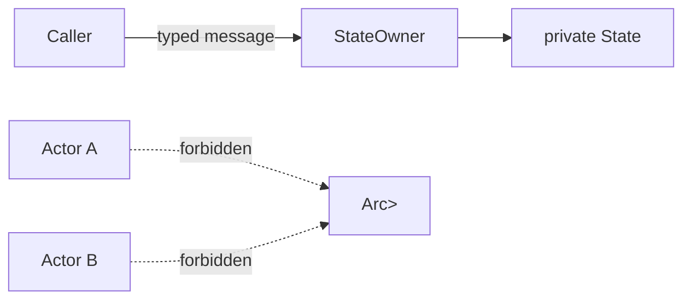

If two actors need the same state, the state has the wrong owner or
the state should be split into two actors. Use message passing,
snapshots, and read views; do not add shared locks.

## Supervision is part of the design

An actor without a supervised parent is not finished. Every actor
belongs in a tree.

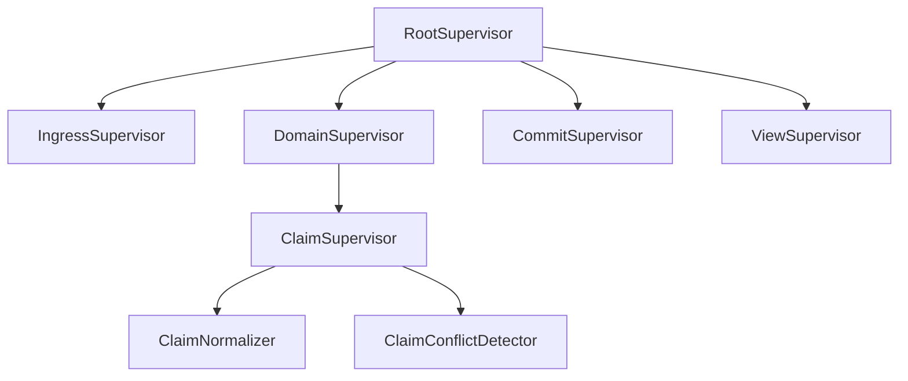

Each supervisor needs a typed failure policy:

| Failure | Policy question |
|---|---|
| child rejects input | reply with typed rejection |
| child panics | restart, stop, or escalate |
| child loses IO resource | rebuild resource actor or escalate |
| view refresh fails | preserve committed state and schedule pushed retry |
| writer fails | abort transition and emit typed failure |

No detached tasks. If work must run independently, it is an actor
or a supervised worker pool.

`DelegatedReply<R>` is the narrow exception for short reply
deferrals: the actor returns immediately and a spawned future sends
the reply later. It is not supervised actor work. Use it to avoid
blocking the mailbox on small async/IO reply work; use a dedicated
actor or worker pool for long-lived work, retry policy, durable
side effects, or work whose failure must be supervised.

## Release before notify

State-owning actors must release their owned resources **before**
death notifications dispatch to supervisors and watchers. A
supervisor that observes "child died" and spawns a replacement
while the dying child still holds a redb handle, a socket, or a
file lock will race the held resource — `Database::open` fails
with `DatabaseAlreadyOpen`, `bind()` fails with `EADDRINUSE`, or
the spawn hangs.

The framework guarantees this ordering. The discipline applies
to every actor that owns an exclusive resource.

### The shutdown sequence

```text
1. Stop admission           — user mailbox refuses new sends
2. Finish in-flight work    — current handler completes
3. Stop children            — drain children; await their terminals
4. Await on_stop            — user cleanup hook runs
5. Drop actor state         — Self drops; resources release
6. Dispatch notifications   — await enqueue on control channel
7. Cancel outbound watches
8. Unregister from registry
9. Publish terminal outcome — wait_for_shutdown() resolves
```

By the time `wait_for_shutdown()` returns, every prior step has
completed. Supervisors branch on the terminal outcome and can
safely restart against the same resource.

### Control plane is physically separate

Death notifications dispatch on a **non-deadlocking control
plane** distinct from the user mailbox:

- Physically separate channel, or reserved capacity ordinary
  messages cannot consume.
- Processed even when the recipient's user-message handler is
  blocked.
- Filling the user mailbox cannot block control signals.

A shared mailbox with an admission gate is not sufficient — it
deadlocks when a parent handler awaits child shutdown and the
child needs to send a death signal back.

### "Await dispatch" means enqueue, not processing

Step 6 awaits the channel send *completing* — not the
recipient's handler running. Waiting for processing would
deadlock supervisors that hold child-shutdown awaits. Enqueue
gives cross-thread happens-before; the recipient processes at
its own pace.

### Terminal outcome carries the path

```rust
ActorTerminalOutcome {
    state:  ActorStateAbsence,   // Dropped | NeverAllocated | Ejected
    reason: ActorTerminalReason, // Stopped | StartupFailed | ...
}
```

- `Dropped`: actor existed and `Self` was dropped at step 5.
  Owned resources released.
- `NeverAllocated`: `on_start` failed; steps 4-5 were skipped
  because there was no actor state. No claim about resources
  (there were none).
- `Ejected`: caller used an explicit state-return API; the
  caller now owns `Self`. The framework makes no claim about
  resource release — that's the caller's responsibility.

Supervisors branch on `outcome.state`. Don't infer from "did
the actor reach phase X" — phases aren't observable. The
outcome is the only externally visible terminal fact.

### When resources are too critical for framework lifecycle alone

For exclusive resources that can't tolerate any restart race —
redb databases, exclusive socket bindings, child-process pids —
move the resource into a long-lived owner actor that doesn't
restart under routine failures. Restartable phase actors send
typed requests to the owner without holding the resource
directly. The owner itself still follows the shutdown sequence
when the daemon exits.

This is `skills/exclusive-resource-actor.md` shape (to be
written when `StoreKernel` lands). It composes with
release-before-notify; it doesn't replace it.

### How to apply

| Question | Answer |
|---|---|
| Can I poll `is_alive()` to check if an actor is done? | No. `is_alive()` flips false at admission-stop (step 1) — the *start* of shutdown, not the end. |
| Can I check `mailbox.is_closed()` to wait for terminal? | No. Mailbox closure is internal sequencing; the only public terminal signal is `wait_for_shutdown().await`. |
| Can I `tokio::spawn(notify(...))` for fire-and-forget death notification? | No. Death dispatches are awaited on the control plane. Spawning the dispatch and marking "notified" would lie — the recipient might not be scheduled yet. |
| Can I restart a supervised actor before `wait_for_shutdown()` returns? | No. The terminal outcome is the synchronization point. Restarting earlier races the resource release. |
| Does this apply to actors that don't own exclusive resources? | The framework follows it for everyone; the discipline is load-bearing only when resources are involved. Don't write code that assumes a weaker contract. |

## Durable state belongs in sema

An actor with durable state goes through `sema`. There is no
in-memory durable state in this workspace; if state must survive a
crash, restart, or process exit, it lives in a `sema` redb owned by
the actor's component.

This shapes restart policy directly. Kameo's restart reconstructs
an actor from its `Args`, not from mutated memory — a counter at 12
reads back as 0 after restart. So an actor's state is one of two
things:

- **`sema`-backed durable state**: restart reconstructs from sema.
  `RestartPolicy::Permanent` is safe; the actor recovers what it
  had.
- **Transient state** (in-memory only): restart loses everything
  the crashed instance had been told. **Default
  `RestartPolicy::Never`**, because the alternative is silent state
  loss followed by accepting writes against an empty state.

`RestartPolicy::Permanent` on a transient-state actor requires an
explicit comment justifying why losing state on crash is
acceptable. Default to `Never` and let the supervision tree
escalate.

The destination for every state-owning actor is sema-backed, so the
`Never`-default is transitional — it disappears when the actor's
durable substrate lands.

## Counter-only state — test witnesses must be tested

Actors commonly carry `_count: u64` fields used only by tests as
witnesses ("the actor ran"). This pattern is permitted, but every
counter field must be read by at least one test that asserts on its
value. Unread counter fields are dead code; an unread counter does
not witness anything.

When `cargo check` passes but a counter has never been read in a
test, treat it as a code smell — either add the test that reads it,
or remove the field. The alternative (push witnesses via
`tokio::sync::oneshot` / `tokio::sync::watch`, per
`skills/kameo.md` §"Test patterns") is also acceptable and usually
cleaner.

## Runtime roots are actors

A daemon, service, router, watcher, database owner, or runtime root
is an actor. A struct that merely owns several `ActorRef<_>` values
and exposes convenience methods is a hidden non-actor owner; it
recreates the wrapper shape this discipline exists to remove.

The internal surface for an actor runtime is `ActorRef<RuntimeRoot>`
or `ActorRef<ServiceRoot>` directly. Startup, child spawning,
shutdown, and child-stop policy belong to that root actor's
lifecycle hooks or typed mailbox messages. If a root owns child
actor refs, the root carries those refs as actor state and handles
requests through its mailbox.

A public domain facade may wrap the root actor when it earns its
place under `skills/kameo.md` §"Public consumer surface —
ActorRef<A> or domain wrapper": lifecycle ownership, topology
insulation, safe fallible-message handling, capability narrowing,
domain errors, domain verbs, or library publication. That facade is
not the runtime owner; the root actor still owns the actor tree.

Do not keep a non-actor runtime facade just because tests use it or
because the daemon, durable store, or transport boundary is not built
yet. Those are separate concerns. Tests can use `ActorRef<RuntimeRoot>`
directly or a test fixture that spawns the root; the product API does
not grow a wrapper to make tests shorter. If a later daemon/client
surface earns a domain facade, add it then for the domain reason.

Tests must make this boundary falsifiable: a topology or
forbidden-edge test should fail if a runtime root regresses into a
non-actor owner around actor refs.

### Engine traits live on real data-bearing types

The hidden-non-actor-owner anti-pattern extends to the
schema-emitted engine traits (`SignalEngine`, `NexusEngine`,
`SemaEngine` per `skills/component-triad.md` §"Runtime triad
engine traits"): they must be implemented on REAL data-bearing
types — the actor / daemon root / domain-state-carrying struct —
NOT on:

- **ZST namespaces.** `impl NexusEngine for SpiritNexus` where
  `pub struct SpiritNexus;` is a free function in disguise. The
  trait's verbs need a real noun to live on.
- **"Helper" structs that hold no state.** A `struct` with no
  fields implementing the engine trait reads as ownership, but
  owns nothing — same anti-pattern with a different syntax.
- **Free functions disguised through trait alias macros.** If the
  expansion lands a free function and renames it as a method, the
  anti-pattern still fires; the macro extension must still satisfy
  the method-on-real-noun rule.

The engine impl owns the actor's state — the redb handles, the
typed configuration, the in-memory caches, the trace log, the
child actor refs. Method placement is a design decision about
where the logic lives, on what object, owning what data
(`AGENTS.md` §"Hard overrides" + `skills/rust/methods.md` §"No
ZST method holders" §"Legitimate ZST uses — narrow, named").

The test: erase the type's name from the type system. If the
type's job vanishes, it was a namespace; the verbs need a real
noun. Per Spirit 1487 + designer 485.

## Rust shape

The workspace runtime default is **`kameo` 0.20**. Kameo's native
shape — `Self IS the actor`, `type Args = Self`, per-kind
`Message<T>` impls, declarative supervision — makes every
architectural rule in this skill naturally expressible. The
no-public-ZST-actor rule is naturally satisfied because the type
that carries the actor's data IS the actor.

For the framework usage (lifecycle hooks, spawning, mailbox,
supervision API, blocking-plane templates, naming, public consumer
surface), see `skills/kameo.md`. The architectural rules above —
one actor per plane, no shared locks, supervision is part of the
design, no blocking handlers, no public ZST actor nouns, manifest-
declared actors must have concrete `impl Actor` — are what this
skill owns; how to express them in Kameo lives in `skills/kameo.md`.

Two Kameo-specific guardrails worth surfacing here because they
shape what an actor-dense Rust system *cannot* do:

- **No non-actor runtime/root/manager wrappers around `ActorRef<_>`
  values.** A struct that holds several actor refs and exposes
  convenience methods is a hidden non-actor owner; the root must
  itself be an actor.
- **Never `tell` a handler whose `Reply = Result<_, _>` unless
  `on_panic` is overridden** to recover from `PanicReason::OnMessage`
  — see `skills/kameo.md` §"The tell-of-fallible-handler trap".

## Traces are required

An actor-heavy system must expose an actor trace in tests. The
trace is how we prove that the named planes actually ran.

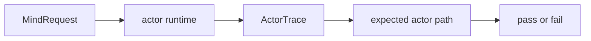

Trace events should include:

- actor started
- actor stopped
- message received
- message replied
- child spawned
- child failed
- write intent sent
- commit completed
- view refreshed

The trace is not a logging substitute. It is a test witness.

## Test actor density

Behavior tests are not enough. Tests must prove that the actor
planes exist and are used.

Required test families:

| Test | What it proves |
|---|---|
| topology manifest test | expected supervisors and actors exist |
| trace-pattern test | request ran through required actor sequence |
| forbidden-edge test | actor did not bypass required owner |
| no-writer-in-query test | query path did not mutate state |
| no-blocking-handler test | actor handler did not perform forbidden blocking work |
| failure-injection test | each actor phase has typed failure behavior |
| actor-count test | future agents cannot collapse actors by assuming overhead |
| no-zst-actor test | public actor nouns carry data fields (Kameo's `Self IS the actor` shape makes this naturally enforceable via `mem::size_of::<MyActor>() > 0`) |

Test name patterns:

- `claim_cannot_commit_without_conflict_actor`
- `query_cannot_touch_sema_writer`
- `item_open_cannot_mint_id_without_id_actor`
- `handler_cannot_block_mailbox`
- `topology_cannot_omit_claim_normalizer`
- `claim_normalizer_cannot_be_empty_marker`

The `#[test]` wrapper calls methods on a fixture. The fixture
drives the actor runtime, captures the trace, and asserts the
topology or path.

### Anti-pattern — `flavor = "multi_thread"` on parallel daemon-restart tests

A daemon-restart witness that drops one runtime root and opens
another against the same on-disk state must stay on
`#[tokio::test]` (single-thread default) unless it specifically
needs `spawn_in_thread`. With `flavor = "multi_thread"`, the same
restart tests pass individually but **hang indefinitely under
`cargo test`'s default parallel runner** — a separate kameo/tokio
interaction (likely registry contention or link-bookkeeping shared
state across runtimes) shows up only with multi-thread + parallel.
Surfaced in `reports/operator-assistant/138-persona-mind-gap-close-2026-05-16.md`
§"Found by accident — multi_thread parallel-restart hang". The
default `#[tokio::test]` annotation is sufficient for `.spawn()`-
backed actors; switch to multi-thread only when a test specifically
demands `spawn_in_thread`, and run such tests under `--test-threads=1`
or in a single-test process.

## When not to create an actor

Do not create an actor for:

- a pure value type
- a contract record
- a one-line display implementation
- a parser that is just a short-lived data-bearing object inside
  an already actor-owned phase
- a library crate with no runtime ownership

Even then, the behavior still belongs on a data-bearing type, not
a free function or a ZST method holder.

## See also

- this workspace's `skills/rust-discipline.md` — Rust ownership,
  typing, errors, redb/rkyv, and the kameo default.
- this workspace's `skills/architectural-truth-tests.md` —
  tests that prove the actor path was used.
- this workspace's `skills/push-not-pull.md` — actor mailboxes
  are push channels; polling is forbidden.
- this workspace's `skills/abstractions.md` — actor verbs belong
  on the data-bearing actor noun, not on framework marker glue.
- this workspace's `skills/kameo.md` — Kameo 0.20 usage in this
  workspace (the framework reference).
- `/git/github.com/LiGoldragon/kameo-testing` — falsifiable source
  for every Kameo behavior the skill cites.
- lore's `rust/testing.md` — actor runtime testing and fixture
  patterns.


## Kameo framework

*Workspace actor runtime. Self IS the actor; messages are typed
per-kind; supervision is declarative. The framework's shape agrees
with `skills/actor-systems.md`'s rules — no carve-outs needed.*

## What this skill is for

Use this skill when you write or edit Rust that defines, spawns,
supervises, or sends messages to an actor in this workspace. Kameo
0.20 is the workspace's actor runtime, replacing direct `ractor`.

For the architectural discipline — when a logical plane deserves
an actor, what counts as actor-shape, the no-blocking-handler rule,
the no-public-ZST-actor-noun rule — see this workspace's
`skills/actor-systems.md`. This skill is *how* you express that
discipline in Kameo specifically.

The falsifiable source for every claim below is twofold:

- `/git/github.com/LiGoldragon/kameo-testing` — designer's test bed
  (lifecycle, messages, spawn, mailbox, registry, supervision,
  streams, links, topology).
- `/git/github.com/LiGoldragon/kameo-testing-assistant` —
  designer-assistant's complementary tests (data-bearing patterns,
  failure & mailbox, lifecycle/registry/threads).

Together they cover the surface a Persona component needs.

## Maturity and pinning

Kameo is pre-1.0, actively developed, and small enough that API
churn between minor versions is real. As of 2026-05-10:

- crates.io: 33 versions; latest `0.20.0` (2026-04-07); ~248k total
  downloads, ~109k recent.
- GitHub: `tqwewe/kameo`; ~1,300 stars, last push 2026-04-27, 9
  open issues, single primary author.
- Public production users: `CapSoftware/Cap` (Loom alternative) on
  `0.17.2`; `ethui/ethui` (Ethereum toolkit) on workspace pin;
  `volga-project/volga` on `0.16.0`; `microsoft/dactor` ships a
  `dactor-kameo` adapter.

Read this as: not boring infrastructure yet, but real — beyond toy.
Pin Kameo's version intentionally per-crate; expect minor breaks.

**Rust 1.88 is required.** Kameo 0.20 declares `rust-version =
"1.88.0"`. Crates pinned at older toolchains (Persona's runtime
crates were on 1.85) must bump before adopting Kameo. See
`skills/nix-discipline.md` §"Workspace fenix lockstep" for
workspace-wide lock alignment once any crate's toolchain moves.

## The core shape

Kameo's load-bearing fact: **`Self` IS the actor.** Not a behavior
marker plus a separate `State`. Not a wrapper crate. The struct that
carries your actor's data is the type you implement `Actor` on.

```rust
use kameo::Actor;
use kameo::actor::{ActorRef, Spawn};
use kameo::error::Infallible;
use kameo::message::{Context, Message};

pub struct ClaimNormalizer {
    in_flight:    HashMap<RequestId, WirePath>,
    max_in_flight: usize,
    metrics:      ClaimNormalizerMetrics,
}

impl Actor for ClaimNormalizer {
    type Args  = Self;          // the documented common case
    type Error = Infallible;

    async fn on_start(args: Self, _ref: ActorRef<Self>) -> Result<Self, Self::Error> {
        Ok(args)
    }
}

pub struct Normalize { pub operation: OperationId, pub path: WirePath }

impl Message<Normalize> for ClaimNormalizer {
    type Reply = Result<NormalizedScope, ClaimNormalizerFailure>;

    async fn handle(
        &mut self,
        msg: Normalize,
        _ctx: &mut Context<Self, Self::Reply>,
    ) -> Self::Reply {
        self.in_flight.insert(msg.operation, msg.path.clone());
        let scope = self.validate_and_collapse(msg.path)?;
        self.metrics.normalize_count += 1;
        self.in_flight.remove(&msg.operation);
        Ok(scope)
    }
}

let normalizer = ClaimNormalizer::spawn(ClaimNormalizer {
    in_flight:     HashMap::new(),
    max_in_flight: 64,
    metrics:       ClaimNormalizerMetrics::default(),
});

let scope = normalizer.ask(Normalize { operation, path }).await?;
```

The actor type owns its data. Methods that operate on that data
live on the actor (`fn validate_and_collapse(&mut self, …)`). The
no-public-ZST-actor-noun rule from `skills/actor-systems.md` is
naturally satisfied: the actor type is the data-bearing noun.

## Naming actor types

The cross-language rule is `skills/naming.md` §"Anti-pattern:
framework-category suffixes on type names" — drop `*Actor`,
`*Message`, `*Msg`, `*Handler` suffixes; let the type's role-shaped
name carry meaning. Kameo's `Self IS the actor` shape makes this
naturally enforceable: there's no second behavior-marker type to
disambiguate against.

Application to Kameo's surface:

| Concept | Wrong | Right |
|---|---|---|
| Actor type | `ClaimNormalizerActor`, `MindRootActor`, `CounterActor` | `ClaimNormalizer`, `MindRoot`, `Counter` |
| Message type | `IncMessage`, `IncMsg`, `Inc` | `Increment` |
| Message type | `SubmitMessage`, `SubmitClaim` | `ClaimSubmission` |
| Reply type | `SubmitReply` | `SubmissionReceipt` |
| Handle type | `CounterHandle` (when wrapping `ActorRef<Counter>` for no reason) | `ActorRef<Counter>` directly |

Role-shaped suffixes (`*Supervisor`, `*Resolver`, `*Normalizer`,
`*Tracker`, `*Ledger`, `*Store`) describe what the type DOES and
stay. `*Handle` is relationship-naming (same shape as
`JoinHandle`) — earns its place when the wrapper carries domain
content per §"Public consumer surface — ActorRef<A> or domain
wrapper". `Actor` is a category tag; the trait impl
(`impl Actor for Counter`) makes the framework participation
explicit, so the type name doesn't have to.

The historical drift toward `*Actor` / `*Message` suffixes came
from frameworks like ractor where the actor's behavior marker was
a separate ZST from its `State` — the suffix disambiguated. Kameo
removed the disambiguation; drop the suffix from the start.

## Public consumer surface — `ActorRef<A>` or domain wrapper

Kameo's `ActorRef<A>` is statically typed against the actor; the
message types it accepts are guaranteed by `impl Message<T> for A`
at compile time. There is no class of misuse a wrapper newtype
prevents — sending the wrong message is a type error at the call
site. The question isn't safety; it's **what API makes sense** for
the consumer.

Two patterns, distinguished by whether the wrapper carries domain
meaning:

### `ActorRef<A>` directly — when the actor IS the public API

Default for actors whose message types ARE the consumer surface.
The consumer spawns the actor (or is handed an `ActorRef<A>`) and
calls `actor_ref.ask(msg).await` / `actor_ref.tell(msg).await`
directly. Re-export `kameo::actor::ActorRef` from the crate root
if it makes consumer imports cleaner.

```rust
let normalizer = ClaimNormalizer::spawn(ClaimNormalizer { … });
let scope = normalizer.ask(Normalize { operation, path }).await?;
```

Most workspace actors fit this — small actors with a clear single
message vocabulary, in-workspace consumers, no multi-step
orchestration to hide.

### Domain wrapper — when the public API is a domain abstraction

When the consumer surface is a domain abstraction *over* one or
more actors, wrap. Two name shapes are both acceptable:

- **Bare domain noun** when the wrapper IS the conceptual surface
  and no shadowing data type exists: `Mind`, `Router`. Cleaner.
- **`*Handle` suffix** when the bare noun would shadow a sibling
  data type and the disambiguation matters: `LedgerHandle` (when
  `Ledger` is the data type with `entries: Vec<Entry>`),
  `MindHandle` (when `Mind` is also a typed record kind elsewhere).
  Per `skills/naming.md`, `Handle` is *relationship-naming* (the
  value IS a held authority on the live actor) — same shape as
  Tokio's `JoinHandle` or std's `File` / `Child` — *not*
  framework-category tagging like `Actor` / `Message`.

Never `*ActorHandle` (the `Actor` part is still the framework-category
trap). For remote-network services, `*Client` may be a better
relationship name than `*Handle`.

```rust
pub struct Mind {
    root:   ActorRef<MindRoot>,
    reader: ActorRef<SemaReader>,
}

impl Mind {
    pub async fn claim(
        &self,
        role:   ActorName,
        scope:  WirePath,
        reason: ScopeReason,
    ) -> Result<ClaimAcceptance, MindError> {
        self.root.ask(MindRequest::Claim { role, scope, reason }).await
            .map_err(MindError::from)?
            .into_acceptance()
    }

    pub async fn note(&self, item: ItemId, body: NoteBody) -> Result<NoteAdded, MindError> { … }

    pub async fn ready_work(&self) -> Result<Vec<ReadyItem>, MindError> { … }
}
```

A wrapper earns its place when **at least one** of these is true (per
designer-assistant/6 §"A Rule That Fits Both Sides"):

1. **Lifecycle ownership** — the wrapper has `start(config)` /
   `stop()` methods naming "I own this live service," not just "I
   hold a reference to an actor." Consumers think in services.
2. **Topology insulation** — the wrapper hides actor topology from
   the public API. If `Ledger` later becomes
   `LedgerWriter` + `LedgerReader` + `LedgerIndex` internally, the
   public `Ledger.append()` / `Ledger.read()` surface stays stable.
3. **Fallible-`tell` prevention** — the wrapper exposes only the
   safe method (`mind.claim(...)` does `ask` internally), removing
   the consumer's option to `tell` a `Result`-returning handler and
   crash the actor. (See §"The tell-of-fallible-handler trap".)
4. **Capability narrowing** — `LedgerReader` and `LedgerWriter` as
   distinct wrappers around the same underlying actor, exposing
   only `read` or only `append`. Different from Kameo's
   `Recipient<M>` (single-message); a wrapper handles a small
   domain surface.
5. **Domain error vocabulary** — `Result<T, MindError>` instead of
   `Result<T, SendError<Submit, SubmitError>>` at every call site.
6. **Domain verbs over Message construction** — `mind.claim(role,
   scope, reason)` instead of `mind_ref.ask(MindRequest::Claim {
   role, scope, reason })`. Caller writes domain English; wrapper
   constructs the typed Message.
7. **Library publication** — the crate is consumed by code that
   shouldn't construct Kameo Message values directly (external
   library users; downstream crates that want a stable API surface
   that survives Kameo version churn).

### Escape hatch for advanced consumers

When a wrapper exists, advanced consumers may still need raw `ActorRef`
access (testing, custom orchestration). Expose deliberately, not
implicitly:

```rust
impl ClaimNormalizerHandle {
    /// Escape hatch for tests and advanced orchestration that need to
    /// construct messages or use Kameo's full builder surface.
    pub fn actor_ref(&self) -> &ActorRef<ClaimNormalizer> {
        &self.normalizer
    }
}
```

Or expose a narrower Kameo-native capability:

```rust
impl ClaimNormalizerHandle {
    pub fn normalize_recipient(&self)
        -> ReplyRecipient<NormalizeClaim, NormalizedClaim, NormalizeError>
    {
        self.normalizer.recipient()
    }
}
```

This keeps Kameo honest and visible without making it the first API
every domain caller has to learn.

### Don't wrap defensively

A bare wrapper that just holds an `ActorRef<A>` and delegates
method-by-method without adding domain content is still the
speculative-abstraction shape operator/103 retired with
`persona-actor` / `workspace-actor`. We just spent a wave switching
FROM ractor TO Kameo *because* we hadn't wrapped — the migration was
bounded. Don't pre-pay the wrapper cost for a runtime swap that may
never come.

```rust
// Wrong — wrapper adds nothing the type system isn't already enforcing
pub struct CounterHandle {
    counter: ActorRef<Counter>,
}
impl CounterHandle {
    pub async fn increment(&self) -> Result<i64, SendError<Increment>> {
        self.counter.ask(Increment).await
    }
}
```

If the wrapper ends up just delegating method-by-method to `ActorRef`
with no transformation, no error mapping, no lifecycle ownership, no
capability narrowing, drop it and expose `ActorRef<A>` directly.

The discriminator: **does the wrapper meet at least one of the seven
criteria above, or is it type laundering?** If it doesn't meet one,
it's laundering.

## Module map (where each thing lives)

The single source of confusion in Kameo's surface is the split
between `kameo::actor::*` and `kameo::error::*`. Memorise this:

| Symbol | Path |
|---|---|
| `Actor`, `Spawn`, `ActorRef`, `WeakActorRef`, `ActorId`, `PreparedActor`, `Recipient`, `ReplyRecipient` | `kameo::actor::*` |
| `Message`, `Context`, `StreamMessage` | `kameo::message::*` |
| `Reply`, `ReplyError`, `ReplySender`, `DelegatedReply`, `ForwardedReply` | `kameo::reply::*` |
| `ActorStopReason`, `PanicError`, `PanicReason`, `SendError`, `RegistryError`, `HookError`, `Infallible` | `kameo::error::*` |
| `bounded(n)`, `unbounded()`, `MailboxSender`, `MailboxReceiver`, `Signal` | `kameo::mailbox::*` (free functions) |
| `RestartPolicy`, `SupervisionStrategy`, `SupervisedActorBuilder` | `kameo::supervision::*` |
| `ACTOR_REGISTRY`, `ActorRegistry` | `kameo::registry::*` (only without `feature = "remote"`) |

The default Kameo cargo features are `["macros", "tracing"]`.
Workspace default: leave `remote` off — Persona is local-process
for now, libp2p is heavy, and the registry API switches signatures
under `remote`. Document an explicit decision in the consumer
crate's `ARCHITECTURE.md` if you turn `remote` on.

The convenience import is:

```rust
use kameo::prelude::*;
```

Add `use kameo::message::StreamMessage;` if you use `attach_stream`,
and `use kameo::error::Infallible;` if you write the `type Error`
field by hand (`#[derive(Actor)]` covers both).

## Lifecycle hooks

| Hook | Default | When to override |
|---|---|---|
| `on_start(args, actor_ref) -> Result<Self, Error>` | required | Always; this constructs the actor. |
| `on_message(...)` | dispatches via `BoxMessage::handle_dyn` | Almost never — only for custom buffering or scheduling. |
| `on_panic(&mut self, ref, err) -> ControlFlow<ActorStopReason>` | `Break(Panicked(err))` — actor stops | When the actor should survive specific panic kinds. Inspect `err.reason()` for `PanicReason::HandlerPanic` / `OnMessage` / etc. |
| `on_link_died(&mut self, ref, id, reason) -> ControlFlow<ActorStopReason>` | `Continue` for `Normal`/`SupervisorRestart`, `Break(LinkDied{..})` otherwise | When peer death should be visible without stopping. |
| `on_stop(&mut self, ref, reason) -> Result<(), Error>` | `Ok(())` | When the actor needs to persist or clean up before drop. |
| `next(&mut self, ref, mailbox_rx) -> Result<Option<Signal>, Error>` | `mailbox_rx.recv()` | When the actor merges other input sources via `tokio::select!`. |

Three load-bearing details:

- **`on_start` failure short-circuits.** A returned `Err` (or
  panic) wraps as `PanicError { reason: PanicReason::OnStart }`,
  the `JoinHandle` resolves to `Err(panic_error)`, and **`on_stop`
  is not called**. Under supervision, this is restartable like any
  other `Panicked` reason.
- **`on_stop` panics propagate.** Kameo's harness does *not*
  `catch_unwind` around `on_stop`. A panic in `on_stop` ends the
  actor's tokio task as a panicked task. Errors returned from
  `on_stop` are stored in `shutdown_result` for
  `wait_for_shutdown_result()` to surface — *not* a task panic
  despite stale doc claims to the contrary.
- **`PanicReason` distinguishes the source.** `HandlerPanic`,
  `OnMessage`, `OnStart`, `OnPanic`, `OnLinkDied`, `OnStop`,
  `Next`. Inspect via `err.reason()` and downcast via
  `err.downcast::<MyError>()` or `err.with_str(|s| ...)`.

## Messages and replies

Each message kind is a separate `Message<T>` impl on the actor.
Multiple impls compose freely on one actor; dispatch is statically
resolved at the call site.

```rust
struct Increment(i64);
struct Multiply(i64);
struct ReadCount;

impl Message<Increment> for Calculator { type Reply = i64; async fn handle(...) -> i64 { ... } }
impl Message<Multiply>  for Calculator { type Reply = i64; async fn handle(...) -> i64 { ... } }
impl Message<ReadCount> for Calculator { type Reply = i64; async fn handle(...) -> i64 { ... } }
```

Names are full English (per `skills/naming.md`): `Increment` not
`Inc`, `Multiply` not `Mul`, `ReadCount` not `Read` (which would
shadow `std::io::Read`).

The `#[messages]` macro on an `impl` block generates these for you
(see `notes/findings.md` for sub-attributes). Hand-rolled impls are
also fine and often clearer.

### `ask` vs `tell`

| Form | Returns | Use when |
|---|---|---|
| `actor_ref.ask(msg).await` | `Result<R::Ok, SendError<M, R::Error>>` | The reply matters. |
| `actor_ref.tell(msg).await` | `Result<(), SendError<M>>` | Fire-and-forget. |

`actor_ref.ask(msg).await` and `actor_ref.tell(msg).await` work
directly via `IntoFuture`. The builder methods `mailbox_timeout`,
`reply_timeout` (ask only), `try_send`, `blocking_send`, `send_after`
(tell only) are available when you need them.

### Result replies

For a handler with `type Reply = Result<T, MyError>`:

- Ok path: caller's `ask().await` returns `Ok(T)` directly.
- Err path: caller's `ask().await` returns `Err(SendError::HandlerError(MyError))`.

Pattern-match on the variant — don't `unwrap_or` past it:

```rust
match actor_ref.ask(Divide { ... }).await {
    Ok(value)                                          => use_value(value),
    Err(SendError::HandlerError(DivisionError::ByZero)) => …,
    Err(SendError::ActorNotRunning(_))                  => …,
    Err(SendError::Timeout(_))                          => …,
    Err(other)                                          => panic!("unexpected: {other:?}"),
}
```

### The `tell`-of-fallible-handler trap

A handler whose `Reply = Result<_, _>` returning `Err(_)` to a `tell`
becomes `ActorStopReason::Panicked(PanicError { reason: PanicReason::OnMessage })`.
The default `on_panic` stops the actor.

This is the most common Kameo footgun. **Never `tell` a fallible
handler unless you've overridden `on_panic` to recover from
`PanicReason::OnMessage`.** When in doubt, `ask` and ignore the
reply — the error gets routed to the caller as `SendError::HandlerError`
and the actor lives.

### `DelegatedReply<R>`

Use when the handler needs to defer the reply to a spawned task —
i.e., the work behind the reply is async/IO/long-running and the
actor's mailbox should not block on it:

```rust
impl Message<DoSlow> for Worker {
    type Reply = DelegatedReply<String>;

    async fn handle(&mut self, msg: DoSlow, ctx: &mut Context<Self, Self::Reply>) -> Self::Reply {
        let (delegated, sender) = ctx.reply_sender();
        if let Some(tx) = sender {
            tokio::spawn(async move {
                let result = expensive_io(msg).await;
                tx.send(result);
            });
        }
        delegated
    }
}
```

The actor returns immediately; the spawned task replies later. The
caller's `ask().await` blocks until `tx.send(...)` fires (or the
task drops). Without `DelegatedReply`, the actor's mailbox would
block on the slow work — re-creating the hidden-lock failure mode
`skills/actor-systems.md` warns against.

## Spawning

| Form | Returns | Notes |
|---|---|---|
| `MyActor::spawn(args)` | `ActorRef<MyActor>` | Sync. Default mailbox capacity 64. |
| `MyActor::spawn_with_mailbox(args, mailbox::bounded(256))` | `ActorRef<MyActor>` | Sync. Custom mailbox. |
| `MyActor::spawn_with_mailbox(args, mailbox::unbounded())` | `ActorRef<MyActor>` | Sync. No backpressure. |
| `MyActor::spawn_in_thread(args)` | `ActorRef<MyActor>` | Sync. Dedicated OS thread; **panics on `current_thread` Tokio runtime**. |
| `MyActor::spawn_link(&peer, args).await` | `ActorRef<MyActor>` | **Async.** Linked to `peer` before run loop starts (avoids the spawn-then-link race). |
| `MyActor::supervise(&parent, args).restart_policy(...).restart_limit(n, dur).spawn().await` | `ActorRef<MyActor>` | **Async.** Supervised. Args must be `Clone + Sync` (or use `supervise_with(factory)`). |
| `MyActor::prepare()` then `prepared.actor_ref()` then `prepared.spawn(args)` | `PreparedActor<MyActor>` | The `ActorRef` is available *before* the run loop starts — useful for pre-registering or pre-enqueueing. |

Use `PreparedActor::run(args).await` when a test needs the actor
value back after shutdown. The pattern is:

```rust
let prepared_actor = Ledger::prepare();
let ledger_ref = prepared_actor.actor_ref().clone();
ledger_ref.tell(OpenItem { title }).await?;
ledger_ref.tell(AddNote { body }).await?;
let stop_task = tokio::spawn(async move { ledger_ref.ask(StopAndRead).await });
let (final_ledger, stop_reason) = prepared_actor.run(Ledger::new()).await?;
assert!(matches!(stop_reason, ActorStopReason::Normal));
assert_eq!(final_ledger.snapshot(), stop_task.await??);
```

This is the clean test shape for "messages changed actor state and I
need to assert on the final actor value."

The default mailbox capacity is **64** (`pub(crate) const
DEFAULT_MAILBOX_CAPACITY: usize = 64`). Macro doc claims 1000;
that's stale. Size deliberately when traffic patterns warrant it.

## Test patterns

Prefer push witnesses over sleeps. If a test needs to know that a
handler started, a restart happened, or a link death was observed,
have the actor send on a `oneshot` or `watch` channel at the exact
moment:

```rust
let (started_sender, started_receiver) = tokio::sync::oneshot::channel();
let (release_sender, release_receiver) = tokio::sync::oneshot::channel();

gate.tell(HoldUntilReleased {
    started: started_sender,
    release: release_receiver,
}).await?;

started_receiver.await?;
gate.tell(QueuedBehindHeldMessage).await?;
release_sender.send(())?;
```

For repeated lifecycle events, use `watch`:

```rust
let (generation_sender, mut generation_receiver) = tokio::sync::watch::channel(0);
let actor = RestartingActor::spawn(RestartingActor {
    generation_sender,
});

generation_receiver.changed().await?;
assert_eq!(*generation_receiver.borrow(), 1);
```

A bounded `timeout(...).await.is_err()` is acceptable only when the
test is proving a should-not-fire condition. It is not a substitute
for waiting "long enough."

When asserting shutdown behavior, match the structured
`ActorStopReason`, not just a counter:

```rust
let stop_reason = peer.wait_for_shutdown_result().await?;
assert!(matches!(
    stop_reason,
    ActorStopReason::LinkDied { reason, .. }
        if matches!(*reason, ActorStopReason::Killed)
));
```

For final state assertions, use `PreparedActor::run` as described in
§"Spawning" rather than exposing test-only shared locks.

## Supervision

Declarative — no manual restart wiring.

```rust
use kameo::supervision::{RestartPolicy, SupervisionStrategy};

// Parent supervisor — carries data so it isn't a public ZST. The
// child registry tracks who's been spawned for diagnostics; the
// failure_log captures structured restart events.
struct StoreSupervisor {
    children:    HashMap<ActorId, ChildSpec>,
    failure_log: Vec<RestartEvent>,
}

impl Actor for StoreSupervisor {
    type Args = Self;
    type Error = Infallible;
    async fn on_start(args: Self, _: ActorRef<Self>) -> Result<Self, Self::Error> { Ok(args) }

    // Default is OneForOne. Override for OneForAll or RestForOne.
    fn supervision_strategy() -> SupervisionStrategy {
        SupervisionStrategy::OneForAll
    }
}

let supervisor = StoreSupervisor::spawn(StoreSupervisor {
    children:    HashMap::new(),
    failure_log: Vec::new(),
});
let child = Worker::supervise(&supervisor, WorkerArgs { … })
    .restart_policy(RestartPolicy::Permanent)
    .restart_limit(5, Duration::from_secs(10))
    .spawn()
    .await;
```

| Defaults | Value |
|---|---|
| `RestartPolicy` | `Permanent` (always restart) |
| `SupervisionStrategy` | `OneForOne` (only failed child restarts) |
| `restart_limit` | 5 restarts per 5 seconds |

Restart-policy semantics:

| Policy | On panic | On handler error | On normal exit |
|---|---|---|---|
| `Permanent` (default) | restart | restart | restart |
| `Transient` | restart | restart | no restart |
| `Never` | no restart | no restart | no restart |

Strategy semantics:

| Strategy | Behavior |
|---|---|
| `OneForOne` (default) | Only the failed child restarts. |
| `OneForAll` | All children restart together when any fails. |
| `RestForOne` | Failed child + all younger siblings (spawned later) restart. |

`restart_limit(n, window)` is reset-after-quiet, not sliding. Past
the limit, the supervisor's `on_link_died` fires for the dead child;
default behavior stops the supervisor.

**Restart reconstructs Self from Args, not from memory.** This is
the load-bearing supervision rule. When Kameo restarts an actor:

- The mailbox survives — queued messages reach the new instance;
  the message currently being processed is lost.
- **The actor's mutable state does not survive.** `on_start` runs
  again with the original `Args` (or a fresh value from
  `supervise_with(factory)`). A counter the crashed instance had
  bumped to 12 reads back as 0 (or whatever `Args` rebuilds to).
- Anything that *must* survive restart belongs outside the actor:
  in the component's own `sema-db`-backed redb (durable state via
  redb+rkyv), in shared `Arc<AtomicU32>` (cheap counters), or in
  `Args` itself (so each restart sees the same starting value).

Kameo makes restart policy easy to express; it does **not** make
restart semantics automatically safe. Design with reconstruction
in mind from the start.

### `OneForAll` / `RestForOne` can bypass `RestartPolicy::Never`

Strategy and policy compose, but not in the way the docs suggest.
When a sibling failure triggers `OneForAll` or `RestForOne`,
Kameo's coordinated restart paths can call sibling factories
directly — apparently bypassing each child's individual
`RestartPolicy::Never`. A child you set as `Never` may still be
respawned if a sibling failure invokes a strategy that restarts
the whole group.

```rust
// supervisor uses OneForAll
fn supervision_strategy() -> SupervisionStrategy {
    SupervisionStrategy::OneForAll
}

// child A: explicitly Never
let child_a = WorkerA::supervise(&supervisor, args)
    .restart_policy(RestartPolicy::Never)
    .spawn()
    .await;

// child B: Permanent
let child_b = WorkerB::supervise(&supervisor, args)
    .restart_policy(RestartPolicy::Permanent)
    .spawn()
    .await;

// When child B panics, OneForAll triggers — child A's `Never`
// is bypassed; both children get respawned.
```

If your supervision strategy is `OneForAll` or `RestForOne`,
test the bypass behavior explicitly. `RestartPolicy::Never`
doesn't always mean what it says under coordinated strategies.

The safe combinations:

| Strategy | Per-child Policy | Behavior |
|---|---|---|
| `OneForOne` | Any | Each child's policy is honored independently |
| `OneForAll` / `RestForOne` | All children share the same policy | Predictable |
| `OneForAll` / `RestForOne` | Mixed policies | **Coordinated paths may bypass `Never`; test explicitly** |

## Mailbox

Two factories at module level — there is no `Mailbox` type with
methods on it:

```rust
use kameo::mailbox;

let (tx, rx) = mailbox::bounded(64);    // backpressure on full
let (tx, rx) = mailbox::unbounded();    // unlimited; OOM risk under load
```

Bounded is the default. `tell().await` waits when full;
`tell().try_send()` returns `SendError::MailboxFull(msg)`;
`tell().mailbox_timeout(d).send().await` waits up to `d` then fails
with `Timeout`. Pick the form at the call site; there are no
overflow policies built in.

`ask().await` blocks twice: first on enqueue (mailbox capacity),
then on the reply (oneshot). `ask().reply_timeout(d).send().await`
caps the reply wait.

## Local registry

Without `feature = "remote"`, the registry is a process-global
`Mutex<HashMap>` at `kameo::registry::ACTOR_REGISTRY`.

```rust
let actor_ref = MyActor::spawn(MyActor { … });
actor_ref.register("namespace::name")?;        // sync; returns RegistryError on collision

let found: Option<ActorRef<MyActor>> = ActorRef::<MyActor>::lookup("namespace::name")?;
```

| Behavior | Detail |
|---|---|
| Collision | `Err(RegistryError::NameAlreadyRegistered)` — never overwrites. |
| Unknown name | `Ok(None)`. |
| Actor death | Entry auto-removed (per the 0.19 fix). |
| Strong/weak | Local registry holds **strong** refs — registration keeps the actor alive. |

When `feature = "remote"` is on, `register` and `lookup` become
async, take `Arc<str>`, require `A: RemoteActor`, and use libp2p
Kademlia. Different shape; named here only so consumers don't try
to call the local form on a remote build.

## Streams

`actor_ref.attach_stream(stream, started_value, finished_value)`
spawns a Tokio task that:

1. `tell(StreamMessage::Started(started_value))`
2. For each item: `tell(StreamMessage::Next(item))`
3. `tell(StreamMessage::Finished(finished_value))` once the stream
   ends.

The actor implements `Message<StreamMessage<M, T, F>>` to receive
all three envelopes. Handler typically uses `type Reply = ();`.

The returned `JoinHandle<Result<S, SendError<...>>>` resolves with
the unconsumed stream if the actor stops mid-stream — useful for
recovery. Backpressure on the actor's mailbox naturally throttles
the producer.

## Links

`actor_ref.link(&peer_ref).await` creates a bidirectional link.
When either dies, the survivor's `on_link_died(id, reason)` fires.
Default behavior continues for `Normal` / `SupervisorRestart`,
breaks (stops the survivor) for `Killed` / `Panicked` / `LinkDied`.

Two link patterns emerge — keep them separate in the design:

- **Supervision links** — death should propagate. Use the default
  `on_link_died`; the survivor stops on abnormal peer death and
  the supervisor restarts both per its strategy.
- **Observational links** — death should be observed without
  stopping the survivor. Override `on_link_died` to record the
  event (counter, channel send, sema row) and return
  `Ok(ControlFlow::Continue(()))` for all reasons.

A given actor may participate in both kinds — fail-fast on its
sibling, observe a downstream watchdog. Be deliberate per pair.

`actor_ref.unlink(&peer_ref).await` removes the link bidirectionally.

Use `spawn_link` instead of `spawn` + `link` when the link must be
established before the actor can fail — avoids the race where the
actor dies before the link is installed.

## Workspace conventions on top of Kameo

These are workspace rules per `skills/actor-systems.md`, applied to
Kameo's surface. They are not Kameo's defaults; they are how this
workspace uses Kameo.

- **Public actor nouns carry data.** Kameo permits ZST actors
  (`struct Pinger;`) but the workspace forbids them as the public
  surface. The actor type IS the state; if you don't have any
  fields, you don't have an actor — you have a verb. Find the
  noun.
- **One actor per file when the actor is durable enough to name.**
  `src/actors/store_supervisor.rs`, `src/actors/claim_normalize.rs`,
  etc. Co-locate the `Actor` impl, the `Message<T>` impls for
  that actor, and the message/reply types in one file.
- **No raw `Spawn::spawn` outside the runtime root.** Spawn happens
  at the supervision tree's root; child spawns go through
  `supervise(&parent, ...).spawn().await`.
- **No blocking inside a normal handler.** A handler that sleeps,
  polls, or runs synchronous IO has recreated a hidden lock per
  `skills/actor-systems.md`. Move the wait into a dedicated
  supervised actor (`CommandActor`, `FileReadActor`, etc.) and
  send it a typed message. The three concrete shapes such actors
  take are documented below in §"Blocking-plane templates".
- **Tests live in `tests/`, not `#[cfg(test)] mod tests`.** Per
  `skills/rust-discipline.md` — and the kameo-testing repo
  demonstrates the shape.
- **Don't reach for `remote` until cross-process actors are
  designed.** The local registry semantics differ; the libp2p
  surface is heavy. Document the decision in the consumer's
  `ARCHITECTURE.md` if you enable it.
- **Wait on `ActorTerminalOutcome`, not `is_alive()` or
  mailbox closure.** `outcome.state == Dropped` is the only
  public signal that owned resources released. See §"Lifecycle
  contract" below and `skills/actor-systems.md` §"Release
  before notify".

## Lifecycle contract

Implements `skills/actor-systems.md` §"Release before notify".

```rust
pub struct ActorTerminalOutcome {
    pub state: ActorStateAbsence,        // Dropped | NeverAllocated | Ejected
    pub reason: ActorTerminalReason,
}

impl<A: Actor> ActorRef<A> {
    pub async fn wait_for_shutdown(&self) -> ActorTerminalOutcome;
    pub fn is_accepting_messages(&self) -> bool;
    pub fn is_terminated(&self) -> bool;
    // is_alive() — deprecated alias for is_accepting_messages().
}
```

Watchers receive `Signal::LinkDied { id, outcome }` exactly
once per terminated peer, dispatched on a control channel
physically separate from the user mailbox.

Application rules:

- Supervisors branch on `outcome.state`. `Dropped` is the only
  signal that owned resources released.
- Resource-owning actors need component-specific falsifiable
  tests (rebind socket, reopen redb, etc.). The kameo
  `lifecycle_phases.rs::wait_for_shutdown_returns_after_cleanup_drop_and_notifications`
  test is the shape.
- Never `tokio::spawn(...)` death dispatch fire-and-forget.
  Await the control-channel accept.

Use the `kameo-push-only-lifecycle` fork; pre-fork versions
expose an ordinal `ActorLifecyclePhase` that is not the contract.

## Blocking-plane templates

The no-blocking-handler rule says *move the wait into a dedicated
supervised actor*. Three concrete templates land that rule, each
fitting a different shape of blocking work. They live side-by-side
here so consumers can pick the right one without inventing a fourth.

### Template 1 — `spawn_blocking` + `DelegatedReply` detach

For an actor whose blocking work is short-to-medium and occasional
(subprocess invocations, blocking IO leaves, bounded CPU bursts).
The handler returns *immediately*; the blocking work runs on Tokio's
blocking pool; the reply ships back when it completes. The actor's
mailbox doesn't stall.

```rust
impl Message<DeliverToHarness> for HarnessDelivery {
    type Reply = DelegatedReply<DeliveryResult>;

    async fn handle(
        &mut self,
        message: DeliverToHarness,
        context: &mut Context<Self, Self::Reply>,
    ) -> Self::Reply {
        let (delegated, sender) = context.reply_sender();
        context.spawn(async move {
            let outcome = tokio::task::spawn_blocking(move || {
                HarnessDelivery::deliver(message)  // sync work
            }).await;
            if let Some(sender) = sender {
                sender.send(outcome.into());
            }
        });
        delegated
    }
}
```

Live reference: `persona-router::HarnessDelivery`
(`src/harness_delivery.rs:88-120`).

The actor's ARCH must explicitly name it as the dedicated blocking
plane for the backend it owns. The detach is invisible without that
ARCH-level naming.

### Template 2 — Dedicated OS thread (`spawn_in_thread`)

For a state-bearing actor with *frequent* sync work that would burn
through per-call `spawn_blocking` invocations — typically a
redb-backed store, a file watcher, anything where every message
touches the same sync backend.

```rust
fn spawn_in_thread(store: StateStore) -> ActorRef<StateStore> {
    let (actor_ref, mailbox) = kameo::actor::Mailbox::bounded(64);
    std::thread::spawn(move || {
        let runtime = tokio::runtime::Builder::new_current_thread()
            .enable_all()
            .build()
            .expect("dedicated store runtime");
        runtime.block_on(store.run_loop(mailbox));
    });
    actor_ref
}
```

Live reference: `chroma::StateStore` (`src/state.rs:61`).

The actor runs on its own OS thread, off the Tokio worker pool
entirely. One mailbox, one writer, one thread — cleaner than per-call
detach for high-frequency stores. Pair with a typed schema and the
sema-family pattern from `skills/rust/storage-and-wire.md` §"The sema-family pattern".

**Do not use `spawn_in_thread` on a supervised state-bearing actor in
Kameo 0.20.** Kameo signals "child closed" the moment `notify_links`
drops `mailbox_rx`, **before** the actor's `Self` value (and any
durable resource it owns — redb `Database`, file lock, open socket)
is dropped. The parent's `wait_for_shutdown` returns while the OS
thread is still running `block_on(...)` and the resource is still
held. The next process that tries to open the same redb path
races the still-locked file and fails with `Io(UnexpectedEof)`
or hangs on the second `bind()`. The failure mode and the
`pre_notify_links` hook that would close it upstream are documented
at `persona-mind/src/actors/store/mod.rs:295-307` (the live
`StoreKernel` deferral) and in `reports/operator-assistant/138-persona-mind-gap-close-2026-05-16.md`
§"P2 — StoreKernel Template-2 deferral".

Until upstream Kameo grows a hook that fires after `Self` is dropped
(or the actor owns its own close-then-confirm protocol that the
supervisor awaits before propagating shutdown), supervised state-
bearing actors stay on `.spawn()` even when Template 2 is the right
destination shape. The non-supervised `Self::spawn_in_thread(self)`
shape (call after building `Self`, no parent supervisor) is fine
for processes that exit on their own clock; the trap is specifically
`supervise(&parent, …).spawn_in_thread().await`. Document the
deferral in ARCH and the actor's `on_start` comment so future agents
see the cause when they revisit the template choice.

### Template 3 — `tokio::process` + bounded `timeout` + `kill_on_drop`

For process-exec work where async equivalents exist
(`tokio::process::Command` is the common case). Often cleaner than
Template 1 because the whole handler stays properly async — no
detach machinery.

```rust
async fn run_dconf_write(key: &str, value: &str) -> Result<(), ApplyError> {
    tokio::time::timeout(Duration::from_secs(1), async {
        let mut child = tokio::process::Command::new("dconf")
            .args(["write", key, value])
            .kill_on_drop(true)
            .spawn()
            .map_err(ApplyError::spawn)?;
        let status = child.wait().await.map_err(ApplyError::wait)?;
        if !status.success() {
            return Err(ApplyError::exit(status));
        }
        Ok(())
    })
    .await
    .map_err(|_| ApplyError::timeout())?
}
```

Live reference: `chroma::DesktopThemeConcern::run_dconf_write`
(`src/theme.rs:493-510`).

Bounded by `timeout`; child killed on drop or timeout; no
`spawn_blocking` needed. When `tokio::process` is available, prefer
this over `std::process::Command::output()` wrapped in detach
machinery.

### Picking a template

| Shape of work | Template |
|---|---|
| occasional short blocking call, no async equivalent | 1 — `spawn_blocking` + `DelegatedReply` |
| frequent sync DB / store / watcher | 2 — dedicated OS thread |
| process-exec with async API (`tokio::process`) | 3 — `tokio::process` + timeout |

**Anti-template (the violation):** doing the blocking work inline in
an `async fn handle()` with no detach. The actor's mailbox stalls
and the Tokio worker thread it ran on starves any sibling actors
scheduled there. See `skills/actor-systems.md` §"No blocking" for
the full rule. The old `persona-terminal::TerminalDelivery` example
was removed rather than kept as a blocking actor.

## Anti-patterns and gotchas

- **Unbounded `on_stop`.** An `on_stop` that awaits forever holds
  the supervisor's restart sequence forever. The new lifecycle
  contract makes this *more visible* (supervisors correctly wait
  for terminal), not less dangerous. Bound async cleanup with
  `tokio::time::timeout`; keep `Drop` impls on actor state
  non-blocking (or document the bound explicitly).
- **`tell`-ing a fallible handler.** A `Result::Err` from a
  `tell`'d handler crashes the actor by default. `ask` instead, or
  override `on_panic` to recover from `PanicReason::OnMessage`.
- **Self-`ask` from within a handler.** Deadlocks; the handler is
  busy and can't reply to itself. Debug+tracing builds emit a
  warning at the call site. Refactor: split the work into a
  separate method or a separate actor.
- **`spawn_in_thread` under `#[tokio::test]`.** Default test flavor
  is `current_thread` — `spawn_in_thread` panics with *"threaded
  actors are not supported in a single threaded tokio runtime"*.
  Use `#[tokio::test(flavor = "multi_thread")]`.
- **Supervised `spawn_in_thread` releases `wait_for_shutdown` before
  `Self::drop()` runs.** A supervised state-bearing actor that owns a
  durable resource (redb `Database`, file lock, open Unix socket) sees
  the resource outlive the parent's "children closed" signal — restart
  on the same path races the still-held lock. See §"Blocking-plane
  templates" Template 2 for the full failure mode and the deferral
  shape. Use `.spawn()` until the upstream `pre_notify_links` hook
  lands.
- **`#[tokio::test(flavor = "multi_thread")]` + parallel restart
  tests.** Even with `.spawn()` (not `.spawn_in_thread()`), the
  combination of multi-thread runtime per test plus `cargo test`'s
  default parallel runner triggers a separate kameo/tokio interaction
  that hangs daemon-restart tests indefinitely. Single-thread `#[tokio::test]`
  (the default) and the same restart tests pass in parallel. Surfaced
  in `reports/operator-assistant/138-persona-mind-gap-close-2026-05-16.md`
  §"Found by accident — multi_thread parallel-restart hang". Until
  isolated, prefer `#[tokio::test]` over `flavor = "multi_thread"`
  for daemon-restart witnesses unless the test specifically needs
  `spawn_in_thread`.
- **`#[derive(Actor)] #[actor(mailbox = bounded(64))]` doesn't
  work.** Documented but unparsed; only `#[actor(name = "...")]`
  is implemented. Use `spawn_with_mailbox` instead.
- **`PendingReply` (from `ask().enqueue()`) blocks the caller.**
  The actor still runs; the reply sits in the oneshot until you
  await it. If you forget to await/drop, the caller hangs.
- **Pipelined `tell(panic_trigger) + ask(other)` races on_panic
  recovery.** Even with `on_panic` returning `Continue(())`, the
  second message's reply oneshot can be set up before recovery
  finishes — caller observes `ActorStopped`. Use `ask(panic_trigger)`
  (which awaits past the panic AND the recovery), then `ask(other)`
  on a known-recovered actor. See
  `kameo-testing/tests/lifecycle.rs::on_panic_continue_keeps_stateful_actor_alive_after_handler_panic`.
- **`DelegatedReply`'s spawned task is not supervised actor work.**
  Errors from the detached future do not call the actor's
  `on_panic`; they route to the global error hook (or the original
  ask caller, for ask-shaped delegations). Use `DelegatedReply`
  for short reply deferrals; for real long work, supervise a
  dedicated actor.
- **`on_stop` panics propagate as task panics.** No `catch_unwind`
  around `on_stop` in 0.20. Don't panic in stop hooks; return
  `Err` instead.
- **`Args = Self` requires `Clone + Sync` for supervision.**
  `MyActor::supervise(&parent, args)` needs `Args: Clone + Sync`
  to clone for each restart. If `Self` isn't `Clone + Sync`, use
  `supervise_with(|| MyActor { ... })` with a factory closure
  instead.
- **`RpcReply` does not exist.** References in older workspace
  reports are stale (likely confusion with ractor's
  `RpcReplyPort`). Use `DelegatedReply<R>`, `ForwardedReply<M, R>`,
  or `ReplySender<R>` directly.

For surprises surfaced under test, see
`/git/github.com/LiGoldragon/kameo-testing/notes/findings.md`.

## See also

- this workspace's `skills/actor-systems.md` — the architectural
  discipline this skill serves.
- this workspace's `skills/rust-discipline.md` — the Rust style
  Kameo code follows.
- `/git/github.com/LiGoldragon/kameo-testing` — designer's test
  bed; every behavior named above is exercised by a passing test.
- `/git/github.com/LiGoldragon/kameo-testing-assistant` —
  designer-assistant's complementary test bed; data-bearing
  patterns, restart-from-args reconstruction, observational
  link-death survival.
- `/git/github.com/LiGoldragon/kameo-testing/notes/findings.md` —
  source-grounded research notes behind the skill's claims.
- `https://github.com/tqwewe/kameo` — upstream source (v0.20.0
  tag is the workspace's pinned baseline).
- `https://docs.rs/kameo/0.20.0/kameo/` — rustdoc reference.


## Rust discipline
*Behavior lives on types. Domain values are typed. Boundaries take
and return one object. Errors are enums you implement by hand.*

## What this skill is for

This is the index for Rust discipline in the workspace. The
substance lives in five focused sub-files under `skills/rust/`;
the cross-cutting Rust applications of `skills/naming.md` and
`skills/actor-systems.md` stay here so the Rust enforcement is
visible at one entry point.

These skills are *how to write* Rust in this workspace. For the
canonical interactive/user-profile Rust toolchain, see
CriomOS-home's `packages/rust-toolchain/default.nix` and
`skills.md`. For per-repo Rust crate shape (Cargo.toml shape,
cross-crate dependencies, pin strategy, Nix packaging), see
lore's `rust/style.md` and `rust/nix-packaging.md`.

## The rules in one sentence

**Every function is a method on a non-zero-sized data-bearing
type or a trait impl. Domain values are typed. Boundaries take
and return one object. Errors are enums you implement by hand.**

## Sub-files

| Sub-file | Covers |
|---|---|
| `skills/rust/methods.md` | methods on non-zero-sized data-bearing types only; no free functions outside `fn main()` / `#[cfg(test)]`; no ZST namespace holders; domain newtypes, one-type-per-concept, no string typification, one-object-in-out, constructors, trait domains, direction-encoded names |
| `skills/rust/errors.md` | typed `Error` enum per crate via `thiserror` |
| `skills/rust/storage-and-wire.md` | redb + rkyv durable state and binary wire (signaling, NOTA projection, anti-patterns, sema-family) |
| `skills/rust/parsers.md` | no hand-rolled parsers; use a real library |
| `skills/rust/crate-layout.md` | CLIs as daemon clients, one crate per repo, tests in separate files, module layout, documentation |

## Naming — full English words

The cross-language rule, the offender table, and the six permitted
exception classes live in `skills/naming.md`. Rust enforcement
keeps `self` as the implicit receiver (universal across the
language; leave it) and applies the rule to everything else you
create:

```rust
// Wrong — cryptic in-group dialect
let mut lex = Lexer::new(input);
let tok = lex.next_tok()?;
let kd = tok.kind();
let ctx = ParseCtx::new(&kd);
let de = Deser::with_ctx(ctx);

// Right — every name reads as English
let mut lexer = Lexer::new(input);
let token = lexer.next_token()?;
let kind = token.kind();
let context = ParseContext::new(&kind);
let deserializer = Deserializer::with_context(context);
```

## No crate-name prefix on types

The cross-language rule lives in `skills/naming.md` §"Anti-pattern:
prefixing type names with the crate name". Rust applies it without
exception — the Rust API Guidelines call this **C-CRATE-PREFIX**,
and the standard library is the canonical reference (`Vec`,
`HashMap`, `Arc`, `Cell`, `Mutex` — never `StdVec`, `StdHashMap`,
`StdArc`). Workspace pattern: `signal::Request`, `chroma::Error`;
never `SignalRequest` or `ChromaError`.

## Actors: logical units with kameo

When a Rust component is a daemon, state engine, router, watcher,
delivery engine, database owner, or long-lived service, the
workspace's actor discipline (`skills/actor-systems.md`) and the
Kameo framework usage (`skills/kameo.md`) carry the rules. Read
both before writing the runtime. The reason to use actors is
**logical cohesion**, not performance: an actor is the unit you
reach for when you want a coherent plane of logic with owned state,
a typed message protocol, and a defined lifecycle.

Rust-side enforcement summary:

- Actor type carries data fields (Kameo's `Self IS the actor`); no
  public ZST actor nouns.
- One `impl Message<Verb> for Actor` per verb; no monolithic `Msg`
  enum, no untyped channels.
- One actor per file when the actor is durable enough to name.
- Handlers do not block. Use `DelegatedReply<R>` or a dedicated
  blocking-plane actor; see `skills/kameo.md` §"Blocking-plane
  templates" for the three concrete shapes.
- Never `tell` a handler whose `Reply = Result<_, _>` unless
  `on_panic` is overridden (see `skills/kameo.md` §"The
  tell-of-fallible-handler trap").
- No `Arc<Mutex<T>>` between actors — send a message to whoever
  owns the state.
- Errors at component boundaries are the crate's typed `Error`
  enum (per `skills/rust/errors.md`), never `anyhow`/`eyre`.
- The default public consumer surface is `ActorRef<MyActor>`;
  domain wrappers earn their place per `skills/kameo.md` §"Public
  consumer surface — ActorRef<A> or domain wrapper".

Plain sync code is fine for stateless one-shot CLIs, build tools,
and library crates with no concurrent state. If a CLI needs durable
state, supervision, subscriptions, or shared runtime context, it is
a daemon client per `skills/rust/crate-layout.md` §"CLIs are daemon
clients".

## See also

- `skills/rust/methods.md` — methods/types/objects discipline.
- `skills/rust/errors.md` — typed Error enum per crate.
- `skills/rust/storage-and-wire.md` — redb + rkyv.
- `skills/rust/parsers.md` — no hand-rolled parsers.
- `skills/rust/crate-layout.md` — crate organization, CLIs as
  daemon clients.
- `skills/abstractions.md` — cross-language methods-on-types rule.
- `skills/enum-contact-points.md` — engine logic = enum-vs-enum
  cross-product matching. Where two enums meet under `match`,
  name the contact point (nested `match` or trait) instead of
  scattering the matrix across `if` chains and string predicates.
- `skills/naming.md` — cross-language naming, framework-category-
  suffix anti-pattern.
- `skills/actor-systems.md` — actor discipline.
- `skills/kameo.md` — Kameo 0.20 framework usage.
- `skills/beauty.md` — beauty as criterion.
- `skills/micro-components.md` — one capability per crate per repo.
- `lore/rust/style.md` — Cargo.toml, cross-crate deps, pin strategy.
- `lore/rust/rkyv.md` — rkyv tool reference.
- `lore/rust/nix-packaging.md` — crane + fenix flake layout.
- `/git/github.com/LiGoldragon/kameo-testing` — worked Kameo examples.


## Methods and types

*Methods on types, not free functions. Domain values are typed.
Boundaries take and return one object. Don't hide typification
in strings.*

## What this skill is for

When writing Rust types and methods in this workspace, this skill
is the discipline. It is the Rust-specific enforcement of the
cross-language rules in `skills/abstractions.md`, `skills/naming.md`,
and `skills/beauty.md`.

For the index pointing at the wider Rust discipline (errors,
storage and wire, parsers, crate layout), see
`skills/rust-discipline.md`.

## Methods on types, not free functions

Every Rust function in production is a method or associated
function on an `impl` block of a **non-zero-sized data-bearing
type**, or a trait impl. The only exemptions are `fn main()` and
items inside `#[cfg(test)]` modules. **Module-level `fn`,
`const fn`, and `async fn` are all forbidden** — the rule is about
*function placement*, and "it's a `const fn`" or "it's an
`async fn`" is not an escape hatch. Test code may use free helper
functions when that keeps the test readable; production code does
not.

Trait methods are preferred over inherent methods; methods on real
data-bearing types are the minimum. Methods on zero-sized
placeholder structs used as a namespace are forbidden — that's a
free function in disguise; see §"No ZST method holders" below.

```rust
// Wrong
pub fn parse_cert(pem: &str) -> Result<Cert, Error> { … }

// Right
impl Cert {
    pub fn from_pem(pem: &str) -> Result<Self, Self::Error> { … }
}
```

Private helpers are not an exception. A private `fn` at module
scope is still usually the sign that the object has not been found.
Put the behavior on the data type being read or written, on a
data-bearing helper object, or on a trait implemented for the real
object. If a calculation only exists to support one method body,
make it a small private method on the same object, not a free
function beside it.

For the cross-language rule — the forcing-function reasoning,
the Karlton bridge, the wrong-noun trap, and the principled
exceptions (local helper, relational operation, standard-library
convention) — see `skills/abstractions.md`. This section is the
Rust enforcement; for Rust the **local-helper carve-out from
`abstractions.md` does not apply** — even a small private helper
goes inside an `impl` block (per psyche 2026-05-27, intent
record 882, Maximum).

## Schema-generated objects are the method surface

In the schema-derived stack, the authored schema names the real
objects. The generator emits Rust types for those objects, and
hand-written implementation code attaches behavior to those generated
types with inherent methods or trait impls.

**This is Pattern C in the workspace's recurring pattern index**
(per `~/primary/INTENT.md` §"Recurring architectural patterns"
+ record 988, Maximum, 2026-05-27). Anchoring records: 712 + 882
(methods on non-ZST data-bearing types only); 942 (logic-on-
objects over free helpers); 945, 947, 953, 954 (schema-created
types are the Rust nouns for actor behaviour). The records
together name a discipline that repeats across every repo in the
schema-driven stack: schema is the noun-source, Rust is the
verb-attachment, and the verb-attachment goes on the schema-
emitted type — not beside it.

The workflow is:

1. Change the schema.
2. Regenerate the Rust types and derives.
3. Write or adjust methods on the regenerated nouns.

Do not hand-write a parallel mirror of a generated data type to get a
method surface. Do not add reusable free functions around generated
types because "the generated code has no method yet." The missing
method belongs on the generated type, or on a data-bearing runtime
type that owns the state being read or written.

This rule is especially important for schema-emitted signal surfaces:
`Input`, `Output`, operation payloads, route/header types, codecs, and
store records are the nouns. A request being treated is a method on
the request or on the engine/store object that owns the state. If the
method cannot be placed cleanly, the schema or the runtime noun is not
specific enough yet.

Upgrade and mail behavior follow the same rule. A changed generated
type implements the generated upgrade trait for the previous type; an
unchanged generated type carries no upgrade method. A sent signal root
creates a generated `MessageSent` object, and push hooks are methods
on that event. Nexus owns in-flight mail as `NexusMail<Payload>` and
emits `MessageProcessed<Reply>` after SEMA or execution produces a
reply. Do not create free `upgrade_*`, `send_*`, or `notify_*`
helpers beside generated types.

### Async mail flow is object flow

Async behavior does not justify free procedural glue. The signal
protocol's asynchronous lifecycle is represented by generated data
types and by state-bearing actor objects:

- `Input` / `Output` are the Signal root message types.
- `MessageSent` is the lifecycle event when Signal hands mail to
  Nexus.
- `NexusMail<Payload>` is mail currently owned by Nexus.
- `NexusInput` / `NexusOutput` are the Nexus execution language.
- `SemaInput` / `SemaOutput` are the SEMA state language.
- `MessageProcessed<Reply>` is the lifecycle event after Nexus gets a
  SEMA or execution reply.

Methods attach to those objects, or to data-bearing runtime owners
such as `Engine`, `Mailbox`, `MailLedger`, `Nexus`, or `Store`.
Avoid module-level helpers named like `route_mail`, `process_mail`,
`dispatch_signal`, or `apply_sema`. If such a helper feels useful,
the missing noun is usually visible in its arguments: make that noun
the method receiver, or create the state-bearing actor that owns the
phase.

## No ZST method holders

A `pub struct Foo;` whose `impl Foo` is just a parking lot for
functions that do real work on data they don't carry is a free
function in namespace clothing — the methods-on-types rule evaded
one level deeper. Per `skills/abstractions.md` §"The wrong-noun
trap" and §"The forcing function": find the noun whose data the
verb reads or writes; invent it if it doesn't exist yet.

```rust
// Wrong — ZST as a folder for free functions
pub struct CertParser;

impl CertParser {
    pub fn parse_pem(pem: &str) -> Result<Cert, Error> { … }
    pub fn parse_der(der: &[u8]) -> Result<Cert, Error> { … }
    pub fn fingerprint(cert: &Cert) -> Hash { … }
}

// Right — the verbs belong on the noun whose data they touch
impl Cert {
    pub fn from_pem(pem: &str) -> Result<Self, Error> { … }
    pub fn from_der(der: &[u8]) -> Result<Self, Error> { … }
    pub fn fingerprint(&self) -> Hash { … }
}
```

If parsing genuinely needs its own state (a buffered lexer,
accumulated diagnostics, a configurable mode), the noun is
`CertParser` *with fields*. Either the work belongs on the data
type, or it belongs on a stateful parser type. The ZST middle
ground is the gap.

This applies to internal macro and parser code as much as public
APIs. A `RootMacro;` unit struct implementing a trait is acceptable
only if the type itself is doing type-level work. If it has runtime
behavior — a name, a delimiter it accepts, a position it lowers, or
state it records — put that data in fields and make the methods read
those fields. Do not use a unit struct merely because a trait object
needs a concrete implementor.

### Legitimate ZST uses — narrow, named

ZSTs earn their keep when they carry **type-level information**
rather than pretending to carry runtime state:

- **`PhantomData<T>`** and other generic-parameter trackers.
- **Marker types required by external frameworks** — sealed-trait
  gates or an `Iterator` impl on a unit struct that genuinely has no
  carried state. The ZST has *only* trait-impl methods that delegate
  to a data-bearing partner type; never inherent methods doing real
  work. For actors, the workspace runtime is Kameo, whose `Self IS
  the actor` shape removes the need for framework marker types
  entirely — the actor type carries data fields and is the noun.
- **Type-level enum variants** in trait-encoded state machines,
  where the unit struct *is* the state and the type system
  enforces transitions.

The test: does the ZST's job vanish if you erase its name from
the type system? If yes (it was just a namespace), the verbs need
a real noun. If no (the type-system position is what does the work
— phantom parameter, marker, state), the ZST is fine.

## Typestate retires when borrow rules enforce its invariant

A typestate pattern is valuable when the invariant it carries
*cannot* be expressed by Rust's existing borrow rules. When the
invariant *can* be expressed by `&mut self` exclusive borrow, the
typestate is redundant — its safety property already lives in the
borrow checker.

The canonical example: a runtime that holds a resource across a
mutation phase. Pre-trait design uses a typestate carrier:

```rust
// Wrong — typestate that duplicates a borrow rule
struct Mail<Phase> { identifier: Identifier, phase: Phase }
struct BeingProcessed { input: ApplyInput }
struct Processed { output: ApplyOutput }

impl Mail<BeingProcessed> {
    fn run(self, engine: &mut Engine) -> Mail<Processed> {
        let output = engine.apply(self.phase.input);
        Mail { identifier: self.identifier, phase: Processed { output } }
    }
}
```

The intent: *"the engine holds the mail ⇒ it is being processed"*
as a compile-time fact. The mechanism: `Mail<Processed>` cannot
exist without consuming a `Mail<BeingProcessed>` through `run`.

But once `Engine::apply` is a trait method:

```rust
// Right — the trait surface carries the invariant
trait EngineApi {
    fn apply(&mut self, input: ApplyInput) -> ApplyOutput;
}
```

The `&mut self` exclusive borrow on `apply` already enforces
*"only one apply at a time on this engine"*. The Mail<Phase>
wrapper adds no safety property the borrow checker doesn't
already enforce. The lifecycle events (sent + processed) can fire
inside the composer or as hook calls; the type-level "is being
processed" is now decorative.

The retirement test:
- **Does removing the typestate lose any property `&mut self`
  doesn't enforce?** If no, the typestate is redundant.
- **Does the trait method's signature already constrain
  ordering?** If yes, the typestate is documenting what the
  signature already pins.
- **Are the typestate's data carriers (the per-phase struct
  fields) intermediate state that no longer needs to be named?**
  If yes, inline them into the trait method's local variables.

Typestate stays valuable when the invariant crosses borrow
boundaries the language can't see:
- **Async lifecycle phases across `.await` points** — the borrow
  checker doesn't track resource ownership across suspension; the
  typestate does.
- **Durability transitions across syscalls** — after `fsync`, the
  data is durable; before, it isn't. No borrow rule captures this.
- **Cross-thread state machines** — when ownership transfers via
  channel, the typestate documents what phase the receiver is in.

The principle generalizes: when introducing a typestate, identify
the invariant it carries; check if Rust's existing rules
(`&mut self`, `&self`, move semantics, lifetime bounds) already
enforce it. If yes, drop the typestate; the trait surface is the
honest representation.

## Domain values are types, not primitives

If a value has identity beyond its bits, it gets a newtype. A
content hash is not a `String`. A node name is not a `String`. A
file path used as an identifier is not a `Path`.

```rust
// Wrong
pub fn details(&self, md5: &str) -> Result<Item, Error> { … }

// Right
pub struct Md5([u8; 16]);
pub fn details(&self, md5: &Md5) -> Result<Item, Error> { … }
```

**The wrapped field is private.** A `pub` field exposes the
primitive and defeats every reason to wrap it: callers can
construct unchecked values and read the raw bytes back out.

```rust
// Wrong — pub field, the type is just a label
pub struct NodeName(pub String);

// Right — field private; construction and access go through methods
pub struct NodeName(String);

impl NodeName {
    pub fn new(s: impl Into<String>) -> Self { Self(s.into()) }   // or TryFrom if validated
}

impl AsRef<str> for NodeName {
    fn as_ref(&self) -> &str { &self.0 }
}
```

Construction with validation goes through `TryFrom<&str>` (or
`from_str`) returning the crate's `Error`.

## One type per concept — no `-Details` / `-Info` companions

If you find yourself defining `Item` *and* `ItemDetails`, stop.
The `-Details` or `-Info` suffix paired with a base type is one
concept fragmented across two types because the base was designed
too thin. Fix the base type. The same applies to `-Extra`,
`-Meta`, `-Full`, `-Extended`, `-Raw`/`-Parsed` pairs, and any
other suffix that means "the real version of the thing next door."

```rust
// Wrong — two types for one concept
struct Item { md5: Md5, name: String }
struct ItemDetails { md5: Md5, name: String, size: u64, mirrors: Vec<Url>, … }

// Right — one Item, complete
struct Item {
    md5: Md5,
    name: String,
    size: u64,
    mirrors: Vec<Url>,
    …
}
```

If different *call sites* genuinely need different *projections*,
model that with a method that returns a smaller view
(`item.summary()`), not with a parallel type.

## Don't hide typification in strings

When a value has a typed identity, **the type system carries
the discrimination**. Don't reach for `starts_with(...)`,
`contains(...)`, or `match s.as_str()` to recover information
the type system already encodes.

### Wrong: verifying type by string prefix in tests

```rust
// the field's type is already MessageId — the assertion adds nothing
assert!(messages[0].id.as_str().starts_with("m-"));
assert_eq!(messages[0].id.as_str().len(), 9);
```

If the test wants to check that a particular kind of ID was
returned, the types should already separate them.
`Vec<Message>::id: MessageId` already proves the kind. If the
same field can carry several kinds, that's the missing
sum-type — not a string-prefix discriminator.

### Wrong: dispatching on string prefix at runtime

```rust
fn route(id: &Id) -> Handler {
    if id.as_str().starts_with("m-") { handle_message }
    else if id.as_str().starts_with("d-") { handle_delivery }
    else if id.as_str().starts_with("a-") { handle_authorization }
    else { panic!("unknown id kind") }
}
```

That's a closed enum with extra steps. Use one:

```rust
pub enum Id {
    Message(MessageId),
    Delivery(DeliveryId),
    Authorization(AuthorizationId),
}

fn route(id: &Id) -> Handler {
    match id {
        Id::Message(_)       => handle_message,
        Id::Delivery(_)      => handle_delivery,
        Id::Authorization(_) => handle_authorization,
    }
}
```

### The system mints identity, not the agent

Even when a string ID's discriminator is type-correct in
code, an agent-minted prefix-encoded ID is the wrong shape
because the agent shouldn't be minting identity at all.

```rust
// Wrong — agent invents an ID
let id = format!("m-{}-{:03}", today_iso8601(), counter.next());
store.send(Message { id, sender, recipient, body }).await?;
```

The agent does clock work, maintains counter state, packs
typed values into stringly-typed form, and produces an
opaque key parallel to the slot the store assigns anyway.

```rust
// Right — the store assigns Slot<T>
let slot = store.assert(Message { recipient, body }).await?;   // returns Slot<Message>
```

The wire form on the read path shows the surrounding record
kind at the head ident (`(Message ...)`) and the slot as a
bare integer; humans see *what kind of thing* and *which one*
without any agent-minted prefix.

The same shape applies when the agent supplies its own
sender or its own timestamps:

```rust
// Wrong — sender on the record body (already on the auth proof)
store.assert(Message { sender: my_principal, recipient, body }).await?;

// Wrong — commit time as a record field (transition log already stamps it)
store.assert(HarnessObservation {
    subject,
    state,
    observed_at: Utc::now().to_rfc3339(),    // string, agent-minted
}).await?;

// Right — agent supplies only content; infrastructure stamps the rest
store.assert(Message { recipient, body }).await?;
store.assert(HarnessObservation { subject, state }).await?;
```

The unifying test: ***could the system supply this value
without asking the agent?*** If yes, the agent must not
supply it. Identity, commit time, sender principal — all
infrastructure context. The wire carries only what only
the sender knows.

*Content* timestamps (a `Deadline`'s expiration, a
scheduled message's send-at) are different — those are
values the agent genuinely supplies, and they appear as a
typed `Timestamp` (a bare integer in NotaTransparent shape
— nanos since epoch — not a string).

For the apex statement of this rule, see ESSENCE
§"Infrastructure mints identity, time, and sender."

### Companion to "Domain values are types"

The newtype rule says a domain value gets its own type. This
rule extends the principle: once you have the typed identity,
**use it**. Don't drop back to string operations to recover
what the type already proved.

## One object in, one object out

Method signatures take at most one explicit object argument and
return exactly one object. When inputs or outputs need more,
define a struct.

**Anonymous tuples are not used at type boundaries** — not as
return types, not as parameter types, not as struct fields, not in
type aliases. The exception is **tuple newtypes**: `struct
Md5([u8; 16])`, `struct NodeName(String)`. They use tuple syntax
to wrap a single thing, but the wrapper itself is a named type.
Local destructuring like `let (a, b) = pair;` against a
tuple-newtype's inner is fine; the rule is about type-level
appearances of unnamed tuples.

The verb is the method name; the noun is the type. Don't smuggle
the verb into the type name (`DownloadRequest` + `download_url(req)`)
— make it a method on the input (`Request::download`).

```rust
// Wrong — multi-primitive args at the boundary
fn download_url(&self, md5: &str, path_index: Option<u32>,
                domain_index: Option<u32>) -> Result<Download, Error> { … }

// Wrong — free function with tuple return
fn parse_results(html: &str) -> Result<(Vec<SearchResult>, bool), Error> { … }

// Right — input is a Request; the verb is a method on it
struct Request { md5: Md5, path_index: Option<u32>, domain_index: Option<u32> }

impl Request {
    pub fn download(&self) -> Result<Download, Error> { … }
}

// Right — input is a SearchPage; parse is a method on it
struct SearchPage { html: String, page: u32 }

impl SearchPage {
    pub fn parse(&self) -> Result<SearchResponse, Error> { … }
}

// Right — one explicit object alongside self (relational operation)
impl Tree {
    pub fn merge(&self, other: Tree) -> Result<Tree, Error> { … }
}
```

`self` is implicit; the rule counts explicit arguments only. A
method takes zero or one typed object alongside `self`.

## Constructors are associated functions

`new`, `with_*`, `from_*`, `build` — never module-level free
functions.

| Name           | Use when                                                       |
|----------------|----------------------------------------------------------------|
| `new`          | default / minimal construction.                                |
| `with_<thing>` | ergonomic alt with one extra knob (`Tree::with_bits`).         |
| `from_<src>`   | conversion from a specific source type or representation.      |
| `from_input`   | conversion from a typed input struct (single-object-in style). |
| `build`        | multi-step construction with clearly-named primitive args.     |
| `Default`      | when "empty / zero" is meaningful for the type.                |
| `From<T>`      | infallible conversion from another type.                       |
| `TryFrom<T>`   | fallible conversion. Pair with `Error` enum.                   |

Prefer `TryFrom` when the conversion has one canonical source
type; prefer `from_<src>(…) -> Result<Self, Error>` when there are
several plausible sources or extra args.

## Use existing trait domains

If `core::str::FromStr` already names what you do, implement
`FromStr`, not an inherent `parse` method. Same for `Display`,
`From`, `TryFrom`, `AsRef`, `Default`, `Iterator`. Don't reach for
an inherent method just because it's quicker.

```rust
use core::str::FromStr;

impl FromStr for Message {
    type Err = MessageParseError;
    fn from_str(input: &str) -> Result<Self, Self::Err> { … }
}
```

Inherent methods that bypass an obvious trait domain are a smell.

## Direction-encoded names

Prefer `from_*`, `to_*`, `into_*`, `as_*`. Avoid `read`, `write`,
`load`, `save` when a direction word already conveys the meaning.
`as_str` over `get_string`. `to_hex` over `format_hex`.
`from_bytes` over `parse_bytes`.

`get` / `put` are fine for storage interfaces (`ChunkStore::get`);
they name the storage operation, not a conversion.

## See also

- `skills/rust-discipline.md` — Rust discipline index.
- `skills/abstractions.md` — cross-language methods-on-types rule.
- `skills/naming.md` — cross-language naming, full English words,
  framework-category-suffix anti-pattern.
- `skills/rust/errors.md` — typed Error enum per crate.
- `skills/rust/storage-and-wire.md` — redb + rkyv discipline.
- `skills/beauty.md` — beauty as criterion.


## Crate layout

*CLIs are daemon clients. One Rust crate per project per repo.
Tests live in separate files. One concern per file.*

## What this skill is for

When organizing a Rust crate's surface — CLI vs daemon, source
file structure, test placement, module layout, documentation —
this skill is the discipline.

For the index pointing at the wider Rust discipline, see
`skills/rust-discipline.md`.

## CLIs are daemon clients

Command-line interfaces in this workspace are clients. When a tool
needs durable state, supervision, subscriptions, long-lived actors,
or shared runtime context, that state lives in a daemon and the CLI
talks to it. Do not reopen "one-shot CLI owns the runtime" as an
architecture option unless the user explicitly asks to break this
rule.

Shape:

- daemon owns the root actor, durable database, subscriptions, and
  runtime lifecycle;
- CLI parses one input object, sends a typed request to the daemon,
  waits for one typed reply, renders it, and exits;
- tests may use in-process harnesses for speed, but production
  architecture stays daemon-first.

Every non-contract stateful component or daemon exposes a thin CLI
control surface, even when the CLI is not user-facing. The CLI is a
test and operations boundary: it parses one typed input object,
sends the component's production request to the daemon, prints one
typed reply or artifact path, and exits. It does not own durable
state, open the component database directly, or bypass the daemon's
actor/message path.

Read-only inspection CLIs are the narrow exception. A component may
ship an explicitly named inspection client that opens the component's
Sema database to render test artifacts or operational state. It must
not mutate state, allocate identity, drive effects, or become the
production request path; effect-bearing commands still go through the
daemon.

Contract crates are the exception: they are libraries of typed
wire vocabulary. They do not need a daemon CLI merely to be
testable; their tests are round-trip, schema, and compile-time
witnesses unless they deliberately ship a generator or inspection
tool.

Example: the Persona command-line mind is `mind` as a thin client to
the long-lived `persona-mind` daemon. The daemon owns `MindRoot` and
`mind.redb`; the CLI owns argv/env decoding and reply rendering.

## One Rust crate per repo

Rust crates live in their own dedicated repos and are consumed
via flake inputs. Don't inline a Rust crate inside a non-Rust
repo (e.g. under a NixOS-platform repo's `packages/`). A Rust
crate has its own toolchain pin, its own Cargo lockfile, its own
test surface, its own release cadence, and its own style
obligations. Inlining one inside a heterogeneous repo couples
those concerns to the host repo's churn for no gain. Consume via
flake input instead.

A workspace of related Rust crates (e.g. lib + cli) belongs in
**one** repo together. The split is per *project*, not per crate.

**Cross-crate Cargo.toml deps use `git = "..."`, never `path
= "../..."`.** A repo's Cargo.toml that references a sibling
repo via `path = "../sibling"` makes the repo non-portable —
fresh clones don't reproduce, Cargo.lock doesn't pin the rev,
nix flake check can't fetch through the sandbox. The
canonical home for this rule is `skills/micro-components.md`
§"Cargo.toml dependencies"; this section is the Rust crate's
side of the same rule.

For the toolchain reference (Cargo.toml conventions, cross-crate
dependencies, git-URL deps, pin strategy), see lore's
`rust/style.md`.

## Tests live in separate files

Unit tests do **not** go in a `#[cfg(test)] mod tests` block at
the bottom of the source file. They live in a sibling file under
`tests/` at the crate root, named for the module they exercise.

```
src/
├── cert.rs
├── tree.rs
└── error.rs
tests/
├── cert.rs      # integration tests for Cert
└── tree.rs      # integration tests for Tree
```

This keeps the source file focused on behavior, lets the test
file grow without bloating the source file, and forces tests to
exercise the public API (integration tests can't reach private
items — which is the right pressure: if something is hard to test
from outside, the API needs work, not the test). Private-helper
tests are rare and can go in a small `tests_internal` module with
a clear boundary; if you find yourself reaching for many, that's
a signal the helper wants to be its own type with a public
constructor.

One test file per source file. Don't collect tests from multiple
modules into a single `tests/common.rs` unless the shared
fixtures genuinely apply to more than one module.

## Module layout

One concern per file. Typical crate:

```
src/
├── lib.rs        # re-exports + crate-level doc (//!)
├── error.rs      # Error enum + impls
├── types.rs      # domain newtypes + small structs
├── <thing>.rs    # one file per major type / subsystem
└── main.rs       # only if the crate is a binary; contains only fn main() (the one exempt free function per skills/rust/methods.md)
```

Impls live in the same file as the type they're for. Don't split
types and impls across files.

### Split traits into their own files when they accumulate

When a single file grows past ~300 lines because traits have
piled up on a type, split each trait impl into its own file. The
file for a type holds the type definition + its inherent impls;
each separate file holds one trait impl for that type, named for
the trait.

```
src/cert/
├── mod.rs              # type definition + inherent impls (Cert::new, fields)
├── from_str.rs         # impl FromStr for Cert
├── display.rs          # impl Display for Cert
├── try_from_pem.rs     # impl TryFrom<Pem> for Cert
└── serde_impls.rs      # impl Serialize + Deserialize for Cert (paired traits)
```

This is the deliberate trade-off **explicit code is fine; long
files are not**. Splitting trait impls into separate files keeps
any single file readable, makes the type's surface discoverable
from the directory listing, and prevents impl blocks from growing
into a wall of unrelated behavior.

Use this pattern when traits accumulate. Don't pre-split a type
with two trait impls — that's premature ceremony. Split when a
file is becoming hard to navigate.

## Documentation

Doc comments are impersonal, timeless, precise. Document the
contract; don't restate the signature.

```rust
impl Cert {
    /// Issue a server certificate against this CA.
    ///
    /// The CA's signing key must be an Ed25519 key resolvable via the
    /// local GPG agent. The server keypair is ECDSA P-256, generated fresh.
    pub fn issue_server(&self, request: ServerCertRequest) -> Result<Self, Error> { … }
}
```

Module-level docs go in `//!` at the top of `lib.rs` or `///` at
the top of a single-purpose module file. Skip docs on obvious
boilerplate: getters, `From` impls, internal helpers.

No examples in doc comments unless the API is non-obvious. No
personal voice. No future tense. Present indicative only.

## See also

- `skills/rust-discipline.md` — Rust discipline index.
- `skills/micro-components.md` — one capability per crate per repo.
- `lore/rust/style.md` — Cargo.toml conventions, cross-crate
  deps, pin strategy.
- `lore/rust/nix-packaging.md` — crane + fenix flake layout.
- `skills/rust/methods.md` — what goes inside the source files.


## Error types

*Each crate defines its own Error enum. Variants are structured.
`thiserror` handles the Display impl. Never `anyhow`/`eyre` at
component boundaries.*

## What this skill is for

When writing or reviewing Rust error types in this workspace, this
skill is the discipline. Pairs with `skills/rust/methods.md`
(typed boundaries need typed errors) and `skills/abstractions.md`
§"Perfect specificity at boundaries".

For the index pointing at the wider Rust discipline, see
`skills/rust-discipline.md`.

## Typed enum per crate via thiserror

Each crate defines its own `Error` enum in `src/error.rs`,
derived with `thiserror`. Variants are structured — carry the data
needed to render a useful message. Foreign error types convert
via `#[from]`.

```rust
use thiserror::Error;

#[derive(Debug, Clone, Error)]
pub enum Error {
    #[error("chunk not found: {0}")]
    ChunkNotFound(Hash),

    #[error("deserialization failed: {0}")]
    DeserializationFailed(String),

    #[error("invalid node: {0}")]
    InvalidNode(String),

    #[error("merge conflict on key ({} bytes)", key.len())]
    MergeConflict { key: Vec<u8> },

    #[error("network: {0}")]
    Network(#[from] reqwest::Error),
}
```

Public APIs return `Result<T, Error>` with the crate's own enum.
**Never** `anyhow::Result`, `eyre::Result`, or `Result<T, Box<dyn
Error>>` — they erase the error type at the boundary, which loses
the typed-failure discipline the rest of the rules build up.
Callers can no longer pattern-match on what went wrong.

## See also

- `skills/rust-discipline.md` — Rust discipline index.
- `skills/rust/methods.md` — typed boundaries (where errors return).
- `skills/abstractions.md` — perfect specificity at boundaries.
- `ESSENCE.md` §"Perfect specificity at boundaries" — the apex
  rule about typed boundaries this skill enforces in Rust.


## Parsers

*If a format has a name, there's a parser library. Use it.
Hand-rolled string slicing for JSON / TOML / YAML / PEM / DER /
HTTP is forbidden.*

## What this skill is for

When external bytes (file format, API response, config file,
record from a partner system) enter a Rust component, this skill
is the discipline.

For the index pointing at the wider Rust discipline, see
`skills/rust-discipline.md`.

## No hand-rolled parsers

When a value comes in as bytes you didn't author — JSON from an
external tool, a config file in a foreign format, an API response,
a record from a partner system — **use a real parser library, not
hand-rolled string slicing**.

```rust
// Wrong — hand-rolled JSON field extraction (also a free function;
// the real fix is method-on-type per skills/rust/methods.md)
impl KeyMaterial {
    pub fn from_external_json(json_bytes: &[u8]) -> Result<Self, Error> {
        let text = std::str::from_utf8(json_bytes)?;
        let needle = "\"PrivateKey\"";
        let start = text.find(needle).ok_or(...)?;
        let after_key = &text[start + needle.len()..];
        let after_colon = after_key.find(':').ok_or(...)?;
        let after_open = after_key[after_colon + 1..].find('"').ok_or(...)?;
        let value_start = after_colon + 1 + after_open + 1;
        let close = after_key[value_start..].find('"').ok_or(...)?;
        Ok(Self::new(after_key[value_start..value_start + close].to_string()))
    }
}

// Right — serde_json owns the parse; the verb is a method on the
// noun being constructed
impl KeyMaterial {
    pub fn from_external_json(json_bytes: &[u8]) -> Result<Self, Error> {
        let value: serde_json::Value = serde_json::from_slice(json_bytes)?;
        let private_key = value
            .get("PrivateKey")
            .and_then(|field| field.as_str())
            .ok_or(...)?;
        Ok(Self::new(private_key.to_string()))
    }
}
```

The hand-rolled version looks "minimal" but is fragile: it depends
on field-order, can't see nested structure, breaks on escaped
quotes, gives bad error messages, and gets re-debugged forever as
the external tool's output evolves. The library version is two
lines, structurally correct, and stays correct as long as the
input is valid JSON.

**The rule.** If the format has a name (JSON, TOML, YAML, XML,
INI, CSV, base64, hex, PEM, ASN.1/DER, MIME, HTTP, …), there is a
parser library for it. Use it. The cost of pulling in a dependency
is paid once; the cost of a hand-rolled parser is paid every time
the input shape edges into a corner case the parser silently
mishandled.

**When no library exists.** Two paths, in order of preference:

1. **Find one.** Search crates.io, lib.rs, or
   `nix run nixpkgs#cargo -- search <format>`. Most external
   formats already have a Rust parser, often several.
2. **Write a real one in its own crate.** If the format is
   genuinely novel, the parser is its own concern — its own
   crate, its own grammar, its own tests, its own version pin.
   Per `~/primary/skills/micro-components.md`, a parser is the
   classic case for a dedicated micro-component. The owning crate
   then exposes a typed API (`MyFormat::parse(bytes) -> Result<Doc, Error>`),
   not a hand-rolled `find()`/`split()` chain inside a downstream
   consumer.

**The two carve-outs.** Single-character splits and direct integer
parses are not "hand-rolled parsing" — they're trivial primitives:

- `text.split(',').map(str::trim)` for comma-separated lists with
  no escaping or nesting.
- `text.parse::<u64>()` and `u32::from_str_radix(text, 16)` for
  bare numbers.
- `text.lines()` for newline-delimited lists with no continuation
  rules.

If the input has any of: nesting, escapes, quoting, indentation
significance, optional whitespace, multi-character delimiters,
keyword-vs-identifier ambiguity, or "this format is documented
in an RFC" — it has a real grammar. Use a parser.

**Cross-language version.** Same rule applies in any language. A
hand-rolled parser written in Python with regex is the same
anti-pattern; the substrate just makes it easier to write the
wrong thing quickly. If a format has a name, there's a library;
use it.

**Forbidden:** writing a JSON / TOML / YAML / PEM / DER / HTTP /
URL parser in this workspace from string-slicing primitives,
under any circumstances. If the right library isn't on the
dependency list, add it (per `~/primary/skills/nix-discipline.md`
the toolchain is Nix-managed; pulling in a crate is one
`Cargo.toml` line plus a `cargo update`).

## See also

- `skills/rust-discipline.md` — Rust discipline index.
- `skills/micro-components.md` — when a parser does deserve its
  own crate.
- `skills/nix-discipline.md` — Nix-managed toolchain; adding a
  crate dependency.


## Storage and wire

*redb holds component state that must survive a restart. rkyv
is the binary contract between Rust components — both for the
durable values inside redb and for the wire bytes that travel
between processes.*

## What this skill is for

Use this skill when designing the durable-state or inter-process
surface of a Rust component. Pairs with `skills/contract-repo.md`
(how the wire contract is organized in repos) and
`skills/rust/methods.md` (where the typed records that travel
through this surface come from).

This is the *living* discipline for these two tools. It
accumulates patterns and anti-patterns over time. When a new way
of misusing redb or rkyv comes up, name it here so it stops
reappearing. When a clean pattern gets validated, add it. The aim
is correct code *by default*, with the surface area of bad
patterns shrinking as the document grows.

For the index pointing at the wider Rust discipline, see
`skills/rust-discipline.md`.

## What goes where

The first decision when designing a boundary is: **what
crosses it, and to whom does the other side answer?**

| Boundary | Format | Why |
|---|---|---|
| In-process: actor ↔ actor, method ↔ method | typed Rust values | The type system is the schema. No serialization until something leaves the process. |
| Process ↔ process: daemon ↔ harness, IPC, sockets, pipes between Rust components | **rkyv** archives | Zero-copy reads, content-addressable canonical bytes, bytecheck validation. The binary contract is the wire. |
| Component ↔ disk: queues, transition logs, harness bindings, transcripts, snapshots | **redb** tables of rkyv values | Single embedded store, crash-consistent, snapshot reads, no separate server. |
| Component ↔ human: CLI invocations, debug prints, audit dumps | NOTA text projection | Human-readable; projected from the typed record, never the source of truth. |
| Component ↔ legacy external system | the format the legacy demands | Adapters live at the edge. Internally, the component works in typed Rust; external bytes round-trip through one explicit codec at the boundary. |

The rule: **rkyv is the binary contract for everything
between Rust components.** NOTA is the projection format
when the other side is a human. JSON / serde appears only
at external boundaries that demand it (legacy APIs).

**Sema values are Signal-compatible archived records, not
text and not necessarily IPC frames.** A redb table value is
the same rkyv-archived typed record that flows on the wire —
but it is not literally a Signal `Frame` envelope unless the
table is recording frames. The shared truth is the typed
archived record; Signal wraps it for inter-process traffic;
redb stores it for durability.

## redb — the durable store

Persistent component state lives in redb: router queues,
harness bindings, transition logs, coordination state, anything the
running component mutates and re-reads.

- **Persistent state lives in redb.** Not flat files,
  not JSON files, not bare blobs.
- **Values are rkyv-archived bytes.** Not serde-JSON,
  not hand-rolled binary, not text.
- **One redb file per component.** Each component owns
  its own database. No shared cross-component database.
- **Component state goes through the component-owned Sema layer.**
  Do not create ad hoc registry files, sidecar indexes, JSON
  catalogs, lockfile-like stores, or text manifests for state the
  component mutates and re-reads. If the data is component state,
  declare it as typed Sema tables owned by that component.

```rust
// Wrong — flat-file log as the durable store
fn append_claim(path: &Path, claim: &Claim) -> Result<()> {
    let line = claim.to_text()?;
    OpenOptions::new().append(true).open(path)?.write_all(line.as_bytes())?;
    Ok(())
}

// Right — typed record archived with rkyv, stored in redb
const CLAIMS: TableDefinition<&str, &[u8]> = TableDefinition::new("claims");

let txn = self.db.begin_write()?;
{
    let mut table = txn.open_table(CLAIMS)?;
    let bytes = rkyv::to_bytes::<rancor::Error>(claim)?;
    table.insert(role.as_str(), &bytes[..])?;
}
txn.commit()?;
```

## rkyv — the binary contract on the wire (signaling)

The workspace term for the rkyv-archive-on-the-wire pattern
is **signal**, taken from the canonical reference
`~/primary/repos/signal`. The verb is **to signal** — a
component signals another by sending a length-prefixed rkyv
archive on the wire. "Signaling" describes process-to-process
communication in this workspace; "the signal pattern" describes
the discipline this section defines. Cross-machine signaling
(future networked transport) is a deferred extension; today,
signaling is local IPC over Unix sockets, TCP, pipes, or mmap.

When two Rust components talk across a process boundary
— Unix domain socket, TCP, named pipe, message bus,
mmap region — the bytes on the wire are rkyv archives.
Both ends compile against the *same* rkyv feature set
(see lore's `rust/rkyv.md`); they exchange `Archived<T>`
for some shared frame type `T`; framing is a length
prefix per archive.

```rust
// Wrong — JSON between Rust components
let body = serde_json::to_vec(&request)?;
stream.write_all(&body)?;

// Wrong — ad-hoc binary
stream.write_all(&request.id.to_le_bytes())?;
stream.write_all(request.payload.as_bytes())?;

// Right — rkyv frame, length-prefixed
let archived = rkyv::to_bytes::<rancor::Error>(&request)?;
stream.write_all(&(archived.len() as u32).to_be_bytes())?;
stream.write_all(&archived)?;

// Reader (zero-copy validate-on-receive)
let archived = rkyv::access::<ArchivedRequest, rancor::Error>(&buf)?;
let id = archived.id;        // direct read, no allocation
```

The wire schema *is* the framing. Both parties know the
same `Frame` type; the bytes are `Archived<Frame>`. The
discipline:

- **The shared `Frame` type lives in a contract repo.**
  When two or more components speak the same wire, the
  record types are not re-defined per consumer. They live
  in a dedicated crate that every consumer pulls as a
  dependency. See `~/primary/skills/contract-repo.md` for
  the pattern (what belongs in a contract crate, the
  layered-effect-crate shape, when to introduce one).
  `signal` (`~/primary/repos/signal`) is the canonical
  worked example.
- **One frame type per channel.** A socket between two
  components carries one shared `Frame` enum; new
  request kinds are new variants, not new channels.
- **Same feature set both ends.** A crate that adds or
  drops an rkyv feature (`little_endian`,
  `pointer_width_32`, `unaligned`, `bytecheck`) breaks
  archive compatibility silently. Pin the feature set
  exactly per lore's `rust/rkyv.md`.
- **Validate on receive.** Use `rkyv::access` (or
  `from_bytes`) which runs bytecheck. Don't read fields
  out of unvalidated buffers.
- **Newtype the wire form.** `WirePath(Vec<u8>)` over
  `PathBuf`; platform-dependent stdlib types don't
  archive deterministically.
- **No `serde_json` between Rust components, ever.**
  JSON erases the schema; it appears only at external
  boundaries that demand it.

The eventual-Criome direction makes this concrete: the messaging
substrate that lets Persona and the eventual Criome merge is rkyv
on the wire. ("Criome" here means the eventual universal computing
paradigm — see `~/primary/ESSENCE.md` §"Today and eventually" — not
today's `criome` daemon.) That convergence works only because both
sides agree on the same archive contract today.

## NOTA — the human-facing projection

NOTA is the project's text syntax. Nexus is a NOTA-using
request/message surface, not a second syntax. In practice,
when request or message text is discussed, it usually means Nexus
records written in NOTA syntax. NOTA is **not the wire between Rust
components.** It is what a typed record *projects to* when a human,
a CLI, or a git diff is on the other side.

- A `Lock` record exists as a typed Rust value. It
  archives to rkyv inside redb. It projects to NOTA
  when written to a `<role>.lock` file. The text
  projection is regenerated from the record; the record
  is never reconstructed *from* the text by parsing
  inside the daemon.
- The CLI form `orchestrate '(ClaimScope ...)'` takes
  one NOTA record on argv (so a human can type it) and
  prints one NOTA record on stdout (so a human can read
  it). Inside the binary, the value travels as typed
  Rust.
- A convenience CLI such as `message` may hide a common Nexus
  wrapper from the user. It still constructs a typed NOTA record
  shape and stays within NOTA syntax.
- Debug dumps, audit logs, error renderings — all NOTA
  projections of typed records.

The asymmetry: humans use NOTA, machines use rkyv. The
codec at the boundary is `nota-codec`; it is the *only*
text codec each crate ships. No second project-wide text
format.

## Patterns and anti-patterns

This table is the accumulation surface — when a new
shape comes up in review, add the row.

### Anti-patterns

| Anti-pattern | What it looks like | Why it's wrong | Replace with |
|---|---|---|---|
| Flat-file log as durable state | Append-only `state.log` re-read on startup | No transactions, no atomic updates, parser races writer | redb table with rkyv values |
| Ad hoc registry file as component state | `registry.json`, `components.nota`, or a sidecar text index re-read on startup | Splits truth away from the component's typed store; no transaction boundary, schema guard, or authoritative reader | Component-owned Sema tables in the component's redb |
| JSON between Rust components | `serde_json::to_vec` → socket | Schema erased; can't pattern-match on archive bytes; bytecheck unavailable | rkyv frame + length prefix |
| Ad-hoc binary serialization | Hand-written `to_le_bytes` chains | No schema validation; subtle byte-order bugs; rewriting rkyv badly | rkyv archive |
| NOTA text on the inter-component wire | Daemon ↔ daemon over UDS using NOTA records | NOTA is for human/CLI projection; using it inter-process means re-parsing canonical text in the hot path | rkyv frames; NOTA stays the CLI/lock-file form |
| Storage actor as namespace | `StorageActor` that owns the redb handle and answers "store this" / "fetch that" for everyone | Verb-shaped; the actor owns *storing*, not domain data; each domain actor should own its tables | Each domain actor opens its own tables on the shared `Database` |
| `Arc<Mutex<Database>>` shared across actors | Coarse lock around the whole DB | Defeats redb's transaction model; serializes all writers | One actor per logical data domain; pass values, not handles |
| Blocking work inside a normal actor handler | Handler sleeps, polls, waits on a mutex, runs a command, or performs blocking IO | The actor's mailbox stops receiving pushes; the hidden wait becomes the real lock | Dedicated supervised IO/command/worker actor or actor pool |
| Public ZST actor noun | `ClaimNormalizer` is empty and exported as the domain actor | The public actor name is a label; verbs drift onto the wrong noun | Kameo's `Self IS the actor` shape: put fields on the actor type, methods on `&mut self`; consumers reach for the typed `ActorRef<ClaimNormalizer>` |
| Reading a record from text in the daemon | `Record::from_nota(disk_text)?` inside the running component | The text is a projection, not the source. Drift between typed state and disk text silently | Daemon owns the typed record; text is only a boundary projection |
| Mixed feature set across crates | One crate has `unaligned`, another doesn't | Archives produced by one don't validate in the other; failure is silent (wrong values, not parse error) | Pin the exact rkyv feature string per lore |
| Reordering struct fields casually | Renaming + reordering in one PR | rkyv archives change layout on field reorder within 0.8 — old data unreadable | Append-only fields; treat any layout change as a coordinated upgrade |
| `anyhow` / `eyre` at component boundaries | `Result<T, anyhow::Error>` on a `pub fn` | Erases the typed-failure discipline; callers can't pattern-match | crate's own `Error` enum via thiserror |

### Validated patterns

| Pattern | When to use | Notes |
|---|---|---|
| `TableDefinition<&str, &[u8]>` with rkyv-encoded value | Most component tables | Key shape is domain-typed (e.g. `RoleName`, `MessageId.as_str()`); value is rkyv bytes |
| Single `Frame` enum per channel | Inter-component sockets | New variants for new requests; never a second channel for "the new thing" |
| Length-prefixed framing | TCP / UDS streams | 4-byte big-endian length, then the archive |
| `rkyv::access` on the read path | Hot-path reads where ownership isn't needed | Returns `&Archived<T>`; zero allocation |
| Version-skew guard at boot | Any persisted store or long-lived socket | Known-slot record `(schema_version, wire_version)`; hard-fail on mismatch |
| Sync façade on actor `State` | Tests for components that own redb + rkyv | Per lore's `rust/testing.md` |
| Newtype around platform-fragile stdlib types | `PathBuf`, `OsString`, `SocketAddr` on the wire | `WirePath(Vec<u8>)` shape; deterministic across platforms |

## Named exceptions — text-on-disk that stays text

The rule is about *state the component mutates and
re-reads* and *bytes between Rust components*. Some
text-on-disk forms stay text by design and are not state
in the redb sense:

- **Lock-file projections** (per
  `~/primary/orchestrate/AGENTS.md`).
  `<role>.lock` files are human-readable runtime
  coordination state, gitignored — they exist on disk for
  agents to read with `cat` or `tools/orchestrate status`,
  not in version control. The redb store is the in-process
  truth; the lock file is the outward projection
  regenerated from the record.
- **Configuration files.** `Cargo.toml`, `flake.nix`,
  per-repo configs. Inputs, not state.
- **Reports and prose docs.** Markdown is markdown.
- **Interchange artifacts.** A NOTA-line file shared
  across components for one-shot ingestion is
  interchange, not the running component's state.
- **Logs for human eyes.** A line-oriented audit log
  intended for a human reading `tail -f` is a
  projection. The structured log a component re-reads
  on restart is not — that lives in redb.

If a component owns the data and mutates it during
operation, it lives in redb + rkyv. If a component
sends bytes to another Rust component, those bytes are
rkyv archives. The named exceptions above don't satisfy
either condition.

## Schema discipline

rkyv archives are schema-fragile. Adding, removing, or
reordering fields changes the archive layout. The
disciplined consequences:

- **No silent backward compatibility.** Old archives
  don't read into new types and vice versa.
- **Version-skew guard.** A known-slot record carrying
  `(schema_version, wire_version)`, checked at boot.
  Hard-fail on mismatch. rkyv's own version handling is
  not enough.
- **Treat schema changes as coordinated upgrades.** A
  field reorder is a breaking change; a field addition
  is too, in 0.8. Plan rollout across every consumer.
- **Enum variant evolution: append at the end, express
  semantic order separately.** A derived-`Archive` enum
  with persisted data must never reorder or insert
  variants in a way that shifts existing discriminants.
  New variants append at the end (declared LAST under
  `#[repr(u8)]`) so prior variants keep their byte
  values and archived bytes still decode. Semantic
  ordering (a new variant should sort "lowest" or
  "highest" in the type's domain) is expressed via a
  manual `Ord` / `order_rank` impl, NEVER via `#[derive(Ord)]`
  on declaration order. Worked example: `Magnitude::Zero`
  appended after `Maximum` to keep `Minimum=0..Maximum=6`
  stable, with manual `order_rank` returning `Zero=0`
  for semantic-bottom. The "declare new variant first
  for derived `Ord`" shape is archive-unsafe — it shifts
  every persisted byte by one. Per spirit record 1249
  and `sema` ARCHITECTURE §"Schema evolution".

For the tool-level details (the canonical feature set
character-for-character, derive-alias pattern,
encode/decode API, `bytecheck` semantics), see lore's
`rust/rkyv.md`. This skill is *what discipline to apply*;
lore is *how the tool works*.

## The sema-engine pattern (default for new components)

> **Scope: today, not eventually.** This section describes today's
> typed-storage substrate. The eventual `Sema` is broader (universal
> medium for meaning — see `~/primary/ESSENCE.md` §"Today and
> eventually"); for Rust today, use what's named here.

The workspace's typed-storage substrate is **two layers** today:

- **`sema`** — the storage *kernel*. Owns redb file lifecycle, the
  typed `Table<K, V: Archive>` wrapper, txn helpers, the standard
  `Error` enum, the version-skew guard, and the `Slot(u64)` +
  slot-counter utility. Low-level. Most components do not depend on
  `sema` directly.
- **`sema-engine`** — the full *database engine* library over `sema`
  and `signal-core`. Registered record families, typed Signal-verb
  execution (`Assert`, `Match`, `Subscribe`), operation log + snapshot
  identity, subscription surface. Pure library — no daemon, no
  Kameo, no tokio, no NOTA, no `signal-persona-*` deps. First real
  consumer is `persona-mind`; Criome follows.

**Default for new state-bearing components: depend on `sema-engine`,
not on `sema` directly.** `sema-engine` owns the engine surface
(record family registration, Assert/Match/Subscribe verbs, operation
log range, mutation receipts, snapshot identity); the component owns
domain validation, actors, sockets, authorization, and the daemon
shape around it. Reach for `sema` directly only for low-level kernel
operations the engine doesn't expose (rare; usually a signal that
`sema-engine` should grow the surface instead).

component's redb file through `Sema::open_with_schema`, and registers
the typed record families the component owns. Records' Rust types
live in the matching `signal-*` contract crate when they cross a
component boundary; purely internal persisted records may live inside
the component.

**Signal traffic builds on `signal-core`.** `signal-core` is the
wire kernel — typed frames, envelopes, channel macro. Every
component-specific `signal-*` contract crate (`signal-persona-mind`,
`signal-persona-router`, `signal-lojix`, `signal-criome`, etc.) layers
its typed records on top of `signal-core`'s primitives. **Don't
invent a parallel framing or envelope mechanism per contract;** the
`signal-core` types are the substrate.

**New components consuming the substrate:**

```toml
# Cargo.toml
sema-engine = "..."           # the typed database engine
signal-core = "..."           # wire kernel for any inter-component frames
signal-<component> = "..."    # the contract crate(s) this component speaks
```

Inside the component:

```rust
use sema_engine::{Engine, EngineOpen, TableDescriptor, TableName, Assertion, QueryPlan};

let mut engine = Engine::open(EngineOpen::new(database_path, SchemaVersion::new(1)))?;
let family = engine.register_table(TableDescriptor::new(TableName::new("thoughts")))?;
engine.assert(Assertion::new(family.clone(), thought))?;
let snapshot = engine.match_records(QueryPlan::all(family))?;
```

Don't reinvent the plumbing. See
`/git/github.com/LiGoldragon/sema-engine/ARCHITECTURE.md` for the
current Engine surface and
`/git/github.com/LiGoldragon/sema/ARCHITECTURE.md` for the kernel
design.

Prefer an internal module for component-local table layouts
(`persona-mind/src/tables.rs`, `persona-router/src/tables.rs`).
Create a dedicated Sema crate only after reuse is real and its
architecture has been explicitly named. Do not create broad umbrella
Sema crates for meta projects just because the meta repo composes
several components. Meta projects compose component storage owners;
they do not own a shared storage layer by default.

## Why this discipline is strict

The rules above feel laborious before the components are
written. They are not laborious *while* the components
are running: a typed wire makes wrong calls fail at
compile time, a typed store makes wrong reads fail at
boot time, and the projection-from-record discipline
makes the disk and the in-memory truth impossible to
disagree.

Each entry in the anti-pattern table is a class of bug
the workspace has either lived through or watched
nearby. Each entry in the validated-pattern table is a
shape that earned its place by surviving real use. The
table grows; the work gets more correct as it grows.

## See also

- `skills/rust-discipline.md` — Rust discipline index.
- `skills/contract-repo.md` — how typed contracts are organized
  in repos (kernel extraction, layered effect crates).
- `skills/rust/errors.md` — typed errors at storage and wire
  boundaries.
- `skills/rust/methods.md` — typed records that flow through
  this surface.
- `lore/rust/rkyv.md` — rkyv tool reference (feature pin,
  derive alias, encode/decode API, bytecheck).
- `lore/rust/testing.md` — sync-façade-on-State pattern.
- `~/primary/repos/signal/ARCHITECTURE.md` — the canonical
  signal pattern worked example.
- `/git/github.com/LiGoldragon/sema-engine/ARCHITECTURE.md` —
  sema-engine architecture (the default for new state-bearing
  components).
- `/git/github.com/LiGoldragon/sema/ARCHITECTURE.md` — sema kernel
  architecture (low-level; underneath sema-engine).
- `/git/github.com/LiGoldragon/signal-core/ARCHITECTURE.md` —
  signal-core wire kernel (the substrate every signal-* contract
  builds on).


## Enum contact points

*Engine logic at the high level is tree-vs-tree matching. Two enums
meeting under `match` form a typed relationship — name it.*

## What this skill is for

Apply this skill when writing the load-bearing logic of an engine,
handler, dispatcher, executor, classifier, or state machine — any
code whose job is to decide what to do based on the combination of
two structured inputs. The pattern is most visible in Rust because
`match` makes the cross-product explicit, but the principle applies
to any language with sum types (Haskell, OCaml, Scala, TypeScript
discriminated unions, Python tagged dataclasses, Swift enums) and
to any language that simulates them (C tagged unions, dynamic
languages with type tags).

If you're writing a single-input dispatcher (one enum, one
`match`), this skill isn't the one — that's plain pattern matching
and the variants speak for themselves. Reach here when **two enums
meet**, or when one enum meets a method-derived value whose shape
the matching depends on.

In the schema-derived stack, those enums usually come from schema
files. Treat Signal `Input`/`Output`, Nexus mail/action types
(`NexusMail<Payload>`, `MessageProcessed<Reply>`), SEMA
`SemaCommand`/`SemaResponse`, route/header enums, and mail-event
enums as the real language of the engine. Hand-written Rust
implements the relationship between those generated nouns; it does
not create a parallel private enum language to avoid matching the
schema objects.

## The principle

> **Engine logic at the high level is tree-vs-tree matching:
> canonically enum-against-enum, sometimes enum-against-a-mix-of-
> enums-and-method-calls. The cross-product of the two variant sets
> is the "common-language relationship node point" — make it
> explicit, as a typed `match` or as a trait whose impl carries
> the matrix, rather than scattering the relationship across ad-hoc
> arms and string predicates.**

The cross-product **IS** the typed relationship. When `State` has
*N* variants and `Operation` has *M* variants, there are up to *N*
* *M* meaningful (state, operation) pairs. Some are valid
transitions; some are rejections; some are no-ops. The pair itself
is the unit of logic. Naming that pair — as the head of a `match`,
or as a trait impl over the pair — is what makes the engine
readable.

The drift you're guarding against: spreading the matrix across
nested `if state.is_active() && operation.is_marker_request() …`
chains, or branching on string predicates (`if name.starts_with(…
)`), or piling sentinel-bool flags. Each of these encodes one
column of the matrix in one place and one row in another, and the
reader can't see the matrix at all.

## The canonical traits

When the cross-product is large enough to deserve its own type,
extract it as a trait keyed on the *right-hand* enum (or on a token
type that names the variant axis). Two common shapes:

### `Reaches<Right>` — left value decides what reaches a right value

The left enum is the active side: it asks "given this right-hand
value, do I touch it?" The trait carries the left enum's
discrimination; the impl carries the right-hand cross-product.

```rust
pub trait Reaches<Right> {
    fn reaches(&self, right: &Right) -> bool;
}

impl Reaches<StoredActivity> for ActivityFilter {
    fn reaches(&self, activity: &StoredActivity) -> bool {
        match self {
            ActivityFilter::RoleFilter(role) => &activity.role == role,
            ActivityFilter::PathPrefix(prefix) => match &activity.scope {
                ScopeReference::Path(path) => path.has_prefix(prefix),
                ScopeReference::Task(_) => false,
            },
            ActivityFilter::TaskToken(token) => match &activity.scope {
                ScopeReference::Path(_) => false,
                ScopeReference::Task(activity_token) => activity_token == token,
            },
        }
    }
}
```

The nested `match` IS the cross-product. The shape forces the
author to consider every (filter, scope) pair — the type checker
fails if a variant is forgotten.

### `Contact<Other>` — symmetric meeting, neither side privileged

Two enums meet at equal status (neither is a verb on the other).
The trait names the meeting itself.

```rust
pub trait Contact<Other> {
    type Outcome;
    fn contact(&self, other: &Other) -> Self::Outcome;
}
```

Use when the relationship is genuinely two-sided — a collision
between protocol versions, a comparison between schema kinds, a
match between two filters. If one side is clearly the active
verb-bearer, prefer `Reaches`; if neither is, `Contact` names the
node-point honestly.

### `Dispatch<Token>` — input variant decides which method to call

The left enum holds the inputs; the right side is a token type
naming what handler to call; the trait stamps the handler interface.
This is what `signal-frame`'s `signal_channel!` macro emits.

```rust
pub trait OperationHandler {
    type Error;
    async fn handle_ask_handover_marker(
        &mut self,
        payload: MarkerRequest,
    ) -> Result<Reply, Self::Error>;
    async fn handle_ready_to_handover(
        &mut self,
        payload: ReadinessReport,
    ) -> Result<Reply, Self::Error>;
    // … one method per Operation variant
}

pub trait OperationDispatch: OperationHandler {
    async fn dispatch_operation(
        &mut self,
        operation: Operation,
    ) -> Result<Reply, Self::Error> {
        match operation {
            Operation::AskHandoverMarker(payload) => {
                self.handle_ask_handover_marker(payload).await
            }
            Operation::ReadyToHandover(payload) => {
                self.handle_ready_to_handover(payload).await
            }
            // … one arm per variant, mechanically derived
        }
    }
}
```

The `match` lives in the blanket impl; every handler implements the
flat per-variant trait. This is the right shape when the engine
side is "one method per operation," with the per-variant logic
genuinely different.

For schema-emitted signal roots, the generator should emit this
dispatch trait shape. The runtime engine then implements the
generated trait on a data-bearing object: the schema supplies the
variant language, Rust supplies the behavior on the object that owns
state.

## When method calls participate in the cross-product

Not every axis of the matrix is an enum field. Sometimes one side
is a method-derived value the engine computes on demand. The
question is whether the derived value should join the cross-product
as a temporary, or be promoted to a stored field on its noun.

### Temporary participation — cheap to recompute

```rust
match (operation.kind(), current_marker.commit_sequence == report.source_marker.commit_sequence) {
    (OperationKind::ReadyToHandover, true)  => self.accept_handover(report),
    (OperationKind::ReadyToHandover, false) => self.reject_advanced(report),
    // …
}
```

The boolean is a temporary derived from two fields; it joins the
cross-product as a tuple argument. Storing it as a flag on the
state would duplicate `commit_sequence` and `source_marker.commit_sequence`
in two places — drift hazard.

The diagnostic: ***if the derived value's computation reads only
from the inputs already on the call site, fold it in as a `match`
tuple element; don't store it.*** The cross-product naturally
extends to tuples of (enum, enum, bool, enum) when the boolean is
a method-derived predicate over the right-hand side.

### Stored participation — the derived value names a concept

When the same derivation appears at many call sites, the derivation
is hiding a typed concept. Promote it:

```rust
// Wrong — recomputed at every call site
if marker.commit_sequence == report.source_marker.commit_sequence {…}
// also: at another site …
if other_marker.commit_sequence == other_report.commit_sequence {…}

// Right — the concept gets a name and a type
pub enum SequenceAlignment { Aligned, Advanced }

impl HandoverMarker {
    pub fn align_with(&self, other: &HandoverMarker) -> SequenceAlignment { … }
}

// Now the matrix is (HandoverState, Operation, SequenceAlignment)
// — three typed enums, all visible.
```

The diagnostic: ***if the derived predicate appears as a `match`
arm guard at more than two sites, the predicate is asking to be a
typed enum.*** Promotion makes the cross-product explicit; failing
to promote scatters the column across the codebase.

## Anti-patterns

Each anti-pattern below hides a cross-product behind something
that doesn't read as one. The refactor is always the same: make
the matrix explicit, either as a nested `match` or as a trait
named after the relationship.

### Anti-pattern: nested if chains over state combinations

The matrix is encoded as `if x.is_a() && y.is_p() { … } else if
x.is_a() && y.is_q() { … } else if x.is_b() && y.is_p() { … }`.
The cross-product is implicit in the conjunctions, and the
compiler can't tell you when a cell is missed.

```rust
// Wrong — the matrix is invisible
if matches!(state, HandoverState::Active) && marker_aligned {
    self.accept_ready_to_handover()
} else if matches!(state, HandoverState::Active) && !marker_aligned {
    self.reject_advanced()
} else if matches!(state, HandoverState::Ready { .. }) {
    self.reject_already()
} else {
    self.reject_not_ready()
}
```

The canonical refactor:

```rust
match (state, marker_aligned) {
    (HandoverState::Active, true)  => self.accept_ready_to_handover(),
    (HandoverState::Active, false) => self.reject_advanced(),
    (HandoverState::Ready { .. }, _) | (HandoverState::Complete, _) => self.reject_already(),
}
```

The tuple makes the cross-product visible. Exhaustiveness checking
catches the missing cell.

### Anti-pattern: sentinel values masquerading as state

A field on `SpiritEngine` named `current_phase: u8` with magic
values `0 = Active`, `1 = Ready`, `2 = Complete` is the same
matrix with the type system erased. Every comparison `if phase ==
1` is a row in the matrix that the compiler can't see.

The refactor: define the enum. `pub enum SpiritPhase { Active,
Ready, Complete }`. Now `match phase` over `(SpiritPhase, Operation)`
is exhaustive. Same code, type-checked.

### Anti-pattern: boolean flags hiding a closed enum

```rust
// Wrong — three booleans encoding a three-way axis
if request.is_owner && !state.is_handover && operation.is_marker_request() { … }
```

Three booleans = a three-axis cube with eight cells, but only some
cells are legal. The boolean form lets the illegal cells type-check.
Per `skills/typed-records-over-flags.md`: if the booleans are
mutually exclusive or the combinations are constrained, the type
is a closed enum (or a struct of `Option<T>`s where the variants
carry payloads).

The refactor lifts the booleans into one enum, then matches.

### Anti-pattern: string matching as dispatch

```rust
// Wrong — closed set hidden behind a string
match variable.as_str() {
    "PERSONA_SPIRIT_SOCKET"       => Self::MissingSpiritSocket,
    "PERSONA_SPIRIT_OWNER_SOCKET" => Self::MissingOwnerSpiritSocket,
    _ => Self::InputOutput { reason: format!("missing socket {variable}") },
}
```

This appears at
`/git/github.com/LiGoldragon/persona-spirit/src/error.rs:137`.
The two strings are the two members of a closed set — `Spirit` /
`SpiritOwner`. The right shape is:

```rust
pub enum SocketEnvironmentVariable { Spirit, SpiritOwner }

impl From<SocketEnvironmentVariable> for &'static str { … }
// match on the enum, not the string
```

Same constraint, type-checked. See `skills/rust/methods.md`
§"Don't hide typification in strings" for the cross-language form.

### Anti-pattern: predicate-method soup on the inner type

When one side of the cross-product needs to be inspected through
many `is_*` methods, those methods are an enum waiting to be named.

```rust
// /git/github.com/LiGoldragon/nota-codec/src/value.rs:85-156
impl NotaValue {
    pub fn is_record(&self) -> bool { … }
    pub fn is_sequence(&self) -> bool { … }
    pub fn is_map(&self) -> bool { … }
    pub fn is_block_string(&self) -> bool { … }
    pub fn is_identifier(&self) -> bool { … }
    pub fn is_pascal_identifier(&self) -> bool { … }
    pub fn is_pascal_case_identifier(&self) -> bool { … }
    // … plus has_record_head, has_data_shape, record_arity, data_field_count, …
}
```

Each `is_*` is a row of the (caller-context, NotaValue-variant)
matrix, expressed as a free-standing predicate. A caller doing
`if v.is_record() { … } else if v.is_sequence() { … }` is
manually walking the cross-product.

The refactor: define a `Shape` enum (`Record / Sequence / Map /
BlockString / Identifier / PascalIdentifier / …`) and one
`shape(&self) -> Shape` method. Callers `match` on `Shape`;
exhaustiveness catches missed cases; the predicate soup
collapses into one type.

Tradeoff: per `skills/rust/methods.md` §"Use existing trait
domains", `is_*` predicates are fine for fielded methods used once
or twice. The diagnostic is **scale**: when more than ~4 `is_*`
predicates are mutually exclusive over the same value, they want
to be one enum. The 14-predicate count in `NotaValue` crosses
that threshold by any reasonable reading.

## When the trait is overkill

The `Reaches<Right>` / `Contact<Other>` / `Dispatch<Token>` trait
shapes are useful when:

- the cross-product has more than ~8 cells,
- the same matrix appears at more than one call site, or
- the relationship deserves a name in its own right (`OperationDispatch`,
  `ObserverFilterMatch`, `From<historical::Kind>` chain).

For one-call-site matrices smaller than ~8 cells, **a nested
`match` is the right shape** — the matrix fits in one screen, the
trait would add ceremony without revealing structure that the
`match` doesn't already reveal. `ActivityFilterMatch` (example 6
above) is at the threshold — a `Reaches<ScopeReference>` trait
would be honest but the inline `match` is fine because there's
exactly one caller.

The diagnostic: ***name the matrix as a trait when naming it
helps the reader; otherwise, write the `match`.***

## What this means for engine design

Engine logic at the high level decomposes into:

1. **Receive a typed input** (an operation enum, a request frame,
   an inbound message).
2. **Read a typed state** (a state enum, a current-phase marker,
   a stored value's variant).
3. **Compute the cross-product entry** — sometimes via direct
   match, sometimes via a trait whose impl carries the matrix.
4. **Emit a typed output** — an action, an effect, a reply enum
   variant.

The contact points between (1) and (2) — between input and state
— are where the engine's logic lives. Make them explicit. The
agent-LLM failure mode is to spread them across `if` chains and
strings; the discipline is to surface them as `match` heads or as
named trait impls.

When the engine is well-designed, the read order is:

1. Open the file; see one outer `match operation` per handler.
2. Within each arm, see an inner `match` over the relevant state.
3. Each inner arm names what happens — usually one constructor
   call on the reply enum, optionally with a state transition.

No engine source where this is true is hard to follow. Every
engine source where the matrix is hidden in `if state.is_a() &&
op.starts_with("...") && other_flag` is hard to follow.

## Cross-references

This skill pairs with several other workspace skills, each
covering one face of the same diamond:

- `skills/abstractions.md` — verb belongs to noun. The
  cross-product `match` IS the verb; the noun is the relationship
  type. This skill is what `abstractions.md` looks like when the
  noun is a *contact* between two enums.
- `skills/typed-records-over-flags.md` — close cousin. That skill
  says "boolean-on-a-noun whose `yes` carries data wants to be
  a typed record." This skill says "two enums whose pairs carry
  logic want to be a typed `match` or a typed trait." Both rules
  push the same direction: the type system carries the meaning.
- `skills/rust/methods.md` §"Don't hide typification in strings" —
  the corollary at the value level. The string-matching anti-
  pattern above is the same rule at the dispatch surface.
- `skills/beauty.md` — beauty as the criterion. A scattered
  matrix is ugly; the discomfort is the diagnostic.
- `skills/language-design.md` §"No keywords beyond truth values" —
  parsers dispatch on position and head identifier, not on a
  reserved word. Same shape: closed enum over the variant axis,
  matched explicitly.
- `skills/architectural-truth-tests.md` — tests that catch the
  matrix going stale. Exhaustive `match` is the compile-time
  version; truth tests are the runtime version for what the
  compiler can't see.


## Subscription lifecycle

*The shape every push-stream subscription takes on a Signal channel:
typed open, typed event stream, typed close, final acknowledgement,
end. The producer pushes; the consumer subscribes; the close is a
real request, not a socket hang-up.*

## What this skill is for

Use this skill when you are designing or implementing a typed
push-subscription on a Signal channel — a long-lived flow where a
consumer registers once and the producer pushes typed events until
the consumer closes the stream.

The principle lives in `~/primary/ESSENCE.md` §"Polling is
forbidden". The mechanics for *how* a subscription opens, runs, and
closes live here. This skill is the canonical reference for any
contract crate that declares a `stream` block, and for any consumer
or producer that participates in one.

This skill is **not** about transport reachability probes,
backpressure-aware pacing, or `timerfd` deadlines — those are the
named carve-outs in `skills/push-not-pull.md` and they look
polling-shaped but are not subscriptions.

## The lifecycle FSM

Every typed subscription on a Signal channel passes through exactly
five named states.

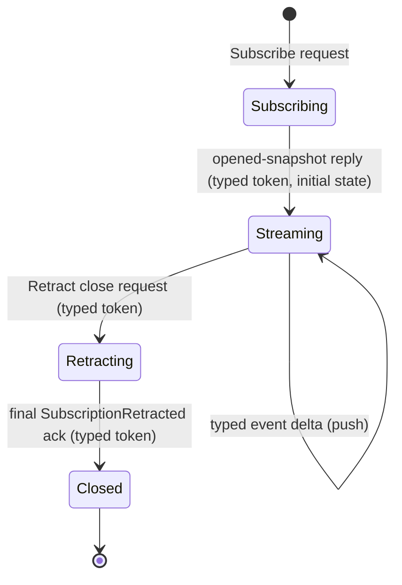

State definitions:

- **Subscribing** — the consumer has sent the typed `Subscribe`
  request. No events have arrived yet.
- **Streaming** — the producer has replied with the typed
  opened-snapshot record (carrying the per-stream token and the
  initial state). Typed delta events arrive on the stream as the
  producer's state changes.
- **Retracting** — the consumer has sent the typed `Retract`
  close request, naming the per-stream token. No more deltas
  will arrive after this point; the producer may have one or
  more in-flight deltas that already left its buffer.
- **Closed** — the producer has emitted the typed
  `SubscriptionRetracted` acknowledgement carrying the same
  per-stream token. The stream is over; the underlying
  connection may be reused for the next exchange or dropped.

The transitions are typed records, never bare socket events. A TCP
or Unix socket reset *is not* a `Retract`; it is transport failure,
which the consumer may observe but is not part of the subscription
protocol.

## The kernel grammar enforces it

`signal-core`'s `signal_channel!` macro enforces this shape at
compile time. From `signal-core/macros/src/validate.rs`:303–331,
every declared stream block must:

- name an `opens` reply variant (the typed snapshot reply);
- name an `event` variant carrying the typed delta;
- name a `close` variant in the request block, and that close
  variant **must be tagged `Retract`**;
- have a `token` type that matches the close variant's payload
  type — the per-stream identity flows through the close request
  unchanged.

This is the kernel saying: *the consumer-initiated close is a
typed request, and the per-stream token is the identity that
binds open, deltas, and close together*. A contract that tries
to model close as a reply-side-only event will fail the macro's
cross-reference check.

The grammar shape:

```text
signal_channel! {
    channel Harness {
        request HarnessRequest {
            ...
            Subscribe SubscribeHarnessTranscript(SubscribeHarnessTranscript)
                opens HarnessTranscriptStream,
            Retract HarnessTranscriptRetraction(HarnessTranscriptToken),
        }
        reply HarnessEvent {
            ...
            HarnessTranscriptSnapshot(HarnessTranscriptSnapshot),
            HarnessSubscriptionRetracted(HarnessSubscriptionRetracted),
        }
        event HarnessStreamEvent {
            TranscriptObservation(TranscriptObservation) belongs HarnessTranscriptStream,
        }
        stream HarnessTranscriptStream {
            token HarnessTranscriptToken;
            opened HarnessTranscriptSnapshot;
            event TranscriptObservation;
            close HarnessTranscriptRetraction;
        }
    }
}
```

The five records (`SubscribeHarnessTranscript`,
`HarnessTranscriptSnapshot`, `TranscriptObservation`,
`HarnessTranscriptRetraction`, `HarnessSubscriptionRetracted`) and
the one token type (`HarnessTranscriptToken`) carry the entire
lifecycle. Nothing is encoded in the socket state.

## Constraints every subscription satisfies

A subscription's producer is the actor that owns the state being
observed. The producer commits to all of these:

1. **The open reply is a typed snapshot.** When the producer
   accepts a `Subscribe` request, the immediate reply carries the
   per-stream token plus a typed snapshot of the current state.
   No "subscribe then ask separately for current state" — that
   recreates the race the open-snapshot is designed to remove.
2. **Deltas push as typed events.** Every state change emits a
   typed event on the stream. The event carries enough context
   to be interpreted alone; there is no implicit "ask after each
   delta" round-trip.
3. **A sequence pointer (or equivalent) orders the events.** The
   consumer can detect gaps and re-anchor after reconnection.
   The pointer is part of the event payload, not implicit in
   socket order.
4. **Close is a typed `Retract` request.** The consumer sends a
   typed request carrying the per-stream token. The kernel
   grammar enforces this.
5. **The final acknowledgement is a typed `SubscriptionRetracted`
   reply.** The producer emits one final typed reply carrying the
   same token; the stream ends after this event. The consumer
   knows the close was honored.
6. **Back-pressure is demand-driven.** The consumer signals
   capacity; the producer never overruns. When the consumer's
   buffer is full, the producer waits, retries, or fails fast —
   it never silently drops events.
7. **Slow consumers cannot block siblings.** Each subscription
   has its own per-subscription state on the producer side. A
   slow consumer holds back its own stream, not the producer's
   ability to serve other consumers.
8. **Subscription state survives restart if the producer's state
   does.** Durable subscriptions persist their registration; on
   restart, the consumer resumes from the recorded sequence
   pointer. Transient subscriptions explicitly re-open after
   producer restart.

Each item above corresponds to a constraint test the producer's
ARCHITECTURE.md should name. Per `skills/architectural-truth-tests.md`,
the test proves the path was used, not only that the reply looked
acceptable.

## The producer's three-actor shape

A long-lived push subscription is *stateful behavior across time*.
Per `skills/actor-systems.md`, that means actors. A subscription
producer typically owns three named planes:

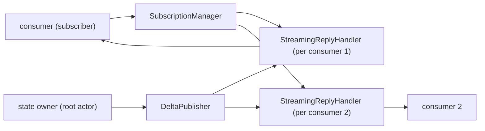

| Actor | Owns |
|---|---|
| `SubscriptionManager` | The set of open subscriptions: token → handler reference, registration metadata, ingress count, close discipline. Routes `Subscribe` and `Retract` requests to handlers. |
| `StreamingReplyHandler` | One per open subscription. Holds the connection, the per-stream token, the consumer's sequence cursor, the local outbound buffer, and the close ack flag. Receives `DeliverDelta` from the publisher; writes the event onto the wire. |
| `DeltaPublisher` | The fanout plane. Subscribes (in-process) to the root state actor's commit events; for each typed change, sends `DeliverDelta { event }` to every relevant `StreamingReplyHandler`. |

The publisher fans out by in-process actor mailbox sends, not by
shared lock or shared channel that consumers read from. Each
handler has its own mailbox; one slow handler stalls only its own
mailbox.

Scaled-down forms are acceptable when the design is small:

- **One subscription expected at a time:** collapse
  `SubscriptionManager` and `DeltaPublisher` into the root state
  actor; keep `StreamingReplyHandler` separate so slow consumers
  cannot block state changes.
- **No durable subscription state required:** skip the
  registration-record write; track only in-memory.

The three-actor split is the *full* shape the destination uses.
A prototype may scale down explicitly, with the ARCH naming the
scaled-down form and the constraint test naming what the
destination shape will check.

## Anti-patterns

**Reply-side-only retraction.** A contract that omits a
`Retract <name>` request variant and represents close only as a
reply event silently denies the consumer the right to close.
Either the consumer leaves the socket hanging (transport failure
as protocol) or it has no honest way to say "I am done." The
kernel grammar at `signal-core/macros/src/validate.rs:303–331`
rejects this shape.

**Socket close as semantic close.** Treating "the TCP/Unix socket
went away" as a `Retract` confuses transport failure with consumer
intent. A network partition is not consent. The typed close
request is the consent; the socket is the transport.

**Polling masquerading as subscription.** A "subscription" that
the consumer drives by re-asking on a timer is polling with a
nicer name. The producer pushes; the consumer reads from a long-
lived connection. If the consumer wakes on a clock to ask anything
about the producer's state, the producer's push side is incomplete.

**Shared lock for fanout.** A producer that holds an
`Arc<Mutex<Vec<Consumer>>>` and locks it to enqueue every delta
recreates the hidden-lock failure mode `skills/actor-systems.md`
warns against. Use per-consumer actor mailboxes for fanout; the
mailbox IS the per-consumer queue.

**No sequence pointer.** A stream without a per-event ordering
field cannot be re-anchored after a hiccup; the consumer cannot
prove it saw every event between two known points. Add a typed
sequence (newtype, not bare `u64`) to every event payload.

**Unbounded outbound buffer.** A `StreamingReplyHandler` whose
buffer can grow without limit translates a slow consumer into a
producer-side OOM. Bound the buffer; on overrun, the contract
defines the failure (drop the slow subscription with a typed
failure reply, or refuse to accept more events from the
publisher until the handler drains).

## When the open snapshot is empty

The open snapshot reply is never optional, but it may be empty.
A subscription opened against a fresh harness gets a snapshot
that says "current sequence = 0, current state = empty"; a
subscription opened against a long-running harness gets a snapshot
naming the current sequence and the current state.

The consumer always knows where it starts. There is no "I subscribed
but I don't know if I missed events" state.

## Reconnection and resume

When a subscription drops mid-stream (transport failure, producer
restart, consumer restart), the consumer reconnects by opening a
new subscription. The producer's `Subscribe` request can carry a
typed `resume_after` field (an optional sequence pointer); the
producer either:

- replays events from `resume_after + 1` if it has them in
  durable storage, then continues with live deltas;
- replies with `ResumeUnavailable` (a typed reply variant), and
  the consumer accepts the gap and restarts from snapshot.

Both choices are explicit, typed, and observable. The consumer is
never left guessing whether it has a complete view.

For prototypes that do not yet persist subscription state, the
typed resume request still exists in the contract; the producer
just always replies `ResumeUnavailable`. The destination shape is
present; the runtime is scaffolded.

## Witness shape

Every subscription producer's ARCHITECTURE.md names these tests:

| Constraint | Witness |
|---|---|
| Open returns typed snapshot with current sequence and state. | A subscriber connects to a fresh producer; assertion: the open reply is a typed snapshot record with the expected token. |
| One delta per state change, ordered by sequence. | Producer changes state N times; subscriber receives N events with sequence 1..N. |
| Close is a typed Retract request; final ack is typed. | Subscriber sends typed close request; final reply is the typed `SubscriptionRetracted` record carrying the same token. Stream ends after that frame. |
| Slow consumer does not block siblings. | Two subscribers; one stalls reads; producer keeps emitting deltas to the other subscriber within bounded latency. |
| Back-pressure is demand-driven. | When subscriber's buffer is full, the producer waits or fails fast per the typed contract; the producer never overruns. |
| Sequence pointer is monotonic. | A test reads N consecutive events and asserts the sequence field is strictly increasing. |

The tests use real actor mailboxes and real connections (Unix
sockets, in-process channels). Mocked subscription delivery is
forbidden — a mock cannot witness that the producer holds a real
per-subscription handler.

## See also

- `~/primary/ESSENCE.md` §"Polling is forbidden" — the upstream
  principle this skill implements.
- this workspace's `skills/push-not-pull.md` — when polling
  shows up, how to recognise it, how to escalate when the
  producer cannot yet push.
- this workspace's `skills/actor-systems.md` — actor-density
  rules; subscription producers are actor-shaped because they
  are stateful across time.
- this workspace's `skills/kameo.md` — runtime details for the
  three-actor shape in Rust.
- this workspace's `skills/contract-repo.md` — contract-crate
  conventions for declaring stream blocks.
- this workspace's `skills/architectural-truth-tests.md` —
  witness discipline for the constraints above.
- `signal-core/macros/src/validate.rs` lines 303–331 — kernel
  grammar that enforces the close-is-Retract rule.


## Verb belongs to noun

*Every reusable verb belongs to a noun. If you can't name the noun,
the model isn't formed yet — keep looking until you can.*

## What this skill is for

When you sit down to write a verb (a function, a method, a
dispatcher), apply this skill *before* you write. Ask: what type
owns this verb? If a type already exists, attach the verb as a
method. If no obvious noun exists, the model is incomplete — the
missing type is what the verb is asking you to declare.

This applies to any language with method dispatch (Rust, Python,
Go, Java, C++, Smalltalk) and is enforced by convention in
languages without it (C's `_operations` vtables, Haskell's
typeclass-constrained free functions). The discipline is universal
even when the syntax varies.

## The rule

Behavior that is reusable lives on a type. Free functions are for
things that genuinely belong nowhere else: a binary's `main`, a
small private helper inside one module, a pure mathematical
operation between values of equal status.

**Anti-pattern (named in prose, never shown as code per
`skills/skill-editor.md` §"Examples never show free
functions"):** a free `parse_query(text: &str) -> Result<QueryOp,
Error>` is a verb floating without a type. The `text`
parameter is the input the verb wants; the verb is the
affordance the *type around the parser state* should own.

```rust
// Right — verb on the type that owns it
struct QueryParser<'input> { lexer: Lexer<'input> }

impl<'input> QueryParser<'input> {
    pub fn new(input: &'input str) -> Self { … }
    pub fn into_query(self) -> Result<QueryOp, Error> { … }
}
```

The rule is not aesthetic. It is a forcing function.

**Free functions are incorrectly specified verbs.** They encode an
action without naming the noun that owns it. When you reach for
one, slow down and find the noun — the type that has the affordance
this verb describes. If no obvious noun exists, the *model* is
incomplete; the missing type is what the verb is asking you to
declare.

## Affordances vs operations

Methods encode **affordances** — what kinds of things a value of
this type *can do*. Free functions encode **operations** that
happen to take some arguments. The distinction is structural.

In the real world, fruits can be eaten and clouds cannot. Code
that models the world correctly says `fruit.eat()`, not
`eat(fruit)`. The method form binds the verb to the type that
owns it. The free-function form lets the verb float — and
`eat(cloud)` becomes thinkable, type-checked only if you happen
to have given `Cloud` an explicit "missing eat" marker.

The vocabulary comes from outside CS. James Gibson's 1979
*Ecological Approach to Visual Perception* defined an *affordance*
as "what [the environment] offers the animal, what it provides or
furnishes, either for good or ill." Donald Norman's 1988 *Design
of Everyday Things* applied it to artifacts: a door's handle
affords pulling; a flat panel affords pushing. The affordance is
a property of the relationship between the object and the agent.

A method-bearing type *advertises* its affordances at every call
site. A passive record next to a free-function library does not.
The type system knows which is which only when the operations are
attached to the things that own them.

## The forcing function

The deeper purpose of the rule is not what it makes you write;
it's what it makes you do *before* you write.

If you sit down to write a verb, the rule forces the question:
*what type owns this verb?* Sometimes the answer is obvious — a
method on an existing type. Sometimes the answer is "no type
exists yet for this," and the rule forces you to invent one.
That forced invention is the load-bearing cognitive event.

Without the rule, the verb gets written as a free function and
the noun never appears. The model develops gaps: verbs without
owning nouns, missing structural types, behavior smeared across
the call graph. Programs that "look fine" end up missing whole
structural types they ought to have.

The pattern is named in the refactoring catalogue. Martin Fowler:
**Feature Envy** is "a method that seems more interested in a
class other than the one it is in" — a verb in the wrong place.
**Data Class** is the same drift seen from the other side — a
type with no behavior because the verbs that should have lived
on it ended up elsewhere. **Anemic Domain Model** is the
codebase-scale form. The cure for all three is the same:
*Move Function* / *Extract Class* — find the type, attach the
verb.

The rule is: do this once, up front, instead of accumulating the
debt and refactoring later.

## Why this matters more for LLM agents

Humans procrastinate creating types because typing out
`struct QueryParser { … }` *feels heavier* than `fn
parse_query(…)`. There is tactile friction in declaring a noun,
naming its fields, deciding its constructor. That friction is a
feature: it makes humans ask "is this type pulling its weight?"
before paying the cost.

LLMs have no such friction. Generating `struct QueryParser` and
generating `fn parse_query` cost the same number of tokens, take
the same wall-clock time, and produce no felt sense of "this is
heavy." The result is predictable: LLMs default to whichever
shape is *shorter* — almost always the free function.

The rule reintroduces, by fiat in a style guide, the friction
the substrate has erased. It changes what the agent can think,
by changing what it is *required* to write.

The empirical work on LLM-generated code documents the symptoms
without naming the cause. Tambon et al. 2024 found LLM output is
"shorter yet more complicated" than canonical solutions, with
"misunderstanding and logic errors" as the largest bug category.
Spinellis et al. 2025 found 33.7% of LLM-generated JavaScript
contains "unused code segments" and 83.4% of Python shows
"invalid naming conventions." The underlying failure is **verbs
without owning nouns**: naming conventions go bad because there
is no type to anchor a name to; unused code accumulates because
nothing carries a clean responsibility.

## The Karlton bridge

Phil Karlton: "There are only two hard things in Computer
Science: cache invalidation and naming things."

When an LLM agent skips creating a type, **it skips the naming
step entirely.** The hard thing is not avoided; it is hidden.
The methods-on-types rule restores the hard step into the
workflow, where it belongs.

This is the cleanest one-line statement of the rule's purpose:
*the rule exists to make sure naming happens.*

## Principled exceptions

The rule has carve-outs, named directly. Use them honestly; they
are not a back door for skipping the noun-creation step.

### The local-helper carve-out

A small private helper inside one module is fine if it is
genuinely local — a three-line `fn hex(h: &Hash) -> String` next
to a single `Display` impl is not a missing noun, it is a
private fragment of one impl. The rule kicks in when the verb is
*reusable* — when more than one caller might want it, when it
would be discoverable from multiple sites, when its life as a
free function would let it spread.

### The relational-operation carve-out

Some operations are genuinely **relational** between two values
of equal status, with no state on either side. `add(a, b)` over
two numbers is the canonical case. William Cook's 2009 essay
*On Understanding Data Abstraction, Revisited* gives the formal
frame: ADTs (operations outside the data) and objects (operations
inside the data) are dual / complementary, neither wrong. Pure
mathematical operations fit the ADT axis.

In practice, in object-oriented or method-bearing languages, this
exception is usually expressed via operator overloading — `a + b`
desugars to `Add::add(a, b)`, which IS a method on a type, just
with operator-syntax sugar. The rule is preserved.

### The standard-library carve-out

Names inherited from well-known libraries get to keep their
shape. `serde_json::from_str` and `serde_json::to_string` are
free functions because the ecosystem convention demands them. A
serde-format crate that hides this convention behind methods
would surprise every user who has ever reached for `serde_json`.
The carve-out is **narrow**: the crate-root `from_str` /
`to_string` shape is preserved; everything inside the crate's
own implementation should still attach behavior to its owning
types.

The general principle: don't invent gratuitous deviations from
established conventions, but don't let "convention" be a sloppy
excuse for missing types.

### When the language doesn't have methods

The rule still applies. C codebases follow it via vtables —
`struct file_operations`, `struct inode_operations`, `struct
backlight_ops` in the Linux kernel. Behavior is attached to the
type; only the dispatch is manual. Haskell follows it via
typeclass-constrained free functions — `Eq a => a -> a -> Bool`
is conceptually a method on `a` even though the syntax is
top-level. Python follows it via `class … def …`. The discipline
is universal even when the syntax varies.

### Actor frameworks

Some actor frameworks force a behavior-marker type whose only job is
satisfying the framework's trait shape — a ZST with the trait impl
plus a separate `State` type that carries the actual data. Verbs
then drift onto `State`, leaving the named noun (the behavior marker)
empty. The workspace's runtime, **Kameo**, doesn't have this problem:
`Self` IS the actor, and the actor type carries fields directly.

The verb-belongs-to-noun rule applies sharply here. In Persona,
`ClaimNormalizer` should be the actor type — fields, construction,
methods, and `Message<T>` impls all on the same noun. There is no
separate marker, no separate `State`, and no automatic `*Handle`
boilerplate between the actor and its callers. A public domain
facade is still allowed when it earns its place under
`skills/kameo.md` §"Public consumer surface — ActorRef<A> or domain
wrapper". The data-bearing actor IS the noun the verbs attach to.

For the workspace's actor discipline, see `skills/actor-systems.md`
(architectural rule) and `skills/kameo.md` (Rust shape).

## What "find the noun" actually looks like

When the rule's question — "what type owns this verb?" — is
hard, that hardness is a signal. The signal is that the model
of the problem isn't fully formed yet. Three kinds of resolution:

1. **The noun already exists.** You missed it. Attach the verb
   as a method.
2. **The noun is implicit but unnamed.** A `parse_query` free
   function already has a `QueryParser` inside it: parser
   state, input cursor, error context. Name it. Make the
   implicit explicit.
3. **The verb is genuinely relational.** Two values of equal
   status, no state, no privileged owner. Use the relational-
   operation carve-out.

If none of these apply, you don't have a clean program model
yet. Slow down. Don't paper over the gap with a free function.

## The wrong-noun trap

The rule says every reusable verb belongs to *a* noun. The
discipline is sharper: it belongs to **the right** noun — the
one whose primary concern matches the verb's concern. Picking a
nearby noun "because it's already there and might as well own
this too" is a failure mode the rule's surface form doesn't catch
on its own. Adjacency of *types* is not the same thing as
adjacency of *concerns*.

Concrete shape — two proc-macro crates sitting close together:

```
   text-codec-derive          schema-derive
   ─────────────────────      ──────────────────────
   concern: text              concern: schema
     encode / decode            introspection over
                                record types
   verbs:                     verbs:
     emit codec impls           emit per-kind schema
                                descriptors
```

Both crates touch the same underlying record types — the text
codec consumes records as its input. The temptation is to put
schema introspection into text-codec-derive "because it already
sees the types." That puts the verb (introspecting record types)
on the wrong noun (the text codec). The right noun is
schema-derive, because schema introspection is the *schema's*
concern; the codec is downstream of the schema, not the other
way around.

The diagnostic, when finding the noun: if the answer sounds like
*"well, this nearby type **could** hold it,"* slow down. The
right noun is the one whose primary concern matches the verb's
concern. The merely-convenient noun produces all the same
maintainability problems as putting the verb on no type at all,
plus the extra cost that it now actively *hides* the missing
proper noun.

The rule, sharpened: when two crates / two types / two modules
have similar surface (touch the same data; have similar names)
but different *concerns*, the verb goes with the concern, not
with the surface.

This pairs with this workspace's `skills/micro-components.md` —
the same discipline at the crate boundary. One capability per
crate; "the new crate's surface is similar to the existing one"
is not by itself a reason to fold them.

## Schema-emitted nouns

When the workspace's schema-derived stack is in play, the **nouns
come from the schema**. Authoring a `.schema` file declares the types
(structs, enums, newtypes); `schema-rust-next` emits the Rust
declarations + codec impls + dispatch tables. The agent's Rust code
attaches **methods** to those emitted nouns. Per psyche record 858 +
the workspace records 712 / 729 / 853 lineage.

The labor split is sharp:

| Layer | Provides |
|---|---|
| `.schema` file (authored) | The data objects + traits (implied by signal/nexus/SEMA interaction) |
| Emitted Rust (machine-written) | Type declarations + codec impls + headers + dispatch tables |
| Agent-written Rust (methods) | Behavior on the schema-emitted objects |

The forcing function from §"The rule" applies sharply here: when
reaching for a verb in the schema-derived stack, the noun is almost
always **already named** by the schema. If you find yourself writing a
free function whose arguments include schema-emitted types, the verb
belongs as a method on whichever emitted type is the primary subject.

```rust
// Right — verb on the schema-emitted noun
impl Engine {
    pub fn handle(&self, input: Input) -> Output { match input { ... } }
}

// Wrong — free function with schema-emitted types as arguments
fn dispatch(engine: &Engine, input: Input) -> Output { ... }
```

The corollary discipline (per psyche record 855 — the change-loop):
**don't hand-edit generated data type mirrors.** When you need to
change a data type, edit the `.schema` and regenerate; the methods
you've written against the previous emission will either compile
against the new shape (good) or surface their assumptions as compile
errors (also good — the type system caught the change).

The runtime triad lens (per `skills/component-triad.md` §"Runtime
triad — Signal / Nexus / SEMA"): schema emits the nouns each layer
operates on. Signal's Operation, Nexus's Action / Response,
SEMA's stored archive types — all emitted. Methods on each layer's
Rust types attach to whichever schema-emitted noun is the primary
subject.

## Companion disciplines

This rule pairs with three others that push the same direction:

- **Wrapped field is private.** A newtype wraps a primitive to
  give it identity; if the wrapped field is `pub` (`Slot(pub
  u64)`), callers can construct unchecked values and read raw
  bytes back out, defeating every reason to wrap. Same
  discipline: the type owns its representation. (Rust enforcement
  in this workspace's `skills/rust/methods.md` §"Domain values
  are types".)

- **Perfect specificity.** Every typed boundary in the system
  names exactly what flows through it — no wrapper enums that
  mix concerns, no string-tagged dispatch, no generic-record
  fallback. Same discipline: the type system carries the
  meaning, not stringly-typed metadata.

- **Engine logic = enum-vs-enum cross-product.** When two enums
  meet under `match`, the cross-product of their variants is the
  typed relationship — make it explicit, either as a nested match
  or as a named trait (`Reaches<Right>`, `Contact<Other>`,
  `Dispatch<Token>`). Same discipline at the *engine* layer:
  the contact point between two structured inputs IS a noun,
  and naming it surfaces logic that would otherwise scatter into
  `if` chains, sentinel booleans, or string predicates. Full
  rule: this workspace's `skills/enum-contact-points.md`.

All four rules say the same thing in different domains: **the
type system is the model**. Use it.

## The one-line summary

**Every reusable verb belongs to a noun. If you can't name the
noun, you haven't found the right model yet — keep looking until
you can.**

## See also

- this workspace's `skills/beauty.md` — beauty as the criterion;
  a free function in the wrong place is one of the diagnostic
  readings.
- this workspace's `skills/naming.md` — full English words; the
  forced naming step this rule restores.
- this workspace's `skills/micro-components.md` — same discipline
  at the crate boundary.
- this workspace's `skills/rust-discipline.md` — Rust-specific
  enforcement (no ZST method holders, domain newtypes, one-object
  in/out).
- lore's `rust/style.md` — toolchain reference (Cargo.toml shape,
  cross-crate deps, pin strategy).


## Naming

*Identifiers are read far more than they are written. Spell every
identifier as a full English word; let the right name happen. And
the partner rule: names don't carry their full ancestry — the
surrounding namespace already supplies that context.*

## What this skill is for

Apply this skill every time you name an identifier — a type, a
function, a field, a variable, a module, a parameter. **Two
rules apply together, pulling in opposite directions:**

1. **Spell every identifier as a full English word.** The
   default is the spelled-out English form; abbreviations require
   one of six narrow exceptions (§"Permitted exceptions" below).
   Skim the offender table when you catch yourself reaching for
   `ctx`, `tok`, `op`, `de`, or any two-to-three-letter shape.
2. **Names don't carry their full ancestry.** A type, variant,
   or field belongs to its surrounding namespace; repeating the
   namespace is redundant ceremony (§"Anti-pattern: prefixing
   names with their namespace or domain" below). Inside `Profile`,
   the field is `size`, not `profileSize`. Inside
   `signal-persona-spirit`, the type is `Entry`, not `IntentEntry`.

The two only work as a pair. "Full word" without the ancestry
rule produces `IntentRecordIdentifier` (every ancestor named).
The ancestry rule without "full word" produces `Id` or `Ctx`
(short, but abbreviated). Apply both; the right name carries the
words the namespace doesn't, in full English.

This skill pairs with the **verb-belongs-to-noun** discipline
(workspace `skills/abstractions.md`) — that rule forces a naming
step to happen at all; this one decides what the name should look
like once you're forced to choose.

## The default

**Spell every identifier as full English words.**

Identifiers are read far more than they are written. Cryptic
abbreviations optimize for the writer (a few keystrokes saved) at
the reader's expense (one mental lookup per occurrence).

Examples (bad → good):

| bad | good |
|---|---|
| `lex` | `lexer` |
| `tok` | `token` |
| `id` / `ident` | `identifier` |
| `op` | `operation` (or specific: `assert_op`) |
| `de` | `deserializer` |
| `pf` | `pattern_field` |
| `ctx` | `context` (or specific: `parse_context`) |
| `cfg` | `config` (or `configuration`) |
| `addr` | `address` |
| `buf` | `buffer` |
| `tmp` | `temporary` (or — better — name what it holds) |
| `arr` | `array` (or — better — what it contains) |
| `obj` | (name what it actually is) |
| `params` | `parameters` |
| `args` | `arguments` |
| `vars` | `variables` |
| `proc` | `procedure` or `process` |
| `calc` | `calculate` |
| `init` | `initialize` |
| `repr` | `representation` |
| `gen` | `generate` or `generator` |
| `ser` / `deser` | `serialize` / `deserialize` |

## Permitted exceptions — tight, named, no others

1. **Loop counters in tight scopes (<10 lines).** `for i in 0..n`
   is fine. Beyond ~10 lines or nested, use descriptive names.
2. **Mathematical contexts** where the math itself uses the symbol.
   `x`, `y`, `z`, `theta`, `phi`, `lambda`, `n` for sample size,
   `p` for probability — only when the surrounding code or comment
   establishes the math context.
3. **Generic type parameters.** `T`, `U`, `V`, `K`, `E`. Use a
   descriptive name when the parameter has non-trivial semantic
   content.
4. **Acronyms that have fully passed into general English.**
   `cpu`, `url`, `http`, `json` are the canonical examples —
   the acronym has functionally become the English word; the
   spelled form ("hypertext transfer protocol", "javascript
   object notation") is awkward or no longer remembered.
   *"no one even knows what JSON actually extends to."* Use
   these freely.

   The test for adding others: *has the acronym functionally
   become the English word?* `uuid`, `tcp`, `udp`, `dns` often
   qualify in the right context — apply the test case-by-case.
   Internal short forms of system concepts (`db`, `os`, `ui`,
   `io`, `ram`) are convenience shortenings, not English words
   — spell them (`database`, `operating_system`, `interface`
   if user-interface is meant) unless the spelled form is
   itself awkward.

   Do **not** use `id` — spell `identifier`; the psyche has
   been explicit: *"identifier is actually better."* Most
   code-side "acronyms" are convenience shortenings (`ctx`,
   `cfg`, `addr`, `tok`, `buf`, `proc`) and belong in the
   offender table above, not in this exception.
5. **Names inherited from `std` or well-known libraries.** `Vec`,
   `HashMap`, `Arc`, `Rc`, `Box`, `Cell`, `RefCell`, `Mutex`,
   `mpsc`, `regex`. Do not rename these; do *not* extend the
   abbreviation pattern to your own types.
6. **Domain-standard short names already documented in an
   `ARCHITECTURE.md`.** `slot`, `node`, `edge`, `frame` are full
   words and need no exception. If a true short form is
   load-bearing in the schema, name it in `ARCHITECTURE.md` so the
   exception is explicit; otherwise spell it out.

## Rule of thumb

**Name length proportional to scope.** A 3-line loop counter can
be `i`. A module-level type that appears across the codebase must
spell itself out. A function parameter that lives for 50 lines
must read as English.

## What this rule is NOT

- Not "verbose names everywhere" —
  `calculate_the_total_amount_of_items` is worse than
  `total_items`. The goal is *clear*, not *long*.
- Not "no acronyms ever" — see exception 4.
- Not "rewrite std" — see exception 5.

## Different scopes get different names

When a workspace concept names both **what is built today** and the
**larger eventual form** it is one step toward, those are different
things and get different names. Same-name conflation lets the
encompassing vision silently overwrite today's snapshot — readers
can't tell which scope a doc is in.

Today's piece earns a concrete narrower name. The eventual name
stays reserved for the realized form. Live examples in this
workspace:

- `sema-db` (today's typed database library) vs `Sema` (the
  eventual universal medium for meaning).
- The current `criome` daemon (today's sema-ecosystem records
  validator) vs `Criome` (the eventual universal computing paradigm
  in Sema).

**This is a scope discipline, not a quality one.** Today's narrower
piece is held to ESSENCE's full priorities — built rightly for its
scope, not as a draft of the eventual. "Today's piece" is not a
license to cut corners or write slop.

See `~/primary/ESSENCE.md` §"Today and eventually — different
things, different names" for the upstream framing.

## How to apply when generating code

When generating new code: **spell identifiers as full English
words by default.** When the surrounding code uses cryptic
identifiers, do not propagate them into new code. Either rename
(if rename is in scope) or use the full form for new identifiers
and flag the inconsistency as a follow-up. Pattern-matching the
local dialect is exactly the failure mode this rule exists to
break.

## The "feels too verbose" anti-pattern

When a spelled-out name (`AssertOperation`, `Deserializer`,
`PatternField`, `RelationKind`) "feels needlessly verbose" — that
feeling is **not** a signal to shorten the name. It is a signal
that the writer has been taught wrong by a culture inherited from
constraints that no longer apply.

The full word reads as English. The abbreviation reads as ceremony
to be decoded. The cost of mis-naming is paid every time the name
is read; the benefit of saving three keystrokes is paid once.
There is no contest.

When you catch yourself thinking "this name feels too long" or
"this is unnecessarily ceremonial":

1. **Question the feeling.** It is almost certainly inherited
   prejudice, not informed judgment.
2. **Re-read the name as English.** Does `AssertOperation` read as
   English? (Yes.) Does `AssertOp` read as English? (No — it
   requires expansion.)
3. **Apply the rule.** The full English form wins unless the name
   falls in one of the six named exception classes above.

There is no exception class for "feels verbose." That feeling is
the bug, not the criterion.

## Field naming — `profileSize` vs `size` vs `profile::size`

When naming a field, method, or local that *could* be just a
short word (`size`, `id`, `name`, `body`), the question is:
**does the surrounding namespace already give the noun?**

- If the access path is `profile::size` (module path) or
  `profile.size` (struct field of a `Profile`-typed thing),
  then `size` reads as English at the call site —
  `profile.size` *is* the description.
- If the field stands alone, naked, with no enclosing
  namespace (a top-level binding, an unqualified function
  parameter, a record field that often appears outside its
  parent type's context), then `size` is too thin —
  `profileSize` carries the missing context.

```rust
// Right — namespace already qualifies; field name stays short
struct Profile {
    pub size: u64,        // accessed as profile.size
}

// Right — naked parameter with no enclosing namespace; name carries the context
impl MetricsRecorder {
    pub fn record(&self, profileSize: u64, requestCount: u32) { … }
}

// Wrong — descriptor's namespace already names "profile"; field name redundant
struct Profile {
    pub profileSize: u64,  // profile.profileSize reads as repetition
}

// Wrong — naked parameters claim a context that isn't there
impl MetricsRecorder {
    pub fn record(&self, size: u64, count: u32) { … }
    //                   ^^^^         ^^^^^ which size? which count?
}
```

The rule: **the name carries the context the namespace
doesn't.** Tests:

- *Will the reader see this name with or without its
  enclosing namespace?*
- *Does the namespace already name the thing the field
  describes?*

If both answers are "with namespace + namespace names it,"
the field name can be short. If either answer is "without
namespace" or "namespace doesn't name it," the field name
needs the descriptive prefix.

The discipline is logical-plane separation: naked names
*claim* a context they don't have. Naked names that survive
in code are silent failures of clarity that the type system
can't catch.

This refines the "full English words" rule: it isn't *more
words* that wins — it's *the words the namespace doesn't
already supply*. `messageId` when there's no `Message`
namespace; `id` when there is.

(Per Li 2026-05-09: "I prefer more indirection and logical
planes, more naming accuracy — `profileSize` is better than
`size`, unless it is `profile::size`.")

## Anti-pattern: prefixing names with their namespace or domain

**A name belongs to its surrounding context, not to the
cross-crate global namespace.** The crate, module, contract,
channel, enclosing enum, and owning component are all namespaces.
Repeating any of them in the type, variant, field, or payload name
is redundant ceremony.

```rust
// Wrong — crate name redundant at every use site
pub struct ChromaRequest { … }
pub struct ChromaResponse { … }
pub struct ChromaConfig { … }
pub struct ChromaError { … }

// Right — call sites read chroma::Request, chroma::Error
pub struct Request { … }
pub struct Response { … }
pub struct Config { … }
pub struct Error { … }
```

For contract crates, the same rule applies to the contract's domain:

```rust
// Wrong — the contract crate already says repository-ledger
pub struct RepositoryPushObservation { … }
pub struct RepositoryChangedFileQuery { … }
pub enum RepositoryLedgerRequest {
    RepositoryPushObservation(RepositoryPushObservation),
}

// Right — use-site context reads signal_repository_ledger::PushObservation
pub struct PushObservation { … }
pub struct ChangedFileQuery { … }
pub enum Request {
    PushObservation(PushObservation),
}
```

The discriminator: **does the leading word *describe* the type, or
does it name a namespace already visible at the use site?**
Descriptive words stay; namespace prefixes go.

| Prefix is wrong | Prefix is fine |
|---|---|
| `ChromaRequest` (Chroma is the crate) | `VisualState` (Visual describes what kind of state) |
| `StylixOptions` (Stylix is the crate) | `ColorScheme` (descriptive) |
| `NotaCodecError` | `LexerError` |
| `PersonaMessageRouter` | `MessageRouter` |
| `RepositoryChangedFileQuery` inside `signal-repository-ledger` | `ChangedFileQuery` |
| `HarnessHarnessEvent` inside `signal-persona-harness` | `LifecycleEvent` |

**The standard library is the canonical reference.** `Vec`,
`HashMap`, `Arc`, `Cell`, `Mutex` — never `StdVec`,
`StdHashMap`, `StdArc`. The pattern propagates: well-shaped
crates name their types as if `use crate_name::*` were the
norm, even when it isn't.

**Why LLM agents are particularly prone to this:** the
prefix "feels safe" (avoids collisions, matches the file
name, looks self-documenting) and tokens are free. Same
procrastination pressure as in `skills/abstractions.md` —
the agent skips the harder thinking ("what does this type
actually represent?") in favour of the shallower
disambiguator ("which crate is it from?"). Both produce
the same drift: structural meaning hidden by ceremony.

The Rust enforcement (with std references) lives in
`skills/rust-discipline.md` §"No crate-name prefix on
types"; this section is the cross-language form.

## Anti-pattern: repeated category words across sibling names

When several adjacent types or variants share the same prefix
or suffix — `*Query`, `*Command`, `*Event`, `*Listing`,
`*Selection`, `*Mode`, `*Result` — stop and ask which layer
the repeated word belongs to. It may be a missing parent enum,
relation, record, module, contract operation, or lower execution
effect that has been exposed at the wrong layer. Repeated
category words are **schema smells**, not naming choices.

```rust
// Wrong — Query repeated as a suffix across five siblings
Match EventQuery(EventQuery),
Match RecentRepositoriesQuery(RecentRepositoriesQuery),
Match ChangedFileQuery(ChangedFileQuery),
Match CommitMessageQuery(CommitMessageQuery),
Match CatalogQuery(CatalogQuery),

// Possible correction — Query is the parent enum; siblings name read targets
Match Query(Query),

pub enum Query {
    Events(EventSelection),
    RecentRepositories(RecentRepositorySelection),
    ChangedFiles(ChangedFileSelection),
    CommitMessages(CommitMessageSelection),
    Catalog(CatalogSelection),
}
```

That correction is not automatic. If `Query` is the public act
this contract receives, it may belong one layer higher as a
contract operation, while the lower database/read operation stays
inside the daemon:

```rust
// Also possible — Query is the contract operation.
operation Query(Query)

// The daemon may lower it internally to a Sema Match effect.
```

The threshold is behavioral, not numeric: when you find
yourself adding a third sibling with the same suffix, stop
and ask. The schema is asking for a new structural layer; do
not decide in advance whether that layer is a parent payload,
a contract operation, or a lower execution effect.

**Why this rule pairs with the no-redundant-ancestry rule.**
The ancestry rule says "don't restate what the namespace
already supplies." The repeated-category rule says "if a word
recurs across siblings, the schema is missing a namespace
that would supply it." Together: names carry only what the
schema's structure doesn't carry; when names repeat a word,
that word should become structure.

This is one of two failure modes that produce flat schemas
where the schema should grow into a tree (the other being the
redundant-prefix pattern above). Both diagnose agents who
don't see the schema as a growing tree.

## Anti-pattern: framework-category suffixes on type names

**A type's name should describe what it IS or what role it plays
— never the framework category it falls into.** A `Counter` that
implements the `Actor` trait IS an actor; calling it `CounterActor`
adds the category to the name without adding meaning.

```rust
// Wrong — framework-category suffix
pub struct CounterActor { count: i64 }
pub struct IncMessage { amount: i64 }
pub struct ClaimNormalizerActor { … }
pub struct SubmitMessage { … }

// Right — name says what the type IS / does
pub struct Counter { count: i64 }
pub struct Inc { amount: i64 }
pub struct ClaimNormalizer { … }
pub struct Submit { … }
```

The discriminator: **does the suffix describe the type's role, or
does it tag the framework category the type happens to fall into?**
Role-shaped suffixes stay; category-shaped suffixes go.

| Suffix is wrong (framework category) | Suffix is fine (descriptive role or relationship) |
|---|---|
| `*Actor` | `*Supervisor` (this type supervises children) |
| `*Message`, `*Msg` | `*Resolver` (this type resolves something) |
| `*Handler` | `*Decoder`, `*Encoder` (this type decodes/encodes) |
| `*Listener`, `*Subscriber` (as a generic trait-participation tag — `EventSubscriber` to mean "thing that implements `Subscribe`") | `*Tracker`, `*Cache`, `*Ledger` (this type holds that state); also `Subscriber` as the *role* of the long-lived actor on the receiving side of a publish/subscribe channel — that's role-naming, not category-tagging |
| `*Object`, `*Type`, `*Class` | `*Builder`, `*Factory` (when actually building things) |
| | `*Handle`, `*Client`, `*Ref` — relationship-naming (the value IS a held authority on the target; same shape as `JoinHandle`, `FileHandle`) |

**Note on `Handle`**: `Handle` is *not* a framework-category tag in the
same shape as `Actor` / `Message` / `Handler`. It names a relationship —
the value IS the caller's held authority to a live service or resource.
Same pattern as `tokio::task::JoinHandle` (a handle to join a task) or
`std::fs::File` / `std::process::Child` as held-resource types.
`*Handle` earns its place when the wrapper carries domain content
(lifecycle ownership, capability narrowing, error vocabulary mapping,
topology insulation, or send-policy enforcement). For the actor-specific
application of *when* a Handle is appropriate, see this workspace's
`skills/kameo.md` §"Public consumer surface — ActorRef<A> or domain
wrapper".

A bare `Handle` wrapper that just holds an `ActorRef<A>` and delegates
method-by-method without adding domain content is still the
runtime-laundering anti-pattern operator/103 retired — drop the wrapper
and expose `ActorRef<A>` directly.

The rule's deeper purpose: type names are read at every use site,
and a category tag forces the reader to mentally strip it ("oh,
`CounterActor` — that's a Counter that's an Actor — well it's
always going to be an Actor in this codebase, so just Counter").
That mental strip is paid every time. Drop the tag; let the type
name carry meaning.

**Why LLM agents are particularly prone to this:** category tags
"feel safe" (they document the framework participation visibly,
match common tutorial conventions, look self-explanatory). Same
procrastination pressure as crate-name prefixes — the agent reaches
for the shallower disambiguator instead of doing the harder work
of finding the right role-shaped name.

For the actor-specific application of this rule (with worked
examples and the historical context — ractor's behavior-marker
+ State split made the suffix briefly defensible; Kameo's
`Self`-IS-the-actor shape removed even that), see this workspace's
`skills/kameo.md` §"Naming actor types".

## Schema and emitted Rust mirror each other

Per spirit record 952 (High, 2026-05-27): the naming system between
schema-emitted code and Rust source **mirrors each other**. *"You
can use the naming system that way to like a mirror."* The
colon-path namespace in a schema (e.g. `spirit:signal:Frame`)
maps directly to the Rust module-and-type path
(`spirit::signal::Frame`) — colon-to-double-colon, kebab-case
crate names becoming snake_case module names, PascalCase type names
unchanged.

Two consequences:

- **Grep across both surfaces uses the same identifier.** Looking
  for `Frame` in the schema file and `Frame` in the emitted Rust
  finds the two views of one identity.
- **The schema is a sufficient entry point and so is the emitted
  Rust.** An agent reading either can locate the other
  mechanically — no separate mapping table.

The property pairs with the side-by-side file placement (per record
909): emitted Rust lives at `src/schema/<module>.rs` inside the
consumer crate, alongside hand-written Rust. The two surfaces sit
together; the mirror-naming makes them navigable in either
direction.

## Companion rule

Pairs with this workspace's `skills/beauty.md`: a name that
doesn't read as English is one of the diagnostic readings of
structural ugliness. The aesthetic discomfort is the signal that
the right structure (the right name, the right type) hasn't been
found.

## See also

- this workspace's `skills/beauty.md` — beauty as the criterion;
  bad names are a diagnostic reading.
- this workspace's `skills/abstractions.md` — verb-belongs-to-noun;
  this rule restores the naming step LLM agents tend to skip.
- this workspace's `skills/stt-interpreter.md` — the
  table-of-mappings shape, applied to speech-to-text mishearings
  rather than code abbreviations.
- this workspace's `skills/rust-discipline.md` — Rust-specific
  application (the cryptic-dialect example, the offender table
  again with Rust-flavor entries).
- this workspace's `skills/component-triad.md` §"Component binary
  naming" — applies the no-redundant-ancestry rule to component
  binaries: the CLI takes the short role-name (because the shell
  context supplies the rest), the daemon takes `<component>-daemon`
  (because process listings need the disambiguator).


## Push, not pull

*The principle is in `ESSENCE.md`. This skill is how to act
on it: how to recognise polling, how to design a
subscription, and how to escalate when the producer can't
push.*

## What this skill is for

When you have a producer of state and a consumer of changes,
this skill applies. The principle — **polling is forbidden;
producers push; consumers subscribe** — lives in `ESSENCE.md`
§"Polling is forbidden". Read it before reading further;
this skill assumes the rule and only describes how to act.

If you find yourself reaching for a polling loop, stop.
Apply the steps below.

## How to apply when designing

When designing or reading a producer-consumer interaction:

1. **Find the producer.** What component owns the state the
   consumer cares about?
2. **Find or build the producer's subscription primitive.**
   A callback registration, an event stream, a long-lived
   RPC, a Unix-socket subscriber pattern, an `inotify` watch
   on a file, a `timerfd` deadline. The shape varies; the
   contract is the same — the producer pushes; the consumer
   registers once.
3. **Write the consumer as a subscriber.** No `sleep(N)` in
   the consumer's main loop; no `interval` timers; no
   "check every K seconds" comments.
4. **If the producer can't push**, escalate (see below). Do
   not write a poll loop "for now."

In actor systems, each actor's mailbox is already a push
channel; nothing in the actor model requires polling. In
databases with change feeds, subscribe to the feed. In UIs
over a backing store, the store emits change events.

An actor handler that blocks has also violated push discipline:
while it waits, the mailbox cannot accept the next pushed fact.
Split the wait into its own actor or worker-pool actor. The
domain actor sends a typed request and returns to its mailbox; the
IO/command/clock actor replies when the producer has an event.

## Subscription contract

Every push subscription emits the producer's current state
when the consumer connects, then emits deltas after that.
The consumer must not perform a separate "what is it now?"
query or poll to seed itself.

This initial event is part of the producer contract. Without
it, a consumer can subscribe after a state already exists and
then wait forever for a change that never comes. "Subscribe,
receive current state, then receive changes" is the standard
shape for focus state, input-buffer state, message tails, and
any other stateful stream.

## When the producer can't push — the escalation rule

If the producer's subscription primitive doesn't exist yet,
the right path is one of:

1. **Build the primitive in the producer.** Usually the
   right answer if the producer is in scope.
2. **Replace the producer.** If the producer can't be
   modified, replace it with one that can push.
3. **Defer the dependent feature.** Real-time behavior
   waits until push ships. State this explicitly; don't
   pretend the feature is shipping.
4. **Escalate.** If none of (1)–(3) resolve the case at
   hand, the question goes up — to the next level of design
   responsibility, and ultimately to the human.

**Escalation is the correct outcome** when no push answer
is found. It is not a failure mode; it is the discipline
working. The human (or the next level of authority) decides
whether a new carve-out is justified, whether the producer
should be rebuilt, or whether the feature should wait.

The wrong outcome — falling back to a poll — is never the
answer. A poll once written is rarely removed; the cost is
paid forever.

## The named carve-outs

`ESSENCE.md` names three carve-outs that look polling-shaped
but aren't:

- **Reachability probes** ("is service X alive?").
- **Backpressure-aware pacing** (consumer drains its own
  buffer; producer still pushes).
- **Deadline-driven OS timers** (`timerfd` and equivalents;
  the kernel pushes the wake).

These three are exhaustive. When a design seems to need
polling and *none* of the three apply, the design needs an
escalation, not a fourth de-facto carve-out. Reach for the
escalation rule above; don't invent a local exception.

## Common pull-shaped traps

Patterns that smell ok but are actually polling:

- **A loop that re-reads a file every N ms** to detect
  changes. Polling. Replace with `inotify` (Linux) /
  `kqueue` (BSD/macOS) / a producer daemon emitting events
  on a Unix socket.
- **`sleep_ms(50); observe_again` for stable-state
  detection.** Polling. Replace with a producer event for
  the state transition you actually care about.
- **A retry timer for "unknown" state.** Polling. Replace
  with the event that resolves the unknown; if no such
  event exists, escalate.
- **A consumer "ticker" that drives reconciliation.**
  Polling. Replace with subscription + reactive
  reconciliation triggered by events.
- **An actor handler that sleeps or blocks until something
  changes.** Polling in actor clothing. Replace with a
  subscription or a dedicated plane actor that receives a pushed
  completion event.
- **"Check every poll-interval, debounce flickers."** The
  debounce is hiding the polling. Replace with the
  push-event source.
- **Asking an LLM agent to "check inbox every few turns."**
  Same anti-pattern at a higher level. Inbox should be
  pushed into the harness's terminal stream by a router, not
  pulled by the model.

When you catch one of these, the right move is either fix
it (build or wire the push primitive) or escalate.

## Recognising the symptom

Polling shows up as **wake-when-nothing-changed**. A
process that:

- shows steady syscall traffic on `strace -c` while idle,
- holds a near-constant context-switch rate visible in
  `/proc/<pid>/status`,
- emits log lines on a clock independent of input,

is polling. Push-correct systems go quiet when they have
nothing to do.

## See also

- `~/primary/ESSENCE.md` §"Polling is forbidden" — the
  canonical rule.
- this workspace's `skills/abstractions.md` — every
  reusable verb belongs to a noun; same discipline applied
  to behavior dispatch.
- this workspace's `skills/beauty.md` — when polling feels
  necessary, the right structure usually hasn't been found
  yet.
- this workspace's `skills/micro-components.md` —
  components communicate via subscription primitives, not
  by polling each other.
- this workspace's `skills/actor-systems.md` — actor
  handlers must not block their mailboxes; blocking work gets
  its own supervised actor plane.


## Typed records over flags

*Any time the system asks a yes/no question of a noun, ask whether the
"yes" carries data. If it does, the question wants to be a typed record,
not a boolean. Booleans that hide data are a recurring drift pattern;
this skill names it.*

## What this skill is for

Apply this skill when designing schema for projected state (a `Node`, a
`Cluster`, a `User`), wire records, or projected derivations. The rule
is small but the cumulative effect is large — most of the typed-cluster
migration in this workspace consists of applying it once per concept.

The rule:

> **Boolean-on-a-noun is a code smell when the "yes" branch carries
> data.** Replace `field: bool` with `field: Option<Record>`. The data
> the "yes" carries is the record's payload. Readers migrate from
> `if node.field` to `if let Some(record) = &node.field`.

The same rule generalises to enums: a unit-variant enum whose variants
carry meaning beyond the variant name is asking to become an enum with
data, or a struct of `Option<T>`s.

## Why this matters

A boolean field is a question with a hidden answer. `is_nix_cache: bool`
asks "is this node a Nix cache?" but the answer is yes-or-no on a
question that's not yes-or-no. If yes, the consumer needs to know:

- what URL does it serve at?
- what signing key does it use?
- what retention policy governs it?
- what trust level?

In a boolean world, every consumer reinvents that lookup with its own
ad-hoc derivation: "if `is_nix_cache`, the URL is
`format!(\"http://{node.domain}\")`; the signing key is at
`/var/lib/nix-serve/nix-secret-key`; …" The derivation rules diverge,
the magic strings multiply, and the type system stops catching errors.
A node that *should* be a cache but lacks a signing key fails to type-
check nowhere — it deploys and fails at runtime.

When the boolean becomes `binary_cache: Option<BinaryCache>` (and
`BinaryCache` carries `endpoint`, `signing_key`, `retention_policy`),
every property the cache carries is in the type and every consumer
reads it the same way. Adding a property is one struct field; removing
a property breaks every consumer that read it. The type **is** the
contract.

## The pattern, concretely

### Before — flag soup

```rust
pub struct Node {
    pub name: NodeName,
    pub is_nix_cache: bool,
    pub is_remote_nix_builder: bool,
    pub is_dispatcher: bool,
    pub nordvpn: bool,
    pub wifi_cert: bool,
    pub behaves_as: BehavesAs {  // grouped, but still flag soup
        pub virtual_machine: bool,
        pub bare_metal: bool,
        // ...
    },
    pub criome_domain_name: CriomeDomainName,  // assumes a TLD
    pub nix_url: Option<String>,                // derived, assumes scheme
    pub nix_pub_key: Option<NixPubKey>,         // separate from is_nix_cache
}
```

Symptoms:

- The `is_*` fields and the supporting fields (`nix_url`,
  `nix_pub_key`) drift apart. A node can be `is_nix_cache: true` with
  `nix_url: None` — illegal but type-checks.
- Every consumer that uses the booleans must also know the magic-
  string derivations.
- Booleans that aren't really independent get bundled into
  `behaves_as`-style records but each remains a yes/no question.

### After — typed records

```rust
pub struct Node {
    pub name: NodeName,
    pub placement: NodePlacement,           // was behaves_as.virtual_machine etc.
    pub capabilities: NodeCapabilities {
        pub build_host: Option<BuildHost>,        // was is_remote_nix_builder
        pub binary_cache: Option<BinaryCache>,    // was is_nix_cache + supporting
        pub container_host: Option<ContainerHost>,// was implicit
        pub public_endpoint: Option<PublicEndpoint>, // was implicit
    },
    pub services: NodeServices {
        pub tailnet: Option<TailnetMembership>,   // was tailnet: bool gated on name
        pub tailnet_controller: Option<TailnetControllerRole>,
    },
    // raw derivations stay where they belong
}

pub struct BinaryCache {
    pub endpoint: BinaryCacheEndpoint,    // scheme, host, port, public_key
    pub signing_key: SecretReference,     // logical name; backend in cluster
    pub retention_policy: CacheRetentionPolicy,
}
```

Each "yes" now names what the yes means. Consumers migrate:

```rust
// Before:
if node.is_nix_cache {
    // ... reconstruct endpoint from node.criome_domain_name, …
}

// After:
if let Some(cache) = &node.capabilities.binary_cache {
    // cache.endpoint, cache.signing_key, cache.retention_policy are right there.
}
```

If the cache record is incomplete, the *proposal* fails validation —
not the deploy.

## The three forms

The pattern has three concrete shapes; pick whichever fits.

### Form 1 — `Option<Record>` on a single noun

```rust
pub struct Node {
    pub binary_cache: Option<BinaryCache>,
}
```

Use when a node either is or isn't this thing; if it is, the record
carries the configuration. `is_nix_cache` → `binary_cache:
Option<BinaryCache>`. The capability sub-record is the default home.

### Form 2 — sum enum with data variants

```rust
pub enum WifiAuthentication {
    Wpa3Sae { password: SecretReference },
    EapTls { profile: CertificateProfileId },
    MigrationWindow { primary: Box<Self>, fallback: Box<Self>, until: TimestampNanos },
}
```

Use when the noun is in *one* of several mutually-exclusive states,
each carrying its own data. A boolean `eap_tls: bool` paired with a
boolean `wpa3_sae: bool` is wrong: the values are mutually exclusive,
and each carries different configuration. Sum-with-data names the
exclusion and the per-variant payload.

### Form 3 — typed record replacing a multi-flag struct

```rust
// Before
pub struct BehavesAs {
    pub virtual_machine: bool,
    pub bare_metal: bool,
    pub iso: bool,
    // ...
}

// After
pub enum NodePlacement {
    Metal(MetalPlacement),
    Contained(ContainedPlacement),
    // Iso joins as a variant once it's modelled honestly.
}
```

Use when several booleans are obviously a single closed-set choice
wearing a struct disguise. The `behaves_as.{virtual_machine,
bare_metal, iso}` triplet is one enum with three variants. The triplet
form was equivalent to the enum form except that `(true, true, false)`
was illegal but type-checked. The enum form makes the illegal state
unrepresentable.

## What to keep on boolean shape

Not every boolean wants to be a typed record. The rule is:
**booleans whose "yes" branch carries no payload data are fine.**

Examples that stay booleans:

- `online: bool` — yes-or-no with no payload. Either the node is up or
  it isn't.
- `wants_printing: bool` — operator opt-in for the printer bundle.
  Payload is the bundle, which lives in the module that gates on this
  flag.
- `is_fully_trusted: bool` — derived from `trust` magnitude; pure
  yes/no.

The diagnostic: if a `bool` field's value would let you derive the
payload trivially (`if x { default() }`), it can stay. If the payload
requires authored data (endpoints, keys, policies, references), the
boolean is hiding a record.

## Migration shape

When converting a flag to a typed record:

1. **Add the typed record alongside the boolean.** Both fields exist
   for a transition cycle.
2. **Derive the typed record from existing inputs in projection.** New
   proposals can author the record directly; old proposals get a
   shimmed default. The boolean continues to derive from the same
   inputs as before.
3. **Migrate consumers** one at a time. Each consumer that read the
   boolean is changed to match on the typed record. The boolean's
   derivation can change to `node.capabilities.binary_cache.is_some()`
   once readers have migrated.
4. **Delete the boolean.** Once no consumer reads it, the field
   retires. The original flag-bundle struct shrinks; eventually it
   disappears.

This is the shape report 04 §1.3 names ("compat-shimmed flags survive
one cycle"). Apply it whenever flag-soup migrates to typed records.


## Related skills

- `skills/abstractions.md` — verb belongs to noun. The corollary:
  "if the verb's noun has no payload, the verb is a method, not an
  actor." Same diagnostic applied to actor surfaces (see also
  `skills/actor-systems.md` §"Zero-sized actors are not actors").
- `skills/enum-contact-points.md` — the engine-logic cousin. This
  skill says "boolean-on-a-noun whose `yes` carries data wants to
  be a typed record"; that skill says "two enums whose pairs carry
  logic want to be a typed `match` or a typed trait." Same rule
  applied to engine matrices: scattered conditional logic across
  state combinations is the cross-product anti-pattern.
- `skills/contract-repo.md` — typed records on the wire. The same
  discipline applied to wire-bearing types.
- `skills/architectural-truth-tests.md` — once a typed record exists,
  consumers can fail-loud on illegal combinations the previous flag
  soup admitted.
- `skills/naming.md` — typed records make naming honest; flag soup
  obscures it.
